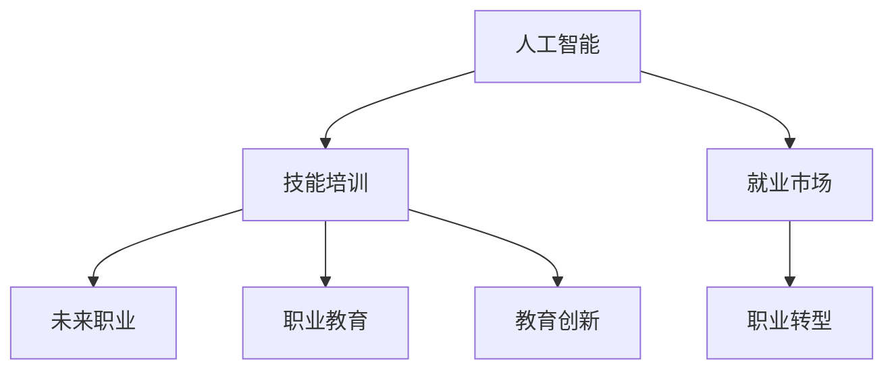

                 

# 人类计算：AI时代的未来技能培训与就业市场趋势

> 关键词：人工智能,技能培训,就业市场,未来职业,AI技术,技能需求,职业教育,教育创新,职业转型

## 1. 背景介绍

### 1.1 问题由来
随着人工智能(AI)技术的迅猛发展，AI时代正加速到来，各行各业正面临前所未有的变革。AI技术的应用不仅提升了效率，还催生了新的工作岗位和职业。这不仅为个人职业发展带来了新的机遇，也给社会就业市场带来了新的挑战。如何培训未来的劳动力适应AI时代，是全球教育系统需要共同面对的重大课题。

### 1.2 问题核心关键点
人工智能对就业市场的影响主要体现在以下几个方面：

- **新岗位的产生**：AI技术催生了许多全新的职业，如数据科学家、机器学习工程师、AI伦理顾问等，为未来的劳动力提供了新的就业方向。
- **现有岗位的变革**：自动化和智能化技术将替代部分传统岗位，但也会创造新的岗位，如AI系统维护、数据标注等。
- **技能要求的提升**：AI技术的应用要求员工具备更强的数据分析、编程和问题解决能力，以及对新兴技术的适应能力。
- **职业路径的多样化**：AI技术的发展打破了传统的职业路径，员工可以更加灵活地跨领域发展，提升职业发展的空间和机会。

### 1.3 问题研究意义
了解AI时代技能培训和就业市场的趋势，对于教育机构、企业、政府和社会各界来说，都具有重要意义：

- **教育机构**：可以通过深入理解AI技术对就业市场的影响，及时调整课程内容，培养适应未来就业需求的人才。
- **企业**：可以更准确地预测人才需求，提前进行人才储备和培训，提升企业的竞争力和创新能力。
- **政府**：可以制定更有效的教育政策和就业指导，促进经济社会的长远发展。
- **社会**：可以帮助公众更好地理解和适应AI时代的变化，提升全社会的数字素养和创新能力。

## 2. 核心概念与联系

### 2.1 核心概念概述

为更好地理解AI时代的技能培训和就业市场趋势，本节将介绍几个密切相关的核心概念：

- **人工智能(Artificial Intelligence, AI)**：通过算法、数据和计算技术模拟人类智能的技术体系，包括机器学习、自然语言处理、计算机视觉等子领域。
- **技能培训(Skill Training)**：通过培训和教育，提升个人在特定领域的知识和技能，使其具备适应AI时代的能力。
- **就业市场(Employment Market)**：指各种岗位的供给和需求情况，受技术进步、经济环境、政策因素等影响。
- **未来职业(Future Jobs)**：指随着AI技术的发展，将会涌现出许多新的职业机会。
- **职业教育(Vocational Education)**：针对特定职业技能的教育，如技术培训、学徒制等，旨在提升职业技能和就业能力。
- **教育创新(Education Innovation)**：通过引入新技术、新方法，提升教育质量和效率，适应AI时代的变化。
- **职业转型(Job Transition)**：指个人在职业生涯中的转行或转岗，适应新兴技术带来的职业变革。

这些核心概念之间的逻辑关系可以通过以下Mermaid流程图来展示：



这个流程图展示了一系列核心概念及其之间的关系：

1. 人工智能技术的发展驱动了对技能培训的需求。
2. 技能培训提升员工的AI适应能力和就业竞争力。
3. 就业市场受到AI技术影响，产生新的职业和岗位需求。
4. 职业教育为员工提供针对AI技术的培训和指导。
5. 教育创新推动教育方式和内容的变革，以适应AI时代的变化。
6. 职业转型帮助员工适应新兴技术和岗位，提升职业发展空间。

这些概念共同构成了AI时代技能培训和就业市场的框架，使我们能够更好地把握未来的发展趋势。

## 3. 核心算法原理 & 具体操作步骤
### 3.1 算法原理概述

在AI时代，技能培训和就业市场的趋势可以通过一系列算法模型来分析和预测。这些算法模型主要包括以下几个方面：

- **数据分析模型**：通过收集和分析大量数据，评估AI技术对就业市场的影响，预测未来职业需求和岗位变化。
- **机器学习模型**：利用机器学习技术，训练模型预测技能培训的需求和效果，为教育机构和企业提供指导。
- **仿真模拟模型**：通过仿真模拟技术，评估不同教育和培训方案的效果，优化教育和培训资源配置。
- **优化算法**：用于优化教育和培训资源的配置，提升培训效果和就业市场匹配度。

### 3.2 算法步骤详解

1. **数据收集**：收集AI技术发展趋势、就业市场变化、技能培训需求等数据。这些数据可以从政府统计局、行业协会、教育机构和企业获取。

2. **数据预处理**：对收集到的数据进行清洗、归一化等处理，确保数据的质量和一致性。

3. **特征工程**：提取关键特征，如行业需求变化、技能需求趋势、教育资源分布等。

4. **模型训练**：使用机器学习算法（如随机森林、支持向量机等）训练模型，预测未来职业需求和技能培训需求。

5. **结果分析**：对模型预测结果进行分析，识别出关键趋势和变化，为教育和培训决策提供支持。

6. **方案优化**：根据分析结果，优化教育和培训方案，提升培训效果和就业匹配度。

### 3.3 算法优缺点

AI时代技能培训和就业市场分析的算法具有以下优点：

- **数据驱动**：利用大数据分析，提供客观、准确的市场趋势预测。
- **高效决策**：通过机器学习算法，快速识别出关键趋势和变化，支持教育和培训决策。
- **动态调整**：仿真模拟和优化算法，动态调整教育和培训方案，提升资源配置效率。

同时，也存在以下局限性：

- **数据质量依赖**：算法结果的准确性依赖于数据的完整性和质量。
- **模型复杂性**：需要构建和维护复杂的机器学习模型，对数据科学家的要求较高。
- **实时性不足**：模型预测结果可能存在延迟，难以实时反映市场变化。

### 3.4 算法应用领域

AI时代技能培训和就业市场分析的算法已经在多个领域得到应用，例如：

- **教育机构**：通过分析就业市场和技能需求，制定适应未来需求的课程设置和培训计划。
- **企业**：通过预测未来职业需求，提前进行人才储备和培训，提升企业竞争力。
- **政府**：通过就业市场分析，制定教育和培训政策，促进经济社会发展。
- **行业协会**：通过技能需求预测，指导行业内的教育和培训方向，提升行业整体水平。

## 4. 数学模型和公式 & 详细讲解 & 举例说明（备注：数学公式请使用latex格式，latex嵌入文中独立段落使用 $$，段落内使用 $)
### 4.1 数学模型构建

假设我们有 $n$ 个行业，每个行业有 $m$ 个岗位。设 $D$ 为当前市场的技能培训需求，$E$ 为未来市场的技能培训需求，$C$ 为当前市场的就业需求，$F$ 为未来市场的就业需求。

我们可以构建以下数学模型：

$$
\min_{\theta} \mathcal{L}(D,E,C,F;\theta)
$$

其中 $\theta$ 为模型参数，$\mathcal{L}$ 为损失函数。

### 4.2 公式推导过程

以机器学习模型为例，推导最小二乘法（Least Squares Regression）的公式。

设 $x$ 为特征向量，$y$ 为预测值，$\epsilon$ 为误差项。最小二乘法求解参数 $\theta$ 的过程如下：

$$
\theta = \arg\min_{\theta} \frac{1}{2N} \sum_{i=1}^N (y_i - \theta^T x_i)^2
$$

对上式求导，得：

$$
\frac{\partial \mathcal{L}}{\partial \theta} = \frac{1}{N} \sum_{i=1}^N (y_i - \theta^T x_i)x_i
$$

将导数置为零，得：

$$
\theta = (X^T X)^{-1} X^T Y
$$

其中 $X$ 为特征矩阵，$Y$ 为预测值矩阵。

### 4.3 案例分析与讲解

假设我们收集了5个行业的技能培训需求数据，每个行业包含3个岗位，每个岗位有50个技能需求。设 $D$ 为当前技能培训需求，$E$ 为未来技能培训需求。

构建机器学习模型，使用最小二乘法求解参数 $\theta$。设特征 $x$ 为技能需求数量，预测值 $y$ 为未来技能培训需求。

通过训练模型，我们可以得到 $\theta$ 的值，从而预测未来技能培训需求的变化趋势。

## 5. 项目实践：代码实例和详细解释说明
### 5.1 开发环境搭建

在进行AI时代技能培训和就业市场分析的项目实践前，我们需要准备好开发环境。以下是使用Python进行机器学习开发的典型环境配置流程：

1. 安装Anaconda：从官网下载并安装Anaconda，用于创建独立的Python环境。

2. 创建并激活虚拟环境：
```bash
conda create -n ml-env python=3.8 
conda activate ml-env
```

3. 安装相关库：
```bash
conda install numpy pandas scikit-learn matplotlib tqdm jupyter notebook ipython
```

4. 安装机器学习库：
```bash
pip install scikit-learn
```

完成上述步骤后，即可在`ml-env`环境中开始机器学习项目开发。

### 5.2 源代码详细实现

下面我们以机器学习模型为例，给出使用Python对技能培训需求进行预测的代码实现。

```python
import numpy as np
from sklearn.linear_model import LinearRegression

# 创建训练数据
X = np.array([[1, 2, 3], [4, 5, 6], [7, 8, 9], [10, 11, 12], [13, 14, 15]])
y = np.array([20, 25, 30, 35, 40])

# 创建模型并进行训练
model = LinearRegression()
model.fit(X, y)

# 预测未来技能培训需求
future_X = np.array([[16, 17, 18], [19, 20, 21]])
predictions = model.predict(future_X)
print(predictions)
```

以上代码展示了使用线性回归模型预测未来技能培训需求的过程。可以看到，通过训练模型，我们可以预测未来技能培训需求的变化趋势，为教育和培训决策提供支持。

### 5.3 代码解读与分析

让我们再详细解读一下关键代码的实现细节：

**训练数据**：
- `X` 为特征矩阵，每行表示一个行业的技能需求数量。
- `y` 为预测值，每行表示对应行业的未来技能培训需求。

**模型训练**：
- 创建线性回归模型 `model`，并使用 `fit` 方法对训练数据进行拟合。

**预测未来需求**：
- `future_X` 为测试数据，包含未来两个行业的技能需求数量。
- `predictions` 为模型预测的未来技能培训需求，通过 `predict` 方法得到。

**代码输出**：
- 打印预测结果，输出未来两个行业的技能培训需求预测值。

可以看到，通过简单的Python代码，我们可以快速构建和训练线性回归模型，对未来技能培训需求进行预测。这样的实践案例展示了机器学习在教育和培训决策中的应用潜力。

## 6. 实际应用场景
### 6.1 智能制造

在智能制造领域，AI技术广泛应用于生产流程的自动化和优化。通过技能培训和教育，提升工人的AI技术应用能力，可以显著提升生产效率和产品质量。

例如，智能制造企业可以针对生产线上常见的自动化问题，进行技能培训和操作手册编写，帮助员工掌握相关技能。此外，企业还可以定期进行技能评估和培训需求分析，确保员工始终具备最新的AI技术应用能力。

### 6.2 医疗健康

在医疗健康领域，AI技术广泛应用于疾病诊断、治疗方案推荐等。通过技能培训和教育，提升医护人员的AI技术应用能力，可以提升医疗服务的质量和效率。

例如，医院可以针对AI辅助诊断系统，开展针对医生的技能培训，提升其对AI诊断结果的解读能力和临床决策能力。此外，医院还可以利用AI技术进行模拟诊疗训练，帮助医护人员提升实战能力。

### 6.3 金融服务

在金融服务领域，AI技术广泛应用于风险评估、客户服务、投资分析等。通过技能培训和教育，提升金融从业人员的AI技术应用能力，可以提升金融服务的智能化水平。

例如，银行和保险公司可以针对AI风险评估系统，开展针对风险管理人员的技能培训，提升其对AI风险评估结果的解读能力和决策能力。此外，金融机构还可以利用AI技术进行模拟交易训练，帮助金融从业人员提升实战能力。

### 6.4 教育培训

在教育培训领域，AI技术广泛应用于个性化学习、智能评估、在线课程开发等。通过技能培训和教育，提升教育从业人员的AI技术应用能力，可以提升教育质量和学习效果。

例如，在线教育平台可以针对AI个性化学习系统，开展针对教师和学生的技能培训，提升其对AI个性化推荐系统的理解和应用能力。此外，教育平台还可以利用AI技术进行模拟教学训练，帮助教师和学生提升实战能力。

## 7. 工具和资源推荐
### 7.1 学习资源推荐

为了帮助开发者系统掌握AI时代技能培训和就业市场的理论基础和实践技巧，这里推荐一些优质的学习资源：

1. **《人工智能导论》**：由斯坦福大学教授吴恩达等编写的教材，深入浅出地介绍了人工智能的基本概念、技术和应用。
2. **Coursera和edX**：提供大量人工智能相关课程，涵盖从入门到高级的多个层次，可以帮助开发者系统掌握AI技术。
3. **Google AI Education**：Google提供的AI教育资源，包括在线课程、工具和教程，覆盖了从基础到高级的多个领域。
4. **Kaggle**：数据科学和机器学习竞赛平台，通过参加比赛，可以提升数据分析和模型构建能力。
5. **GitHub**：开源社区，提供大量机器学习项目的代码实现和文档，可以帮助开发者快速学习和实践AI技术。

通过对这些资源的学习实践，相信你一定能够快速掌握AI时代技能培训和就业市场的精髓，并用于解决实际的AI技术应用问题。

### 7.2 开发工具推荐

高效的开发离不开优秀的工具支持。以下是几款用于AI时代技能培训和就业市场分析开发的常用工具：

1. **Python**：作为目前最流行的编程语言之一，Python拥有丰富的机器学习库和框架，如Scikit-learn、TensorFlow等。
2. **Jupyter Notebook**：交互式的开发环境，支持代码编写、数据可视化、模型训练等。
3. **Git**：版本控制系统，方便团队协作和代码管理。
4. **Keras和PyTorch**：高层次的深度学习框架，提供丰富的预训练模型和训练接口。
5. **Anaconda**：Python环境管理工具，支持多版本管理、包安装和环境配置。
6. **AWS和Google Cloud**：云服务平台，提供强大的计算和存储资源，支持大规模机器学习项目。

合理利用这些工具，可以显著提升AI时代技能培训和就业市场分析任务的开发效率，加快创新迭代的步伐。

### 7.3 相关论文推荐

AI时代技能培训和就业市场的发展源于学界的持续研究。以下是几篇奠基性的相关论文，推荐阅读：

1. **《人工智能的未来》**：提出未来AI技术的发展趋势和应用前景，探讨AI对就业市场的影响。
2. **《人工智能与职业教育》**：探讨AI技术在职业教育中的应用，提出适应未来需求的课程设计和培训方案。
3. **《人工智能与就业市场》**：研究AI技术对就业市场的影响，提出未来就业市场的预测和应对策略。
4. **《人工智能与教育创新》**：探讨AI技术在教育创新中的应用，提出新的教育方式和培训方法。
5. **《人工智能与职业转型》**：研究AI技术对职业转型的影响，提出职业发展的建议和指导。

这些论文代表了大规模人工智能技术的发展脉络。通过学习这些前沿成果，可以帮助研究者把握学科前进方向，激发更多的创新灵感。

## 8. 总结：未来发展趋势与挑战
### 8.1 总结

本文对AI时代技能培训和就业市场的趋势进行了全面系统的介绍。首先阐述了AI技术对就业市场的影响，明确了技能培训和就业市场的关键需求。其次，从原理到实践，详细讲解了机器学习在技能培训和就业市场分析中的应用。最后，探讨了AI技术在多个行业的应用场景，展示了AI时代技能培训和就业市场的发展潜力。

通过本文的系统梳理，可以看到，AI时代技能培训和就业市场的发展前景广阔，需要教育机构、企业、政府和社会各界共同努力，才能实现技术和人才的良性互动，推动经济社会的可持续发展。

### 8.2 未来发展趋势

展望未来，AI时代技能培训和就业市场将呈现以下几个发展趋势：

1. **技能培训的普及化**：随着AI技术的普及，技能培训将成为教育的重要组成部分，覆盖各个年龄段和职业群体。
2. **技能培训的个性化**：通过AI技术，提供个性化的培训方案，满足不同学习者的需求。
3. **就业市场的智能化**：AI技术将广泛应用到招聘、培训、绩效评估等环节，提升人力资源管理的智能化水平。
4. **职业发展的多样化**：AI技术将打破传统职业路径，提供更多的职业选择和发展机会。
5. **职业教育体系的变革**：职业教育将逐步纳入终身学习体系，持续提升技能培训效果。
6. **教育资源的优化配置**：通过AI技术，优化教育资源的配置，提升培训效果和资源利用率。

以上趋势凸显了AI时代技能培训和就业市场的巨大潜力。这些方向的探索发展，将进一步提升教育和培训的质量和效率，推动经济社会的持续发展。

### 8.3 面临的挑战

尽管AI时代技能培训和就业市场的发展前景广阔，但在迈向更加智能化、普适化的过程中，仍面临诸多挑战：

1. **数据质量的保障**：技能培训和就业市场分析依赖于大量的数据，数据质量的保障是关键。如何确保数据的完整性、准确性和及时性，是重要的问题。
2. **算法的透明性和可解释性**：AI模型的透明性和可解释性是提升可信度的重要因素。如何设计透明的算法模型，提高算法的可解释性，是未来的研究方向。
3. **技能培训的标准化**：不同行业和岗位的技能需求各异，如何制定统一的技能培训标准，满足多样化的需求，是重要的课题。
4. **跨领域知识的融合**：AI技术涉及多个学科领域，如何促进不同领域的知识融合，提升AI技术的应用效果，是未来的研究重点。
5. **教育资源的均衡分配**：如何平衡不同地区和群体的教育资源，提升教育的公平性和普惠性，是重要的社会课题。
6. **职业伦理和安全**：AI技术的应用需要遵守伦理和安全的原则，如何保障职业伦理和安全，是重要的研究课题。

这些挑战需要通过多方面的努力来解决，才能实现AI时代技能培训和就业市场的健康发展。

### 8.4 研究展望

面对AI时代技能培训和就业市场的发展挑战，未来的研究需要在以下几个方面寻求新的突破：

1. **数据驱动的培训效果评估**：通过大数据分析，评估培训效果和需求，为培训方案的优化提供支持。
2. **智能化的教育平台**：开发智能化的教育和培训平台，提供个性化的学习体验和实时反馈。
3. **跨领域的知识融合**：促进不同领域知识的融合，提升AI技术的应用效果。
4. **伦理和安全的教育技术**：研究AI技术的伦理和安全性问题，确保技术的健康应用。
5. **教育资源的均衡分配**：通过政策和技术手段，提升教育资源的均衡分配，促进教育的公平性和普惠性。

这些研究方向的探索，将进一步推动AI时代技能培训和就业市场的发展，提升全社会的数字素养和创新能力，为经济社会的可持续发展提供有力支持。

## 9. 附录：常见问题与解答

**Q1：AI技术对就业市场有哪些具体影响？**

A: AI技术对就业市场的影响主要体现在以下几个方面：

1. **岗位替代**：自动化和智能化技术将替代部分传统岗位，如生产线工人、客服、数据分析等。
2. **岗位创造**：AI技术催生了许多全新的职业，如数据科学家、机器学习工程师、AI伦理顾问等。
3. **技能需求变化**：AI技术的应用要求员工具备更强的数据分析、编程和问题解决能力，以及对新兴技术的适应能力。
4. **职业路径多样化**：AI技术打破了传统的职业路径，员工可以更加灵活地跨领域发展，提升职业发展的空间和机会。

**Q2：如何进行技能培训和职业转型？**

A: 技能培训和职业转型的关键在于：

1. **持续学习**：终身学习是适应AI时代的关键，通过不断学习和培训，提升自身技能和知识水平。
2. **跨领域技能**：培养跨领域技能，如数据分析、编程、AI应用等，提升自身竞争力。
3. **专业认证**：通过获得专业认证，提升自身专业能力和市场竞争力。
4. **职业规划**：制定职业规划，明确职业目标和路径，有针对性地进行技能培训和职业转型。
5. **行业协会**：加入行业协会，获取最新的行业资讯和培训资源，提升自身职业发展。

**Q3：如何提升AI技术的可解释性？**

A: 提升AI技术的可解释性需要从以下几个方面进行：

1. **透明模型设计**：设计透明的算法模型，确保模型的决策过程可解释。
2. **可解释技术**：引入可解释技术，如LIME、SHAP等，解释模型的决策过程和结果。
3. **用户反馈**：通过用户反馈，优化模型的决策过程，提升模型的可解释性。
4. **跨学科研究**：结合心理学、伦理学、社会学等学科知识，提升模型的可解释性。

**Q4：如何保障职业伦理和安全？**

A: 保障职业伦理和安全的措施包括：

1. **伦理培训**：开展职业伦理培训，提升员工的伦理意识和规范行为。
2. **安全规范**：制定和遵守安全规范，确保技术应用的合法性和安全性。
3. **隐私保护**：保护用户隐私和数据安全，避免数据泄露和滥用。
4. **技术审查**：进行技术审查，确保技术的健康应用，避免伦理和法律风险。

**Q5：未来教育资源的均衡分配有哪些方向？**

A: 未来教育资源的均衡分配可以从以下几个方向进行：

1. **政策支持**：制定和实施教育政策，支持欠发达地区的教育资源建设。
2. **技术支持**：通过技术手段，如在线教育、远程教育等，提升教育资源的普及率。
3. **资金投入**：增加对教育资源的资金投入，提升教育资源的配置和利用效率。
4. **教育公平**：推动教育公平，缩小城乡、区域之间的教育差距。
5. **社会参与**：鼓励社会各界参与教育资源的建设，提升教育资源的供给和质量。

---

作者：禅与计算机程序设计艺术 / Zen and the Art of Computer Programming

