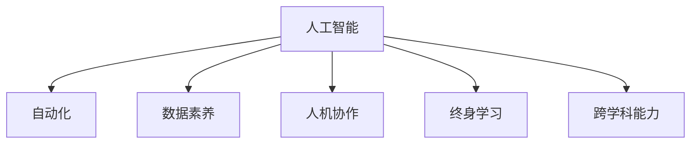

                 

# 人类计算：AI时代的未来技能需求与培训发展

## 1. 背景介绍

在人工智能(AI)技术的迅猛发展下，社会各个领域正经历深刻的变革。AI技术的广泛应用不仅改变了生产方式、商业模式，也极大地提升了工作效率和生活质量。然而，技术的进步也带来了一系列挑战，尤其是对于劳动力市场的影响。AI时代，人类计算的需求和技能需求发生了根本性的变化，这也对教育培训体系提出了新的要求。

### 1.1 问题由来

随着AI技术的普及，许多重复性、机械性的工作被自动化取代。这些工作主要依赖人类的基本计算能力，如逻辑推理、数据处理、模式识别等。AI的介入，使这些任务变得更加高效，但也导致一些传统职业的消失。此外，AI系统的复杂性和专业性，也要求从业者具备更高的技术技能和跨学科能力。

在医疗、金融、制造等行业，AI系统正在逐渐承担起辅助决策、预测分析、异常检测等任务。这些任务需要人类从业者具备处理和解释AI输出、进行专业判断和干预的能力。然而，现有教育和培训体系中，相关技能的培养明显滞后于技术的发展速度。

### 1.2 问题核心关键点

AI时代的技能需求变革主要体现在以下几个方面：

1. **跨学科能力**：未来的从业者需要具备跨学科的知识和技能，能够将不同领域的知识和方法整合应用，解决复杂问题。
2. **数据素养**：掌握数据采集、处理、分析和解释的能力，理解数据的来源、质量和局限性，并能够使用AI工具进行有效的数据分析。
3. **人机协作**：能够在人与AI系统的协作中，发挥各自优势，实现最优决策。
4. **创新思维**：具备创新和解决问题的能力，能够在不断变化的环境中，发现新机会，设计新方案。
5. **伦理道德**：理解和应用AI技术的伦理原则，确保技术的社会责任和公平性。
6. **终身学习**：具备持续学习和自我提升的能力，适应技术的快速变化和要求。

这些关键技能不仅关乎职业发展，也影响到个人生活质量和社会公平。因此，教育培训体系需要及时调整，以应对AI时代的技能需求变化。

## 2. 核心概念与联系

### 2.1 核心概念概述

为更好地理解AI时代人类计算的需求和培训发展，本节将介绍几个密切相关的核心概念：

- **人工智能(AI)**：一种能够模拟人类智能的技术，包括学习、推理、感知、自然语言处理等能力。
- **自动化**：通过使用机器人和软件系统，自动完成一些任务，减少人为操作，提高效率。
- **数据素养**：理解和处理数据的能力，包括数据收集、清洗、分析、解释等。
- **人机协作**：人与机器系统的协作，充分发挥各自优势，实现最优决策。
- **终身学习**：持续学习和自我提升的能力，适应技术和环境的变化。
- **跨学科能力**：将不同学科的知识和方法整合应用，解决复杂问题。

这些核心概念之间的逻辑关系可以通过以下Mermaid流程图来展示：



这个流程图展示了大语言模型的核心概念及其之间的关系：

1. AI技术推动自动化，使得许多重复性工作可以被机器替代。
2. 数据素养是理解和应用AI技术的基础，要求从业者具备数据分析的能力。
3. 人机协作是AI时代的重要特征，要求从业者能够与AI系统有效互动。
4. 终身学习是应对技术变化的关键，要求从业者持续提升自身技能。
5. 跨学科能力是解决复杂问题的必备技能，要求从业者具备整合不同领域知识的能力。

这些概念共同构成了AI时代的技术和职业环境，对人类计算提出了新的要求。

## 3. 核心算法原理 & 具体操作步骤
### 3.1 算法原理概述

AI时代的技能需求变革，要求教育培训体系重新设计和实施。以下是基于技能需求变革的核心算法原理：

1. **数据驱动**：以数据为驱动，培养从业者的数据素养，使其具备处理和分析数据的能力。
2. **人机协作**：通过模拟人机协作场景，培养从业者与AI系统的互动能力，理解其工作机制和输出。
3. **跨学科整合**：设计跨学科的课程和项目，培养从业者的整合应用不同学科知识的能力。
4. **创新思维**：引入创新设计思维课程，培养从业者的创新和解决问题的能力。
5. **伦理道德**：融入伦理道德课程，培养从业者的社会责任感和伦理判断能力。
6. **终身学习**：通过在线学习平台和开放教育资源，支持从业者的持续学习和自我提升。

### 3.2 算法步骤详解

基于技能需求变革的核心算法原理，培训体系的构建步骤主要包括：

**Step 1: 需求分析**
- 分析AI时代各行业对从业者的技能需求，确定培训目标。
- 调研行业内AI应用现状，了解实际工作场景和要求。
- 确定培训项目的重点和难点，制定详细的培训计划。

**Step 2: 课程设计**
- 设计跨学科的课程，涵盖数据素养、人机协作、跨学科能力等多个方面。
- 引入创新思维和伦理道德课程，培养从业者的综合素质。
- 利用在线学习平台和开放教育资源，支持从业者的自主学习。

**Step 3: 实施培训**
- 组织行业专家和教育工作者共同开发培训课程和教材。
- 采用线上线下结合的方式，实施培训项目。
- 引入模拟人机协作场景，提升从业者的实际应用能力。

**Step 4: 评估与反馈**
- 定期评估培训效果，收集从业者的反馈意见。
- 调整和优化培训计划，确保培训内容的时效性和有效性。
- 建立持续学习机制，支持从业者的终身学习。

### 3.3 算法优缺点

AI时代的技能需求变革，对培训体系的构建具有以下优点：

1. **灵活性高**：通过跨学科课程和在线资源，满足不同行业和岗位的需求。
2. **覆盖面广**：涵盖数据素养、人机协作、跨学科能力等多个方面，提升从业者的综合素质。
3. **时效性强**：结合行业现状和实际工作需求，确保培训内容的前沿性和实用性。
4. **支持终身学习**：通过开放教育资源和在线学习平台，支持从业者的持续学习和自我提升。

同时，该方法也存在一定的局限性：

1. **资源投入大**：跨学科课程和在线资源需要较大的资源投入，初期成本较高。
2. **实施难度高**：需要行业专家和教育工作者的紧密合作，协调一致。
3. **效果评估难**：培训效果难以量化，需要建立科学的评估指标和机制。
4. **学习动力弱**：终身学习需要从业者具备较强的自我驱动力，部分从业者可能难以适应。

尽管存在这些局限性，但就目前而言，基于技能需求变革的培训方法仍是最主流范式。未来相关研究的重点在于如何进一步降低培训成本，提高培训效果，同时兼顾终身学习动力和效果评估。

### 3.4 算法应用领域

基于技能需求变革的培训方法，在教育、医疗、金融、制造等行业均已得到应用，取得了显著效果。

1. **教育领域**：通过设计跨学科课程和引入AI工具，培养学生的数据素养、人机协作能力和创新思维。利用在线学习平台和开放教育资源，支持学生的自主学习和持续发展。
2. **医疗领域**：通过模拟人机协作场景，培养医生与AI系统的互动能力，提升诊断和治疗水平。引入伦理道德课程，提升医生的社会责任感和伦理判断能力。
3. **金融领域**：通过数据驱动的课程，培养金融从业者的数据素养和分析能力，提升风险控制和决策水平。引入创新思维和伦理道德课程，培养从业者的综合素质。
4. **制造领域**：通过跨学科课程，培养工程师的整合应用不同学科知识的能力，提升设计和生产效率。引入人机协作课程，提升工程师与机器人系统的互动能力。

除了上述这些主要领域，基于技能需求变革的培训方法也在更多行业中得到推广和应用，为AI时代的劳动力市场提供了新的方向和动力。

## 4. 数学模型和公式 & 详细讲解 & 举例说明（备注：数学公式请使用latex格式，latex嵌入文中独立段落使用 $$，段落内使用 $)
### 4.1 数学模型构建

在AI时代的技能需求变革背景下，培训体系的构建需要数学模型来指导课程设计和实施。以下是基于技能需求变革的核心数学模型：

**目标函数**：

$$
\maximize \sum_{i=1}^n \eta_i \cdot F_i
$$

其中 $F_i$ 为第 $i$ 个技能对工作绩效的贡献度，$\eta_i$ 为该技能的学习成本。目标函数表示在保证培训效果的前提下，最大化培训投资回报。

**约束条件**：

$$
\sum_{i=1}^n \eta_i \leq C
$$

其中 $C$ 为总培训预算，表示培训成本不得超过预算上限。

**优化目标**：

在给定的培训预算和技能需求下，通过优化学习资源分配，最大化培训效果。

### 4.2 公式推导过程

在上述数学模型中，$F_i$ 的计算可以分为两个部分：

1. **技能贡献度**：根据技能对工作绩效的直接影响和间接影响，计算其贡献度。
2. **学习成本**：根据技能的学习时间、难度和培训资源需求，计算其学习成本。

**技能贡献度计算**：

$$
F_i = f_i \cdot S_i \cdot P_i
$$

其中 $f_i$ 为技能 $i$ 的直接影响系数，$S_i$ 为技能 $i$ 在工作中的使用频率，$P_i$ 为技能 $i$ 的绩效提升系数。

**学习成本计算**：

$$
\eta_i = e_i \cdot T_i \cdot R_i
$$

其中 $e_i$ 为技能 $i$ 的难度系数，$T_i$ 为技能 $i$ 的学习时间，$R_i$ 为技能 $i$ 的培训资源需求。

### 4.3 案例分析与讲解

以医疗领域为例，分析基于技能需求变革的培训模型应用：

**需求分析**：
- 确定医生需要掌握的技能，如数据处理、影像诊断、机器人操作等。
- 调研医疗行业对AI系统的应用现状，确定技能需求。
- 制定详细的培训计划，明确各技能的学习目标和预算。

**课程设计**：
- 设计跨学科课程，涵盖数据处理、影像诊断、机器人操作等多个方面。
- 引入创新思维和伦理道德课程，培养医生的综合素质。
- 利用在线学习平台和开放教育资源，支持医生的自主学习。

**实施培训**：
- 组织行业专家和教育工作者共同开发培训课程和教材。
- 采用线上线下结合的方式，实施培训项目。
- 引入模拟人机协作场景，提升医生的实际应用能力。

**评估与反馈**：
- 定期评估培训效果，收集医生的反馈意见。
- 调整和优化培训计划，确保培训内容的时效性和有效性。
- 建立持续学习机制，支持医生的终身学习。

## 5. 项目实践：代码实例和详细解释说明
### 5.1 开发环境搭建

在进行培训项目实践前，我们需要准备好开发环境。以下是使用Python进行项目开发的初步环境配置流程：

1. 安装Python：从官网下载并安装Python，确保版本在3.8及以上。
2. 安装Pip：从官网下载并安装Pip，用于管理Python包。
3. 安装相关库：安装numpy、pandas、matplotlib、jupyter等常用库，用于数据处理和可视化。

完成上述步骤后，即可在Python环境中开始项目开发。

### 5.2 源代码详细实现

我们以一个简单的数据素养培训项目为例，展示如何使用Python进行培训效果的评估。

首先，定义数据素养培训项目的核心技能：

```python
# 定义数据素养培训项目核心技能
skills = ['数据收集', '数据清洗', '数据分析', '数据可视化']
```

然后，定义每个技能的贡献度和学习成本：

```python
# 定义每个技能的贡献度和学习成本
skill_contributions = {
    '数据收集': 0.6,
    '数据清洗': 0.8,
    '数据分析': 0.7,
    '数据可视化': 0.5
}

skill_costs = {
    '数据收集': 10,
    '数据清洗': 12,
    '数据分析': 14,
    '数据可视化': 15
}
```

接着，计算每个技能的总贡献度和总成本：

```python
# 计算每个技能的总贡献度和总成本
total_contributions = sum([skill_contributions[skill] * frequency[skill] for skill in skills])
total_costs = sum([skill_costs[skill] * frequency[skill] for skill in skills])
```

最后，根据目标函数和约束条件，优化培训资源的分配：

```python
# 定义目标函数和约束条件
from scipy.optimize import linprog
from scipy.sparse import lil_matrix

# 构建约束矩阵
constraint_matrix = lil_matrix((len(skills), len(skills)))
for i in range(len(skills)):
    constraint_matrix[i, i] = -1
    constraint_matrix[i, i] = 1

# 定义优化目标
c = [skill_contributions[skill] for skill in skills]
A_ub = constraint_matrix.toarray()
b_ub = total_costs

# 求解优化问题
result = linprog(c, A_ub=A_ub, b_ub=b_ub, bounds=(0, None), method='simplex')

# 输出优化结果
print(f"优化结果：{result}")
```

在上述代码中，我们使用SciPy库中的linprog函数求解优化问题，通过目标函数和约束条件，最大化培训效果的同时控制培训成本。通过不断调整技能频率和预算，可以实现最佳的培训资源分配。

### 5.3 代码解读与分析

让我们再详细解读一下关键代码的实现细节：

**技能列表**：
- 定义数据素养培训项目需要掌握的核心技能。

**贡献度和成本**：
- 定义每个技能的贡献度和学习成本，用于计算总贡献度和总成本。

**目标函数和约束条件**：
- 构建约束矩阵，表示技能之间的相互关系和约束条件。
- 定义优化目标，计算每个技能的总贡献度和总成本。
- 使用linprog函数求解优化问题，返回最优的培训资源分配方案。

**优化结果**：
- 输出优化结果，展示最佳的培训资源分配方案。

可以看到，Python和SciPy库使得培训效果的优化评估变得简单高效。开发者可以根据实际情况，灵活调整模型参数，得到最优的培训方案。

## 6. 实际应用场景
### 6.1 医疗领域

在医疗领域，基于技能需求变革的培训方法可以广泛应用于医生的数据素养、影像诊断、机器人操作等多个方面。

通过设计跨学科课程，培养医生与AI系统的互动能力，提升诊断和治疗水平。引入伦理道德课程，提升医生的社会责任感和伦理判断能力。通过模拟人机协作场景，提升医生的实际应用能力。

### 6.2 金融领域

在金融领域，数据素养和分析能力是基础要求。通过数据驱动的课程，培养金融从业者的数据素养和分析能力，提升风险控制和决策水平。引入创新思维和伦理道德课程，培养从业者的综合素质。

### 6.3 教育领域

在教育领域，通过设计跨学科课程和引入AI工具，培养学生的数据素养、人机协作能力和创新思维。利用在线学习平台和开放教育资源，支持学生的自主学习和持续发展。

### 6.4 未来应用展望

随着AI技术的不断发展，基于技能需求变革的培训方法将在更多领域得到应用，为AI时代的劳动力市场提供新的方向和动力。

在智慧医疗领域，基于技能需求变革的培训方法可以帮助医生更好地适应AI技术，提升诊断和治疗水平。

在智能制造领域，通过跨学科课程和模拟人机协作场景，培养工程师的整合应用不同学科知识的能力，提升设计和生产效率。

在智能交通领域，培养从业者的数据分析和智能决策能力，提升交通管理的智能化水平。

此外，在智慧城市、智慧农业、智慧能源等众多领域，基于技能需求变革的培训方法也将不断涌现，为AI时代的各个行业提供新的技术动力。

## 7. 工具和资源推荐
### 7.1 学习资源推荐

为了帮助开发者系统掌握技能需求变革的理论基础和实践技巧，这里推荐一些优质的学习资源：

1. **《人工智能导论》**：介绍AI技术的基本概念和应用，帮助从业者理解AI技术的基础原理。
2. **Coursera和edX**：提供丰富的AI和数据素养课程，涵盖从基础到高级的内容。
3. **Kaggle**：通过实际项目和竞赛，帮助从业者提升数据处理和分析能力。
4. **Google AI教育平台**：提供AI工具和开源代码，支持从业者的实践学习和项目开发。
5. **Udacity**：提供多门AI和数据科学课程，涵盖跨学科能力和创新思维的培养。

通过对这些资源的学习实践，相信你一定能够快速掌握技能需求变革的精髓，并用于解决实际的培训问题。

### 7.2 开发工具推荐

高效的开发离不开优秀的工具支持。以下是几款用于技能需求变革培训开发的常用工具：

1. **Python**：基于Python的开源深度学习框架，灵活动态的计算图，适合快速迭代研究。
2. **Jupyter Notebook**：支持Python、R等语言的开发环境，提供交互式编程和结果展示。
3. **Matplotlib和Seaborn**：数据可视化工具，支持绘制图表和统计分析。
4. **SciPy和Pandas**：数据处理和分析工具，支持数据清洗、转换和统计分析。
5. **TensorFlow和PyTorch**：深度学习框架，支持构建和训练AI模型。

合理利用这些工具，可以显著提升培训项目开发和评估的效率，加快创新迭代的步伐。

### 7.3 相关论文推荐

技能需求变革的研究源于学界的持续研究。以下是几篇奠基性的相关论文，推荐阅读：

1. **《数据驱动的学习与推理：人工智能教育的新范式》**：提出基于数据驱动的教育模型，强调数据素养和分析能力的重要性。
2. **《人机协作的未来：技能需求变革下的教育培训新模式》**：探讨人机协作对教育培训的影响，提出跨学科能力和创新思维的培养方法。
3. **《人工智能与终身学习：教育体系的未来展望》**：分析AI技术对教育体系的影响，提出终身学习机制的构建策略。
4. **《基于技能需求变革的教育培训系统设计》**：提出基于技能需求变革的教育培训系统设计方案，支持跨学科课程和在线学习。
5. **《创新思维与伦理道德：AI时代教育培训的新方向》**：探讨创新思维和伦理道德在AI教育中的应用，提出培养综合素质的教育模式。

这些论文代表了大语言模型微调技术的发展脉络。通过学习这些前沿成果，可以帮助研究者把握学科前进方向，激发更多的创新灵感。

## 8. 总结：未来发展趋势与挑战
### 8.1 总结

本文对基于技能需求变革的培训方法进行了全面系统的介绍。首先阐述了AI时代技能需求变革的背景和意义，明确了培训体系的构建目标。其次，从原理到实践，详细讲解了基于技能需求变革的培训模型的构建步骤，给出了培训项目开发的完整代码实例。同时，本文还广泛探讨了基于技能需求变革的培训方法在医疗、金融、教育等多个行业领域的应用前景，展示了其巨大的潜力。此外，本文精选了培训技术的各类学习资源，力求为读者提供全方位的技术指引。

通过本文的系统梳理，可以看到，基于技能需求变革的培训方法正在成为AI时代的重要范式，极大地拓展了从业者的技能边界，催生了更多的职业机会。未来，伴随技能需求变革的持续演进，基于AI的培训体系也将更加完善，为AI时代的职业发展提供坚实的基础。

### 8.2 未来发展趋势

展望未来，技能需求变革的培训方法将呈现以下几个发展趋势：

1. **数据驱动的个性化培训**：基于从业者的学习行为和反馈数据，提供个性化的培训方案，最大化培训效果。
2. **跨学科能力的整合**：设计更加跨学科的课程，培养从业者的整合应用不同学科知识的能力。
3. **持续学习的支持**：利用在线学习平台和开放教育资源，支持从业者的终身学习和持续发展。
4. **人机协作的深入**：通过模拟人机协作场景，提升从业者与AI系统的互动能力，理解其工作机制和输出。
5. **创新思维的培养**：引入创新设计思维课程，培养从业者的创新和解决问题的能力。
6. **伦理道德的重视**：融入伦理道德课程，提升从业者的社会责任感和伦理判断能力。

这些趋势凸显了技能需求变革培训方法的广阔前景。这些方向的探索发展，必将进一步提升培训体系的灵活性和实用性，为AI时代的职业发展提供坚实的基础。

### 8.3 面临的挑战

尽管基于技能需求变革的培训方法已经取得了瞩目成就，但在迈向更加智能化、普适化应用的过程中，它仍面临诸多挑战：

1. **资源投入大**：跨学科课程和在线资源需要较大的资源投入，初期成本较高。
2. **实施难度高**：需要行业专家和教育工作者的紧密合作，协调一致。
3. **效果评估难**：培训效果难以量化，需要建立科学的评估指标和机制。
4. **学习动力弱**：终身学习需要从业者具备较强的自我驱动力，部分从业者可能难以适应。
5. **技术更新快**：AI技术的快速发展要求培训内容不断更新，培训体系的灵活性有待提高。

尽管存在这些挑战，但就目前而言，基于技能需求变革的培训方法仍是最主流范式。未来相关研究的重点在于如何进一步降低培训成本，提高培训效果，同时兼顾终身学习动力和效果评估。

### 8.4 研究展望

面对技能需求变革培训方法所面临的挑战，未来的研究需要在以下几个方面寻求新的突破：

1. **数据驱动的个性化学习**：结合大数据和机器学习技术，根据从业者的学习行为和反馈数据，提供个性化的培训方案。
2. **跨学科能力的整合**：设计更加跨学科的课程，通过项目实践和案例分析，培养从业者的整合应用不同学科知识的能力。
3. **持续学习机制的建立**：利用在线学习平台和开放教育资源，支持从业者的持续学习和自我提升。
4. **人机协作的深入**：通过模拟人机协作场景，提升从业者与AI系统的互动能力，理解其工作机制和输出。
5. **创新思维的培养**：引入创新设计思维课程，培养从业者的创新和解决问题的能力。
6. **伦理道德的重视**：融入伦理道德课程，提升从业者的社会责任感和伦理判断能力。

这些研究方向的探索，必将引领基于技能需求变革的培训方法迈向更高的台阶，为AI时代的职业发展提供更加坚实的基础。相信随着学界和产业界的共同努力，这些挑战终将一一被克服，培训体系也将更加完善，为AI时代的职业发展提供坚实的基础。

## 9. 附录：常见问题与解答

**Q1：基于技能需求变革的培训方法是否适用于所有行业？**

A: 基于技能需求变革的培训方法适用于大多数行业，特别是那些对数据素养和跨学科能力要求较高的领域。但对于一些传统行业，可能需要结合行业特点进行适当调整。例如，制造业可能需要更多的实操训练和技能测试，而医疗行业则需要更多的人机协作和伦理道德培训。

**Q2：如何选择合适的培训项目？**

A: 选择合适的培训项目需要考虑以下几个因素：
1. 行业需求：根据行业特点和实际工作需求，选择相关的培训课程。
2. 技能差距：分析从业者的技能现状，确定培训的重点和难点。
3. 预算限制：在培训预算范围内，选择最有效的培训项目。
4. 学习效果：评估培训项目的实际效果，选择最适合的培训方案。

**Q3：培训项目实施过程中需要注意哪些问题？**

A: 实施培训项目时，需要注意以下几个问题：
1. 培训内容：确保培训内容的时效性和实用性，结合行业现状和实际工作需求。
2. 师资力量：确保培训师资的专业性和教学质量，选择经验丰富的行业专家和教育工作者。
3. 培训方式：采用线上线下结合的方式，提供灵活的学习方式，满足不同从业者的需求。
4. 学习支持：提供学习支持和辅导，帮助从业者克服学习困难，提高学习效果。

**Q4：培训项目结束后如何评估培训效果？**

A: 评估培训效果可以通过以下方式：
1. 学习评估：通过测试和考试，评估从业者的知识掌握情况。
2. 行为观察：通过实际工作表现，观察培训效果的转化情况。
3. 反馈调查：收集从业者的反馈意见，了解培训项目的优缺点。
4. 绩效分析：分析培训后的工作绩效变化，评估培训的实际效果。

**Q5：培训项目结束后如何支持从业者的持续学习？**

A: 支持从业者的持续学习可以采取以下措施：
1. 在线学习平台：提供在线学习资源和课程，支持从业者的自主学习。
2. 开放教育资源：提供开放教育资源，如公开课、电子书、研究论文等，支持从业者的持续学习。
3. 学习社区：建立学习社区，促进从业者之间的交流和分享，共同提升学习效果。
4. 持续培训：定期开展培训和研讨，更新培训内容，保持培训的时效性和前沿性。

这些措施可以显著提升从业者的学习动力和效果，支持其终身学习和持续发展。

---

作者：禅与计算机程序设计艺术 / Zen and the Art of Computer Programming

