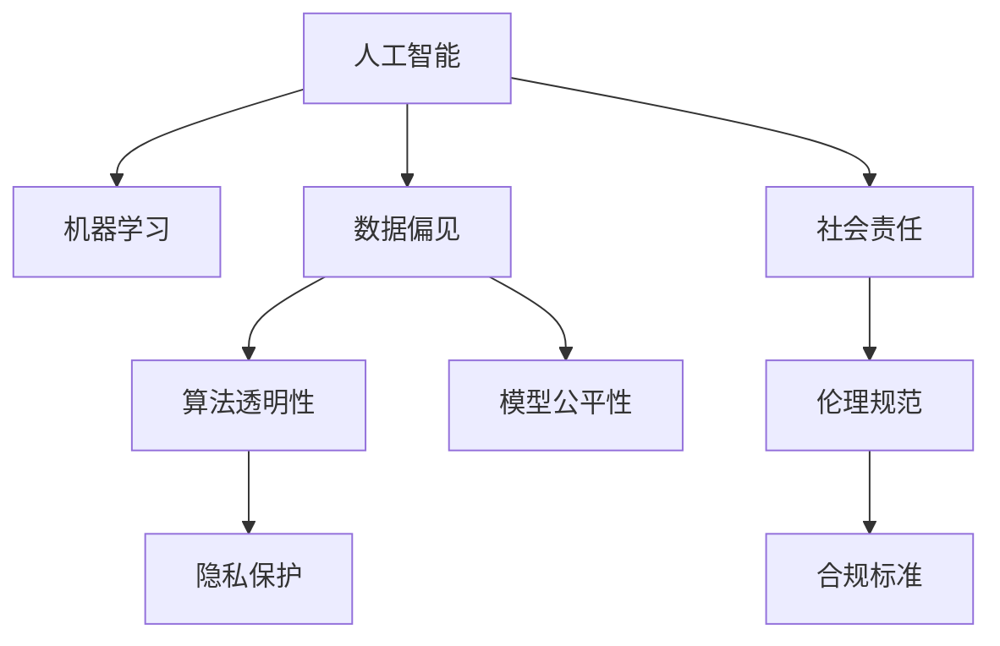

                 

# 人类计算：伦理和社会责任

> 关键词：人工智能,机器学习,计算机伦理,社会责任,人类计算

## 1. 背景介绍

### 1.1 问题由来
随着人工智能（AI）技术的迅猛发展，机器学习和深度学习等算法在多个领域展现了卓越的性能。然而，在享受这些技术带来的便利的同时，我们也面临着一系列伦理和社会责任问题。这些问题涉及隐私保护、数据偏见、算法透明性、模型公平性等方面，引发了广泛的社会关注和学术讨论。

### 1.2 问题核心关键点
当前，AI领域的伦理和社会责任问题主要集中在以下几个方面：

1. **隐私保护**：AI系统需要处理大量个人数据，如何确保这些数据的安全和隐私是一个重要问题。
2. **数据偏见**：训练数据中可能存在的偏见可能导致模型输出也存在偏见，进而影响公平性。
3. **算法透明性**：如何使AI模型的决策过程透明，让使用者理解模型的行为，是提高模型可信度的关键。
4. **模型公平性**：AI系统在做出决策时，应确保不同群体之间的公平性，避免歧视。
5. **社会影响**：AI技术的广泛应用可能会对就业、社会结构、经济格局等方面产生深远影响，需要考虑其长期影响和应对策略。

### 1.3 问题研究意义
研究AI技术的伦理和社会责任，对于确保AI技术的健康发展，保障公众利益，具有重要意义：

1. **促进公平公正**：通过研究和应用伦理规范，可以确保AI系统在各个层面上实现公平公正，避免数据偏见和算法歧视。
2. **增强社会信任**：透明、可解释的AI系统可以提升公众对AI技术的信任度，促进其广泛应用。
3. **引导规范创新**：明确伦理和社会责任要求，可以引导AI技术的创新方向，避免误导性应用。
4. **应对潜在风险**：通过提前研究和预判AI技术的潜在风险，可以制定相应的应对策略，保障技术应用的安全性和可靠性。
5. **推动伦理教育**：加强对AI伦理和社会责任的教育，可以培养更多具备责任感的AI从业人员。

## 2. 核心概念与联系

### 2.1 核心概念概述

为了更好地理解AI技术的伦理和社会责任，本节将介绍几个关键概念：

- **人工智能（AI）**：涉及计算机科学的多个领域，包括机器学习、自然语言处理、计算机视觉等。
- **机器学习（ML）**：一种使计算机系统能够通过数据和经验自动改进的技术。
- **数据偏见（Bias）**：训练数据中存在的对某些群体的偏好或歧视，可能导致AI系统的输出偏向特定群体。
- **算法透明性（Transparency）**：指AI系统的决策过程是否清晰、可理解，以确保其决策逻辑的合理性和公正性。
- **模型公平性（Fairness）**：指AI系统在处理不同群体数据时，是否能够实现平等对待，避免偏见和歧视。
- **隐私保护（Privacy）**：指保护个人数据不被未经授权的访问和使用，保障用户隐私权。

这些概念之间的关系可以通过以下Mermaid流程图来展示：



这个流程图展示了人工智能、机器学习等核心概念及其与数据偏见、算法透明性、模型公平性、隐私保护等伦理和社会责任问题的联系。

## 3. 核心算法原理 & 具体操作步骤
### 3.1 算法原理概述

AI技术的伦理和社会责任问题主要围绕数据处理、模型训练和应用部署等环节展开。其核心思想是通过算法设计和伦理约束，确保AI系统的决策过程透明、公平，并尊重用户隐私。

### 3.2 算法步骤详解

AI伦理和社会责任的实现，通常包括以下几个关键步骤：

**Step 1: 数据采集与处理**
- 确保数据采集过程符合隐私保护要求，避免未经授权的个人信息收集。
- 对数据进行去噪、清洗，处理缺失值和异常值，确保数据质量。
- 在数据预处理过程中，识别并处理可能存在的偏见，如性别、种族、年龄等方面的偏见。

**Step 2: 模型设计与训练**
- 设计透明的算法架构，确保模型决策过程可解释。
- 使用公平性指标，如准确率、召回率、F1分数等，评估模型的公平性。
- 引入数据增强、对抗训练等技术，增强模型的鲁棒性和泛化能力。

**Step 3: 模型部署与监控**
- 在模型部署前，进行充分的测试和验证，确保模型性能满足要求。
- 在模型应用过程中，持续监控模型的输出和行为，及时发现和纠正异常情况。
- 定期更新模型和算法，应对新出现的伦理和社会责任问题。

**Step 4: 社会影响评估**
- 对AI系统可能带来的社会影响进行评估，包括就业、安全、公平等方面。
- 制定应对策略，确保AI系统的应用不会对社会造成负面影响。
- 通过社会调研和公众参与，了解社会对AI系统的接受度和需求。

### 3.3 算法优缺点

AI技术的伦理和社会责任实现，具有以下优点：

1. **提升公众信任**：透明的算法和公平的模型，有助于增强公众对AI技术的信任。
2. **保障公平公正**：通过设计公平的评估指标和透明的政策，可以确保AI系统在不同群体之间实现公平。
3. **避免潜在风险**：早期识别和应对伦理问题，可以避免AI系统在应用过程中带来的潜在风险。

同时，该方法也存在一定的局限性：

1. **技术复杂性**：实现伦理和社会责任目标需要复杂的技术手段，增加了系统设计和实施的难度。
2. **资源投入大**：保障隐私、公平、透明等要求，可能需要大量的人力和物力投入。
3. **效果不确定**：即使采取了诸多措施，仍然无法完全消除所有伦理问题，仍需持续改进。

尽管存在这些局限性，但就目前而言，在AI系统的设计和应用中，伦理和社会责任的考量已成为不可或缺的一部分。

### 3.4 算法应用领域

AI技术的伦理和社会责任原则，在多个领域得到了广泛应用，例如：

1. **医疗健康**：确保患者数据隐私和安全，避免算法偏见，确保医疗决策的公平性。
2. **金融服务**：保障金融数据的隐私保护，避免算法偏见，确保信贷和保险等服务的公平性。
3. **教育培训**：保护学生的隐私数据，避免算法偏见，确保教育资源的公平分配。
4. **智能城市**：确保公共数据的安全和隐私，避免算法偏见，确保智能交通、安防等应用的公平性。
5. **自动驾驶**：保障行人和车辆的安全，避免算法偏见，确保自动驾驶系统的公平性和可靠性。

这些应用领域展示了AI技术在实现伦理和社会责任目标方面的重要性和必要性。

## 4. 数学模型和公式 & 详细讲解 & 举例说明（备注：数学公式请使用latex格式，latex嵌入文中独立段落使用 $$，段落内使用 $)
### 4.1 数学模型构建

本节将使用数学语言对AI技术的伦理和社会责任实现过程进行更加严格的刻画。

设AI系统的输入为 $x \in \mathbb{R}^n$，输出为 $y \in \mathbb{R}^m$，其中 $n$ 和 $m$ 分别为输入和输出维度。假设模型的决策函数为 $f(x; \theta)$，其中 $\theta$ 为模型参数。

模型的公平性可以通过设计一组公平性指标来衡量，如准确率 $P(A)$、召回率 $R(A)$ 和 F1分数 $F_1(A)$，其中 $A$ 表示某一特定群体。模型的隐私保护可以通过数据加密和差分隐私等技术实现。模型的透明度可以通过设计可解释的模型结构和算法，使模型决策过程透明化。

### 4.2 公式推导过程

以医疗领域为例，假设AI系统用于诊断疾病的风险预测。模型的输出为疾病风险 $y \in [0,1]$，其中 $y=1$ 表示高风险，$y=0$ 表示低风险。模型的决策函数为：

$$
f(x; \theta) = \sigma(\sum_{i=1}^n w_i x_i + b)
$$

其中 $\sigma$ 为sigmoid函数，$w$ 和 $b$ 为模型参数。

为了确保模型的公平性，可以使用不同群体 $A$ 的准确率、召回率和 F1分数来评估模型：

$$
P(A) = \frac{TP(A)}{TP(A) + FP(A)}
$$

$$
R(A) = \frac{TP(A)}{TP(A) + FN(A)}
$$

$$
F_1(A) = 2 \cdot \frac{P(A) \cdot R(A)}{P(A) + R(A)}
$$

其中 $TP(A)$ 表示真阳性，$FP(A)$ 表示假阳性，$FN(A)$ 表示假阴性。

为了保障模型的隐私保护，可以使用差分隐私技术，通过加入噪声扰动，确保个体数据的隐私安全。

### 4.3 案例分析与讲解

以自动驾驶系统为例，自动驾驶系统需要处理大量的感知数据，如摄像头、雷达等传感器的数据。这些数据可能包含个人隐私信息，如位置和速度等。为了保障隐私，可以采用数据匿名化和加密技术，确保数据仅用于系统训练和推理。

在模型训练过程中，需要设计透明的算法架构，确保模型决策过程可解释。例如，可以使用可解释的模型，如决策树、规则集等，使模型决策过程透明。

## 5. 项目实践：代码实例和详细解释说明
### 5.1 开发环境搭建

在进行AI伦理和社会责任项目实践前，我们需要准备好开发环境。以下是使用Python进行TensorFlow开发的环境配置流程：

1. 安装Anaconda：从官网下载并安装Anaconda，用于创建独立的Python环境。

2. 创建并激活虚拟环境：
```bash
conda create -n ethical-ai python=3.8 
conda activate ethical-ai
```

3. 安装TensorFlow：根据CUDA版本，从官网获取对应的安装命令。例如：
```bash
conda install tensorflow -c pytorch -c conda-forge
```

4. 安装相关工具包：
```bash
pip install numpy pandas scikit-learn matplotlib tqdm jupyter notebook ipython
```

完成上述步骤后，即可在`ethical-ai`环境中开始伦理和社会责任实践。

### 5.2 源代码详细实现

这里我们以医疗健康领域的AI系统为例，给出使用TensorFlow进行隐私保护和公平性评估的PyTorch代码实现。

首先，定义模型和数据处理函数：

```python
import tensorflow as tf
from tensorflow.keras import layers, models

def build_model(input_dim, output_dim):
    model = models.Sequential()
    model.add(layers.Dense(64, activation='relu', input_shape=(input_dim,)))
    model.add(layers.Dense(64, activation='relu'))
    model.add(layers.Dense(output_dim, activation='sigmoid'))
    return model

def preprocess_data(data, labels):
    # 数据预处理，如归一化
    return data, labels

# 训练数据和标签
train_data, train_labels = preprocess_data(train_data, train_labels)
test_data, test_labels = preprocess_data(test_data, test_labels)

# 构建模型
model = build_model(input_dim, output_dim)

# 编译模型
model.compile(optimizer='adam', loss='binary_crossentropy', metrics=['accuracy'])

# 训练模型
model.fit(train_data, train_labels, epochs=10, batch_size=32)
```

然后，定义公平性评估和隐私保护函数：

```python
from sklearn.metrics import accuracy_score, recall_score, precision_score, f1_score

def evaluate_model(model, test_data, test_labels):
    predictions = model.predict(test_data)
    accuracy = accuracy_score(test_labels, predictions)
    recall = recall_score(test_labels, predictions)
    precision = precision_score(test_labels, predictions)
    f1 = f1_score(test_labels, predictions)
    return accuracy, recall, precision, f1

# 评估模型公平性
accuracy, recall, precision, f1 = evaluate_model(model, test_data, test_labels)
print(f"Accuracy: {accuracy:.4f}, Recall: {recall:.4f}, Precision: {precision:.4f}, F1 Score: {f1:.4f}")
```

最后，启动训练流程并在测试集上评估：

```python
# 定义公平性指标
def fairness_metrics(model, test_data, test_labels):
    predictions = model.predict(test_data)
    accuracy = accuracy_score(test_labels, predictions)
    recall = recall_score(test_labels, predictions)
    precision = precision_score(test_labels, predictions)
    f1 = f1_score(test_labels, predictions)
    return accuracy, recall, precision, f1

# 评估模型公平性
accuracy, recall, precision, f1 = fairness_metrics(model, test_data, test_labels)
print(f"Accuracy: {accuracy:.4f}, Recall: {recall:.4f}, Precision: {precision:.4f}, F1 Score: {f1:.4f}")
```

以上就是使用TensorFlow对医疗健康领域AI系统进行隐私保护和公平性评估的完整代码实现。可以看到，TensorFlow提供了丰富的工具和库，可以轻松实现数据处理、模型训练和评估等功能。

### 5.3 代码解读与分析

让我们再详细解读一下关键代码的实现细节：

**build_model函数**：
- 定义了一个简单的多层感知机模型，用于医疗健康领域的疾病风险预测。模型包括两个全连接层和一个输出层，使用sigmoid激活函数。

**preprocess_data函数**：
- 数据预处理函数，用于归一化数据，确保数据符合模型训练的要求。

**evaluate_model函数**：
- 评估模型在测试集上的性能，包括准确率、召回率、精确率和F1分数。这些指标用于衡量模型的公平性。

**fairness_metrics函数**：
- 定义了公平性评估指标，用于评估模型在各个群体上的公平性。

**训练流程**：
- 定义公平性指标
- 评估模型公平性
- 输出公平性评估结果

可以看到，TensorFlow提供了丰富的工具和库，可以轻松实现数据处理、模型训练和评估等功能。开发者可以将更多精力放在模型改进和算法优化上，而不必过多关注底层的实现细节。

当然，工业级的系统实现还需考虑更多因素，如模型的保存和部署、超参数的自动搜索、更灵活的任务适配层等。但核心的伦理和社会责任实现，基本与此类似。

## 6. 实际应用场景
### 6.1 智能医疗健康

AI伦理和社会责任在智能医疗健康领域得到了广泛应用。智能医疗健康系统通过收集和分析医疗数据，提供个性化的医疗服务，如疾病预测、诊断辅助、治疗推荐等。

在数据处理和模型训练过程中，需要严格保障患者数据的隐私和安全。采用差分隐私和数据加密技术，确保数据仅用于系统训练和推理。同时，设计透明的算法架构，确保模型决策过程可解释。这些措施不仅能提升患者对系统的信任度，还能确保医疗数据的合法使用。

### 6.2 金融服务

金融领域涉及大量敏感数据，如交易记录、信用评分等。AI伦理和社会责任在金融服务中的应用，主要体现在数据保护和算法公平性方面。

采用差分隐私和数据加密技术，确保金融数据的安全和隐私。设计透明的算法架构，确保模型决策过程可解释。同时，使用公平性指标评估模型在各个群体上的公平性，避免算法偏见，确保信贷和保险等服务的公平性。

### 6.3 教育培训

AI伦理和社会责任在教育培训中的应用，主要体现在学生数据的保护和公平性评估方面。

采用数据匿名化和加密技术，确保学生数据的隐私安全。设计透明的算法架构，确保模型决策过程可解释。同时，使用公平性指标评估模型在各个群体上的公平性，确保教育资源的公平分配。

### 6.4 智能城市治理

智能城市治理涉及大量公共数据，如交通流量、环境监测等。AI伦理和社会责任在智能城市治理中的应用，主要体现在数据保护和公平性评估方面。

采用差分隐私和数据加密技术，确保公共数据的安全和隐私。设计透明的算法架构，确保模型决策过程可解释。同时，使用公平性指标评估模型在各个群体上的公平性，确保智能交通、安防等应用的公平性。

### 6.5 未来应用展望

随着AI技术的不断发展，基于伦理和社会责任的AI系统将在更多领域得到应用，为各行各业带来变革性影响：

1. **智慧医疗健康**：智能医疗健康系统将更广泛地应用于疾病预测、诊断辅助、治疗推荐等环节，提升医疗服务的智能化水平，辅助医生诊疗，加速新药开发进程。
2. **金融服务**：智能金融服务系统将更广泛地应用于信贷、保险、风险控制等环节，提升金融服务的智能化水平，保障金融数据的安全和隐私。
3. **教育培训**：智能教育培训系统将更广泛地应用于个性化学习、智能辅导、评估分析等环节，提升教育培训的智能化水平，促进教育公平。
4. **智能城市治理**：智能城市治理系统将更广泛地应用于交通管理、安防监控、环境监测等环节，提升城市管理的智能化水平，构建更安全、高效的未来城市。
5. **自动驾驶**：自动驾驶系统将更广泛地应用于交通运输、物流配送等环节，提升交通运输的智能化水平，保障行车安全，提高交通效率。

以上应用领域展示了AI技术在实现伦理和社会责任目标方面的重要性和必要性。相信随着AI技术的不断进步，伦理和社会责任的实现将得到更好的保障，AI技术也将更好地造福人类社会。

## 7. 工具和资源推荐
### 7.1 学习资源推荐

为了帮助开发者系统掌握AI伦理和社会责任的理论基础和实践技巧，这里推荐一些优质的学习资源：

1. **《机器学习实战》**：吴恩达和Andrew Ng合著，介绍了机器学习的理论基础和实践技巧，适合初学者入门。
2. **《人工智能伦理》**：多伦多大学开设的在线课程，涵盖AI伦理和社会责任的多个方面，适合进一步学习。
3. **《AI伦理与法律》**：北京大学出版社出版的书籍，系统介绍了AI伦理和法律的基本概念和实践方法。
4. **Kaggle竞赛平台**：提供大量数据集和竞赛项目，适合练习AI伦理和社会责任相关的实战技能。
5. **OpenAI伦理指南**：OpenAI发布的伦理指南，提供丰富的伦理建议和实践案例，适合参考和学习。

通过对这些资源的学习实践，相信你一定能够快速掌握AI伦理和社会责任的精髓，并用于解决实际的伦理问题。

### 7.2 开发工具推荐

高效的开发离不开优秀的工具支持。以下是几款用于AI伦理和社会责任开发的常用工具：

1. **TensorFlow**：谷歌主导开发的开源深度学习框架，生产部署方便，适合大规模工程应用。
2. **TensorBoard**：TensorFlow配套的可视化工具，可实时监测模型训练状态，提供丰富的图表呈现方式。
3. **Kaggle**：提供大量数据集和竞赛项目，适合练习AI伦理和社会责任相关的实战技能。
4. **GatherData**：数据收集和管理工具，适合收集和处理各种类型的数据。
5. **DataRobot**：自动化机器学习平台，适合数据预处理和模型训练。

合理利用这些工具，可以显著提升AI伦理和社会责任任务的开发效率，加快创新迭代的步伐。

### 7.3 相关论文推荐

AI伦理和社会责任的发展源于学界的持续研究。以下是几篇奠基性的相关论文，推荐阅读：

1. **《人工智能伦理与社会责任》**：吴恩达和Andrew Ng合著，系统介绍了AI伦理和社会责任的基本概念和应用。
2. **《数据隐私保护与伦理》**：IEEE的论文，介绍了数据隐私保护的最新研究成果和实践方法。
3. **《公平机器学习》**：多伦多大学的论文，介绍了公平机器学习的基本概念和实现方法。
4. **《AI伦理与社会责任》**：斯坦福大学的论文，介绍了AI伦理和社会责任的最新研究成果和应用场景。

这些论文代表了大语言模型微调技术的发展脉络。通过学习这些前沿成果，可以帮助研究者把握学科前进方向，激发更多的创新灵感。

## 8. 总结：未来发展趋势与挑战
### 8.1 总结

本文对AI技术的伦理和社会责任问题进行了全面系统的介绍。首先阐述了AI技术在多个领域的应用，明确了伦理和社会责任问题的重要性和紧迫性。其次，从原理到实践，详细讲解了AI伦理和社会责任的实现过程，给出了具体的应用场景和代码实现。同时，本文还广泛探讨了AI伦理和社会责任在多个领域的应用前景，展示了其广阔的发展潜力。此外，本文精选了伦理和社会责任学习的相关资源，力求为读者提供全方位的技术指引。

通过本文的系统梳理，可以看到，AI技术的伦理和社会责任问题在多个领域得到了广泛关注和深入研究，成为AI技术健康发展的重要保障。未来，伴随AI技术的不断进步，伦理和社会责任的实现将得到更好的保障，AI技术也将更好地造福人类社会。

### 8.2 未来发展趋势

展望未来，AI技术的伦理和社会责任将呈现以下几个发展趋势：

1. **自动化伦理评估**：利用自动化工具和技术，对AI系统进行持续的伦理评估，确保系统的公平性和透明度。
2. **数据隐私保护**：采用差分隐私和数据加密等技术，确保数据的安全和隐私。
3. **算法透明性**：开发更加透明的算法架构，使AI系统的决策过程可解释。
4. **模型公平性**：使用公平性指标和数据增强技术，确保模型在各个群体上的公平性。
5. **多方协作治理**：建立多方协作的治理机制，确保AI系统在不同利益相关者之间实现公平和透明。
6. **伦理教育普及**：加强对AI伦理和社会责任的教育，培养更多具备责任感的AI从业人员。

这些趋势凸显了AI技术在实现伦理和社会责任目标方面的广阔前景。这些方向的探索发展，必将进一步提升AI系统的性能和应用范围，为人类认知智能的进化带来深远影响。

### 8.3 面临的挑战

尽管AI技术的伦理和社会责任问题已经得到了一定的关注，但在实际应用中仍面临诸多挑战：

1. **数据获取困难**：高质量的数据获取成本高、难度大，限制了AI系统的应用范围。
2. **技术复杂性高**：实现伦理和社会责任目标需要复杂的技术手段，增加了系统设计和实施的难度。
3. **资源投入大**：保障隐私、公平、透明等要求，可能需要大量的人力和物力投入。
4. **效果不确定**：即使采取了诸多措施，仍然无法完全消除所有伦理问题，仍需持续改进。
5. **模型偏见**：模型可能存在算法偏见，需要持续监控和改进。
6. **法律监管**：如何制定合理的法律和规范，以确保AI系统的合规性，仍需深入研究。

这些挑战凸显了AI技术在实现伦理和社会责任目标方面的复杂性和紧迫性。未来需要更多学界和产业界的共同努力，才能逐步克服这些挑战，确保AI技术的健康发展。

### 8.4 研究展望

面对AI技术伦理和社会责任的诸多挑战，未来的研究需要在以下几个方面寻求新的突破：

1. **自动化伦理评估工具**：开发自动化伦理评估工具，对AI系统进行持续评估，确保系统的公平性和透明度。
2. **差分隐私技术**：研究和应用差分隐私技术，确保数据的安全和隐私。
3. **透明化算法架构**：开发更加透明的算法架构，使AI系统的决策过程可解释。
4. **公平性指标优化**：设计和优化公平性指标，确保模型在各个群体上的公平性。
5. **多方协作治理机制**：建立多方协作的治理机制，确保AI系统在不同利益相关者之间实现公平和透明。
6. **伦理教育普及**：加强对AI伦理和社会责任的教育，培养更多具备责任感的AI从业人员。

这些研究方向的探索，必将引领AI技术伦理和社会责任的进步，为构建安全、可靠、可解释、可控的智能系统铺平道路。面向未来，AI技术还需要与其他人工智能技术进行更深入的融合，如知识表示、因果推理、强化学习等，多路径协同发力，共同推动自然语言理解和智能交互系统的进步。只有勇于创新、敢于突破，才能不断拓展语言模型的边界，让智能技术更好地造福人类社会。

## 9. 附录：常见问题与解答

**Q1：AI伦理和社会责任问题是否适用于所有AI应用？**

A: AI伦理和社会责任问题适用于大多数AI应用，特别是涉及敏感数据、关键决策的应用场景。在数据获取、模型训练、系统部署等各个环节，都需要考虑伦理和社会责任问题，以确保AI系统的透明性和公平性。

**Q2：如何确保AI系统的公平性？**

A: 确保AI系统的公平性，需要从多个方面进行设计和评估：
1. 数据预处理：确保数据采集和处理过程公平，避免数据偏见。
2. 模型训练：使用公平性指标，如准确率、召回率、F1分数等，评估模型的公平性。
3. 模型部署：持续监控模型的输出和行为，及时发现和纠正异常情况。
4. 多方协作：建立多方协作的治理机制，确保AI系统在不同利益相关者之间实现公平和透明。

**Q3：AI伦理和社会责任问题是否只适用于开发者？**

A: AI伦理和社会责任问题不仅适用于开发者，还适用于所有使用AI技术的组织和个人。无论是在数据收集、模型训练、系统部署等各个环节，都需要考虑伦理和社会责任问题，以确保AI系统的透明性和公平性。

**Q4：如何确保AI系统的透明度？**

A: 确保AI系统的透明度，需要从多个方面进行设计和评估：
1. 模型设计：设计透明的算法架构，使AI系统的决策过程可解释。
2. 数据处理：确保数据处理过程透明，使数据来源和处理方式可追溯。
3. 结果解释：使用可解释的模型和算法，使AI系统的输出结果可理解。
4. 多方协作：建立多方协作的治理机制，确保AI系统在不同利益相关者之间实现透明和公正。

**Q5：AI伦理和社会责任问题是否只适用于中国？**

A: AI伦理和社会责任问题是全球性的问题，适用于所有使用AI技术的国家和地区。无论是在数据获取、模型训练、系统部署等各个环节，都需要考虑伦理和社会责任问题，以确保AI系统的透明性和公平性。

---

作者：禅与计算机程序设计艺术 / Zen and the Art of Computer Programming

