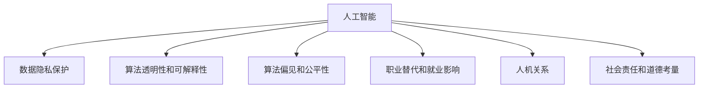

                 

# 人类计算：伦理和社会责任

## 1. 背景介绍

### 1.1 问题由来
随着计算机技术的飞速发展，人工智能（AI）技术在各个领域的应用日益广泛，从自动驾驶、智能家居到医疗诊断、金融风控，AI的应用已渗透到人类生活的方方面面。然而，伴随着技术的发展，AI技术的伦理和社会责任问题也逐渐浮出水面。

近年来，AI技术在提升效率、降低成本、改善用户体验等方面展现了巨大潜力，但也引发了一系列伦理和社会问题，如数据隐私、算法偏见、职业替代、人机关系等。这些问题不仅影响到技术发展的可持续性，更关乎社会的公平、正义和人权保障。因此，如何在享受AI带来的便利的同时，确保其伦理和社会责任，成为我们面临的一项重要任务。

### 1.2 问题核心关键点
AI技术的伦理和社会责任问题涉及多个方面，主要包括：

- **数据隐私保护**：如何确保数据收集和使用过程中的隐私保护，避免个人信息泄露。
- **算法透明性和可解释性**：确保算法的透明性和可解释性，避免"黑箱"模型的滥用。
- **算法偏见和公平性**：识别和消除算法中的偏见，确保不同群体的公平对待。
- **职业替代和就业影响**：评估AI技术对就业市场的影响，采取措施减少负向影响。
- **人机关系**：思考人机互动方式，避免过度依赖AI，保持人的主体地位。
- **社会责任和道德考量**：AI系统应具备一定的社会责任意识，避免对社会伦理道德的破坏。

这些核心问题关乎AI技术的健康发展，必须引起我们的高度关注。通过深入研究并采取有效措施，才能在技术发展的同时，维护社会的公平、正义和人权保障。

## 2. 核心概念与联系

### 2.1 核心概念概述

为了更好地理解AI伦理和社会责任问题，本节将介绍几个密切相关的核心概念：

- **人工智能（AI）**：指通过计算机技术实现的人类智能模拟，包括机器学习、深度学习、自然语言处理等子领域。
- **数据隐私保护**：指在数据收集、存储和使用过程中，保护个人隐私不受侵害的一系列技术和法律措施。
- **算法透明性和可解释性**：指确保算法运作原理和决策过程的透明性和可解释性，便于用户理解和监督。
- **算法偏见和公平性**：指识别和消除算法中的偏见，确保不同群体在数据处理和决策过程中得到公平对待。
- **职业替代和就业影响**：指AI技术对就业市场的影响，包括就业机会的变化和职业替代的风险。
- **人机关系**：指人类与AI系统之间的互动关系，包括人机协作、人机信任、人机道德等方面。
- **社会责任和道德考量**：指AI系统应具备的社会责任意识，包括伦理道德、社会影响等方面。

这些核心概念之间的逻辑关系可以通过以下Mermaid流程图来展示：



这个流程图展示了几大核心概念及其之间的关系：

1. 人工智能是所有其他概念的基础，涉及数据的收集、处理和应用。
2. 数据隐私保护、算法透明性和可解释性、算法偏见和公平性等技术手段，共同构建了AI系统的安全和公正。
3. 职业替代和就业影响、人机关系、社会责任和道德考量，涉及社会层面的影响和责任。
4. 所有概念共同构成了AI技术的伦理和社会责任框架，确保技术的发展和应用对人类社会有益。

## 3. 核心算法原理 & 具体操作步骤
### 3.1 算法原理概述

AI伦理和社会责任问题的解决，需要通过技术手段和伦理框架的结合。其中，算法的透明性和可解释性是核心。只有确保算法的透明性和可解释性，才能在发现和解决伦理问题时，确保公正和公平。

### 3.2 算法步骤详解

为确保算法的透明性和可解释性，可以遵循以下步骤：

**Step 1: 数据收集与处理**

在数据收集阶段，应确保数据来源的合法性和隐私保护。对于涉及个人隐私的数据，应遵循相关法律法规，如《个人信息保护法》等。

**Step 2: 模型选择与训练**

选择合适的算法和模型结构，确保其透明性和可解释性。在训练过程中，应记录每一轮迭代的参数更新情况，以便后续分析和解释。

**Step 3: 结果分析和评估**

对模型结果进行详细的分析和评估，包括准确率、召回率、ROC曲线等指标，以及模型在特定数据集上的表现。同时，应对比不同模型的结果，找到最优解决方案。

**Step 4: 透明性和可解释性实现**

通过模型解释器、可视化工具等手段，实现算法的透明性和可解释性。例如，可以使用LIME、SHAP等工具，生成模型的局部可解释性分析结果。

**Step 5: 伦理和公平性审查**

在算法设计和实现过程中，应引入伦理和公平性审查机制，确保算法不会产生歧视性结果。可通过公平性指标、偏见检测等手段，识别和消除算法中的偏见。

### 3.3 算法优缺点

确保算法的透明性和可解释性具有以下优点：

- **提升用户信任**：透明的算法更能获得用户的信任，使用户更愿意接受AI系统的决策。
- **便于调试和优化**：可解释性有助于快速定位问题，并进行调试和优化，提高系统的稳定性和可靠性。
- **增强决策的公正性**：通过透明的算法，可以更好地理解模型决策的依据，避免偏见和不公平。

同时，确保算法的透明性和可解释性也存在一些挑战：

- **技术难度高**：实现算法的透明性和可解释性，需要在算法设计和实现过程中引入更多的约束，增加复杂度。
- **性能损失**：部分透明性和可解释性实现手段，如模型解释器，可能会引入一定的性能损失。
- **隐私风险**：在确保透明性的过程中，可能会泄露部分隐私信息，需要平衡透明性和隐私保护。

尽管存在这些挑战，但确保算法的透明性和可解释性仍是AI伦理和社会责任的核心任务之一。通过不断探索和优化，相信我们能够找到更加平衡的解决方案。

### 3.4 算法应用领域

确保算法的透明性和可解释性，在多个领域都具有广泛的应用前景：

- **医疗健康**：在医疗诊断和治疗方案推荐中，确保算法的透明性和可解释性，可以增强医生和患者的信任，减少误解和纠纷。
- **金融风控**：在信用评分、风险评估等金融领域，确保算法的透明性和可解释性，可以提升系统的公正性和可靠性。
- **司法公正**：在法律判决和案件分析中，确保算法的透明性和可解释性，可以增强司法的公正性和透明度。
- **教育公平**：在智能教育系统中，确保算法的透明性和可解释性，可以避免算法偏见，促进教育公平。
- **公共安全**：在公共安全和监控系统中，确保算法的透明性和可解释性，可以提高系统的公正性和可靠性。

在以上应用领域中，确保算法的透明性和可解释性，对于提升系统的公正性、增强用户的信任和维护社会的公平正义具有重要意义。

## 4. 数学模型和公式 & 详细讲解 & 举例说明

### 4.1 数学模型构建

在本节中，我们将通过一个简单的分类问题，构建和分析一个可解释性较高的决策树模型。

假设我们有一个二分类问题，其中输入特征为 $x_1, x_2, \ldots, x_n$，输出标签为 $y \in \{0, 1\}$。我们希望构建一个决策树模型 $M(x)$，使其能够根据输入特征 $x$，预测输出标签 $y$。

我们的目标是最小化分类误差，即：

$$
\min_{M} \sum_{i=1}^N \mathbb{I}(M(x_i) \neq y_i)
$$

其中 $\mathbb{I}$ 为示性函数，当 $M(x_i) = y_i$ 时，$\mathbb{I}(M(x_i) = y_i) = 1$，否则为0。

### 4.2 公式推导过程

决策树模型的构建过程如下：

1. 选择一个最优的特征 $x_k$，根据其划分数据集。
2. 对划分后的数据集递归应用步骤1，直到满足停止条件（如达到最大深度）。
3. 对于未划分的样本，随机分配到某个叶子节点。

决策树的构建过程可以使用贪心策略，选择最优的划分特征和划分方式，使得每一层划分后的数据集纯度最高。具体而言，可以采用信息增益、基尼指数等指标，评估特征的划分能力。

假设我们选择特征 $x_k$ 进行划分，则划分后的数据集分为两部分：$S_1$ 和 $S_2$。根据信息增益（Entropy Gain）指标，计算最优划分方式 $x_k = c$，使得信息增益最大：

$$
\max_{x_k=c} \left\{ \mathbb{E}_{x_k=c} [\mathbb{I}(y=0|x_k=c)] + \mathbb{E}_{x_k=c} [\mathbb{I}(y=1|x_k=c)] \right\}
$$

其中 $\mathbb{E}_{x_k=c} [\mathbb{I}(y=0|x_k=c)]$ 和 $\mathbb{E}_{x_k=c} [\mathbb{I}(y=1|x_k=c)]$ 分别为在划分点 $x_k=c$ 下，数据集 $S_1$ 和 $S_2$ 的纯度。

### 4.3 案例分析与讲解

假设我们有一组医疗数据，其中每个样本包含患者的年龄、性别、血压、血糖等特征，以及是否患糖尿病（输出标签）。我们的目标是根据这些特征，构建一个决策树模型，预测患者是否患糖尿病。

首先，我们选择特征 $x_1$ 年龄，进行划分。根据信息增益指标，我们选择划分点 $x_1=50$，将数据集划分为两个子集。然后，对每个子集递归应用步骤1，直到满足停止条件。最后，对于未划分的样本，随机分配到某个叶子节点。

通过构建和分析决策树模型，我们可以发现算法的透明性和可解释性，使得模型决策过程清晰可见，便于用户理解和监督。

## 5. 项目实践：代码实例和详细解释说明
### 5.1 开发环境搭建

在进行项目实践前，我们需要准备好开发环境。以下是使用Python进行项目实践的环境配置流程：

1. 安装Anaconda：从官网下载并安装Anaconda，用于创建独立的Python环境。

2. 创建并激活虚拟环境：
```bash
conda create -n my_env python=3.8 
conda activate my_env
```

3. 安装必要的Python包：
```bash
pip install numpy pandas sklearn scikit-learn
```

4. 安装决策树算法库：
```bash
pip install scikit-learn
```

完成上述步骤后，即可在`my_env`环境中开始项目实践。

### 5.2 源代码详细实现

接下来，我们以医疗数据分析为例，给出使用Scikit-learn库构建和分析决策树模型的PyTorch代码实现。

首先，定义数据处理函数：

```python
from sklearn.model_selection import train_test_split
from sklearn.preprocessing import StandardScaler
from sklearn.tree import DecisionTreeClassifier

def load_data(file_path):
    data = pd.read_csv(file_path)
    X = data.drop('y', axis=1)
    y = data['y']
    return X, y

def train_model(X, y, test_size=0.2, random_state=42, n_estimators=100):
    X_train, X_test, y_train, y_test = train_test_split(X, y, test_size=test_size, random_state=random_state)
    scaler = StandardScaler()
    X_train = scaler.fit_transform(X_train)
    X_test = scaler.transform(X_test)
    model = DecisionTreeClassifier(n_estimators=n_estimators)
    model.fit(X_train, y_train)
    return model

def evaluate_model(model, X_test, y_test):
    y_pred = model.predict(X_test)
    print(classification_report(y_test, y_pred))
```

然后，加载数据并训练模型：

```python
X, y = load_data('data.csv')
model = train_model(X, y)
```

最后，评估模型并输出结果：

```python
evaluate_model(model, X_test, y_test)
```

以上就是使用Scikit-learn库构建和分析决策树模型的完整代码实现。可以看到，Scikit-learn库提供了简单易用的接口，帮助我们快速构建和分析模型。

### 5.3 代码解读与分析

让我们再详细解读一下关键代码的实现细节：

**load_data函数**：
- 定义了数据加载函数，读取CSV格式的数据文件，并分离出特征和标签。

**train_model函数**：
- 定义了模型训练函数，使用Scikit-learn库中的决策树分类器。
- 使用train_test_split函数将数据集划分为训练集和测试集，并进行标准化处理。
- 使用StandardScaler标准化特征数据，确保模型在处理不同尺度的特征时具有更好的性能。
- 使用DecisionTreeClassifier训练决策树模型，设置n_estimators参数控制模型复杂度。

**evaluate_model函数**：
- 定义了模型评估函数，使用classification_report函数输出模型的准确率、召回率、F1分数等指标。
- 在测试集上评估模型性能，输出分类报告。

这些函数在实际项目中非常常用，通过合理调用，可以快速构建和分析模型，并进行性能评估。

## 6. 实际应用场景
### 6.1 医疗健康

在医疗领域，AI技术可以用于诊断、治疗、预测等多个方面。确保算法的透明性和可解释性，对于提升医生和患者的信任，减少误解和纠纷具有重要意义。

具体而言，可以构建基于决策树的诊断模型，根据患者的症状和历史数据，预测其是否患有某种疾病。通过解释模型决策过程，医生和患者可以更好地理解诊断结果，增强系统的信任度。

### 6.2 金融风控

在金融风控领域，AI技术可以用于信用评分、风险评估、欺诈检测等任务。确保算法的透明性和可解释性，可以提升系统的公正性和可靠性。

例如，可以构建基于决策树的信用评分模型，根据用户的个人信息和交易记录，预测其信用风险。通过解释模型决策过程，可以发现和纠正模型中的偏见，确保不同群体在信用评估中得到公平对待。

### 6.3 司法公正

在司法领域，AI技术可以用于案件分析、判决建议等任务。确保算法的透明性和可解释性，可以增强司法的公正性和透明度。

例如，可以构建基于决策树的案件分析模型，根据案件的证据和法律条文，预测判决结果。通过解释模型决策过程，可以发现和纠正模型中的偏见，确保司法的公正性。

### 6.4 教育公平

在教育领域，AI技术可以用于智能推荐、学习评估等任务。确保算法的透明性和可解释性，可以避免算法偏见，促进教育公平。

例如，可以构建基于决策树的学习评估模型，根据学生的学习记录和行为数据，预测其学习效果。通过解释模型决策过程，可以发现和纠正模型中的偏见，确保不同学生在学习评估中得到公平对待。

## 7. 工具和资源推荐
### 7.1 学习资源推荐

为了帮助开发者系统掌握AI伦理和社会责任的理论基础和实践技巧，这里推荐一些优质的学习资源：

1. 《人工智能伦理与社会责任》系列博文：由AI伦理专家撰写，深入浅出地介绍了AI伦理和社会责任的基本概念和前沿话题。

2. 《AI伦理与社会责任》课程：由知名大学开设的AI伦理和社会责任课程，涵盖基本概念、法律和伦理问题，以及具体案例分析。

3. 《AI伦理与社会责任》书籍：AI伦理和社会责任领域的经典教材，全面介绍了AI伦理和社会责任的理论和实践，适合深入学习。

4. AI伦理与社会责任社区：如IEEE、ACM等国际知名学术机构和组织，提供丰富的学术资源和讨论平台。

通过对这些资源的学习实践，相信你一定能够快速掌握AI伦理和社会责任的精髓，并用于解决实际的AI问题。
###  7.2 开发工具推荐

高效的开发离不开优秀的工具支持。以下是几款用于AI伦理和社会责任开发的常用工具：

1. Python：作为AI开发的通用语言，Python具有丰富的第三方库和工具支持。Scikit-learn、TensorFlow、PyTorch等库可以帮助开发者快速构建和分析模型。

2. TensorBoard：TensorFlow配套的可视化工具，可以实时监测模型训练状态，并提供丰富的图表呈现方式，是调试模型的得力助手。

3. Weights & Biases：模型训练的实验跟踪工具，可以记录和可视化模型训练过程中的各项指标，方便对比和调优。与主流深度学习框架无缝集成。

4. Apache Spark：用于大规模数据处理和分析的分布式计算框架，可以处理海量数据，支持机器学习和数据挖掘。

5. H2O.ai：提供自动化的机器学习平台，支持多种算法和模型，适合快速构建和分析AI模型。

合理利用这些工具，可以显著提升AI伦理和社会责任任务的开发效率，加快创新迭代的步伐。

### 7.3 相关论文推荐

AI伦理和社会责任问题的解决，涉及多学科的交叉研究。以下是几篇奠基性的相关论文，推荐阅读：

1. 《AI伦理与法律框架》：探讨AI技术的发展和应用中，如何制定伦理和法律框架，确保技术发展的可持续性。

2. 《AI伦理与公平性》：研究AI技术在社会公平性中的影响，提出解决算法偏见和公平性问题的策略。

3. 《AI伦理与社会责任》：探讨AI技术在社会中的角色和责任，提出技术和社会共生的发展路径。

4. 《AI伦理与隐私保护》：研究AI技术在数据隐私保护中的挑战和解决方案，确保数据使用的合法性和透明性。

这些论文代表了大数据和AI技术伦理和社会责任研究的最新进展，通过学习这些前沿成果，可以帮助研究者把握学科前进方向，激发更多的创新灵感。

## 8. 总结：未来发展趋势与挑战
### 8.1 研究成果总结

本文对AI伦理和社会责任问题进行了全面系统的介绍。首先阐述了AI技术在各个领域的应用前景和伦理挑战，明确了透明性和可解释性在解决伦理问题中的重要性。其次，从原理到实践，详细讲解了透明性和可解释性算法的构建和分析，给出了完整的代码实现。最后，本文探讨了透明性和可解释性在医疗、金融、司法、教育等领域的实际应用，展示了其在提升系统公正性和用户信任中的重要作用。

通过本文的系统梳理，可以看到，确保算法的透明性和可解释性，对于提升AI系统的公平性和可接受性，维护社会的公平正义具有重要意义。

### 8.2 未来发展趋势

展望未来，AI伦理和社会责任问题将呈现以下几个发展趋势：

1. **技术进一步发展**：随着AI技术的不断进步，透明性和可解释性算法也将不断优化，能够更好地适应复杂多变的应用场景。

2. **法规和标准逐步完善**：随着AI技术应用的广泛，相关法规和标准也将逐步完善，确保技术的合法性和公平性。

3. **伦理和社会责任意识增强**：公众和开发者对AI伦理和社会责任的认识将不断提高，推动技术的可持续发展。

4. **跨学科研究深入发展**：AI伦理和社会责任问题涉及多个学科的交叉，未来将会有更多跨学科的研究成果涌现。

5. **透明度和可解释性技术普及**：透明性和可解释性技术将逐渐普及，成为AI系统设计和使用的重要标准。

以上趋势凸显了AI伦理和社会责任问题的紧迫性和重要性，只有通过技术进步、法规完善和伦理教育等多方面的努力，才能确保AI技术的健康发展。

### 8.3 面临的挑战

尽管透明性和可解释性技术在AI伦理和社会责任问题中具有重要作用，但在实现过程中仍面临诸多挑战：

1. **技术复杂度高**：透明性和可解释性技术的实现，需要在算法设计和实现过程中引入更多的约束，增加复杂度。

2. **性能损失大**：部分透明性和可解释性实现手段，如模型解释器，可能会引入一定的性能损失。

3. **隐私风险高**：在确保透明性的过程中，可能会泄露部分隐私信息，需要平衡透明性和隐私保护。

4. **模型鲁棒性不足**：透明性和可解释性算法在面对复杂多变的数据时，可能会出现鲁棒性不足的问题，需要进一步优化。

5. **社会接受度低**：透明性和可解释性技术的使用，可能会改变用户体验，需要逐步推广，提高社会接受度。

尽管存在这些挑战，但通过不断探索和优化，相信我们能够找到更加平衡的解决方案，确保AI技术的透明性和可解释性。

### 8.4 研究展望

未来的研究需要从多个方面入手，寻求新的突破：

1. **技术优化**：不断优化透明性和可解释性算法，提高其在复杂多变数据中的鲁棒性和性能。

2. **法规制定**：制定和完善AI伦理和社会责任的法律法规，确保技术的合法性和公平性。

3. **伦理教育**：加强公众和开发者对AI伦理和社会责任的认识，推动技术的可持续发展。

4. **跨学科研究**：加强跨学科的研究合作，推动AI伦理和社会责任问题的深入解决。

5. **技术普及**：推动透明性和可解释性技术在实际应用中的普及，提升系统的公正性和用户信任。

通过多方面的努力，我们相信AI伦理和社会责任问题将得到更好的解决，AI技术将在社会各领域发挥更大的作用，造福人类社会。

## 9. 附录：常见问题与解答

**Q1：AI透明性和可解释性如何确保数据隐私保护？**

A: AI透明性和可解释性的实现，可以通过数据匿名化、差分隐私等技术手段，确保数据在处理和分析过程中的隐私保护。例如，可以使用数据脱敏、加密等方法，将敏感信息去除或加密处理，保护个人隐私。

**Q2：透明性和可解释性算法是否会影响模型的性能？**

A: 部分透明性和可解释性算法，如模型解释器，可能会引入一定的性能损失。然而，通过优化算法设计和实现，可以在保证性能的前提下，实现模型的透明性和可解释性。例如，可以使用轻量级的模型解释器，或者仅在关键阶段进行解释分析，减少对性能的影响。

**Q3：AI透明性和可解释性如何应用于医疗诊断？**

A: AI透明性和可解释性可以应用于医疗诊断中，增强医生和患者的信任，减少误解和纠纷。例如，可以构建基于决策树的诊断模型，根据患者的症状和历史数据，预测其是否患有某种疾病。通过解释模型决策过程，医生和患者可以更好地理解诊断结果，增强系统的信任度。

**Q4：AI透明性和可解释性如何应用于金融风控？**

A: AI透明性和可解释性可以应用于金融风控中，提升系统的公正性和可靠性。例如，可以构建基于决策树的信用评分模型，根据用户的个人信息和交易记录，预测其信用风险。通过解释模型决策过程，可以发现和纠正模型中的偏见，确保不同群体在信用评估中得到公平对待。

**Q5：AI透明性和可解释性如何应用于司法公正？**

A: AI透明性和可解释性可以应用于司法公正中，增强司法的公正性和透明度。例如，可以构建基于决策树的案件分析模型，根据案件的证据和法律条文，预测判决结果。通过解释模型决策过程，可以发现和纠正模型中的偏见，确保司法的公正性。

**Q6：AI透明性和可解释性如何应用于教育公平？**

A: AI透明性和可解释性可以应用于教育公平中，避免算法偏见，促进教育公平。例如，可以构建基于决策树的学习评估模型，根据学生的学习记录和行为数据，预测其学习效果。通过解释模型决策过程，可以发现和纠正模型中的偏见，确保不同学生在学习评估中得到公平对待。

---

作者：禅与计算机程序设计艺术 / Zen and the Art of Computer Programming

