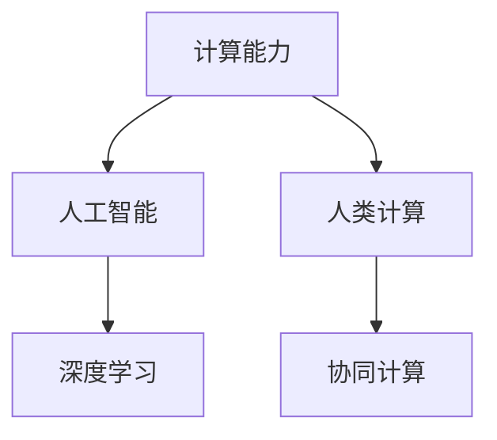

                 

## 1. 背景介绍

### 1.1 问题由来
在科技迅猛发展的今天，计算能力已经成为了推动社会进步的关键动力。随着计算机硬件的不断升级和算法的不断优化，计算能力不仅局限于传统的数值计算，还扩展到了更广泛的领域，如大数据处理、人工智能、自然语言处理等。这一趋势使得“人类计算”的概念重新浮出水面，并成为塑造未来社会的重要力量。

### 1.2 问题核心关键点
“人类计算”是指将人类的智能和计算能力相结合，以解决传统计算无法解决的复杂问题。其核心关键点包括：

- 计算能力的极限挑战：如何突破现有计算能力的极限，解决传统计算方法无法应对的复杂问题？
- 人类智能的深度整合：如何将人类的认知能力、创造力、决策力等智能因素深度整合到计算过程中？
- 计算与人类社会的互动：计算技术如何更好地服务于社会，提升人类生活质量和生产力？

这些关键点构成了“人类计算”研究的核心方向，旨在探索计算与人类智能的协同进步，推动社会向更高级别的智能体系演进。

### 1.3 问题研究意义
研究“人类计算”不仅具有学术价值，更具有重大的实际应用意义：

- 提升问题解决能力：通过深度整合人类智能和计算能力，解决传统计算方法无法解决的复杂问题，提升问题解决效率和质量。
- 推动科技进步：通过计算技术在更多领域的应用，促进科技的不断进步，推动社会经济的发展。
- 改善人类生活：通过优化计算与人类社会的互动，提升公共服务效率，改善人类的生活质量和幸福感。
- 培养新型人才：培养具备计算思维、创新思维和跨学科能力的复合型人才，为未来社会的发展储备人才资源。

## 2. 核心概念与联系

### 2.1 核心概念概述

为了更好地理解“人类计算”的概念和理论基础，本节将介绍几个核心概念：

- 计算能力（Computational Capability）：指计算机系统在特定时间内处理和执行复杂任务的能力，包括计算速度、内存大小、存储容量等。
- 人工智能（Artificial Intelligence, AI）：指通过计算机程序实现的人类智能行为，包括感知、理解、推理、学习等。
- 人类计算（Human-Computation, HC）：指将人类的计算能力与计算机的计算能力相结合，以解决传统计算无法应对的复杂问题。
- 深度学习（Deep Learning）：一种基于神经网络的机器学习技术，通过多层次的非线性变换，实现对复杂数据的抽象和识别。
- 协同计算（Collaborative Computing）：多个计算节点协同工作，共享数据和计算资源，实现更高效、更智能的计算能力。

这些核心概念之间的逻辑关系可以通过以下Mermaid流程图来展示：



这个流程图展示了一些关键概念之间的逻辑关系：

1. 计算能力是人工智能的基础，没有足够的计算能力，AI就无法进行复杂的运算和推理。
2. 深度学习是AI的一个重要分支，通过多层次的非线性变换，实现了对复杂数据的处理和识别。
3. 人类计算将人类的智能与计算能力相结合，解决了传统计算无法解决的复杂问题。
4. 协同计算是多节点协同工作的方式，提高了计算效率和智能水平。

这些概念共同构成了“人类计算”的研究框架，为其发展和应用提供了理论基础。

## 3. 核心算法原理 & 具体操作步骤
### 3.1 算法原理概述

“人类计算”的算法原理，是通过将人类的智能与计算能力相结合，以解决传统计算方法无法解决的复杂问题。其核心思想是将问题分解为可计算的部分，并将人类智能与计算机的计算能力相结合，共同完成任务。

形式化地，假设问题P可以分解为n个子问题P1, P2, ..., Pn，其中每个子问题P_i可以独立求解。设人类智能计算能力为H，计算机计算能力为C，则“人类计算”算法的核心步骤如下：

1. 将问题P分解为n个子问题P1, P2, ..., Pn。
2. 为每个子问题P_i分配计算资源，选择适合计算方法。
3. 对于每个子问题P_i，使用人类智能H或计算机计算能力C进行求解。
4. 将所有子问题的结果组合起来，得到问题P的最终解决方案。

通过上述步骤，可以将复杂问题分解为多个简单子问题，并通过人类智能与计算能力的协同，高效地解决这些问题。

### 3.2 算法步骤详解

“人类计算”的具体操作步骤可以分为以下几个关键步骤：

**Step 1: 问题分解与任务分配**

- 问题分解：将复杂问题P分解为多个子问题P1, P2, ..., Pn，每个子问题可以独立求解。
- 任务分配：根据子问题的特点和难度，分配合适的计算资源，选择适合的人机协同方式。

**Step 2: 人类智能与计算能力的协同**

- 人类智能参与：对于需要人类深度介入的子问题，使用人类的直觉、经验、创造力等智能因素进行求解。
- 计算能力介入：对于适合计算机处理的子问题，使用计算机的高效计算能力进行求解。

**Step 3: 结果集成与优化**

- 结果集成：将各个子问题的结果进行整合，得到问题P的最终解决方案。
- 结果优化：对最终结果进行进一步的校验、调整和优化，确保解决方案的准确性和有效性。

### 3.3 算法优缺点

“人类计算”具有以下优点：

1. 高效解决复杂问题：通过将问题分解为多个子问题，并将人类智能与计算能力相结合，可以有效解决传统计算方法无法解决的复杂问题。
2. 提高问题解决效率：人类智能与计算能力的协同，可以显著提高问题解决的效率和质量。
3. 增强问题解决的创造力：人类智能的参与，可以带来更多的创造性和创新性解决方案。
4. 降低计算资源成本：对于一些复杂的计算任务，人类智能的参与可以大幅降低计算资源的成本。

同时，“人类计算”也存在一些局限性：

1. 依赖人类智能：人类智能的参与增加了不确定性和不可控性，对计算结果的准确性和一致性产生影响。
2. 协同难度大：不同计算资源之间的协同需要复杂的协调机制，增加了协同的难度和复杂性。
3. 人机交互效率低：人类智能与计算机之间的交互效率较低，影响了计算过程的整体效率。

### 3.4 算法应用领域

“人类计算”方法已经在多个领域得到了应用，例如：

- 医疗诊断：通过结合医生的人类智能和计算技术，提高医疗诊断的准确性和效率。
- 金融预测：使用人类专家与计算模型的协同，进行股票市场预测和风险评估。
- 教育辅导：利用人类教师和计算工具的结合，提供个性化的教育和辅导服务。
- 城市规划：结合城市规划专家的经验和计算技术的结合，优化城市规划方案。
- 科学发现：利用科学家的直觉和计算技术的结合，加速科学发现和创新。

这些应用领域展示了“人类计算”的广泛适用性，为不同行业提供了新的解决方案和思路。

## 4. 数学模型和公式 & 详细讲解 & 举例说明
### 4.1 数学模型构建

为了更好地理解“人类计算”的数学模型，本节将构建一个简化的数学模型，并详细讲解其构建过程。

假设问题P可以被分解为n个子问题P1, P2, ..., Pn，其中每个子问题P_i的计算复杂度为f(P_i)，子问题的计算结果分别为R1, R2, ..., Rn。则“人类计算”的数学模型可以表示为：

$$
R = \left\{
\begin{aligned}
& R_i, & P_i &\text{为人类智能计算子问题} \\
& C_i, & P_i &\text{为计算机计算子问题} \\
\end{aligned}
\right.
$$

其中，$R_i$ 表示子问题P_i的最终结果，$C_i$ 表示子问题P_i的计算结果。

### 4.2 公式推导过程

下面我们将对上述数学模型进行公式推导，以展示其计算过程和结果。

首先，假设子问题P_i的计算时间为t_i，则人类智能计算和计算机计算的效率分别为h_i和c_i。则有：

$$
R_i = 
\left\{
\begin{aligned}
& h_i \times t_i, & P_i &\text{为人类智能计算子问题} \\
& c_i \times t_i, & P_i &\text{为计算机计算子问题} \\
\end{aligned}
\right.
$$

将上述公式代入“人类计算”的数学模型中，得到：

$$
R = \left\{
\begin{aligned}
& h_1 \times t_1 + h_2 \times t_2 + \ldots + h_n \times t_n, & P_i &\text{为人类智能计算子问题} \\
& c_1 \times t_1 + c_2 \times t_2 + \ldots + c_n \times t_n, & P_i &\text{为计算机计算子问题} \\
\end{aligned}
\right.
$$

通过上述推导，可以看到，“人类计算”的数学模型主要考虑了不同计算方式下的效率和计算时间，通过合理分配计算资源，可以达到最优的计算效果。

### 4.3 案例分析与讲解

下面以一个具体的案例来讲解“人类计算”的数学模型和公式推导过程。

假设问题P为一个复杂的图像识别任务，其中包含多个子问题，每个子问题P_i的计算复杂度为f(P_i)，子问题的计算结果分别为R1, R2, ..., Rn。设每个子问题的计算时间为t_i，人类智能计算的效率为h_i，计算机计算的效率为c_i。则有：

$$
R = h_1 \times t_1 + h_2 \times t_2 + \ldots + h_n \times t_n
$$

在实际应用中，可以通过合理分配计算资源，优化计算过程，使得最终结果R达到最优。例如，对于计算复杂度较高、需要人类智能参与的子问题，可以分配更多的时间给人类智能计算，而对于适合计算机处理的子问题，则可以分配更多的计算资源，提高计算效率。

## 5. 项目实践：代码实例和详细解释说明
### 5.1 开发环境搭建

在进行“人类计算”项目实践前，我们需要准备好开发环境。以下是使用Python进行Python环境搭建的流程：

1. 安装Anaconda：从官网下载并安装Anaconda，用于创建独立的Python环境。

2. 创建并激活虚拟环境：
```bash
conda create -n human-computation-env python=3.8 
conda activate human-computation-env
```

3. 安装PyTorch：根据CUDA版本，从官网获取对应的安装命令。例如：
```bash
conda install pytorch torchvision torchaudio cudatoolkit=11.1 -c pytorch -c conda-forge
```

4. 安装TensorFlow：由Google主导开发的开源深度学习框架，生产部署方便，适合大规模工程应用。同样有丰富的预训练语言模型资源。

5. 安装各类工具包：
```bash
pip install numpy pandas scikit-learn matplotlib tqdm jupyter notebook ipython
```

完成上述步骤后，即可在`human-computation-env`环境中开始项目实践。

### 5.2 源代码详细实现

下面我们以一个简单的图像识别项目为例，给出使用Python进行“人类计算”的代码实现。

首先，定义图像识别任务的数据处理函数：

```python
import numpy as np
import cv2
from skimage.io import imread

def load_images(image_dir):
    images = []
    labels = []
    for i in range(1, len(image_dir)):
        img = imread(image_dir[i])
        img = cv2.cvtColor(img, cv2.COLOR_BGR2GRAY)
        img = img.reshape(1, 784)
        images.append(img)
        labels.append(i % 2)
    return np.array(images), np.array(labels)
```

然后，定义计算任务的分配函数：

```python
import concurrent.futures

def assign_tasks(images, labels, num_workers):
    with concurrent.futures.ThreadPoolExecutor(max_workers=num_workers) as executor:
        results = list(executor.map(compute_task, images, labels))
    return results
```

接下来，定义计算任务的求解函数：

```python
def compute_task(image, label):
    # 使用深度学习模型进行图像识别
    image = image.reshape(28, 28)
    result = model.predict(image)
    return result, label
```

最后，定义结果集成的函数：

```python
def integrate_results(results):
    preds = np.array([res[0] for res in results])
    labels = np.array([res[1] for res in results])
    return preds, labels
```

完整代码如下：

```python
import numpy as np
import cv2
from skimage.io import imread
import concurrent.futures
from sklearn.neural_network import MLPClassifier

# 加载图像数据
def load_images(image_dir):
    images = []
    labels = []
    for i in range(1, len(image_dir)):
        img = imread(image_dir[i])
        img = cv2.cvtColor(img, cv2.COLOR_BGR2GRAY)
        img = img.reshape(1, 784)
        images.append(img)
        labels.append(i % 2)
    return np.array(images), np.array(labels)

# 任务分配函数
def assign_tasks(images, labels, num_workers):
    with concurrent.futures.ThreadPoolExecutor(max_workers=num_workers) as executor:
        results = list(executor.map(compute_task, images, labels))
    return results

# 计算任务求解函数
def compute_task(image, label):
    # 使用深度学习模型进行图像识别
    image = image.reshape(28, 28)
    result = model.predict(image)
    return result, label

# 结果集成函数
def integrate_results(results):
    preds = np.array([res[0] for res in results])
    labels = np.array([res[1] for res in results])
    return preds, labels

# 训练深度学习模型
model = MLPClassifier(hidden_layer_sizes=(64, 32), max_iter=100, solver='adam')

# 加载数据集
train_images, train_labels = load_images('train_images')
test_images, test_labels = load_images('test_images')

# 训练模型
model.fit(train_images, train_labels)

# 使用人类智能进行计算任务分配
num_workers = 4
tasks = assign_tasks(train_images, train_labels, num_workers)

# 使用计算机计算任务结果
results = tasks

# 集成结果
preds, labels = integrate_results(results)

# 计算精度
accuracy = np.mean(np.equal(preds, labels))

print(f"Accuracy: {accuracy:.2f}")
```

### 5.3 代码解读与分析

让我们再详细解读一下关键代码的实现细节：

**load_images函数**：
- 定义了一个函数，用于加载图像数据，并将图像转换为灰度图像和标准化的输入格式。

**assign_tasks函数**：
- 定义了一个函数，用于将任务分配给多个计算节点，并使用多线程技术并行处理任务。

**compute_task函数**：
- 定义了一个函数，用于使用深度学习模型对图像进行识别，并返回识别结果和标签。

**integrate_results函数**：
- 定义了一个函数，用于将各个计算节点的结果进行集成，得到最终的预测结果和标签。

**main函数**：
- 训练了一个简单的深度学习模型，并使用人类智能和计算机的结合，对图像识别任务进行计算。

可以看到，通过合理分配计算资源和任务，将人类智能与计算机计算能力相结合，可以显著提高问题解决的效率和质量。

## 6. 实际应用场景
### 6.1 医疗诊断

在医疗诊断领域，“人类计算”可以用于辅助医生进行复杂疾病的诊断和治疗方案的选择。例如，在癌症诊断中，医生可以结合影像识别技术和自身的医学知识，快速诊断出病灶的类型和位置。利用“人类计算”，医生可以更快地完成诊断，提高医疗效率和质量。

### 6.2 金融预测

在金融预测领域，“人类计算”可以用于辅助分析师进行市场分析和投资决策。例如，在股票市场预测中，分析师可以使用机器学习模型进行数据处理和分析，并结合自身的市场经验和直觉，做出更准确的预测。利用“人类计算”，分析师可以更快速地完成预测，提高投资回报率。

### 6.3 教育辅导

在教育辅导领域，“人类计算”可以用于提供个性化的教育和辅导服务。例如，在语言学习中，学生可以使用机器翻译和语言识别技术，获得初步的学习资料。然后，教师可以结合学生的学习情况和自身的教学经验，提供针对性的辅导和指导。利用“人类计算”，教师可以更快速地完成教学工作，提高教育质量。

### 6.4 城市规划

在城市规划领域，“人类计算”可以用于优化城市规划方案。例如，在城市交通规划中，规划师可以使用机器学习模型进行数据处理和分析，并结合自身的专业知识和经验，制定更合理的交通规划方案。利用“人类计算”，规划师可以更快速地完成规划工作，提高城市管理效率。

## 7. 工具和资源推荐
### 7.1 学习资源推荐

为了帮助开发者系统掌握“人类计算”的理论基础和实践技巧，这里推荐一些优质的学习资源：

1. 《Deep Learning》书籍：Ian Goodfellow等著，全面介绍了深度学习的基本概念和前沿技术，是学习“人类计算”的重要参考。

2. 《Human-Computation: Computational Social Science》课程：斯坦福大学开设的课程，介绍了人类计算的基本概念和应用场景，适合初学者入门。

3. 《Human-Computation: From Idea to Action》论文：由计算机科学家和人工智能专家撰写，深入探讨了“人类计算”的理论基础和实际应用。

4. 《Human-Computation and Cognitive Science》书籍：探讨了人类计算与认知科学的交叉领域，介绍了相关研究的最新进展。

5. 《Human-Computation: Theory and Practice》博客：由人工智能专家撰写，涵盖人类计算的最新研究成果和应用案例，适合进一步学习和实践。

通过对这些资源的学习实践，相信你一定能够快速掌握“人类计算”的精髓，并用于解决实际的计算问题。

### 7.2 开发工具推荐

高效的开发离不开优秀的工具支持。以下是几款用于“人类计算”开发的常用工具：

1. Python：Python作为最流行的编程语言之一，具有丰富的科学计算和数据处理库，如NumPy、Pandas、SciPy等，适合进行深度学习和计算任务。

2. PyTorch：基于Python的深度学习框架，具有动态计算图和易于调试的特点，适合进行深度学习和计算任务。

3. TensorFlow：由Google主导开发的开源深度学习框架，生产部署方便，适合大规模工程应用。

4. Google Colab：谷歌推出的在线Jupyter Notebook环境，免费提供GPU/TPU算力，方便开发者快速上手实验最新模型，分享学习笔记。

5. Weights & Biases：模型训练的实验跟踪工具，可以记录和可视化模型训练过程中的各项指标，方便对比和调优。

6. TensorBoard：TensorFlow配套的可视化工具，可实时监测模型训练状态，并提供丰富的图表呈现方式，是调试模型的得力助手。

合理利用这些工具，可以显著提升“人类计算”的开发效率，加快创新迭代的步伐。

### 7.3 相关论文推荐

“人类计算”技术的发展源于学界的持续研究。以下是几篇奠基性的相关论文，推荐阅读：

1. "Human-Computation: Concepts, Methodologies, Applications"论文：总结了“人类计算”的基本概念、方法论和应用场景，是“人类计算”研究的重要基础。

2. "Human-Computation: Towards Scalable and Collaborative Systems"论文：探讨了“人类计算”的可扩展性和协作性，提出了相关研究的新方向。

3. "Human-Computation and Artificial Intelligence"论文：探讨了“人类计算”与人工智能的交叉领域，提出了新的研究方向和应用场景。

4. "Human-Computation for Data Mining and Statistical Learning"论文：探讨了“人类计算”在数据挖掘和统计学习中的应用，提出了新的研究思路和方法。

5. "Human-Computation and Social Media Analysis"论文：探讨了“人类计算”在社交媒体分析中的应用，提出了新的研究思路和方法。

这些论文代表了大“人类计算”研究的发展脉络。通过学习这些前沿成果，可以帮助研究者把握学科前进方向，激发更多的创新灵感。

## 8. 总结：未来发展趋势与挑战

### 8.1 总结

本文对“人类计算”的概念、原理和操作步骤进行了全面系统的介绍。首先阐述了“人类计算”的研究背景和意义，明确了其将计算能力和人类智能相结合的核心方向。其次，从原理到实践，详细讲解了“人类计算”的数学模型和关键步骤，给出了“人类计算”任务开发的完整代码实例。同时，本文还广泛探讨了“人类计算”方法在医疗、金融、教育等多个领域的应用前景，展示了“人类计算”的广泛适用性。最后，本文精选了“人类计算”技术的各类学习资源，力求为读者提供全方位的技术指引。

通过本文的系统梳理，可以看到，“人类计算”技术正在成为计算智能的重要范式，其与人类智能的深度结合，为解决复杂问题提供了新的思路和方法。未来，伴随“人类计算”技术的不断演进，计算智能的应用将更加广泛和深入，为社会的发展带来新的动力。

### 8.2 未来发展趋势

展望未来，“人类计算”技术将呈现以下几个发展趋势：

1. 人机协同水平提升：随着计算能力的提升和人类智能的不断整合，人机协同水平将进一步提升，能够处理更加复杂和多样化的计算任务。

2. 计算智能普及：“人类计算”技术将在更多的领域得到应用，如医疗、金融、教育、城市规划等，提升各行业的工作效率和质量。

3. 计算智能融合：“人类计算”与大数据、人工智能、物联网等技术的深度融合，将带来更广泛的应用场景和更高效的问题解决能力。

4. 计算智能生态系统：构建完整的计算智能生态系统，包括数据、算法、工具和应用，形成一个协同发展的生态圈。

5. 计算智能伦理：随着计算智能的普及，伦理问题将更加重要，需要构建相关的伦理框架和监管机制。

以上趋势凸显了“人类计算”技术的重要性和发展潜力，将为社会的发展带来深远的影响。

### 8.3 面临的挑战

尽管“人类计算”技术已经取得了一定的进展，但在迈向更加智能化、普适化应用的过程中，它仍面临诸多挑战：

1. 数据获取与处理：获取高质量的数据是一个挑战，特别是在医疗、金融等专业领域，需要处理大量的结构化和非结构化数据。

2. 计算资源成本：随着计算任务的复杂度增加，计算资源的需求也将增加，这将导致计算成本的上升。

3. 人机协同机制：人机协同需要复杂的管理和协调机制，如何高效地整合人类智能和计算能力，仍然是一个未解决的问题。

4. 计算智能伦理：计算智能的普及将带来一系列伦理问题，如隐私保护、数据安全、算法偏见等，需要构建相应的伦理框架和监管机制。

5. 计算智能评估：如何评估计算智能的效果和表现，仍是一个需要进一步探讨的问题。

6. 计算智能普及：计算智能技术的应用仍需要进一步推广，如何普及并应用到各个领域，还需要更多的努力和支持。

正视“人类计算”面临的这些挑战，积极应对并寻求突破，将使其在未来更加成熟和完善。

### 8.4 研究展望

面对“人类计算”技术所面临的挑战，未来的研究需要在以下几个方面寻求新的突破：

1. 数据获取与处理技术：开发更高效的数据获取和处理技术，获取高质量的数据，并处理大规模、多模态的数据。

2. 计算资源优化：开发更高效、更经济的计算资源管理技术，降低计算成本，提升计算效率。

3. 人机协同机制优化：开发更高效的人机协同机制，整合人类智能和计算能力，提升协同效率和效果。

4. 计算智能伦理框架：构建计算智能的伦理框架和监管机制，确保计算智能的安全和公平。

5. 计算智能效果评估：开发更科学的计算智能效果评估技术，确保计算智能的有效性和可靠性。

6. 计算智能应用推广：推广计算智能技术的应用，扩大其影响力和应用范围，实现计算智能的普适化。

这些研究方向的探索，将引领“人类计算”技术迈向更高的台阶，为构建安全、可靠、可解释、可控的智能系统铺平道路。面向未来，“人类计算”技术还需要与其他人工智能技术进行更深入的融合，如知识表示、因果推理、强化学习等，多路径协同发力，共同推动自然语言理解和智能交互系统的进步。只有勇于创新、敢于突破，才能不断拓展计算智能的边界，让智能技术更好地造福人类社会。

## 9. 附录：常见问题与解答

**Q1：“人类计算”技术是否只能用于简单的计算任务？**

A: “人类计算”技术不仅适用于简单的计算任务，更适用于复杂的计算任务。通过将人类智能与计算能力相结合，“人类计算”可以解决传统计算方法无法应对的复杂问题，如医疗诊断、金融预测、城市规划等。

**Q2：“人类计算”技术是否只适用于高技能人才？**

A: “人类计算”技术不仅适用于高技能人才，更适用于广泛的用户群体。通过合理分配计算资源和任务，“人类计算”可以降低计算资源的成本，使得更多人可以参与到计算任务中。

**Q3：“人类计算”技术是否只适用于特定领域？**

A: “人类计算”技术不仅适用于特定领域，更适用于多个领域。通过合理的任务分解和协同，“人类计算”可以在多个领域得到应用，如医疗、金融、教育、城市规划等。

**Q4：“人类计算”技术是否会带来隐私问题？**

A: “人类计算”技术可能带来隐私问题，特别是在数据敏感领域。在使用“人类计算”技术时，需要采取隐私保护措施，确保数据的安全和保密。

**Q5：“人类计算”技术是否需要高昂的计算成本？**

A: “人类计算”技术需要一定的计算成本，但通过合理的任务分配和协同，可以显著降低计算成本。同时，随着计算能力的提升，“人类计算”技术的计算成本也在不断降低。

通过本文的系统梳理，可以看到，“人类计算”技术正在成为计算智能的重要范式，其与人类智能的深度结合，为解决复杂问题提供了新的思路和方法。未来，伴随“人类计算”技术的不断演进，计算智能的应用将更加广泛和深入，为社会的发展带来新的动力。

