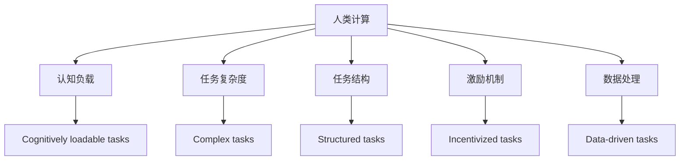

                 

# 人类计算：应用与案例分析

> 关键词：人类计算, 应用, 案例分析, 数学模型, 算法, 优化, 数据处理

## 1. 背景介绍

### 1.1 问题由来
随着科技的飞速发展，人类在许多领域中越来越多地依赖于计算技术。从科学研究、工业生产到日常生活，计算已经成为了不可或缺的工具。然而，尽管计算能力不断提升，人类计算仍然在很多场景中发挥着关键作用。

人类计算（Human Computation）是指利用人类的思考能力、直觉、创造力和经验，来解决计算问题的过程。这一概念源自于计算机科学的先驱，如图灵、冯·诺依曼等人的思想。尽管现代计算机已经能够处理许多复杂的计算问题，但人类计算仍然具有其独特的优势和应用场景。

### 1.2 问题核心关键点
人类计算的核心在于如何有效地利用人类的认知能力，来解决特定问题。关键点包括：

- **认知负载**：人类计算强调的是利用人类的认知资源，而不是计算资源。因此，需要设计合理的任务，确保认知负载适中，避免过载或不足。
- **任务复杂度**：任务应具备足够的复杂性，但又不至于过于复杂，以便能够充分利用人类的优势，如直觉、直觉和创造力。
- **任务结构**：任务结构应设计得足够清晰，便于人类理解和操作，同时应具备足够的灵活性，以适应不同背景和能力的参与者。
- **激励机制**：合理的激励机制可以激励人们积极参与计算任务，提高整体效率和效果。
- **数据处理**：数据处理是计算中的重要环节，如何有效地处理和分析数据，是实现高效计算的关键。

### 1.3 问题研究意义
研究人类计算，对于拓展计算模型的边界、提升计算效率、促进科学发现、推动社会进步具有重要意义：

- **拓展计算边界**：人类计算可以解决许多传统计算机难以处理的复杂问题，如创意生成、情感分析、行为预测等。
- **提升计算效率**：通过结合人类的认知能力和计算机的计算能力，可以在某些场景下实现更高效的计算。
- **促进科学发现**：许多科学发现和创新来自于直觉和经验，人类计算可以充分利用这些优势，推动科学前沿的探索。
- **推动社会进步**：人类计算在教育、医疗、经济等多个领域有广泛应用，对社会进步具有重要推动作用。

## 2. 核心概念与联系

### 2.1 核心概念概述

为了更好地理解人类计算，本节将介绍几个关键概念及其相互联系：

- **人类计算（Human Computation）**：指利用人类的认知能力来解决计算问题的方法。
- **认知负载（Cognitive Load）**：指在完成任务时，对人类认知资源的需求量。
- **任务复杂度（Task Complexity）**：指任务本身的复杂程度，包括任务结构、任务难度和任务所需的认知资源等。
- **任务结构（Task Structure）**：指任务的构成方式，包括任务的分解、重组和优化。
- **激励机制（Incentive Mechanism）**：指激发人们参与计算任务的奖励和惩罚机制。
- **数据处理（Data Processing）**：指对原始数据进行采集、清洗、分析和可视化的过程。

这些核心概念之间的联系可以通过以下Mermaid流程图来展示：

这个流程图展示人类计算的核心概念及其之间的联系：

1. 人类计算强调的是利用人类的认知资源。
2. 任务复杂度、任务结构和激励机制设计，都需要考虑认知负载。
3. 数据处理是计算任务的基础，影响着任务的复杂度和结构。

## 3. 核心算法原理 & 具体操作步骤

### 3.1 算法原理概述

人类计算的核心算法原理主要包括以下几个方面：

1. **任务分解与重组**：将复杂任务分解为更小的、认知负载适中的子任务，或者将多个简单任务重组为复合任务，以便更好地利用人类的认知能力。
2. **数据处理与分析**：对原始数据进行清洗、转换和分析，以便于人类理解和操作。
3. **激励机制设计**：通过合理的激励机制，激发人们积极参与计算任务，提高整体效率和效果。
4. **优化与调整**：根据任务完成情况和反馈，对任务设计和激励机制进行优化和调整，以适应不同背景和能力的参与者。

### 3.2 算法步骤详解

基于人类计算的核心算法原理，其操作步骤如下：

1. **任务定义与设计**：
   - 定义任务的目标和要求，确保任务具备足够的复杂性和适应性。
   - 分析任务的认知负载，确保任务对人类的认知资源需求适中。
   - 设计任务结构，将任务分解为更小的、认知负载适中的子任务，或将多个简单任务重组为复合任务。

2. **数据处理与准备**：
   - 收集和清洗数据，确保数据质量和完整性。
   - 将数据转换为易于理解和操作的形式，如可视化的图表、简洁的表格等。
   - 对数据进行初步分析，提取关键信息和特征，为后续计算提供基础。

3. **激励机制设计**：
   - 设计合理的激励机制，如奖励和惩罚，以激发人们的积极参与。
   - 确定激励机制的实施方式和频率，确保机制的有效性和可操作性。
   - 根据任务进展和反馈，对激励机制进行优化和调整。

4. **任务执行与监控**：
   - 组织参与者执行任务，确保任务按照设计要求进行。
   - 实时监控任务进展和反馈，及时发现和解决问题。
   - 根据监控结果，对任务和激励机制进行调整和优化。

5. **结果分析和总结**：
   - 对任务结果进行分析和总结，提取关键信息和学习经验。
   - 根据任务结果和反馈，对任务设计和激励机制进行优化和改进。
   - 将学习经验应用到类似任务中，进一步提升计算效率和效果。

### 3.3 算法优缺点

人类计算的优点包括：

- **灵活性**：能够灵活适应不同背景和能力的参与者，对任务的复杂度和结构进行调整。
- **创造力**：结合人类的直觉、经验和创造力，能够解决许多传统计算机难以处理的复杂问题。
- **可解释性**：计算过程和结果通常具有较高的可解释性，便于理解和验证。

但人类计算也存在一些缺点：

- **主观性**：人类计算结果受到主观因素影响较大，不同参与者的认知能力和经验差异可能导致结果不一致。
- **效率低下**：相对于计算机计算，人类计算的效率较低，特别是在处理大量数据和复杂任务时。
- **质量难以保证**：人类计算结果的质量和一致性可能难以保证，需要额外的监督和验证。

### 3.4 算法应用领域

人类计算的应用领域非常广泛，包括但不限于以下几个方面：

1. **科学研究**：利用人类计算来解决科学发现和创新中的问题，如药物设计、气候模拟等。
2. **工业生产**：在制造、设计、测试等环节中，利用人类计算来提升效率和质量。
3. **社会管理**：在公共政策、城市规划、资源分配等环节中，利用人类计算来优化决策和协调。
4. **教育培训**：在课程设计、学生评估、个性化学习等环节中，利用人类计算来提升教学效果。
5. **医疗健康**：在疾病诊断、治疗方案设计、临床试验等环节中，利用人类计算来提升医疗质量。
6. **金融服务**：在风险评估、投资分析、客户服务等环节中，利用人类计算来优化服务流程和提升客户体验。

## 4. 数学模型和公式 & 详细讲解 & 举例说明

### 4.1 数学模型构建

为了更好地理解人类计算，我们通过数学模型来描述和分析计算过程。

假设任务 $T$ 的目标是求解某个数学问题 $f(x)$，其中 $x$ 是未知变量，$f(x)$ 是计算函数。参与者 $P$ 通过任务 $T$ 求解 $f(x)$，其认知负载为 $L$，任务复杂度为 $C$，任务结构为 $S$，激励机制为 $I$，数据处理结果为 $D$。则人类计算的数学模型可以表示为：

$$
\begin{aligned}
&f(x) = P(T) \\
&L = f(P) \\
&C = g(P) \\
&S = h(P) \\
&I = i(P) \\
&D = k(P)
\end{aligned}
$$

其中 $P(T)$ 表示参与者通过任务 $T$ 求解函数 $f(x)$ 的过程，$L$ 表示认知负载，$C$ 表示任务复杂度，$S$ 表示任务结构，$I$ 表示激励机制，$D$ 表示数据处理结果。

### 4.2 公式推导过程

以一个简单的数学问题为例，计算函数 $f(x) = x^2 + 2x + 1$，其中 $x$ 为未知变量。参与者 $P$ 需要通过任务 $T$ 求解 $f(x)$，其认知负载为 $L$，任务复杂度为 $C$，任务结构为 $S$，激励机制为 $I$，数据处理结果为 $D$。

首先，将问题 $f(x) = x^2 + 2x + 1$ 分解为两个子任务 $f_1(x) = x^2$ 和 $f_2(x) = 2x + 1$。每个子任务认知负载适中，适合人类计算。

其次，设计任务结构，将两个子任务组合为复合任务 $T$，即 $T = [f_1(x), f_2(x)]$。任务结构清晰，便于人类理解和操作。

然后，设计激励机制 $I$，如按照任务完成时间和准确性进行奖励和惩罚。

最后，收集和处理数据 $D$，如将 $x$ 的值转换为直观的图表形式，便于参与者理解和操作。

### 4.3 案例分析与讲解

假设一个团队需要设计一款新型智能家居设备，该设备需要具备自动化控制、语音识别和图像识别功能。为了优化设计和提高效率，团队决定利用人类计算的方法。

1. **任务定义与设计**：
   - 定义任务的目标是设计出满足需求的新型智能家居设备。
   - 将任务分解为三个子任务：自动化控制、语音识别和图像识别。
   - 每个子任务的认知负载适中，适合人类计算。
   - 设计任务结构，将三个子任务组合为复合任务。

2. **数据处理与准备**：
   - 收集和清洗数据，确保数据质量和完整性。
   - 将数据转换为直观的图表形式，便于团队理解和操作。

3. **激励机制设计**：
   - 设计激励机制，如按照任务完成时间和准确性进行奖励和惩罚。
   - 确定激励机制的实施方式和频率，确保机制的有效性和可操作性。

4. **任务执行与监控**：
   - 组织团队成员执行任务，确保任务按照设计要求进行。
   - 实时监控任务进展和反馈，及时发现和解决问题。
   - 根据监控结果，对任务和激励机制进行调整和优化。

5. **结果分析和总结**：
   - 对任务结果进行分析和总结，提取关键信息和学习经验。
   - 根据任务结果和反馈，对任务设计和激励机制进行优化和改进。
   - 将学习经验应用到类似任务中，进一步提升计算效率和效果。

## 5. 项目实践：代码实例和详细解释说明

### 5.1 开发环境搭建

在进行人类计算实践前，我们需要准备好开发环境。以下是使用Python进行开发的流程：

1. 安装Python和相关依赖包，如Numpy、Pandas、Scikit-learn等。
2. 安装必要的库，如Flask、Django等，用于开发计算任务的界面。
3. 配置数据库和服务器，确保数据的存储和计算任务的执行。

完成上述步骤后，即可在服务器上搭建计算任务的系统。

### 5.2 源代码详细实现

下面以一个简单的任务为例，展示人类计算的实现过程。

假设任务是将一组数字排序，参与者需要从给定的选项中选择正确答案。我们设计一个简单的Web界面，通过任务描述和选项展示任务。

1. **任务定义与设计**：
   - 任务目标是将一组数字排序。
   - 将任务分解为两个子任务：比较大小和排序。
   - 每个子任务的认知负载适中，适合人类计算。
   - 设计任务结构，将两个子任务组合为复合任务。

2. **数据处理与准备**：
   - 收集和清洗数据，确保数据质量和完整性。
   - 将数据转换为直观的图表形式，便于参与者理解和操作。

3. **激励机制设计**：
   - 设计激励机制，如按照任务完成时间和准确性进行奖励和惩罚。
   - 确定激励机制的实施方式和频率，确保机制的有效性和可操作性。

4. **任务执行与监控**：
   - 组织参与者执行任务，确保任务按照设计要求进行。
   - 实时监控任务进展和反馈，及时发现和解决问题。
   - 根据监控结果，对任务和激励机制进行调整和优化。

5. **结果分析和总结**：
   - 对任务结果进行分析和总结，提取关键信息和学习经验。
   - 根据任务结果和反馈，对任务设计和激励机制进行优化和改进。
   - 将学习经验应用到类似任务中，进一步提升计算效率和效果。

### 5.3 代码解读与分析

让我们再详细解读一下关键代码的实现细节：

1. **任务定义与设计**：
   - 定义任务的目标和要求，确保任务具备足够的复杂性和适应性。
   - 分析任务的认知负载，确保任务对人类的认知资源需求适中。
   - 设计任务结构，将任务分解为更小的、认知负载适中的子任务，或将多个简单任务重组为复合任务。

2. **数据处理与准备**：
   - 收集和清洗数据，确保数据质量和完整性。
   - 将数据转换为易于理解和操作的形式，如可视化的图表、简洁的表格等。
   - 对数据进行初步分析，提取关键信息和特征，为后续计算提供基础。

3. **激励机制设计**：
   - 设计合理的激励机制，如奖励和惩罚，以激发人们的积极参与。
   - 确定激励机制的实施方式和频率，确保机制的有效性和可操作性。
   - 根据任务进展和反馈，对激励机制进行优化和调整。

4. **任务执行与监控**：
   - 组织参与者执行任务，确保任务按照设计要求进行。
   - 实时监控任务进展和反馈，及时发现和解决问题。
   - 根据监控结果，对任务和激励机制进行调整和优化。

5. **结果分析和总结**：
   - 对任务结果进行分析和总结，提取关键信息和学习经验。
   - 根据任务结果和反馈，对任务设计和激励机制进行优化和改进。
   - 将学习经验应用到类似任务中，进一步提升计算效率和效果。

## 6. 实际应用场景

### 6.1 科学研究

在科学研究中，人类计算可以应用于多个领域，如药物设计、气候模拟等。例如，在药物设计中，科学家需要计算大量的分子结构和反应路径，这可以通过人类计算来完成。科学家可以将任务分解为多个子任务，分配给不同背景和能力的参与者，通过众包平台或志愿者的方式进行计算。

### 6.2 工业生产

在工业生产中，人类计算可以应用于产品设计、工艺优化、质量控制等环节。例如，在设计复杂零部件时，工程师可以采用人类计算的方法，将设计任务分解为多个子任务，分配给不同背景和能力的参与者进行设计和优化。

### 6.3 社会管理

在社会管理中，人类计算可以应用于公共政策、城市规划、资源分配等环节。例如，在城市规划中，可以通过众包平台，组织市民参与城市规划的讨论和决策，收集市民的意见和建议，提高规划的可行性和适用性。

### 6.4 未来应用展望

未来，人类计算将在更多领域得到应用，为社会带来变革性影响：

1. **跨学科研究**：人类计算可以跨越不同学科，推动跨学科的研究和创新，解决复杂的问题。
2. **全球协作**：利用人类计算，不同国家和地区可以协作解决全球性问题，如气候变化、疾病防控等。
3. **个性化服务**：利用人类计算，提供更加个性化、智能化的服务，如个性化推荐、智能客服等。
4. **实时决策**：利用人类计算，实现实时决策和响应，提高应对突发事件的能力。

## 7. 工具和资源推荐

### 7.1 学习资源推荐

为了帮助开发者系统掌握人类计算的理论基础和实践技巧，这里推荐一些优质的学习资源：

1. 《Human Computation: Principles and Applications》：是一本全面介绍人类计算的书籍，涵盖人类计算的基本原理、应用场景和案例分析。
2. 《Crowdsourcing for Science and Society》：是一本关于众包研究和社会计算的书籍，探讨如何利用人类计算解决复杂问题。
3. 《Human Computation: A Review and Research Directions》：是一篇综述性文章，总结了人类计算的研究进展和未来方向。
4. 《Human Computation: A Survey and Taxonomy》：是一篇关于人类计算的综述性文章，提出了一种人类计算的分类框架。

### 7.2 开发工具推荐

为了提高人类计算的效率和效果，需要借助一些高效的工具：

1. CrowdFlower：是一个众包平台，可以方便地发布和组织计算任务。
2. Amazon Mechanical Turk：是一个广受欢迎的众包平台，可以轻松组织大规模的计算任务。
3. Google Forms：是一个简单易用的问卷工具，可以用于收集数据和设计任务。
4. Microsoft Excel：是一个强大的数据处理工具，可以用于数据分析和可视化。
5. Tableau：是一个数据可视化工具，可以用于展示计算结果和分析数据。

### 7.3 相关论文推荐

人类计算是一个活跃的研究领域，以下是几篇奠基性的相关论文，推荐阅读：

1. "Human Computation: A Survey and Taxonomy" by Ian H. systems and Research Institute, Boston University
2. "Human Computation: A Review and Research Directions" by Pankaj Chakrabarti and Jason Watkins
3. "Crowdsourcing for Science and Society" by Pankaj Chakrabarti and Jason Watkins
4. "Human Computation in Drug Discovery" by Emily R. Simons and Stephen J. Foy
5. "Human Computation in Climate Modeling" by Elizabeth M. Tarasoff and Paul B. Fiedler

## 8. 总结：未来发展趋势与挑战

### 8.1 总结

本文对人类计算的方法和应用进行了全面系统的介绍。首先阐述了人类计算的研究背景和意义，明确了人类计算在拓展计算模型边界、提升计算效率、促进科学发现和推动社会进步方面的独特价值。其次，从原理到实践，详细讲解了人类计算的数学模型、算法步骤和具体操作步骤，给出了实际应用场景和代码实例。

通过本文的系统梳理，可以看到，人类计算方法在科学研究、工业生产、社会管理等多个领域中发挥着重要作用，具有广泛的应用前景。未来，人类计算将结合人工智能、大数据、区块链等技术，推动计算范式的进一步演进，为社会带来更多的变革和进步。

### 8.2 未来发展趋势

展望未来，人类计算将呈现以下几个发展趋势：

1. **跨学科融合**：人类计算将与人工智能、大数据、区块链等技术进一步融合，推动跨学科的研究和创新。
2. **全球协作**：利用人类计算，不同国家和地区可以协作解决全球性问题，如气候变化、疾病防控等。
3. **个性化服务**：利用人类计算，提供更加个性化、智能化的服务，如个性化推荐、智能客服等。
4. **实时决策**：利用人类计算，实现实时决策和响应，提高应对突发事件的能力。

### 8.3 面临的挑战

尽管人类计算已经取得了显著成果，但在迈向更加智能化、普适化应用的过程中，它仍面临着诸多挑战：

1. **主观性**：人类计算结果受到主观因素影响较大，不同参与者的认知能力和经验差异可能导致结果不一致。
2. **效率低下**：相对于计算机计算，人类计算的效率较低，特别是在处理大量数据和复杂任务时。
3. **质量难以保证**：人类计算结果的质量和一致性可能难以保证，需要额外的监督和验证。
4. **激励机制设计**：合理的激励机制设计是提高人类计算效率的关键，但设计合理的激励机制具有挑战性。
5. **数据处理复杂度**：数据处理是计算任务的基础，如何有效地处理和分析数据，是实现高效计算的关键。

### 8.4 研究展望

未来的研究需要在以下几个方面寻求新的突破：

1. **跨学科融合**：将人类计算与人工智能、大数据、区块链等技术进一步融合，推动跨学科的研究和创新。
2. **全球协作**：利用人类计算，不同国家和地区可以协作解决全球性问题，如气候变化、疾病防控等。
3. **个性化服务**：利用人类计算，提供更加个性化、智能化的服务，如个性化推荐、智能客服等。
4. **实时决策**：利用人类计算，实现实时决策和响应，提高应对突发事件的能力。

这些研究方向的探索，将引领人类计算技术迈向更高的台阶，为社会带来更多的变革和进步。

## 9. 附录：常见问题与解答

**Q1：人类计算是否适用于所有计算任务？**

A: 人类计算适用于具有足够复杂性和适应性的计算任务，特别是那些需要人类直觉、经验和创造力的任务。对于简单且高度自动化的任务，计算机计算通常更为高效。

**Q2：人类计算的激励机制设计有哪些考虑？**

A: 激励机制的设计需要考虑公平性、激励效果和可行性。合理的激励机制应包括奖励和惩罚，激励参与者的积极参与，同时应确保机制的有效性和可操作性。

**Q3：如何提高人类计算的效率？**

A: 提高人类计算效率的关键在于任务设计和激励机制的设计。任务应设计得清晰、明确，便于参与者理解和操作。激励机制应设计得合理，能够有效激发参与者的积极性。

**Q4：如何应对人类计算中的主观性问题？**

A: 应对主观性问题可以通过任务的标准化和多轮验证来解决。任务应设计得清晰、明确，多轮验证可以减少主观因素对结果的影响。

**Q5：人类计算的规模和效果如何？**

A: 人类计算的规模和效果取决于任务的复杂度和参与者的背景和能力。对于复杂的任务，适当的规模和合适的激励机制可以显著提高计算效率和效果。

---

作者：禅与计算机程序设计艺术 / Zen and the Art of Computer Programming

