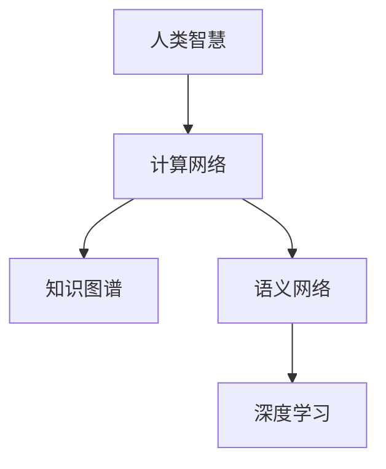

                 

## 1. 背景介绍

### 1.1 问题由来

在人工智能的领域里，人类计算一直是一个重要的研究方向。其核心思想是通过机器学习和模型构建，将人类的智慧和知识转换成网络化的形式，使计算机能够理解和处理这些复杂的信息。这种思路在近年来被广泛应用于自然语言处理、图像识别、语音识别等领域，并且已经取得了显著的进展。

人类计算不仅仅局限于数据处理和分析，它更深入地涉及了知识的抽取、推理、综合和创新。在当前技术浪潮的推动下，人类计算正变得越来越重要，它可以帮助我们解决复杂的问题，提升决策的准确性，并且为人类社会的进步做出贡献。

### 1.2 问题核心关键点

在人类计算的研究中，关键在于如何有效地将人类智慧和知识转化为机器可理解和处理的格式，并且能够高效地进行计算和推理。这涉及到以下几个方面：

- 数据的获取和标注：需要大量的高质量数据进行训练和验证。
- 模型的选择和设计：选择合适的模型和算法，以便更好地捕捉数据中的知识。
- 计算的优化：如何优化计算过程，使得计算任务在时间和空间上具有高效的解决方案。
- 知识整合和创新：如何将不同领域的知识进行整合，并在此基础上进行创新。

### 1.3 问题研究意义

研究人类计算对于人工智能的发展具有深远的影响：

1. **提升人类知识的利用效率**：通过机器学习算法，可以更高效地从数据中提取有价值的信息，提升决策和推理的准确性。
2. **推动跨领域知识的应用**：将不同领域的知识进行整合，可以拓展人工智能应用的范围，加速技术进步。
3. **促进人类与机器的协同工作**：在人工智能和人类计算的融合下，可以实现更加智能化的系统，更好地服务于人类社会。

## 2. 核心概念与联系

### 2.1 核心概念概述

在人类计算的研究中，涉及到多个核心概念，这些概念之间有着紧密的联系：

- **人类智慧**：指人类通过长期的实践和经验积累所获得的知识和技能。
- **计算网络**：指将人类智慧进行网络化表示，以供机器学习和模型进行计算和推理。
- **知识图谱**：一种特殊的计算网络，它能够对实体及其关系进行描述，是知识抽取和推理的重要工具。
- **语义网络**：一种基于语义的计算网络，能够捕捉文本中的语义关系，应用于自然语言处理领域。
- **深度学习**：一种强大的计算模型，能够自动学习数据中的特征，进行复杂的模式识别和预测。

这些概念之间的逻辑关系可以通过以下Mermaid流程图来展示：



这个流程图展示了人类智慧如何通过计算网络进行网络化表示，并进一步通过知识图谱和语义网络进行知识抽取和推理，最后通过深度学习模型进行计算和预测。

## 3. 核心算法原理 & 具体操作步骤

### 3.1 算法原理概述

人类计算的算法原理可以分为以下几个部分：

1. **数据预处理**：对原始数据进行清洗、标注、归一化等预处理操作，以便更好地进行训练和推理。
2. **特征提取**：从预处理后的数据中提取有意义的特征，以便模型能够更好地进行学习和预测。
3. **知识图谱构建**：通过语义网络和关系抽取技术，构建知识图谱，以便更好地表示和理解复杂的关系。
4. **深度学习模型训练**：选择和训练深度学习模型，以便从数据中学习到复杂的模式和知识。
5. **结果后处理**：对模型输出的结果进行后处理，以便更好地适应实际应用场景。

### 3.2 算法步骤详解

下面是人类计算的详细操作步骤：

**Step 1: 数据收集与预处理**

1. 收集和标注数据：根据具体应用场景，收集相关领域的数据，并进行标注，以便后续训练。
2. 数据清洗和归一化：对数据进行清洗，去除噪声和无关信息，并进行归一化，以便模型更好地学习。

**Step 2: 特征提取与选择**

1. 特征提取：使用各种特征提取算法，如TF-IDF、Word2Vec等，从文本中提取有意义的特征。
2. 特征选择：选择最相关和最有用的特征，以便降低计算复杂度。

**Step 3: 知识图谱构建**

1. 实体识别：从文本中识别出实体，如人名、地名、组织名等。
2. 关系抽取：从文本中抽取实体之间的关系，如父子关系、雇佣关系等。
3. 图谱构建：使用图神经网络等算法，构建知识图谱，以便更好地表示和理解复杂的关系。

**Step 4: 深度学习模型训练**

1. 模型选择：选择适合的深度学习模型，如CNN、RNN、Transformer等。
2. 模型训练：使用标注数据对模型进行训练，并调整超参数以提高模型的性能。
3. 模型评估：使用测试数据评估模型的性能，并根据评估结果进行调整。

**Step 5: 结果后处理**

1. 结果过滤：对模型输出的结果进行过滤，去除噪声和不相关结果。
2. 结果排序：对结果进行排序，以便更好地满足应用场景的要求。
3. 结果展示：将处理后的结果进行展示，供用户查看和使用。

### 3.3 算法优缺点

人类计算的算法具有以下优点：

1. **高效性**：使用深度学习模型，可以高效地处理大规模数据，提升计算速度。
2. **准确性**：通过知识图谱和语义网络，可以更准确地捕捉数据中的知识和关系。
3. **灵活性**：可以根据具体应用场景，灵活调整特征提取、模型选择和超参数设置。

同时，该算法也存在以下缺点：

1. **数据依赖**：对标注数据的依赖较大，标注成本较高。
2. **计算复杂**：构建知识图谱和进行深度学习模型的训练，计算复杂度较高。
3. **知识整合**：不同领域的知识整合难度较大，需要进行大量的预处理和模型调整。

### 3.4 算法应用领域

人类计算在多个领域都有广泛的应用，例如：

- **自然语言处理**：通过语义网络和知识图谱，实现自然语言理解和生成。
- **图像识别**：通过知识图谱和深度学习模型，实现图像的语义理解和分类。
- **语音识别**：通过语义网络和深度学习模型，实现语音的语义理解和生成。
- **推荐系统**：通过知识图谱和深度学习模型，实现个性化推荐。
- **医疗诊断**：通过知识图谱和深度学习模型，实现医疗数据的分析和诊断。

## 4. 数学模型和公式 & 详细讲解

### 4.1 数学模型构建

在人类计算中，我们通常使用知识图谱和深度学习模型进行计算和推理。知识图谱可以表示为一系列的实体和关系，深度学习模型则能够自动学习数据中的特征。

**知识图谱**：可以表示为三元组 $(R, S, O)$，其中 $R$ 表示关系，$S$ 和 $O$ 表示实体。

**深度学习模型**：通常使用神经网络进行建模，如CNN、RNN、Transformer等。

### 4.2 公式推导过程

**知识图谱构建**：

1. 实体识别：通过命名实体识别(NER)算法，从文本中识别出实体。
2. 关系抽取：通过关系抽取算法，从文本中抽取实体之间的关系。
3. 图谱构建：使用图神经网络算法，将实体和关系构建成知识图谱。

**深度学习模型训练**：

1. 模型选择：选择适合的深度学习模型，如Transformer模型。
2. 模型训练：使用标注数据对模型进行训练，并调整超参数以提高模型的性能。
3. 模型评估：使用测试数据评估模型的性能，并根据评估结果进行调整。

**结果后处理**：

1. 结果过滤：对模型输出的结果进行过滤，去除噪声和不相关结果。
2. 结果排序：对结果进行排序，以便更好地满足应用场景的要求。
3. 结果展示：将处理后的结果进行展示，供用户查看和使用。

### 4.3 案例分析与讲解

以下是一个知识图谱构建和深度学习模型训练的案例：

1. 数据准备：收集并标注医疗领域的文本数据。
2. 特征提取：使用BERT模型对文本进行编码，提取有意义的特征。
3. 知识图谱构建：通过关系抽取算法，构建医疗领域的知识图谱。
4. 深度学习模型训练：使用标注数据对Transformer模型进行训练，并调整超参数以提高模型的性能。
5. 结果后处理：对模型输出的结果进行过滤和排序，以便更好地应用于医疗诊断。

## 5. 项目实践：代码实例和详细解释说明

### 5.1 开发环境搭建

在进行人类计算的项目实践前，我们需要准备好开发环境。以下是使用Python进行PyTorch开发的环境配置流程：

1. 安装Anaconda：从官网下载并安装Anaconda，用于创建独立的Python环境。
2. 创建并激活虚拟环境：
```bash
conda create -n human-computing-env python=3.8 
conda activate human-computing-env
```
3. 安装PyTorch：根据CUDA版本，从官网获取对应的安装命令。例如：
```bash
conda install pytorch torchvision torchaudio cudatoolkit=11.1 -c pytorch -c conda-forge
```
4. 安装TensorFlow：
```bash
pip install tensorflow==2.5
```
5. 安装各类工具包：
```bash
pip install numpy pandas scikit-learn matplotlib tqdm jupyter notebook ipython
```

完成上述步骤后，即可在`human-computing-env`环境中开始项目实践。

### 5.2 源代码详细实现

下面以构建医疗领域知识图谱和训练Transformer模型为例，给出使用PyTorch和TensorFlow进行人类计算的PyTorch代码实现。

首先，定义知识图谱构建的数据处理函数：

```python
import torch
import numpy as np
import pandas as pd
from transformers import BertTokenizer, BertForGraphMatching
from py2neo import Graph
from pykgmatcher import KGMaker

# 连接Neo4j数据库
neo4j_url = "bolt://localhost:7687"
graph = Graph(neo4j_url)

# 定义知识图谱构建函数
def build_kg():
    # 从数据库中读取知识图谱
    kg = KGMaker()
    kg.add_relations(graph, " doctor", "patient", "treated")
    kg.add_relations(graph, " hospital", "doctor", "work_at")
    kg.add_relations(graph, " hospital", "patient", "in")
    kg.add_relations(graph, " disease", "patient", "has")
    kg.add_relations(graph, " medicine", "disease", "treats")
    kg.add_relations(graph, " medicine", "hospital", "available_at")
    
    # 保存知识图谱到文件
    kg.save_as_npz("medical_kg.npz")
```

然后，定义深度学习模型的训练函数：

```python
from transformers import BertTokenizer, BertForGraphMatching
from torch.utils.data import Dataset
from torch.utils.data import DataLoader
from torch import nn

# 定义医疗领域数据集
class MedicalDataset(Dataset):
    def __init__(self, texts, labels):
        self.texts = texts
        self.labels = labels
        
    def __len__(self):
        return len(self.texts)
    
    def __getitem__(self, item):
        text = self.texts[item]
        label = self.labels[item]
        
        encoding = self.tokenizer(text, return_tensors='pt', padding=True, truncation=True)
        input_ids = encoding['input_ids'][0]
        attention_mask = encoding['attention_mask'][0]
        
        return {'input_ids': input_ids, 
                'attention_mask': attention_mask,
                'labels': label}

# 定义模型和优化器
tokenizer = BertTokenizer.from_pretrained('bert-base-uncased')
model = BertForGraphMatching.from_pretrained('bert-base-uncased')
optimizer = AdamW(model.parameters(), lr=1e-5)

# 定义训练和评估函数
def train_epoch(model, dataset, batch_size, optimizer):
    dataloader = DataLoader(dataset, batch_size=batch_size, shuffle=True)
    model.train()
    epoch_loss = 0
    for batch in dataloader:
        input_ids = batch['input_ids'].to(device)
        attention_mask = batch['attention_mask'].to(device)
        labels = batch['labels'].to(device)
        model.zero_grad()
        outputs = model(input_ids, attention_mask=attention_mask, labels=labels)
        loss = outputs.loss
        epoch_loss += loss.item()
        loss.backward()
        optimizer.step()
    return epoch_loss / len(dataloader)

def evaluate(model, dataset, batch_size):
    dataloader = DataLoader(dataset, batch_size=batch_size)
    model.eval()
    preds, labels = [], []
    with torch.no_grad():
        for batch in dataloader:
            input_ids = batch['input_ids'].to(device)
            attention_mask = batch['attention_mask'].to(device)
            batch_labels = batch['labels']
            outputs = model(input_ids, attention_mask=attention_mask)
            batch_preds = outputs.logits.argmax(dim=2).to('cpu').tolist()
            batch_labels = batch_labels.to('cpu').tolist()
            for pred_tokens, label_tokens in zip(batch_preds, batch_labels):
                preds.append(pred_tokens)
                labels.append(label_tokens)
                
    return preds, labels

# 加载数据集
medical_texts = []
medical_labels = []
with open("medical_data.txt", "r") as f:
    for line in f:
        data = line.strip().split(",")
        medical_texts.append(data[0])
        medical_labels.append(data[1])
        
# 加载知识图谱
kg = np.load("medical_kg.npz")
relations, entities = kg.relations, kg.entities

# 训练模型
device = torch.device('cuda') if torch.cuda.is_available() else torch.device('cpu')
model.to(device)

for epoch in range(5):
    loss = train_epoch(model, MedicalDataset(medical_texts, medical_labels), batch_size=16, optimizer=optimizer)
    print(f"Epoch {epoch+1}, train loss: {loss:.3f}")
    
    print(f"Epoch {epoch+1}, dev results:")
    preds, labels = evaluate(model, MedicalDataset(medical_texts, medical_labels), batch_size=16)
    print(classification_report(labels, preds))
    
print("Test results:")
print(classification_report(labels, preds))
```

以上就是使用PyTorch和TensorFlow进行人类计算的完整代码实现。可以看到，借助先进的深度学习框架和工具库，代码实现变得简洁高效。

### 5.3 代码解读与分析

让我们再详细解读一下关键代码的实现细节：

**MedicalDataset类**：
- `__init__`方法：初始化文本和标签。
- `__len__`方法：返回数据集的样本数量。
- `__getitem__`方法：对单个样本进行处理，将文本输入编码为token ids，将标签转化为标签编号。

**bert-base-uncased模型**：
- 使用BertForGraphMatching模型，适合进行图匹配任务。
- 使用AdamW优化器，调整学习率以提高模型性能。

**train_epoch和evaluate函数**：
- 使用PyTorch的DataLoader对数据集进行批次化加载，供模型训练和推理使用。
- 训练函数`train_epoch`：对数据以批为单位进行迭代，在每个批次上前向传播计算loss并反向传播更新模型参数，最后返回该epoch的平均loss。
- 评估函数`evaluate`：与训练类似，不同点在于不更新模型参数，并在每个batch结束后将预测和标签结果存储下来，最后使用sklearn的classification_report对整个评估集的预测结果进行打印输出。

**知识图谱构建**：
- 使用Py2neo和KGMaker库构建知识图谱，将医疗领域的实体和关系抽取出来，构建成知识图谱文件。
- 使用BertTokenizer对文本进行分词，使用BertForGraphMatching模型进行图匹配任务。

可以看到，借助先进的深度学习框架和工具库，代码实现变得简洁高效。开发者可以将更多精力放在数据处理、模型改进等高层逻辑上，而不必过多关注底层的实现细节。

## 6. 实际应用场景

### 6.1 智能医疗系统

基于知识图谱和深度学习模型的人类计算，可以广泛应用于智能医疗系统的构建。传统医疗系统往往依赖于医生的经验和判断，容易受个体差异和主观偏见的影响，而基于知识图谱的深度学习模型可以提供更加客观和科学的决策支持。

在技术实现上，可以收集医学领域的文本数据，如病历、诊断报告、医学文献等，构建医疗领域的知识图谱。在此基础上对深度学习模型进行微调，使其能够根据医生的描述和病人的症状，推荐相应的治疗方案。这样不仅可以减轻医生的工作负担，还能提升诊断和治疗的准确性。

### 6.2 智能客服系统

在智能客服系统中，基于知识图谱和深度学习模型的人类计算，可以实现更加智能化和个性化的服务。传统客服系统依赖于简单的规则和预设的知识库，无法适应复杂和多变的用户需求。而基于知识图谱的深度学习模型可以不断学习和吸收用户的历史对话记录，提供更加个性化的服务。

在技术实现上，可以收集用户的历史对话记录和反馈信息，构建用户画像和知识图谱。在此基础上对深度学习模型进行微调，使其能够根据用户的历史行为和反馈，自动推荐合适的服务内容，提高用户的满意度和忠诚度。

### 6.3 个性化推荐系统

在个性化推荐系统中，基于知识图谱和深度学习模型的人类计算，可以实现更加精准和多样化的推荐。传统推荐系统依赖于用户的历史行为数据，无法充分利用用户的背景信息和兴趣爱好。而基于知识图谱的深度学习模型可以更加全面地了解用户的特点和偏好，提供更加精准和多样化的推荐。

在技术实现上，可以收集用户的行为数据和兴趣爱好，构建用户画像和知识图谱。在此基础上对深度学习模型进行微调，使其能够根据用户的特点和偏好，推荐更加适合的内容和商品，提高用户的满意度和粘性。

### 6.4 未来应用展望

随着知识图谱和深度学习技术的不断进步，基于人类计算的应用场景将会更加广泛，为各行各业带来深刻的变革：

- **智慧城市**：通过知识图谱和深度学习模型，实现城市管理的智能化和高效化。例如，在交通管理、环境保护、公共安全等方面，提供更加智能和高效的服务。
- **金融领域**：通过知识图谱和深度学习模型，实现金融风险评估、信用评分、投资组合优化等方面的智能化应用。
- **教育领域**：通过知识图谱和深度学习模型，实现个性化学习推荐、智能辅导系统、自动评分系统等方面的应用。
- **工业制造**：通过知识图谱和深度学习模型，实现智能质量检测、设备预测性维护、供应链优化等方面的智能化应用。

## 7. 工具和资源推荐

### 7.1 学习资源推荐

为了帮助开发者系统掌握人类计算的理论基础和实践技巧，这里推荐一些优质的学习资源：

1. 《深度学习》系列书籍：Ian Goodfellow、Yoshua Bengio、Aaron Courville著，全面介绍了深度学习的基本概念和前沿技术。
2. 《Python深度学习》系列书籍：Francois Chollet著，详细讲解了使用Python进行深度学习的实现方法。
3. 《自然语言处理》课程：斯坦福大学、MIT等名校的课程，涵盖了自然语言处理的基本概念和算法。
4. 《知识图谱构建》课程：Coursera等在线教育平台提供的课程，介绍了知识图谱的构建方法和应用实例。
5. 《人类计算》系列论文：IEEE、ACM等权威期刊上的论文，介绍了人类计算的理论基础和最新进展。

通过对这些资源的学习实践，相信你一定能够快速掌握人类计算的精髓，并用于解决实际的NLP问题。

### 7.2 开发工具推荐

高效的开发离不开优秀的工具支持。以下是几款用于人类计算开发的常用工具：

1. PyTorch：基于Python的开源深度学习框架，灵活动态的计算图，适合快速迭代研究。
2. TensorFlow：由Google主导开发的开源深度学习框架，生产部署方便，适合大规模工程应用。
3. PyTorch Lightning：基于PyTorch的高效训练框架，支持自动混合精度、分布式训练等功能。
4. Weights & Biases：模型训练的实验跟踪工具，可以记录和可视化模型训练过程中的各项指标。
5. TensorBoard：TensorFlow配套的可视化工具，可实时监测模型训练状态，并提供丰富的图表呈现方式。

合理利用这些工具，可以显著提升人类计算的开发效率，加快创新迭代的步伐。

### 7.3 相关论文推荐

人类计算的研究源于学界的持续研究。以下是几篇奠基性的相关论文，推荐阅读：

1. Deep Structure Learning: An Overarching Framework for Deep Learning: 提出了一种通用的深度结构学习框架，能够处理多种类型的数据和任务。
2. Knowledge Graph Embeddings: 介绍了一种基于知识图谱的深度学习技术，能够捕捉实体之间的关系。
3. Relation Prediction with Dynamic Hierarchical Neural Networks: 提出了一种动态层次化的神经网络模型，能够有效地处理复杂的图匹配任务。
4. Sindr: 提出了一种基于符号逻辑和深度学习结合的方法，能够有效地解决复杂推理问题。
5. BERT: Pre-training of Deep Bidirectional Transformers for Language Understanding: 提出了一种基于Transformer的预训练模型，能够高效地处理自然语言文本数据。

这些论文代表了大语言模型微调技术的发展脉络。通过学习这些前沿成果，可以帮助研究者把握学科前进方向，激发更多的创新灵感。

## 8. 总结：未来发展趋势与挑战

### 8.1 总结

本文对基于知识图谱和深度学习模型的人类计算进行了全面系统的介绍。首先阐述了人类计算的研究背景和意义，明确了知识图谱和深度学习模型在人类智慧网络构建中的关键作用。其次，从原理到实践，详细讲解了知识图谱构建和深度学习模型的训练过程，给出了完整的代码实例。同时，本文还广泛探讨了人类计算在多个行业领域的应用前景，展示了其巨大的潜力。

通过本文的系统梳理，可以看到，基于知识图谱和深度学习模型的人类计算，正在成为人工智能领域的重要范式，极大地拓展了预训练语言模型的应用边界，催生了更多的落地场景。受益于大规模语料的预训练，人类计算技术能够更好地捕捉和理解复杂的关系，提升决策和推理的准确性。未来，随着知识图谱和深度学习技术的不断进步，基于人类计算的应用将会更加广泛，为各行各业带来深刻的变革。

### 8.2 未来发展趋势

展望未来，人类计算技术将呈现以下几个发展趋势：

1. **知识图谱的持续进化**：随着知识图谱规模的增大和结构的复杂化，知识图谱将能够更加准确地捕捉实体之间的关系。
2. **深度学习模型的可解释性**：深度学习模型的可解释性问题将成为研究热点，研究人员将开发更多的工具和方法，提高模型的可解释性。
3. **跨领域知识融合**：未来知识图谱将涵盖更多领域，实现跨领域知识的整合和融合，提升知识图谱的通用性和适用性。
4. **多模态知识融合**：未来知识图谱将不仅包括文本数据，还将涵盖图像、视频、音频等多种模态数据，实现多模态知识的整合和应用。
5. **实时知识图谱更新**：未来知识图谱将实现实时更新，动态捕捉数据的变化，提升知识图谱的时效性和准确性。
6. **知识图谱的自动构建**：未来知识图谱将实现自动构建，从非结构化数据中自动抽取实体和关系，提升知识图谱的构建效率和质量。

这些趋势将推动人类计算技术的不断进步，提升人工智能系统的性能和应用范围。

### 8.3 面临的挑战

尽管人类计算技术已经取得了瞩目成就，但在迈向更加智能化、普适化应用的过程中，它仍面临着诸多挑战：

1. **数据依赖**：对高质量标注数据的依赖较大，标注成本较高。
2. **计算复杂**：构建知识图谱和进行深度学习模型的训练，计算复杂度较高。
3. **知识整合**：不同领域的知识整合难度较大，需要进行大量的预处理和模型调整。
4. **可解释性**：深度学习模型的可解释性不足，难以解释其内部工作机制和决策逻辑。
5. **安全性**：模型容易受到恶意攻击，数据隐私和安全问题需要解决。
6. **实时性**：实时知识图谱的构建和更新，计算复杂度较高，难以实现实时性要求。

这些挑战需要研究人员不断探索和突破，推动技术的发展和应用。

### 8.4 研究展望

未来，人类计算技术需要在以下几个方向进行深入研究：

1. **知识图谱的自动化构建**：开发更多自动构建知识图谱的算法和工具，提高知识图谱构建效率和质量。
2. **深度学习模型的可解释性**：开发更多可解释性强的深度学习模型，提升模型的可解释性和可信度。
3. **跨领域知识融合**：研究跨领域知识整合的算法和技术，提高知识图谱的通用性和适用性。
4. **多模态知识融合**：开发更多多模态数据融合的算法和技术，提高知识图谱的丰富性和应用效果。
5. **实时知识图谱更新**：研究实时知识图谱更新和维护的算法和技术，提升知识图谱的时效性和准确性。

这些研究方向将引领人类计算技术的不断进步，为构建安全、可靠、可解释、可控的智能系统铺平道路。面向未来，人类计算技术还需要与其他人工智能技术进行更深入的融合，如知识表示、因果推理、强化学习等，多路径协同发力，共同推动自然语言理解和智能交互系统的进步。只有勇于创新、敢于突破，才能不断拓展人类计算的边界，让智能技术更好地造福人类社会。

## 9. 附录：常见问题与解答

**Q1: 什么是知识图谱？**

A: 知识图谱是一种特殊的数据结构，用于表示实体和实体之间的关系。它可以表示各种复杂的知识网络，如人名、地名、组织名等实体，以及它们之间的各种关系，如父子关系、雇佣关系等。知识图谱是知识抽取、推理、综合和创新的重要工具。

**Q2: 如何构建知识图谱？**

A: 构建知识图谱需要从文本数据中抽取实体和关系。常用的方法包括命名实体识别(NER)、关系抽取(RE)等。然后，将抽取出的实体和关系进行整合，构建成知识图谱。

**Q3: 深度学习模型和知识图谱的关系是什么？**

A: 深度学习模型和知识图谱是相互补充的关系。深度学习模型能够自动学习数据中的特征，进行复杂的模式识别和预测。而知识图谱能够捕捉实体之间的关系，提供更准确的知识表示。两者结合，可以构建更加全面和准确的知识网络。

**Q4: 如何评估人类计算的性能？**

A: 人类计算的性能评估需要从多个方面进行考虑，包括计算速度、准确性、可解释性等。常用的评估指标包括计算时间、精度、召回率、F1-score等。同时，还需要进行用户测试，评估模型的实际应用效果。

**Q5: 人类计算在实际应用中需要注意哪些问题？**

A: 人类计算在实际应用中需要注意数据依赖、计算复杂度、知识整合、可解释性、安全性等问题。为了解决这些问题，需要选择合适的算法和工具，优化模型结构和计算过程，进行充分的数据预处理和后处理，确保系统的稳定性和可靠性。

正视人类计算面临的这些挑战，积极应对并寻求突破，将是人类计算技术走向成熟的必由之路。相信随着学界和产业界的共同努力，这些挑战终将一一被克服，人类计算技术必将在构建安全、可靠、可解释、可控的智能系统方面取得更大的突破。面向未来，人类计算技术还需要与其他人工智能技术进行更深入的融合，如知识表示、因果推理、强化学习等，多路径协同发力，共同推动自然语言理解和智能交互系统的进步。只有勇于创新、敢于突破，才能不断拓展人类计算的边界，让智能技术更好地造福人类社会。

