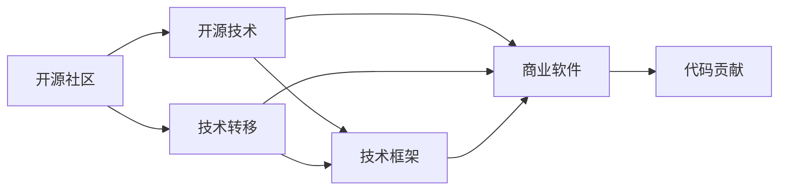

                 

# 从代码贡献到开源商业化之路

> 关键词：开源社区, 商业化模型, 技术转移, 技术框架, 代码贡献, 商业软件

## 1. 背景介绍

随着开源社区的蓬勃发展和商业化软件市场的不断扩大，越来越多的技术公司和开发者开始寻求如何将技术成果成功商业化，并将之转化为生产力。本文旨在探讨如何将技术贡献从开源社区顺利过渡到商业化应用的路径，从技术原理到具体实践，全面解析技术转移的机制与方法。

### 1.1 背景现状

开源技术近年来在企业级应用中的普及率显著提高。许多企业通过整合开源技术，大幅降低了研发成本，缩短了产品上市时间，满足了日益激烈的市场竞争需求。然而，成功应用开源技术并非易事。如何识别、吸收和整合这些开源资源，如何将开源代码转化为商业软件，是企业面临的关键挑战。本文将深入探讨开源技术的商业化转化过程，为企业提供实用指南。

## 2. 核心概念与联系

### 2.1 核心概念概述

为了帮助读者理解开源技术的商业化转化路径，本节首先定义几个核心概念及其相互联系：

- **开源社区(Open Source Community)**：一个开放的开发环境，汇集了全球众多开发者，共享源代码并贡献技术。开源社区强调协作开发、自由共享与持续创新。
- **开源技术(Open Source Technology)**：由开源社区贡献的自由软件或代码库，包含算法、框架、组件等。开源技术以许可协议为基础，便于企业以多种方式使用。
- **技术转移(Technology Transfer)**：将研究开发成果转化为商业应用的过程。包括开源技术的吸收、整合和商业化应用，涉及法律、管理、技术等多个层面。
- **技术框架(Framework)**：为开发特定应用场景而设计的一组代码库、算法和工具，提供了完整的开发环境和组件库，便于企业快速搭建和部署应用。
- **商业软件(Commercial Software)**：通过商业途径销售和部署的软件产品，包括开源软件的商业版本和企业自研软件。商业软件强调稳定性、性能和可扩展性，满足企业应用需求。
- **代码贡献(Code Contribution)**：开发者向开源项目提交代码，为其改进功能和性能。代码贡献有助于开源技术的持续优化和创新。

这些核心概念之间的逻辑关系可以用以下Mermaid流程图表示：



### 2.2 核心概念原理和架构的 Mermaid 流程图

在上述Mermaid流图中，箭头表示概念间的连接关系：

1. **A** 开源社区：提供代码共享和协作开发的平台，支持开源技术的广泛传播和持续发展。
2. **B** 开源技术：来自社区的代码和算法，经过开源社区的审核和优化，形成了稳定可靠的开源解决方案。
3. **C** 技术转移：企业通过识别、整合和应用开源技术，实现技术成果的商业化转化。
4. **D** 技术框架：经过商业化的开源技术，进一步封装和完善，成为企业可用的技术框架。
5. **E** 商业软件：以开源技术为基础，结合企业需求和商业策略，最终实现的软件产品。
6. **G** 代码贡献：企业开发者通过贡献代码，进一步推动开源技术的创新和发展。

通过这一流程，企业能够高效地将开源技术转化为满足自身需求的软件解决方案。

## 3. 核心算法原理 & 具体操作步骤

### 3.1 算法原理概述

开源技术的商业化转化是一个复杂的技术转移过程，涉及开源技术的选择、整合、优化、封装和部署等多个环节。其核心算法原理可以归纳为以下几个步骤：

1. **需求分析**：明确企业需求，确定所需开源技术的核心功能和性能指标。
2. **技术筛选**：根据需求筛选适合的开源技术，评估其技术成熟度和社区活跃度。
3. **技术整合**：通过技术整合，将开源技术适配到企业现有的技术栈和开发环境中。
4. **优化升级**：对开源技术进行本地化和定制化优化，提升其适应性和可靠性。
5. **封装部署**：将优化后的开源技术封装为技术框架或商业软件，提供易于使用的API接口。
6. **市场推广**：通过市场营销和产品推广，将商业软件推向市场，满足企业及用户需求。

### 3.2 算法步骤详解

开源技术的商业化转化流程可分为以下六个主要步骤：

**Step 1: 需求分析**
企业需要明确自身业务需求和应用场景，确定所需开源技术的关键功能和技术指标。例如，企业可能需求一款具备高性能、低延迟和强扩展性的消息队列系统。

**Step 2: 技术筛选**
从开源社区中筛选出满足需求的开源技术。这需要评估开源技术的成熟度、社区活跃度、技术文档、使用案例等。例如，对于消息队列系统，可以选择Apache Kafka或RabbitMQ。

**Step 3: 技术整合**
将选定的开源技术整合到企业的开发环境和架构中。通过安装、配置、集成等步骤，使开源技术能够与企业现有的系统无缝对接。例如，将Apache Kafka部署到Kubernetes集群中，并集成Spring Boot应用。

**Step 4: 优化升级**
对开源技术进行本地化和定制化优化，增强其适应性和可靠性。例如，针对企业应用场景，对Apache Kafka进行性能调优、资源管理配置和监控集成。

**Step 5: 封装部署**
将优化后的开源技术封装为技术框架或商业软件，提供易于使用的API接口。例如，开发一套基于Apache Kafka的企业级消息队列系统，并封装为RESTful API接口。

**Step 6: 市场推广**
通过市场营销和产品推广，将封装好的商业软件推向市场，满足企业及用户需求。例如，通过CRM平台和市场渠道，推广消息队列系统，获取潜在客户和用户。

### 3.3 算法优缺点

开源技术的商业化转化过程有以下优点和缺点：

**优点:**
1. **成本低**：利用开源社区的资源，可以大幅降低研发成本。
2. **灵活性强**：开源技术通常具有高度的灵活性和可定制性，能够快速适应企业需求。
3. **社区支持**：开源社区提供了丰富的文档、插件和社区支持，便于技术学习和问题解决。
4. **创新速度快**：开源技术更新迭代快，能够快速引入新技术和新功能。

**缺点:**
1. **质量不一**：开源技术质量参差不齐，部分开源项目可能存在不稳定或未经验证的问题。
2. **管理复杂**：开源技术需要定期维护和管理，增加了运维成本。
3. **依赖关系复杂**：开源技术之间的依赖关系复杂，需要精确管理和协调。
4. **开源协议限制**：开源协议可能对商业化的二次开发和分发带来限制。

### 3.4 算法应用领域

开源技术的商业化转化适用于各种企业应用场景，包括但不限于：

- **开发环境**：企业可以选择开源IDE、版本控制工具和构建工具，提升开发效率和协作能力。
- **基础设施**：企业可以利用开源数据库、存储系统、网络组件，构建高性能、高可靠的基础设施。
- **业务应用**：企业可以选择开源ERP、CRM、HRM等业务系统，满足企业运营需求。
- **移动应用**：企业可以利用开源移动开发框架和组件，快速开发和部署移动应用。
- **大数据和人工智能**：企业可以选择开源大数据、机器学习、深度学习框架，推动数字化转型。

开源技术的商业化转化，为各行各业带来了无限的创新可能。通过科学合理地应用开源技术，企业能够在保持成本效益的同时，获得快速的市场响应和持续的技术创新。

## 4. 数学模型和公式 & 详细讲解 & 举例说明

### 4.1 数学模型构建

技术转移的数学模型可以表示为：

$$ T = T_{open} + T_{custom} + T_{market} $$

其中：
- $T$ 为技术转移结果
- $T_{open}$ 为开源技术贡献
- $T_{custom}$ 为定制化开发
- $T_{market}$ 为市场推广

### 4.2 公式推导过程

1. **开源技术贡献**：
   - $T_{open} = C_{open} \times F_{open}$
     - $C_{open}$ 为开源技术社区提供的贡献，如源代码、API接口、插件库等。
     - $F_{open}$ 为开源技术的可用性和质量，通过社区评分、文档完备度等指标评估。

2. **定制化开发**：
   - $T_{custom} = C_{custom} \times F_{custom}$
     - $C_{custom}$ 为定制化开发所投入的时间和资源。
     - $F_{custom}$ 为定制化开发的效果，包括性能、可靠性和扩展性等指标。

3. **市场推广**：
   - $T_{market} = C_{market} \times F_{market}$
     - $C_{market}$ 为市场推广所投入的预算和资源。
     - $F_{market}$ 为市场推广的效果，包括市场占有率、用户反馈和收益等指标。

### 4.3 案例分析与讲解

以MySQL数据库为例，说明开源技术如何成功商业化：

**Step 1: 需求分析**
企业需要一款高性能、高可靠、易于管理的数据库系统。

**Step 2: 技术筛选**
从开源社区筛选出MySQL，它是一个成熟的开源关系型数据库系统，具备高性能、可扩展性和社区支持。

**Step 3: 技术整合**
在企业环境中安装和配置MySQL，集成到现有的IT架构中。

**Step 4: 优化升级**
针对企业需求，对MySQL进行优化配置，提升性能和可靠性。

**Step 5: 封装部署**
开发基于MySQL的企业级数据库管理系统，封装为RESTful API接口。

**Step 6: 市场推广**
通过CRM平台和市场渠道推广MySQL，获取潜在客户和用户。

## 5. 项目实践：代码实例和详细解释说明

### 5.1 开发环境搭建

以开发基于Apache Kafka的企业级消息队列系统为例，搭建开发环境：

1. 安装Anaconda：从官网下载并安装Anaconda，用于创建独立的Python环境。
2. 创建并激活虚拟环境：
```bash
conda create -n kafka-env python=3.8 
conda activate kafka-env
```

3. 安装Apache Kafka和相关依赖：
```bash
conda install kafka-python
```

4. 下载Apache Kafka源代码：
```bash
wget https://kafka.apache.org/releases/download/3.0.0/kafka_3.0.0.tgz
```

5. 解压并编译Apache Kafka：
```bash
tar -xvf kafka_3.0.0.tgz
cd kafka_3.0.0
./bin/./configure && make -j4
```

6. 启动Kafka集群：
```bash
bin/kafka-server-start.sh config/server.properties
```

### 5.2 源代码详细实现

源代码实现步骤如下：

1. 配置Kafka客户端连接：
```python
from kafka import KafkaProducer

producer = KafkaProducer(bootstrap_servers='localhost:9092',
                         value_serializer=str.encode)
```

2. 发送消息：
```python
producer.send('my-topic', b'Hello, Kafka!')
producer.flush()
```

3. 接收消息：
```python
from kafka import KafkaConsumer

consumer = KafkaConsumer('my-topic', bootstrap_servers='localhost:9092')

for message in consumer:
    print(message.value.decode('utf-8'))
```

### 5.3 代码解读与分析

以上代码实现了Kafka的基本使用功能，包括发送消息和接收消息。通过配置连接参数和API接口，可以方便地将Kafka集成到企业系统中，用于实时数据流处理和分布式消息队列功能。

**发送消息**：
- 使用`KafkaProducer`对象连接Kafka集群，指定`bootstrap_servers`参数连接服务器。
- 通过`send`方法发送消息，`value_serializer`参数用于指定消息的序列化方式，这里使用`str.encode`将字符串转换为字节流。

**接收消息**：
- 使用`KafkaConsumer`对象连接Kafka集群，指定`my-topic`主题和`bootstrap_servers`参数连接服务器。
- 通过`for`循环和`value.decode`方法解析接收到的消息，并输出到控制台。

### 5.4 运行结果展示

启动Kafka集群后，可以发送和接收消息，并查看输出结果。例如，发送消息`Hello, Kafka!`后，可以收到`Hello, Kafka!`的输出。

## 6. 实际应用场景

### 6.1 企业内部数据交换

企业内部系统之间数据交换常常需要实时、可靠的消息队列。通过将Apache Kafka封装为技术框架或商业软件，企业可以构建高可用、高性能的消息队列系统，满足企业内部数据交换需求。

### 6.2 云平台架构

云平台架构中需要具备高性能、可扩展性和高可靠性的消息队列服务。Apache Kafka可以通过企业级封装，支持多云部署和集群管理，为企业提供云原生消息队列解决方案。

### 6.3 大数据分析

企业可以利用Apache Kafka收集和传输实时数据，将数据送入Hadoop或Spark等大数据处理框架，实现大数据分析。通过商业化封装，Apache Kafka可以提供统一的API接口，方便企业集成和使用。

## 7. 工具和资源推荐

### 7.1 学习资源推荐

为了帮助开发者系统掌握开源技术的商业化转化过程，这里推荐一些优质的学习资源：

1. **Open Source Software Community: The Global Developer Community**：探索全球开源社区的发展和贡献机制。
2. **Open Source Technology Adoption Guide**：详细指导如何评估和选择开源技术。
3. **Technology Transfer for Open Source Software**：讲解开源技术的商业化转化流程和策略。
4. **Apache Kafka: The Definitive Guide**：深入解析Apache Kafka的使用和商业化。
5. **Apache Kafka Enterprise Architecture**：介绍Apache Kafka在企业架构中的部署和优化。

### 7.2 开发工具推荐

开源技术的商业化转化过程中，需要高效的工具支持。以下是几款用于开源技术商业化转化的常用工具：

1. **JIRA**：项目管理工具，便于跟踪开源技术转化的各个步骤和任务。
2. **GitHub**：开源代码托管平台，便于代码贡献、协作和版本控制。
3. **Docker**：容器化技术，便于打包和部署开源技术组件。
4. **Ansible**：自动化运维工具，便于配置和优化开源技术环境。
5. **Jenkins**：持续集成和持续交付工具，便于自动化构建和测试开源技术应用。

### 7.3 相关论文推荐

开源技术的商业化转化涉及多个研究方向，以下是几篇奠基性的相关论文，推荐阅读：

1. **Open Source Software Development: The Developer’s Perspective**：从开发者视角探讨开源社区和技术的协同发展。
2. **Technology Transfer in Open Source Software Projects**：分析开源项目的技术转移机制和效果。
3. **Open Source Software Commercialization: A Practical Guide**：指导企业如何实现开源技术的商业化。
4. **Enterprise-Level Apache Kafka Deployment and Management**：探讨Apache Kafka在企业架构中的部署和管理。
5. **Apache Kafka for Big Data: A Survey**：回顾Apache Kafka在大数据和流处理中的应用和商业化路径。

## 8. 总结：未来发展趋势与挑战

### 8.1 研究成果总结

开源技术在企业中的应用越来越广泛，企业通过开源技术商业化转化，能够快速响应市场变化，提高技术创新能力。本文系统介绍了开源技术的商业化转化流程和策略，为企业提供了实用指南。

### 8.2 未来发展趋势

开源技术的商业化转化将呈现以下几个发展趋势：

1. **更高效的工具链**：随着DevOps和CI/CD工具的发展，开源技术的商业化转化将更加自动化和高效。
2. **更灵活的架构**：企业级封装和微服务化架构将使开源技术更加灵活，便于企业快速部署和扩展。
3. **更广泛的应用场景**：开源技术将被应用到更多的业务场景中，推动企业数字化转型。
4. **更智能的运维**：人工智能和机器学习技术将用于自动化运维和故障预测，提升开源技术的可靠性和可用性。
5. **更严格的安全性**：开源技术的安全性将成为企业关注的重点，如何防范开源社区的风险和漏洞，将是重要的研究课题。

### 8.3 面临的挑战

开源技术的商业化转化仍面临诸多挑战：

1. **开源社区的不稳定性**：开源项目的不稳定和未经验证的问题可能影响商业化效果。
2. **管理和维护的复杂性**：开源技术的复杂性和多样性增加了企业的管理和维护成本。
3. **跨平台兼容性**：开源技术需要在不同的平台和环境中稳定运行，可能存在兼容性问题。
4. **二次开发的限制**：开源协议可能对二次开发和分发带来限制，影响企业的商业化策略。
5. **商业化的成本**：开源技术的商业化转化需要投入大量的时间和资源，企业可能面临较高的商业化成本。

### 8.4 研究展望

面对开源技术商业化转化的挑战，未来的研究需要在以下几个方面寻求新的突破：

1. **开源社区协作机制**：建立更高效的社区协作机制，增强开源项目的稳定性和成熟度。
2. **商业化的开源协议**：开发更灵活的开源协议，降低商业化转化中的法律和合规风险。
3. **开源技术的深度定制**：开发更深度定制的开源技术，满足企业特定的需求。
4. **自动化工具链**：开发更高效的自动化工具链，加速开源技术的商业化转化。
5. **企业级封装策略**：制定更合适的企业级封装策略，提升开源技术的商业化效果。

这些研究方向的探索，将进一步推动开源技术的商业化转化，助力企业快速实现技术成果的产业化应用。

## 9. 附录：常见问题与解答

**Q1: 开源技术商业化转化的核心步骤是什么？**

A: 开源技术商业化转化的核心步骤包括需求分析、技术筛选、技术整合、优化升级、封装部署和市场推广。

**Q2: 开源技术商业化转化有哪些常用工具？**

A: 开源技术商业化转化常用工具包括JIRA、GitHub、Docker、Ansible和Jenkins等。

**Q3: 开源技术商业化转化面临哪些挑战？**

A: 开源技术商业化转化面临开源社区的不稳定性、管理和维护的复杂性、跨平台兼容性、二次开发的限制和商业化的成本等挑战。

**Q4: 开源技术商业化转化有哪些成功案例？**

A: 开源技术商业化转化成功案例包括MySQL、Apache Kafka、Hadoop等，它们在企业级应用中已经取得了显著的效果。

通过本文的系统梳理，读者可以全面了解开源技术的商业化转化过程，把握关键步骤和技术要点，为企业开源技术的成功应用提供实用指南。

---

作者：禅与计算机程序设计艺术 / Zen and the Art of Computer Programming

