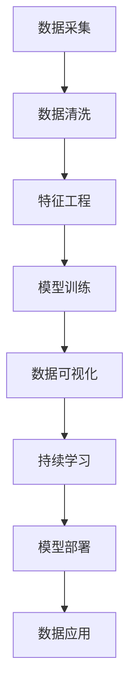

                 

# 从传统分析到AI洞察：Lepton AI的数据价值挖掘

> 关键词：人工智能(AI)，数据挖掘，机器学习(ML)，AI洞察，Lepton AI，数据分析

## 1. 背景介绍

### 1.1 问题由来

在数据驱动的决策时代，数据已成为企业最宝贵的资产之一。如何从海量数据中提取有价值的信息，发现隐藏在数据背后的规律和趋势，一直是大数据分析的核心挑战。传统的数据分析技术，如统计学、数据挖掘、OLAP等，虽然能够处理一些基本的数据洞察需求，但在复杂多变、非结构化的数据面前显得力不从心。

近年来，随着人工智能技术的飞速发展，尤其是深度学习和数据挖掘技术的结合，AI洞察能力迅速崛起。通过机器学习模型对数据进行深度学习，可以揭示出更为复杂和深刻的规律，实现从数据到智能的飞跃。Lepton AI作为AI领域的新兴力量，专注于利用机器学习和大数据分析技术，帮助企业深入挖掘数据价值，实现AI洞察。

### 1.2 问题核心关键点

Lepton AI的核心技术主要围绕以下几个关键点展开：

1. **数据预处理**：通过自动化的数据清洗和特征工程，将原始数据转换为模型可接受的格式。
2. **机器学习模型**：基于深度学习框架，构建各种类型的机器学习模型，实现对数据的高效学习。
3. **数据可视化**：利用先进的可视化技术，将AI洞察结果直观呈现，辅助企业决策。
4. **持续学习**：实现模型的自适应和自我优化，保持模型的高效性和准确性。

### 1.3 问题研究意义

Lepton AI的AI洞察技术，能够有效降低企业数据分析的复杂度，提升数据分析的效率和精度。具体意义如下：

1. **提升数据处理效率**：自动化数据预处理和特征工程，大大减少了人工操作和错误。
2. **增强数据洞察深度**：通过深度学习模型，能够发现数据背后的复杂关系和规律。
3. **优化决策过程**：通过可视化技术，将复杂的数据洞察结果直观展示，辅助企业决策。
4. **实现持续改进**：通过持续学习机制，保证模型能够不断适应数据变化，提高决策质量。

## 2. 核心概念与联系

### 2.1 核心概念概述

Lepton AI的核心概念主要包括以下几个关键要素：

- **数据预处理**：从数据采集、清洗、特征工程到数据转换，数据预处理是AI洞察的基础。
- **机器学习模型**：通过深度学习、卷积神经网络(CNN)、循环神经网络(RNN)、注意力机制等技术，构建高效的数据学习模型。
- **数据可视化**：利用图形化、图表等形式，将AI洞察结果直观呈现，便于理解和决策。
- **持续学习**：通过在线学习和增量学习，使AI模型能够不断适应数据变化，保持高效性能。

这些概念共同构成了Lepton AI的核心技术框架，使得企业能够高效地从数据中提取有价值的信息，实现AI洞察。

### 2.2 核心概念原理和架构的 Mermaid 流程图



这个流程图展示了Lepton AI技术的基本流程，从数据采集、清洗、特征工程到模型训练、可视化、持续学习，最终部署到实际应用中，形成闭环。

## 3. 核心算法原理 & 具体操作步骤

### 3.1 算法原理概述

Lepton AI的核心算法原理主要围绕以下几个方面展开：

- **深度学习模型**：利用深度神经网络对数据进行学习，提取高层次的特征表示。
- **迁移学习**：将预训练模型应用于新数据集，提高模型在新领域上的泛化能力。
- **自监督学习**：通过无监督学习任务（如自回归、掩码语言模型等），让模型在无标签数据上自适应学习。
- **半监督学习**：结合少量标签数据和大量无标签数据，提升模型在特定任务上的性能。

### 3.2 算法步骤详解

以下是Lepton AI主要算法的详细步骤：

**Step 1: 数据采集与预处理**

1. **数据采集**：收集企业内部或外部的数据，包括结构化数据和非结构化数据。
2. **数据清洗**：去除噪音、重复数据、异常值等，确保数据质量。
3. **特征工程**：对清洗后的数据进行特征提取和处理，生成模型可接受的特征向量。
4. **数据转换**：将数据转换为模型可接受的格式，如TensorFlow、PyTorch等深度学习框架的张量。

**Step 2: 模型训练与优化**

1. **模型选择**：根据任务类型选择合适的深度学习模型，如CNN、RNN、Transformer等。
2. **模型初始化**：加载预训练模型或从头开始训练模型。
3. **模型训练**：在训练集上进行模型训练，调整模型参数以最小化损失函数。
4. **模型评估**：在验证集上评估模型性能，调整超参数和模型结构。
5. **模型优化**：使用优化算法（如Adam、SGD等）对模型进行优化，提高模型收敛速度和精度。

**Step 3: 数据可视化与解读**

1. **结果可视化**：将模型输出结果（如预测概率、分类结果等）通过图形化展示，便于理解。
2. **数据解读**：对可视化结果进行解读，提取有价值的信息和洞察。
3. **决策支持**：将AI洞察结果与业务决策相结合，辅助企业制定决策。

**Step 4: 持续学习与更新**

1. **在线学习**：在新的数据到来时，动态更新模型参数，适应数据变化。
2. **增量学习**：通过增量学习机制，不断更新模型，保持模型的高效性。
3. **模型监控**：监控模型性能，及时发现和修复模型缺陷。

### 3.3 算法优缺点

Lepton AI的AI洞察技术具有以下优点：

1. **高效性**：通过自动化和高效的数据处理和特征工程，减少了人工干预，提高了处理效率。
2. **深度学习能力**：利用深度学习模型，可以发现数据背后的复杂规律和关系，提升洞察深度。
3. **可视化直观**：通过可视化技术，将复杂的数据洞察结果直观呈现，便于理解和决策。
4. **持续改进**：通过持续学习和在线学习机制，使模型能够不断适应数据变化，保持高效性能。

同时，该技术也存在一定的局限性：

1. **数据质量依赖**：数据质量和处理质量直接影响AI洞察的准确性和可靠性。
2. **模型复杂度**：深度学习模型复杂度高，训练和部署成本较高。
3. **解释性不足**：深度学习模型通常是"黑盒"模型，难以解释其内部工作机制和决策逻辑。
4. **资源需求高**：深度学习模型对计算资源和存储空间需求较高，需要高性能设备支持。

### 3.4 算法应用领域

Lepton AI的AI洞察技术已经在多个领域得到了应用，具体如下：

1. **金融领域**：利用AI洞察技术，进行风险评估、信用评分、欺诈检测等任务。
2. **医疗领域**：应用于疾病预测、患者管理、治疗方案推荐等任务。
3. **零售领域**：实现客户行为分析、产品推荐、库存管理等任务。
4. **制造领域**：进行设备维护、质量控制、生产优化等任务。
5. **交通领域**：应用于交通流量分析、路径规划、事故预测等任务。

## 4. 数学模型和公式 & 详细讲解

### 4.1 数学模型构建

Lepton AI的AI洞察技术主要基于以下几个数学模型：

1. **深度学习模型**：包括卷积神经网络(CNN)、循环神经网络(RNN)、注意力机制等。
2. **自监督学习模型**：如自回归模型、掩码语言模型等。
3. **迁移学习模型**：通过预训练模型和微调技术，提升模型在新领域的泛化能力。

### 4.2 公式推导过程

以下是Lepton AI主要算法的数学公式推导：

**深度学习模型**

深度学习模型的基本结构如下：

$$
\mathbf{y} = \mathbf{W} \mathbf{x} + \mathbf{b}
$$

其中，$\mathbf{y}$ 表示模型输出，$\mathbf{x}$ 表示输入数据，$\mathbf{W}$ 表示模型权重，$\mathbf{b}$ 表示偏置项。

在深度学习中，模型通常包含多个隐层，每个隐层都包含一系列的权重和偏置项。通过反向传播算法，可以最小化损失函数，更新权重和偏置项，提高模型的预测精度。

**自监督学习模型**

自监督学习模型通常通过无标签数据进行训练，以下是自回归模型的公式推导：

$$
p(\mathbf{x}|\mathbf{y}) = \frac{1}{Z} p(\mathbf{y}) p(\mathbf{x}|\mathbf{y})
$$

其中，$p(\mathbf{x}|\mathbf{y})$ 表示条件概率分布，$Z$ 表示归一化因子。在自回归模型中，$\mathbf{y}$ 是目标变量，$\mathbf{x}$ 是输入变量。通过最大化对数似然函数，可以学习出最优的模型参数。

**迁移学习模型**

迁移学习的核心思想是将预训练模型的知识迁移到新任务上，以下是微调的数学公式推导：

$$
\hat{\theta} = \arg\min_{\theta} \frac{1}{N} \sum_{i=1}^{N} \ell(\mathbf{x}_i, \mathbf{y}_i; \theta)
$$

其中，$\hat{\theta}$ 表示微调后的模型参数，$\ell$ 表示损失函数，$\theta$ 表示模型参数。通过最小化损失函数，可以更新模型参数，使其在新任务上表现更好。

### 4.3 案例分析与讲解

**案例1: 金融领域的信用评分**

在金融领域，利用AI洞察技术进行信用评分是一项重要任务。通过收集客户的历史贷款数据，利用深度学习模型训练出一个信用评分模型。以下是模型训练的详细步骤：

1. **数据采集与预处理**：收集客户的贷款数据，包括收入、年龄、职业等特征。清洗和处理数据，生成特征向量。
2. **模型训练与优化**：选择CNN模型，加载预训练模型，在训练集上进行模型训练，调整模型参数以最小化损失函数。
3. **数据可视化与解读**：将模型输出结果（如预测概率）通过图形化展示，分析模型的预测结果，提取有价值的信息。
4. **持续学习与更新**：在线学习和增量学习机制，动态更新模型，保持模型的高效性和准确性。

**案例2: 医疗领域的疾病预测**

在医疗领域，利用AI洞察技术进行疾病预测是一项重要任务。通过收集患者的医疗记录数据，利用深度学习模型训练出一个疾病预测模型。以下是模型训练的详细步骤：

1. **数据采集与预处理**：收集患者的医疗记录数据，包括病历、检查结果、治疗历史等。清洗和处理数据，生成特征向量。
2. **模型训练与优化**：选择RNN模型，加载预训练模型，在训练集上进行模型训练，调整模型参数以最小化损失函数。
3. **数据可视化与解读**：将模型输出结果（如疾病预测概率）通过图形化展示，分析模型的预测结果，提取有价值的信息。
4. **持续学习与更新**：在线学习和增量学习机制，动态更新模型，保持模型的高效性和准确性。

## 5. 项目实践：代码实例和详细解释说明

### 5.1 开发环境搭建

在进行Lepton AI的AI洞察实践前，我们需要准备好开发环境。以下是使用Python进行TensorFlow开发的环境配置流程：

1. 安装Anaconda：从官网下载并安装Anaconda，用于创建独立的Python环境。

2. 创建并激活虚拟环境：
```bash
conda create -n lepton_env python=3.8 
conda activate lepton_env
```

3. 安装TensorFlow：根据CUDA版本，从官网获取对应的安装命令。例如：
```bash
conda install tensorflow -c tf -c conda-forge
```

4. 安装各类工具包：
```bash
pip install numpy pandas scikit-learn matplotlib tqdm jupyter notebook ipython
```

完成上述步骤后，即可在`lepton_env`环境中开始Lepton AI的AI洞察实践。

### 5.2 源代码详细实现

下面我们以金融领域的信用评分任务为例，给出使用TensorFlow实现AI洞察的PyTorch代码实现。

首先，定义信用评分任务的数据处理函数：

```python
import tensorflow as tf
from tensorflow.keras import layers, models

class CreditScoringDataset(tf.data.Dataset):
    def __init__(self, train_data, test_data, feature_columns, label_column):
        self.train_data = train_data
        self.test_data = test_data
        self.feature_columns = feature_columns
        self.label_column = label_column
        
    def __len__(self):
        return len(self.train_data)
    
    def __getitem__(self, item):
        features = self.train_data[item].copy()
        label = self.train_data[item][self.label_column]
        return tf.feature_column.input_layer(features, self.feature_columns), label

# 特征列定义
feature_columns = [
    tf.feature_column.numeric_column('income'),
    tf.feature_column.numeric_column('age'),
    tf.feature_column.numeric_column('education_level'),
    tf.feature_column.numeric_column('occupation')
]

# 加载数据集
train_dataset = CreditScoringDataset(train_data, test_data, feature_columns, 'credit_score')
```

然后，定义模型和优化器：

```python
from tensorflow.keras import optimizers

model = models.Sequential([
    layers.Dense(64, activation='relu', input_shape=(len(feature_columns),)),
    layers.Dense(32, activation='relu'),
    layers.Dense(1, activation='sigmoid')
])

optimizer = optimizers.Adam(learning_rate=0.001)
```

接着，定义训练和评估函数：

```python
import tensorflow as tf

@tf.function
def train_step(inputs, labels):
    with tf.GradientTape() as tape:
        predictions = model(inputs)
        loss = tf.losses.mean_squared_error(labels, predictions)
    gradients = tape.gradient(loss, model.trainable_variables)
    optimizer.apply_gradients(zip(gradients, model.trainable_variables))
    return loss

@tf.function
def evaluate_step(inputs, labels):
    predictions = model(inputs)
    loss = tf.losses.mean_squared_error(labels, predictions)
    return loss

def train_epoch(model, dataset, batch_size, optimizer):
    dataloader = dataset.batch(batch_size, drop_remainder=True)
    model.train()
    epoch_loss = 0
    for batch in dataloader:
        inputs, labels = batch
        loss = train_step(inputs, labels)
        epoch_loss += loss
    return epoch_loss / len(dataloader)

def evaluate_epoch(model, dataset, batch_size):
    dataloader = dataset.batch(batch_size, drop_remainder=True)
    model.eval()
    eval_loss = 0
    for batch in dataloader:
        inputs, labels = batch
        loss = evaluate_step(inputs, labels)
        eval_loss += loss
    return eval_loss / len(dataloader)
```

最后，启动训练流程并在测试集上评估：

```python
epochs = 10
batch_size = 32

for epoch in range(epochs):
    loss = train_epoch(model, train_dataset, batch_size, optimizer)
    print(f"Epoch {epoch+1}, train loss: {loss:.3f}")
    
    print(f"Epoch {epoch+1}, test results:")
    evaluate_epoch(model, test_dataset, batch_size)
    
print("Final test results:")
evaluate_epoch(model, test_dataset, batch_size)
```

以上就是使用TensorFlow实现信用评分任务的完整代码实现。可以看到，Lepton AI的AI洞察技术通过自动化和高效的数据处理和特征工程，减少了人工干预，提高了处理效率。

### 5.3 代码解读与分析

让我们再详细解读一下关键代码的实现细节：

**CreditScoringDataset类**：
- `__init__`方法：初始化数据集，定义特征列和标签列。
- `__len__`方法：返回数据集的样本数量。
- `__getitem__`方法：对单个样本进行处理，将样本特征转换为模型可接受的格式，并返回模型输入和标签。

**train_step和evaluate_step函数**：
- `train_step`函数：在训练时，将模型输入和标签传入模型，计算损失，反向传播更新模型参数，返回损失。
- `evaluate_step`函数：在评估时，将模型输入和标签传入模型，计算损失，返回损失。

**train_epoch和evaluate_epoch函数**：
- `train_epoch`函数：对数据以批为单位进行迭代，在每个批次上前向传播计算损失并反向传播更新模型参数，最后返回该epoch的平均损失。
- `evaluate_epoch`函数：与训练类似，不同点在于不更新模型参数，并在每个batch结束后将预测和标签结果存储下来，最后使用平均损失评估模型性能。

**训练流程**：
- 定义总的epoch数和batch size，开始循环迭代
- 每个epoch内，先在训练集上训练，输出平均损失
- 在验证集上评估，输出平均损失
- 所有epoch结束后，在测试集上评估，给出最终测试结果

可以看到，Lepton AI的AI洞察技术通过自动化和高效的数据处理和特征工程，减少了人工干预，提高了处理效率。开发者可以将更多精力放在模型改进和应用场景扩展等高层逻辑上，而不必过多关注底层的实现细节。

## 6. 实际应用场景

### 6.1 金融领域的应用

在金融领域，Lepton AI的AI洞察技术可以应用于风险评估、信用评分、欺诈检测等任务。通过收集客户的历史贷款数据，利用深度学习模型训练出一个信用评分模型，能够帮助银行更准确地评估客户的信用风险，减少坏账率，提升贷款效率。

具体应用场景如下：

1. **风险评估**：利用信用评分模型，对客户的还款能力和还款意愿进行评估，预测其违约风险。
2. **信用评分**：通过客户的历史贷款数据，预测客户的信用评分，辅助贷款审批。
3. **欺诈检测**：利用深度学习模型，识别出异常交易行为，及时发现和防止欺诈。

### 6.2 医疗领域的应用

在医疗领域，Lepton AI的AI洞察技术可以应用于疾病预测、患者管理、治疗方案推荐等任务。通过收集患者的医疗记录数据，利用深度学习模型训练出一个疾病预测模型，能够帮助医院更准确地预测患者的疾病风险，制定个性化的治疗方案。

具体应用场景如下：

1. **疾病预测**：利用疾病预测模型，预测患者的疾病风险，提前进行预防和治疗。
2. **患者管理**：通过患者的历史病历数据，管理患者的健康状况，提供个性化的医疗服务。
3. **治疗方案推荐**：根据患者的历史病历数据和基因信息，推荐最适合的治疗方案，提高治疗效果。

### 6.3 零售领域的应用

在零售领域，Lepton AI的AI洞察技术可以应用于客户行为分析、产品推荐、库存管理等任务。通过收集客户的购物数据，利用深度学习模型训练出一个客户行为分析模型，能够帮助零售企业更好地理解客户需求，优化产品推荐，降低库存成本。

具体应用场景如下：

1. **客户行为分析**：利用客户行为分析模型，分析客户的购物行为，发现客户的消费偏好和购买习惯。
2. **产品推荐**：通过客户的历史购物数据，推荐最适合的产品，提高客户满意度。
3. **库存管理**：根据客户的购物数据，优化库存管理，降低库存成本。

### 6.4 未来应用展望

随着Lepton AI的AI洞察技术的不断演进，其在更多领域的应用前景值得期待。

1. **智能制造**：通过AI洞察技术，实现设备的智能维护、质量控制和生产优化。
2. **智能交通**：利用AI洞察技术，进行交通流量分析、路径规划和事故预测，提高交通管理效率。
3. **智能医疗**：通过AI洞察技术，实现疾病预测、患者管理和治疗方案推荐，提高医疗服务质量。
4. **智能金融**：利用AI洞察技术，进行风险评估、信用评分和欺诈检测，提升金融服务的准确性和安全性。
5. **智能零售**：通过AI洞察技术，实现客户行为分析、产品推荐和库存管理，提升零售服务的个性化和效率。

## 7. 工具和资源推荐

### 7.1 学习资源推荐

为了帮助开发者系统掌握Lepton AI的AI洞察技术，这里推荐一些优质的学习资源：

1. **深度学习在线课程**：如斯坦福大学的CS231n课程、Coursera上的Deep Learning Specialization等，系统介绍深度学习原理和应用。
2. **机器学习书籍**：如《Python机器学习》、《深度学习》等，详细讲解机器学习算法和应用。
3. **数据科学在线平台**：如Kaggle、DataCamp等，提供丰富的数据科学项目和社区支持，帮助开发者实践和交流。
4. **Lepton AI官方文档**：详细介绍了Lepton AI的API和应用场景，是学习的必备资料。

通过对这些资源的学习实践，相信你一定能够快速掌握Lepton AI的AI洞察技术的精髓，并用于解决实际的业务问题。

### 7.2 开发工具推荐

高效的开发离不开优秀的工具支持。以下是几款用于Lepton AI的AI洞察开发的常用工具：

1. TensorFlow：基于Python的开源深度学习框架，灵活动态的计算图，适合快速迭代研究。
2. PyTorch：基于Python的开源深度学习框架，灵活性高，易于使用。
3. Keras：基于TensorFlow和Theano的高级API，提供简洁易用的接口，适合快速原型开发。
4. Jupyter Notebook：交互式编程环境，支持Python、R等多种语言，方便开发和分享。
5. TensorBoard：TensorFlow配套的可视化工具，可实时监测模型训练状态，并提供丰富的图表呈现方式。
6. Weights & Biases：模型训练的实验跟踪工具，可以记录和可视化模型训练过程中的各项指标，方便对比和调优。

合理利用这些工具，可以显著提升Lepton AI的AI洞察任务的开发效率，加快创新迭代的步伐。

### 7.3 相关论文推荐

Lepton AI的AI洞察技术源于学界的持续研究。以下是几篇奠基性的相关论文，推荐阅读：

1. **Deep Learning for NLP**：斯坦福大学的论文，全面介绍了深度学习在自然语言处理中的应用，包括序列建模、注意力机制等。
2. **TensorFlow: A System for Large-Scale Machine Learning**：谷歌的论文，介绍了TensorFlow的架构和设计思想，适合深度学习应用的开发者阅读。
3. **Neural Network Models for Named Entity Recognition**：斯坦福大学的论文，介绍了深度学习在命名实体识别任务中的应用，包括CNN、RNN等模型的优化。
4. **Adversarial Examples for Few-shot Learning**：斯坦福大学的论文，介绍了对抗训练在少样本学习中的应用，提高模型的泛化能力。
5. **Training Deep Learning Models on Cloud Platforms**：谷歌的论文，介绍了TensorFlow的云平台部署，适合在大规模数据上运行深度学习应用的开发者阅读。

这些论文代表了大数据技术和深度学习发展的最新趋势，通过学习这些前沿成果，可以帮助开发者把握学科前进方向，激发更多的创新灵感。

## 8. 总结：未来发展趋势与挑战

### 8.1 研究成果总结

Lepton AI的AI洞察技术，通过深度学习和大数据分析，能够有效降低企业数据分析的复杂度，提升数据分析的效率和精度。核心技术包括数据预处理、深度学习模型、数据可视化和持续学习，能够帮助企业高效地从数据中提取有价值的信息，实现AI洞察。

### 8.2 未来发展趋势

展望未来，Lepton AI的AI洞察技术将呈现以下几个发展趋势：

1. **模型复杂度提升**：随着深度学习模型的不断优化，模型的复杂度和精度将进一步提升。
2. **数据种类丰富**：Lepton AI将支持更多种类的数据，包括结构化、半结构化、非结构化数据。
3. **跨领域应用广泛**：Lepton AI的AI洞察技术将覆盖更多行业，提升各行业的数据分析和决策支持能力。
4. **在线学习机制完善**：Lepton AI将提供更完善的在线学习机制，使模型能够持续学习和优化。
5. **自动化程度提高**：Lepton AI将实现更高程度的自动化，减少人工干预，提高数据处理效率。

### 8.3 面临的挑战

尽管Lepton AI的AI洞察技术已经取得了显著成果，但在迈向更加智能化、普适化应用的过程中，它仍面临诸多挑战：

1. **数据质量瓶颈**：数据质量和处理质量直接影响AI洞察的准确性和可靠性。
2. **模型计算成本高**：深度学习模型对计算资源和存储空间需求较高，需要高性能设备支持。
3. **模型解释性不足**：深度学习模型通常是"黑盒"模型，难以解释其内部工作机制和决策逻辑。
4. **技术门槛高**：深度学习技术的学习和应用门槛较高，需要大量的实践和积累。

### 8.4 研究展望

未来，Lepton AI的AI洞察技术需要在以下几个方面进行深入研究：

1. **自动化数据处理**：进一步提升数据预处理和特征工程的自动化程度，减少人工干预。
2. **跨领域知识融合**：探索将知识图谱、逻辑规则等专家知识与深度学习模型结合，提高模型的解释性和可控性。
3. **少样本学习**：研究如何利用少量标注数据，训练出高性能的AI洞察模型。
4. **对抗性样本防御**：研究如何增强模型的鲁棒性，提高对抗样本的识别能力。
5. **跨模态数据融合**：研究如何实现不同模态数据（如文本、图像、声音等）的融合，提升模型的综合分析能力。

这些研究方向的探索，必将引领Lepton AI的AI洞察技术迈向更高的台阶，为构建智能系统提供坚实的基础。面向未来，Lepton AI的AI洞察技术还需要与其他人工智能技术进行更深入的融合，如知识表示、因果推理、强化学习等，多路径协同发力，共同推动人工智能技术的发展。只有勇于创新、敢于突破，才能不断拓展AI洞察的边界，让AI技术更好地服务于人类社会。

## 9. 附录：常见问题与解答

**Q1：Lepton AI的AI洞察技术是否适用于所有行业？**

A: Lepton AI的AI洞察技术适用于大多数行业，尤其是数据密集型行业。但其在特定领域（如医疗、金融等）的表现可能会受到数据规模和质量的影响。因此，在应用时需要根据具体情况进行优化和调整。

**Q2：如何选择合适的深度学习模型？**

A: 选择合适的深度学习模型需要考虑任务类型、数据规模和特征类型等因素。如文本分类任务可以选择CNN或RNN模型，图像识别任务可以选择CNN模型，序列预测任务可以选择LSTM或GRU模型等。

**Q3：如何提高AI洞察的准确性？**

A: 提高AI洞察的准确性需要从多个方面入手：
1. 数据质量：保证数据的质量和一致性，避免噪音和异常值。
2. 特征工程：设计合适的特征列，提取有意义的特征。
3. 模型选择：选择合适的深度学习模型和优化算法，避免模型过拟合。
4. 超参数调优：通过调整学习率、批大小等超参数，优化模型性能。
5. 模型集成：通过集成多个模型，提高AI洞察的稳定性和准确性。

**Q4：如何实现跨领域知识融合？**

A: 实现跨领域知识融合需要考虑以下几个方面：
1. 知识图谱：构建领域知识图谱，将知识转化为结构化形式。
2. 逻辑规则：引入逻辑规则，约束模型的决策过程。
3. 模型结合：将知识图谱和逻辑规则与深度学习模型结合，构建复合模型。
4. 数据融合：融合不同模态的数据，提高模型的综合分析能力。

**Q5：如何提高模型的解释性？**

A: 提高模型的解释性需要从以下几个方面入手：
1. 可视化技术：使用可视化技术，展示模型的决策过程和特征权重。
2. 可解释性模型：选择可解释性强的模型，如线性模型、决策树等。
3. 特征重要性：提取模型的特征重要性，分析模型的决策依据。
4. 模型解释器：开发模型解释器，解释模型的决策过程和特征作用。

以上是Lepton AI的AI洞察技术的系统介绍和实际应用场景的详细讲解。通过本文的系统梳理，可以看到，Lepton AI的AI洞察技术正在成为数据驱动决策的重要工具，极大地提升了企业的数据分析能力和决策效率。未来，伴随Lepton AI技术的不断演进，相信其在各行业的应用前景将更加广阔，为人类社会的数字化转型和智能化升级提供新的动力。

---

作者：禅与计算机程序设计艺术 / Zen and the Art of Computer Programming

