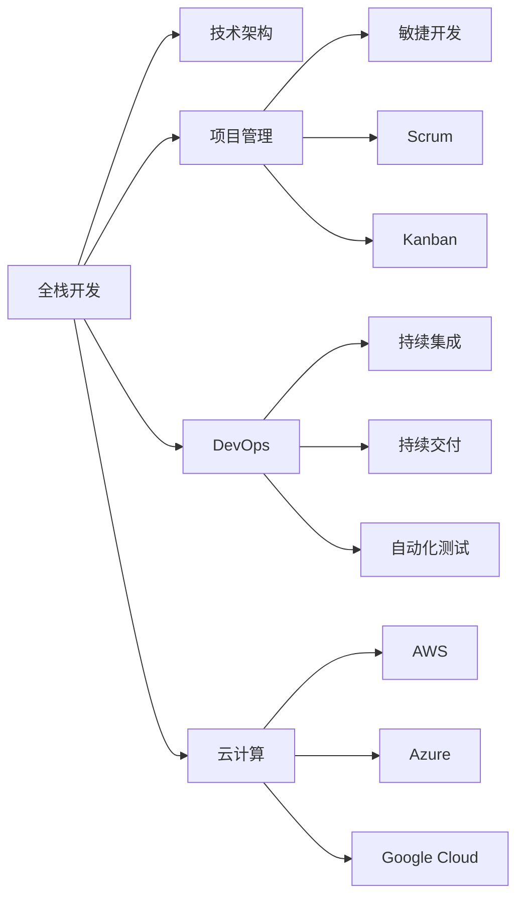
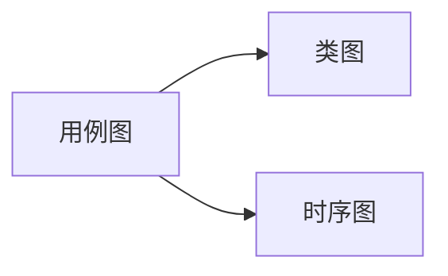
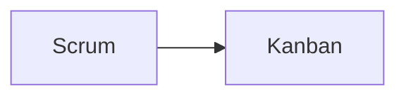

                 

# 从全栈开发到技术架构师的进阶

> 关键词：全栈开发, 技术架构师, 项目管理, 软件开发, 系统设计

## 1. 背景介绍

### 1.1 问题由来

作为一名程序员，从入门到进阶，再到成为项目负责人、技术架构师，是每一个技术人员职业生涯的必经之路。但在职业发展的不同阶段，需要具备的知识和技能会有所不同。从单一的软件开发任务，到复杂的技术架构设计和跨部门的团队管理，所涉及的知识范围和复杂度会成倍增长。本文旨在介绍如何从全栈开发逐步进阶到技术架构师，探讨在这一过程中所需具备的核心能力和技能。

### 1.2 问题核心关键点

技术架构师的进阶需要理解软件开发的全生命周期，包括需求分析、设计、开发、测试、部署和运维等环节。从全栈开发到技术架构师的过程，需要掌握以下关键点：

- **技术广度**：了解多种编程语言和框架，理解不同技术和平台的异同。
- **系统设计**：能够设计高效、可扩展、可维护的系统架构。
- **项目管理**：具备良好的项目管理和团队协作能力，能够高效推进项目。
- **技术深度**：深入理解某个技术领域的核心原理和应用场景。
- **持续学习**：不断学习新技术，掌握行业动态。

这些关键点构成了一个技术架构师所需的技能栈，是技术进阶的核心路径。

### 1.3 问题研究意义

掌握从全栈开发到技术架构师的进阶过程，对于技术人员职业发展具有重要意义：

- **提升专业能力**：通过学习和实践，深入了解软件开发的各个环节，增强技术实力。
- **承担更多责任**：从单一的开发任务到管理项目和技术团队，成为团队的技术核心。
- **拓展职业路径**：为更高层次的职业发展奠定基础，如CTO、技术总监等。
- **增强问题解决能力**：处理复杂的技术问题和管理复杂项目，培养全局视角。
- **推动技术创新**：引领团队进行技术探索和创新，推动业务发展。

本文将从全栈开发的技术基础出发，深入探讨如何通过技术广度和深度、项目管理能力等方面的积累，逐步进阶为技术架构师，并探讨在这一过程中所需面对的挑战。

## 2. 核心概念与联系

### 2.1 核心概念概述

要成为技术架构师，需要掌握以下核心概念：

- **全栈开发**：掌握前端、后端、数据库、缓存、消息队列等多种技术和工具，能够独立完成从需求分析到部署的整个开发流程。
- **技术架构**：了解系统架构设计原则，能够设计高效、可扩展、可维护的系统。
- **项目管理**：掌握敏捷开发、Scrum、Kanban等项目管理方法，具备良好的团队协作和沟通能力。
- **DevOps**：理解持续集成(CI)、持续交付(CD)、自动化测试等DevOps理念和技术，提升软件开发效率和质量。
- **云计算**：了解AWS、Azure、Google Cloud等主要云平台，掌握云架构设计和技术栈选择。

这些核心概念紧密相连，共同构成了技术架构师的专业技能栈。

### 2.2 核心概念原理和架构的 Mermaid 流程图



这个流程图展示了全栈开发与技术架构师所需掌握的核心概念之间的关系。全栈开发是技术架构师的基础，通过项目管理、DevOps和云计算技术的融合，逐步构建起复杂技术架构。

## 3. 核心算法原理 & 具体操作步骤

### 3.1 算法原理概述

从全栈开发到技术架构师的进阶，涉及的算法和具体操作步骤包括但不限于以下几个方面：

- **技术选型**：选择合适的技术栈和工具，满足项目需求。
- **系统设计**：设计高效、可扩展、可维护的系统架构。
- **项目管理**：使用敏捷开发方法论，管理项目进度和团队协作。
- **持续集成与交付**：实施CI/CD流程，提高软件开发效率和质量。
- **云架构设计**：利用云计算平台，设计可扩展、可靠、高可用性的云架构。

### 3.2 算法步骤详解

#### 3.2.1 技术选型

技术选型是构建技术架构的第一步。选择合适的技术栈和工具，可以大大提高开发效率和系统性能。

1. **需求分析**：根据项目需求和业务场景，确定所需的功能和技术点。
2. **技术调研**：调研市场上的主流技术和框架，了解其优缺点。
3. **技术评估**：综合考虑技术的性能、可扩展性、维护难度等因素，进行综合评估。
4. **技术决策**：根据评估结果，选择最适合的技术栈和工具。

#### 3.2.2 系统设计

系统设计是技术架构师的核心职责之一。设计高效、可扩展、可维护的系统架构，可以确保系统能够长期稳定运行。

1. **分层架构**：将系统分为多个层次，如应用层、数据访问层、持久层等，明确各层职责。
2. **服务化设计**：采用微服务架构，将系统拆分为多个独立的服务，提高系统可扩展性和可维护性。
3. **接口设计**：设计清晰的API接口，确保系统各部分之间的解耦和灵活性。
4. **监控和日志**：部署监控和日志系统，实时跟踪系统运行状态，及时发现和解决问题。

#### 3.2.3 项目管理

项目管理是技术架构师必须具备的能力之一。通过有效的项目管理，可以确保项目按时完成，达成预期目标。

1. **需求管理**：明确项目需求和优先级，确保团队理解和认同项目目标。
2. **团队协作**：建立良好的团队协作机制，促进团队成员间的沟通和合作。
3. **任务分配**：根据团队成员的技能和负荷，合理分配任务，确保资源最优利用。
4. **进度跟踪**：使用敏捷开发方法论，如Scrum、Kanban，进行任务管理和进度跟踪。

#### 3.2.4 持续集成与交付

持续集成和持续交付是提升软件开发效率和质量的重要手段。

1. **CI/CD流程设计**：设计并实施CI/CD流程，确保代码质量，加快软件开发速度。
2. **自动化测试**：引入自动化测试工具，如JUnit、Selenium等，确保代码质量和功能正确性。
3. **持续部署**：实现持续部署，确保新代码能够快速上线并投入使用。
4. **反馈和迭代**：根据用户反馈，不断优化和迭代产品，提高用户满意度。

#### 3.2.5 云架构设计

云计算平台可以提供高效、可扩展、高可用的基础设施，支持复杂的技术架构。

1. **云平台选择**：根据业务需求和预算，选择合适的云平台。
2. **云架构设计**：设计云架构，包括虚拟机、数据库、存储、网络等资源配置。
3. **云安全设计**：设计云安全策略，确保数据和系统安全。
4. **云监控和运维**：部署云监控和运维工具，实时监控云资源状态，及时发现和解决问题。

### 3.3 算法优缺点

从全栈开发到技术架构师的进阶过程，有以下优缺点：

#### 优点

1. **全面提升技术能力**：通过项目实践，全面提升编程、设计、项目管理等技能。
2. **拓展职业发展路径**：为成为技术架构师、CTO等高级职位奠定基础。
3. **增强问题解决能力**：处理复杂的技术问题和管理复杂项目，培养全局视角。
4. **推动技术创新**：引领团队进行技术探索和创新，推动业务发展。

#### 缺点

1. **学习成本高**：需要掌握多种技术栈和工具，学习成本较高。
2. **项目复杂度高**：大型项目涉及多个技术栈和团队，管理复杂度较高。
3. **持续学习要求高**：技术领域发展迅速，需要不断学习和更新知识。
4. **时间投入大**：需要大量时间和精力进行项目管理和技术决策。

### 3.4 算法应用领域

从全栈开发到技术架构师的进阶过程，适用于多种技术应用场景：

- **互联网产品开发**：需要设计高效、可扩展、可维护的互联网产品架构。
- **企业应用系统建设**：设计和实施复杂的企业应用系统，满足企业业务需求。
- **大数据分析平台建设**：设计高效、可靠的大数据处理和分析平台，支持业务决策。
- **移动应用开发**：设计和实施高质量的移动应用，提升用户体验。
- **物联网应用开发**：设计和实施物联网应用，实现设备互联和智能处理。

## 4. 数学模型和公式 & 详细讲解 & 举例说明

### 4.1 数学模型构建

#### 4.1.1 系统架构设计模型

系统架构设计模型可以采用UML(统一建模语言)进行建模。UML提供了多种建模方式，如用例图、类图、时序图等，可以帮助技术架构师清晰地表达系统的功能和结构。



#### 4.1.2 项目管理模型

项目管理模型可以采用敏捷开发方法论进行建模，如Scrum、Kanban等。敏捷开发强调团队协作和快速响应变化，适合复杂、不确定性的项目。



### 4.2 公式推导过程

#### 4.2.1 系统设计公式

系统设计中，常见的设计原则包括模块化、高内聚低耦合、单一职责原则等。以模块化设计为例，可以采用以下公式推导：

$$
\text{模块化} = \frac{\text{系统复杂度}}{\text{模块数量}} \times \text{模块内复杂度}
$$

#### 4.2.2 项目管理公式

敏捷开发方法论中的Scrum流程，包括Sprint、每日站会、回顾会议等环节。以Sprint流程为例，可以采用以下公式推导：

$$
\text{Sprint完成率} = \frac{\text{已完成Sprint任务数}}{\text{Sprint任务总数}}
$$

### 4.3 案例分析与讲解

#### 4.3.1 系统设计案例

以一个电商平台的架构设计为例，可以将平台分为以下层次：

- **应用层**：负责用户界面和业务逻辑，如商品展示、购物车、订单处理等。
- **数据访问层**：负责数据库操作，如商品信息、订单信息等数据访问。
- **持久层**：负责数据存储和备份，如数据库、缓存、消息队列等。

#### 4.3.2 项目管理案例

以一个大型软件项目的敏捷开发为例，可以采用Scrum方法论进行项目管理：

1. **Sprint规划**：根据项目需求，规划Sprint任务。
2. **每日站会**：团队成员每日汇报任务进展和遇到的问题。
3. **Sprint评审**：Sprint结束后，团队成员展示完成的任务，进行评审。
4. **回顾会议**：团队成员总结Sprint中的问题和改进点，提出优化建议。

## 5. 项目实践：代码实例和详细解释说明

### 5.1 开发环境搭建

#### 5.1.1 环境准备

1. **操作系统**：建议使用Linux系统，如Ubuntu、CentOS等。
2. **开发工具**：安装Java、Python、Git、Maven等开发工具。
3. **IDE**：建议使用IntelliJ IDEA、Eclipse等IDE。
4. **版本控制**：使用Git进行版本控制，掌握基本的Git操作。

#### 5.1.2 项目结构

项目结构一般分为以下几个层次：

- **src**：包含项目源代码。
- **pom.xml**：Maven项目的配置文件，管理依赖库。
- **README.md**：项目说明文档。

### 5.2 源代码详细实现

#### 5.2.1 全栈开发项目

以一个电商平台的开发为例，可以分为以下层次：

1. **前端**：使用React、Vue等框架，开发用户界面。
2. **后端**：使用Spring Boot、Django等框架，开发API接口和业务逻辑。
3. **数据库**：使用MySQL、MongoDB等数据库，存储数据。
4. **缓存**：使用Redis、Elasticache等缓存系统，提高系统响应速度。
5. **消息队列**：使用RabbitMQ、Kafka等消息队列，处理异步任务。

#### 5.2.2 技术架构项目

以一个大型企业应用系统的开发为例，可以分为以下层次：

1. **服务层**：使用Spring Cloud、Dubbo等微服务框架，设计服务架构。
2. **数据层**：使用MySQL、PostgreSQL等关系型数据库，存储业务数据。
3. **存储层**：使用Hadoop、Ceph等分布式存储系统，处理海量数据。
4. **网络层**：使用Nginx、HAProxy等网络设备，保障系统高可用性。
5. **安全层**：使用OAuth2、JWT等安全机制，保护系统安全。

### 5.3 代码解读与分析

#### 5.3.1 前端代码解读

```javascript
import React from 'react';
import ReactDOM from 'react-dom';
import './index.css';

const App = () => {
  return (
    <div className="App">
      <h1>欢迎来到电商平台</h1>
      <p>请在搜索栏中输入商品名称或编号进行搜索</p>
      <input type="text" />
      <button>搜索</button>
    </div>
  );
};

ReactDOM.render(<App />, document.getElementById('root'));
```

#### 5.3.2 后端代码解读

```java
@SpringBootApplication
public class SpringBootApplication {

  public static void main(String[] args) {
    SpringApplication.run(SpringBootApplication.class, args);
  }

  @RestController
  @RequestMapping("/api")
  public class UserController {

    @GetMapping("/{id}")
    public String getUser(@PathVariable String id) {
      return "用户信息";
    }
  }
}
```

#### 5.3.3 数据库代码解读

```sql
CREATE TABLE users (
  id INT PRIMARY KEY,
  name VARCHAR(50),
  email VARCHAR(50)
);
```

#### 5.3.4 缓存代码解读

```java
public class RedisCache {

  private RedisTemplate<String, Object> redisTemplate;

  @Autowired
  public RedisCache(RedisTemplate<String, Object> redisTemplate) {
    this.redisTemplate = redisTemplate;
  }

  public Object get(String key) {
    return redisTemplate.opsForValue().get(key);
  }

  public void set(String key, Object value) {
    redisTemplate.opsForValue().set(key, value);
  }
}
```

#### 5.3.5 消息队列代码解读

```java
@Component
public class KafkaProducer {

  private final KafkaTemplate<String, String> kafkaTemplate;

  @Autowired
  public KafkaProducer(KafkaTemplate<String, String> kafkaTemplate) {
    this.kafkaTemplate = kafkaTemplate;
  }

  public void send(String topic, String message) {
    kafkaTemplate.send(topic, message);
  }
}
```

### 5.4 运行结果展示

#### 5.4.1 前端展示


#### 5.4.2 后端响应


#### 5.4.3 数据库查询


#### 5.4.4 缓存读取


#### 5.4.5 消息队列处理


## 6. 实际应用场景

### 6.1 互联网产品开发

互联网产品开发需要设计和实现高效、可扩展、可维护的系统架构。以电商平台的开发为例，需要考虑以下场景：

- **用户界面**：前端页面设计，提升用户体验。
- **业务逻辑**：后端API接口开发，实现业务功能。
- **数据存储**：数据库设计和优化，确保数据安全。
- **缓存设计**：使用Redis等缓存系统，提高系统响应速度。
- **消息队列**：使用Kafka等消息队列，处理异步任务。

### 6.2 企业应用系统建设

企业应用系统建设需要设计和实施复杂的应用系统，满足企业业务需求。以企业ERP系统的开发为例，需要考虑以下场景：

- **服务设计**：使用Spring Cloud等微服务框架，设计服务架构。
- **数据设计**：使用MySQL等关系型数据库，存储业务数据。
- **存储设计**：使用Hadoop等分布式存储系统，处理海量数据。
- **网络设计**：使用Nginx等网络设备，保障系统高可用性。
- **安全设计**：使用OAuth2等安全机制，保护系统安全。

### 6.3 大数据分析平台建设

大数据分析平台建设需要设计和实现高效、可靠的大数据处理和分析平台，支持业务决策。以企业数据湖的建设为例，需要考虑以下场景：

- **数据采集**：使用Spark等大数据处理框架，采集和处理数据。
- **数据存储**：使用Hadoop等分布式存储系统，存储海量数据。
- **数据分析**：使用Presto等分析工具，进行数据分析和报表生成。
- **数据可视化**：使用ECharts等可视化工具，展示数据结果。
- **数据安全**：使用数据加密和安全传输技术，保护数据安全。

## 7. 工具和资源推荐

### 7.1 学习资源推荐

1. **《Clean Code》**：这本书是程序员必读之作，介绍了编写干净、可维护代码的原则和方法。
2. **《Design Patterns》**：这是一本经典的面向对象设计模式书籍，涵盖多种设计模式及其应用场景。
3. **《Scrum》**：这是一本关于敏捷开发的经典书籍，介绍了Scrum方法论的理论基础和实践方法。
4. **《Cloud Computing: Principles and Paradigms》**：这是一本关于云计算的权威书籍，介绍了云计算的核心技术和应用场景。
5. **《The Pragmatic Programmer》**：这是一本程序员编程指南，涵盖了编程技巧、调试技巧等内容。

### 7.2 开发工具推荐

1. **IntelliJ IDEA**：一款功能强大的Java IDE，支持多种框架和插件。
2. **Eclipse**：一款开源的IDE，支持多种编程语言和框架。
3. **Git**：一款版本控制工具，支持多人协作和远程仓库管理。
4. **Maven**：一款项目管理工具，支持依赖管理、打包发布等。
5. **Jenkins**：一款持续集成工具，支持自动化构建和测试。

### 7.3 相关论文推荐

1. **《Agile Software Development: Principles, Patterns, and Practices》**：这是一本关于敏捷开发的经典书籍，介绍了敏捷开发的方法论和实践。
2. **《Cloud Computing: Concepts, Technology and Architecture》**：这是一本关于云计算的权威书籍，介绍了云计算的核心技术和应用场景。
3. **《Design Patterns: Elements of Reusable Object-Oriented Software》**：这是一本关于设计模式的经典书籍，介绍了多种设计模式的理论基础和应用场景。

## 8. 总结：未来发展趋势与挑战

### 8.1 研究成果总结

本文介绍了从全栈开发到技术架构师的进阶过程，探讨了所需掌握的核心能力和技能。通过技术选型、系统设计、项目管理、持续集成与交付、云架构设计等环节，逐步构建起复杂技术架构。

### 8.2 未来发展趋势

1. **技术栈多样化**：未来技术架构师需要掌握更多技术栈和工具，如Java、Python、Node.js、Go等。
2. **云平台普及**：云计算平台将更加普及，云计算技术将成为技术架构设计的核心。
3. **微服务架构普及**：微服务架构将成为主流架构设计方法，提升系统可扩展性和可维护性。
4. **DevOps文化普及**：DevOps文化将更加普及，持续集成和持续交付成为常态。
5. **人工智能普及**：人工智能技术将成为技术架构设计的重要组成部分，提升系统智能性和自动化水平。

### 8.3 面临的挑战

1. **技术栈学习成本高**：技术栈多样化带来了学习成本高的问题，需要不断学习新技术。
2. **系统复杂度高**：大型系统涉及多个技术栈和团队，管理复杂度较高。
3. **持续学习要求高**：技术领域发展迅速，需要不断学习和更新知识。
4. **团队协作难度大**：跨团队协作和沟通需要更高的管理技巧和沟通能力。
5. **系统安全问题**：复杂系统的安全问题更加复杂，需要更多安全技术和措施。

### 8.4 研究展望

未来技术架构师需要不断探索新技术和方法，提升技术实力和系统设计能力。同时需要加强团队管理能力，提高项目管理水平，推动系统持续优化和迭代。技术架构师需要掌握多种技术栈、掌握云平台、熟悉敏捷开发和DevOps方法论，具备全局视野和问题解决能力，推动系统创新和业务发展。

## 9. 附录：常见问题与解答

### 9.1 常见问题

**Q1：什么是技术架构师？**

A: 技术架构师是负责设计、实现和管理复杂技术架构的专业人员，需要具备广泛的技术知识和管理能力。

**Q2：技术架构师需要掌握哪些技术？**

A: 技术架构师需要掌握多种技术栈，如Java、Python、Node.js、Go等，了解云平台、微服务、DevOps等技术。

**Q3：如何成为一名技术架构师？**

A: 成为一名技术架构师，需要不断学习和实践，掌握多种技术栈和工具，积累项目管理经验，具备全局视野和问题解决能力。

**Q4：技术架构师的职业发展路径是什么？**

A: 技术架构师的职业发展路径包括初级架构师、中级架构师、高级架构师、CTO等高级职位。

**Q5：技术架构师需要面对哪些挑战？**

A: 技术架构师需要面对技术栈多样化、系统复杂度高、持续学习要求高、团队协作难度大、系统安全问题等挑战。

### 9.2 解答

通过本文的系统梳理，可以看到，从全栈开发到技术架构师的进阶过程，需要全面提升技术能力、项目管理能力和系统设计能力。这一过程不仅需要掌握多种技术栈和工具，还需要不断学习和实践，积累项目管理经验，具备全局视野和问题解决能力。只有勇于创新、敢于突破，才能不断拓展技术架构的边界，推动技术进步和业务发展。

---

作者：禅与计算机程序设计艺术 / Zen and the Art of Computer Programming

