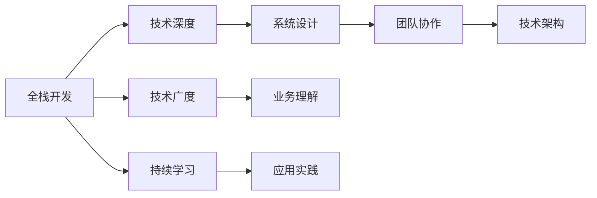

                 

## 从全栈开发到技术架构师的进阶

在软件开发的世界里，从零开始的全栈开发，到能够独当一面的技术架构师，是一个既充满挑战又充满机遇的转变。这一过程不仅需要技术上的深度和广度，还需要思维上的转变和实践的积累。本文将带你详细探索这一转变的核心概念、技术原理、操作步骤，以及实际应用场景和未来展望。

## 1. 背景介绍

### 1.1 问题由来

在早期的软件开发中，全栈开发指的是一名开发者能精通前端和后端的开发技术。但随着技术栈的细分和应用场景的复杂化，全栈开发逐渐演变为能理解和协作不同技术栈，解决实际问题的开发者。然而，随着项目的规模和复杂度增加，全栈开发者在面对大型应用系统时，往往需要与多个角色协同工作。

技术架构师便在这样的背景下应运而生。架构师不仅需要深厚的技术背景，还需要全面的业务理解、系统的设计思维和领导力，从而能够高效协调和推进项目进展。本文将从全栈开发者的角度出发，逐步探讨如何成长为一名技术架构师。

### 1.2 问题核心关键点

成长为技术架构师的关键在于：

1. **技术深度**：对某一技术栈的深度掌握，包括语言、框架、工具、算法等。
2. **技术广度**：对多领域、多技术栈的理解和应用能力。
3. **系统设计**：掌握设计原则和模式，能够构建可靠、可扩展的系统架构。
4. **业务理解**：深入理解业务需求和场景，提供技术上的解决方案。
5. **团队协作**：具备良好的沟通、协调和领导能力，有效推动项目进展。

本文将围绕这些核心点，系统讲解如何从全栈开发进阶到技术架构师。

## 2. 核心概念与联系

### 2.1 核心概念概述

在探讨从全栈开发到技术架构师的过程中，以下概念是绕不开的：

1. **全栈开发**：指能够精通前端和后端的开发者，对整个软件开发生命周期有全面的理解。
2. **技术架构**：指通过技术手段构建的系统的整体结构，包括分层、模块、组件、接口等。
3. **系统设计**：指设计系统的高层次结构，包括架构模式、组件交互、数据流等。
4. **微服务**：指将大系统拆分成一系列小服务，每个服务独立部署和扩展。
5. **DevOps**：指开发和运维的紧密结合，强调自动化、持续交付和持续集成。

通过理解这些概念，我们才能更好地理解从全栈开发到技术架构师的进阶过程。

### 2.2 核心概念原理和架构的 Mermaid 流程图



这个流程图展示了全栈开发到技术架构师的关键节点，包括技术深度、技术广度、系统设计、业务理解、团队协作和技术架构。通过理解这些节点之间的联系，我们可以更好地规划成长路径。

## 3. 核心算法原理 & 具体操作步骤

### 3.1 算法原理概述

技术架构师的成长并非一蹴而就，而是一个循序渐进的过程。以下是一些关键的成长步骤：

1. **技术深度**：在某一技术栈上持续深入学习，掌握其核心原理、应用场景和优化方法。
2. **技术广度**：逐步扩展技术视野，学习多领域的技术栈和工具。
3. **系统设计**：通过实际项目，积累系统设计和架构设计的经验。
4. **业务理解**：与业务团队紧密合作，了解业务需求和场景，提供技术上的支持。
5. **团队协作**：培养良好的沟通、协调和领导能力，有效地与团队成员协作。

### 3.2 算法步骤详解

#### 3.2.1 技术深度

- **目标**：精通某一技术栈，包括语言、框架、工具、算法等。
- **步骤**：
  1. 选择一门编程语言，深入学习其语法、特性和常用库。
  2. 学习其对应的框架和工具，了解其优缺点和适用场景。
  3. 掌握核心算法和数据结构，能解决复杂问题。

- **资源**：
  1. 在线教程和书籍：选择经典的学习资源，系统学习语言、框架和算法。
  2. 实际项目：通过实际项目，巩固所学知识。

#### 3.2.2 技术广度

- **目标**：掌握多领域、多技术栈的知识，具备跨领域的解决问题能力。
- **步骤**：
  1. 选择几个有代表性的技术栈，如前端、后端、数据库等。
  2. 对每个技术栈进行系统学习，包括其核心概念、常用技术和开发流程。
  3. 通过项目实践，逐步扩展技术视野。

- **资源**：
  1. 在线课程和资料：选择一些跨领域的课程，系统学习多个技术栈。
  2. 开源项目：参与开源项目，了解不同技术栈的实际应用。

#### 3.2.3 系统设计

- **目标**：掌握系统设计的原理和模式，能够构建可靠、可扩展的系统架构。
- **步骤**：
  1. 学习经典设计模式，如MVC、DDD、微服务等。
  2. 实践项目，应用设计模式解决实际问题。
  3. 学习架构设计工具和方法，如UML、ER图等。

- **资源**：
  1. 书籍和论文：学习经典的设计模式和架构设计书籍。
  2. 实际项目：通过实际项目，实践设计模式和架构设计。

#### 3.2.4 业务理解

- **目标**：深入理解业务需求和场景，提供技术上的解决方案。
- **步骤**：
  1. 与业务团队紧密合作，了解业务流程和需求。
  2. 根据业务需求，提供技术上的建议和方案。
  3. 参与业务讨论，共同设计业务流程和技术方案。

- **资源**：
  1. 业务培训和交流：参加业务培训和团队交流，了解业务需求。
  2. 实际项目：通过实际项目，深入理解业务需求和场景。

#### 3.2.5 团队协作

- **目标**：培养良好的沟通、协调和领导能力，有效地与团队成员协作。
- **步骤**：
  1. 学习沟通技巧，提高沟通效率。
  2. 学习项目管理工具和方法，如敏捷开发、Scrum等。
  3. 与团队成员密切合作，共同解决问题。

- **资源**：
  1. 培训课程：参加沟通技巧和项目管理培训课程。
  2. 实际项目：通过实际项目，实践沟通和协作技巧。

### 3.3 算法优缺点

技术架构师的成长并非一帆风顺，以下是一些成长过程中的优缺点：

**优点**：
1. **系统理解**：具备全面的技术视野，能够系统性地解决问题。
2. **跨领域能力**：具备跨领域的知识，能够解决复杂问题。
3. **领导力**：具备良好的沟通和领导能力，能够协调团队协作。

**缺点**：
1. **学习曲线陡峭**：需要掌握多领域的技术栈，学习成本较高。
2. **时间和精力投入大**：需要持续学习和实践，投入的时间和精力较大。
3. **压力和责任大**：作为技术架构师，面临的压力和责任较大。

### 3.4 算法应用领域

技术架构师的应用领域非常广泛，以下是一些主要的应用场景：

1. **互联网应用**：构建高可用、可扩展的互联网应用，提供技术上的支持。
2. **企业系统**：设计企业级应用系统，提供系统架构和技术方案。
3. **大数据系统**：构建高性能、高可靠的大数据系统，提供数据技术和架构方案。
4. **云计算平台**：设计和管理云计算平台，提供云计算技术和架构方案。
5. **物联网系统**：构建物联网应用系统，提供物联网技术和架构方案。

通过技术架构师的技术背景和能力，能够在不同的应用场景中，提供有效的技术支持和解决方案。

## 4. 数学模型和公式 & 详细讲解 & 举例说明

### 4.1 数学模型构建

在技术架构师的成长过程中，数学模型和算法是不可或缺的工具。以下是一个典型的数学模型构建过程：

假设有一个函数 $f(x)$，我们希望通过优化参数 $\theta$，使得函数在某点 $x_0$ 上的输出 $f(x_0)$ 最小化。

数学模型构建过程如下：
1. **目标函数**：定义目标函数 $L(\theta) = f(x_0) + \lambda \sum_{i=1}^N (y_i - f(x_i))^2$，其中 $\lambda$ 为正则化系数，$(x_i, y_i)$ 为训练数据。
2. **损失函数**：目标函数 $L(\theta)$ 即为损失函数，用于衡量模型在训练数据上的性能。
3. **优化算法**：通过梯度下降等优化算法，求解最小化目标函数 $L(\theta)$ 的参数 $\theta$。

### 4.2 公式推导过程

以梯度下降算法为例，其核心公式如下：

$$
\theta_{k+1} = \theta_k - \eta \nabla L(\theta_k)
$$

其中 $\eta$ 为学习率，$\nabla L(\theta_k)$ 为目标函数 $L(\theta_k)$ 对参数 $\theta_k$ 的梯度。

梯度下降算法的核心在于通过迭代更新参数 $\theta_k$，逐步逼近最小化目标函数 $L(\theta_k)$ 的解。

### 4.3 案例分析与讲解

以机器学习模型的优化为例，假设我们有一个线性回归模型 $f(x) = wx + b$，目标是找到最优的参数 $w$ 和 $b$，使得模型在训练数据上的平均误差最小化。

目标函数可以定义为：

$$
L(w, b) = \frac{1}{N} \sum_{i=1}^N (y_i - wx_i - b)^2
$$

其中 $(x_i, y_i)$ 为训练数据。

通过梯度下降算法，我们不断更新参数 $w$ 和 $b$，直到目标函数 $L(w, b)$ 收敛。

## 5. 项目实践：代码实例和详细解释说明

### 5.1 开发环境搭建

- **目标**：搭建一个开发环境，支持多语言、多框架的项目开发。
- **步骤**：
  1. 安装开发工具：选择适合的语言和框架，安装开发工具，如IDE、编辑器等。
  2. 配置环境：配置开发环境，包括版本管理工具、依赖管理工具等。
  3. 项目管理：选择适合的项目管理工具，如Jira、Trello等。

- **资源**：
  1. 开发工具：选择适合的语言和框架，如Java、Python等，安装开发工具。
  2. 配置工具：选择适合的环境配置工具，如Docker、Ansible等。
  3. 项目管理工具：选择适合的项目管理工具，如Jira、Trello等。

### 5.2 源代码详细实现

以一个简单的Web应用为例，实现以下功能：

1. 用户注册
2. 用户登录
3. 用户信息展示

- **前端**：使用React框架，实现用户界面。
- **后端**：使用Spring Boot框架，实现用户认证和信息展示。
- **数据库**：使用MySQL数据库，存储用户信息。

### 5.3 代码解读与分析

- **前端代码**：
  ```javascript
  import React, { useState } from 'react';
  
  function Register() {
    const [username, setUsername] = useState('');
    const [password, setPassword] = useState('');
    
    const handleUsernameChange = (e) => {
      setUsername(e.target.value);
    };
    
    const handlePasswordChange = (e) => {
      setPassword(e.target.value);
    };
    
    const handleSubmit = (e) => {
      e.preventDefault();
      // 发送注册请求
    };
    
    return (
      <div>
        <input type="text" placeholder="Username" onChange={handleUsernameChange} />
        <input type="password" placeholder="Password" onChange={handlePasswordChange} />
        <button onClick={handleSubmit}>Register</button>
      </div>
    );
  }
  
  export default Register;
  ```

- **后端代码**：
  ```java
  import org.springframework.web.bind.annotation.GetMapping;
  import org.springframework.web.bind.annotation.PostMapping;
  import org.springframework.web.bind.annotation.RestController;
  
  @RestController
  public class UserController {
    
    @GetMapping("/register")
    public String register() {
      // 发送注册请求
      return "注册成功";
    }
    
    @PostMapping("/login")
    public String login() {
      // 发送登录请求
      return "登录成功";
    }
    
    @GetMapping("/user")
    public String getUser() {
      // 获取用户信息
      return "用户信息展示";
    }
  }
  ```

- **数据库代码**：
  ```sql
  CREATE TABLE users (
    id INT PRIMARY KEY AUTO_INCREMENT,
    username VARCHAR(50) NOT NULL,
    password VARCHAR(255) NOT NULL,
    email VARCHAR(255) NOT NULL,
    create_time TIMESTAMP DEFAULT CURRENT_TIMESTAMP
  );
  ```

通过以上代码，我们实现了一个简单的Web应用，展示了全栈开发的基本流程。

### 5.4 运行结果展示

通过部署到服务器，我们能够看到用户注册、登录和信息展示的功能。

## 6. 实际应用场景

### 6.1 云计算平台

云计算平台是一个典型的技术架构师应用场景。设计和管理云计算平台，需要具备深厚的技术背景和系统设计能力。

- **目标**：构建高性能、高可靠、易于扩展的云计算平台。
- **步骤**：
  1. 设计架构：选择适合的架构模式，如微服务架构、服务网格等。
  2. 选择技术栈：选择合适的技术栈，如Kubernetes、Docker等。
  3. 实现功能：实现云平台的核心功能，如资源管理、负载均衡、监控等。

- **资源**：
  1. 架构模式：选择适合的架构模式，如微服务、服务网格等。
  2. 技术栈：选择适合的技术栈，如Kubernetes、Docker等。
  3. 实际项目：通过实际项目，实现云平台的核心功能。

### 6.2 物联网系统

物联网系统是一个复杂的技术架构场景，需要技术架构师具备跨领域的能力和系统设计能力。

- **目标**：构建高性能、高可靠的物联网系统。
- **步骤**：
  1. 设计架构：选择适合的架构模式，如事件驱动架构、消息队列等。
  2. 选择技术栈：选择合适的技术栈，如MQTT、HTTP、REST等。
  3. 实现功能：实现物联网的核心功能，如数据采集、存储、分析等。

- **资源**：
  1. 架构模式：选择适合的架构模式，如事件驱动、消息队列等。
  2. 技术栈：选择适合的技术栈，如MQTT、HTTP、REST等。
  3. 实际项目：通过实际项目，实现物联网的核心功能。

## 7. 工具和资源推荐

### 7.1 学习资源推荐

1. **《全栈开发之路》**：介绍全栈开发的基础知识和进阶技巧。
2. **《架构设计模式》**：讲解经典的设计模式和架构设计方法。
3. **《微服务架构实战》**：介绍微服务的核心概念和实战经验。
4. **《DevOps实践指南》**：介绍DevOps的基础知识和实践经验。

### 7.2 开发工具推荐

1. **IDE工具**：如Visual Studio Code、IntelliJ IDEA等。
2. **版本管理工具**：如Git、SVN等。
3. **依赖管理工具**：如Maven、Gradle等。

### 7.3 相关论文推荐

1. **《面向服务的体系结构》**：介绍服务架构的基础和设计原则。
2. **《微服务架构模式》**：介绍微服务的经典架构模式和设计模式。
3. **《DevOps文化》**：介绍DevOps文化和实践经验。

## 8. 总结：未来发展趋势与挑战

### 8.1 研究成果总结

技术架构师是软件开发的重要角色，通过不断的学习和实践，能够在复杂的应用场景中提供有效的技术解决方案。

### 8.2 未来发展趋势

未来技术架构师的发展趋势如下：

1. **自动化**：自动化工具和流程将进一步提高开发效率，降低人为错误。
2. **云原生**：云计算技术的普及将推动云原生架构的应用。
3. **微服务**：微服务架构将成为主流的系统架构。
4. **人工智能**：AI技术的应用将带来新的设计和优化方法。
5. **DevOps**：DevOps文化和工具将进一步普及，提升开发和运维的协同效率。

### 8.3 面临的挑战

技术架构师面临的挑战包括：

1. **技术更新快**：需要持续学习和跟进新技术，保持技术竞争力。
2. **跨领域能力**：需要具备跨领域的技术背景和设计能力。
3. **团队协作**：需要具备良好的沟通和协作能力，协调多方资源。
4. **项目复杂**：需要具备系统设计能力和解决复杂问题的能力。

### 8.4 研究展望

未来的技术架构师研究将聚焦于以下几个方向：

1. **自动化和智能化**：提升自动化工具和智能化能力，提高开发效率和质量。
2. **跨领域能力**：提升跨领域的设计能力和团队协作能力。
3. **新技术应用**：研究和应用新的技术，如区块链、量子计算等。
4. **用户体验**：提升用户体验和系统可用性，提升用户满意度。

## 9. 附录：常见问题与解答

**Q1: 如何提升技术深度和广度？**

A: 提升技术深度和广度需要系统学习和实践，以下是一些具体方法：

- **深度学习**：选择一门编程语言，深入学习其语法、特性和常用库。
- **多领域学习**：逐步扩展技术视野，学习多领域的技术栈和工具。

**Q2: 如何提升系统设计能力？**

A: 提升系统设计能力需要实践和积累，以下是一些具体方法：

- **学习设计模式**：学习经典的设计模式和架构设计书籍。
- **实践项目**：通过实际项目，实践设计模式和架构设计。

**Q3: 如何提升团队协作能力？**

A: 提升团队协作能力需要良好的沟通和协调能力，以下是一些具体方法：

- **学习沟通技巧**：参加沟通技巧和项目管理培训课程。
- **实践项目**：通过实际项目，实践沟通和协作技巧。

**Q4: 如何提升项目管理和开发效率？**

A: 提升项目管理和开发效率需要掌握合适的工具和方法，以下是一些具体方法：

- **使用敏捷开发**：采用敏捷开发、Scrum等方法，提升开发效率。
- **使用自动化工具**：使用CI/CD、自动化测试等工具，提升开发和运维效率。

---

作者：禅与计算机程序设计艺术 / Zen and the Art of Computer Programming

