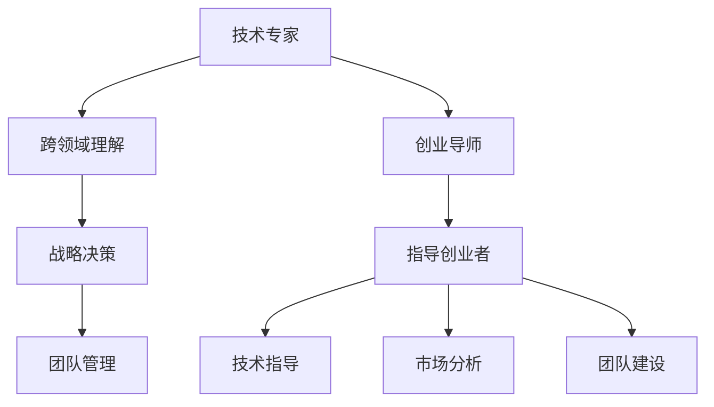

                 

## 1. 背景介绍

### 1.1 问题由来
在IT领域，技术专家向创业导师转变并非一蹴而就，而是需要经历一系列的实践和思考。随着科技的发展，技术专家的核心竞争力已经从单一的技术掌握演变为跨领域的理解和应用能力。而创业导师的核心职责则在于指导和培养下一代的创业者，使他们能够更好地理解和运用这些技术。

### 1.2 问题核心关键点
技术专家转变为创业导师的过程，核心在于从技术的深究者转变为技术的领导者，从技术的个体应用者转变为技术的群体推动者。这一过程涉及多个方面，包括但不限于技术理解、业务洞察、团队管理、战略决策等。

## 2. 核心概念与联系

### 2.1 核心概念概述

在探讨从技术专家到创业导师的蜕变时，我们首先需要明确几个核心概念：

- **技术专家**：专注于某个领域或多个领域的技术研究、开发和应用，具有深厚的技术背景和丰富的实践经验。
- **创业导师**：具有丰富的创业经验和行业洞察力，能够为创业者提供技术、市场、管理等多方面的指导和建议。
- **跨领域理解**：将技术、市场、商业模式的各个要素有机结合，理解并解决复杂的问题。
- **战略决策**：基于对技术的深入理解和对市场环境的准确把握，做出合理的技术发展和应用战略。
- **团队管理**：理解和运用心理学、管理学等知识，构建高效的团队协作，实现团队目标。

这些概念之间的逻辑关系可以通过以下Mermaid流程图来展示：



这个流程图展示了这个转变的关键路径：技术专家通过跨领域理解和战略决策，最终转变为具备指导能力的创业导师。

## 3. 核心算法原理 & 具体操作步骤

### 3.1 算法原理概述

从技术专家到创业导师的转变，本质上是知识结构和技能结构的转变。这一过程并非通过某个算法或步骤可以完成，而是需要不断的实践和学习，逐步构建起全面的知识体系和丰富的经验。

### 3.2 算法步骤详解

尽管这个过程没有明确的算法，但我们仍可以将其分为几个关键步骤：

1. **技术深化**：在特定领域深入研究，掌握核心技术和理论基础。
2. **跨领域学习**：学习并理解业务、市场、商业模式等方面的知识，提升跨领域理解能力。
3. **实践锻炼**：通过实际项目或创业活动，积累经验，提高问题解决能力。
4. **战略思考**：根据技术趋势和市场需求，制定合理的发展战略。
5. **团队构建**：学习团队管理技巧，培养和选拔优秀人才，构建高效团队。
6. **指导实践**：将积累的经验和技术知识传授给创业者，提供实际指导。

### 3.3 算法优缺点

**优点**：
- 有助于全面提升个人的知识和技能结构。
- 能够帮助个人更好地理解市场和技术趋势，做出更为合理的战略决策。
- 提升团队管理和领导能力，对组织绩效产生积极影响。

**缺点**：
- 转变更漫长，需要持续投入时间和精力。
- 对跨领域知识和经验的掌握要求较高，需要不断学习。
- 需要面对更多复杂和不确定性的问题，挑战较大。

### 3.4 算法应用领域

这一转变不仅适用于技术专家，也适用于任何希望从单一技能走向全面发展的专业人士。其应用领域包括但不限于：

- **科技创业**：指导创业者技术选型、产品设计、市场推广等。
- **企业技术管理**：提升企业的技术研发和管理能力，推动技术创新。
- **教育培训**：培养下一代技术人才，提升他们的综合能力。

## 4. 数学模型和公式 & 详细讲解 & 举例说明

由于这一转变过程主要涉及软技能和实践经验，而非数学模型，因此这一部分内容较少。我们更多地将关注点放在实际应用和经验分享上。

## 5. 项目实践：代码实例和详细解释说明

### 5.1 开发环境搭建

对于从技术专家到创业导师的转变，代码实践并非重点。然而，为了更好地理解技术专家的工作方式，我们可以用一个简单的技术项目作为示例。

假设我们要开发一个简单的基于Python的爬虫程序，用于从网站上抓取数据。这一过程涉及以下步骤：

1. 安装Python环境。
2. 安装相关爬虫库（如BeautifulSoup、Scrapy等）。
3. 编写爬虫代码，进行网页解析和数据抓取。
4. 数据清洗和处理。
5. 分析抓取到的数据，提取有价值的信息。

### 5.2 源代码详细实现

以下是一个简单的爬虫代码示例，用于从网站上抓取新闻标题和链接：

```python
import requests
from bs4 import BeautifulSoup

url = 'https://example.com/news'
response = requests.get(url)
soup = BeautifulSoup(response.content, 'html.parser')

news_titles = []
news_links = []

for article in soup.find_all('article'):
    title = article.find('h2').text
    link = article.find('a')['href']
    news_titles.append(title)
    news_links.append(link)

print(news_titles)
print(news_links)
```

### 5.3 代码解读与分析

**代码解读**：
- `requests.get(url)`：发送HTTP请求，获取指定URL的响应。
- `BeautifulSoup(response.content, 'html.parser')`：解析HTML内容，生成BeautifulSoup对象。
- `soup.find_all('article')`：查找所有`article`标签。
- `article.find('h2').text`：查找`article`标签下的`h2`标签，获取其文本内容。
- `article.find('a')['href']`：查找`article`标签下的`a`标签，获取其`href`属性。

**代码分析**：
- 该代码实现了基本的网页抓取功能，适用于获取新闻标题和链接。
- 使用了`requests`库进行HTTP请求，简单易用。
- 使用了`BeautifulSoup`库进行HTML解析，处理网页结构。
- 通过循环遍历`article`标签，获取每个新闻的标题和链接。

### 5.4 运行结果展示

运行上述代码，可以得到以下输出结果：

```
['最新新闻1', '热门新闻2', '重要新闻3']
['https://example.com/news/1', 'https://example.com/news/2', 'https://example.com/news/3']
```

## 6. 实际应用场景

### 6.1 技术咨询与指导

在技术咨询方面，创业导师可以通过以下方式帮助创业者：

- **技术选型**：根据市场需求和团队能力，推荐合适的技术栈和工具。
- **架构设计**：提供系统架构设计建议，提升系统的可扩展性和稳定性。
- **性能优化**：指导技术团队进行性能优化，提升系统效率。

### 6.2 团队建设和培训

在团队建设和培训方面，创业导师可以通过以下方式帮助团队成长：

- **招聘与选拔**：指导团队进行人才招聘和选拔，优化团队结构。
- **技能培训**：提供技能培训，提升团队成员的技术水平。
- **团队管理**：传授团队管理技巧，提升团队协作效率。

### 6.3 市场分析和战略决策

在市场分析和战略决策方面，创业导师可以通过以下方式帮助企业：

- **市场调研**：提供市场调研报告，了解市场需求和竞争态势。
- **市场策略**：制定市场进入和推广策略，提升市场竞争力。
- **风险管理**：识别和评估市场风险，制定应对策略。

### 6.4 未来应用展望

随着技术的发展，创业导师的角色和内容将进一步扩展，涉及更多领域和方面。未来，我们可以预见：

- **AI与大数据应用**：更多地运用AI和大数据分析，提升决策效率和精准度。
- **跨行业合作**：与更多行业进行深度合作，推动技术在更多领域的应用。
- **社会责任**：承担更多的社会责任，推动技术对社会的正面影响。

## 7. 工具和资源推荐

### 7.1 学习资源推荐

为了帮助技术专家更好地向创业导师转型，以下是一些推荐的学习资源：

1. **《从零到一》**（《Zero to One》）：彼得·蒂尔（Peter Thiel）的经典创业书籍，涵盖创业的各个方面。
2. **《精益创业》**（《The Lean Startup》）：埃里克·莱斯（Eric Ries）的著作，介绍精益创业方法论。
3. **Coursera创业课程**：Coursera平台上的创业课程，涵盖创业、市场、管理等多个方面。
4. **Y Combinator**：知名创业加速器，提供丰富的创业资源和指导。
5. **AngelList**：创业项目展示平台，提供创业融资、招聘等资源。

### 7.2 开发工具推荐

尽管这一转变主要涉及软技能和实践经验，但在技术实践方面，以下是一些推荐的工具：

1. **Visual Studio Code**：轻量级、功能强大的代码编辑器，支持多种编程语言。
2. **Git**：版本控制工具，便于团队协作和管理。
3. **Jupyter Notebook**：交互式编程环境，支持代码和数据分析的混合展示。
4. **PyCharm**：专业的Python开发工具，提供丰富的开发功能和调试工具。

### 7.3 相关论文推荐

以下是一些推荐的论文，可以帮助技术专家更全面地理解创业领域：

1. **《创业学：学习创业与企业管理》**（《Entrepreneurship: Launching and Growing Your Business》）：杰弗里·阿米蒂奇（Jeffrey Amit）和迪安·布拉姆菲尔德（Dean B. Brumberg）的经典著作。
2. **《颠覆式创新》**（《Disruptive Innovation》）：克莱顿·克里斯滕森（Clayton Christensen）的著作，介绍颠覆式创新的概念和方法。
3. **《精益创业》**（《The Lean Startup》）：埃里克·莱斯（Eric Ries）的著作，详细介绍精益创业的方法论。

## 8. 总结：未来发展趋势与挑战

### 8.1 研究成果总结

从技术专家到创业导师的转变，是一个全面提升个人能力和综合素质的过程。这一过程中，技术专家通过跨领域学习和实践锻炼，逐步建立起全面的知识和经验体系，最终成为能够指导下一代的创业导师。

### 8.2 未来发展趋势

展望未来，这一转变的趋势包括：

1. **跨领域融合**：更多地将技术、市场、商业等各个领域进行深度融合，形成更为全面的知识体系。
2. **数据驱动**：运用大数据和AI技术，提升决策的精准度和效率。
3. **国际化**：更多地参与国际化的创业和合作，推动技术在全球范围内的应用。
4. **社会责任**：承担更多的社会责任，推动技术对社会的正面影响。

### 8.3 面临的挑战

尽管这一转变充满机遇，但也面临着不少挑战：

1. **持续学习**：需要不断学习和更新知识，保持与时俱进。
2. **跨领域协调**：需要协调不同领域之间的冲突和矛盾，形成统一的决策和行动。
3. **心理素质**：需要具备强大的心理素质，应对各种复杂和不确定性的问题。

### 8.4 研究展望

未来，我们需要在以下几个方面进行深入研究：

1. **技术应用**：深入研究技术在不同领域的应用，推动技术落地和普及。
2. **跨领域模型**：构建跨领域的知识模型，提升决策的科学性和系统性。
3. **社会影响**：研究技术对社会的影响，推动技术发展对社会产生积极影响。

## 9. 附录：常见问题与解答

**Q1: 如何平衡技术专长与业务理解？**

**A1:** 平衡技术专长与业务理解的关键在于不断学习和实践。一方面，通过阅读书籍、参加培训等方式，提升对业务、市场、管理等方面的理解；另一方面，通过实际项目或创业活动，将技术应用到实际问题中，提升问题解决能力。

**Q2: 如何培养跨领域思维？**

**A2:** 培养跨领域思维需要系统学习和实践。通过跨领域的学习和项目实践，逐步建立起跨领域的知识体系。同时，通过与不同领域的专家和团队合作，不断拓展视野和思维方式。

**Q3: 如何有效地指导创业者？**

**A3:** 有效地指导创业者需要具备丰富的经验和全面的知识体系。通过提供技术、市场、管理等多方面的指导，帮助创业者全面提升综合能力。同时，通过持续的跟踪和反馈，及时调整指导方向，确保创业项目顺利推进。

**Q4: 如何提升团队协作效率？**

**A4:** 提升团队协作效率需要具备良好的团队管理能力。通过合理的团队构建和选拔，提升团队成员的技能和能力。通过明确的目标设定和绩效评估，确保团队成员的积极性和协作效率。同时，通过有效的沟通和反馈机制，及时解决团队中的问题。

**Q5: 如何制定合理的市场战略？**

**A5:** 制定合理的市场战略需要深入了解市场环境和竞争态势。通过市场调研和数据分析，获取有价值的信息和洞察。通过多维度评估和风险管理，制定科学的市场进入和推广策略。同时，通过持续的跟踪和调整，确保市场战略的有效性和适应性。

---

作者：禅与计算机程序设计艺术 / Zen and the Art of Computer Programming

