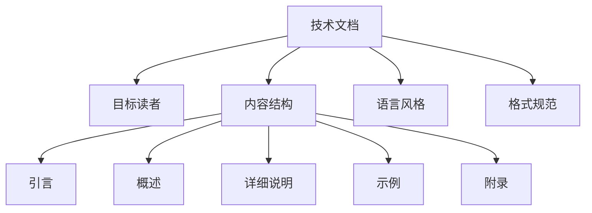

                 

# 从技术文档到付费电子书：程序员的写作之路

## 1. 背景介绍

### 1.1 问题由来

在软件开发的过程中，技术文档的撰写是一项必不可少的环节。无论是技术博客、技术文档、还是项目文档，良好的文档都能极大地方便开发者和用户理解和使用软件。然而，在实践中，技术文档的撰写往往被忽视，导致项目代码虽然结构清晰、功能完备，但用户在使用过程中却因为文档不清晰而感到困惑，甚至无法正常使用。

### 1.2 问题核心关键点

在技术文档的撰写过程中，需要注意以下几个关键点：

- 文档的目标读者是谁？
- 文档需要涵盖哪些主要内容？
- 如何使文档的语言风格和格式规范统一？
- 如何构建文档的逻辑结构和信息架构？
- 如何利用技术手段提高文档的可读性和可维护性？

这些问题直接影响到文档的质量和使用效果，对软件开发和用户使用有重要影响。因此，如何撰写出高质量的技术文档，使文档真正成为用户的“接口”，值得每一位程序员深入思考和实践。

## 2. 核心概念与联系

### 2.1 核心概念概述

为了更好地理解技术文档的撰写方法，本节将介绍几个密切相关的核心概念：

- **技术文档**：即开发者撰写并发布的、用于描述软件或系统使用方法、架构、原理等信息的文档。包括技术博客、技术文档、API文档等形式。
- **目标读者**：技术文档的最终受众，通常是开发者、用户、管理者等。不同的目标读者需要不同的文档风格和信息深度。
- **内容结构**：技术文档的核心内容结构，包括引言、概述、详细说明、示例、附录等部分。
- **语言风格**：技术文档的语言风格，需简洁明了、准确无误，同时避免使用行话和专业术语。
- **格式规范**：技术文档的格式规范，需统一、一致，方便阅读和搜索。

这些概念之间的逻辑关系可以通过以下Mermaid流程图来展示：



这个流程图展示技术文档的组成和影响因素：

1. 技术文档的内容结构需要考虑目标读者的需求。
2. 内容结构的各个部分（如引言、概述、详细说明等）需遵循一定的语言风格和格式规范。
3. 语言风格和格式规范统一，使文档更易读、易理解、易维护。

## 3. 核心算法原理 & 具体操作步骤
### 3.1 算法原理概述

技术文档的撰写是一个从内容组织到表达形式的多步骤过程，涉及内容的选择、结构和布局设计、语言表达和格式规范等方面。以下从技术文档的目标、结构、语言和格式四个维度进行介绍。

### 3.2 算法步骤详解

#### 3.2.1 确定文档目标

- 确定目标读者群体，明确文档的内容深度和宽度。
- 制定文档的总体框架，包括引言、概述、详细内容、示例和附录等部分。

#### 3.2.2 设计文档结构

- 根据内容的重要性，合理分配各部分的篇幅和深度。
- 使用Markdown、Confluence、Google Docs等工具辅助设计文档结构。

#### 3.2.3 撰写内容

- 使用清晰、简洁的语言描述软件功能和使用方法。
- 使用代码示例和流程图等辅助说明技术细节。
- 注重内容的前后连贯性和逻辑性，避免信息孤岛。

#### 3.2.4 调整语言风格

- 避免使用过于专业或模糊的行话和术语，确保文档易于理解。
- 保持语言的一致性和统一性，避免混合使用不同的语言风格。

#### 3.2.5 规范文档格式

- 使用标准化的标题、段落、列表等格式。
- 统一使用缩进、字体、字号等排版风格。
- 使用Markdown等工具自动生成目录和索引。

### 3.3 算法优缺点

技术文档撰写流程的优点：
- 规范化文档内容，确保信息准确、一致。
- 提高文档的可读性和可维护性，方便用户和开发者理解和使用。

其缺点：
- 需要投入大量时间和精力，对撰写者的技术水平和写作能力要求较高。
- 文档的更新和维护需要持续投入，尤其是在软件迭代频繁的情况下。

### 3.4 算法应用领域

技术文档的应用领域广泛，涵盖软件开发、产品发布、技术交流等多个方面：

- **软件开发**：项目文档、API文档、开发指南等。
- **产品发布**：用户手册、帮助文档、操作指南等。
- **技术交流**：博客、技术报告、演示文稿等。

这些文档在软件开发和产品运营中扮演着重要角色，是用户理解和使用的关键。

## 4. 数学模型和公式 & 详细讲解 & 举例说明

### 4.1 数学模型构建

技术文档的撰写涉及文字表达和信息结构，不直接涉及数学模型和公式。但为了更好地阐述技术文档的结构和设计，我们可以使用信息模型来描述文档的组织方式。

### 4.2 公式推导过程

由于技术文档的撰写与数学模型和公式的推导无关，本节不涉及具体的公式推导过程。

### 4.3 案例分析与讲解

以下以一篇技术博客的撰写为例，介绍如何构建技术文档的结构和内容。

#### 示例博客：《Python多线程编程详解》

1. **引言**：
   - 引言部分简要介绍博客的主题和目的，说明将要探讨的主要内容。
   
   ```markdown
   # Python多线程编程详解
   在本文中，我们将详细探讨Python多线程编程的基础知识，包括多线程的创建、同步和通信等技术。通过实际代码示例，帮助你理解如何在Python中使用多线程。
   ```

2. **概述**：
   - 概述部分对博客的主要内容进行简要介绍，明确每部分的主题和结构。
   
   ```markdown
   ## 目录
   - [什么是多线程](#什么是多线程)
   - [多线程的创建](#多线程的创建)
   - [线程同步与锁](#线程同步与锁)
   - [多线程的通信](#多线程的通信)
   - [总结](#总结)
   ```

3. **详细说明**：
   - 详细说明部分包含博客的主体内容，具体解释每部分的技术细节。
   
   ```markdown
   ## 什么是多线程
   多线程是指同时执行多个线程的过程。在Python中，可以使用`threading`模块创建和管理线程。
   ```

4. **示例**：
   - 示例部分通过代码示例展示多线程编程的实际应用。
   
   ```python
   import threading

   def worker(name):
       """线程执行函数"""
       print(f'线程{name}正在运行...')

   if __name__ == '__main__':
       threads = []
       for i in range(5):
           thread = threading.Thread(target=worker, args=(i,))
           threads.append(thread)
           thread.start()
   
       for thread in threads:
           thread.join()
   ```

5. **附录**：
   - 附录部分包含额外的参考资料、示例代码等，进一步补充博客的内容。
   
   ```markdown
   ## 参考资料
   - [Python官方文档：多线程](https://docs.python.org/3/library/threading.html)
   - [多线程编程指南](https://www.runoob.com/python3/python3-thread.html)
   ```

## 5. 项目实践：代码实例和详细解释说明

### 5.1 开发环境搭建

技术文档的撰写不需要特定的开发环境，但为了提高文档的可读性和可维护性，可以采用一些辅助工具。

1. **Markdown编辑器**：如Typora、Github Pages等，便于编辑和发布技术文档。
2. **代码高亮工具**：如Prism.js、Highlight.js等，使代码更加易于阅读。
3. **API文档工具**：如Swagger、RapidAPI等，帮助开发者自动生成API文档。

### 5.2 源代码详细实现

以下是一个简单的Markdown文档的实现示例：

```markdown
# 技术博客模板

## 引言
本文将介绍如何使用Python实现一个简单的命令行工具。

## 概述
- [安装Python](#安装Python)
- [编写代码](#编写代码)
- [测试和运行](#测试和运行)

## 安装Python
- 前往Python官网下载最新版本的Python。
- 安装后配置环境变量。

## 编写代码
```python
import sys

def main():
    print('Hello, World!')

if __name__ == '__main__':
    main()
```

## 测试和运行
在终端中运行`python myscript.py`命令，即可执行上述代码。

## 参考资料
- [Python官方文档](https://docs.python.org/)
- [命令行编程指南](https://www.python.org/dev/peps/pep-3000/)
```

### 5.3 代码解读与分析

以下是Markdown文档代码的详细解读和分析：

1. **引言部分**：简要介绍技术博客的主题和目的，说明将要探讨的主要内容。
2. **概述部分**：对博客的主要内容进行简要介绍，明确每部分的主题和结构。
3. **详细说明部分**：具体解释每部分的技术细节，包括安装、编写代码和测试等步骤。
4. **示例部分**：通过代码示例展示技术细节的实际应用。
5. **附录部分**：包含额外的参考资料，补充博客的内容。

## 6. 实际应用场景

技术文档在软件开发和产品运营中具有重要作用，以下列举几个具体应用场景：

### 6.1 项目文档

- **项目概述**：详细介绍项目背景、目标和需求。
- **技术架构**：描述系统的整体架构和各个组件的关系。
- **代码规范**：制定代码编写规范，如命名约定、注释格式等。

### 6.2 API文档

- **接口说明**：详细描述每个API接口的功能和参数。
- **示例代码**：提供API调用的示例代码。
- **错误处理**：说明API可能返回的错误码和错误信息。

### 6.3 用户手册

- **用户指南**：详细介绍软件的安装、配置和使用方法。
- **功能介绍**：描述软件的主要功能模块和相关操作。
- **故障排查**：提供常见问题的解决方案和详细步骤。

## 7. 工具和资源推荐

### 7.1 学习资源推荐

为了帮助开发者系统掌握技术文档的撰写技巧，这里推荐一些优质的学习资源：

1. **《技术文档编写指南》**：详细介绍了技术文档的写作规范、格式和布局设计。
2. **《Drytype: 高效技术写作》**：提供了技术写作的最佳实践和技巧，包括文档结构和语言表达。
3. **《Markdown: 文档编写与自动化》**：介绍了Markdown的语法和使用技巧，帮助开发者编写清晰、易读的技术文档。

### 7.2 开发工具推荐

技术文档的撰写离不开合适的工具支持。以下是几款常用的技术文档工具：

1. **Typora**：一款简单易用的Markdown编辑器，支持实时预览和格式化。
2. **Github Pages**：将Markdown文件部署到Github上，方便查看和分享。
3. **Swagger**：帮助开发者自动生成API文档，方便用户调用和理解API接口。
4. **Confluence**：企业级文档管理工具，支持多人协作和版本控制。

### 7.3 相关论文推荐

技术文档的撰写虽然不是严格意义上的科学研究，但仍有相关的理论研究值得关注：

1. **《技术写作的理论与实践》**：探讨了技术写作的理论基础和实际操作，提供了丰富的案例和示例。
2. **《软件文档化：原理与实践》**：介绍了软件文档化的概念、方法和工具，帮助开发者更好地管理文档。
3. **《技术文档的标准化和自动化》**：讨论了技术文档标准化的必要性和实践方法，介绍了自动化工具的使用。

## 8. 总结：未来发展趋势与挑战

### 8.1 研究成果总结

技术文档的撰写是一项基础但重要的工作，对于软件的开发和产品的运营具有深远影响。优秀的技术文档能够提高软件的可读性和可维护性，使用户更容易理解和使用软件。

### 8.2 未来发展趋势

技术文档的未来发展趋势包括：

1. **自动化工具**：随着AI和自然语言处理技术的进步，未来将出现更多的自动化工具，帮助开发者自动生成技术文档。
2. **多语言支持**：随着全球化和技术交流的加深，多语言的技术文档将变得更加重要。
3. **交互式文档**：通过引入交互式元素，如代码示例、视频教程等，使技术文档更加生动有趣。

### 8.3 面临的挑战

尽管技术文档的撰写对软件开发具有重要意义，但仍然面临以下挑战：

1. **时间成本高**：撰写和维护技术文档需要投入大量时间和精力。
2. **内容更新困难**：随着软件的不断迭代，技术文档也需要持续更新，维护成本较高。
3. **文档质量不一**：不同开发者撰写的文档质量参差不齐，影响用户体验。

### 8.4 研究展望

未来技术文档的研究方向包括：

1. **自动生成技术**：利用AI和自然语言处理技术，自动生成高质量的技术文档。
2. **文档管理工具**：开发和改进文档管理工具，提高文档的共享和协作效率。
3. **交互式文档设计**：探索更多交互式元素，提升技术文档的阅读体验。

## 9. 附录：常见问题与解答

### 9.1 常见问题

**Q1: 技术文档需要涵盖哪些主要内容？**

A: 技术文档的主要内容包括引言、概述、详细说明、示例和附录等部分。引言部分简要介绍主题和目的；概述部分简要介绍内容结构和主要部分；详细说明部分详细介绍技术细节；示例部分提供实际代码示例；附录部分包含参考资料和补充信息。

**Q2: 如何使文档的语言风格和格式规范统一？**

A: 使用标准的模板和格式，如Markdown模板，确保文档的语言风格和格式规范统一。同时，使用工具如Prism.js自动高亮代码，使代码更加易读。

**Q3: 如何构建文档的逻辑结构和信息架构？**

A: 使用工具如UML或 Mind Map，设计文档的逻辑结构和信息架构。确保信息的前后连贯性和逻辑性，避免信息孤岛。

**Q4: 文档的更新和维护需要注意哪些方面？**

A: 更新和维护文档时，需要注意保持与软件更新的一致性，确保文档的时效性和准确性。同时，定期评估文档的质量，根据用户反馈进行优化。

通过以上分析和探讨，相信你对技术文档的撰写有了更深的理解。技术文档不仅是软件开发的重要组成部分，也是开发者向用户传递知识的重要工具。通过不断探索和实践，我们可以撰写出更高质量的技术文档，助力软件开发和产品运营的成功。

