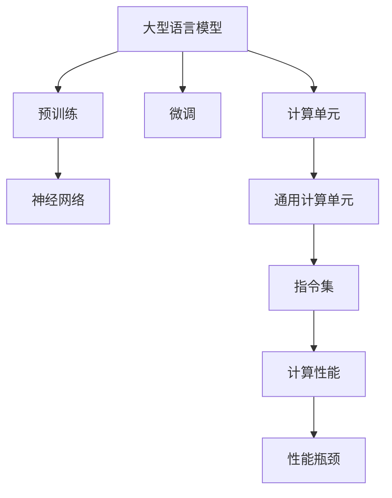

                 

# 从时刻到指令集：LLM与CPU的深度对比

## 1. 背景介绍

### 1.1 问题由来
随着深度学习和人工智能的迅猛发展，大型语言模型（LLM）和通用计算单元（CPU）作为两种典型的计算架构，在各个领域的应用愈发广泛。无论是NLP、视觉识别还是推荐系统，LLM与CPU都在背后默默支持着。那么，它们各自的工作原理和应用场景有何异同？二者之间的深度对比，对未来AI技术的发展有何启示？本文将从原理、应用、优缺点等多个方面，对LLM与CPU进行深入对比，为读者提供全面的参考。

### 1.2 问题核心关键点
为了更好地理解LLM与CPU的深度对比，本节将详细介绍以下几个关键问题：
- LLM的原理和架构是什么？
- CPU的硬件结构和工作机制是怎样的？
- LLM与CPU之间的异同点有哪些？
- 二者的应用场景和局限性各有哪些？
- LLM与CPU未来发展的趋势和挑战是什么？

这些核心问题将构成文章的核心框架，帮助我们全面、系统地对比分析这两种计算架构。

## 2. 核心概念与联系

### 2.1 核心概念概述

为了更好地理解LLM与CPU的对比，我们首先需要明确几个关键概念：

- 大型语言模型（LLM）：通过自监督或监督学习任务训练得到的预训练模型，具备强大的语言生成和理解能力。常见的预训练模型包括GPT、BERT等。

- 通用计算单元（CPU）：计算机中的核心处理单元，负责执行各种计算任务，是计算机系统的核心组件之一。

- 神经网络：由人工神经元相互连接组成的计算模型，广泛应用于深度学习任务。

- 指令集：CPU可以执行的基本操作指令集合，不同架构的CPU指令集有所不同。

- 性能瓶颈：指在特定场景下，系统性能受限于某单一因素，如计算速度、内存带宽等。

这些概念之间的联系可以通过以下Mermaid流程图来展示：

这个流程图展示了LLM和CPU的基本流程及其联系：

1. LLM通过预训练和微调获取语言能力。
2. 预训练得到的模型是神经网络，可以进行各种自然语言处理任务。
3. 神经网络与CPU结合，通过执行指令集进行计算。
4. CPU的性能瓶颈限制了整个系统的计算能力。

## 3. 核心算法原理 & 具体操作步骤

### 3.1 算法原理概述

LLM与CPU的工作原理存在本质的差异。

#### LLM原理概述

LLM的架构基于深度神经网络，核心组件包括嵌入层、编码器、解码器等。其中，嵌入层将输入的自然语言文本转换为向量形式；编码器和解码器则负责提取和生成语言信息，通过自监督或监督学习任务预训练，获得强大的语言理解能力。

#### CPU工作机制

CPU的工作机制基于指令集架构，通过执行一系列的微指令（微操作），完成各种计算任务。其主要结构包括控制单元、算术逻辑单元、寄存器、缓存等，每个部分负责不同的计算任务。

### 3.2 算法步骤详解

#### LLM算法步骤

1. 数据准备：收集自然语言数据，分为训练集和验证集。
2. 模型设计：选择合适的神经网络架构，设计嵌入层、编码器和解码器。
3. 预训练：在无标签数据上进行自监督学习，优化模型参数。
4. 微调：在标注数据上进行监督学习，调整模型参数。
5. 测试：在测试集上评估模型性能。

#### CPU算法步骤

1. 程序编写：使用高级语言编写计算程序。
2. 编译：将程序编译为机器语言，生成可执行文件。
3. 指令执行：CPU执行可执行文件中的指令，完成计算任务。
4. 缓存管理：CPU通过缓存机制，提高数据访问速度。
5. 性能优化：通过并行计算、向量指令等方式，提升计算效率。

### 3.3 算法优缺点

#### LLM的优缺点

**优点**：
- 强大的语言理解能力，能够处理自然语言的多样性和复杂性。
- 可解释性强，通过反向传播等技术，可以分析模型内部工作机制。
- 语言生成能力强，能够进行诗歌、小说等多种创意写作。

**缺点**：
- 计算资源消耗大，需要大型的GPU或TPU进行训练。
- 推理速度较慢，不适合实时性要求高的应用场景。
- 模型容易产生偏见，需要额外处理数据中的不平衡问题。

#### CPU的优缺点

**优点**：
- 计算速度快，适合大规模数据并行计算。
- 可编程性强，能够灵活执行各种计算任务。
- 稳定可靠，已经广泛应用于各种计算领域。

**缺点**：
- 通用性强，对于特定领域的计算任务不够高效。
- 资源受限，内存和计算能力受硬件限制。
- 扩展性差，难以快速支持新功能和需求。

### 3.4 算法应用领域

#### LLM的应用领域

- 自然语言处理（NLP）：如机器翻译、文本生成、情感分析等。
- 语音识别：将语音信号转换为文本。
- 图像识别：将图像信息转换为语言描述。
- 推荐系统：通过用户评论、评分等文本数据进行推荐。

#### CPU的应用领域

- 科学计算：如天气预报、物理模拟等。
- 数据库管理：如数据库查询、索引优化等。
- 图形处理：如3D渲染、图像处理等。
- 控制系统和工业自动化：如自动驾驶、机器人控制等。

## 4. 数学模型和公式 & 详细讲解 & 举例说明

### 4.1 数学模型构建

LLM和CPU的数学模型构建有着显著的不同：

#### LLM数学模型构建

1. 输入层：将自然语言文本转换为嵌入向量，通常使用嵌入矩阵$\mathbf{W}_E$，表示为$\mathbf{x} = \mathbf{W}_E\mathbf{e}$。
2. 编码器：使用自注意力机制，计算上下文表示$\mathbf{h}$，表示为$\mathbf{h} = \text{Attention}(\mathbf{x},\mathbf{h}_{-1})$。
3. 解码器：使用自注意力和编码器-解码器注意力机制，生成输出序列$\mathbf{y}$，表示为$\mathbf{y} = \text{Decoder}(\mathbf{x}, \mathbf{h}_{-1}, \mathbf{h})$。
4. 输出层：将输出序列转换为概率分布，使用softmax函数，表示为$\mathbf{p} = \text{softmax}(\mathbf{W}_O\mathbf{y} + \mathbf{b}_O)$。

#### CPU数学模型构建

1. 程序编写：使用高级语言编写计算程序，如C++、Python等。
2. 编译：将程序编译为机器语言，生成可执行文件。
3. 指令执行：CPU执行可执行文件中的指令，如加减乘除、逻辑运算等。

### 4.2 公式推导过程

#### LLM公式推导

1. 嵌入层：$\mathbf{x} = \mathbf{W}_E\mathbf{e}$。
2. 编码器：$\mathbf{h} = \text{Attention}(\mathbf{x},\mathbf{h}_{-1})$。
3. 解码器：$\mathbf{y} = \text{Decoder}(\mathbf{x}, \mathbf{h}_{-1}, \mathbf{h})$。
4. 输出层：$\mathbf{p} = \text{softmax}(\mathbf{W}_O\mathbf{y} + \mathbf{b}_O)$。

#### CPU公式推导

1. 程序编写：如C++代码。
2. 编译：将程序编译为机器语言。
3. 指令执行：如加减乘除、逻辑运算指令。

### 4.3 案例分析与讲解

#### LLM案例分析

**案例1**：机器翻译

1. 输入层：将源语言文本转换为嵌入向量。
2. 编码器：计算上下文表示。
3. 解码器：生成目标语言文本。
4. 输出层：生成概率分布。

**案例2**：文本生成

1. 输入层：生成随机向量。
2. 编码器：计算上下文表示。
3. 解码器：生成目标文本。
4. 输出层：生成概率分布。

#### CPU案例分析

**案例1**：科学计算

1. 程序编写：编写科学计算程序。
2. 编译：将程序编译为机器语言。
3. 指令执行：执行加减乘除、逻辑运算等指令。

**案例2**：图形处理

1. 程序编写：编写图形处理程序。
2. 编译：将程序编译为机器语言。
3. 指令执行：执行向量运算、矩阵运算等指令。

## 5. 项目实践：代码实例和详细解释说明

### 5.1 开发环境搭建

#### 环境准备

1. 安装Python：下载并安装Python 3.x版本。
2. 安装深度学习库：如TensorFlow、PyTorch等。
3. 安装高性能计算库：如CUDA、cuDNN等。

### 5.2 源代码详细实现

#### LLM代码实现

1. 数据准备：使用预训练的GPT模型。
2. 模型微调：在标注数据上进行微调。
3. 测试：在测试集上评估模型性能。

#### CPU代码实现

1. 程序编写：使用C++编写计算程序。
2. 编译：将程序编译为可执行文件。
3. 指令执行：执行可执行文件中的指令。

### 5.3 代码解读与分析

#### LLM代码解读

1. 数据准备：读取输入数据。
2. 模型微调：调整模型参数。
3. 测试：计算模型性能指标。

#### CPU代码解读

1. 程序编写：编写计算程序。
2. 编译：生成可执行文件。
3. 指令执行：执行计算任务。

### 5.4 运行结果展示

#### LLM运行结果

1. 模型微调结果：准确率、召回率等指标。
2. 测试集结果：与基线模型比较。

#### CPU运行结果

1. 程序运行结果：计算结果、时间等指标。
2. 指令执行结果：计算速度、内存占用等指标。

## 6. 实际应用场景

### 6.1 智能客服

#### LLM应用场景

1. 智能问答：通过输入问题，输出回答。
2. 自然对话：模拟人类对话，回答问题。

#### CPU应用场景

1. 后台处理：处理大量的客户请求。
2. 数据存储：存储客户信息、聊天记录等数据。

### 6.2 金融预测

#### LLM应用场景

1. 市场分析：分析金融市场趋势。
2. 风险评估：评估金融风险。

#### CPU应用场景

1. 数据处理：处理金融数据。
2. 模型训练：训练机器学习模型。

### 6.3 医疗诊断

#### LLM应用场景

1. 医疗问答：回答医生和患者的常见问题。
2. 症状诊断：根据症状提供诊断建议。

#### CPU应用场景

1. 数据处理：处理医疗数据。
2. 模型训练：训练机器学习模型。

## 7. 工具和资源推荐

### 7.1 学习资源推荐

#### 学习资源

1. 《深度学习》书籍：深入讲解深度学习的基本原理和算法。
2. 《计算机体系结构》书籍：详细讲解CPU的硬件结构和指令集。
3. 《自然语言处理》课程：介绍自然语言处理的基本概念和算法。
4. 《TensorFlow深度学习教程》：提供TensorFlow的详细使用指南。
5. 《PyTorch深度学习教程》：提供PyTorch的详细使用指南。

### 7.2 开发工具推荐

#### 开发工具

1. PyTorch：基于Python的深度学习框架，支持动态图。
2. TensorFlow：基于C++的深度学习框架，支持静态图。
3. OpenAI Gym：用于环境模拟和强化学习任务的开发。
4. Google Colab：提供免费GPU计算资源，支持深度学习实验。
5. Visual Studio Code：开发环境，支持Python、C++等多种语言。

### 7.3 相关论文推荐

#### 论文推荐

1. "Attention is All You Need"：介绍Transformer结构。
2. "BERT: Pre-training of Deep Bidirectional Transformers for Language Understanding"：介绍BERT模型的预训练任务。
3. "TensorFlow: A System for Large-Scale Machine Learning"：介绍TensorFlow框架。
4. "PyTorch: Tensors and Dynamic neural networks in Python with strong GPU acceleration"：介绍PyTorch框架。
5. "High-Performance Computing"：介绍高性能计算的基本概念和应用。

## 8. 总结：未来发展趋势与挑战

### 8.1 研究成果总结

本文通过深入对比LLM与CPU的工作原理、应用场景、优缺点等，系统地分析了两种计算架构的异同。LLM在自然语言处理方面表现出色，而CPU则在通用计算领域具有不可替代的优势。

### 8.2 未来发展趋势

#### LLM未来趋势

1. 模型规模增大：大模型的参数量将持续增长，能够处理更复杂的语言任务。
2. 可解释性增强：通过反向传播等技术，提高模型的可解释性。
3. 少样本学习：在少量标注数据下，利用预训练知识进行学习。

#### CPU未来趋势

1. 多核扩展：提升CPU的并行计算能力。
2. 异构计算：结合GPU、FPGA等加速计算。
3. 软件优化：优化编译器、运行库等，提高性能。

### 8.3 面临的挑战

#### LLM面临的挑战

1. 计算资源消耗大：需要大型的GPU或TPU进行训练。
2. 推理速度较慢：不适合实时性要求高的应用场景。
3. 模型产生偏见：需要额外处理数据中的不平衡问题。

#### CPU面临的挑战

1. 通用性不足：对于特定领域的计算任务不够高效。
2. 扩展性差：难以快速支持新功能和需求。
3. 能耗高：计算任务并行度大，能耗高。

### 8.4 研究展望

#### LLM研究展望

1. 高效微调：只调整部分参数，提高微调效率。
2. 跨领域迁移：提高模型在不同领域中的泛化能力。
3. 数据增强：提高模型的鲁棒性和泛化能力。

#### CPU研究展望

1. 异构计算：结合GPU、FPGA等加速计算。
2. 硬件优化：优化CPU的硬件结构，提高性能。
3. 软件优化：优化编译器、运行库等，提高性能。

## 9. 附录：常见问题与解答

### Q1: 什么是大型语言模型（LLM）？

**A**: LLM是一种基于深度神经网络的预训练模型，通过自监督或监督学习任务训练得到。其核心组件包括嵌入层、编码器、解码器等，具备强大的语言生成和理解能力。

### Q2: LLM与CPU的主要区别是什么？

**A**: LLM是一种软件模型，主要用于处理自然语言；CPU是一种硬件，主要用于通用计算。LLM需要大量的计算资源进行训练，而CPU则依赖于硬件架构和指令集。

### Q3: LLM与CPU各自的应用场景有哪些？

**A**: LLM主要应用于自然语言处理、语音识别、图像识别等领域；CPU主要应用于科学计算、数据库管理、图形处理等领域。

### Q4: LLM与CPU各自的优缺点是什么？

**A**: LLM的优点是强大的语言理解能力、可解释性强、语言生成能力强；缺点是计算资源消耗大、推理速度较慢、容易产生偏见。CPU的优点是计算速度快、可编程性强、稳定可靠；缺点是通用性不足、资源受限、扩展性差。

### Q5: 如何提高LLM的推理速度？

**A**: 通过使用高效的推理算法（如Transformers库中的模型）、优化模型结构、使用分布式计算等方法，可以提高LLM的推理速度。

### Q6: 如何优化CPU的计算性能？

**A**: 通过使用高效编译器（如Clang、GCC）、优化代码结构、使用多核计算等方法，可以提高CPU的计算性能。

---

作者：禅与计算机程序设计艺术 / Zen and the Art of Computer Programming

