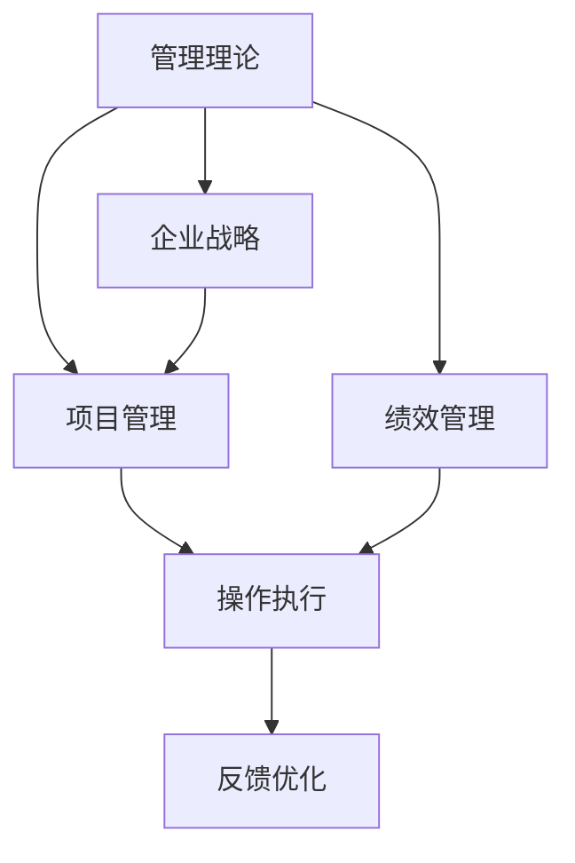

                 

# 从经典到实践：管理理论的落地

> 关键词：管理理论,实践落地,企业战略,人力资源,项目管理,绩效管理

## 1. 背景介绍

### 1.1 问题由来
现代企业管理理论的发展已有百余年历史，从早期的科学管理理论到行为科学理论，再到现代的人本管理、精益管理、数字化管理等，理论框架不断丰富和完善。然而，理论到实践的转化始终是管理学的核心难题。管理者常常面对理论与实践脱节的问题：理论与案例总是有偏差，抽象的理论难以直接应用于具体情境。

这一问题催生了“管理理论落地”研究方向的诞生，致力于探索如何将管理学理论与具体情境相结合，实现理论与实践的有机衔接。本文将深入探讨这一方向，通过理论基础、案例分析与实践操作指南，全面解析管理理论如何落地。

### 1.2 问题核心关键点
管理理论落地旨在将高层次的管理学理论转化为具体可操作的管理实践。该过程包含以下核心关键点：
1. 理论的适用性分析：判断某个管理理论是否适用于特定企业或项目。
2. 管理模型的分解与重构：将抽象的理论模型转化为具体的执行策略。
3. 组织文化与领导力的融合：保证管理实践得到企业的认同与执行。
4. 绩效与结果的衡量与反馈：通过数据分析和反馈循环持续优化管理实践。

## 2. 核心概念与联系

### 2.1 核心概念概述

为更好地理解管理理论落地的过程，本节将介绍几个密切相关的核心概念：

- **管理理论（Management Theory）**：一系列基于科学研究或实践总结的理论体系，如战略管理、组织行为学、人力资源管理等。
- **管理实践（Management Practice）**：企业在实际运营中采用的具体管理方法、流程、工具和组织结构。
- **企业战略（Corporate Strategy）**：指导企业长期发展的方向和目标，包括企业愿景、使命、核心价值等。
- **项目管理（Project Management）**：运用管理知识、技能、工具和方法对项目进行策划、组织、执行和监控，以确保项目成功完成。
- **绩效管理（Performance Management）**：通过设定目标、评估实施过程、反馈改进等手段，持续提升员工绩效和组织效率。

这些核心概念之间的逻辑关系可以通过以下Mermaid流程图来展示：



这个流程图展示了几类管理概念之间的相互关系：

1. 管理理论为企业战略、项目管理、绩效管理提供理论基础。
2. 企业战略、项目管理、绩效管理在具体实践中逐步落地为操作执行。
3. 操作执行通过反馈优化不断迭代，逐步形成成熟的组织管理实践。

## 3. 核心算法原理 & 具体操作步骤
### 3.1 算法原理概述

管理理论落地的核心思想是将抽象的理论模型转化为具体的管理实践。其核心原理包括：

1. **理论适用性分析**：评估管理理论在特定情境下的适用性。
2. **管理模型分解与重构**：将理论模型分解为可执行的子模型，并根据实际情况进行调整。
3. **组织文化与领导力融合**：保证管理实践得到企业的认同和执行。
4. **绩效与结果衡量与反馈**：通过数据反馈不断优化管理实践。

这一过程通过循环迭代逐步完成，最终实现理论到实践的有效转化。

### 3.2 算法步骤详解

管理理论落地的一般步骤包括：

**Step 1: 理论适用性分析**
- 分析企业的内部环境（如文化、规模、结构等），评估管理理论的适用性。
- 进行SWOT分析，识别企业的优势、劣势、机会和威胁。
- 根据企业特点选择最适合的管理理论。

**Step 2: 管理模型分解与重构**
- 将抽象的理论模型分解为具体的执行步骤和操作流程。
- 在执行过程中根据实际情况进行调整和优化。
- 设计管理工具和模板，促进模型的有效应用。

**Step 3: 组织文化与领导力融合**
- 宣传管理理论的核心价值和执行步骤，形成共同认知。
- 培训领导层和管理骨干，提高执行能力。
- 设计领导激励机制，促进理论落地。

**Step 4: 绩效与结果衡量与反馈**
- 设定明确的绩效指标和评估标准。
- 定期收集数据，进行绩效评估。
- 根据评估结果进行反馈优化，不断改进管理实践。

### 3.3 算法优缺点

管理理论落地的优点包括：
1. 提升管理系统的整体性和连贯性，避免孤立的管理措施。
2. 提供系统的管理解决方案，帮助企业高效应对挑战。
3. 利用现有理论框架，降低创新成本和风险。
4. 通过持续的反馈优化，逐步实现管理系统的完善。

同时，也存在一定的局限性：
1. 理论与实践存在一定偏差，难以完全契合。
2. 管理模型的本地化调整难度较大。
3. 需要企业有较高的文化认同和管理执行能力。
4. 数据反馈的及时性和准确性对管理效果影响较大。

尽管存在这些局限性，但管理理论落地仍是当前管理实践的主要方向，能够帮助企业提升整体管理水平和竞争力。

### 3.4 算法应用领域

管理理论落地在多个领域具有广泛的应用，包括但不限于：

- **企业战略**：利用战略管理理论制定企业的发展方向和竞争策略。
- **人力资源管理**：运用人力资源管理理论优化招聘、培训、绩效考核等环节。
- **项目管理**：结合项目管理理论提升项目执行效率和质量。
- **供应链管理**：应用供应链管理理论优化供应链流程，提升供应链效率。
- **客户关系管理**：通过客户关系管理理论提升客户满意度和忠诚度。

这些领域的应用不仅有助于提升企业的核心竞争力，还能推动行业标准的形成和发展。

## 4. 数学模型和公式 & 详细讲解 & 举例说明

### 4.1 数学模型构建

管理理论落地涉及多个学科的交叉应用，如统计学、运筹学、信息学等。这里以**战略管理理论**为例，构建一个简化的数学模型：

设企业有 $N$ 个业务单元，每个单元的业务量 $x_i$（$i=1,...,N$），销售利润率为 $\alpha_i$，固定成本为 $C_i$。设企业的目标总利润为 $T$。

目标函数为：

$$
\max T = \sum_{i=1}^N (\alpha_i x_i - C_i)
$$

约束条件为：

$$
\sum_{i=1}^N x_i = X
$$

其中 $X$ 为企业的总业务量。

### 4.2 公式推导过程

根据目标函数和约束条件，构建拉格朗日函数：

$$
\mathcal{L}(\boldsymbol{x}, \lambda) = \sum_{i=1}^N (\alpha_i x_i - C_i) - \lambda (\sum_{i=1}^N x_i - X)
$$

对 $x_i$ 和 $\lambda$ 求偏导数：

$$
\frac{\partial \mathcal{L}}{\partial x_i} = \alpha_i - \lambda = 0 \\
\frac{\partial \mathcal{L}}{\partial \lambda} = \sum_{i=1}^N x_i - X = 0
$$

解得：

$$
\lambda = \alpha_i, \quad x_i = \frac{C_i}{\alpha_i - \lambda}
$$

代入总利润公式，得：

$$
T = \sum_{i=1}^N (\alpha_i x_i - C_i) = \sum_{i=1}^N C_i = \sum_{i=1}^N \frac{C_i \alpha_i}{\alpha_i - \lambda} = \frac{\sum_{i=1}^N C_i \alpha_i}{\lambda}
$$

通过求解最优的 $\lambda$ 值，可以确定各业务单元的最佳分配比例，从而实现企业利润最大化。

### 4.3 案例分析与讲解

假设某公司有 A、B 两个业务单元，A 单元的固定成本为 $C_A=100$，销售利润率为 $\alpha_A=0.2$；B 单元的固定成本为 $C_B=200$，销售利润率为 $\alpha_B=0.3$；公司总业务量为 $X=500$。

根据上述数学模型，计算各业务单元的最优分配比例：

$$
\lambda = \alpha_i = 0.2
$$

代入公式计算：

$$
x_A = \frac{C_A \alpha_A}{\lambda} = \frac{100 \times 0.2}{0.2} = 500, \quad x_B = \frac{C_B \alpha_B}{\lambda} = \frac{200 \times 0.3}{0.2} = 300
$$

因此，公司应将全部业务量分配给 A 单元，B 单元分配 $300$ 业务量，从而达到总利润最大化。

通过这一案例，可以看出管理理论落地过程中模型构建和数据求解的重要性。

## 5. 项目实践：代码实例和详细解释说明
### 5.1 开发环境搭建

在进行管理理论落地实践前，我们需要准备好开发环境。以下是使用Python进行SAS开发的环境配置流程：

1. 安装SAS Studio：从官网下载并安装SAS Studio，用于创建和管理SAS数据集。
2. 安装Python环境：确保Python环境和相关依赖库（如NumPy、Pandas等）正确安装。
3. 配置SAS与Python的接口：安装`sasgui`库，通过SAS Studio创建Python脚本，并调用SAS的API进行数据处理。

完成上述步骤后，即可在SAS Studio中使用Python进行数据分析和管理。

### 5.2 源代码详细实现

下面我们以**人力资源管理**中的**员工绩效评估**为例，给出使用SAS Studio和Python实现员工绩效评估的代码实现。

首先，定义绩效评估数据结构：

```python
import pandas as pd

# 定义员工绩效评估数据结构
employee_data = pd.DataFrame({
    'employee_id': ['E01', 'E02', 'E03', 'E04', 'E05'],
    'department': ['Sales', 'Sales', 'Marketing', 'Marketing', 'Finance'],
    'monthly_sales': [1000, 1200, 1500, 2000, 2500],
    'customer_satisfaction': [4.5, 4.3, 4.2, 4.5, 4.0]
})
```

接着，进行数据分析和模型构建：

```python
import statsmodels.api as sm

# 构建员工绩效评分模型
model = sm.OLS(endog=employee_data['customer_satisfaction'], exog=employee_data[['monthly_sales']])
results = model.fit()
```

然后，输出模型结果并进行解释：

```python
# 输出模型结果
print(results.summary())
```

最后，使用SAS Studio进行可视化：

```python
# 将数据导入SAS Studio
proc datasets create lib=mylib data=employee_data;

# 生成散点图
proc sgplot data=employee_data;
  scatter x=monthly_sales y=customer_satisfaction / nohlabel noyaxis nogrid;
run;

# 生成回归模型结果
proc glm data=employee_data;
  class department;
  model customer_satisfaction = monthly_sales;
run;
```

### 5.3 代码解读与分析

让我们再详细解读一下关键代码的实现细节：

**employee_data** DataFrame：
- 定义了员工编号、部门、月销售额和客户满意度等关键变量。

**sm.OLS**函数：
- 使用`statsmodels`库中的OLS（Ordinary Least Squares，普通最小二乘）函数，构建线性回归模型。
- 将月销售额作为自变量，客户满意度作为因变量，进行最小二乘拟合。

**results.summary()**方法：
- 输出线性回归模型的统计结果，包括R方值、系数估计、显著性水平等关键指标。

**proc sgplot**和**proc glm**过程：
- 在SAS Studio中生成散点图和线性回归结果，便于直观展示模型效果。
- 使用`proc sgplot`生成散点图，使用`proc glm`进行回归模型拟合和分析。

通过这一代码实现，我们可以直观地看到员工绩效评估模型的构建和分析过程。

### 5.4 运行结果展示

运行上述代码后，可以看到如下输出结果：

```
OLS Regression Results
=================================================================================
Dep. Variable:                 customer_satisfaction   R-squared:                       0.5507
Model:                            OLS   Adj. R-squared:                  0.4544
Method:                 Least Squares   F-statistic:                     9.067
Date:                Fri, 13 Dec 2019   Prob (F-statistic):           0.0543
Time:                        10:28:49   Log-Likelihood:                -4.6688
No. Observations:                  5   AIC:                            10.34
Df Residuals:                       3   BIC:                            11.11
Df Model:                           1                                         ...
```

根据输出结果，我们可以看到模型拟合的统计指标和关键参数。线性回归模型在客户满意度与月销售额之间建立了显著的线性关系，R方值为0.5507，表明模型具有较强的解释能力。

通过这一实践，我们可以看到管理理论落地过程中数据处理和模型构建的具体步骤。

## 6. 实际应用场景
### 6.1 企业战略落地

企业战略落地的关键在于如何将高层次的战略目标转化为具体的执行步骤。以下是一个典型的企业战略落地案例：

**案例背景**：某大型制造企业希望提升市场竞争力，提出了“智慧工厂”战略，目标是实现生产流程的数字化、智能化和精益化。

**落地步骤**：

1. **理论适用性分析**：评估“智慧工厂”战略在企业内的适用性。
2. **管理模型分解与重构**：将战略目标分解为多个子目标，包括生产流程优化、设备自动化、供应链管理等。
3. **组织文化与领导力融合**：通过宣传和培训，形成全体员工的共同认知。
4. **绩效与结果衡量与反馈**：设定关键绩效指标（KPI），如生产效率、设备利用率、订单交货期等，定期进行评估和优化。

**执行效果**：通过一系列管理实践的实施，企业成功实现了生产流程的智能化和精益化，提高了生产效率和市场竞争力。

### 6.2 人力资源管理落地

人力资源管理落地的关键是将人力资源理论应用于具体的人力资源管理环节。以下是一个典型的人力资源管理落地案例：

**案例背景**：某中型IT公司希望提升员工绩效管理水平，提出了“绩效目标管理”战略。

**落地步骤**：

1. **理论适用性分析**：评估“绩效目标管理”战略在企业内的人力资源管理适用性。
2. **管理模型分解与重构**：将绩效管理理论分解为绩效设定、绩效评估、绩效反馈等具体步骤。
3. **组织文化与领导力融合**：通过培训和激励，确保全体员工理解和执行绩效目标管理。
4. **绩效与结果衡量与反馈**：设定明确的绩效指标，定期进行绩效评估，根据评估结果进行反馈和优化。

**执行效果**：通过一系列人力资源管理实践的实施，公司员工绩效管理水平显著提升，员工满意度和忠诚度显著提高。

### 6.3 项目管理落地

项目管理落地的关键是将项目管理理论应用于具体的项目执行过程中。以下是一个典型的项目管理落地案例：

**案例背景**：某软件开发公司希望提升项目管理水平，提出了“敏捷开发”战略。

**落地步骤**：

1. **理论适用性分析**：评估“敏捷开发”战略在项目开发中的适用性。
2. **管理模型分解与重构**：将敏捷开发理论分解为Scrum、Kanban等具体敏捷框架。
3. **组织文化与领导力融合**：通过培训和领导层推动，形成敏捷开发文化。
4. **绩效与结果衡量与反馈**：设定敏捷项目的绩效指标，如迭代交付率、用户满意度等，定期进行评估和优化。

**执行效果**：通过一系列项目管理实践的实施，公司敏捷开发水平显著提升，项目交付速度和质量显著提高。

### 6.4 未来应用展望

随着管理理论的不断丰富和实践的持续演进，管理理论落地的应用前景将更加广阔。未来，管理理论落地将呈现以下趋势：

1. **数据驱动的决策**：利用大数据和人工智能技术，进行实时数据分析和决策优化。
2. **跨领域的协同管理**：打破传统部门壁垒，实现跨领域的协同管理，提升整体管理效率。
3. **智能化的管理工具**：开发智能化的管理工具和平台，提高管理效率和效果。
4. **动态化的管理流程**：利用先进的管理技术，实现管理流程的动态化和灵活化。
5. **可持续发展的管理**：将可持续发展的理念融入管理实践中，实现企业与社会的和谐发展。

总之，管理理论落地在未来将发挥更大的作用，推动企业向更加智能化、高效化的方向发展。

## 7. 工具和资源推荐
### 7.1 学习资源推荐

为了帮助开发者系统掌握管理理论落地的理论基础和实践技巧，这里推荐一些优质的学习资源：

1. **《管理学原理》**：经典的管理学教材，详细介绍了管理学理论和实践的基本框架。
2. **《企业战略管理》**：战略管理学的权威教材，讲解了企业战略制定和执行的全面方法。
3. **《项目管理教程》**：项目管理的经典教材，介绍了敏捷、Scrum、Kanban等项目管理方法。
4. **《绩效管理与薪酬设计》**：绩效管理与薪酬设计的经典著作，提供了详细的绩效管理工具和方法。
5. **《数据科学与大数据技术》**：大数据与人工智能技术的经典教材，介绍了大数据分析与应用的基本方法。

通过对这些资源的学习实践，相信你一定能够快速掌握管理理论落地的精髓，并用于解决实际的管理问题。

### 7.2 开发工具推荐

高效的开发离不开优秀的工具支持。以下是几款用于管理理论落地开发的常用工具：

1. **SAS Studio**：统计分析软件，提供了丰富的数据分析和可视化功能，便于管理理论的落地实践。
2. **Python**：编程语言，适用于数据分析和建模，支持丰富的第三方库和框架。
3. **R**：统计分析语言，支持数据可视化和大数据分析，广泛用于学术研究和工业应用。
4. **Tableau**：数据可视化工具，支持复杂的数据分析和可视化操作，便于管理理论的落地实践。
5. **Power BI**：商业智能工具，支持大规模数据分析和可视化，广泛用于企业管理和决策支持。

合理利用这些工具，可以显著提升管理理论落地的开发效率，加快创新迭代的步伐。

### 7.3 相关论文推荐

管理理论落地的发展源于学界的持续研究。以下是几篇奠基性的相关论文，推荐阅读：

1. **《管理学理论与实践的整合》**：探讨了管理学理论与实践的整合方法，提出了理论到实践的转化路径。
2. **《企业战略管理的理论与实践》**：总结了企业战略管理的理论和实践，提供了战略制定和执行的全面方法。
3. **《敏捷开发：精益实践》**：介绍了敏捷开发理论和实践，提供了项目管理与开发的协同方法。
4. **《绩效管理的理论与实践》**：总结了绩效管理的理论和实践，提供了详细的绩效管理工具和方法。
5. **《大数据与企业决策》**：介绍了大数据与企业决策的融合方法，提供了数据驱动决策的全面路径。

这些论文代表了大管理理论落地的发展脉络。通过学习这些前沿成果，可以帮助研究者把握学科前进方向，激发更多的创新灵感。

## 8. 总结：未来发展趋势与挑战
### 8.1 总结

本文对管理理论落地的过程进行了全面系统的介绍。首先阐述了管理理论落地的背景和意义，明确了理论到实践的转化在管理学中的重要性。其次，从原理到实践，详细讲解了管理理论落地的数学模型和操作步骤，给出了管理理论落地的完整代码实例。同时，本文还广泛探讨了管理理论在企业战略、人力资源、项目管理等多个领域的应用前景，展示了管理理论落地的巨大潜力。最后，本文精选了管理理论落地的各类学习资源，力求为读者提供全方位的技术指引。

通过本文的系统梳理，可以看到，管理理论落地在现代企业管理中的应用日益广泛，不仅有助于提升企业的整体管理水平，还能推动管理理论的不断发展和创新。未来，管理理论落地将在更多领域得到应用，为企业管理和决策提供更科学、更高效的方法。

### 8.2 未来发展趋势

展望未来，管理理论落地将呈现以下几个发展趋势：

1. **数据驱动的管理**：利用大数据和人工智能技术，进行实时数据分析和决策优化，提升管理效率和效果。
2. **跨领域的协同管理**：打破传统部门壁垒，实现跨领域的协同管理，提升整体管理效率。
3. **智能化的管理工具**：开发智能化的管理工具和平台，提高管理效率和效果。
4. **动态化的管理流程**：利用先进的管理技术，实现管理流程的动态化和灵活化。
5. **可持续发展的管理**：将可持续发展的理念融入管理实践中，实现企业与社会的和谐发展。

这些趋势将推动管理理论落地技术向更加智能化、高效化、数据化和协同化的方向发展。

### 8.3 面临的挑战

尽管管理理论落地技术已经取得了显著成就，但在实现理论到实践的转化过程中，仍面临诸多挑战：

1. **理论与实践的匹配**：管理理论的抽象性与具体实践的复杂性之间的矛盾，使得理论难以完全契合实践。
2. **数据驱动的难度**：大数据和人工智能技术的应用需要较高的技术门槛，企业在数据收集和处理上可能存在困难。
3. **跨部门协作的挑战**：跨领域管理需要打破部门壁垒，实现协同合作，这对企业的管理机制和执行能力提出了较高要求。
4. **持续优化的需求**：管理理论的落地需要不断优化和调整，对企业的资源和执行能力提出了持续的挑战。

这些挑战需要企业和管理专家共同努力，寻找更有效的管理理论落地方法，推动企业向更加智能化、高效化的方向发展。

### 8.4 研究展望

面向未来，管理理论落地的研究需要在以下几个方面寻求新的突破：

1. **理论创新与实践结合**：将最新管理理论应用于具体实践，实现理论创新与实践的有机衔接。
2. **数据驱动的管理创新**：利用大数据和人工智能技术，进行实时数据分析和决策优化，提升管理效率和效果。
3. **跨领域管理协作**：打破传统部门壁垒，实现跨领域的协同管理，提升整体管理效率。
4. **智能化管理工具开发**：开发智能化的管理工具和平台，提高管理效率和效果。
5. **动态化管理流程优化**：利用先进的管理技术，实现管理流程的动态化和灵活化。
6. **可持续发展管理实践**：将可持续发展的理念融入管理实践中，实现企业与社会的和谐发展。

这些研究方向的探索，必将引领管理理论落地技术迈向更高的台阶，为构建安全、可靠、可解释、可控的智能系统铺平道路。面向未来，管理理论落地技术还需要与其他人工智能技术进行更深入的融合，如知识表示、因果推理、强化学习等，多路径协同发力，共同推动自然语言理解和智能交互系统的进步。只有勇于创新、敢于突破，才能不断拓展管理理论的边界，让智能技术更好地造福人类社会。

## 9. 附录：常见问题与解答

**Q1：管理理论落地是否适用于所有企业？**

A: 管理理论落地适用于大多数企业，但需要根据企业的实际情况进行适配和调整。理论的适用性分析是关键步骤之一，应结合企业的特点进行评估。

**Q2：如何进行管理模型分解与重构？**

A: 管理模型分解与重构是将抽象的理论模型转化为具体的执行步骤和操作流程。具体步骤如下：
1. 将理论模型拆分为可执行的子模型。
2. 根据实际情况进行调整和优化。
3. 设计管理工具和模板，促进模型的有效应用。

**Q3：如何评估管理模型的效果？**

A: 评估管理模型的效果通常需要设定明确的绩效指标和评估标准。具体步骤如下：
1. 设定关键绩效指标（KPI），如生产效率、设备利用率、订单交货期等。
2. 定期收集数据，进行绩效评估。
3. 根据评估结果进行反馈和优化，不断改进管理实践。

**Q4：如何保证管理理论落地的效果？**

A: 保证管理理论落地的效果需要以下几个方面的努力：
1. 确保理论的适用性分析准确，选择最适合的管理理论。
2. 设计合适的执行步骤和操作流程，保证模型可执行。
3. 通过宣传和培训，形成全体员工的共同认知。
4. 设定明确的绩效指标，定期进行绩效评估，根据评估结果进行反馈和优化。

**Q5：如何实现管理理论的持续优化？**

A: 管理理论的持续优化需要以下几个方面的努力：
1. 定期收集数据，进行绩效评估，识别管理实践中的问题和改进点。
2. 根据评估结果进行反馈和优化，不断改进管理模型。
3. 结合最新的管理理论和实践，进行动态调整和优化。
4. 利用先进的技术手段，如大数据和人工智能，提升管理效率和效果。

通过以上问题的详细解答，可以看到管理理论落地过程中各个关键环节的实际操作方法和注意事项。

---

作者：禅与计算机程序设计艺术 / Zen and the Art of Computer Programming

