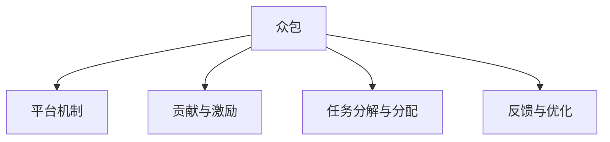

                 

# 众包：汇聚点滴智慧，解决重大难题

> 关键词：众包, 分布式协作, 智慧贡献, 问题求解, 技术协同, 人力资源优化, 创新驱动, 公共参与

## 1. 背景介绍

### 1.1 问题由来
随着互联网技术的飞速发展，全球化的知识生产与传播方式发生了深刻变化。信息与知识的获取变得更加便捷和开放，但同时，面对各种复杂的问题，如环境保护、公共卫生、社会治理等，单凭少数专家或机构的力量已难以取得根本性的突破。众包（Crowdsourcing）作为一种将大量小型任务分解并分配给众多参与者，通过集体的智慧来解决问题的方法，成为了现代问题求解的重要模式。

### 1.2 问题核心关键点
众包的核心在于通过互联网平台将复杂问题分解为可操作的小任务，分配给广大的非专业参与者，通过大家的智慧与劳动，共同解决重大难题。其关键点包括：

- 任务的分解与分配：如何将复杂问题分解成独立可操作的小任务，并分配给不同背景、技能的人。
- 贡献与激励机制：如何设计有效的激励机制，鼓励参与者积极贡献自己的智慧和技能。
- 反馈与优化：如何构建有效的反馈与优化机制，保证任务的高质量完成。
- 平台架构：如何构建高效的众包平台，支持大规模任务的管理与协调。

这些关键点共同构成了众包技术的基本框架，并使其在各行各业中得到广泛应用。

### 1.3 问题研究意义
众包技术对于提升社会问题求解的效率、促进知识共享与创新、推动社会治理的现代化具有重要意义：

1. **提高效率**：通过分布式协作，众包能够快速集结大量资源，解决传统集中式求解难以处理的复杂问题。
2. **促进创新**：多样化的参与者背景和视角带来了新颖的思路与方法，有助于问题的新解。
3. **共享知识**：众包平台成为知识分享与积累的重要场所，推动了知识的快速扩散与应用。
4. **支持治理**：在公共政策、环境保护等领域，众包能够汇集民众智慧，提升治理效果。
5. **优化资源**：通过合理分配任务，众包可以有效利用人力资源，缓解社会劳动力过剩的问题。

## 2. 核心概念与联系

### 2.1 核心概念概述

为更好地理解众包技术，本节将介绍几个密切相关的核心概念：

- **众包（Crowdsourcing）**：一种将复杂问题分解为独立可操作的小任务，分配给众多参与者解决，通过集体的智慧与劳动来共同完成目标的方法。

- **平台机制**：众包平台是众包活动的核心基础设施，提供了任务发布、分配、管理、反馈与激励等功能，是确保众包活动高效进行的关键。

- **贡献与激励**：众包平台通过设计合理的贡献与激励机制，鼓励参与者积极贡献自己的时间和智慧，提升整体活动效果。

- **任务分解与分配**：将复杂问题分解为独立的小任务，并根据参与者的技能和兴趣进行合理分配，是确保任务完成质量与效率的关键。

- **反馈与优化**：通过高效的反馈与优化机制，及时发现和修正任务执行中的问题，保证任务的高质量完成。

这些核心概念之间的逻辑关系可以通过以下Mermaid流程图来展示：



这个流程图展示众包的核心概念及其之间的关系：

1. 众包活动通过平台机制进行管理和协调。
2. 贡献与激励机制确保参与者的积极性与贡献度。
3. 任务分解与分配保证了任务的高效与高质量完成。
4. 反馈与优化保证了任务执行的及时调整与优化。

## 3. 核心算法原理 & 具体操作步骤

### 3.1 算法原理概述

众包活动的核心算法原理在于通过任务分解、分配与反馈机制，最大化利用参与者的智慧和技能，共同解决复杂问题。其核心步骤如下：

1. **任务分解**：将复杂问题分解为独立可操作的小任务。
2. **任务分配**：将小任务分配给合适的参与者。
3. **任务执行**：参与者独立完成任务并提交结果。
4. **反馈与优化**：平台对任务结果进行反馈与优化，保证整体活动的质量与效率。

### 3.2 算法步骤详解

众包活动的详细步骤包括：

**Step 1: 问题定义与任务分解**
- 明确问题目标，将其分解为独立、可操作的小任务。例如，环境保护中的空气质量监测，可以分解为监测点位置选择、传感器部署、数据收集与分析等子任务。

**Step 2: 任务分配与发布**
- 将分解后的任务发布到众包平台上，设定任务要求、截止日期与激励机制。例如，选择适合的志愿者进行传感器部署，并通过平台发布任务。

**Step 3: 任务执行与提交**
- 参与者根据平台要求完成任务，并提交结果。例如，志愿者在指定地点安装传感器，记录环境数据并上传至平台。

**Step 4: 反馈与优化**
- 平台对提交结果进行审查与反馈，必要时进行任务调整或重新分配。例如，平台对传感器数据进行初步分析，发现异常后要求志愿者重新部署或校验传感器。

**Step 5: 结果汇总与报告**
- 将汇总后的结果输出为报告，供决策者参考。例如，生成环境质量监测报告，并提出建议与改进措施。

### 3.3 算法优缺点

众包活动具有以下优点：

1. **高效性**：通过分布式协作，快速解决复杂问题。
2. **创新性**：多样化的参与者背景和视角带来了新颖的思路与方法。
3. **成本效益**：相比于集中式求解，众包通常具有更低的成本和更快的响应时间。
4. **可扩展性**：适合处理大规模、分布式的问题求解。

然而，众包活动也存在一些局限性：

1. **质量控制**：任务分配与执行中存在质量参差不齐的问题，可能导致最终结果的偏差。
2. **激励机制**：设计有效的激励机制需要较高的平台运营成本。
3. **平台依赖**：高度依赖众包平台的稳定性和可靠性，可能面临技术风险。
4. **信息安全**：大量数据集中存储在平台上，存在隐私和安全风险。

尽管存在这些局限性，但就目前而言，众包仍然是一种高效、灵活且广泛应用的问题求解模式。未来相关研究的重点在于如何进一步优化众包平台的设计，提升任务执行的质量与效率，同时兼顾激励机制的有效性与平台的安全性。

### 3.4 算法应用领域

众包技术在多个领域中得到了广泛应用，涵盖了从科技研发到社会治理的各个方面：

- **科技研发**：众包平台如Innocentive，用于解决复杂的科研难题，如新药物的发现。
- **环境保护**：通过众包平台进行空气、水质监测，收集公众数据。
- **公共政策**：利用众包进行公共问题的反馈与优化，如交通流量监测与优化。
- **文化创作**：使用众包平台进行电影剧本、音乐作品的创作与评价。
- **教育与培训**：通过众包平台进行知识共享与教育资源的优化配置。
- **商业应用**：如平台设计、产品测试等，通过众包加速产品迭代与市场响应。

除了这些经典应用外，众包技术还在更多领域中不断创新应用，为各行各业带来了新的解决思路和方法。随着技术的进步，相信众包将在更广阔的领域中发挥重要作用。

## 4. 数学模型和公式 & 详细讲解

### 4.1 数学模型构建

在数学上，众包活动可以建模为一个分布式优化问题，目标是通过最大化参与者的智慧与技能，优化整体问题的解决效果。形式化地，设问题总目标为 $F$，每个小任务的完成质量为 $q_i$，任务质量对总目标的贡献为 $w_i$，则总目标函数可以表示为：

$$
F = \sum_{i} w_i q_i
$$

其中，$q_i$ 为任务 $i$ 的完成质量，$w_i$ 为任务质量对总目标的贡献权重。

### 4.2 公式推导过程

以环境保护中的空气质量监测为例，我们推导众包任务的目标函数。设监测点为 $n$ 个，每个点的空气质量监测数据为 $x_{ij}$（$i$ 为监测点，$j$ 为监测时间），参与者 $k$ 在 $i$ 点监测得到的数据为 $y_{ik}$，平台对数据的权重为 $w_{ik}$，则众包任务的总目标函数可以表示为：

$$
F = \sum_{i} \sum_{k} w_{ik} y_{ik}
$$

为了最大化整体目标 $F$，参与者需要根据平台设定的权重 $w_{ik}$ 进行高质量的数据监测与提交。

### 4.3 案例分析与讲解

假设一个城市空气质量监测项目，需要部署多个监测站点。项目组将任务分解为站点位置选择、传感器安装、数据收集与分析等子任务，并通过众包平台发布任务。具体步骤如下：

1. **任务分解**：将城市划分为若干个监测区域，每个区域选择一个监测点位置。
2. **任务分配**：将监测点位置选择、传感器安装等任务分配给志愿者。
3. **任务执行**：志愿者独立完成任务并提交结果。
4. **反馈与优化**：平台对提交数据进行审查与反馈，确保数据准确性与完整性。
5. **结果汇总**：汇总所有数据，生成环境质量监测报告，提出改进措施。

通过众包活动，项目组不仅快速完成了多个监测点的部署，还利用了志愿者的智慧与技能，提高了监测数据的准确性与覆盖率。

## 5. 项目实践：代码实例和详细解释说明

### 5.1 开发环境搭建

在进行众包实践前，我们需要准备好开发环境。以下是使用Python进行Django开发的环境配置流程：

1. 安装Anaconda：从官网下载并安装Anaconda，用于创建独立的Python环境。

2. 创建并激活虚拟环境：
```bash
conda create -n crowdsourcing-env python=3.8 
conda activate crowdsourcing-env
```

3. 安装Django：根据Django版本，从官网获取对应的安装命令。例如：
```bash
conda install django=4.0
```

4. 安装各类工具包：
```bash
pip install numpy pandas scikit-learn matplotlib tqdm jupyter notebook ipython
```

完成上述步骤后，即可在`crowdsourcing-env`环境中开始众包实践。

### 5.2 源代码详细实现

下面我们以环境保护中的空气质量监测项目为例，给出使用Django进行众包实践的代码实现。

首先，定义任务模型和志愿者模型：

```python
from django.db import models

class Task(models.Model):
    name = models.CharField(max_length=255)
    description = models.TextField()
    reward = models.DecimalField(max_digits=10, decimal_places=2)

class Volunteer(models.Model):
    name = models.CharField(max_length=255)
    email = models.EmailField(unique=True)
    experience = models.IntegerField(default=0)
```

然后，定义任务分配和执行的视图函数：

```python
from django.shortcuts import render, redirect
from django.contrib.auth.decorators import login_required

@login_required
def task_list(request):
    tasks = Task.objects.all()
    return render(request, 'tasks/list.html', {'tasks': tasks})

@login_required
def task_assign(request, task_id):
    task = Task.objects.get(id=task_id)
    volunteers = Volunteer.objects.all()
    return render(request, 'tasks/assign.html', {'task': task, 'volunteers': volunteers})

@login_required
def task_submit(request, task_id, volunteer_id):
    task = Task.objects.get(id=task_id)
    volunteer = Volunteer.objects.get(id=volunteer_id)
    # 处理任务提交逻辑
    return redirect('task_list')

@login_required
def task_feedback(request, task_id):
    task = Task.objects.get(id=task_id)
    # 处理任务反馈逻辑
    return redirect('task_list')
```

最后，启动Django开发服务器并测试：

```bash
python manage.py runserver
```

打开浏览器，访问 `http://127.0.0.1:8000`，即可看到任务列表和任务分配页面，并可以进行任务提交与反馈。

### 5.3 代码解读与分析

让我们再详细解读一下关键代码的实现细节：

**Task和Volunteer模型**：
- 定义了任务和志愿者的基本属性，包括任务名称、描述、奖励，以及志愿者的姓名、邮箱、经验等。

**任务分配视图函数task_assign**：
- 从数据库中获取所有志愿者信息，并将任务信息传递给任务分配页面。
- 任务分配页面根据任务要求和志愿者技能，进行选择并提交分配结果。

**任务提交与反馈视图函数**：
- 处理志愿者的任务提交与反馈信息，更新任务状态与志愿者经验。
- 通过重定向将用户引导回任务列表页面，以便查看任务执行进展。

通过上述代码实现，我们可以看到，Django平台通过模型和视图函数的定义，实现了众包任务的高效管理与协作。开发者可以根据具体需求，灵活扩展任务的发布、执行与反馈功能，构建更加完整的众包系统。

当然，工业级的系统实现还需考虑更多因素，如任务调度、异常处理、数据存储等。但核心的众包范式基本与此类似。

## 6. 实际应用场景

### 6.1 智能城市管理

基于众包技术的智能城市管理系统，可以实时收集和分析城市运行数据，提升城市管理的智能化水平。

在实践中，可以利用众包平台收集市民的日常反馈，如交通流量、环境质量、公共设施使用情况等，通过数据分析优化城市资源配置，提升公共服务质量。例如，通过众包平台收集市民对城市绿化、垃圾处理等方面的反馈，生成改进建议，提升城市环境质量。

### 6.2 公共安全监控

在公共安全监控领域，众包技术可以用于收集和分析市民的日常行为数据，提升安全预警和应对能力。

例如，在人群密集区域，可以利用众包平台收集市民的行为数据，通过数据分析发现异常行为，及时预警和应对突发事件。在重大事件发生时，也可以通过众包平台组织市民进行现场监控与信息收集，提升事件处置的效率和效果。

### 6.3 环保行动倡议

环保行动中的众包技术，可以通过众包平台收集公众的环境数据与行动反馈，提升环保行动的参与度和效果。

例如，在环保志愿者行动中，可以利用众包平台发布任务，如环境监测、垃圾分类、植树造林等，动员公众参与。通过众包平台收集市民的行动数据，分析参与情况与效果，提升环保行动的针对性和实效性。

### 6.4 未来应用展望

随着众包技术的不断演进，其在更多领域的应用前景将会更加广阔。

在智慧医疗领域，通过众包平台收集医疗数据与用户反馈，提升医疗服务的质量与效率，如疾病预测、药品研发等。在智慧教育领域，利用众包平台进行教学资源共享与评价，提升教育资源的配置与优化。在智慧旅游领域，通过众包平台收集游客反馈，提升旅游服务的质量与个性化水平。

总之，众包技术作为一种分布式协作的模式，将在各个领域中发挥越来越重要的作用，为人类社会带来更多创新和变革。

## 7. 工具和资源推荐

### 7.1 学习资源推荐

为了帮助开发者系统掌握众包技术，这里推荐一些优质的学习资源：

1. **Crowdsourcing: Designing the People-Computer Interface**：由Margaret A. Orne Booker和Nikole B. lasse authors，深入探讨了众包平台的设计与实现，是众包领域的基础教材。

2. **Crowdsourcing Science: An Introduction to Problem-Solving with Many Minds**：由Innocentive的CEO Michael H. Lewis著，介绍了众包技术在科研问题求解中的应用，是科研工作者不可多得的参考书籍。

3. **Crowdsourcing**：由Brian Uzzi和Lis Terng著，系统介绍了众包技术的理论基础与应用实践，适合各类读者阅读。

4. **Crowdsourcing with Human Intelligence Platforms**：由Matthew R. Kressel著，介绍了各种HIPs（Human Intelligence Platforms）在众包中的应用，是技术从业人员的重要参考资料。

5. **Crowdsourcing in Health and Medicine**：由John G. Spura和Russell C. Owen著，探讨了众包在医疗领域的应用，是医疗工作者不可多得的参考书籍。

通过对这些资源的学习实践，相信你一定能够快速掌握众包技术的精髓，并用于解决实际的公共问题。

### 7.2 开发工具推荐

高效的开发离不开优秀的工具支持。以下是几款用于众包开发的常用工具：

1. **Django**：Python的开源Web框架，灵活的MVC架构，支持RESTful API开发，适合构建众包平台。

2. **Flask**：轻量级的Web框架，适合快速开发简单的众包应用。

3. **Zope**：开源的Web应用程序框架，支持各种Web开发需求，适合构建复杂的中型众包平台。

4. **Jenkins**：持续集成与持续部署工具，支持自定义插件和扩展，适合构建自动化众包开发流程。

5. **Trello**：项目管理工具，支持任务分配、进度跟踪等功能，适合众包活动的组织与管理。

6. **JIRA**：项目管理与问题跟踪工具，适合复杂项目的管理与协作。

合理利用这些工具，可以显著提升众包项目的开发效率，加速创新迭代的步伐。

### 7.3 相关论文推荐

众包技术的发展得益于学界的持续研究。以下是几篇奠基性的相关论文，推荐阅读：

1. **Crowdsourcing Design for Artificial Intelligence in the Classroom**：探讨了AI众包在教育领域的应用，分析了任务分解与分配的策略。

2. **Crowdsourcing Software Development**：探讨了众包在软件开发中的应用，分析了任务执行与反馈的优化方法。

3. **Crowdsourcing Applications in Public Health**：探讨了众包在公共卫生领域的应用，分析了数据收集与分析的策略。

4. **Crowdsourcing for Policy and Evaluation**：探讨了众包在公共政策领域的应用，分析了问题求解的策略与方法。

5. **Crowdsourcing for Good**：探讨了众包在社会治理领域的应用，分析了任务管理与激励机制的设计。

这些论文代表众包技术的发展脉络。通过学习这些前沿成果，可以帮助研究者把握学科前进方向，激发更多的创新灵感。

## 8. 总结：未来发展趋势与挑战

### 8.1 总结

本文对众包技术进行了全面系统的介绍。首先阐述了众包技术的研究背景和意义，明确了众包在提升社会问题求解效率、促进知识共享与创新、推动社会治理现代化等方面的独特价值。其次，从原理到实践，详细讲解了众包活动的数学模型与核心步骤，给出了众包任务开发的完整代码实例。同时，本文还广泛探讨了众包技术在智能城市、公共安全、环保行动等多个领域的应用前景，展示了众包技术的广泛潜力。此外，本文精选了众包技术的各类学习资源，力求为读者提供全方位的技术指引。

通过本文的系统梳理，可以看到，众包技术作为一种分布式协作的模式，正在成为现代社会问题求解的重要手段，极大地提升了社会治理和知识共享的效率与效果。未来，伴随技术的不断进步，众包技术将在更多领域中发挥更加重要的作用。

### 8.2 未来发展趋势

展望未来，众包技术将呈现以下几个发展趋势：

1. **智能化与自动化**：通过引入AI技术，如机器学习、自然语言处理等，提升众包任务的自动化水平，降低人工干预的复杂度。

2. **多领域融合**：众包技术将与其他人工智能技术进一步融合，如知识图谱、强化学习等，提升任务求解的智能化水平。

3. **平台优化**：众包平台的设计将更加注重用户体验与任务分配的优化，提升平台的使用效率与用户满意度。

4. **社区构建**：通过构建更活跃、更紧密的社区，增强参与者的归属感和协作意愿，提升众包活动的参与度和质量。

5. **跨界应用**：众包技术将在更多领域中得到应用，如医疗、教育、金融等，推动各行各业的智能化转型。

6. **伦理与治理**：随着众包技术的普及，如何保障参与者的权益、保护数据隐私、建立信任机制等伦理问题将逐渐得到重视。

以上趋势凸显了众包技术的广阔前景。这些方向的探索发展，必将进一步提升众包系统的性能和应用范围，为人类社会带来更多创新和变革。

### 8.3 面临的挑战

尽管众包技术已经取得了一定的成效，但在迈向更加智能化、普适化应用的过程中，仍面临诸多挑战：

1. **数据质量**：众包平台上的数据质量参差不齐，难以保证整体任务的准确性与可靠性。
2. **激励机制**：设计有效的激励机制需要较高的平台运营成本，难以在所有任务中实现。
3. **平台依赖**：高度依赖众包平台的稳定性和可靠性，可能面临技术风险。
4. **信息安全**：大量数据集中存储在平台上，存在隐私和安全风险。
5. **公平性**：众包平台的设计可能存在公平性问题，影响部分参与者的积极性。
6. **技术门槛**：构建高效的众包平台需要较高的技术门槛，需要专业团队进行开发与维护。

这些挑战需要我们不断探索和解决，以实现众包技术的可持续发展与广泛应用。

### 8.4 研究展望

面对众包技术所面临的挑战，未来的研究需要在以下几个方面寻求新的突破：

1. **数据质量提升**：通过引入数据标注与校验机制，提高众包平台上数据的准确性与可靠性。

2. **激励机制优化**：设计更灵活、多样化的激励机制，确保参与者的积极性与贡献度。

3. **平台架构优化**：通过改进平台架构与算法设计，提升众包活动的效率与质量。

4. **跨界应用推广**：将众包技术推广到更多领域，提升各行各业的智能化水平。

5. **伦理与安全保障**：建立健全的伦理与安全保障机制，保护参与者权益与数据安全。

6. **社区建设**：通过构建活跃、紧密的社区，增强参与者的归属感和协作意愿。

这些研究方向的探索，必将推动众包技术走向更高的台阶，为构建智慧社会提供更多创新思路与方法。

## 9. 附录：常见问题与解答

**Q1：众包活动中如何保证任务的质量与效率？**

A: 众包活动中，保证任务的质量与效率需要以下几个步骤：

1. **任务分解**：将复杂问题分解为独立、可操作的小任务，确保任务的明确性与可执行性。
2. **任务分配**：根据参与者的技能和兴趣进行合理分配，避免任务分配不均衡。
3. **任务执行**：提供详细的任务说明与指导，确保参与者理解任务要求。
4. **任务反馈**：设置明确的反馈机制，及时发现和修正任务执行中的问题。
5. **激励机制**：设计有效的激励机制，鼓励参与者高质量完成任务。

通过以上步骤，可以有效提升众包活动的质量和效率。

**Q2：众包活动中如何设计合理的激励机制？**

A: 设计合理的激励机制是众包活动成功的关键，具体包括以下几个步骤：

1. **设定任务目标**：明确任务的目标与完成标准，确保激励机制与任务目标一致。
2. **选择激励方式**：根据任务类型与参与者特点，选择合适的激励方式，如货币奖励、积分奖励、声誉奖励等。
3. **设定激励标准**：根据任务完成质量与效率，设定激励标准，确保激励机制的公平性与有效性。
4. **动态调整激励**：根据任务执行情况与平台反馈，动态调整激励机制，优化参与者的贡献度。

通过以上步骤，可以设计出高效、公平的激励机制，提升众包活动的整体效果。

**Q3：众包平台在实际应用中需要注意哪些问题？**

A: 众包平台在实际应用中需要注意以下几个问题：

1. **数据安全**：保护参与者的隐私数据，防止数据泄露和滥用。
2. **平台稳定**：确保众包平台的高可用性与稳定性，避免技术故障对任务执行的影响。
3. **激励公平**：避免激励机制对部分参与者的不公平，确保所有参与者都有机会获得激励。
4. **任务分配**：合理分配任务，避免任务分配不均衡导致的资源浪费。
5. **任务反馈**：及时收集和处理参与者的反馈，优化任务执行与平台设计。

通过以上问题的注意与解决，可以有效提升众包平台的运行效果与用户满意度。

**Q4：众包技术如何与其他人工智能技术结合？**

A: 众包技术可以与其他人工智能技术结合，提升任务求解的智能化水平。具体包括以下几个方面：

1. **机器学习**：通过机器学习算法，对参与者的数据进行建模与分析，提升任务求解的准确性与效率。
2. **自然语言处理**：利用自然语言处理技术，提升任务描述的理解与任务执行的自动化水平。
3. **知识图谱**：通过知识图谱的引入，提升任务求解的知识背景与关联性，提升任务的创新性与综合能力。
4. **强化学习**：通过强化学习算法，优化任务分配与激励机制，提升参与者的贡献度与任务完成质量。
5. **多模态融合**：利用多模态数据融合技术，提升任务求解的全面性与准确性。

这些技术的结合，将大大提升众包系统的智能化水平，推动人工智能技术在各行各业中的广泛应用。

**Q5：如何构建高效的众包平台？**

A: 构建高效的众包平台需要以下几个关键点：

1. **用户体验设计**：注重平台的用户体验设计，提升用户操作与任务完成的便捷性。
2. **任务管理机制**：设计灵活的任务管理机制，支持任务分解、分配、执行与反馈的全过程管理。
3. **数据处理能力**：提升平台的数据处理能力，支持大规模任务的数据存储与处理。
4. **社区构建与维护**：构建活跃、紧密的社区，增强参与者的归属感和协作意愿。
5. **技术基础设施**：提供高效、可靠的技术基础设施，支持平台的稳定运行与扩展。

通过以上关键点的优化，可以有效提升众包平台的运行效率与用户满意度。

---

作者：禅与计算机程序设计艺术 / Zen and the Art of Computer Programming

