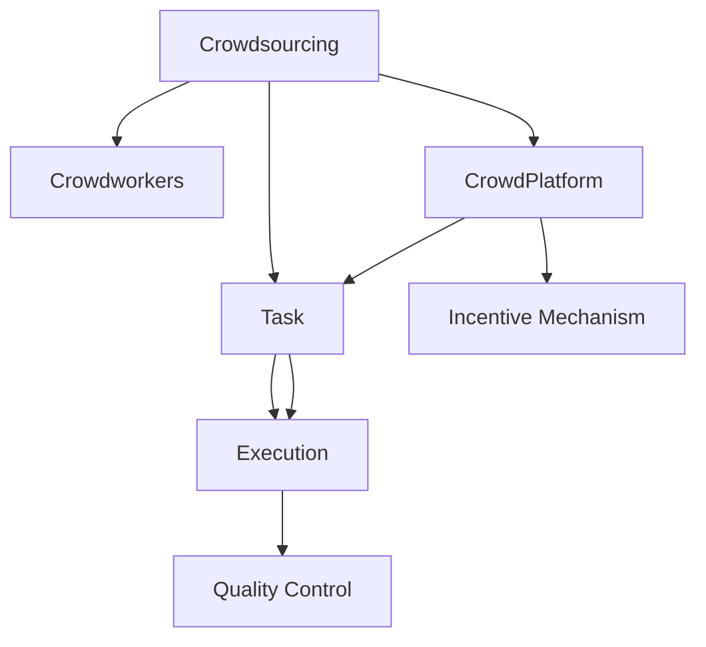

                 

# 众包：释放集体智慧的力量

在当今信息爆炸的时代，如何有效利用全球范围内的知识资源，驱动创新和解决问题的能力，成为许多企业和研究机构共同面临的挑战。众包（Crowdsourcing）作为新兴的协同工作模式，通过充分利用“大众”的智慧和创造力，不仅大幅降低了成本，还极大地提升了创新速度和解决复杂问题的能力。本文将从背景介绍、核心概念、算法原理与操作步骤、实际应用场景、工具和资源推荐等多个维度，全面深入地探讨众包的力量，并展望未来发展趋势。

## 1. 背景介绍

### 1.1 问题由来

随着互联网技术的发展，社交网络和在线平台的普及，一个庞大的、活跃的在线社群正逐渐形成。如何在这些平台中有效调动集体智慧，挖掘其中隐含的潜力，成为各大企业和研究机构关注的焦点。这一问题的解决催生了众包概念的诞生。

在众包模式中，任务被分配给由大众组成的团队，而非传统意义上的全职员工。大众通过在线平台参与任务，贡献自己的智慧和技能，并获得一定的报酬。这种方式大大降低了任务完成的时间和成本，同时激发了更多创造性和创新性思维。

### 1.2 问题核心关键点

众包模式的核心在于其能够以低成本高效地利用全球范围内的知识资源，加速创新过程，驱动集体智慧的释放。以下是众包模式几个关键要素：

- **任务分配和结果聚合**：众包平台将任务分配给大众，并将分散的结果进行汇总和评估。
- **劳动力市场和匹配机制**：平台通过算法匹配合适的任务执行者，确保任务高效完成。
- **激励和报酬机制**：平台提供多样化的激励和报酬，以吸引和激励大众参与。
- **质量控制和验证**：平台采用严格的质量控制机制，确保任务结果的准确性和可靠性。

这些核心要素共同构成了众包模式的运作框架，使其能够有效调动全球智慧，解决复杂问题。

### 1.3 问题研究意义

随着技术进步和全球化加速，众包模式在各个行业的应用前景愈发广阔。从科技、金融到教育、医疗，众包模式已经成为驱动创新和解决复杂问题的有效手段。其研究意义在于：

- 降低成本和提高效率。众包模式能够大幅降低企业和机构开展大规模任务所需的成本，并缩短任务完成时间。
- 激发创新和多样性思维。多样化的任务执行者带来了不同的视角和创意，有助于更全面地解决问题。
- 提高数据和知识的质量。大量大众的参与可以提供更大规模和更丰富的数据，从而提升数据分析和知识提取的准确性。
- 增强社会责任和包容性。众包模式提供了一个大众参与社会公益活动的机会，有助于构建更包容和公平的社会。

## 2. 核心概念与联系

### 2.1 核心概念概述

为更好地理解众包模式，本节将介绍几个密切相关的核心概念：

- **众包（Crowdsourcing）**：通过网络平台将任务分配给大众，以降低成本、加速任务完成的方式。
- **任务（Task）**：需要完成的具体工作，可以是数据标注、编程、设计、测试等。
- **执行者（Crowdworkers）**：参与任务执行的大众，可以是自由职业者、兼职人员、志愿者等。
- **众包平台（Platform）**：提供任务分配、执行、管理和报酬发放的在线平台。
- **质量控制（Quality Control）**：确保任务结果的准确性和可靠性，常用的方法包括随机抽样、多轮评估等。

这些核心概念之间的逻辑关系可以通过以下Mermaid流程图来展示：



这个流程图展示了这个过程中各个环节的逻辑联系：

1. 众包模式通过在线平台将任务分配给大众。
2. 大众根据平台的要求完成任务。
3. 众包平台提供任务执行的激励和报酬。
4. 最终结果需要通过严格的质量控制环节，确保结果的可靠性。

## 3. 核心算法原理 & 具体操作步骤

### 3.1 算法原理概述

众包算法的核心在于高效地将任务分配给合适的执行者，并聚合其结果，形成最终输出。其基本流程包括任务发布、执行、评估和报酬发放四个步骤。

假设有一个众包平台，分配给大众的任务集为 $T$，执行者集合为 $C$。任务执行的流程可以表示为：

$$
\text{Task}(T) \rightarrow \text{Crowdworkers}(C) \rightarrow \text{Quality Control}(QC) \rightarrow \text{Result}(R)
$$

其中 $QC$ 表示质量控制环节，确保 $R$ 的正确性和可靠性。

### 3.2 算法步骤详解

基于众包模式的核心算法可以分解为以下几个关键步骤：

**Step 1: 任务发布和平台匹配**

1. **任务发布**：任务发布者将需要完成的任务描述和要求上传到平台。
2. **匹配算法**：平台根据任务的性质和执行者的能力进行匹配，确保任务的高效完成。

**Step 2: 执行和反馈**

1. **任务执行**：执行者接收任务，并按要求完成任务。
2. **提交反馈**：执行者将任务结果提交给平台。

**Step 3: 结果聚合**

1. **结果评估**：平台采用多轮评估的方式，对执行者提交的结果进行评估。
2. **结果聚合**：通过统计和加权平均等方式，形成最终的任务结果。

**Step 4: 报酬发放**

1. **报酬计算**：根据执行者的绩效和结果的准确性，计算报酬。
2. **报酬发放**：平台将报酬支付给执行者。

### 3.3 算法优缺点

众包算法具有以下优点：

1. **成本效益高**：通过利用大众的力量，大幅降低了任务完成成本。
2. **灵活性强**：灵活的任务分配和执行机制，能够快速响应市场需求。
3. **多样性**：多样化的执行者背景和技能，有助于提高任务结果的创新性。

同时，众包算法也存在一定的局限性：

1. **质量控制难**：由于执行者水平参差不齐，质量控制环节相对复杂。
2. **激励机制复杂**：设计合理的激励机制，确保执行者的积极性和任务完成质量。
3. **数据隐私**：众包平台需要处理大量敏感数据，存在隐私泄露的风险。

### 3.4 算法应用领域

众包算法已经在多个领域得到了广泛应用，包括但不限于：

- **数据标注**：收集大规模标注数据，广泛应用于机器学习和自然语言处理等领域。
- **软件开发**：敏捷开发中的需求分析和代码编写，特别是开源社区的贡献。
- **设计**：产品原型设计和用户体验研究。
- **内容创作**：在线内容发布、视频和音乐创作。
- **科学研究**：实验设计和数据收集。

此外，众包模式还在灾害救援、公共服务、环境保护等多个领域展示了其独特的优势和潜力。

## 4. 数学模型和公式 & 详细讲解 & 举例说明

### 4.1 数学模型构建

在众包算法中，我们通常使用加权平均的方法来聚合结果，确保任务结果的可靠性。设任务结果为 $R$，执行者提交的结果为 $r_i$，执行者权重为 $w_i$，则加权平均公式为：

$$
R = \frac{\sum_{i=1}^N w_ir_i}{\sum_{i=1}^N w_i}
$$

其中 $N$ 为执行者数量。

### 4.2 公式推导过程

在众包算法中，执行者提交的结果 $r_i$ 通常需要经过质量控制和评估，得到评估得分 $s_i$。执行者的权重 $w_i$ 可以表示为：

$$
w_i = \alpha_i \times f_i
$$

其中 $\alpha_i$ 为执行者的信誉度，$f_i$ 为其在类似任务中的表现。在实际应用中，通常采用多轮评估和随机抽样等方式，确保评估结果的准确性。

通过上述公式，众包平台能够根据执行者的信誉度和表现，合理地分配任务，并计算任务结果。

### 4.3 案例分析与讲解

考虑一个在线音乐众包平台，平台需要处理大规模的用户反馈数据，以优化推荐算法。用户需要标记歌曲的情感倾向，执行者可以从平台随机分配。假设执行者 $i$ 标记的情感为 $r_{i,j}$，其权重 $w_i$ 为执行者的信誉度和任务完成时间的倒数：

$$
w_i = \alpha_i \times \frac{1}{t_i}
$$

其中 $\alpha_i$ 为执行者的信誉度，$t_i$ 为执行者完成任务所需的时间。最终的任务结果 $R$ 可以通过加权平均公式计算：

$$
R = \frac{\sum_{i=1}^N w_ir_{i,j}}{\sum_{i=1}^N w_i}
$$

通过上述计算，平台能够获得更准确的情感倾向数据，优化推荐算法，提升用户体验。

## 5. 项目实践：代码实例和详细解释说明

### 5.1 开发环境搭建

在进行众包项目开发前，我们需要准备好开发环境。以下是使用Python进行Web开发的环境配置流程：

1. 安装Anaconda：从官网下载并安装Anaconda，用于创建独立的Python环境。

2. 创建并激活虚拟环境：
```bash
conda create -n crowdsourcing-env python=3.8 
conda activate crowdsourcing-env
```

3. 安装Flask：基于Python的轻量级Web框架，适合快速迭代研究。
```bash
pip install flask
```

4. 安装其他工具包：
```bash
pip install pandas numpy flask-cors
```

完成上述步骤后，即可在`crowdsourcing-env`环境中开始众包项目开发。

### 5.2 源代码详细实现

这里我们以在线音乐推荐众包项目为例，给出Flask框架下的实现代码：

```python
from flask import Flask, request, jsonify

app = Flask(__name__)

@app.route('/tasks', methods=['POST'])
def create_task():
    task_data = request.get_json()
    # 将任务数据保存到数据库中
    # ...
    return jsonify({'status': 'success'})

@app.route('/tasks/<int:task_id>', methods=['POST'])
def submit_result(task_id):
    result_data = request.get_json()
    # 对执行者提交的结果进行评估和聚合
    # ...
    # 将结果保存到数据库中
    # ...
    return jsonify({'status': 'success'})

@app.route('/tasks/<int:task_id>', methods=['GET'])
def get_results(task_id):
    # 从数据库中获取任务结果
    # ...
    return jsonify(results)
```

### 5.3 代码解读与分析

让我们再详细解读一下关键代码的实现细节：

**create_task函数**：
- 处理任务创建请求，接收任务数据，保存到数据库中，返回创建成功的状态。

**submit_result函数**：
- 处理执行者提交结果请求，接收任务结果数据，进行评估和聚合，将结果保存到数据库中，返回提交成功的状态。

**get_results函数**：
- 处理任务结果获取请求，从数据库中获取任务结果，返回给用户。

这些函数展示了基本的Web服务逻辑：创建任务、提交结果、获取结果。通过Flask框架，可以轻松实现众包平台的基本功能。

### 5.4 运行结果展示

在实际开发中，可以通过Flask提供的调试模式和UI界面，快速验证代码的正确性。例如，可以通过浏览器访问`http://localhost:5000`来查看任务创建、提交和获取的演示页面。同时，也可以通过测试用例验证各函数的功能是否符合预期。

## 6. 实际应用场景

### 6.1 智能客服系统

在智能客服系统中，众包模式被广泛应用于处理大规模的客户咨询。通过众包平台，客服团队可以将常见的问答、解决方案等任务分配给大众执行，大幅降低人工成本，并加速响应速度。同时，众包平台可以实时监控执行者的反馈，及时发现问题并进行优化。

### 6.2 公共卫生数据收集

在公共卫生领域，众包模式可以用于大规模的调查和数据收集工作。例如，通过众包平台，可以动员大众参与问卷调查、数据记录等任务，快速收集公共卫生数据，为政府决策提供支持。这种模式能够高效利用全球范围的智慧，推动公共卫生事业的发展。

### 6.3 科学研究

在科学研究中，众包模式可以用于实验设计和数据收集。例如，通过众包平台，科学家可以设计大规模的实验任务，动员大众参与数据收集和实验执行，提高实验数据的规模和多样性。这种模式能够显著加速科研进程，推动科学发现。

### 6.4 未来应用展望

展望未来，众包模式将在更多领域得到广泛应用，推动集体智慧的进一步释放。

- **智能制造**：在制造领域，众包模式可以用于生产线优化、产品设计等任务，提升生产效率和产品质量。
- **环境保护**：通过众包平台，可以动员大众参与环境监测、垃圾分类等任务，推动可持续发展。
- **社会公益**：在社会公益领域，众包模式可以用于灾情监测、社区服务等领域，提升社会管理水平。

未来，众包模式将与人工智能、区块链等前沿技术深度融合，推动全球智慧的进一步释放，为社会进步提供强大的推动力。

## 7. 工具和资源推荐

### 7.1 学习资源推荐

为了帮助开发者系统掌握众包技术的理论基础和实践技巧，这里推荐一些优质的学习资源：

1. **《众包经济学》（Crowdsourcing Economics）**：经济学家Benjamin C. Jones所著，全面介绍了众包模式的理论基础、应用实践和案例分析。

2. **《众包平台设计指南》（The Platform Design For Crowdsourcing）**：组织行为专家Douglas Murray和Carol Dahl所著，探讨了众包平台的设计原则和最佳实践。

3. **Coursera众包经济学课程**：由纽约大学教授授课，深入讲解了众包模式的经济模型和应用案例。

4. **众包平台设计书籍**：如《众包平台设计》（Designing Crowdsourcing Platforms），提供了详细的平台设计指南和案例分析。

5. **众包平台开源项目**：如OpenCrowd、Crowds等，可以深入理解众包平台的技术实现和架构设计。

通过对这些资源的学习实践，相信你一定能够快速掌握众包技术的精髓，并用于解决实际的业务问题。

### 7.2 开发工具推荐

高效的开发离不开优秀的工具支持。以下是几款用于众包项目开发的常用工具：

1. **Flask**：基于Python的轻量级Web框架，适合快速迭代研究。适合开发众包平台的后端服务。

2. **Django**：Python全栈Web框架，适合开发复杂、高可靠性、高可扩展性的众包平台。

3. **AWS Lambda**：Amazon提供的无服务器计算服务，可以按需扩展计算资源，优化众包平台的服务性能。

4. **Firebase**：Google提供的云端开发平台，可以快速搭建和部署众包应用，提供数据存储和用户管理功能。

5. **GCP Crowdsourcing**：Google提供的云众包平台服务，支持大规模数据处理和分析，适合复杂数据驱动的任务。

合理利用这些工具，可以显著提升众包项目的开发效率，加快创新迭代的步伐。

### 7.3 相关论文推荐

众包模式的研究源于学界的持续研究。以下是几篇奠基性的相关论文，推荐阅读：

1. **Crowdsourcing and the Peer Production Economy**（Susan C. Baker）：探讨了众包模式的经济原理和机制，为众包模式的应用提供了理论基础。

2. **A Comparison of Website Crowdsourcing Methods**（Kurian）：对比了不同众包方法的效果和优劣，提供了众包模式优化的参考。

3. **The New Crowdsourcing Paradox**（Jones）：分析了众包模式在应用中的挑战和优化策略，提供了深入的理论探讨和案例分析。

4. **Crowdsourcing for Innovation**（Gallant）：探讨了众包模式在推动创新中的作用和潜力，提供了实际应用的案例和建议。

这些论文代表了大规模协作模式的研究脉络，为众包模式的发展提供了重要的理论支撑。通过学习这些前沿成果，可以帮助研究者把握学科前进方向，激发更多的创新灵感。

## 8. 总结：未来发展趋势与挑战

### 8.1 总结

本文对众包模式进行了全面系统的介绍。首先阐述了众包模式的背景和意义，明确了其利用大众智慧和创造力解决复杂问题的核心价值。其次，从原理到实践，详细讲解了众包算法的数学模型和操作步骤，给出了众包项目开发的完整代码实例。同时，本文还探讨了众包模式在多个领域的应用前景，展示了其广阔的发展潜力。此外，本文精选了众包技术的各类学习资源，力求为读者提供全方位的技术指引。

通过本文的系统梳理，可以看到，众包模式正在成为驱动创新和解决复杂问题的有效手段，极大地提升了全球智慧的利用效率。未来，伴随技术进步和产业升级，众包模式必将在更多领域得到应用，推动社会进步和经济发展。

### 8.2 未来发展趋势

展望未来，众包模式将呈现以下几个发展趋势：

1. **智能化和自动化**：随着人工智能技术的发展，众包平台将更加智能化，能够自动分配任务和评估结果，提高执行效率。

2. **标准化和规范化**：众包平台将制定更为严格的标准和规范，确保任务的高效执行和结果的可靠性。

3. **全球化和本地化结合**：通过众包平台，将全球智慧与本地化需求相结合，推动全球创新和本地化应用的协同发展。

4. **跨领域融合**：众包模式将与其他前沿技术如区块链、人工智能深度融合，提升数据和任务执行的可靠性和安全性。

5. **伦理和社会责任**：众包平台将更加注重数据隐私和社会责任，建立健全的伦理审查机制，确保任务执行的公平和透明。

这些趋势凸显了众包模式在全球智慧释放和问题解决中的重要作用，也预示着未来众包技术的广阔前景。

### 8.3 面临的挑战

尽管众包模式已经取得了显著成就，但在迈向更加智能化、普适化应用的过程中，它仍面临着诸多挑战：

1. **数据隐私和安全**：众包平台需要处理大量敏感数据，存在隐私泄露和安全风险。如何保护用户隐私，确保数据安全，将是未来的重要课题。

2. **任务执行质量控制**：由于执行者水平参差不齐，质量控制环节相对复杂。如何设计合理的激励机制和评估标准，确保任务结果的可靠性，还需进一步研究。

3. **执行者的积极性和稳定性**：如何吸引和留住稳定的执行者，确保众包平台的长期健康发展，是一个亟待解决的问题。

4. **技术实现复杂性**：众包平台的搭建和维护需要复杂的后台服务和算法支持，如何简化技术实现，降低开发成本，是一个重要的研究方向。

5. **文化和社会差异**：众包平台在处理跨文化任务时，如何克服语言、文化差异，确保任务执行的公平和透明，也是一个需要关注的课题。

### 8.4 研究展望

面对众包模式所面临的挑战，未来的研究需要在以下几个方面寻求新的突破：

1. **人工智能的辅助**：利用人工智能技术优化众包平台的自动化程度，提高任务执行效率和质量。

2. **区块链技术的应用**：利用区块链技术保障数据隐私和任务执行的透明性，增强众包平台的可信度。

3. **多样化的激励机制**：设计多样化的激励机制，激发执行者的积极性和创造性，提升任务执行质量。

4. **全球化与本地化的结合**：在保证全球智慧释放的同时，注重本地化需求，推动全球创新和本地化应用的协同发展。

5. **跨领域融合**：与其他前沿技术如人工智能、区块链深度融合，提升众包平台的综合竞争力。

6. **伦理和社会责任**：建立健全的伦理审查机制，确保众包平台的公平性和透明度，推动社会责任的发展。

这些研究方向的探索，将引领众包模式的进一步发展，使其能够更高效地利用全球智慧，解决复杂问题，推动社会的持续进步。

## 9. 附录：常见问题与解答

**Q1：众包模式是否适用于所有任务？**

A: 众包模式适用于大规模、低成本、高协作的任务。但对于一些专业性强、技术难度高的任务，可能需要专业人员或专家团队来完成。此外，对于涉及敏感数据的任务，需要特别注重数据隐私和安全。

**Q2：如何设计合理的激励机制？**

A: 合理的激励机制应综合考虑执行者的任务完成质量、效率和可靠性。常用的激励方式包括：
1. 基础报酬：根据任务难度和工作量，提供基本报酬。
2. 绩效激励：根据执行者的任务完成质量，提供额外的奖励。
3. 随机抽取：通过随机抽取部分任务，激励执行者积极参与。

**Q3：如何确保众包平台的数据安全和隐私？**

A: 众包平台应采用严格的数据加密和安全措施，确保数据传输和存储的安全性。同时，应制定明确的隐私保护政策，限制数据的访问和使用范围。

**Q4：众包平台如何应对文化和社会差异？**

A: 众包平台应提供多语言支持，确保任务的全球化执行。同时，应制定多文化友好型的任务设计，尊重不同文化背景下的任务执行者。

这些问题的解答有助于更好地理解和应用众包模式，提升其在全球智慧释放和问题解决中的作用。

