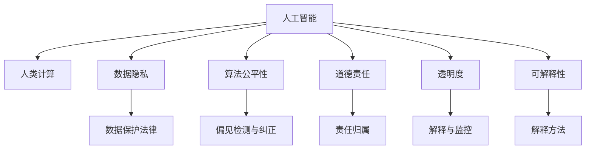

                 

# 伦理困境：探讨人类计算带来的挑战

> 关键词：
人工智能, 人类计算, 数据隐私, 道德责任, 算法公平性, 透明度, 可解释性

## 1. 背景介绍

### 1.1 问题由来
随着人工智能技术的迅猛发展，尤其是大数据和深度学习在各行各业的应用日益深入，人类计算已经成为了科技发展的核心驱动力。然而，在人类计算迅猛发展的背后，也隐藏着一系列深刻的伦理困境和挑战，这些问题不仅关系到科技的可持续发展，更牵涉到人类社会的公平、正义和道德。

这些伦理困境主要包括数据隐私、算法公平性、道德责任、透明度和可解释性等，这些问题在不同的应用场景下以不同的形式呈现，并逐渐成为制约人类计算进步的重要因素。如何在科技进步与伦理责任之间找到平衡，是我们必须面对的重要课题。

### 1.2 问题核心关键点
1. **数据隐私**：在数据驱动的AI应用中，如何保护个人数据隐私，防止数据泄露和滥用，是当前亟待解决的问题。
2. **算法公平性**：在模型训练和应用中，如何避免偏见和歧视，确保算法对不同群体的公平性，是另一个亟待解决的问题。
3. **道德责任**：在AI系统出错或造成损害时，如何界定开发者和用户的道德责任，是伦理困境中的一个重要方面。
4. **透明度**：如何增强AI系统的透明度，让用户和开发者都能理解系统的决策逻辑和运行机制，是当前研究的热点。
5. **可解释性**：如何提高AI系统的可解释性，使用户能够信任和理解系统的决策，是提升AI系统公信力的关键。

## 2. 核心概念与联系

### 2.1 核心概念概述

为更好地理解这些伦理困境，本节将介绍几个关键概念：

- **人工智能(AI)**：利用算法和数据驱动的计算机程序，模拟人类智能的技术。AI的应用范围广泛，涵盖语音识别、图像处理、自然语言处理等领域。
- **人类计算**：利用人类劳动和智慧进行的数据处理、模型训练等计算任务。人类计算在AI模型的预训练和微调中起着重要作用。
- **数据隐私**：保护个人数据不被非法获取、使用或泄露的权利。数据隐私保护是确保AI系统安全运行的基础。
- **算法公平性**：指算法在处理数据时对不同群体或个体提供公平的待遇，避免系统性偏见和歧视。
- **道德责任**：在AI系统出现错误或造成损害时，应明确开发者、用户和管理者的道德责任。
- **透明度**：指AI系统决策过程的公开和透明，用户和开发者能够理解系统的运行逻辑和结果。
- **可解释性**：指AI系统决策过程的可理解性，即用户能够理解系统如何做出决策，以及为什么做出这些决策。

这些概念之间的关系可以通过以下Mermaid流程图来展示：



这个流程图展示了人类计算在AI系统中各个概念之间的联系：

1. 人工智能依赖于数据和算法，数据隐私保护和算法公平性是确保系统公平和可靠的基础。
2. 道德责任、透明度和可解释性是增强AI系统可信度的关键，需要在模型设计和应用过程中全面考虑。
3. 数据保护法律、偏见检测与纠正、责任归属、解释与监控、解释方法等，是解决这些伦理困境的具体手段和措施。

## 3. 核心算法原理 & 具体操作步骤

### 3.1 算法原理概述

人类计算在AI系统中的应用，尤其是大数据和深度学习模型的训练和优化，往往需要大量的数据和计算资源。然而，这一过程中不可避免地涉及数据隐私保护、算法公平性和道德责任等伦理问题。

### 3.2 算法步骤详解

基于人类计算的AI系统构建通常包括以下几个步骤：

1. **数据收集与预处理**：收集相关的数据，并进行清洗、归一化等预处理工作，以确保数据的质量和一致性。
2. **模型训练与优化**：使用优化算法（如梯度下降、随机梯度下降等）对模型进行训练，并通过交叉验证等方法优化模型参数。
3. **模型评估与部署**：使用测试集对模型进行评估，确保其性能符合预期，并将模型部署到实际应用环境中。

在每个步骤中，都需要考虑数据隐私、算法公平性、道德责任、透明度和可解释性等伦理问题。

### 3.3 算法优缺点

基于人类计算的AI系统具有以下优点：

- **高效性**：利用计算机的高速运算能力，大幅提高了数据处理和模型训练的效率。
- **可扩展性**：随着计算资源和数据量的增加，AI系统的性能可以不断提升。
- **广泛应用**：广泛应用于图像识别、语音识别、自然语言处理等领域，推动了科技的广泛应用。

同时，也存在以下缺点：

- **数据隐私问题**：大量数据处理和存储可能涉及个人隐私泄露，需要采取严格的数据保护措施。
- **算法偏见**：如果训练数据存在偏见，模型也可能继承这些偏见，导致不公平和歧视。
- **道德责任模糊**：在AI系统出错或造成损害时，难以界定开发者和用户的责任。
- **透明度不足**：复杂的模型结构和使用的高阶数学算法，使得模型的决策过程难以理解。
- **可解释性差**：黑箱模型的决策过程缺乏可解释性，用户难以信任和接受。

### 3.4 算法应用领域

基于人类计算的AI系统已经在各个领域得到广泛应用，以下是几个典型应用案例：

1. **医疗健康**：利用AI系统进行疾病诊断、药物研发等，提高了医疗服务的效率和准确性。
2. **金融服务**：利用AI系统进行信用评估、风险管理等，提升了金融服务的智能化水平。
3. **智能制造**：利用AI系统进行质量检测、设备维护等，推动了制造业的智能化升级。
4. **智能交通**：利用AI系统进行交通流量预测、路径优化等，提高了交通系统的运行效率。

## 4. 数学模型和公式 & 详细讲解 & 举例说明

### 4.1 数学模型构建

在AI系统构建过程中，数学模型起到了至关重要的作用。以下是几个常见的数学模型及其构建方法：

- **线性回归模型**：用于建立输入和输出之间的线性关系。形式化为 $y = w_0 + w_1x_1 + w_2x_2 + ... + w_nx_n$，其中 $w$ 为模型参数，$x$ 为输入特征，$y$ 为输出目标。
- **决策树模型**：通过构建决策树来模拟分类或回归任务。每个节点代表一个特征，每个分支代表特征的取值，每个叶节点代表一个输出结果。
- **神经网络模型**：利用多层神经元模拟复杂的非线性关系。通常由输入层、隐藏层和输出层组成，每层包含多个神经元。

### 4.2 公式推导过程

以线性回归模型为例，其基本推导过程如下：

假设我们有一组训练数据 $(x_i, y_i), i=1,2,...,n$，其中 $x_i = (x_{i1}, x_{i2}, ..., x_{in})$ 为输入特征，$y_i$ 为输出目标。我们的目标是找到一个线性模型 $y = wx + b$，使得模型能够拟合训练数据。

我们最小化均方误差 $MSE = \frac{1}{2n} \sum_{i=1}^n (y_i - (wx_i + b))^2$，使用梯度下降法求解最小值。

令 $J(w,b) = \frac{1}{2n} \sum_{i=1}^n (y_i - (wx_i + b))^2$，则梯度下降的更新公式为：

$$
w_{i+1} = w_i - \alpha \frac{\partial J(w_i,b_i)}{\partial w_i}, \quad b_{i+1} = b_i - \alpha \frac{\partial J(w_i,b_i)}{\partial b_i}
$$

其中 $\alpha$ 为学习率。

### 4.3 案例分析与讲解

以人脸识别系统为例，我们可以分析其背后的数学模型和伦理困境：

- **数据隐私**：人脸识别系统需要大量的面部图像数据进行训练，这些数据往往涉及个人隐私。如何保护这些数据不被滥用是一个关键问题。
- **算法公平性**：不同种族、性别、年龄的人可能面临不同的偏见，如何在算法设计中消除这些偏见是一个挑战。
- **道德责任**：当人脸识别系统出现错误导致误判时，如何界定开发者、用户和管理者的责任是一个重要问题。
- **透明度**：人脸识别系统的内部工作机制复杂，难以让用户理解其决策过程。
- **可解释性**：人脸识别系统通常采用黑箱模型，难以提供具体的解释理由。

## 5. 项目实践：代码实例和详细解释说明

### 5.1 开发环境搭建

在进行AI系统开发前，需要搭建相应的开发环境。以下是Python环境下基于TensorFlow和Keras进行AI系统开发的流程：

1. 安装Anaconda，创建虚拟环境。
2. 安装TensorFlow、Keras等必要的Python库。
3. 准备数据集，并进行预处理。
4. 搭建模型，进行训练和验证。
5. 评估模型性能，并进行模型部署。

### 5.2 源代码详细实现

以下是一个简单的线性回归模型实现示例：

```python
import tensorflow as tf
import numpy as np

# 定义数据集
x_train = np.array([[1], [2], [3], [4], [5]])
y_train = np.array([2, 4, 6, 8, 10])
x_test = np.array([[6], [7], [8], [9], [10]])
y_test = np.array([12, 14, 16, 18, 20])

# 定义模型
model = tf.keras.Sequential([
    tf.keras.layers.Dense(units=1, input_shape=[1])
])

# 编译模型
model.compile(optimizer='sgd', loss='mean_squared_error')

# 训练模型
model.fit(x_train, y_train, epochs=100, batch_size=1)

# 评估模型
loss = model.evaluate(x_test, y_test)
print('Test loss:', loss)

# 预测结果
preds = model.predict(x_test)
print('Predictions:', preds)
```

### 5.3 代码解读与分析

**代码分析**：
- 首先，定义了训练和测试数据集，并使用Numpy数组存储。
- 接着，使用Keras搭建了一个简单的线性回归模型，并指定输入维度为1。
- 然后，使用SGD优化器进行模型编译，并指定均方误差作为损失函数。
- 在训练模型时，使用fit方法进行训练，设置100个epochs和批大小为1。
- 在训练完成后，使用evaluate方法评估模型在测试集上的均方误差。
- 最后，使用predict方法进行预测，并输出预测结果。

**关键点解读**：
- **数据准备**：AI系统开发的首要步骤是数据准备，包括数据收集、清洗和预处理。数据质量和一致性是系统性能的关键。
- **模型搭建**：选择合适的数学模型是AI系统开发的第一步，需要根据任务需求进行模型选择和参数设计。
- **模型训练**：通过训练数据对模型进行优化，找到最优的参数组合。
- **模型评估**：使用测试集对模型进行评估，确保其性能符合预期。
- **模型部署**：将模型部署到实际应用环境中，进行大规模数据处理和实时响应。

## 6. 实际应用场景

### 6.1 医疗健康

在医疗健康领域，AI系统可以用于疾病诊断、药物研发等。以疾病诊断为例，AI系统可以从医学影像中自动识别病变区域，辅助医生进行诊断和治疗决策。然而，在数据隐私、算法公平性等方面，需要特别注意：

- **数据隐私**：医学影像数据涉及患者隐私，应采取严格的加密和存储措施。
- **算法公平性**：不同种族、性别、年龄的人可能面临不同的疾病风险，需要在算法设计中消除这些偏见。
- **道德责任**：AI系统出错可能导致误诊，如何界定开发者、用户和管理者的责任是一个关键问题。
- **透明度**：医学影像诊断系统通常复杂，难以让用户理解其决策过程。
- **可解释性**：医学影像诊断系统通常采用黑箱模型，难以提供具体的解释理由。

### 6.2 金融服务

在金融服务领域，AI系统可以用于信用评估、风险管理等。以信用评估为例，AI系统可以从用户的历史交易数据中预测其信用风险。然而，在数据隐私、算法公平性等方面，需要特别注意：

- **数据隐私**：用户交易数据涉及个人隐私，应采取严格的加密和存储措施。
- **算法公平性**：不同群体的用户可能面临不同的信用风险，需要在算法设计中消除这些偏见。
- **道德责任**：AI系统出错可能导致金融损失，如何界定开发者、用户和管理者的责任是一个关键问题。
- **透明度**：信用评估系统通常复杂，难以让用户理解其决策过程。
- **可解释性**：信用评估系统通常采用黑箱模型，难以提供具体的解释理由。

### 6.3 智能制造

在智能制造领域，AI系统可以用于质量检测、设备维护等。以质量检测为例，AI系统可以从生产数据中自动识别质量缺陷，提高生产效率和产品质量。然而，在数据隐私、算法公平性等方面，需要特别注意：

- **数据隐私**：生产数据涉及企业机密，应采取严格的加密和存储措施。
- **算法公平性**：不同批次、不同设备生产的产品可能存在质量差异，需要在算法设计中消除这些偏见。
- **道德责任**：AI系统出错可能导致产品质量问题，如何界定开发者、用户和管理者的责任是一个关键问题。
- **透明度**：质量检测系统通常复杂，难以让用户理解其决策过程。
- **可解释性**：质量检测系统通常采用黑箱模型，难以提供具体的解释理由。

### 6.4 未来应用展望

随着AI技术的不断发展，未来AI系统将在更多领域得到应用，为人类社会带来深刻变革。以下是几个可能的未来应用场景：

1. **智慧城市**：利用AI系统进行交通流量预测、路径优化等，提高城市管理智能化水平。
2. **环境保护**：利用AI系统进行环境监测、污染预测等，推动绿色发展。
3. **教育**：利用AI系统进行个性化教育、智能评估等，提升教育质量。
4. **医疗**：利用AI系统进行疾病预测、个性化治疗等，推动医疗健康领域创新。

## 7. 工具和资源推荐

### 7.1 学习资源推荐

为了帮助开发者掌握AI技术的伦理困境，以下是一些推荐的资源：

1. **《人工智能伦理》课程**：由斯坦福大学开设的在线课程，全面讲解AI技术的伦理问题。
2. **《深度学习》书籍**：Ian Goodfellow、Yoshua Bengio和Aaron Courville合著的深度学习经典教材，涵盖AI技术的原理和应用。
3. **《人工智能与道德》书籍**：对AI技术的伦理困境进行深入探讨，提供解决方案。
4. **DeepAI网站**：提供最新的AI研究成果和伦理讨论，社区活跃。
5. **IEEE论文数据库**：涵盖AI技术的各类研究论文，提供学术参考。

### 7.2 开发工具推荐

为了提升AI系统开发的效率和质量，以下是一些推荐的开发工具：

1. **TensorFlow**：由Google开发的深度学习框架，提供丰富的API和工具支持。
2. **Keras**：基于TensorFlow的高级API，提供简单易用的模型搭建和训练功能。
3. **Jupyter Notebook**：开源的交互式编程环境，支持Python和多种语言，适合数据分析和模型训练。
4. **PyCharm**：流行的Python IDE，提供强大的代码编辑和调试功能。
5. **GitHub**：全球最大的代码托管平台，支持版本控制和协作开发。

### 7.3 相关论文推荐

以下是几篇关于AI伦理困境的重要论文：

1. **《The Moral Status of Artifical Intelligence》**：讨论AI系统的道德地位和伦理责任。
2. **《Towards a Moral Machine》**：探讨如何构建道德可接受的AI系统。
3. **《Ethics in AI》**：从多个角度讨论AI技术的伦理问题，提供解决方案。
4. **《Fairness and Accountability in Machine Learning》**：讨论AI系统的公平性和可解释性问题。
5. **《Algorithmic Fairness through Pre-design》**：提出预设计方法，解决算法偏见问题。

## 8. 总结：未来发展趋势与挑战

### 8.1 研究成果总结

本文对AI系统构建中的伦理困境进行了全面探讨，主要包括数据隐私、算法公平性、道德责任、透明度和可解释性等问题。通过分析这些问题的现状和挑战，为未来AI系统的开发和应用提供了理论基础和实践指导。

### 8.2 未来发展趋势

未来AI系统将在各个领域得到广泛应用，带来深刻变革。以下是几个可能的趋势：

1. **数据隐私保护**：随着数据驱动AI的发展，数据隐私保护将成为AI系统的核心关注点。
2. **算法公平性**：算法偏见问题将得到越来越多的关注，公平性将成为AI系统设计和应用的关键指标。
3. **道德责任界定**：AI系统的道德责任界定将变得更加重要，需要明确的法律和规范。
4. **透明度和可解释性**：AI系统的透明度和可解释性将成为用户信任和接受的重要因素。
5. **AI伦理标准**：AI伦理标准的制定和实施将成为推动AI技术发展的重要保障。

### 8.3 面临的挑战

尽管AI技术在各个领域取得了显著进展，但在实现这些未来趋势的过程中，仍面临诸多挑战：

1. **数据隐私保护**：如何在大规模数据处理中保护个人隐私，是一个重要的挑战。
2. **算法公平性**：如何消除算法中的偏见，确保不同群体的公平性，是一个复杂的问题。
3. **道德责任界定**：在AI系统出错或造成损害时，如何界定开发者、用户和管理者的责任，是一个亟待解决的难题。
4. **透明度和可解释性**：复杂的AI系统难以提供清晰的解释，用户和开发者难以理解其决策过程。
5. **AI伦理标准**：AI伦理标准的制定和实施需要多方协作，涉及法律、道德、技术等多个层面。

### 8.4 研究展望

为了应对这些挑战，未来的AI研究需要在以下几个方面进行深入探索：

1. **数据隐私保护技术**：开发更高效、更安全的数据保护技术，确保AI系统中的数据隐私。
2. **公平性算法**：研究和开发消除算法偏见的算法，确保AI系统的公平性。
3. **道德责任框架**：建立AI系统道德责任的框架和标准，明确各方的责任和义务。
4. **可解释AI**：研究和开发可解释AI技术，提高AI系统的透明度和可解释性。
5. **AI伦理规范**：制定和推广AI伦理规范，推动AI技术的可持续发展。

总之，未来的AI研究需要在技术进步和伦理责任之间找到平衡，推动AI技术向更加公平、透明、可解释、可控的方向发展，为人类社会带来更大的福祉。

## 9. 附录：常见问题与解答

**Q1: 如何保护数据隐私？**

A: 保护数据隐私是AI系统开发的首要任务。以下是几种常见的方法：
1. **数据匿名化**：对数据进行去标识化处理，去除或模糊化个人身份信息。
2. **数据加密**：对数据进行加密处理，防止未经授权的访问。
3. **联邦学习**：在分布式环境下，各节点只在本地进行模型训练，不交换原始数据，保护数据隐私。

**Q2: 如何消除算法偏见？**

A: 消除算法偏见是一个复杂的过程，以下是几种常见的方法：
1. **数据多样性**：收集多样化的数据集，减少数据偏见。
2. **算法调整**：调整算法模型，消除偏见。
3. **偏见检测**：使用偏见检测工具，发现并纠正模型中的偏见。

**Q3: 如何界定道德责任？**

A: 界定道德责任需要明确各方的责任和义务。以下是几种常见的方法：
1. **合同约定**：在合同中明确各方的责任和义务。
2. **法律法规**：制定和完善法律法规，明确各方的责任和义务。
3. **伦理审查**：在AI系统开发和应用过程中，进行伦理审查，确保符合伦理标准。

**Q4: 如何提高AI系统的透明度和可解释性？**

A: 提高AI系统的透明度和可解释性是一个重要目标。以下是几种常见的方法：
1. **模型可视化**：使用可视化工具，展示模型内部结构和决策过程。
2. **可解释模型**：使用可解释模型，如决策树、线性模型等，提高模型的透明度。
3. **用户反馈**：通过用户反馈，了解模型决策结果，并进行改进。

---

作者：禅与计算机程序设计艺术 / Zen and the Art of Computer Programming

