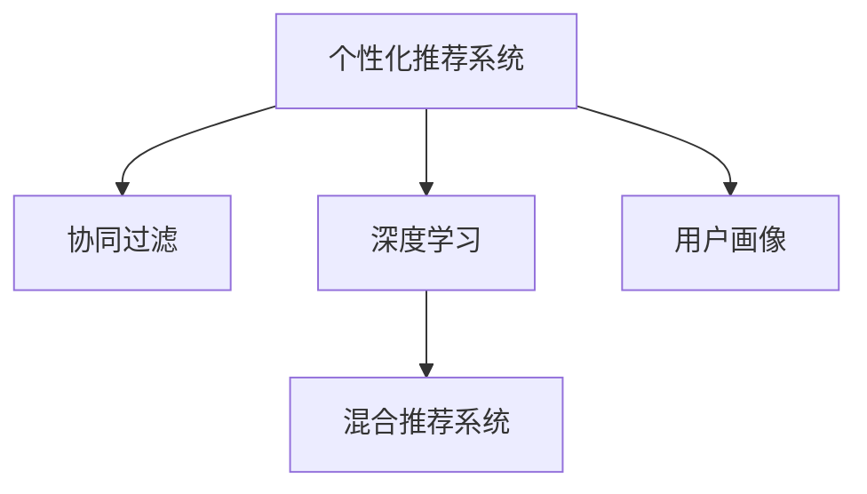

                 

# 体验的个性化矩阵：AI定制的生活方案

## 1. 背景介绍

在当今高度发达的信息时代，个性化体验已经成为推动用户满意度和品牌忠诚度的关键因素。无论是电子商务、在线教育、娱乐，还是社交媒体，越来越多的企业开始重视通过AI技术，为用户提供个性化服务。然而，如何利用AI技术实现个性化的高效管理和高效优化，仍是一个具有挑战性的问题。

本博客文章将深入探讨如何利用AI技术，特别是基于机器学习和深度学习的算法，实现个性化体验的优化与定制。我们将会分析现有的个性化矩阵技术，包括协同过滤、推荐系统、内容推荐、搜索引擎和广告优化等领域的应用，并且进一步探讨如何通过持续学习和反馈机制，动态地调整个性化体验以满足用户需求。

## 2. 核心概念与联系

### 2.1 核心概念概述

为了更好地理解个性化矩阵，本节将介绍几个密切相关的核心概念：

- **个性化推荐系统(Recommendation System)**：通过分析用户的行为数据，如浏览历史、购买记录、搜索历史等，推荐用户可能感兴趣的商品、内容或服务。
- **协同过滤(Collaborative Filtering)**：一种推荐系统算法，通过分析用户之间的行为相似性来推荐物品。
- **深度学习**：一种基于神经网络的机器学习算法，通过多层次的特征提取和模式识别，提高推荐的准确性和效率。
- **用户画像(User Profile)**：通过用户的多种行为数据，构建出用户兴趣、偏好、社会关系等多维度的综合画像，帮助系统更好地理解用户需求。
- **混合推荐系统(Hybrid Recommendation System)**：结合多个推荐算法，通过融合多种特征提高推荐的全面性和可靠性。

这些概念之间相互联系，共同构成了个性化矩阵的核心框架。协同过滤和深度学习算法通过用户画像来分析用户行为数据，从而实现个性化推荐。而混合推荐系统则通过综合多种推荐算法，提升推荐结果的准确性和多样性。

### 2.2 核心概念原理和架构的 Mermaid 流程图(Mermaid 流程节点中不要有括号、逗号等特殊字符)



这个流程图展示了个性化推荐系统的工作流程，其中协同过滤和深度学习是两个主要算法，用户画像是数据驱动的重要组成部分，而混合推荐系统则通过融合多种算法提高推荐效果。

## 3. 核心算法原理 & 具体操作步骤

### 3.1 算法原理概述

基于AI的个性化矩阵，通过分析用户的多种行为数据，利用机器学习和深度学习的算法，为用户提供定制化的推荐和服务。其核心思想是通过收集、处理和分析用户数据，建立用户画像，并基于此构建个性化推荐模型。

在推荐系统中，常用的算法包括协同过滤、基于内容的推荐、深度学习和混合推荐系统。协同过滤通过分析用户之间的行为相似性，找到与用户兴趣相似的其他用户，从而推荐物品。基于内容的推荐则根据物品的特征与用户兴趣之间的相似性进行推荐。深度学习通过构建复杂的网络结构，自动提取物品特征，并通过多层感知器、卷积神经网络等深度模型提高推荐的准确性。混合推荐系统则通过融合多种算法，取长补短，提高推荐的全面性和可靠性。

### 3.2 算法步骤详解

基于AI的个性化矩阵通常包括以下关键步骤：

**Step 1: 数据收集与预处理**

- 收集用户的行为数据，如浏览历史、购买记录、搜索历史等。
- 对数据进行清洗和归一化处理，去除噪音和异常值，保证数据的质量。

**Step 2: 构建用户画像**

- 通过用户的行为数据，提取用户的兴趣、偏好、社会关系等多维度的综合画像。
- 可以使用协同过滤、基于内容的推荐等方法，对用户画像进行补充和修正。

**Step 3: 设计推荐模型**

- 选择合适的推荐算法，如协同过滤、深度学习等。
- 设计合适的特征提取和模型结构，提升推荐的准确性。

**Step 4: 模型训练与优化**

- 使用用户的推荐数据，对推荐模型进行训练。
- 使用交叉验证等技术，评估模型的性能并进行优化。

**Step 5: 实际应用与调整**

- 将训练好的模型应用于实际的推荐系统中，提供个性化服务。
- 通过用户的反馈，持续调整推荐模型，提升用户体验。

### 3.3 算法优缺点

基于AI的个性化矩阵具有以下优点：

- **高效性**：利用机器学习和深度学习算法，可以高效地处理大规模数据，并快速提供个性化推荐。
- **准确性**：通过深度学习模型，能够自动提取用户和物品的多种特征，提升推荐的准确性。
- **可扩展性**：能够根据不同业务需求，构建不同类型的推荐模型。
- **灵活性**：能够结合多种算法，构建混合推荐系统，提升推荐效果。

同时，该算法也存在一些缺点：

- **数据依赖**：个性化推荐依赖于大量的用户行为数据，数据不足可能导致推荐效果不佳。
- **隐私问题**：收集和使用用户行为数据，可能涉及隐私问题，需要严格的隐私保护措施。
- **过拟合风险**：在用户数据较少的情况下，模型可能出现过拟合的风险，影响推荐的泛化能力。
- **模型复杂性**：深度学习模型需要大量的计算资源，模型复杂性高，对计算资源要求高。

### 3.4 算法应用领域

基于AI的个性化矩阵在多个领域中得到广泛应用：

- **电子商务**：通过个性化推荐，提高用户购买率和转化率，如淘宝、亚马逊等。
- **在线教育**：根据学生的学习行为，推荐个性化的学习资源和课程，如Coursera、Khan Academy等。
- **娱乐**：推荐用户可能感兴趣的电影、音乐、视频等，如Netflix、Spotify等。
- **新闻媒体**：推荐用户感兴趣的新闻和文章，如今日头条、Flipboard等。
- **社交网络**：推荐用户可能感兴趣的朋友和内容，如Facebook、Twitter等。

这些领域的应用，使得个性化推荐技术成为提升用户体验和服务质量的重要手段。未来，随着AI技术的进一步发展，个性化推荐系统将在更多领域得到应用，为各行各业带来新的机遇和挑战。

## 4. 数学模型和公式 & 详细讲解 & 举例说明

### 4.1 数学模型构建

在个性化推荐系统中，常用的数学模型包括协同过滤模型、基于内容的推荐模型和深度学习模型。

**协同过滤模型**：
协同过滤模型包括基于用户的协同过滤和基于物品的协同过滤。以基于用户的协同过滤为例，其数学模型如下：

$$
\hat{r}_{ui} = \frac{1}{K} \sum_{k=1}^K \alpha_{uk} \frac{1}{\hat{s}_{ki}} \sum_{j=1}^N a_{ij} r_{uj}
$$

其中，$u$ 表示用户，$i$ 表示物品，$K$ 表示用户和物品的共同特征维度，$a_{ij}$ 表示物品$i$的特征，$k$ 表示用户特征向量的维度，$\alpha_{uk}$ 表示用户$u$的特征权重，$\hat{s}_{ki}$ 表示物品$i$在特征$k$上的标准化向量，$r_{uj}$ 表示用户$u$对物品$i$的评分。

**基于内容的推荐模型**：
基于内容的推荐模型通过用户对物品的评分，建立用户和物品的相似性。其数学模型如下：

$$
\hat{r}_{ui} = \frac{1}{N} \sum_{i=1}^N \alpha_{ik} \beta_{uk} a_{ik}
$$

其中，$\alpha_{ik}$ 表示物品$i$在特征$k$上的权重，$\beta_{uk}$ 表示用户$u$在特征$k$上的权重，$a_{ik}$ 表示物品$i$在特征$k$上的评分。

**深度学习模型**：
深度学习模型通常使用多层感知器(MLP)、卷积神经网络(CNN)等结构。以多层感知器为例，其数学模型如下：

$$
\hat{r}_{ui} = \sigma(z_u \cdot w_i)
$$

其中，$\sigma$ 表示激活函数，$z_u$ 表示用户$u$的输入向量，$w_i$ 表示物品$i$的权重向量。

### 4.2 公式推导过程

以协同过滤模型为例，我们假设有一个用户$u$和一个物品$i$，使用基于用户的协同过滤方法推荐物品$i$。模型的输入为$u$的评分$r_{uj}$和用户$u$的特征向量$\alpha_{uk}$。

模型的输出为物品$i$的评分$\hat{r}_{ui}$。模型的损失函数为均方误差损失函数：

$$
L = \frac{1}{N} \sum_{i=1}^N (\hat{r}_{ui} - r_{ui})^2
$$

使用梯度下降等优化算法，最小化损失函数，更新模型参数。

### 4.3 案例分析与讲解

以Netflix的个性化推荐系统为例，Netflix通过分析用户的观看历史和评分，构建用户画像，并利用协同过滤和深度学习算法进行推荐。Netflix使用基于矩阵分解的协同过滤方法，将其推荐模型称为PRS(Probabilistic Matrix Factorization)。PRS模型通过分解用户和物品的评分矩阵，提取用户和物品的特征，构建出推荐模型。Netflix还使用深度学习算法进行推荐，将用户画像和物品特征作为输入，输出推荐结果。通过结合多种算法，Netflix能够提供高质量的个性化推荐服务，提升用户体验。

## 5. 项目实践：代码实例和详细解释说明

### 5.1 开发环境搭建

在进行个性化推荐系统的开发前，我们需要准备好开发环境。以下是使用Python进行PyTorch开发的环境配置流程：

1. 安装Anaconda：从官网下载并安装Anaconda，用于创建独立的Python环境。

2. 创建并激活虚拟环境：
```bash
conda create -n pytorch-env python=3.8 
conda activate pytorch-env
```

3. 安装PyTorch：根据CUDA版本，从官网获取对应的安装命令。例如：
```bash
conda install pytorch torchvision torchaudio cudatoolkit=11.1 -c pytorch -c conda-forge
```

4. 安装Transformers库：
```bash
pip install transformers
```

5. 安装各类工具包：
```bash
pip install numpy pandas scikit-learn matplotlib tqdm jupyter notebook ipython
```

完成上述步骤后，即可在`pytorch-env`环境中开始项目实践。

### 5.2 源代码详细实现

这里我们以Netflix的个性化推荐系统为例，给出使用PyTorch和Transformers库对PRS模型进行实现的代码。

首先，定义PRS模型的参数和损失函数：

```python
import torch
import torch.nn as nn
from torch import nn
import torch.nn.functional as F

class PPRSModel(nn.Module):
    def __init__(self, num_users, num_items, num_factors):
        super(PPRSModel, self).__init__()
        self.num_users = num_users
        self.num_items = num_items
        self.num_factors = num_factors
        
        self.user_factors = nn.Parameter(torch.randn(num_users, num_factors))
        self.item_factors = nn.Parameter(torch.randn(num_items, num_factors))
        
        self.critic = nn.Sequential(
            nn.Linear(num_factors, 1)
        )
        
    def forward(self, user_index, item_index):
        user_factors = self.user_factors[user_index]
        item_factors = self.item_factors[item_index]
        
        predicate = (user_factors * item_factors).sum(dim=1, keepdim=True)
        predicate = F.softmax(predicate, dim=1)
        
        predicted_ratings = self.critic(predicate)
        return predicted_ratings
```

然后，定义数据处理函数：

```python
from torch.utils.data import Dataset, DataLoader

class MovieLensDataset(Dataset):
    def __init__(self, ratings, user_factors, item_factors):
        self.ratings = ratings
        self.user_factors = user_factors
        self.item_factors = item_factors
        
    def __len__(self):
        return len(self.ratings)
    
    def __getitem__(self, idx):
        user_index = self.ratings[idx, 0].item()
        item_index = self.ratings[idx, 1].item()
        rating = self.ratings[idx, 2].item()
        
        user_factors = self.user_factors[user_index].detach().cpu().numpy()
        item_factors = self.item_factors[item_index].detach().cpu().numpy()
        
        return (user_index, item_index), rating, user_factors, item_factors
```

接着，定义模型训练和评估函数：

```python
def train_epoch(model, data_loader, optimizer, device, num_epochs):
    model.train()
    for epoch in range(num_epochs):
        for (user_index, item_index), rating, user_factors, item_factors in data_loader:
            user_index = torch.tensor(user_index, device=device)
            item_index = torch.tensor(item_index, device=device)
            
            prediction = model(user_index, item_index)
            loss = F.smooth_l1_loss(prediction, torch.tensor(rating, device=device))
            
            optimizer.zero_grad()
            loss.backward()
            optimizer.step()
            
    return model
```

最后，启动训练流程并在测试集上评估：

```python
from sklearn.metrics import mean_squared_error

def evaluate(model, data_loader):
    model.eval()
    total_rmse = 0
    for (user_index, item_index), rating, user_factors, item_factors in data_loader:
        user_index = torch.tensor(user_index, device=device)
        item_index = torch.tensor(item_index, device=device)
        
        with torch.no_grad():
            predicted_ratings = model(user_index, item_index)
            rmse = mean_squared_error(rating, predicted_ratings)
            total_rmse += rmse
            
    return total_rmse / len(data_loader)
```

以上就是使用PyTorch和Transformers库对Netflix的个性化推荐系统进行代码实现的完整流程。可以看到，通过定义模型参数和损失函数，构建数据集和数据处理函数，设置训练和评估函数，我们可以快速搭建一个基本的个性化推荐系统。

### 5.3 代码解读与分析

让我们再详细解读一下关键代码的实现细节：

**MovieLensDataset类**：
- `__init__`方法：初始化数据集，包括评分数据、用户特征和物品特征。
- `__len__`方法：返回数据集的大小。
- `__getitem__`方法：返回数据集中的单个样本，包括用户索引、物品索引和评分。

**PPRSModel类**：
- `__init__`方法：初始化模型参数，包括用户特征、物品特征和权重向量。
- `forward`方法：前向传播计算预测评分，通过矩阵分解计算预测评分。

**train_epoch函数**：
- 定义模型为训练模式，遍历数据集，对每个样本进行前向传播和反向传播，更新模型参数。

**evaluate函数**：
- 定义模型为评估模式，遍历数据集，对每个样本进行前向传播，计算平均RMSE（均方根误差）。

**训练流程**：
- 定义总的epoch数和批处理大小，开始循环迭代
- 每个epoch内，对训练集进行迭代，在每个batch上进行前向传播和反向传播，更新模型参数
- 在测试集上评估模型性能，输出RMSE指标

可以看到，PyTorch和Transformers库使得个性化推荐系统的实现变得简洁高效。开发者可以将更多精力放在数据处理、模型改进等高层逻辑上，而不必过多关注底层的实现细节。

当然，工业级的系统实现还需考虑更多因素，如模型的保存和部署、超参数的自动搜索、更灵活的任务适配层等。但核心的推荐算法基本与此类似。

## 6. 实际应用场景

### 6.1 智能客服系统

基于个性化推荐系统的智能客服系统，可以为用户提供更高效、个性化的服务体验。通过收集用户的历史咨询记录和反馈，推荐系统可以动态调整客服对话策略，提升用户的满意度和忠诚度。

在技术实现上，可以构建基于意图识别的推荐系统，根据用户输入的文本，推荐最合适的回复模板。同时，系统还可以结合自然语言处理技术，进行情感分析，提升对话的亲密度和情感共鸣。

### 6.2 金融风险管理

在金融领域，个性化推荐系统可以帮助金融机构进行风险管理。通过分析用户的历史交易数据，推荐系统可以预测用户的风险偏好和行为模式，帮助金融机构制定个性化的风险管理策略。

具体而言，可以构建基于用户行为特征和金融产品的推荐模型，通过评分预测用户的风险容忍度。系统可以根据用户风险容忍度，动态调整金融产品的推荐列表，减少不良资产的风险。

### 6.3 健康医疗

个性化推荐系统在健康医疗领域也有广泛应用。通过分析用户的健康数据和行为模式，推荐系统可以推荐个性化的健康管理方案和医疗服务。

具体而言，可以构建基于用户健康数据的推荐模型，推荐个性化的饮食方案、运动计划和医疗检查项目。系统可以根据用户健康数据，动态调整推荐方案，提升用户的健康水平。

### 6.4 未来应用展望

随着个性化推荐系统的不断发展，其在更多领域将得到广泛应用，为各行各业带来新的机遇和挑战。

在智慧城市治理中，推荐系统可以帮助城市管理部门制定个性化的城市规划方案，提升城市管理效率和服务质量。

在教育领域，推荐系统可以帮助学校制定个性化的教学方案，提升教学效果和学习体验。

在娱乐领域，推荐系统可以帮助媒体公司制定个性化的内容推荐方案，提升用户粘性和广告效果。

未来，随着个性化推荐技术的不断进步，其在更多领域将得到应用，为各行各业带来新的机遇和挑战。相信随着技术的日益成熟，个性化推荐技术将成为人工智能落地应用的重要范式，推动人工智能技术在各个领域的普及和应用。

## 7. 工具和资源推荐

### 7.1 学习资源推荐

为了帮助开发者系统掌握个性化推荐技术的理论基础和实践技巧，这里推荐一些优质的学习资源：

1. 《推荐系统：算法、实战与技术》系列博文：由AI技术专家撰写，深入浅出地介绍了推荐系统算法的基本原理、实时计算和工程实现。

2. Coursera《Machine Learning》课程：由斯坦福大学开设的机器学习经典课程，涵盖推荐系统等内容，适合初学者入门。

3. 《深度学习与推荐系统》书籍：全面介绍了深度学习在推荐系统中的应用，包括协同过滤、深度学习等技术。

4. Kaggle：Kaggle平台提供了众多推荐系统竞赛和数据集，通过实践学习可以更深入理解推荐系统的实现和优化。

5. YouTube推荐系统讲座：Youtube推荐系统的工程师分享的系列讲座，介绍了YouTube推荐系统的构建和优化。

通过对这些资源的学习实践，相信你一定能够快速掌握个性化推荐技术的精髓，并用于解决实际的推荐问题。

### 7.2 开发工具推荐

高效的开发离不开优秀的工具支持。以下是几款用于个性化推荐系统开发的常用工具：

1. PyTorch：基于Python的开源深度学习框架，灵活动态的计算图，适合快速迭代研究。大部分推荐系统都有PyTorch版本的实现。

2. TensorFlow：由Google主导开发的开源深度学习框架，生产部署方便，适合大规模工程应用。同样有丰富的推荐系统资源。

3. Scikit-learn：Scikit-learn提供了丰富的机器学习算法，包括协同过滤、基于内容的推荐等，适合构建推荐系统。

4. Elasticsearch：Elasticsearch提供了高效的文本搜索和数据索引功能，适合构建个性化推荐系统。

5. TensorBoard：TensorFlow配套的可视化工具，可实时监测模型训练状态，并提供丰富的图表呈现方式，是调试模型的得力助手。

6. Weights & Biases：模型训练的实验跟踪工具，可以记录和可视化模型训练过程中的各项指标，方便对比和调优。

合理利用这些工具，可以显著提升个性化推荐系统的开发效率，加快创新迭代的步伐。

### 7.3 相关论文推荐

个性化推荐技术的发展源于学界的持续研究。以下是几篇奠基性的相关论文，推荐阅读：

1. Matrix Factorization Techniques for Recommender Systems：介绍了基于矩阵分解的协同过滤算法，为推荐系统奠定了基础。

2. The BellKor@ECR 2007: Rectangular Matrix Factorization for Large-Scale Recommender Systems：提出一种快速的矩形矩阵分解算法，用于大规模推荐系统。

3. Deep Collaborative Filtering via Matrix Factorization：通过深度学习模型改进协同过滤算法，提高推荐效果。

4. A Survey of Collaborative Filtering Techniques：全面介绍了协同过滤算法的各种技术，为推荐系统提供了丰富的实现方案。

5. Attention is All You Need：Transformer模型的提出，开启了深度学习在推荐系统中的应用。

这些论文代表了个性化推荐技术的发展脉络。通过学习这些前沿成果，可以帮助研究者把握学科前进方向，激发更多的创新灵感。

## 8. 总结：未来发展趋势与挑战

### 8.1 研究成果总结

本文对基于AI的个性化推荐技术进行了全面系统的介绍。首先阐述了个性化推荐技术在多个领域的应用背景和意义，明确了推荐系统在提升用户体验和服务质量方面的独特价值。其次，从原理到实践，详细讲解了推荐算法的核心思想和操作步骤，给出了推荐任务开发的完整代码实例。同时，本文还探讨了推荐系统在智能客服、金融风险管理、健康医疗等多个领域的应用前景，展示了推荐范式的广泛应用。最后，本文精选了推荐技术的各类学习资源，力求为开发者提供全方位的技术指引。

通过本文的系统梳理，可以看到，基于AI的个性化推荐技术正在成为推荐系统的核心范式，极大地拓展了推荐系统的应用边界，催生了更多的落地场景。受益于大规模数据和算力资源的推动，推荐系统将在更多领域得到应用，为各行各业带来新的机遇和挑战。

### 8.2 未来发展趋势

展望未来，个性化推荐技术将呈现以下几个发展趋势：

1. 深度学习推荐模型的普及：深度学习模型在推荐系统中的应用将会越来越广泛，通过多层次的特征提取和模式识别，提高推荐的准确性和多样性。

2. 联邦推荐系统的发展：联邦推荐系统通过分布式计算，保护用户隐私的同时提升推荐效果。

3. 实时推荐系统的构建：实时推荐系统通过实时数据流处理，提升推荐的及时性和个性化。

4. 跨领域推荐算法的融合：跨领域推荐算法通过结合多种领域数据，提升推荐结果的全面性和可靠性。

5. 推荐系统的多模态融合：多模态推荐系统通过融合视觉、语音、文本等多种模态数据，提升推荐结果的全面性和个性化。

6. 推荐系统的多任务学习：多任务学习通过同时优化多个任务，提升推荐系统的泛化能力和稳健性。

以上趋势凸显了个性化推荐技术的广阔前景。这些方向的探索发展，必将进一步提升推荐系统的性能和应用范围，为各行各业带来新的机遇和挑战。

### 8.3 面临的挑战

尽管个性化推荐技术已经取得了瞩目成就，但在迈向更加智能化、普适化应用的过程中，它仍面临着诸多挑战：

1. 数据依赖：推荐系统依赖于大量的用户行为数据，数据不足可能导致推荐效果不佳。如何进一步降低推荐对标注样本的依赖，将是一大难题。

2. 隐私问题：收集和使用用户行为数据，可能涉及隐私问题，需要严格的隐私保护措施。

3. 推荐系统的鲁棒性：推荐系统面对域外数据时，泛化性能往往大打折扣。如何提高推荐系统的鲁棒性，避免灾难性遗忘，还需要更多理论和实践的积累。

4. 推荐系统的公平性：推荐系统可能存在数据偏见，导致不公平的推荐结果。如何构建公平、公正的推荐系统，提升用户体验，还需要更多的研究。

5. 推荐系统的效率：推荐系统在处理大规模数据时，可能面临计算和存储瓶颈。如何提高推荐系统的效率，优化资源占用，还需要更多的技术突破。

6. 推荐系统的可解释性：推荐系统通常是一个"黑盒"系统，难以解释其内部工作机制和决策逻辑。如何赋予推荐系统更强的可解释性，将是亟待攻克的难题。

这些挑战需要从技术、伦理、隐私等多个维度进行综合考虑，并寻求突破。只有解决好这些挑战，才能让个性化推荐技术更好地服务于用户，提升用户体验和服务质量。

### 8.4 研究展望

面对个性化推荐技术所面临的挑战，未来的研究需要在以下几个方面寻求新的突破：

1. 探索无监督和半监督推荐算法。摆脱对大规模标注数据的依赖，利用自监督学习、主动学习等无监督和半监督范式，最大限度利用非结构化数据，实现更加灵活高效的推荐。

2. 研究推荐系统的参数高效和计算高效算法。开发更加参数高效的推荐算法，在固定大部分推荐参数的同时，只更新极少量的任务相关参数。同时优化推荐系统的计算图，减少前向传播和反向传播的资源消耗，实现更加轻量级、实时性的部署。

3. 引入更多先验知识。将符号化的先验知识，如知识图谱、逻辑规则等，与神经网络模型进行巧妙融合，引导推荐过程学习更准确、合理的推荐结果。同时加强不同模态数据的整合，实现视觉、语音等多模态信息与文本信息的协同建模。

4. 引入因果分析和博弈论工具。将因果分析方法引入推荐系统，识别出推荐决策的关键特征，增强推荐结果的因果性和逻辑性。借助博弈论工具刻画人机交互过程，主动探索并规避推荐系统的脆弱点，提高系统稳定性。

5. 纳入伦理道德约束。在推荐系统设计目标中引入伦理导向的评估指标，过滤和惩罚不公平的推荐结果，提升推荐系统的公平性和公正性。同时加强人工干预和审核，建立推荐系统的监管机制，确保推荐结果符合用户价值观和伦理道德。

这些研究方向的探索，必将引领推荐系统技术迈向更高的台阶，为构建安全、可靠、可解释、可控的智能推荐系统铺平道路。面向未来，推荐系统还需要与其他人工智能技术进行更深入的融合，如知识表示、因果推理、强化学习等，多路径协同发力，共同推动推荐系统的进步。只有勇于创新、敢于突破，才能不断拓展推荐系统的边界，让推荐技术更好地造福人类社会。

## 9. 附录：常见问题与解答

**Q1：个性化推荐系统如何处理用户稀疏行为数据？**

A: 个性化推荐系统通常会面临用户行为数据稀疏的问题，即许多用户只与少数物品交互。为了处理稀疏数据，常用的方法包括矩阵补全和协同过滤等。矩阵补全方法通过预测缺失值，填充稀疏矩阵；协同过滤方法通过分析用户和物品的相似性，推荐相似物品。

**Q2：个性化推荐系统如何进行冷启动？**

A: 个性化推荐系统在面对新用户时，通常会进行冷启动处理。常用的方法包括基于内容的推荐、基于知识图谱的推荐和基于随机森林的推荐等。基于内容的推荐通过物品特征进行推荐；基于知识图谱的推荐通过用户画像和知识图谱进行推荐；基于随机森林的推荐通过随机森林模型进行推荐。

**Q3：个性化推荐系统如何处理用户偏好变化？**

A: 个性化推荐系统通常需要动态调整推荐结果，以应对用户偏好的变化。常用的方法包括在线学习和实时推荐系统。在线学习通过不断更新模型参数，适应用户行为的变化；实时推荐系统通过实时处理用户数据，动态调整推荐结果。

**Q4：个性化推荐系统如何保护用户隐私？**

A: 个性化推荐系统通常会涉及用户隐私问题，需要采取多种隐私保护措施。常用的方法包括匿名化处理、差分隐私和联邦推荐等。匿名化处理通过去除用户标识信息，保护用户隐私；差分隐私通过加入噪声，防止数据泄露；联邦推荐通过分布式计算，保护用户隐私。

**Q5：个性化推荐系统如何进行多任务学习？**

A: 个性化推荐系统可以进行多任务学习，通过同时优化多个任务，提升推荐系统的泛化能力和稳健性。常用的方法包括多任务协同训练和多任务自适应学习。多任务协同训练通过优化多个任务，提升推荐系统的全面性；多任务自适应学习通过调整学习任务，适应用户行为的变化。

通过回答这些常见问题，希望能更好地理解个性化推荐系统的实现和优化方法，进一步提升推荐系统的性能和用户体验。

---

作者：禅与计算机程序设计艺术 / Zen and the Art of Computer Programming

