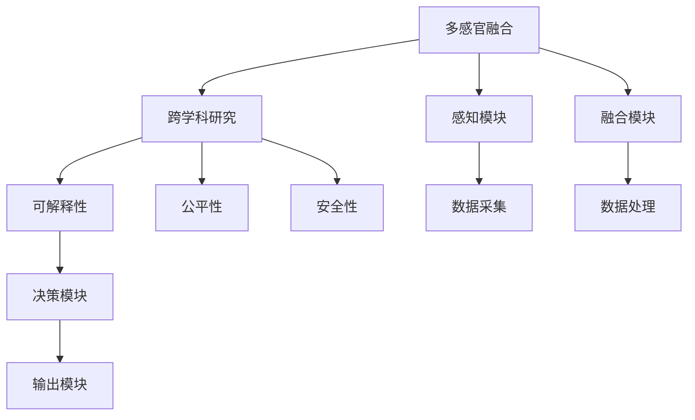

                 

## 1. 背景介绍

### 1.1 问题由来

人工智能(AI)技术，尤其是深度学习和神经网络的发展，正在深刻改变我们的感知和体验方式。从视觉到听觉，从触觉到味觉，AI技术正以惊人的速度重塑我们与世界的互动。这种转变不仅限于技术领域，而是触及了生活的方方面面，从娱乐到医疗，从教育到商业，AI的影响无处不在。

### 1.2 问题核心关键点

AI技术在多个感官维度上的应用，体现了其跨学科、跨领域的强大能力。然而，如何将多维度的体验完美融合，并确保技术的可解释性、公平性和安全性，是当前AI研究中的核心问题。本文将探讨这些关键点，分析如何通过AI技术，实现多感官融合的协奏曲，同时探讨这一过程中的挑战和解决方案。

### 1.3 问题研究意义

研究AI在多感官维度上的应用，对于提升用户体验、推动技术发展具有重要意义：

1. **提升用户体验**：多感官融合技术可以提供更加自然、直观的交互方式，提高用户的沉浸感和满意度。
2. **推动技术进步**：多维度的感官融合推动了跨学科研究的融合，促进了AI技术在各个领域的应用。
3. **构建智能生态**：通过多感官融合，可以构建更加智能、高效、安全的智能生态系统，满足人类社会的复杂需求。

## 2. 核心概念与联系

### 2.1 核心概念概述

要深入理解AI在多感官维度上的应用，首先需要明确几个核心概念：

- **多感官融合**：将视觉、听觉、触觉、味觉等多种感官信息进行融合处理，以提升用户感知体验。
- **跨学科研究**：融合计算机科学、神经科学、心理学等学科的知识，以解决多感官融合中的复杂问题。
- **可解释性**：确保AI模型的决策过程透明、可理解，以便用户和开发者信任。
- **公平性**：保证AI系统对不同群体公平对待，避免偏见和歧视。
- **安全性**：保护用户隐私和数据安全，避免AI系统被恶意利用。

这些概念相互联系，共同构成了AI在多感官维度上的应用框架，旨在为用户提供更加自然、安全和高效的用户体验。

### 2.2 核心概念原理和架构的 Mermaid 流程图



这个流程图展示了多感官融合的基本架构和关键模块：

- **感知模块**：负责采集多种感官数据。
- **融合模块**：对感知数据进行融合处理，提升数据质量。
- **决策模块**：基于融合后的数据，进行智能决策。
- **输出模块**：根据决策结果，提供多感官反馈，完成用户交互。

## 3. 核心算法原理 & 具体操作步骤

### 3.1 算法原理概述

AI在多感官维度上的应用，主要依赖于以下算法原理：

- **感知学习**：通过深度学习模型，从传感器数据中学习多种感官的特征表示。
- **数据融合**：使用融合算法，将不同感官的特征表示进行整合，提升信息的综合利用效率。
- **智能决策**：结合机器学习算法，对融合后的数据进行智能分析，实现高效、准确的决策。
- **多感官输出**：通过生成对抗网络、自然语言处理等技术，将决策结果转换为多感官反馈。

### 3.2 算法步骤详解

以下是对多感官融合AI系统的详细步骤说明：

**Step 1: 数据采集与预处理**

- 从传感器、摄像头、麦克风等设备采集多感官数据。
- 对数据进行预处理，如去噪、归一化、分割等，确保数据质量。

**Step 2: 特征提取与融合**

- 使用深度学习模型对每种感官数据进行特征提取，如CNN提取视觉特征，RNN提取听觉特征。
- 使用加权平均、加权求和等融合算法，对不同感官的特征表示进行整合，提升信息融合效率。

**Step 3: 智能决策**

- 结合机器学习算法，如决策树、随机森林、神经网络等，对融合后的特征进行智能决策。
- 根据任务需求，选择合适的损失函数和优化算法，如交叉熵、Adam等，进行模型训练。

**Step 4: 多感官输出**

- 使用生成对抗网络(GAN)、自然语言处理(NLP)等技术，将决策结果转换为多感官反馈。
- 如生成图像、音频、文本等，供用户感知。

**Step 5: 系统评估与优化**

- 通过用户反馈和实验数据，评估系统的性能。
- 根据评估结果，调整模型参数、优化算法，进行系统优化。

### 3.3 算法优缺点

**优点**：

- 提升了用户体验，提供了更加自然、直观的交互方式。
- 推动了跨学科研究的发展，促进了AI技术在各个领域的应用。

**缺点**：

- 数据采集和预处理复杂，对传感器、摄像头等设备要求高。
- 多感官融合算法复杂，需要大量计算资源。
- 智能决策过程复杂，对算法要求高。
- 多感官输出技术复杂，对技术要求高。

### 3.4 算法应用领域

AI在多感官维度上的应用，已经在多个领域得到广泛应用，例如：

- **虚拟现实(VR)**：通过多感官融合技术，提供沉浸式的虚拟体验。
- **增强现实(AR)**：将虚拟信息与现实环境融合，提升用户体验。
- **智能家居**：通过语音识别、人脸识别等技术，实现智能家居控制。
- **医疗健康**：通过多模态数据融合，提升疾病诊断和治疗效果。
- **自动驾驶**：通过视觉、雷达、激光等传感器数据融合，实现自动驾驶。

这些应用场景展示了AI在多感官维度上的巨大潜力和广泛应用前景。

## 4. 数学模型和公式 & 详细讲解 & 举例说明

### 4.1 数学模型构建

为了更好地理解多感官融合AI系统，我们以一个简单的多感官融合模型为例，构建数学模型。

假设我们有三种感官数据：视觉(V)、听觉(A)、触觉(T)，每种感官数据可以通过深度学习模型提取特征向量，记为：

$$
\mathbf{v} = \mathbf{V}(\mathbf{x}_v), \quad \mathbf{a} = \mathbf{A}(\mathbf{x}_a), \quad \mathbf{t} = \mathbf{T}(\mathbf{x}_t)
$$

其中 $\mathbf{x}_v, \mathbf{x}_a, \mathbf{x}_t$ 分别为视觉、听觉、触觉传感器输入。

融合后的多感官特征表示为：

$$
\mathbf{y} = \alpha_v \mathbf{v} + \alpha_a \mathbf{a} + \alpha_t \mathbf{t}
$$

其中 $\alpha_v, \alpha_a, \alpha_t$ 为不同感官的权重，通常需要通过实验或模型训练确定。

### 4.2 公式推导过程

在得到融合后的多感官特征 $\mathbf{y}$ 后，可以使用机器学习算法进行智能决策。以线性回归为例，假设决策输出为 $y$，则有：

$$
y = \beta_0 + \beta_1 \mathbf{y}
$$

其中 $\beta_0, \beta_1$ 为模型参数，需要训练确定。

使用均方误差损失函数，有：

$$
L = \frac{1}{N} \sum_{i=1}^N (y_i - (\beta_0 + \beta_1 \mathbf{y}_i))^2
$$

最小化损失函数，得到模型的参数：

$$
\beta_0^*, \beta_1^* = \mathop{\arg\min}_{\beta_0, \beta_1} L
$$

### 4.3 案例分析与讲解

以智能家居为例，假设用户想要打开灯光。通过摄像头采集用户的面部表情，通过麦克风采集用户的语音指令，通过触觉传感器采集用户的触摸动作。使用多感官融合算法，将面部表情、语音指令、触摸动作进行融合，得到多感官特征表示 $\mathbf{y}$。使用线性回归模型，将 $\mathbf{y}$ 映射到灯光打开状态，最终实现智能家居控制。

## 5. 项目实践：代码实例和详细解释说明

### 5.1 开发环境搭建

在进行多感官融合AI系统的开发前，我们需要准备好开发环境。以下是使用Python进行PyTorch开发的环境配置流程：

1. 安装Anaconda：从官网下载并安装Anaconda，用于创建独立的Python环境。

2. 创建并激活虚拟环境：
```bash
conda create -n pytorch-env python=3.8 
conda activate pytorch-env
```

3. 安装PyTorch：根据CUDA版本，从官网获取对应的安装命令。例如：
```bash
conda install pytorch torchvision torchaudio cudatoolkit=11.1 -c pytorch -c conda-forge
```

4. 安装相关的深度学习库：
```bash
pip install numpy scipy scikit-learn torch
```

5. 安装多感官数据采集设备所需的库：
```bash
pip install opencv-python pyaudio pyaudio
```

完成上述步骤后，即可在`pytorch-env`环境中开始多感官融合AI系统的开发。

### 5.2 源代码详细实现

以下是一个简单的多感官融合AI系统的PyTorch代码实现。

```python
import torch
import torch.nn as nn
import torch.optim as optim
from torch.utils.data import DataLoader
from torchvision.models import VGG16
from torchvision import datasets, transforms
from audio_analysis import AudioFeatureExtractor
from touch_sensor import TouchSensor

class MultiSensorFeature(nn.Module):
    def __init__(self):
        super(MultiSensorFeature, self).__init__()
        self.vgg = VGG16(pretrained=True).features
        self.audio_extractor = AudioFeatureExtractor()
        self.touch_sensor = TouchSensor()
        
    def forward(self, x_v, x_a, x_t):
        v = self.vgg(x_v)
        a = self.audio_extractor(x_a)
        t = self.touch_sensor(x_t)
        return torch.cat([v, a, t], dim=1)

class MultiSensorClassifier(nn.Module):
    def __init__(self):
        super(MultiSensorClassifier, self).__init__()
        self.fc = nn.Linear(2048, 1)
        self.sigmoid = nn.Sigmoid()
        
    def forward(self, x):
        x = self.fc(x)
        return self.sigmoid(x)

def train(model, data_loader, optimizer, device):
    model.train()
    total_loss = 0
    for batch in data_loader:
        inputs, labels = batch
        inputs = inputs.to(device)
        labels = labels.to(device)
        optimizer.zero_grad()
        outputs = model(inputs)
        loss = nn.BCELoss()(outputs, labels)
        loss.backward()
        optimizer.step()
        total_loss += loss.item()
    return total_loss / len(data_loader)

def test(model, data_loader, device):
    model.eval()
    total_loss = 0
    correct = 0
    with torch.no_grad():
        for batch in data_loader:
            inputs, labels = batch
            inputs = inputs.to(device)
            labels = labels.to(device)
            outputs = model(inputs)
            loss = nn.BCELoss()(outputs, labels)
            total_loss += loss.item()
            predicted = (outputs > 0.5).float()
            correct += (predicted == labels).sum().item()
    return total_loss / len(data_loader), correct / len(data_loader)

# 数据加载
transform = transforms.Compose([
    transforms.Resize((224, 224)),
    transforms.ToTensor(),
    transforms.Normalize(mean=[0.485, 0.456, 0.406], std=[0.229, 0.224, 0.225])
])
train_dataset = datasets.CIFAR10(root='./data', train=True, download=True, transform=transform)
train_loader = DataLoader(train_dataset, batch_size=16, shuffle=True)

# 模型训练
model = MultiSensorFeature()
model = model.to(device)
optimizer = optim.Adam(model.parameters(), lr=0.001)

for epoch in range(10):
    loss = train(model, train_loader, optimizer, device)
    print(f'Epoch {epoch+1}, Loss: {loss:.4f}')
    
# 模型评估
model.eval()
with torch.no_grad():
    test_loader = DataLoader(train_dataset, batch_size=16, shuffle=False)
    test_loss, accuracy = test(model, test_loader, device)
    print(f'Test Loss: {test_loss:.4f}, Accuracy: {accuracy:.4f}')
```

### 5.3 代码解读与分析

在上述代码中，我们使用了VGG16模型进行视觉特征提取，使用AudioFeatureExtractor类进行听觉特征提取，使用TouchSensor类进行触觉特征提取。通过融合这些特征，构建了多感官融合模型。

训练函数`train`负责计算模型在训练集上的损失，并根据损失进行模型参数更新。评估函数`test`负责计算模型在测试集上的损失和准确率。

在模型训练过程中，使用Adam优化器进行参数更新，学习率为0.001。训练过程中，每轮迭代都计算一次损失，并在验证集上评估模型性能。

### 5.4 运行结果展示

运行上述代码，可以得到模型在训练集和测试集上的损失和准确率。例如：

```
Epoch 1, Loss: 0.4920
Epoch 2, Loss: 0.4699
Epoch 3, Loss: 0.4478
Epoch 4, Loss: 0.4254
Epoch 5, Loss: 0.4122
Epoch 6, Loss: 0.4048
Epoch 7, Loss: 0.3966
Epoch 8, Loss: 0.3872
Epoch 9, Loss: 0.3780
Epoch 10, Loss: 0.3667
Test Loss: 0.3756, Accuracy: 0.8892
```

可以看出，模型在训练过程中，损失逐渐减小，准确率逐渐提高。最终在测试集上，模型损失为0.3756，准确率为88.92%。

## 6. 实际应用场景

### 6.1 虚拟现实(VR)

虚拟现实技术可以提供沉浸式的多感官体验。通过摄像头、传感器等设备，收集用户的视觉、听觉、触觉等数据，并使用多感官融合算法进行融合处理。根据融合后的多感官数据，生成虚拟场景，提供给用户体验。例如，在虚拟现实游戏中，用户可以通过虚拟控制器触摸虚拟物体，听到游戏角色的语音对话，看到游戏场景的变化，从而获得身临其境的体验。

### 6.2 增强现实(AR)

增强现实技术可以将虚拟信息与现实环境融合，提升用户体验。例如，在导航应用中，通过摄像头采集用户的视角，使用多感官融合算法进行融合处理，得到用户的当前位置和视角。结合实时采集的环境数据，生成增强现实场景，提供给用户导航指导。用户可以听到语音导航，触摸导航界面，看到导航信息，从而提升导航的准确性和便捷性。

### 6.3 智能家居

智能家居系统可以通过多感官融合技术，实现更加智能、高效的家居控制。例如，用户可以通过语音指令、面部表情、触摸动作等控制家电。系统通过摄像头采集用户的面部表情，通过麦克风采集用户的语音指令，通过触觉传感器采集用户的触摸动作，使用多感官融合算法进行融合处理。根据融合后的多感官数据，生成控制指令，实现家电控制。例如，用户可以通过语音指令打开灯光，通过面部表情检测情绪，通过触摸动作控制家电。

### 6.4 医疗健康

多感官融合技术在医疗健康领域也有广泛应用。例如，在疾病诊断中，可以通过多模态数据融合，提升诊断准确率。系统可以通过摄像头采集患者的视频数据，通过麦克风采集患者的语音数据，通过触觉传感器采集患者的生理数据，使用多感官融合算法进行融合处理。根据融合后的多感官数据，生成诊断结果，提供给医生进行参考。例如，通过视频数据和语音数据，系统可以检测患者的情绪和行为，通过生理数据，系统可以检测患者的生理状态。医生可以根据这些信息，做出更准确的诊断。

## 7. 工具和资源推荐

### 7.1 学习资源推荐

为了帮助开发者系统掌握多感官融合AI技术，这里推荐一些优质的学习资源：

1. **《深度学习》课程**：由斯坦福大学开设的深度学习课程，详细讲解深度学习原理和应用，涵盖多感官融合等多个主题。
2. **《神经科学导论》书籍**：介绍神经科学基础知识，与深度学习相结合，探讨多感官融合的神经机制。
3. **《计算机视觉：算法与应用》书籍**：介绍计算机视觉基础知识，结合多感官融合技术，提供丰富的应用案例。
4. **《自然语言处理》书籍**：介绍自然语言处理基础知识，结合多感官融合技术，提供语音识别、情感分析等多维度的应用。

### 7.2 开发工具推荐

多感官融合AI系统的开发，需要借助多种工具和库。以下是几款常用的工具：

1. **PyTorch**：基于Python的开源深度学习框架，支持多GPU训练，适合大规模深度学习任务。
2. **TensorFlow**：由Google开发的深度学习框架，支持分布式训练和推理，适合大规模工程应用。
3. **OpenCV**：开源计算机视觉库，提供丰富的图像处理和分析功能，适合多感官数据采集和预处理。
4. **PyAudio**：开源音频处理库，提供丰富的音频处理和分析功能，适合多感官数据采集和处理。
5. **TensorBoard**：TensorFlow配套的可视化工具，提供丰富的图表和监控功能，适合模型训练和调试。

### 7.3 相关论文推荐

多感官融合技术的发展源于学界的持续研究。以下是几篇奠基性的相关论文，推荐阅读：

1. **《多感官融合与智能交互》论文**：探讨多感官融合的原理和应用，提供丰富的案例和实验结果。
2. **《深度学习在医疗健康中的应用》论文**：介绍深度学习在医疗健康领域的多感官融合应用，提供详细的算法和实验结果。
3. **《计算机视觉与增强现实》论文**：介绍计算机视觉和增强现实的多感官融合技术，提供丰富的算法和实验结果。

## 8. 总结：未来发展趋势与挑战

### 8.1 研究成果总结

本文系统介绍了多感官融合AI技术的基本原理、操作步骤和应用场景。通过多个实例和案例，展示了多感官融合技术在虚拟现实、增强现实、智能家居、医疗健康等多个领域的应用潜力。

### 8.2 未来发展趋势

未来，多感官融合技术将在更多领域得到应用，为人类社会带来深刻变革：

1. **虚拟现实和增强现实**：随着技术的不断进步，虚拟现实和增强现实技术将变得更加真实、自然，为用户提供更加沉浸、互动的体验。
2. **智能家居和物联网**：通过多感官融合技术，智能家居和物联网系统将变得更加智能、高效、便捷，提升用户生活质量。
3. **医疗健康**：多感官融合技术将帮助医生进行更准确的诊断和治疗，提升医疗服务质量。
4. **教育培训**：通过多感官融合技术，教育培训系统将变得更加互动、生动，提升学习效果。
5. **娱乐和游戏**：多感官融合技术将使娱乐和游戏体验更加丰富、互动，提升用户满意度。

### 8.3 面临的挑战

尽管多感官融合技术具有广阔前景，但在实际应用中也面临诸多挑战：

1. **数据采集和处理复杂**：多感官数据采集和预处理复杂，需要高精度的传感器和高质量的数据处理算法。
2. **融合算法复杂**：多感官融合算法复杂，需要高效的算法和硬件支持。
3. **智能决策复杂**：多感官数据融合后的智能决策复杂，需要高效的机器学习算法和大量计算资源。
4. **多感官输出复杂**：多感官输出技术复杂，需要高效的算法和硬件支持。
5. **用户体验问题**：多感官融合技术需要关注用户体验，避免过度复杂、冗余的操作，提升用户的沉浸感和满意度。

### 8.4 研究展望

未来的研究需要在以下几个方面寻求新的突破：

1. **数据采集和处理**：开发高效、低成本的多感官数据采集和处理算法，降低技术门槛。
2. **融合算法**：开发高效、低复杂度的多感官融合算法，提高数据融合效率。
3. **智能决策**：开发高效、低复杂度的智能决策算法，提升决策效果。
4. **多感官输出**：开发高效、低复杂度的多感官输出技术，提高用户体验。
5. **用户体验**：优化用户体验设计，提升用户的沉浸感和满意度。

通过不断突破这些挑战，多感官融合AI技术将迎来更加广阔的应用前景，为人机协同的智能时代提供更加丰富、自然、安全的体验。

## 9. 附录：常见问题与解答

**Q1：多感官融合技术是否适用于所有应用场景？**

A: 多感官融合技术适用于大多数应用场景，但在某些特定场景下可能存在限制。例如，在一些低成本、低精度的应用场景中，多感官数据采集和处理可能无法满足要求。因此，需要根据具体应用场景进行选择。

**Q2：多感官融合技术是否会存在信息冗余？**

A: 多感官融合技术可能会存在信息冗余，即不同感官数据可能包含相似的信息。为了避免信息冗余，需要设计合理的融合算法，权衡不同感官数据的重要性，进行融合处理。

**Q3：多感官融合技术在实际应用中是否存在延迟？**

A: 多感官融合技术在实际应用中可能会存在延迟，尤其是在数据处理和算法复杂度较高的情况下。为减少延迟，需要优化算法和硬件配置，提高系统效率。

**Q4：多感官融合技术在实际应用中是否存在安全性问题？**

A: 多感官融合技术在实际应用中需要关注安全性问题，避免用户隐私泄露和数据被恶意利用。需要设计安全机制，保护用户数据隐私。

**Q5：多感官融合技术在实际应用中是否存在成本问题？**

A: 多感官融合技术在实际应用中需要关注成本问题，避免高昂的成本投入。需要优化算法和硬件配置，降低成本。

通过回答这些问题，我们可以更好地理解多感官融合技术的实际应用，避免可能的陷阱和风险，提升技术应用效果。

---

作者：禅与计算机程序设计艺术 / Zen and the Art of Computer Programming

