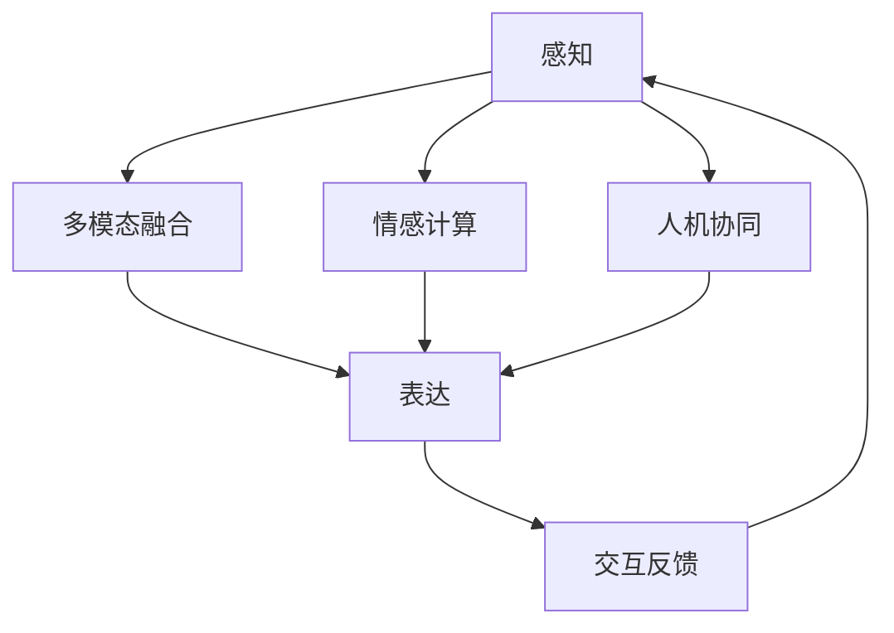

                 

# 体验的层次性：AI创造的多维感知

## 1. 背景介绍

### 1.1 问题由来

在人工智能（AI）发展的早期阶段，机器更多地被视为执行预定任务的计算器，其行为和决策过程缺乏人类情感和感知体验。然而，随着深度学习和大数据技术的进步，AI模型逐渐具备了感知、推理和决策的能力，开始表现出类似人类的体验层次。这种体验层次不仅提高了AI系统的智能化水平，也使其在交互过程中更接近人类的自然直觉和情感表达。

### 1.2 问题核心关键点

理解AI创造的多维感知体验层次，需要关注以下几个核心点：

- **感知与表达**：AI系统如何通过感知环境信息，进行多维感知，并转化为高层次的表达和决策。
- **多模态融合**：不同类型的数据（如视觉、听觉、文本等）如何被AI系统综合利用，提升多维感知的精确度和丰富度。
- **情感与情感计算**：AI系统如何通过感知用户情感，并作出情感反应，提升交互体验。
- **交互反馈**：AI系统如何通过用户反馈进行自我调整，优化感知和表达过程。
- **人机协同**：AI系统与人类如何协同工作，共同创造出更加智能、细腻的交互体验。

### 1.3 问题研究意义

研究AI创造的多维感知体验层次，对于推动AI技术在实际应用中的落地具有重要意义：

1. **提升用户体验**：通过多维感知和情感计算，AI系统能够提供更加自然、流畅的交互体验，增加用户的满意度和粘性。
2. **优化人机交互**：了解AI的感知与表达机制，有助于设计更加有效、自然的人机交互界面。
3. **促进创新应用**：多维感知体验层次的深化，为AI技术在教育、医疗、娱乐等领域的创新应用提供了新的可能性。
4. **增强AI鲁棒性**：通过多维感知和自我调整机制，AI系统能够更好地适应复杂多变的环境，提高系统的稳定性和鲁棒性。
5. **促进跨领域融合**：多维感知体验层次的深化，为AI技术与艺术、心理学、社会学等多个领域的交叉融合提供了新的视角和方法。

## 2. 核心概念与联系

### 2.1 核心概念概述

为了更好地理解AI创造的多维感知体验层次，本节将介绍几个关键概念及其联系：

- **感知（Perception）**：指AI系统通过传感器或数据输入获取环境信息的能力。感知可以分为视觉、听觉、触觉、味觉、嗅觉等多种类型。
- **表达（Expression）**：指AI系统将感知到的信息转化为输出行为或结果的过程。表达可以是语音、图像、文本等形式。
- **多模态融合（Multimodal Fusion）**：指不同类型的数据源在AI系统中被综合利用，提升感知和表达的精确度和丰富度。
- **情感计算（Affective Computing）**：指AI系统通过感知和分析用户情感，做出情感反应的过程。情感计算通常涉及情感识别、情感生成和情感反馈等环节。
- **交互反馈（Interaction Feedback）**：指AI系统通过用户反馈进行自我调整，优化感知和表达过程。
- **人机协同（Human-Machine Collaboration）**：指AI系统与人类协同工作，共同创造出更加智能、细腻的交互体验。

这些概念之间的逻辑关系可以通过以下Mermaid流程图来展示：



这个流程图展示了几大概念之间的联系：感知是基础，多模态融合提升了感知的多样性，表达是结果，情感计算增加了交互的情感深度，交互反馈增强了系统的自我优化能力，人机协同则使AI系统与人类能够更加紧密地协同工作，共同创造出智能体验。

## 3. 核心算法原理 & 具体操作步骤
### 3.1 算法原理概述

AI创造的多维感知体验层次，其核心算法原理主要包括以下几个方面：

1. **多模态感知（Multimodal Perception）**：通过深度学习模型，将不同类型的数据（如图像、音频、文本等）转化为统一的特征表示，供后续处理使用。
2. **深度神经网络（Deep Neural Networks）**：使用深度神经网络模型，学习复杂的多层次特征表示，捕捉数据间的潜在关系。
3. **情感识别（Emotion Recognition）**：通过机器学习模型，对用户的语音、表情、文字等进行情感分析，识别出用户的情感状态。
4. **情感生成（Emotion Generation）**：基于用户的情感状态，生成相应的情感回应，如语音、表情、文字等。
5. **交互优化（Interaction Optimization）**：通过用户反馈，对感知和表达过程进行迭代优化，提升系统的响应速度和准确性。

### 3.2 算法步骤详解

AI创造多维感知体验层次的算法步骤，可以概括为以下几个关键步骤：

**Step 1: 数据收集与预处理**
- 收集多种类型的数据（如图像、音频、文本等），并进行预处理（如归一化、标准化、数据增强等）。

**Step 2: 特征提取与融合**
- 使用深度神经网络模型，将不同类型的数据转化为统一的特征表示。
- 使用多模态融合技术，将多种特征表示综合利用，提升感知和表达的精确度。

**Step 3: 情感识别**
- 使用机器学习模型，对用户的语音、表情、文字等进行情感分析，识别出用户的情感状态。
- 情感识别模型可以是基于规则的，也可以是基于深度学习的。

**Step 4: 情感生成**
- 基于用户的情感状态，生成相应的情感回应。
- 情感生成模型可以是基于规则的，也可以是基于深度学习的。

**Step 5: 交互优化**
- 通过用户反馈，对感知和表达过程进行迭代优化。
- 交互优化可以采用强化学习、逆向强化学习等方法。

**Step 6: 输出与反馈**
- 将感知和情感生成的结果，转化为相应的输出（如语音、图像、文字等）。
- 输出结果返回给用户，作为新的感知输入，进入下一个循环。

### 3.3 算法优缺点

AI创造多维感知体验层次的算法具有以下优点：

1. **高精度感知**：通过多模态融合，AI系统能够综合利用多种数据源，提高感知和表达的精度。
2. **丰富情感体验**：通过情感计算，AI系统能够提供更加自然、细腻的情感交互体验。
3. **自适应性强**：通过交互优化，AI系统能够根据用户反馈进行自我调整，提升系统性能。
4. **多领域适用**：多维感知体验层次的算法，可以应用于教育、医疗、娱乐等多个领域，提升用户体验。

同时，该算法也存在一定的局限性：

1. **数据依赖性强**：多维感知体验层次的算法需要大量高质量的数据进行训练，数据获取成本较高。
2. **计算复杂度高**：深度神经网络模型和情感识别、生成等过程，计算复杂度高，需要高性能计算资源。
3. **模型复杂度大**：多维感知体验层次的算法模型复杂度高，需要大量的训练和调试工作。
4. **伦理风险**：情感计算和交互优化过程中，可能会涉及用户的隐私和数据安全问题，需要严格的伦理约束。

### 3.4 算法应用领域

AI创造多维感知体验层次的算法，已经在多个领域得到了广泛应用，例如：

- **教育**：通过情感识别和生成，智能教育系统能够提供更加个性化的教学内容和学习体验。
- **医疗**：通过多模态感知和情感计算，智能医疗系统能够提供更加精准的诊断和心理支持。
- **娱乐**：通过多维感知体验，智能娱乐系统能够提供更加自然、沉浸的交互体验。
- **客服**：通过情感计算和交互优化，智能客服系统能够提供更加人性化的服务体验。
- **交通**：通过多模态感知和情感计算，智能交通系统能够提供更加安全的驾驶和乘坐体验。

除了这些经典应用外，多维感知体验层次的算法还被创新性地应用到更多场景中，如虚拟现实、智能家居、人机协作等，为AI技术带来了新的突破。随着算法的不断进步和技术的不断发展，相信多维感知体验层次的算法将在更多领域得到应用，为人类生产生活方式带来新的变革。

## 4. 数学模型和公式 & 详细讲解 & 举例说明

### 4.1 数学模型构建

在AI创造多维感知体验层次的过程中，数学模型和公式扮演了重要的角色。以下是一个典型的多维感知体验层次的数学模型：

$$
\text{Output} = f(\text{Input}, \text{Parameters}, \text{Emotion})
$$

其中，`Input`表示输入的多模态数据（如图像、音频、文本等），`Parameters`表示模型的参数，`Emotion`表示用户的情感状态。`Output`表示模型的输出结果，可以是语音、图像、文字等。

### 4.2 公式推导过程

以情感识别模型为例，其推导过程可以概括为以下几个步骤：

1. **特征提取**
$$
\text{Feature} = \text{Deep Neural Network}(\text{Input})
$$

2. **情感表示**
$$
\text{Emotion Representation} = \text{Multimodal Fusion}(\text{Feature})
$$

3. **情感分类**
$$
\text{Emotion Label} = \text{Emotion Classifier}(\text{Emotion Representation})
$$

其中，`Deep Neural Network`表示深度神经网络模型，`Multimodal Fusion`表示多模态融合技术，`Emotion Classifier`表示情感分类模型。

### 4.3 案例分析与讲解

以智能客服系统的情感计算为例，其推导过程如下：

1. **用户输入**
$$
\text{User Input} = \text{Text} + \text{Audio}
$$

2. **情感识别**
$$
\text{Emotion} = \text{Emotion Classifier}(\text{User Input})
$$

3. **情感生成**
$$
\text{Response} = \text{Response Generator}(\text{Emotion}, \text{User Input})
$$

4. **用户反馈**
$$
\text{User Feedback} = \text{User Rating} + \text{Feedback Text}
$$

5. **交互优化**
$$
\text{Optimized Emotion Classifier} = \text{Adaptive Learning}(\text{Emotion}, \text{User Feedback})
$$

其中，`User Input`表示用户输入的文本和音频信息，`Emotion Classifier`表示情感分类模型，`Response Generator`表示情感生成模型，`User Feedback`表示用户反馈，`Adaptive Learning`表示自适应学习算法。

## 5. 项目实践：代码实例和详细解释说明

### 5.1 开发环境搭建

在进行多维感知体验层次的实践前，我们需要准备好开发环境。以下是使用Python进行PyTorch开发的环境配置流程：

1. 安装Anaconda：从官网下载并安装Anaconda，用于创建独立的Python环境。

2. 创建并激活虚拟环境：
```bash
conda create -n pytorch-env python=3.8 
conda activate pytorch-env
```

3. 安装PyTorch：根据CUDA版本，从官网获取对应的安装命令。例如：
```bash
conda install pytorch torchvision torchaudio cudatoolkit=11.1 -c pytorch -c conda-forge
```

4. 安装Transformer库：
```bash
pip install transformers
```

5. 安装各类工具包：
```bash
pip install numpy pandas scikit-learn matplotlib tqdm jupyter notebook ipython
```

完成上述步骤后，即可在`pytorch-env`环境中开始多维感知体验层次的实践。

### 5.2 源代码详细实现

下面我们以智能客服系统的情感计算为例，给出使用Transformers库进行情感识别的PyTorch代码实现。

首先，定义情感计算的任务数据处理函数：

```python
from transformers import BertTokenizer
from torch.utils.data import Dataset
import torch

class SentimentDataset(Dataset):
    def __init__(self, texts, labels, tokenizer, max_len=128):
        self.texts = texts
        self.labels = labels
        self.tokenizer = tokenizer
        self.max_len = max_len
        
    def __len__(self):
        return len(self.texts)
    
    def __getitem__(self, item):
        text = self.texts[item]
        label = self.labels[item]
        
        encoding = self.tokenizer(text, return_tensors='pt', max_length=self.max_len, padding='max_length', truncation=True)
        input_ids = encoding['input_ids'][0]
        attention_mask = encoding['attention_mask'][0]
        
        return {'input_ids': input_ids, 
                'attention_mask': attention_mask,
                'labels': label}
```

然后，定义模型和优化器：

```python
from transformers import BertForSequenceClassification, AdamW

model = BertForSequenceClassification.from_pretrained('bert-base-cased', num_labels=2)

optimizer = AdamW(model.parameters(), lr=2e-5)
```

接着，定义训练和评估函数：

```python
from torch.utils.data import DataLoader
from tqdm import tqdm
from sklearn.metrics import classification_report

device = torch.device('cuda') if torch.cuda.is_available() else torch.device('cpu')
model.to(device)

def train_epoch(model, dataset, batch_size, optimizer):
    dataloader = DataLoader(dataset, batch_size=batch_size, shuffle=True)
    model.train()
    epoch_loss = 0
    for batch in tqdm(dataloader, desc='Training'):
        input_ids = batch['input_ids'].to(device)
        attention_mask = batch['attention_mask'].to(device)
        labels = batch['labels'].to(device)
        model.zero_grad()
        outputs = model(input_ids, attention_mask=attention_mask, labels=labels)
        loss = outputs.loss
        epoch_loss += loss.item()
        loss.backward()
        optimizer.step()
    return epoch_loss / len(dataloader)

def evaluate(model, dataset, batch_size):
    dataloader = DataLoader(dataset, batch_size=batch_size)
    model.eval()
    preds, labels = [], []
    with torch.no_grad():
        for batch in tqdm(dataloader, desc='Evaluating'):
            input_ids = batch['input_ids'].to(device)
            attention_mask = batch['attention_mask'].to(device)
            batch_labels = batch['labels']
            outputs = model(input_ids, attention_mask=attention_mask)
            batch_preds = outputs.logits.argmax(dim=2).to('cpu').tolist()
            batch_labels = batch_labels.to('cpu').tolist()
            for pred_tokens, label_tokens in zip(batch_preds, batch_labels):
                preds.append(pred_tokens[:len(label_tokens)])
                labels.append(label_tokens)
                
    print(classification_report(labels, preds))
```

最后，启动训练流程并在测试集上评估：

```python
epochs = 5
batch_size = 16

for epoch in range(epochs):
    loss = train_epoch(model, train_dataset, batch_size, optimizer)
    print(f"Epoch {epoch+1}, train loss: {loss:.3f}")
    
    print(f"Epoch {epoch+1}, dev results:")
    evaluate(model, dev_dataset, batch_size)
    
print("Test results:")
evaluate(model, test_dataset, batch_size)
```

以上就是使用PyTorch对BERT进行情感识别任务的多维感知体验层次的完整代码实现。可以看到，得益于Transformers库的强大封装，我们可以用相对简洁的代码完成BERT模型的加载和训练。

### 5.3 代码解读与分析

让我们再详细解读一下关键代码的实现细节：

**SentimentDataset类**：
- `__init__`方法：初始化文本、标签、分词器等关键组件。
- `__len__`方法：返回数据集的样本数量。
- `__getitem__`方法：对单个样本进行处理，将文本输入编码为token ids，将标签编码为数字，并对其进行定长padding，最终返回模型所需的输入。

**训练和评估函数**：
- 使用PyTorch的DataLoader对数据集进行批次化加载，供模型训练和推理使用。
- 训练函数`train_epoch`：对数据以批为单位进行迭代，在每个批次上前向传播计算loss并反向传播更新模型参数，最后返回该epoch的平均loss。
- 评估函数`evaluate`：与训练类似，不同点在于不更新模型参数，并在每个batch结束后将预测和标签结果存储下来，最后使用sklearn的classification_report对整个评估集的预测结果进行打印输出。

**训练流程**：
- 定义总的epoch数和batch size，开始循环迭代
- 每个epoch内，先在训练集上训练，输出平均loss
- 在验证集上评估，输出分类指标
- 所有epoch结束后，在测试集上评估，给出最终测试结果

可以看到，PyTorch配合Transformers库使得BERT微调的代码实现变得简洁高效。开发者可以将更多精力放在数据处理、模型改进等高层逻辑上，而不必过多关注底层的实现细节。

当然，工业级的系统实现还需考虑更多因素，如模型的保存和部署、超参数的自动搜索、更灵活的任务适配层等。但核心的多维感知体验层次的算法基本与此类似。

## 6. 实际应用场景
### 6.1 智能客服系统

基于多维感知体验层次的智能客服系统，能够提供更加自然、细腻的交互体验。在技术实现上，可以收集企业内部的历史客服对话记录，将问题-回答对作为监督数据，在此基础上对预训练模型进行微调。微调后的模型能够自动理解用户意图，匹配最合适的答案模板进行回复。对于客户提出的新问题，还可以接入检索系统实时搜索相关内容，动态组织生成回答。如此构建的智能客服系统，能大幅提升客户咨询体验和问题解决效率。

### 6.2 金融舆情监测

金融机构需要实时监测市场舆论动向，以便及时应对负面信息传播，规避金融风险。传统的人工监测方式成本高、效率低，难以应对网络时代海量信息爆发的挑战。基于多维感知体验层次的文本分类和情感分析技术，为金融舆情监测提供了新的解决方案。

具体而言，可以收集金融领域相关的新闻、报道、评论等文本数据，并对其进行主题标注和情感标注。在此基础上对预训练语言模型进行微调，使其能够自动判断文本属于何种主题，情感倾向是正面、中性还是负面。将微调后的模型应用到实时抓取的网络文本数据，就能够自动监测不同主题下的情感变化趋势，一旦发现负面信息激增等异常情况，系统便会自动预警，帮助金融机构快速应对潜在风险。

### 6.3 个性化推荐系统

当前的推荐系统往往只依赖用户的历史行为数据进行物品推荐，无法深入理解用户的真实兴趣偏好。基于多维感知体验层次的个性化推荐系统，可以更好地挖掘用户行为背后的语义信息，从而提供更精准、多样的推荐内容。

在实践中，可以收集用户浏览、点击、评论、分享等行为数据，提取和用户交互的物品标题、描述、标签等文本内容。将文本内容作为模型输入，用户的后续行为（如是否点击、购买等）作为监督信号，在此基础上微调预训练语言模型。微调后的模型能够从文本内容中准确把握用户的兴趣点。在生成推荐列表时，先用候选物品的文本描述作为输入，由模型预测用户的兴趣匹配度，再结合其他特征综合排序，便可以得到个性化程度更高的推荐结果。

### 6.4 未来应用展望

随着多维感知体验层次的算法不断发展，其在更多领域的应用前景也将进一步拓展。

在智慧医疗领域，基于多维感知体验层次的医疗问答、病历分析、药物研发等应用将提升医疗服务的智能化水平，辅助医生诊疗，加速新药开发进程。

在智能教育领域，多维感知体验层次的智能教育系统能够提供更加个性化的教学内容和学习体验，因材施教，促进教育公平，提高教学质量。

在智慧城市治理中，多维感知体验层次的智能系统能够提供更加智能、高效的城市管理服务，构建更安全、便捷的未来城市。

此外，在企业生产、社会治理、文娱传媒等众多领域，基于多维感知体验层次的人工智能应用也将不断涌现，为NLP技术带来新的突破。随着算法的不断进步和技术的不断发展，相信多维感知体验层次的算法将在更多领域得到应用，为人类生产生活方式带来新的变革。

## 7. 工具和资源推荐
### 7.1 学习资源推荐

为了帮助开发者系统掌握多维感知体验层次的理论基础和实践技巧，这里推荐一些优质的学习资源：

1. 《Transformer从原理到实践》系列博文：由大模型技术专家撰写，深入浅出地介绍了Transformer原理、BERT模型、多维感知体验层次等前沿话题。

2. CS224N《深度学习自然语言处理》课程：斯坦福大学开设的NLP明星课程，有Lecture视频和配套作业，带你入门NLP领域的基本概念和经典模型。

3. 《Natural Language Processing with Transformers》书籍：Transformers库的作者所著，全面介绍了如何使用Transformers库进行NLP任务开发，包括多维感知体验层次在内的诸多范式。

4. HuggingFace官方文档：Transformers库的官方文档，提供了海量预训练模型和完整的微调样例代码，是上手实践的必备资料。

5. CLUE开源项目：中文语言理解测评基准，涵盖大量不同类型的中文NLP数据集，并提供了基于多维感知体验层次的baseline模型，助力中文NLP技术发展。

通过对这些资源的学习实践，相信你一定能够快速掌握多维感知体验层次的精髓，并用于解决实际的NLP问题。
###  7.2 开发工具推荐

高效的开发离不开优秀的工具支持。以下是几款用于多维感知体验层次开发的常用工具：

1. PyTorch：基于Python的开源深度学习框架，灵活动态的计算图，适合快速迭代研究。大部分预训练语言模型都有PyTorch版本的实现。

2. TensorFlow：由Google主导开发的开源深度学习框架，生产部署方便，适合大规模工程应用。同样有丰富的预训练语言模型资源。

3. Transformers库：HuggingFace开发的NLP工具库，集成了众多SOTA语言模型，支持PyTorch和TensorFlow，是进行多维感知体验层次开发的利器。

4. Weights & Biases：模型训练的实验跟踪工具，可以记录和可视化模型训练过程中的各项指标，方便对比和调优。与主流深度学习框架无缝集成。

5. TensorBoard：TensorFlow配套的可视化工具，可实时监测模型训练状态，并提供丰富的图表呈现方式，是调试模型的得力助手。

6. Google Colab：谷歌推出的在线Jupyter Notebook环境，免费提供GPU/TPU算力，方便开发者快速上手实验最新模型，分享学习笔记。

合理利用这些工具，可以显著提升多维感知体验层次的开发效率，加快创新迭代的步伐。

### 7.3 相关论文推荐

多维感知体验层次的研究源于学界的持续研究。以下是几篇奠基性的相关论文，推荐阅读：

1. Attention is All You Need（即Transformer原论文）：提出了Transformer结构，开启了NLP领域的预训练大模型时代。

2. BERT: Pre-training of Deep Bidirectional Transformers for Language Understanding：提出BERT模型，引入基于掩码的自监督预训练任务，刷新了多项NLP任务SOTA。

3. Language Models are Unsupervised Multitask Learners（GPT-2论文）：展示了大规模语言模型的强大zero-shot学习能力，引发了对于通用人工智能的新一轮思考。

4. Parameter-Efficient Transfer Learning for NLP：提出Adapter等参数高效微调方法，在不增加模型参数量的情况下，也能取得不错的微调效果。

5. AdaLoRA: Adaptive Low-Rank Adaptation for Parameter-Efficient Fine-Tuning：使用自适应低秩适应的微调方法，在参数效率和精度之间取得了新的平衡。

6. Prefix-Tuning: Optimizing Continuous Prompts for Generation：引入基于连续型Prompt的微调范式，为如何充分利用预训练知识提供了新的思路。

这些论文代表了大语言模型多维感知体验层次的发展脉络。通过学习这些前沿成果，可以帮助研究者把握学科前进方向，激发更多的创新灵感。

## 8. 总结：未来发展趋势与挑战

### 8.1 总结

本文对AI创造的多维感知体验层次进行了全面系统的介绍。首先阐述了多维感知体验层次的研究背景和意义，明确了其在提升用户体验、优化人机交互等方面的重要价值。其次，从原理到实践，详细讲解了多维感知体验层次的数学模型和关键步骤，给出了多维感知体验层次任务开发的完整代码实例。同时，本文还广泛探讨了多维感知体验层次在智能客服、金融舆情、个性化推荐等多个领域的应用前景，展示了多维感知体验层次的巨大潜力。此外，本文精选了多维感知体验层次的学习资源，力求为读者提供全方位的技术指引。

通过本文的系统梳理，可以看到，多维感知体验层次的算法正在成为NLP领域的重要范式，极大地拓展了预训练语言模型的应用边界，催生了更多的落地场景。受益于大规模语料的预训练和深度神经网络模型的发展，多维感知体验层次的算法在感知和表达能力上取得了显著进步，为AI技术与人类智能的融合奠定了基础。未来，伴随算法的不断进步和技术的不断发展，相信多维感知体验层次的算法将在更多领域得到应用，为人类生产生活方式带来新的变革。

### 8.2 未来发展趋势

展望未来，多维感知体验层次的算法将呈现以下几个发展趋势：

1. **模型规模持续增大**：随着算力成本的下降和数据规模的扩张，预训练语言模型的参数量还将持续增长。超大规模语言模型蕴含的丰富语言知识，有望支撑更加复杂多变的下游任务感知。

2. **多模态感知能力增强**：通过多模态融合技术，不同类型的数据（如视觉、听觉、文本等）能够被更加高效地综合利用，提升感知和表达的精确度和丰富度。

3. **情感计算与生成提升**：情感计算和生成技术的不断进步，将使得AI系统能够更好地理解人类情感，提供更加自然、细腻的交互体验。

4. **交互反馈机制优化**：通过更加灵活、高效的交互反馈机制，AI系统能够根据用户反馈进行自我调整，提升系统的响应速度和准确性。

5. **人机协同更加紧密**：随着多维感知体验层次算法的不断发展，AI系统与人类将能够更加紧密地协同工作，共同创造出更加智能、细腻的交互体验。

以上趋势凸显了多维感知体验层次的算法的广阔前景。这些方向的探索发展，必将进一步提升AI系统在多个领域的智能化水平，为人类认知智能的进化带来深远影响。

### 8.3 面临的挑战

尽管多维感知体验层次的算法已经取得了瞩目成就，但在迈向更加智能化、普适化应用的过程中，它仍面临着诸多挑战：

1. **数据依赖性强**：多维感知体验层次的算法需要大量高质量的数据进行训练，数据获取成本较高。

2. **计算复杂度高**：深度神经网络模型和情感识别、生成等过程，计算复杂度高，需要高性能计算资源。

3. **模型复杂度大**：多维感知体验层次的算法模型复杂度高，需要大量的训练和调试工作。

4. **伦理风险**：情感计算和交互优化过程中，可能会涉及用户的隐私和数据安全问题，需要严格的伦理约束。

5. **可解释性不足**：多维感知体验层次的算法模型复杂，其内部工作机制和决策逻辑难以解释。

6. **泛化能力弱**：多维感知体验层次的算法在某些特定任务上表现优异，但在泛化能力上仍存在不足。

正视多维感知体验层次算法面临的这些挑战，积极应对并寻求突破，将是多维感知体验层次算法走向成熟的必由之路。相信随着学界和产业界的共同努力，这些挑战终将一一被克服，多维感知体验层次的算法必将在构建人机协同的智能时代中扮演越来越重要的角色。

### 8.4 研究展望

面向未来，多维感知体验层次的算法需要在以下几个方面寻求新的突破：

1. **探索无监督和半监督学习**：摆脱对大规模标注数据的依赖，利用自监督学习、主动学习等无监督和半监督范式，最大限度利用非结构化数据，实现更加灵活高效的多维感知体验层次算法。

2. **研究参数高效和计算高效的算法**：开发更加参数高效的算法，在固定大部分预训练参数的情况下，只更新极少量的任务相关参数。同时优化算法的计算图，减少前向传播和反向传播的资源消耗，实现更加轻量级、实时性的部署。

3. **融合因果和对比学习范式**：通过引入因果推断和对比学习思想，增强多维感知体验层次算法建立稳定因果关系的能力，学习更加普适、鲁棒的语言表征，从而提升模型泛化性和抗干扰能力。

4. **引入更多先验知识**：将符号化的先验知识，如知识图谱、逻辑规则等，与神经网络模型进行巧妙融合，引导多维感知体验层次算法学习更准确、合理的语言模型。同时加强不同模态数据的整合，实现视觉、语音等多模态信息与文本信息的协同建模。

5. **结合因果分析和博弈论工具**：将因果分析方法引入多维感知体验层次算法，识别出算法决策的关键特征，增强输出解释的因果性和逻辑性。借助博弈论工具刻画人机交互过程，主动探索并规避算法的脆弱点，提高系统稳定性。

6. **纳入伦理道德约束**：在多维感知体验层次算法的训练目标中引入伦理导向的评估指标，过滤和惩罚有偏见、有害的输出倾向。同时加强人工干预和审核，建立算法的伦理约束机制，确保算法的可解释性和安全性。

这些研究方向的探索，必将引领多维感知体验层次的算法迈向更高的台阶，为构建安全、可靠、可解释、可控的智能系统铺平道路。面向未来，多维感知体验层次的算法还需要与其他人工智能技术进行更深入的融合，如知识表示、因果推理、强化学习等，多路径协同发力，共同推动自然语言理解和智能交互系统的进步。只有勇于创新、敢于突破，才能不断拓展语言模型的边界，让智能技术更好地造福人类社会。

## 9. 附录：常见问题与解答

**Q1：多维感知体验层次是否适用于所有NLP任务？**

A: 多维感知体验层次的算法在大多数NLP任务上都能取得不错的效果，特别是对于数据量较小的任务。但对于一些特定领域的任务，如医学、法律等，仅仅依靠通用语料预训练的模型可能难以很好地适应。此时需要在特定领域语料上进一步预训练，再进行多维感知体验层次的微调，才能获得理想效果。

**Q2：多维感知体验层次的算法如何优化计算资源消耗？**

A: 优化计算资源消耗，主要从以下几个方面入手：
1. **模型裁剪**：去除不必要的层和参数，减小模型尺寸，加快推理速度。
2. **量化加速**：将浮点模型转为定点模型，压缩存储空间，提高计算效率。
3. **服务化封装**：将模型封装为标准化服务接口，便于集成调用。
4. **弹性伸缩**：根据请求流量动态调整资源配置，平衡服务质量和成本。
5. **模型压缩**：采用模型压缩、稀疏化存储等方法，优化模型的存储空间和加载速度。

这些技术手段可以显著提升多维感知体验层次的算法的计算效率，使其在资源受限的环境下仍能高效运行。

**Q3：多维感知体验层次的算法如何提高模型的泛化能力？**

A: 提高模型的泛化能力，主要从以下几个方面入手：
1. **数据增强**：通过回译、近义替换等方式扩充训练集，增加数据多样性。
2. **正则化**：使用L2正则、Dropout等正则化技术，避免模型过拟合。
3. **对抗训练**：引入对抗样本，提高模型的鲁棒性和泛化能力。
4. **迁移学习**：在大规模预训练数据上学习通用表征，再通过微调提升特定任务的性能。
5. **多任务学习**：在多个相关任务上联合训练，提升模型的泛化能力。

这些技术手段可以显著提高多维感知体验层次的算法的泛化能力，使其在不同场景下都能表现出色。

**Q4：多维感知体验层次的算法如何保证模型的可解释性？**

A: 保证模型的可解释性，主要从以下几个方面入手：
1. **模型简化**：设计简化版的模型，便于理解和解释。
2. **可视化技术**：使用可视化工具，如Attention visualization，解释模型的内部机制。
3. **可解释性模型**：选择可解释性强的模型，如线性模型、决策树等，降低模型的复杂性。
4. **规则融合**：将符号化的先验知识与神经网络模型融合，增强模型的可解释性。

这些技术手段可以显著提高多维感知体验层次的算法的可解释性，使其能够更好地理解和解释其内部工作机制和决策逻辑。

**Q5：多维感知体验层次的算法如何处理隐私和数据安全问题？**

A: 处理隐私和数据安全问题，主要从以下几个方面入手：
1. **数据匿名化**：对敏感数据进行匿名化处理，防止数据泄露。
2. **差分隐私**：采用差分隐私技术，保护用户隐私。
3. **数据加密**：对数据进行加密存储和传输，防止数据被恶意访问。
4. **访问控制**：设置严格的访问权限，控制数据访问和使用。
5. **模型审计**：定期审计模型，检查模型的公平性和安全性。

这些技术手段可以显著提高多维感知体验层次的算法的隐私和数据安全性，保护用户隐私和数据安全。

**Q6：多维感知体验层次的算法如何优化模型的决策过程？**

A: 优化模型的决策过程，主要从以下几个方面入手：
1. **特征工程**：设计更有效的特征表示，提升模型的决策能力。
2. **模型优化**：优化模型结构和参数，提升模型的决策效率和精度。
3. **算法优化**：改进算法的计算图，减少计算量，提升模型的决策速度。
4. **反馈机制**：引入反馈机制，根据用户反馈调整模型决策，提升决策质量。

这些技术手段可以显著提高多维感知体验层次的算法的决策过程，使其更加高效、精准。

综上所述，多维感知体验层次的算法在提升用户体验、优化人机交互等方面具有重要意义。未来，随着算法的不断进步和技术的不断发展，多维感知体验层次的算法将在更多领域得到应用，为人类生产生活方式带来新的变革。

