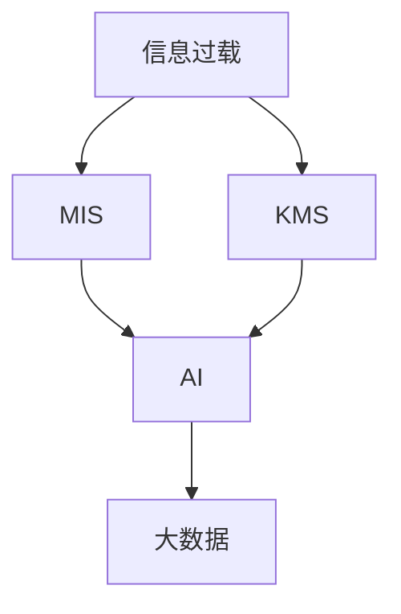

                 

# 信息时代的信息管理系统：管理信息过载的工具和技术

> 关键词：信息过载,管理信息系统,知识管理系统,KMS,人工智能,大数据,自然语言处理,数据挖掘,自然语言处理

## 1. 背景介绍

### 1.1 问题由来

随着信息技术的迅猛发展和互联网应用的普及，人们在日常生活和工作中接触到的信息量急剧增长，信息过载问题变得日益突出。信息过载不仅增加了决策者获取有效信息的难度，还可能导致信息的误用或忽略，从而影响到个人和组织做出正确的决策。如何有效地管理海量信息，提取出有价值的信息，成为了信息时代亟需解决的重要问题。

面对信息过载，传统的管理方式如人工检索、手动分类等方法效率低下，难以满足需求。而信息技术的发展为信息管理提供了新的工具和技术。例如，知识管理系统（Knowledge Management System, KMS）的提出，为信息管理提供了一个集成的解决方案，能够有效地存储、检索和共享知识，帮助用户快速找到所需信息。同时，随着人工智能和大数据技术的成熟，知识管理系统的智能化水平不断提升，为解决信息过载问题提供了更加有效的手段。

### 1.2 问题核心关键点

管理信息过载的核心关键点包括：

- **信息过载问题**：由于信息量大增，人们在获取和处理信息时面临巨大挑战，容易导致决策失误和资源浪费。
- **知识管理系统(KMS)**：KMS作为一种系统化的信息管理工具，通过数据存储、检索、共享等功能，帮助用户有效组织和管理知识。
- **人工智能**：利用机器学习、自然语言处理（NLP）等技术，提高信息处理和知识发现的效率和准确性。
- **大数据技术**：通过数据挖掘和分析，从海量数据中提取有价值的信息，支持更精准的决策。

这些关键点共同构成了信息管理系统的核心框架，通过合理的技术手段和工具，可以有效地管理和利用信息，提升决策效率和质量。

### 1.3 问题研究意义

有效管理信息过载不仅能够提升个人和组织的决策效率，还能促进知识共享和创新。具体意义如下：

- **提升决策效率**：通过高效的信息管理和知识共享，减少信息查找时间，加快决策过程。
- **促进知识创新**：知识管理系统能够集成和共享跨部门、跨领域的专业知识，促进团队协作和创新。
- **降低运营成本**：减少因信息过载导致的人力资源浪费和错误决策，降低运营成本。
- **增强竞争力**：通过系统化管理知识和信息，提高组织的知识管理能力，增强市场竞争力。

## 2. 核心概念与联系

### 2.1 核心概念概述

为了更好地理解信息管理系统在信息过载管理中的应用，本节将介绍几个核心概念：

- **信息过载(Information Overload)**：由于信息量急剧增加，人们难以有效地处理所有信息，导致的信息处理负担过重。
- **管理信息系统(MIS)**：利用信息技术对组织内部信息进行收集、处理、存储和共享的系统。
- **知识管理系统(KMS)**：一种集成了信息管理、知识发现和共享功能的系统，能够帮助用户有效管理和利用知识。
- **人工智能(AI)**：通过机器学习和自然语言处理等技术，提高信息处理和知识发现的效率和准确性。
- **大数据(Big Data)**：指规模大、结构复杂、类型多样的数据集合，通过数据挖掘和分析，发现有价值的信息。

这些概念之间的逻辑关系可以通过以下Mermaid流程图来展示：



这个流程图展示了信息管理系统的核心概念及其之间的关系：

1. 信息过载触发了对于信息管理系统和知识管理系统的需求。
2. MIS和KMS通过信息存储、检索和共享等功能，帮助用户有效管理信息。
3. AI和大数据技术进一步提升了信息处理和知识发现的效率和准确性。
4. KMS与AI和大数据技术的结合，为信息管理提供了更加智能化和高效化的解决方案。

## 3. 核心算法原理 & 具体操作步骤
### 3.1 算法原理概述

信息管理系统的核心算法原理主要基于以下技术：

- **自然语言处理(NLP)**：利用NLP技术对文本数据进行分析和处理，提取有价值的信息和知识。
- **数据挖掘(Data Mining)**：通过对数据集合进行挖掘和分析，发现隐藏在数据中的模式和规律。
- **机器学习(Machine Learning)**：利用算法和模型对数据进行学习和预测，提高信息处理的自动化程度。
- **信息检索(Information Retrieval)**：通过算法和模型对文本数据进行检索，快速找到所需信息。

这些技术共同构成了信息管理系统的基础，通过合理地选择和组合，可以实现对信息过载的有效管理。

### 3.2 算法步骤详解

信息管理系统的设计和实现通常包括以下关键步骤：

**Step 1: 需求分析**
- 分析用户的信息需求和场景，确定信息管理系统的目标和功能。
- 确定系统所需要支持的信息类型和数据量。
- 考虑系统与现有业务系统的集成需求。

**Step 2: 系统设计**
- 设计系统的架构和技术选型，确定信息存储、检索、共享的方案。
- 设计系统的前端和后端交互方式，确保用户体验和操作便捷。
- 设计数据安全和隐私保护策略，确保数据安全。

**Step 3: 系统实现**
- 实现信息存储模块，提供高效的数据存储和检索功能。
- 实现信息检索模块，通过NLP等技术对文本数据进行分析和检索。
- 实现知识发现模块，利用机器学习和大数据技术提取知识。
- 实现用户接口模块，提供友好的用户界面和操作界面。

**Step 4: 系统测试**
- 对系统进行全面的测试，确保各模块的正常运行和数据一致性。
- 进行性能测试，确保系统在处理大规模数据时的效率和稳定性。
- 进行安全测试，确保系统符合安全标准和隐私保护策略。

**Step 5: 系统部署**
- 将系统部署到生产环境，并进行必要的配置和优化。
- 提供系统培训和支持，确保用户能够有效使用系统。
- 持续监控系统运行状态，及时处理和修复问题。

### 3.3 算法优缺点

信息管理系统在解决信息过载问题方面具有以下优点：

1. **高效的信息存储和检索**：通过信息管理系统，可以快速存储和检索大量信息，减少人工查找时间。
2. **知识共享和协同工作**：KMS能够促进跨部门、跨领域的信息共享和协作，提高团队的工作效率。
3. **智能化决策支持**：AI和大数据技术能够从海量数据中提取有价值的信息，支持更精准的决策。

同时，信息管理系统也存在一些缺点：

1. **数据质量问题**：信息管理系统依赖于数据的质量，如果数据存在缺失或错误，可能会影响系统的准确性。
2. **系统复杂性**：信息管理系统涉及多种技术和模块，设计和实现复杂度较高，需要较高的技术水平。
3. **隐私和安全性问题**：系统需要处理大量敏感信息，数据隐私和安全保护成为重要的挑战。

### 3.4 算法应用领域

信息管理系统的应用领域非常广泛，以下是几个典型的应用场景：

- **企业信息管理**：帮助企业有效管理和共享内部信息，提升决策效率和业务运营水平。
- **政府信息公开**：通过信息管理系统公开政府信息，促进政府透明化，提升公共服务水平。
- **医疗信息管理**：管理医疗信息，支持医疗决策和科研，提升医疗服务质量。
- **教育信息管理**：提供教育资源共享和知识发现功能，促进教育创新和教师发展。
- **金融信息管理**：支持金融数据挖掘和知识发现，提升金融决策和风险管理能力。

## 4. 数学模型和公式 & 详细讲解 & 举例说明

### 4.1 数学模型构建

本节将使用数学语言对信息管理系统的核心算法进行更加严格的刻画。

假设信息管理系统的输入为 $X=\{x_1,x_2,\ldots,x_n\}$，其中 $x_i$ 表示第 $i$ 条信息。记系统的输出为 $Y$，表示从 $X$ 中提取的有用信息或知识。

定义信息管理系统的损失函数为 $\ell(Y,X)$，用于衡量输出的信息价值与实际需求之间的差异。目标是最小化损失函数，即：

$$
\theta^* = \mathop{\arg\min}_{\theta} \ell(Y,X)
$$

其中 $\theta$ 为系统中的参数，例如机器学习模型的权重、NLP模型的参数等。

### 4.2 公式推导过程

以信息检索为例，我们推导一个基本的数学模型。假设信息检索的目标是从集合 $X$ 中找到与查询 $Q$ 最相关的信息 $Y$。

定义余弦相似度函数：

$$
\text{cosine-similarity}(X_i,Q) = \frac{X_i \cdot Q}{\|X_i\|\|Q\|}
$$

其中 $\cdot$ 表示向量点乘，$\|.\|$ 表示向量的欧几里得范数。

假设系统通过余弦相似度函数计算 $X$ 中每条信息与查询 $Q$ 的相似度得分，然后根据得分排序，选取得分最高的信息 $Y$。则信息检索的损失函数可以定义为：

$$
\ell(Y,Q) = \sum_{i=1}^n \mathbb{1}(Y=x_i) \text{cosine-similarity}(X_i,Q)
$$

其中 $\mathbb{1}$ 为指示函数，当 $Y=x_i$ 时，函数值为1，否则为0。

通过最小化上述损失函数，可以训练出信息检索模型的参数，从而提高信息检索的准确性和效率。

### 4.3 案例分析与讲解

下面以一个实际案例分析信息检索模型的应用：

假设某企业需要从大量的文档中找到涉及特定技术方案的信息。企业将文档中提及该方案的关键词作为查询 $Q$，然后通过信息检索系统找到最相关的文档 $Y$。系统训练好的模型会根据余弦相似度函数计算每条文档与查询的相似度得分，并按得分排序，最终选出最相关的文档作为 $Y$。

具体步骤如下：

1. **数据预处理**：将文档转换成向量形式，表示为 $\{x_1,\ldots,x_n\}$，并提取关键词作为查询 $Q$。
2. **模型训练**：利用历史文档和查询的数据，训练信息检索模型，得到参数 $\theta$。
3. **信息检索**：将新的查询 $Q$ 输入模型，计算每条文档 $x_i$ 的相似度得分，选出得分最高的文档作为 $Y$。
4. **结果评估**：对比 $Y$ 和实际相关文档，评估信息检索模型的准确性和效率。

## 5. 项目实践：代码实例和详细解释说明
### 5.1 开发环境搭建

在进行信息管理系统开发前，我们需要准备好开发环境。以下是使用Python进行Elasticsearch开发的环境配置流程：

1. 安装Anaconda：从官网下载并安装Anaconda，用于创建独立的Python环境。

2. 创建并激活虚拟环境：
```bash
conda create -n elasticsearch-env python=3.8 
conda activate elasticsearch-env
```

3. 安装Elasticsearch：从官网下载并安装Elasticsearch，配置好集群节点。

4. 安装Python Elasticsearch官方库：
```bash
pip install elasticsearch
```

5. 安装各类工具包：
```bash
pip install pandas numpy torch sklearn tqdm jupyter notebook ipython
```

完成上述步骤后，即可在`elasticsearch-env`环境中开始信息管理系统的开发。

### 5.2 源代码详细实现

这里我们以构建一个基于Elasticsearch的信息检索系统为例，给出Python代码实现。

首先，定义信息检索系统的类：

```python
from elasticsearch import Elasticsearch

class InformationRetrievalSystem:
    def __init__(self, es_client):
        self.es_client = es_client
        
    def query(self, query, fields):
        result = self.es_client.search(index='my_index', body={"query": {"match": {"text": query}}, "fields": fields})
        return result
```

然后，配置Elasticsearch客户端：

```python
from elasticsearch import Elasticsearch

es_client = Elasticsearch([{'host': 'localhost', 'port': 9200}])
```

接着，使用信息检索系统：

```python
ir_system = InformationRetrievalSystem(es_client)
result = ir_system.query('query text', fields=['title', 'content'])
```

最后，输出查询结果：

```python
for hit in result['hits']['hits']:
    print(hit['_source'])
```

### 5.3 代码解读与分析

让我们再详细解读一下关键代码的实现细节：

**InformationRetrievalSystem类**：
- `__init__`方法：初始化Elasticsearch客户端。
- `query`方法：根据查询条件，在指定索引中检索文档，返回匹配结果。

**es_client变量**：
- 定义Elasticsearch客户端，用于与Elasticsearch集群进行通信。

**query方法**：
- 使用Elasticsearch的搜索API，根据查询条件检索文档。
- 设置查询的字段和匹配方式，返回检索结果。

**查询结果的输出**：
- 遍历查询结果，输出匹配到的文档内容。

可以看到，通过Elasticsearch客户端，我们可以轻松地构建一个高效的信息检索系统。开发者可以将更多精力放在数据处理和算法优化上，而不必过多关注底层的网络通信细节。

当然，工业级的系统实现还需考虑更多因素，如分布式查询、搜索结果的展示、用户交互界面等。但核心的信息检索范式基本与此类似。

## 6. 实际应用场景
### 6.1 企业信息管理

企业信息管理系统能够帮助企业有效管理和共享内部信息，提升决策效率和业务运营水平。具体而言，企业可以收集和存储各类信息，如产品文档、客户记录、财务报表等，通过信息检索和知识发现功能，快速找到所需信息，支持决策和业务运营。

例如，某电商企业需要查询某产品的库存信息。企业可以通过信息管理系统检索产品的库存记录，快速获取最新的库存状态。系统还可以分析历史销售数据，预测未来销售趋势，帮助企业制定库存策略。

### 6.2 政府信息公开

政府信息公开系统能够促进政府透明化，提升公共服务水平。政府可以收集各类信息，如法律法规、政策文件、项目报告等，通过信息检索和知识发现功能，快速找到所需信息，支持公众查询和政府决策。

例如，某市政府需要查找最新的政策文件。政府可以通过信息管理系统检索政策文件，提供给公众查询。系统还可以分析政策文件的内容和影响，提供政策解读和趋势分析，帮助公众理解和应用政策。

### 6.3 医疗信息管理

医疗信息管理系统能够管理医疗信息，支持医疗决策和科研，提升医疗服务质量。医疗机构可以收集和存储各类医疗信息，如病历、影像、实验室结果等，通过信息检索和知识发现功能，快速找到所需信息，支持医生诊断和治疗。

例如，某医院需要查找某病人的病历信息。医生可以通过信息管理系统检索病人的病历记录，快速获取病人的历史诊疗信息。系统还可以分析病历数据，发现潜在的健康风险，提供个性化的诊疗建议。

### 6.4 教育信息管理

教育信息管理系统提供教育资源共享和知识发现功能，促进教育创新和教师发展。教育机构可以收集和存储各类教育资源，如教学视频、论文、案例分析等，通过信息检索和知识发现功能，快速找到所需资源，支持教师教学和科研。

例如，某大学需要查找某门课程的教学视频。教师可以通过信息管理系统检索课程的视频资源，快速获取教学视频。系统还可以分析课程内容，提供相关的论文和案例分析，帮助教师进一步完善教学内容。

### 6.5 金融信息管理

金融信息管理系统支持金融数据挖掘和知识发现，提升金融决策和风险管理能力。金融机构可以收集和存储各类金融数据，如交易记录、市场分析、风险报告等，通过信息检索和知识发现功能，快速找到所需信息，支持投资决策和风险管理。

例如，某投资公司需要查找某股票的历史交易数据。公司可以通过信息管理系统检索股票的交易记录，快速获取历史交易数据。系统还可以分析交易数据，预测股票走势，提供投资建议和风险预警。

## 7. 工具和资源推荐
### 7.1 学习资源推荐

为了帮助开发者系统掌握信息管理系统的理论基础和实践技巧，这里推荐一些优质的学习资源：

1. 《Elasticsearch官方文档》：Elasticsearch的官方文档，提供了全面的API使用指南和最佳实践，是学习Elasticsearch的必备资料。

2. 《自然语言处理综论》书籍：斯坦福大学吴恩达教授的NLP课程讲义，详细介绍了NLP的基础知识和前沿技术，涵盖信息检索、知识发现等核心内容。

3. 《深度学习在自然语言处理中的应用》书籍：由NLP专家撰写，介绍了深度学习在NLP中的应用，包括机器学习、大数据等技术。

4. Kaggle数据集和竞赛：Kaggle提供了大量公开数据集和竞赛，通过实际项目训练和应用信息检索和知识发现技术。

5. HuggingFace官方文档：Transformer库的官方文档，提供了丰富的NLP模型和工具，适合实际开发应用。

通过对这些资源的学习实践，相信你一定能够快速掌握信息管理系统的精髓，并用于解决实际的NLP问题。

### 7.2 开发工具推荐

高效的开发离不开优秀的工具支持。以下是几款用于信息管理系统开发的常用工具：

1. Python语言：Python是当前最流行的编程语言之一，拥有丰富的第三方库和框架，支持高效的算法和数据处理。

2. Elasticsearch：由Elastic公司开发的信息检索和知识发现引擎，提供分布式搜索、实时分析等功能，适合处理大规模数据。

3. TensorFlow和PyTorch：Google和Facebook开发的深度学习框架，支持高效的模型训练和推理。

4. Flask和Django：Python的Web框架，提供快速开发Web应用的功能，适合构建信息管理系统的用户界面。

5. Visual Studio Code和PyCharm：优秀的IDE，支持代码编辑、调试和自动补全功能，提高开发效率。

合理利用这些工具，可以显著提升信息管理系统的开发效率，加快创新迭代的步伐。

### 7.3 相关论文推荐

信息管理系统和知识管理系统的研究涉及多个学科，以下是几篇奠基性的相关论文，推荐阅读：

1. "Information Retrieval: An Introduction" by Christopher D. Manning and Prabhakar Raghavan：介绍了信息检索的基本概念和算法，是信息检索领域的经典教材。

2. "Knowledge Management: Critical Success Factors" by Thomas W. Holsapple and Richard E. Huber：探讨了知识管理系统的关键成功因素和实施策略，提供了实用的指导。

3. "Semantic Web Mining and Statistical Learning" by Jiangtao Liang, Yue Yin and Ying Zhang：介绍了知识发现和信息检索在语义网中的应用，提供了有价值的参考。

4. "Knowledge Mining, Knowledge Discovery, and Knowledge Management" by Robert S. Taylor：综述了知识发现和知识管理的研究进展，提供了全面的视角。

这些论文代表了大规模信息管理系统的研究脉络，通过学习这些前沿成果，可以帮助研究者把握学科前进方向，激发更多的创新灵感。

## 8. 总结：未来发展趋势与挑战

### 8.1 总结

本文对信息管理系统在信息过载管理中的应用进行了全面系统的介绍。首先阐述了信息过载问题以及知识管理系统(KMS)、人工智能(AI)和大数据(Big Data)在信息管理中的应用，明确了信息管理系统的核心功能和技术手段。

通过本文的系统梳理，可以看到，信息管理系统在信息过载管理方面具有显著优势，能够通过高效的存储、检索和共享功能，有效管理海量信息，提升决策效率和质量。未来，伴随着技术的发展和应用场景的拓展，信息管理系统必将在更多领域发挥重要作用，助力企业和社会数字化转型。

### 8.2 未来发展趋势

展望未来，信息管理系统将呈现以下几个发展趋势：

1. **智能化水平提升**：AI和大数据技术将进一步提升信息管理系统智能化水平，实现更加精准的信息检索和知识发现。

2. **分布式架构演进**：随着数据规模的增大，分布式架构将成为信息管理系统的标准，支持更高效的数据处理和存储。

3. **用户友好界面**：系统将更加注重用户体验，提供更加智能和直观的界面，支持用户快速获取所需信息。

4. **多模态信息融合**：未来的信息管理系统将融合多模态数据，支持图像、语音、视频等多种信息类型的存储和检索。

5. **实时性要求提高**：对于实时性要求较高的场景，如金融、医疗等，系统将需要支持更高效的实时数据处理和查询。

6. **跨平台集成**：信息管理系统将更加注重与其他系统和服务集成，提供更加丰富的应用场景和功能。

以上趋势凸显了信息管理系统的广阔前景。这些方向的探索发展，必将进一步提升信息管理系统的效率和能力，为信息时代的决策和管理提供更强大的支持。

### 8.3 面临的挑战

尽管信息管理系统在信息过载管理方面已经取得了显著成效，但在迈向更加智能化、普适化应用的过程中，它仍面临诸多挑战：

1. **数据质量问题**：信息管理系统依赖于数据的质量，如果数据存在缺失或错误，可能会影响系统的准确性。

2. **系统复杂性**：信息管理系统涉及多种技术和模块，设计和实现复杂度较高，需要较高的技术水平。

3. **隐私和安全问题**：系统需要处理大量敏感信息，数据隐私和安全保护成为重要的挑战。

4. **实时性要求高**：对于实时性要求较高的场景，如金融、医疗等，系统需要支持更高效的实时数据处理和查询。

5. **多模态信息融合难度大**：融合多模态数据涉及数据格式、存储和处理方式的差异，技术难度较大。

6. **用户使用门槛高**：系统复杂度较高，用户学习和使用门槛高，需要提供足够的培训和支持。

正视信息管理系统面临的这些挑战，积极应对并寻求突破，将是大规模信息管理系统的下一步发展方向。

### 8.4 研究展望

面对信息管理系统面临的挑战，未来的研究需要在以下几个方面寻求新的突破：

1. **数据预处理和清洗**：开发高效的数据预处理和清洗算法，提高数据质量和系统准确性。

2. **分布式和实时处理**：研究分布式架构和实时数据处理技术，支持大规模数据和高实时性要求。

3. **多模态数据融合**：开发多模态数据融合算法，实现图像、语音、视频等多种信息类型的存储和检索。

4. **用户友好界面设计**：设计更加智能化和直观的界面，支持用户快速获取所需信息。

5. **隐私和安全保护**：开发数据隐私和安全保护算法，确保数据安全。

6. **跨平台集成和互操作性**：研究跨平台集成和互操作性技术，提供更丰富的应用场景和功能。

这些研究方向的探索，必将引领信息管理系统向更高的智能化和普适化方向发展，为信息时代的决策和管理提供更强大的支持。面向未来，信息管理系统需要与更多技术和应用场景进行深度融合，共同推动数字化转型的进程。

## 9. 附录：常见问题与解答

**Q1：信息管理系统如何处理海量数据？**

A: 信息管理系统通过分布式存储和检索技术，可以高效地处理海量数据。具体来说，系统可以将数据分布在多个节点上进行存储和检索，提高数据处理效率和系统可靠性。

**Q2：信息管理系统的核心算法有哪些？**

A: 信息管理系统的核心算法包括自然语言处理(NLP)、数据挖掘(Data Mining)和机器学习(Machine Learning)等。这些算法共同构成了信息管理系统的基础，通过合理地选择和组合，可以实现对信息过载的有效管理。

**Q3：信息管理系统的优缺点有哪些？**

A: 信息管理系统的优点包括高效的信息存储和检索、知识共享和协同工作、智能化决策支持等。缺点包括数据质量问题、系统复杂性、隐私和安全问题等。

**Q4：信息管理系统的应用场景有哪些？**

A: 信息管理系统的应用场景包括企业信息管理、政府信息公开、医疗信息管理、教育信息管理、金融信息管理等。这些场景下，信息管理系统可以帮助用户快速获取所需信息，提升决策效率和业务运营水平。

**Q5：信息管理系统的未来发展趋势是什么？**

A: 信息管理系统未来的发展趋势包括智能化水平提升、分布式架构演进、用户友好界面、多模态信息融合、实时性要求提高、跨平台集成等。

---

作者：禅与计算机程序设计艺术 / Zen and the Art of Computer Programming

