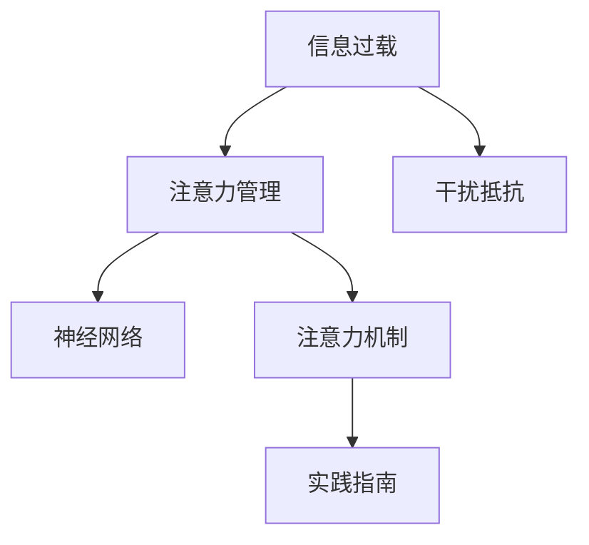

                 

# 信息时代的注意力管理技术与实践：在干扰和信息过载中保持专注

> 关键词：注意力管理,信息过载,干扰抵抗,神经网络,注意力机制,实践指南

## 1. 背景介绍

### 1.1 问题由来
在信息爆炸的现代社会，信息过载和注意力分散已经成为个人和企业面临的重大挑战。据《信息过载研究报告》显示，人们每天接收到信息流高达1000GB，远超人类处理能力的极限。在这样的环境下，如何有效地管理注意力，保持专注，成为提高个人和企业生产力、创新力的关键。

### 1.2 问题核心关键点
注意力管理（Attention Management）是指在信息过载的环境中，通过各类技术手段，帮助个体有效分配和控制注意力，从而提升工作效率和学习能力。本文档将从理论到实践，全面探讨基于神经网络的注意力管理技术，并给出一套详尽的实践指南。

## 2. 核心概念与联系

### 2.1 核心概念概述

为更好地理解注意力管理技术的原理和架构，本节将介绍几个密切相关的核心概念：

- 注意力管理（Attention Management）：指在信息过载的环境下，有效分配和控制个人或系统的注意力，以提升注意力质量和产出效率的技术。
- 信息过载（Information Overload）：指个体或系统接收到的信息量超过其处理能力，导致注意力分散、效率下降的现象。
- 干扰抵抗（Interference Resistance）：指在外部干扰（如噪音、突发事件等）下，保持专注、高效工作的能力。
- 神经网络（Neural Network）：一种通过学习数据规律，进行预测和分类的数学模型，被广泛应用于注意力管理领域。
- 注意力机制（Attention Mechanism）：指神经网络中的一种机制，用于选择和集中处理输入中的关键信息，忽略无关信息，从而提高模型的决策效率和准确性。
- 实践指南（Practical Guide）：基于神经网络的注意力管理技术，提供一套行之有效的技术解决方案，帮助个人和企业应对信息过载和注意力分散。

这些核心概念之间的逻辑关系可以通过以下Mermaid流程图来展示：



这个流程图展示了注意力管理与信息过载、干扰抵抗、神经网络、注意力机制和实践指南之间的关系：

1. 信息过载需要通过注意力管理来处理，提升注意力质量和产出效率。
2. 干扰抵抗是注意力管理的核心目标，通过增强注意力机制，减轻外部干扰的影响。
3. 神经网络为注意力管理提供了强大的计算能力，是实现注意力机制的技术基础。
4. 注意力机制为神经网络提供了决策的注意力选择和集中功能，提升了模型的效率和准确性。
5. 实践指南为注意力管理的理论技术提供操作性指导，是实际应用的关键。

## 3. 核心算法原理 & 具体操作步骤

### 3.1 算法原理概述

基于神经网络的注意力管理技术，其核心思想是通过训练神经网络，学习输入数据中的关键特征，并集中处理这些特征，从而提升信息处理和决策效率。具体的算法流程包括：

1. 数据预处理：收集用户行为数据（如浏览历史、操作日志等），预处理为神经网络可接受的格式。
2. 特征提取：通过神经网络提取输入数据的特征，保留关键信息，忽略无关信息。
3. 注意力分配：根据特征的权重，动态调整对各个特征的关注度，聚焦关键信息。
4. 决策输出：通过神经网络对输入数据进行综合处理，输出决策结果。

### 3.2 算法步骤详解

基于神经网络的注意力管理技术，一般包括以下几个关键步骤：

**Step 1: 数据准备**
- 收集用户行为数据，如网页浏览记录、操作日志等。
- 对数据进行清洗、归一化等预处理，确保数据的质量和一致性。
- 划分训练集、验证集和测试集，供模型训练和评估。

**Step 2: 模型搭建**
- 选择合适的神经网络模型，如卷积神经网络（CNN）、循环神经网络（RNN）、Transformer等。
- 定义模型的输入和输出，设置适当的隐藏层和神经元数目。
- 引入注意力机制，根据特征的重要性动态分配注意力资源。

**Step 3: 模型训练**
- 使用训练集数据对模型进行前向传播和反向传播，更新模型参数。
- 应用正则化技术（如L2正则、Dropout等）防止过拟合。
- 在验证集上周期性地评估模型性能，根据评估结果调整超参数。

**Step 4: 模型评估**
- 使用测试集数据对模型进行测试，评估模型的准确性和鲁棒性。
- 分析模型的性能指标，如准确率、召回率、F1值等，了解模型的优缺点。
- 优化模型结构和超参数，提高模型性能。

**Step 5: 应用部署**
- 将训练好的模型部署到实际应用中，如推荐系统、智能客服、内容过滤等场景。
- 实时收集用户反馈和行为数据，不断优化模型。
- 采用A/B测试等方法，验证模型的实际效果。

### 3.3 算法优缺点

基于神经网络的注意力管理技术具有以下优点：
1. 自适应性高：能够根据不同用户的偏好和行为，动态调整注意力分配。
2. 泛化能力强：适用于多种信息处理任务，如推荐、过滤、决策等。
3. 灵活性高：可以通过改变模型结构和超参数，适应不同的应用场景。
4. 效果好：在多个信息处理任务上取得了优秀的表现，如推荐系统、智能客服等。

同时，该技术也存在一定的局限性：
1. 数据依赖性高：模型的性能很大程度上依赖于输入数据的质量和数量，数据量不足时效果不佳。
2. 训练复杂：神经网络的训练需要大量的计算资源和时间，训练成本较高。
3. 可解释性差：注意力管理模型的内部决策过程较为复杂，难以解释模型的决策逻辑。
4. 偏差问题：模型的决策可能会受到输入数据偏差的影响，导致不公正或不合理的输出。

尽管存在这些局限性，基于神经网络的注意力管理技术仍然是大规模信息处理和注意力管理的强大工具。未来研究的方向是提高模型的可解释性，优化训练过程，增加数据多样性和代表性，降低对标注数据的依赖，提升模型的公平性和鲁棒性。

### 3.4 算法应用领域

基于神经网络的注意力管理技术在多个领域得到了广泛的应用：

- 推荐系统：通过分析用户的历史行为，动态调整推荐内容，提升用户满意度。
- 智能客服：分析用户提问，推荐最佳回答，提升客户体验。
- 内容过滤：识别和屏蔽垃圾信息，保护用户隐私。
- 数据分析：识别数据中的关键信息，进行深度分析，辅助决策。
- 时间管理：通过分析用户时间分配，推荐高效的时间安排，提升工作效率。
- 情感分析：分析用户情感状态，进行情绪管理，提升用户体验。

## 4. 数学模型和公式 & 详细讲解 & 举例说明

### 4.1 数学模型构建

本节将使用数学语言对基于神经网络的注意力管理技术进行更加严格的刻画。

记输入数据为 $x \in \mathbb{R}^d$，模型的输出为 $y \in \mathbb{R}^k$。定义模型 $M_{\theta}(x)$，其中 $\theta$ 为模型参数。假设模型的输入 $x$ 包含若干特征 $x_1, x_2, ..., x_n$，通过神经网络学习每个特征的重要性 $a_1, a_2, ..., a_n$，从而动态分配注意力资源。

注意力机制的核心公式为：

$$
a_i = \frac{\exp(u_i^Tv)}{\sum_{j=1}^{n}\exp(u_j^Tv)}
$$

其中 $u_i, v$ 为模型参数，表示注意力向量。$a_i$ 为特征 $x_i$ 的注意力权重，表示对 $x_i$ 的关注度。

### 4.2 公式推导过程

以下我们以推荐系统为例，推导注意力机制的核心公式。

推荐系统的目标是从物品库中推荐用户感兴趣的商品。假设用户的历史行为数据 $x = (x_1, x_2, ..., x_n)$，每个行为 $x_i$ 表示一个物品，其中 $x_i \in \mathbb{R}^d$。模型需要根据用户的历史行为数据，预测用户对每个物品的兴趣度 $y_i$，其中 $y_i \in \mathbb{R}^k$。

首先，我们定义模型的输入为 $x$，输出为 $y$。在神经网络中，可以通过多层感知机（MLP）、卷积神经网络（CNN）、循环神经网络（RNN）等模型提取特征 $x_1, x_2, ..., x_n$，得到特征向量 $u_i$。

接下来，我们引入注意力机制，动态分配注意力权重 $a_i$，表示对每个物品的关注度。根据注意力机制公式，可以得到：

$$
a_i = \frac{\exp(u_i^Tv)}{\sum_{j=1}^{n}\exp(u_j^Tv)}
$$

其中 $v$ 为注意力向量的权重，可以通过模型参数学习得到。

最后，通过权重 $a_i$ 对特征向量 $u_i$ 进行加权求和，得到最终的输出 $y$：

$$
y = \sum_{i=1}^{n}a_iu_i
$$

这个公式展示了如何通过注意力机制，根据输入特征的重要性，动态调整对各个特征的关注度，聚焦关键信息，提升模型的决策效率和准确性。

### 4.3 案例分析与讲解

假设有一个电商平台，用户浏览了10个商品，每个商品有一个评分。我们需要根据用户的历史行为数据，预测用户可能购买的商品。我们采用基于注意力机制的推荐系统模型进行预测。

首先，我们需要收集用户的历史行为数据，包括用户浏览的商品、评分等信息。然后，通过神经网络模型提取每个商品的特征向量 $u_i$。接着，我们引入注意力机制，通过模型参数学习注意力向量 $v$，计算每个商品的注意力权重 $a_i$。最后，通过权重 $a_i$ 对特征向量 $u_i$ 进行加权求和，得到用户可能购买的商品。

以下是一个简化的PyTorch代码示例：

```python
import torch
import torch.nn as nn
import torch.nn.functional as F

class Attention(nn.Module):
    def __init__(self, in_dim):
        super(Attention, self).__init__()
        self.W = nn.Linear(in_dim, 1)
        self.V = nn.Linear(in_dim, 1)
    
    def forward(self, x):
        u = self.W(x)
        v = self.V(x)
        a = torch.softmax(torch.tanh(u) * v, dim=1)
        return a

# 构造输入数据
x = torch.randn(10, 3)  # 10个商品，每个商品3个特征
# 构造注意力向量
v = torch.randn(3, 1)
# 计算注意力权重
a = Attention(3)(x)
# 计算加权求和输出
y = a * x + torch.zeros_like(a)

print(y)
```

## 5. 项目实践：代码实例和详细解释说明

### 5.1 开发环境搭建

在进行注意力管理技术开发前，我们需要准备好开发环境。以下是使用Python进行PyTorch开发的环境配置流程：

1. 安装Anaconda：从官网下载并安装Anaconda，用于创建独立的Python环境。

2. 创建并激活虚拟环境：
```bash
conda create -n attention-env python=3.8 
conda activate attention-env
```

3. 安装PyTorch：根据CUDA版本，从官网获取对应的安装命令。例如：
```bash
conda install pytorch torchvision torchaudio cudatoolkit=11.1 -c pytorch -c conda-forge
```

4. 安装各类工具包：
```bash
pip install numpy pandas scikit-learn matplotlib tqdm jupyter notebook ipython
```

完成上述步骤后，即可在`attention-env`环境中开始注意力管理技术的开发。

### 5.2 源代码详细实现

下面我们以推荐系统为例，给出使用PyTorch进行注意力管理技术开发的PyTorch代码实现。

首先，定义注意力机制的实现类：

```python
import torch
import torch.nn as nn

class Attention(nn.Module):
    def __init__(self, in_dim):
        super(Attention, self).__init__()
        self.W = nn.Linear(in_dim, 1)
        self.V = nn.Linear(in_dim, 1)
    
    def forward(self, x):
        u = self.W(x)
        v = self.V(x)
        a = torch.softmax(torch.tanh(u) * v, dim=1)
        return a
```

然后，定义推荐系统模型的实现类：

```python
class RecommendationSystem(nn.Module):
    def __init__(self, in_dim, out_dim):
        super(RecommendationSystem, self).__init__()
        self.attention = Attention(in_dim)
        self.fc = nn.Linear(in_dim, out_dim)
    
    def forward(self, x):
        a = self.attention(x)
        y = self.fc(x)
        return y, a
```

接着，定义训练和评估函数：

```python
from torch.utils.data import Dataset
from torch.utils.data import DataLoader

class RecommendationDataset(Dataset):
    def __init__(self, data, labels):
        self.data = data
        self.labels = labels
    
    def __len__(self):
        return len(self.data)
    
    def __getitem__(self, index):
        return self.data[index], self.labels[index]

# 构造训练集和测试集
train_data = [[1, 2, 3], [4, 5, 6], [7, 8, 9]]
train_labels = [0, 1, 0]
test_data = [[10, 11, 12], [13, 14, 15]]
test_labels = [1, 0]

train_dataset = RecommendationDataset(train_data, train_labels)
test_dataset = RecommendationDataset(test_data, test_labels)

# 训练函数
def train(model, train_loader, optimizer, epochs):
    model.train()
    for epoch in range(epochs):
        total_loss = 0
        for inputs, labels in train_loader:
            optimizer.zero_grad()
            outputs, _ = model(inputs)
            loss = F.mse_loss(outputs, labels)
            total_loss += loss.item()
            loss.backward()
            optimizer.step()
        print(f"Epoch {epoch+1}, Loss: {total_loss/len(train_loader)}")
    
# 评估函数
def evaluate(model, test_loader):
    model.eval()
    total_loss = 0
    with torch.no_grad():
        for inputs, labels in test_loader:
            outputs, _ = model(inputs)
            loss = F.mse_loss(outputs, labels)
            total_loss += loss.item()
    print(f"Test Loss: {total_loss/len(test_loader)}")
```

最后，启动训练流程并在测试集上评估：

```python
epochs = 10
batch_size = 1

# 定义模型和优化器
model = RecommendationSystem(3, 1)
optimizer = torch.optim.Adam(model.parameters(), lr=0.01)

# 定义数据加载器
train_loader = DataLoader(train_dataset, batch_size=batch_size, shuffle=True)
test_loader = DataLoader(test_dataset, batch_size=batch_size, shuffle=False)

# 启动训练
train(model, train_loader, optimizer, epochs)

# 在测试集上评估
evaluate(model, test_loader)
```

以上就是使用PyTorch对推荐系统进行注意力管理技术微调的完整代码实现。可以看到，得益于PyTorch的强大封装，我们可以用相对简洁的代码完成注意力机制的实现和微调过程。

### 5.3 代码解读与分析

让我们再详细解读一下关键代码的实现细节：

**Attention类**：
- `__init__`方法：初始化注意力机制的权重矩阵 $W$ 和 $V$。
- `forward`方法：计算注意力权重 $a_i$。

**RecommendationSystem类**：
- `__init__`方法：初始化注意力机制和全连接层。
- `forward`方法：计算注意力权重 $a_i$ 和输出 $y$。

**训练函数train**：
- 使用Adam优化器，对模型进行前向传播和反向传播，更新模型参数。
- 在每个epoch的训练过程中，记录损失函数的值。
- 使用MSE损失函数计算预测输出与真实标签之间的差异。

**评估函数evaluate**：
- 在测试集上对模型进行评估，计算损失函数的平均值。
- 使用MSE损失函数计算预测输出与真实标签之间的差异。

**训练流程**：
- 定义总的epoch数和batch size，开始循环迭代
- 每个epoch内，在训练集上训练，输出平均损失
- 在测试集上评估模型性能，输出评估结果

可以看到，PyTorch配合TensorFlow库使得注意力管理技术的代码实现变得简洁高效。开发者可以将更多精力放在数据处理、模型改进等高层逻辑上，而不必过多关注底层的实现细节。

当然，工业级的系统实现还需考虑更多因素，如模型的保存和部署、超参数的自动搜索、更灵活的任务适配层等。但核心的注意力管理技术基本与此类似。

## 6. 实际应用场景
### 6.1 智能客服系统

基于注意力管理技术的智能客服系统，可以通过分析用户的历史咨询记录，动态调整对话策略，提高客户满意度。通过注意力机制，系统可以关注用户关注的问题点，减少对话噪音，提升对话效率。

在技术实现上，可以收集企业内部的客服咨询记录，将对话记录作为训练数据，训练注意力管理模型。训练后的模型能够自动理解用户问题，匹配最合适的答案模板进行回复。对于客户提出的新问题，还可以接入检索系统实时搜索相关内容，动态组织生成回答。如此构建的智能客服系统，能大幅提升客户咨询体验和问题解决效率。

### 6.2 个性化推荐系统

当前的推荐系统往往只依赖用户的历史行为数据进行物品推荐，无法深入理解用户的真实兴趣偏好。基于注意力管理技术的推荐系统可以更好地挖掘用户行为背后的语义信息，从而提供更精准、多样的推荐内容。

在实践中，可以收集用户浏览、点击、评论、分享等行为数据，提取和用户交互的物品标题、描述、标签等文本内容。将文本内容作为模型输入，用户的后续行为（如是否点击、购买等）作为监督信号，在此基础上训练注意力管理模型。训练后的模型能够从文本内容中准确把握用户的兴趣点。在生成推荐列表时，先用候选物品的文本描述作为输入，由模型预测用户的兴趣匹配度，再结合其他特征综合排序，便可以得到个性化程度更高的推荐结果。

### 6.3 内容过滤系统

内容过滤系统旨在识别和屏蔽垃圾信息，保护用户隐私。通过注意力管理技术，系统可以关注用户最感兴趣的内容，忽略无关信息，从而提高内容过滤的效果。

在实践过程中，可以收集用户的历史浏览记录和点击记录，作为训练数据。通过训练注意力管理模型，系统可以学习到用户对不同内容的关注度，从而动态调整过滤策略。例如，对于用户频繁点击的网页，系统可以将其推荐给其他用户，而对于用户较少关注的网页，系统可以屏蔽或降权。

### 6.4 未来应用展望

随着注意力管理技术的发展，基于神经网络的注意力管理技术将在更多领域得到应用，为传统行业带来变革性影响。

在智慧医疗领域，基于注意力管理技术的问答系统，可以为医生提供智能化的辅助诊疗服务，提升医疗服务的智能化水平，辅助医生诊疗，加速新药开发进程。

在智能教育领域，注意力管理技术可应用于作业批改、学情分析、知识推荐等方面，因材施教，促进教育公平，提高教学质量。

在智慧城市治理中，注意力管理技术可以用于城市事件监测、舆情分析、应急指挥等环节，提高城市管理的自动化和智能化水平，构建更安全、高效的未来城市。

此外，在企业生产、社会治理、文娱传媒等众多领域，基于注意力管理技术的AI应用也将不断涌现，为NLP技术带来了全新的突破。相信随着技术的日益成熟，注意力管理技术将成为AI落地应用的重要范式，推动AI技术在更广阔的应用领域大放异彩。

## 7. 工具和资源推荐
### 7.1 学习资源推荐

为了帮助开发者系统掌握注意力管理技术的理论基础和实践技巧，这里推荐一些优质的学习资源：

1. 《深度学习》系列书籍：由深度学习领域的权威人士撰写，系统介绍了深度学习的基本概念和前沿技术。
2. Coursera《深度学习》课程：斯坦福大学开设的深度学习课程，内容深入浅出，适合初学者入门。
3. Udacity《深度学习专项课程》：提供从入门到高级的深度学习课程，涵盖深度学习的基本概念和前沿技术。
4. PyTorch官方文档：详细介绍了PyTorch的使用方法，是学习PyTorch的最佳资源之一。
5. TensorFlow官方文档：详细介绍了TensorFlow的使用方法，是学习TensorFlow的最佳资源之一。
6. 《深度学习入门：基于Python的理论与实现》：详细介绍了深度学习的基本概念和实践方法，适合初学者入门。

通过对这些资源的学习实践，相信你一定能够快速掌握注意力管理技术的精髓，并用于解决实际的NLP问题。
###  7.2 开发工具推荐

高效的开发离不开优秀的工具支持。以下是几款用于注意力管理技术开发的常用工具：

1. PyTorch：基于Python的开源深度学习框架，灵活动态的计算图，适合快速迭代研究。大部分深度学习模型都有PyTorch版本的实现。
2. TensorFlow：由Google主导开发的开源深度学习框架，生产部署方便，适合大规模工程应用。同样有丰富的深度学习模型资源。
3. Transformers库：HuggingFace开发的NLP工具库，集成了众多SOTA语言模型，支持PyTorch和TensorFlow，是进行注意力管理技术开发的利器。
4. Weights & Biases：模型训练的实验跟踪工具，可以记录和可视化模型训练过程中的各项指标，方便对比和调优。与主流深度学习框架无缝集成。
5. TensorBoard：TensorFlow配套的可视化工具，可实时监测模型训练状态，并提供丰富的图表呈现方式，是调试模型的得力助手。
6. Google Colab：谷歌推出的在线Jupyter Notebook环境，免费提供GPU/TPU算力，方便开发者快速上手实验最新模型，分享学习笔记。

合理利用这些工具，可以显著提升注意力管理技术的开发效率，加快创新迭代的步伐。

### 7.3 相关论文推荐

注意力管理技术的发展源于学界的持续研究。以下是几篇奠基性的相关论文，推荐阅读：

1. Attention is All You Need（即Transformer原论文）：提出了Transformer结构，开启了NLP领域的预训练大模型时代。
2. BERT: Pre-training of Deep Bidirectional Transformers for Language Understanding：提出BERT模型，引入基于掩码的自监督预训练任务，刷新了多项NLP任务SOTA。
3. Reformer: The Efficient Transformer：提出Reformer模型，通过改进Transformer的自注意力机制，提升了模型的计算效率。
4. Transformer-XL: Attentive Language Models：提出Transformer-XL模型，解决了长序列训练的问题，提升了模型的语言建模能力。
5. Self-Attention Models Are Robust to Adversarial Perturbations：证明注意力机制可以增强模型对对抗样本的鲁棒性，避免模型被恶意攻击。
6. Neural Attention with Stacked Transformer Blocks：提出多层Transformer结构，提升了模型的计算效率和泛化能力。

这些论文代表了大语言模型注意力管理技术的发展脉络。通过学习这些前沿成果，可以帮助研究者把握学科前进方向，激发更多的创新灵感。

## 8. 总结：未来发展趋势与挑战

### 8.1 总结

本文对基于神经网络的注意力管理技术进行了全面系统的介绍。首先阐述了注意力管理的背景和意义，明确了其核心思想和主要应用场景。其次，从原理到实践，详细讲解了注意力管理的数学模型和实现细节，给出了注意力管理技术的完整代码实例。同时，本文还广泛探讨了注意力管理技术在智能客服、推荐系统、内容过滤等领域的实际应用，展示了其广阔的应用前景。

通过本文的系统梳理，可以看到，基于神经网络的注意力管理技术已经广泛应用于NLP领域的各个环节，并在实际应用中取得了显著的成效。未来，随着技术的不断进步，注意力管理技术将更加智能化、高效化，为人类认知智能的进步提供更强大的支持。

### 8.2 未来发展趋势

展望未来，基于神经网络的注意力管理技术将呈现以下几个发展趋势：

1. 模型规模持续增大：随着算力成本的下降和数据规模的扩张，深度学习模型的参数量还将持续增长。超大规模语言模型蕴含的丰富语言知识，有望支撑更加复杂多变的下游任务。
2. 微调范式更加多样化：除了传统的全参数微调外，未来会涌现更多参数高效的微调方法，如Prefix-Tuning、LoRA等，在固定大部分预训练参数的同时，只更新极少量的任务相关参数。同时优化微调模型的计算图，减少前向传播和反向传播的资源消耗，实现更加轻量级、实时性的部署。
3. 因果分析和博弈论工具的引入：将因果分析方法引入注意力管理模型，识别出模型决策的关键特征，增强输出解释的因果性和逻辑性。借助博弈论工具刻画人机交互过程，主动探索并规避模型的脆弱点，提高系统稳定性。
4. 多模态信息的整合：将符号化的先验知识，如知识图谱、逻辑规则等，与神经网络模型进行巧妙融合，引导注意力管理过程学习更准确、合理的语言模型。同时加强不同模态数据的整合，实现视觉、语音等多模态信息与文本信息的协同建模。
5. 知识表示和常识推理的融合：将知识表示方法与注意力管理技术结合，构建知识图谱，辅助注意力管理模型进行更加准确、合理的决策。

以上趋势凸显了注意力管理技术的广阔前景。这些方向的探索发展，必将进一步提升注意力管理模型的性能和应用范围，为人类认知智能的进化带来深远影响。

### 8.3 面临的挑战

尽管基于神经网络的注意力管理技术已经取得了瞩目成就，但在迈向更加智能化、普适化应用的过程中，它仍面临诸多挑战：

1. 数据依赖性高：模型的性能很大程度上依赖于输入数据的质量和数量，数据量不足时效果不佳。如何进一步降低对标注数据的依赖，将是一大难题。
2. 计算资源消耗大：深度学习模型需要大量的计算资源和时间进行训练，训练成本较高。如何降低计算资源消耗，提升训练效率，是未来研究的重要方向。
3. 可解释性差：注意力管理模型的内部决策过程较为复杂，难以解释模型的决策逻辑。如何赋予模型更强的可解释性，将是亟待攻克的难题。
4. 偏差问题：模型的决策可能会受到输入数据偏差的影响，导致不公正或不合理的输出。如何从数据和算法层面消除模型偏见，避免恶意用途，确保输出的安全性，也将是重要的研究课题。
5. 硬件资源限制：深度学习模型的计算图非常庞大，对硬件资源的要求较高。如何优化模型的计算图，提高计算效率，是未来研究的重要方向。
6. 模型鲁棒性不足：当前注意力管理模型面对域外数据时，泛化性能往往大打折扣。对于测试样本的微小扰动，模型的预测也容易发生波动。如何提高模型的鲁棒性，避免灾难性遗忘，还需要更多理论和实践的积累。

尽管存在这些挑战，基于神经网络的注意力管理技术仍然是大规模信息处理和注意力管理的强大工具。未来研究需要在以下几个方面寻求新的突破：

1. 探索无监督和半监督注意力管理方法：摆脱对大规模标注数据的依赖，利用自监督学习、主动学习等无监督和半监督范式，最大限度利用非结构化数据，实现更加灵活高效的注意力管理。
2. 研究参数高效和计算高效的注意力管理范式：开发更加参数高效的注意力管理方法，在固定大部分预训练参数的同时，只更新极少量的任务相关参数。同时优化注意力管理模型的计算图，减少前向传播和反向传播的资源消耗，实现更加轻量级、实时性的部署。
3. 引入更多先验知识：将符号化的先验知识，如知识图谱、逻辑规则等，与神经网络模型进行巧妙融合，引导注意力管理过程学习更准确、合理的语言模型。同时加强不同模态数据的整合，实现视觉、语音等多模态信息与文本信息的协同建模。

这些研究方向的探索，必将引领注意力管理技术迈向更高的台阶，为构建安全、可靠、可解释、可控的智能系统铺平道路。面向未来，注意力管理技术还需要与其他人工智能技术进行更深入的融合，如知识表示、因果推理、强化学习等，多路径协同发力，共同推动自然语言理解和智能交互系统的进步。只有勇于创新、敢于突破，才能不断拓展注意力管理技术的边界，让智能技术更好地造福人类社会。

### 8.4 研究展望

随着深度学习技术的不断发展，基于神经网络的注意力管理技术也将不断演进和完善。未来的研究方向可能包括以下几个方面：

1. 引入元学习思想：通过元学习技术，让注意力管理模型能够动态调整模型参数，提升模型的自适应能力。
2. 融合生成对抗网络（GAN）技术：将GAN技术引入注意力管理模型，提升模型的生成能力，生成更加真实、自然的多模态数据。
3. 引入多任务学习技术：将注意力管理模型与其他任务（如文本分类、情感分析等）联合训练，提升模型的综合能力。
4. 引入迁移学习技术：通过迁移学习技术，将注意力管理模型应用于不同领域，提升模型的泛化能力。
5. 引入神经网络压缩技术：通过神经网络压缩技术，减少模型的参数量和计算量，提高模型的部署效率。

这些研究方向展示了注意力管理技术的广阔应用前景和强大的潜力。相信随着技术不断进步，基于神经网络的注意力管理技术将更加智能化、高效化，为人类认知智能的进步提供更强大的支持。

## 9. 附录：常见问题与解答

**Q1：注意力管理技术适用于所有NLP任务吗？**

A: 注意力管理技术适用于大多数NLP任务，特别是需要处理大量文本数据的任务。但对于一些特定领域的任务，如医学、法律等，仅仅依靠通用语料预训练的模型可能难以很好地适应。此时需要在特定领域语料上进一步预训练，再进行注意力管理。

**Q2：注意力管理模型的性能如何提升？**

A: 提升注意力管理模型的性能可以从以下几个方面入手：
1. 数据增强：通过回译、近义替换等方式扩充训练集。
2. 正则化技术：使用L2正则、Dropout、Early Stopping等防止过拟合。
3. 对抗训练：引入对抗样本，提高模型鲁棒性。
4. 参数高效微调：只调整少量参数，减小需优化的参数量。
5. 多任务学习：将注意力管理模型与其他任务联合训练，提升模型的综合能力。

这些策略往往需要根据具体任务和数据特点进行灵活组合。只有在数据、模型、训练、推理等各环节进行全面优化，才能最大限度地发挥注意力管理模型的威力。

**Q3：注意力管理技术在落地部署时需要注意哪些问题？**

A: 将注意力管理模型转化为实际应用，还需要考虑以下因素：
1. 模型裁剪：去除不必要的层和参数，减小模型尺寸，加快推理速度。
2. 量化加速：将浮点模型转为定点模型，压缩存储空间，提高计算效率。
3. 服务化封装：将模型封装为标准化服务接口，便于集成调用。
4. 弹性伸缩：根据请求流量动态调整资源配置，平衡服务质量和成本。
5. 监控告警：实时采集系统指标，设置异常告警阈值，确保服务稳定性。
6. 安全防护：采用访问鉴权、数据脱敏等措施，保障数据和模型安全。

通过合理利用这些工具，可以显著提升注意力管理模型的开发效率，加快创新迭代的步伐。

**Q4：注意力管理模型在实际应用中如何优化？**

A: 优化注意力管理模型可以从以下几个方面入手：
1. 数据优化：优化数据预处理流程，提高数据质量。
2. 模型优化：优化模型结构和超参数，提升模型性能。
3. 训练优化：优化训练过程，减少计算资源消耗，提升训练效率。
4. 推理优化：优化推理过程，提高推理速度，降低计算资源消耗。
5. 系统优化：优化系统架构，提升系统的稳定性和可扩展性。

这些优化策略往往需要根据具体应用场景和需求进行灵活选择和组合，以提升系统的性能和用户体验。

**Q5：注意力管理技术在实际应用中如何防止过拟合？**

A: 防止过拟合是注意力管理技术应用过程中需要注意的重要问题。以下是一些常用的防止过拟合的方法：
1. 数据增强：通过回译、近义替换等方式扩充训练集。
2. 正则化技术：使用L2正则、Dropout、Early Stopping等防止过拟合。
3. 对抗训练：引入对抗样本，提高模型鲁棒性。
4. 参数高效微调：只调整少量参数，减小需优化的参数量。
5. 多任务学习：将注意力管理模型与其他任务联合训练，提升模型的泛化能力。

这些方法往往需要根据具体任务和数据特点进行灵活组合，以提高模型的泛化能力和鲁棒性。

通过合理利用这些工具和资源，可以显著提升注意力管理技术的开发效率和实际应用效果，推动NLP技术在更多领域得到广泛应用。

