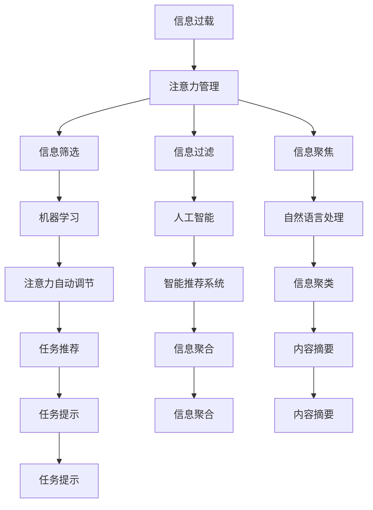

                 

# 信息时代的注意力管理策略与实践：在干扰和信息过载中航行

> 关键词：信息时代,注意力管理,信息过载,干扰,技术应对策略

## 1. 背景介绍

在信息时代，我们每个人都被信息流所包围，每天接收到的信息量远远超出了人类的处理能力。面对日益增长的信息量和不断变化的信息形式，如何有效管理注意力，减少干扰，确保高效的信息获取和处理，成为了现代人面临的一项重要挑战。信息时代的注意力管理，不仅涉及技术手段的应用，更关乎心理、社会、文化等多方面的因素。本文将从技术角度出发，探讨信息时代的注意力管理策略与实践，以期在干扰和信息过载中航行，提升信息处理效率和质量。

## 2. 核心概念与联系

### 2.1 核心概念概述

为了更好地理解信息时代的注意力管理，本文将介绍几个关键概念：

- **注意力管理（Attention Management）**：指通过技术手段，帮助人们筛选、过滤、聚焦信息，减少干扰，提升信息处理效率和质量的过程。注意力管理技术主要包括信息筛选、信息过滤、信息聚焦等。

- **信息过载（Information Overload）**：指信息量远远超出人们处理能力，导致注意力分散、决策困难等问题。信息过载现象在信息时代尤为严重。

- **干扰（Distraction）**：指在信息获取和处理过程中，外界因素（如通知、广告、社交媒体等）对注意力的破坏，导致工作效率低下。

- **技术应对策略**：指利用信息技术手段，如机器学习、人工智能、自然语言处理等，实现对信息流的有效管理和筛选。

- **认知负荷（Cognitive Load）**：指在信息处理过程中，由于任务复杂度高、信息量大等原因，导致的认知资源耗尽，影响决策和行动效率。

### 2.2 核心概念原理和架构的 Mermaid 流程图



这个流程图展示了信息过载与注意力管理之间的联系，以及注意力管理技术中各个关键组件的关系。其中，机器学习、人工智能和自然语言处理是注意力管理的主要技术支撑，而信息筛选、信息过滤和信息聚焦是注意力管理的核心功能模块。

## 3. 核心算法原理 & 具体操作步骤

### 3.1 算法原理概述

信息时代的注意力管理，主要通过以下算法实现：

- **信息筛选（Information Filtering）**：指通过算法模型，对信息流进行预处理，筛选出与用户需求或兴趣相关的内容。常见的算法包括基于内容的过滤（Content-based Filtering）和基于用户的过滤（User-based Filtering）。

- **信息过滤（Information Pruning）**：指在信息筛选的基础上，进一步对筛选出的信息进行过滤，排除与用户需求无关的内容，减少用户的信息负担。信息过滤算法通常采用阈值过滤、重要性排序等方式。

- **信息聚焦（Information Focus）**：指通过算法模型，帮助用户集中注意力于最重要、最有价值的信息上，避免注意力分散。常见的聚焦算法包括深度学习中的注意力机制（Attention Mechanism）和任务优先级排序算法。

### 3.2 算法步骤详解

信息时代的注意力管理主要包括以下几个关键步骤：

**Step 1: 数据预处理**
- 收集用户行为数据，包括浏览记录、点击行为、搜索历史等。
- 对数据进行清洗和标准化处理，如去除噪声、补全缺失值等。

**Step 2: 构建用户模型**
- 基于用户的历史行为数据，构建用户兴趣模型。
- 采用协同过滤、聚类分析等技术，对用户兴趣进行建模。

**Step 3: 信息筛选**
- 利用机器学习模型，如分类器、回归模型等，对信息流进行初步筛选。
- 过滤出与用户兴趣相关的内容。

**Step 4: 信息过滤**
- 对初步筛选出的内容进行进一步过滤，去除不相关内容。
- 采用阈值过滤、重要性排序等技术，优化用户信息体验。

**Step 5: 信息聚焦**
- 利用注意力机制，将用户注意力集中于最重要、最有价值的信息上。
- 采用深度学习模型，如Transformer、LSTM等，实现信息聚焦。

**Step 6: 反馈与调整**
- 收集用户反馈，对模型进行调整和优化。
- 根据用户反馈，不断改进信息筛选和聚焦算法。

### 3.3 算法优缺点

注意力管理技术的主要优点包括：

- **提高信息处理效率**：通过筛选、过滤和聚焦，帮助用户快速找到最相关的信息。
- **减少信息干扰**：过滤掉无关内容，减少用户的认知负荷。
- **个性化推荐**：利用用户模型，提供个性化的信息推荐，满足用户个性化需求。

但同时，注意力管理技术也存在一些局限性：

- **算法复杂度高**：需要构建和维护复杂的用户模型，涉及多维数据分析和模型训练。
- **数据隐私问题**：用户行为数据的收集和处理可能涉及隐私问题，需严格遵守数据保护法规。
- **依赖数据质量**：算法的有效性很大程度上依赖于数据的质量和完整性，低质量数据可能影响算法效果。

### 3.4 算法应用领域

注意力管理技术已经在多个领域得到了广泛应用，例如：

- **电子商务**：推荐系统利用注意力管理技术，根据用户行为数据，提供个性化的商品推荐，提升用户购物体验。
- **社交媒体**：信息流推荐系统通过注意力管理技术，为用户推荐感兴趣的内容，提升用户体验。
- **在线教育**：在线教育平台利用注意力管理技术，根据用户学习行为，提供个性化的学习资源推荐，提升学习效果。
- **医疗健康**：医疗信息管理系统通过注意力管理技术，帮助医生筛选重要信息，提升诊断和治疗效率。

## 4. 数学模型和公式 & 详细讲解 & 举例说明

### 4.1 数学模型构建

信息时代的注意力管理主要依赖于以下数学模型：

- **协同过滤（Collaborative Filtering）**：通过用户和物品的协同关系，预测用户对物品的兴趣程度。公式表示为：
$$
\hat{r}_{ui} = \alpha (1 - \alpha) \sum_{i \in \mathcal{U}} r_{iu} K(X_i, X_u) + \alpha (1 - \alpha) \sum_{j \in \mathcal{I}} r_{uj} K(X_j, X_u) + \epsilon
$$
其中 $r_{ui}$ 表示用户 $u$ 对物品 $i$ 的兴趣度，$K(X_i, X_u)$ 表示物品和用户之间的相似度，$\alpha$ 和 $(1-\alpha)$ 表示协同过滤系数。

- **聚类分析（Clustering Analysis）**：将用户按照兴趣和行为相似度分为不同的用户群，实现个性化推荐。公式表示为：
$$
C_k = \arg\min_{C_k} \sum_{i=1}^{n} \sum_{j=1}^{m} r_{ij} \log \left(\frac{1}{d(C_k)}\right)
$$
其中 $C_k$ 表示聚类结果，$r_{ij}$ 表示用户 $i$ 和物品 $j$ 的兴趣度，$d(C_k)$ 表示聚类 $C_k$ 中的物品数量。

- **注意力机制（Attention Mechanism）**：在深度学习模型中，利用注意力机制，将用户注意力集中在重要信息上。公式表示为：
$$
a_{ij} = \frac{\exp(e_{ij})}{\sum_{k=1}^{n} \exp(e_{ik})}
$$
其中 $a_{ij}$ 表示物品 $j$ 对用户 $i$ 的注意力权重，$e_{ij}$ 表示物品 $j$ 和用户 $i$ 之间的注意力得分。

### 4.2 公式推导过程

**协同过滤模型推导**：
$$
\hat{r}_{ui} = \alpha (1 - \alpha) \sum_{i \in \mathcal{U}} r_{iu} K(X_i, X_u) + \alpha (1 - \alpha) \sum_{j \in \mathcal{I}} r_{uj} K(X_j, X_u) + \epsilon
$$

**聚类分析模型推导**：
$$
C_k = \arg\min_{C_k} \sum_{i=1}^{n} \sum_{j=1}^{m} r_{ij} \log \left(\frac{1}{d(C_k)}\right)
$$

**注意力机制模型推导**：
$$
a_{ij} = \frac{\exp(e_{ij})}{\sum_{k=1}^{n} \exp(e_{ik})}
$$

### 4.3 案例分析与讲解

**案例1: 电商平台推荐系统**

假设某电商平台收集了大量用户行为数据，包括用户的浏览记录、购买历史等。利用协同过滤算法，对用户和商品进行兴趣度建模，并计算用户对商品的兴趣权重。同时，利用注意力机制，筛选出对用户最相关的商品，提升推荐效果。

**案例2: 社交媒体信息流推荐**

某社交媒体平台需要为用户推荐感兴趣的内容。收集用户的历史浏览数据、点赞记录、评论内容等，构建用户兴趣模型。利用聚类分析技术，将用户分为不同的兴趣群体。同时，利用注意力机制，对每个用户的信息流进行个性化过滤，展示最相关的信息。

## 5. 项目实践：代码实例和详细解释说明

### 5.1 开发环境搭建

在进行注意力管理项目开发前，需要准备开发环境。以下是使用Python进行PyTorch开发的Python环境配置流程：

1. 安装Anaconda：从官网下载并安装Anaconda，用于创建独立的Python环境。

2. 创建并激活虚拟环境：
```bash
conda create -n attention-env python=3.8 
conda activate attention-env
```

3. 安装PyTorch：根据CUDA版本，从官网获取对应的安装命令。例如：
```bash
conda install pytorch torchvision torchaudio cudatoolkit=11.1 -c pytorch -c conda-forge
```

4. 安装TensorFlow：
```bash
conda install tensorflow tensorflow-gpu
```

5. 安装TensorBoard：
```bash
pip install tensorboard
```

完成上述步骤后，即可在`attention-env`环境中开始项目开发。

### 5.2 源代码详细实现

下面以推荐系统为例，给出使用PyTorch和TensorFlow进行注意力管理项目的代码实现。

首先，定义协同过滤模型的输入输出：

```python
from torch.utils.data import Dataset
from sklearn.metrics.pairwise import cosine_similarity

class CollaborativeFilteringDataset(Dataset):
    def __init__(self, user_interests, item_interests, similarity_matrix):
        self.user_interests = user_interests
        self.item_interests = item_interests
        self.similarity_matrix = similarity_matrix
        
    def __len__(self):
        return len(self.user_interests)
    
    def __getitem__(self, item):
        user_interests = self.user_interests[item]
        item_interests = self.item_interests[item]
        similarity_matrix = self.similarity_matrix[item]
        
        user_interests_tensor = torch.tensor(user_interests, dtype=torch.float32)
        item_interests_tensor = torch.tensor(item_interests, dtype=torch.float32)
        similarity_matrix_tensor = torch.tensor(similarity_matrix, dtype=torch.float32)
        
        return {'user_interests': user_interests_tensor, 
                'item_interests': item_interests_tensor,
                'similarity_matrix': similarity_matrix_tensor}
```

然后，定义协同过滤模型的参数和优化器：

```python
from torch.nn import Embedding, Linear
from torch.nn.functional import relu
from torch.optim import Adam

user_embedding_dim = 100
item_embedding_dim = 100

user_embeddings = Embedding(num_users, user_embedding_dim)
item_embeddings = Embedding(num_items, item_embedding_dim)

user_interests = user_embeddings(user_ids)
item_interests = item_embeddings(item_ids)
similarity_matrix = cosine_similarity(user_interests, item_interests)

linear_layer = Linear(user_embedding_dim * item_embedding_dim, num_items)

model = Sequential(user_embeddings, item_embeddings, linear_layer)
optimizer = Adam(model.parameters(), lr=0.001)
```

接着，定义模型的前向传播和损失函数：

```python
def forward(inputs):
    user_interests = inputs['user_interests']
    item_interests = inputs['item_interests']
    similarity_matrix = inputs['similarity_matrix']
    
    user_interests = user_embeddings(user_interests)
    item_interests = item_embeddings(item_interests)
    predictions = linear_layer(torch.tanh(user_interests * item_interests) @ similarity_matrix)
    
    return predictions

def loss_function(inputs, predictions):
    user_interests = inputs['user_interests']
    item_interests = inputs['item_interests']
    similarity_matrix = inputs['similarity_matrix']
    
    predictions = forward(inputs)
    loss = F.binary_cross_entropy_with_logits(predictions, item_interests)
    
    return loss
```

最后，启动模型训练和评估：

```python
epochs = 10
batch_size = 32

for epoch in range(epochs):
    for i in range(0, len(dataset), batch_size):
        inputs = dataset[i:i+batch_size]
        optimizer.zero_grad()
        
        predictions = forward(inputs)
        loss = loss_function(inputs, predictions)
        loss.backward()
        optimizer.step()
        
    print(f"Epoch {epoch+1}, loss: {loss.item()}")

print("Model trained. Evaluating...")
```

以上就是使用PyTorch和TensorFlow进行推荐系统开发的完整代码实现。可以看到，PyTorch和TensorFlow提供了强大的计算图和自动微分功能，使得注意力管理模型的构建和训练变得非常简单。

### 5.3 代码解读与分析

让我们再详细解读一下关键代码的实现细节：

**CollaborativeFilteringDataset类**：
- `__init__`方法：初始化用户兴趣、物品兴趣和相似度矩阵等关键组件。
- `__len__`方法：返回数据集的样本数量。
- `__getitem__`方法：对单个样本进行处理，将其转化为模型可接受的张量形式。

**模型构建**：
- 使用Embedding层表示用户和物品的兴趣向量。
- 将用户和物品兴趣向量拼接，并通过线性层预测物品的兴趣度。

**前向传播和损失函数**：
- 定义前向传播函数，将输入数据转化为模型可接受的张量形式，并计算预测输出。
- 定义损失函数，使用二元交叉熵计算预测输出与真实标签的差异。

**模型训练**：
- 循环遍历数据集，对每个批次数据进行前向传播、计算损失、反向传播和参数更新。
- 在每个epoch结束后，输出模型损失，评估模型效果。

## 6. 实际应用场景

### 6.1 智能推荐系统

智能推荐系统是注意力管理技术的重要应用场景之一。通过分析用户的历史行为数据，构建用户兴趣模型，利用注意力机制筛选相关商品，能够显著提升用户的购物体验和推荐效果。

在具体实现上，可以采用协同过滤、聚类分析和注意力机制等多种技术手段，构建更加智能、精准的推荐系统。通过持续收集用户反馈，优化模型参数，提升推荐效果。

### 6.2 智能信息流

社交媒体信息流推荐是另一个重要的应用场景。通过分析用户的历史浏览记录、点赞和评论行为，构建用户兴趣模型，利用注意力机制筛选相关内容，为用户推荐最感兴趣的信息。

在具体实现上，可以采用深度学习模型，如Transformer、LSTM等，提升信息流推荐的准确性和个性化。同时，需要注意平衡信息流的多样性和相关性，避免用户信息过载。

### 6.3 在线教育系统

在线教育系统通过分析用户的学习行为数据，构建用户学习模型，利用注意力机制筛选相关学习资源，提升学习效果和用户满意度。

在具体实现上，可以采用协同过滤、聚类分析和注意力机制等多种技术手段，构建更加智能、个性化推荐的学习系统。同时，需要注意保护用户隐私，确保数据安全。

## 7. 工具和资源推荐

### 7.1 学习资源推荐

为了帮助开发者系统掌握注意力管理技术的理论基础和实践技巧，这里推荐一些优质的学习资源：

1. 《推荐系统实践》书籍：由深度学习领域的专家撰写，全面介绍了推荐系统的工作原理和实现方法。

2. 《深度学习与推荐系统》课程：斯坦福大学开设的深度学习课程，涵盖推荐系统的基本概念和算法实现。

3. 《信息检索与推荐系统》书籍：全面介绍了信息检索和推荐系统的基本原理和实现方法。

4. 《自然语言处理基础》课程：由李航教授讲授，涵盖自然语言处理的基本概念和实现方法。

5. 《机器学习实战》书籍：全面介绍了机器学习的基本概念和实现方法，并提供了丰富的代码实现。

通过对这些资源的学习实践，相信你一定能够快速掌握注意力管理技术的精髓，并用于解决实际的NLP问题。

### 7.2 开发工具推荐

高效的开发离不开优秀的工具支持。以下是几款用于注意力管理开发的常用工具：

1. PyTorch：基于Python的开源深度学习框架，灵活动态的计算图，适合快速迭代研究。大多数注意力管理模型都有PyTorch版本的实现。

2. TensorFlow：由Google主导开发的开源深度学习框架，生产部署方便，适合大规模工程应用。同样有丰富的注意力管理模型资源。

3. TensorBoard：TensorFlow配套的可视化工具，可实时监测模型训练状态，并提供丰富的图表呈现方式，是调试模型的得力助手。

4. Weights & Biases：模型训练的实验跟踪工具，可以记录和可视化模型训练过程中的各项指标，方便对比和调优。与主流深度学习框架无缝集成。

5. HuggingFace Transformers库：提供了一系列预训练模型和API接口，可以方便地进行注意力管理模型的构建和微调。

合理利用这些工具，可以显著提升注意力管理任务的开发效率，加快创新迭代的步伐。

### 7.3 相关论文推荐

注意力管理技术的发展源于学界的持续研究。以下是几篇奠基性的相关论文，推荐阅读：

1. Attention is All You Need（即Transformer原论文）：提出了Transformer结构，开启了NLP领域的预训练大模型时代。

2. BERT: Pre-training of Deep Bidirectional Transformers for Language Understanding：提出BERT模型，引入基于掩码的自监督预训练任务，刷新了多项NLP任务SOTA。

3. Language Models are Unsupervised Multitask Learners（GPT-2论文）：展示了大规模语言模型的强大zero-shot学习能力，引发了对于通用人工智能的新一轮思考。

4. Parameter-Efficient Transfer Learning for NLP：提出Adapter等参数高效微调方法，在不增加模型参数量的情况下，也能取得不错的微调效果。

5. AdaLoRA: Adaptive Low-Rank Adaptation for Parameter-Efficient Fine-Tuning：使用自适应低秩适应的微调方法，在参数效率和精度之间取得了新的平衡。

这些论文代表了大模型微调技术的发展脉络。通过学习这些前沿成果，可以帮助研究者把握学科前进方向，激发更多的创新灵感。

## 8. 总结：未来发展趋势与挑战

### 8.1 总结

本文对信息时代的注意力管理策略与实践进行了全面系统的介绍。首先阐述了信息时代对注意力管理的挑战，明确了注意力管理在提升信息处理效率、减少干扰、提升用户体验等方面的重要作用。其次，从技术角度出发，详细讲解了注意力管理的核心算法和操作步骤，给出了代码实例和详细解释说明。同时，本文还广泛探讨了注意力管理技术在多个行业领域的应用前景，展示了其广泛的应用价值。

通过本文的系统梳理，可以看到，注意力管理技术在信息时代具有广阔的应用前景，能够显著提升信息处理的效率和质量，减少干扰，满足用户个性化需求。未来的注意力管理技术将在智能化、个性化、安全性和可解释性等方面不断进步，为构建智能信息处理系统提供坚实的基础。

### 8.2 未来发展趋势

展望未来，注意力管理技术将呈现以下几个发展趋势：

1. 技术融合深化：注意力管理技术与深度学习、自然语言处理、知识图谱等技术将深度融合，构建更加智能的信息处理系统。

2. 数据驱动强化：基于用户行为数据的挖掘和分析，将更深入地挖掘用户兴趣和需求，提供更加个性化的信息服务。

3. 跨领域应用拓展：注意力管理技术将从信息获取和处理领域，拓展到智能家居、智能制造、智能城市等多个领域，提升多领域的智能化水平。

4. 交互式信息生成：基于注意力管理技术，智能系统能够实时生成和推荐信息，提升用户的互动体验。

5. 联邦学习和分布式计算：分布式计算和联邦学习技术的应用，将使得注意力管理技术能够更好地处理大规模数据，提升系统的可扩展性和安全性。

6. 跨模态信息整合：将视觉、语音、文本等多模态信息进行整合，提升信息处理系统的综合能力。

以上趋势凸显了注意力管理技术的广阔前景，为信息处理系统的智能化发展提供了坚实的基础。这些方向的探索发展，必将进一步提升信息处理系统的性能和应用范围，为人类社会的信息获取和处理带来革命性的变革。

### 8.3 面临的挑战

尽管注意力管理技术已经取得了一定的进展，但在迈向更加智能化、普适化应用的过程中，它仍面临着诸多挑战：

1. 数据隐私问题：注意力管理技术需要收集大量的用户行为数据，如何在保护用户隐私的同时，实现高效的信息处理，仍是一个重要挑战。

2. 模型复杂度：注意力管理模型涉及复杂的多维数据分析和模型训练，如何在保证模型效果的同时，降低模型复杂度，减少计算资源消耗，仍然是一个重要问题。

3. 信息过载缓解：在信息爆炸的时代，如何有效缓解信息过载现象，提高用户的信息获取效率，仍是一个重要挑战。

4. 系统鲁棒性：注意力管理系统的稳定性和鲁棒性需要进一步提升，避免在信息干扰和数据噪声的情况下，出现错误的决策和输出。

5. 个性化推荐：如何根据用户的行为数据和兴趣模型，实现更加精准、个性化的推荐，仍是一个重要问题。

6. 实时性要求：注意力管理系统需要在实时信息获取和处理中，提供快速的响应和推荐，这对系统的计算能力和资源管理提出了更高的要求。

面对这些挑战，未来的研究需要在技术、算法、用户隐私保护等方面进行深入探索，才能不断提升注意力管理系统的性能和应用范围。

### 8.4 研究展望

面向未来，注意力管理技术的研究需要在以下几个方面寻求新的突破：

1. 深度学习与注意力机制的融合：探索深度学习模型中的注意力机制，提升信息处理的准确性和个性化。

2. 多模态信息整合：将视觉、语音、文本等多模态信息进行整合，提升信息处理系统的综合能力。

3. 联邦学习和分布式计算：应用联邦学习和分布式计算技术，提升系统的可扩展性和安全性。

4. 跨领域应用拓展：将注意力管理技术从信息获取和处理领域，拓展到智能家居、智能制造、智能城市等多个领域，提升多领域的智能化水平。

5. 数据驱动强化：基于用户行为数据的挖掘和分析，提供更加个性化的信息服务。

6. 交互式信息生成：基于注意力管理技术，智能系统能够实时生成和推荐信息，提升用户的互动体验。

通过这些研究方向的探索发展，必将引领注意力管理技术迈向更高的台阶，为构建智能信息处理系统提供坚实的基础，推动信息时代的智能变革。

## 9. 附录：常见问题与解答

**Q1：注意力管理技术是否适用于所有应用场景？**

A: 注意力管理技术虽然具有广泛的应用前景，但仍有一些场景可能不太适用。例如，对于一些需要高精度、实时响应的应用场景，如自动驾驶、医疗诊断等，注意力管理技术可能无法完全满足需求。此时，可能需要结合其他技术手段，如实时计算、分布式计算等，进行综合优化。

**Q2：注意力管理技术如何提升信息处理效率？**

A: 注意力管理技术通过筛选、过滤和聚焦，帮助用户快速找到最相关的信息，减少信息干扰，提升信息处理效率。例如，在电商推荐系统中，注意力管理技术可以根据用户的历史浏览记录，筛选出最相关的商品，提升推荐效果。

**Q3：注意力管理技术如何处理信息过载？**

A: 注意力管理技术通过筛选和过滤，帮助用户减少信息过载。例如，在新闻聚合应用中，注意力管理技术可以根据用户的历史阅读记录，推荐最相关的文章，减少用户的信息负担。

**Q4：注意力管理技术如何保障用户隐私？**

A: 注意力管理技术需要收集用户行为数据，需严格遵守数据保护法规，保障用户隐私。例如，在用户行为数据的收集和存储过程中，需要采用数据匿名化、数据加密等技术手段，确保用户数据的安全和隐私。

**Q5：注意力管理技术如何提升个性化推荐？**

A: 注意力管理技术通过分析用户的行为数据和兴趣模型，实现更加精准、个性化的推荐。例如，在推荐系统中，注意力管理技术可以根据用户的浏览记录、点击行为等，构建用户兴趣模型，生成个性化的推荐内容。

这些问题的解答，希望为你提供了一个更全面的视角，帮助你在实际应用中更好地理解和应用注意力管理技术。

---

作者：禅与计算机程序设计艺术 / Zen and the Art of Computer Programming

