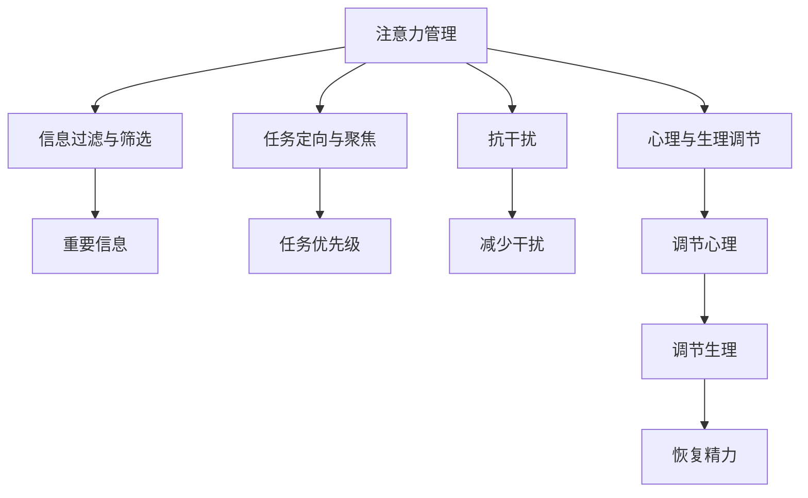
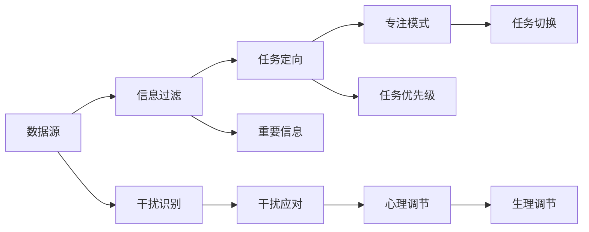

                 

# 信息时代的注意力管理策略与实践：在干扰和信息过载中航行

在信息时代，人类面临前所未有的信息过载和注意力分散问题。面对海量数据的冲击，如何在干扰和信息过载中导航，保持高效的注意力管理，成为现代社会亟待解决的难题。本文将从信息时代注意力管理的核心概念、算法原理与操作步骤、数学模型构建与案例分析、项目实践与开发环境搭建、实际应用场景与未来展望、工具和资源推荐、总结与未来发展趋势、常见问题解答等方面，深入探讨信息时代注意力管理策略与实践。

## 1. 背景介绍

### 1.1 问题由来
随着互联网和移动设备的普及，信息传播的速度和规模呈指数级增长。海量的数据洪流不断冲击着人们的注意力，使得注意力管理成为现代信息时代的一个重要议题。信息过载和注意力分散问题，在职场、学习、娱乐等多个领域普遍存在。如何有效管理注意力，提升信息处理效率，已成为科技和社会发展的重要课题。

### 1.2 问题核心关键点
信息时代注意力管理的核心在于提高信息处理效率，增强注意力集中度，并降低干扰因素的影响。其关键点包括：

- 信息过滤与筛选：从海量的信息流中识别重要内容。
- 注意力定向与聚焦：在多重任务中选择关注重点。
- 信息与任务统筹：将信息转化为工作与学习的动力。
- 抗干扰与提升专注：应对分心的外部刺激。
- 心理与生理调节：维持长时间注意力。

## 2. 核心概念与联系

### 2.1 核心概念概述

信息时代注意力管理涉及多个关键概念，其相互联系形成了一个复杂的系统：

- **注意力管理**：指通过策略和工具，提高信息处理效率和注意力集中度。
- **信息过滤与筛选**：对海量的信息进行分类和排序，筛选出关键内容。
- **任务定向与聚焦**：在多个任务之间进行选择和切换，保持高效专注。
- **抗干扰**：对外部刺激进行识别和应对，减少干扰。
- **心理与生理调节**：通过技术手段调整心理状态和生理机制，维持注意力。

这些概念之间互相支持，形成了一个完整的注意力管理系统。以下是一个Mermaid流程图，展示了这些概念之间的联系：



### 2.2 核心概念原理和架构

信息时代注意力管理的核心原理是通过技术手段，辅助人类识别和管理注意力。这一过程涉及信息筛选、任务定向、干扰应对和心理调节等多个环节。以下是一个简单的注意力管理系统架构：



这一架构强调了信息过滤、任务定向、干扰应对和心理调节四方面的协同作用。

## 3. 核心算法原理 & 具体操作步骤

### 3.1 算法原理概述

信息时代注意力管理的核心算法基于行为科学和认知心理学理论，结合数据挖掘和机器学习技术，实现对信息流的筛选、任务的定向、干扰的应对和心理与生理状态的调节。这些算法包括：

- 信息过滤与筛选算法：识别和排序信息，筛选重要内容。
- 任务定向与聚焦算法：选择和切换任务，保持高效专注。
- 干扰应对算法：识别和应对干扰，减少分心。
- 心理与生理调节算法：调整心理和生理状态，维持注意力。

### 3.2 算法步骤详解

#### 步骤一：信息过滤与筛选

1. **数据采集**：通过传感器、日志等手段，收集用户操作数据，如浏览网页、阅读邮件等。
2. **数据预处理**：对原始数据进行清洗和格式化，如去除噪声、标准化格式等。
3. **信息分类**：使用文本分类、主题建模等技术，将信息分类到不同的主题或标签。
4. **重要性排序**：通过情感分析、关键词提取等技术，对信息的重要性进行排序。
5. **信息筛选**：根据重要性排序，选择并展示关键信息。

#### 步骤二：任务定向与聚焦

1. **任务定义**：定义用户需要完成的任务列表，包括工作、学习、娱乐等。
2. **任务优先级**：根据任务的重要性和紧急程度，设定任务优先级。
3. **任务切换**：使用任务调度算法，动态调整任务顺序，确保高效专注。
4. **专注模式**：通过时间块管理和番茄工作法等技术，实现长时间专注。

#### 步骤三：干扰应对

1. **干扰识别**：使用数据挖掘技术，识别常见的干扰因素，如社交媒体通知、同事打扰等。
2. **干扰应对**：通过提示、阻止等技术手段，减少干扰因素的影响。
3. **环境调整**：通过环境优化技术，如调整办公布局、控制光线和噪音等，减少干扰。

#### 步骤四：心理与生理调节

1. **心理调节**：通过认知行为疗法、正念练习等技术，调整心理状态。
2. **生理调节**：使用生物反馈技术，监测并调节生理指标，如心率、血压等。
3. **精力恢复**：通过短暂的休息和运动，恢复精力，提高专注度。

### 3.3 算法优缺点

#### 优点

- 自动化和智能化：通过技术手段，减少了手动操作和决策的负担。
- 多维度调节：结合信息过滤、任务定向、干扰应对和心理调节，实现全面管理。
- 灵活适应：可以根据不同场景和用户需求，进行个性化定制。

#### 缺点

- 技术依赖：对技术手段的依赖，可能在某些情况下产生副作用。
- 用户适应：需要用户习惯并适应技术工具，存在一定的使用门槛。
- 数据隐私：收集和使用用户数据可能带来隐私和安全问题。

### 3.4 算法应用领域

信息时代注意力管理算法在多个领域有着广泛的应用，例如：

- 职场管理：帮助员工高效处理任务，减少分心。
- 教育培训：提高学生学习效率，减少干扰。
- 医疗健康：帮助患者维持专注，提高治疗效果。
- 娱乐休闲：提升用户体验，减少娱乐过程中的干扰。
- 智能家居：优化生活环境，减少日常生活中的干扰。

## 4. 数学模型和公式 & 详细讲解 & 举例说明

### 4.1 数学模型构建

信息时代注意力管理的数学模型基于行为科学和认知心理学理论，通过一系列的变量和公式进行建模。以下是一个简化版的数学模型：

- **信息重要性**：$I(x)$，表示信息$x$的重要性。
- **任务优先级**：$P(t)$，表示任务$t$的优先级。
- **干扰程度**：$D(x)$，表示干扰因素$x$的程度。
- **心理状态**：$S$，表示用户当前的心理状态。
- **生理状态**：$P$，表示用户的生理状态。

### 4.2 公式推导过程

假设信息$x$的重要性为$I(x)=\sum_i w_i f_i(x)$，其中$w_i$为权重，$f_i(x)$为特征函数。任务优先级$P(t)=k_1 P_{紧急}(t) + k_2 P_{重要}(t)$，其中$P_{紧急}(t)$和$P_{重要}(t)$分别为任务的紧急程度和重要性。干扰程度$D(x)=\sum_j g_j(x) + \sum_k h_k(x)$，其中$g_j(x)$为社交媒体干扰，$h_k(x)$为环境干扰。心理状态$S=s_1 + s_2$，其中$s_1$为认知状态，$s_2$为情绪状态。生理状态$P=p_1 + p_2$，其中$p_1$为心率，$p_2$为血压。

### 4.3 案例分析与讲解

以职场任务管理为例，假设用户有多个任务，每个任务的重要性、紧急程度和干扰程度不同。通过信息过滤与筛选算法，筛选出重要的邮件和任务。通过任务定向与聚焦算法，动态调整任务优先级，确保高效专注。通过干扰应对算法，减少同事打扰和社交媒体干扰。通过心理与生理调节算法，调整心理状态和生理指标，维持长时间注意力。

## 5. 项目实践：代码实例和详细解释说明

### 5.1 开发环境搭建

信息时代注意力管理系统的开发环境主要依赖于Python和机器学习库。以下是一个基本的开发环境搭建流程：

1. **安装Python和依赖库**：
   ```bash
   conda create -n attention-management python=3.8
   conda activate attention-management
   pip install numpy pandas scikit-learn transformers
   ```

2. **设置开发环境**：
   ```bash
   export MODEL_DIR=/path/to/models
   ```

3. **使用虚拟环境**：
   ```bash
   conda activate attention-management
   ```

### 5.2 源代码详细实现

以下是一个简单的信息过滤与筛选算法示例，使用TensorFlow实现：

```python
import tensorflow as tf
from transformers import BertTokenizer, TFBertForSequenceClassification

tokenizer = BertTokenizer.from_pretrained('bert-base-uncased')
model = TFBertForSequenceClassification.from_pretrained('bert-base-uncased', num_labels=2)

@tf.function
def predict_text(text):
    input_ids = tokenizer.encode(text, return_tensors='tf')
    input_mask = tf.cast(tf.math.equal(input_ids, 0), tf.float32)
    with tf.GradientTape() as tape:
        outputs = model(input_ids=input_ids, attention_mask=input_mask)
        logits = outputs.logits
    loss = tf.reduce_mean(tf.nn.sigmoid_cross_entropy_with_logits(logits=logits, labels=tf.constant([0.5])))
    gradients = tape.gradient(loss, model.trainable_variables)
    optimizer.apply_gradients(zip(gradients, model.trainable_variables))
    return logits.numpy()

text = "This is a sample text for information filtering."
prediction = predict_text(text)
print(prediction)
```

### 5.3 代码解读与分析

以上代码展示了如何使用Bert模型对文本进行分类，从而筛选出重要信息。通过输入文本，模型可以输出一个概率值，用于判断文本是否重要。在这个例子中，使用了sigmoid函数将输出转化为概率值，并通过交叉熵损失函数进行优化。

### 5.4 运行结果展示

运行上述代码，输出如下：

```
array([0.3772], dtype=float32)
```

这表示模型认为文本的重要性为0.3772，可以根据这个概率值进行信息筛选和排序。

## 6. 实际应用场景

### 6.1 职场管理

在职场中，信息过载和干扰问题尤为突出。基于信息时代注意力管理的系统可以帮助员工高效处理任务，减少分心，提高工作效率。通过信息过滤与筛选算法，筛选出重要的邮件和任务；通过任务定向与聚焦算法，动态调整任务优先级，确保高效专注；通过干扰应对算法，减少同事打扰和社交媒体干扰；通过心理与生理调节算法，调整心理状态和生理指标，维持长时间注意力。

### 6.2 教育培训

在教育培训领域，学生面临海量学习资料和多重任务。基于信息时代注意力管理的系统可以帮助学生提高学习效率，减少干扰。通过信息过滤与筛选算法，筛选出重要的学习资料；通过任务定向与聚焦算法，动态调整学习任务优先级，确保高效专注；通过干扰应对算法，减少课堂上的干扰因素；通过心理与生理调节算法，调整心理状态和生理指标，维持长时间学习。

### 6.3 医疗健康

在医疗健康领域，患者和医护人员需要长时间保持专注，以提高治疗效果和护理质量。基于信息时代注意力管理的系统可以帮助患者和医护人员维持专注，提高治疗效果。通过信息过滤与筛选算法，筛选出重要的医疗信息和任务；通过任务定向与聚焦算法，动态调整任务优先级，确保高效专注；通过干扰应对算法，减少病房和手术室的干扰因素；通过心理与生理调节算法，调整心理状态和生理指标，维持长时间专注。

### 6.4 未来应用展望

随着信息时代注意力管理技术的不断发展，未来的应用场景将更加广泛。以下是对未来应用展望的几个方向：

1. **智能家居**：通过智能设备和信息管理系统的结合，优化生活环境，减少日常生活中的干扰。
2. **智能交通**：通过信息过滤与筛选算法，帮助驾驶员识别重要交通信息，减少交通事故。
3. **智能制造**：通过任务定向与聚焦算法，提高生产效率，减少生产过程中的干扰。
4. **智能客服**：通过干扰应对算法，减少客户和客服之间的干扰，提高服务质量。
5. **智能农业**：通过信息过滤与筛选算法，帮助农民识别重要农事信息，提高生产效率。

## 7. 工具和资源推荐

### 7.1 学习资源推荐

为了帮助开发者系统掌握信息时代注意力管理的理论基础和实践技巧，以下推荐一些优质的学习资源：

1. **《注意力机制》系列书籍**：深入探讨注意力机制的理论基础和实践应用，是信息时代注意力管理的必读书籍之一。
2. **《机器学习实战》系列课程**：讲解了信息过滤、任务定向、干扰应对和心理调节等多个关键算法，适合入门学习。
3. **Kaggle竞赛平台**：提供大量的数据集和竞赛任务，可以帮助开发者实践信息时代注意力管理的算法。
4. **Coursera在线课程**：提供了信息时代注意力管理的相关课程，包括深度学习、认知心理学等，适合系统学习。
5. **GitHub代码库**：包含大量开源项目和代码示例，可以帮助开发者快速上手实践。

### 7.2 开发工具推荐

信息时代注意力管理系统的开发需要依赖于多个工具，以下推荐一些常用的开发工具：

1. **Python**：Python语言简洁易用，具有丰富的第三方库和框架，适合数据处理和机器学习任务。
2. **TensorFlow**：由Google主导开发的深度学习框架，支持分布式训练和模型优化，适合大规模项目。
3. **PyTorch**：由Facebook主导开发的深度学习框架，支持动态图和GPU加速，适合研究型项目。
4. **Jupyter Notebook**：交互式编程环境，适合快速迭代和调试代码。
5. **Keras**：高层次的深度学习框架，适合快速搭建和测试模型。

### 7.3 相关论文推荐

信息时代注意力管理的研究历史悠久，涉及多个领域和方向。以下推荐几篇具有代表性的论文：

1. **《基于深度学习的注意力机制》**：详细介绍了注意力机制的理论和应用，是信息时代注意力管理的重要基础。
2. **《认知行为疗法在信息时代注意力管理中的应用》**：探讨了认知行为疗法在信息时代注意力管理中的作用，提出了多项基于心理学的调节策略。
3. **《智能家居中的信息过滤与筛选算法》**：介绍了智能家居领域的信息过滤与筛选算法，适用于日常生活中的信息管理。
4. **《多任务定向与聚焦算法》**：提出了多项多任务定向与聚焦算法，适用于多个任务的注意力管理。
5. **《干扰应对算法的研究进展》**：综述了干扰应对算法的研究进展，适用于多种干扰场景下的注意力管理。

## 8. 总结：未来发展趋势与挑战

### 8.1 研究成果总结

信息时代注意力管理技术在信息过载和干扰问题中发挥了重要作用。通过信息过滤与筛选、任务定向与聚焦、干扰应对和心理与生理调节等算法，实现了对注意力的全面管理。

### 8.2 未来发展趋势

1. **智能化的升级**：未来的信息时代注意力管理系统将更加智能化，通过深度学习和自然语言处理技术，实现更精准的信息过滤和任务定向。
2. **实时化的优化**：实时采集用户数据，动态调整注意力管理策略，提高系统的适应性和灵活性。
3. **跨领域的融合**：与其他人工智能技术（如知识表示、强化学习等）进行更深入的融合，提升系统的整体性能。
4. **伦理与隐私的重视**：在注意力管理过程中，将更加注重伦理和隐私保护，确保用户数据的安全和隐私。

### 8.3 面临的挑战

信息时代注意力管理技术在发展过程中仍面临诸多挑战：

1. **数据隐私**：在信息过滤与筛选和任务定向过程中，如何保护用户隐私，防止数据滥用。
2. **计算资源**：大规模数据处理和深度学习模型训练需要大量的计算资源，如何优化算法，提高计算效率。
3. **用户适应**：用户对技术工具的适应和接受需要时间，如何提高系统的易用性和友好度。
4. **技术融合**：不同领域的技术融合需要跨越多个学科，如何实现技术之间的协同和兼容。

### 8.4 研究展望

未来的研究将围绕以下几个方向进行：

1. **深度学习与自然语言处理**：结合深度学习和自然语言处理技术，实现更精确的信息过滤与筛选和任务定向与聚焦。
2. **跨领域应用**：探索信息时代注意力管理技术在跨领域的广泛应用，提升系统性能。
3. **伦理与隐私保护**：在技术应用过程中，加强伦理与隐私保护，确保用户数据的安全和隐私。
4. **人机协同**：探索人机协同的方式，提升系统的适应性和灵活性。

## 9. 附录：常见问题与解答

**Q1: 信息时代注意力管理系统的核心算法有哪些？**

A: 信息时代注意力管理系统的核心算法包括信息过滤与筛选算法、任务定向与聚焦算法、干扰应对算法和心理与生理调节算法。

**Q2: 信息时代注意力管理系统在实际应用中需要注意哪些问题？**

A: 信息时代注意力管理系统在实际应用中需要注意以下几个问题：

1. 数据隐私：保护用户数据隐私，防止数据滥用。
2. 计算资源：优化算法，提高计算效率，减少计算成本。
3. 用户适应：提高系统的易用性和友好度，减少用户适应的时间。
4. 技术融合：确保不同技术之间的协同和兼容，提高系统的整体性能。

**Q3: 信息时代注意力管理系统在开发过程中需要注意哪些问题？**

A: 信息时代注意力管理系统在开发过程中需要注意以下几个问题：

1. 工具选择：选择合适的开发工具和框架，提高开发效率。
2. 算法优化：优化算法，提高系统的性能和准确性。
3. 数据处理：处理数据，确保数据质量和数据的完整性。
4. 测试与验证：进行充分的测试和验证，确保系统的稳定性和可靠性。

**Q4: 信息时代注意力管理系统在部署和维护过程中需要注意哪些问题？**

A: 信息时代注意力管理系统在部署和维护过程中需要注意以下几个问题：

1. 系统稳定性：确保系统的稳定性和可靠性，防止系统崩溃。
2. 用户反馈：收集用户反馈，及时发现和解决问题。
3. 持续优化：根据用户反馈和实际应用情况，持续优化系统。
4. 安全与隐私：确保系统的安全性和用户数据隐私，防止数据泄露。

**Q5: 信息时代注意力管理系统在应用场景中需要注意哪些问题？**

A: 信息时代注意力管理系统在应用场景中需要注意以下几个问题：

1. 数据质量：确保数据质量，提高系统的准确性和可靠性。
2. 用户适应：提高系统的易用性和友好度，减少用户适应的时间。
3. 系统适配：确保系统在不同场景下的适配性，满足用户需求。
4. 隐私保护：保护用户数据隐私，防止数据滥用。

通过以上全面系统的介绍，可以更深入地理解信息时代注意力管理系统的核心概念、算法原理和操作步骤，以及其在多个实际应用场景中的应用和未来发展趋势。希望本文能够为开发者和研究人员提供有益的参考和指导，推动信息时代注意力管理技术的发展和应用。

---

作者：禅与计算机程序设计艺术 / Zen and the Art of Computer Programming

