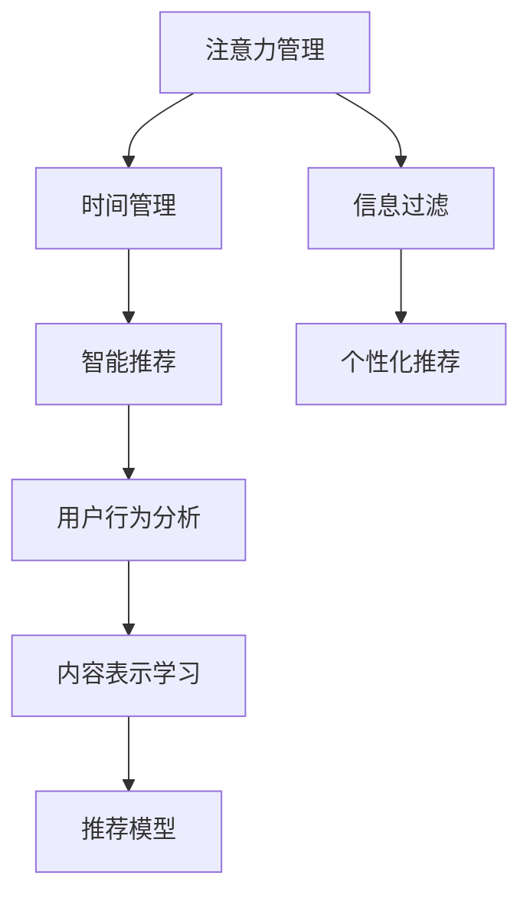

                 

## 1. 背景介绍

### 1.1 问题由来

随着互联网技术的飞速发展，我们正处于一个信息爆炸的时代。社交媒体、电子邮件、即时通讯、智能推荐系统等，不断将海量信息推送到我们的面前，导致我们的注意力被极度分散。信息过载与注意力流失，成为影响生产效率、工作和生活质量的主要问题。

### 1.2 问题核心关键点

信息时代的注意力管理主要关注如何在干扰和信息过载中，更有效地筛选和处理信息，保持专注，提高效率。注意量管理技术主要分为两大部分：一是主动型技术，包括智能推荐、信息过滤等，通过算法推荐用户感兴趣的信息；二是被动型技术，包括时间管理、工作规划等，帮助用户更好地管理时间和精力。

在技术实践中，注意量管理已经被广泛应用于在线广告、搜索引擎优化(SEO)、智能推荐系统、内容管理系统、在线教育等多个领域，帮助提升用户体验、提高运营效率、优化资源配置，构建更加智能化的人机交互系统。

### 1.3 问题研究意义

在信息爆炸的背景下，注意量管理技术的研究具有重要意义：

1. **提升用户体验**：通过智能推荐和信息过滤，减少用户信息干扰，提供更加个性化和相关性的信息。
2. **提高工作效率**：通过有效的时间管理和注意力分配，提升工作和学习的效率和质量。
3. **优化资源配置**：通过分析用户注意力模式，优化网站和应用的页面布局、广告投放策略，提升资源利用率。
4. **构建智能系统**：注意量管理技术的深入应用，使得在线系统更加智能化、人性化，能够更贴近用户需求。

## 2. 核心概念与联系

### 2.1 核心概念概述

为更好地理解注意量管理技术，本文将介绍几个核心概念：

- **注意力（Attention）**：在信息处理过程中，集中精力于某一项或某些事项。注意力管理的目标是提升用户的专注度，减少信息干扰。
- **信息过载（Information Overload）**：用户接收到的信息量远超其处理能力，导致无法有效筛选和处理信息，影响决策和行动。
- **信息过滤（Information Filtering）**：通过算法和工具，对信息进行筛选和排序，提供相关性和个性化较高的信息。
- **时间管理（Time Management）**：合理安排和分配时间，提升工作效率和质量，避免因信息干扰而浪费时间和精力。
- **智能推荐（Recommendation System）**：利用机器学习算法，根据用户行为和偏好，推荐用户感兴趣的内容。
- **个性化推荐（Personalized Recommendation）**：根据用户的个性化需求，提供量身定制的内容推荐，提高用户满意度。

这些核心概念之间相互联系，共同构成了信息时代注意量管理的框架。通过理解这些核心概念，我们可以更好地把握注意量管理的核心原理和实现路径。

### 2.2 核心概念原理和架构的 Mermaid 流程图



这个流程图展示了注意力管理技术与信息过滤、时间管理、智能推荐等核心概念之间的关系：

1. **注意力管理**：通过控制用户的注意力，减少信息干扰。
2. **信息过滤**：根据用户兴趣和行为，筛选相关信息，提升信息相关性。
3. **时间管理**：合理安排时间，提高工作效率和质量。
4. **智能推荐**：基于用户行为和偏好，推荐个性化的信息内容。
5. **用户行为分析**：通过用户交互数据，分析用户兴趣和行为。
6. **内容表示学习**：学习用户对内容的理解方式和表达形式。
7. **推荐模型**：基于用户行为和内容表示，生成推荐结果。

这些概念相互交织，共同构建了注意量管理技术的整体框架。

## 3. 核心算法原理 & 具体操作步骤

### 3.1 算法原理概述

注意量管理技术可以分为主动型和被动型两类。主动型技术通过算法推荐，减少用户信息干扰，提高信息的相关性和个性化；被动型技术通过时间管理、工作规划等手段，帮助用户有效分配注意力，提高工作效率和生活质量。

以智能推荐系统为例，其核心原理是通过用户行为和内容特征，学习用户兴趣模型，并生成推荐结果。

### 3.2 算法步骤详解

#### 3.2.1 智能推荐系统

**Step 1: 数据收集和预处理**
- 收集用户历史行为数据，包括浏览记录、点击行为、评分反馈等。
- 对数据进行清洗和去重，去除无效和噪音数据。
- 将数据划分为训练集和测试集，用于模型训练和评估。

**Step 2: 特征提取**
- 将用户行为数据转化为数值型特征，如点击次数、评分值、停留时间等。
- 对内容进行特征提取，如文本关键词、类别标签、元数据等。
- 使用词嵌入技术（如word2vec、GloVe）对文本数据进行编码。

**Step 3: 模型训练**
- 使用协同过滤、深度学习等算法，训练用户兴趣模型。
- 使用排序算法（如排名损失函数）训练推荐模型，最小化预测与实际行为的差距。
- 通过交叉验证等技术优化模型参数，提升模型性能。

**Step 4: 模型评估和优化**
- 在测试集上评估推荐模型的精度和召回率，计算指标如AUC、DCG等。
- 利用A/B测试等方法，优化推荐算法和模型参数，提升用户体验。
- 引入对抗样本和对抗训练，增强模型的鲁棒性。

#### 3.2.2 时间管理工具

**Step 1: 任务和目标设定**
- 根据用户的工作习惯和目标，设定具体的工作任务和优先级。
- 定义时间窗口，如番茄工作法中的25分钟工作时间。

**Step 2: 任务拆分和分解**
- 将大任务拆分为多个子任务，明确每个子任务的完成时间和目标。
- 使用任务依赖图和甘特图等工具，规划任务执行顺序和时间分配。

**Step 3: 时间追踪和监控**
- 使用时间追踪工具（如Toggl、RescueTime）记录用户的工作时间和任务进展。
- 定期总结任务完成情况和实际工作时间，识别时间浪费点。
- 根据实际工作情况，调整任务优先级和执行时间。

**Step 4: 时间反馈和调整**
- 根据时间追踪和总结的结果，优化任务规划和时间分配。
- 引入时间管理工具（如番茄工作法）提高专注度和效率。
- 定期进行时间管理回顾和调整，持续改进时间管理策略。

### 3.3 算法优缺点

智能推荐系统具有以下优点：
- **个性化推荐**：根据用户兴趣，提供高度相关的内容，提升用户体验。
- **高效性**：通过算法优化，实时推荐内容，提高用户获取信息的效率。
- **数据驱动**：利用用户行为数据，进行动态调整，提升推荐效果。

但同时，智能推荐系统也存在一些缺点：
- **信息过载**：可能推荐过多相关内容，导致信息干扰。
- **隐私风险**：收集和分析用户行为数据，存在隐私泄露风险。
- **冷启动问题**：对于新用户，缺乏足够行为数据，难以进行精准推荐。

时间管理工具则具有以下优点：
- **计划性**：通过时间规划，合理安排工作和生活，提高效率。
- **可视性**：使用可视化工具，直观了解任务进展和时间分配。
- **适应性**：根据实际情况，灵活调整任务优先级和执行时间。

但同时，时间管理工具也存在一些缺点：
- **主观性强**：时间管理效果依赖用户主观能动性和执行力。
- **灵活性不足**：可能过于拘泥于计划，影响应对突发情况的能力。
- **依赖工具**：工具使用不当，可能反而降低效率。

### 3.4 算法应用领域

智能推荐系统在多个领域得到广泛应用，例如：

- **电子商务**：推荐商品和广告，提高用户购物体验。
- **新闻阅读**：推荐新闻文章，提升阅读效率和质量。
- **在线教育**：推荐课程和资源，帮助用户学习提升。
- **视频平台**：推荐视频内容，提升用户观影体验。
- **社交媒体**：推荐用户兴趣内容，丰富用户社交体验。

时间管理工具在多个领域也得到了广泛应用，例如：

- **项目管理**：规划和监控项目进度，提高项目管理效率。
- **日常工作**：规划每日任务，提升工作效率和质量。
- **学习计划**：制定学习计划，提升学习效果。
- **健康管理**：规划运动和饮食，提升健康水平。
- **财务管理**：规划财务预算，提高财务规划和管理能力。

## 4. 数学模型和公式 & 详细讲解 & 举例说明

### 4.1 数学模型构建

智能推荐系统的核心模型可以形式化为一个矩阵分解问题。设用户集合为 $U$，物品集合为 $I$，用户对物品的评分矩阵为 $R \in \mathbb{R}^{m \times n}$，其中 $m$ 为用户数，$n$ 为物品数，$R_{ij}$ 表示用户 $i$ 对物品 $j$ 的评分。设用户行为特征为 $X \in \mathbb{R}^{m \times d}$，物品特征为 $Y \in \mathbb{R}^{n \times d}$，其中 $d$ 为特征维度。设用户兴趣向量为 $\hat{\alpha} \in \mathbb{R}^d$，物品特征向量为 $\hat{\beta} \in \mathbb{R}^d$，满足 $\hat{\alpha} = \alpha \cdot X$，$\hat{\beta} = \beta \cdot Y$，其中 $\alpha, \beta$ 为线性变换矩阵。则推荐模型的预测评分 $r_{ij}$ 可以表示为：

$$
r_{ij} = \hat{\alpha}^T \cdot \hat{\beta}_j
$$

### 4.2 公式推导过程

假设用户 $i$ 对物品 $j$ 的真实评分 $R_{ij}$ 可以分解为 $U_i \cdot V_j^T$，其中 $U \in \mathbb{R}^{m \times k}$ 和 $V \in \mathbb{R}^{k \times n}$ 为低秩矩阵，$k$ 为潜在因子数。则有：

$$
R \approx UV^T
$$

对 $U$ 和 $V$ 进行矩阵分解，可以得到：

$$
\begin{aligned}
U &= \hat{U} \cdot A \\
V &= \hat{V} \cdot B^T
\end{aligned}
$$

其中 $A \in \mathbb{R}^{m \times k}$ 和 $B \in \mathbb{R}^{k \times n}$ 为变换矩阵，$\hat{U} \in \mathbb{R}^{m \times k}$ 和 $\hat{V} \in \mathbb{R}^{k \times n}$ 为分解后的低秩矩阵。

将上式代入推荐模型中，可以得到：

$$
r_{ij} = \hat{U}_i^T \cdot \hat{V}_j
$$

在实际应用中，通常使用交替最小二乘法（ALS）等优化算法，对用户和物品的兴趣向量进行训练。优化目标最小化预测评分与真实评分的误差，即：

$$
\min_{\alpha, \beta} \sum_{i,j} (r_{ij} - \hat{\alpha}^T \cdot \hat{\beta}_j)^2
$$

### 4.3 案例分析与讲解

以Netflix推荐系统为例，分析其推荐的数学模型和算法流程。

**Step 1: 数据收集和预处理**
- 收集Netflix用户的历史观看记录和评分数据。
- 对数据进行清洗和去重，去除无效和噪音数据。
- 将数据划分为训练集和测试集，用于模型训练和评估。

**Step 2: 特征提取**
- 将用户观看记录转化为特征，如观看次数、观看时间、评分值等。
- 对电影进行特征提取，如导演、演员、类型、评分等。
- 使用词嵌入技术对电影标题进行编码。

**Step 3: 模型训练**
- 使用协同过滤算法，对用户和电影进行协同矩阵分解，得到用户和电影的兴趣向量。
- 使用排名损失函数，训练推荐模型，最小化预测评分与真实评分的误差。
- 通过交叉验证等技术优化模型参数，提升模型性能。

**Step 4: 模型评估和优化**
- 在测试集上评估推荐模型的精度和召回率，计算指标如AUC、DCG等。
- 利用A/B测试等方法，优化推荐算法和模型参数，提升用户体验。
- 引入对抗样本和对抗训练，增强模型的鲁棒性。

## 5. 项目实践：代码实例和详细解释说明

### 5.1 开发环境搭建

在进行智能推荐系统开发前，我们需要准备好开发环境。以下是使用Python进行TensorFlow开发的环境配置流程：

1. 安装Anaconda：从官网下载并安装Anaconda，用于创建独立的Python环境。

2. 创建并激活虚拟环境：
```bash
conda create -n tf-env python=3.8 
conda activate tf-env
```

3. 安装TensorFlow：根据CUDA版本，从官网获取对应的安装命令。例如：
```bash
conda install tensorflow -c tf -c conda-forge
```

4. 安装PyTorch和其他依赖包：
```bash
pip install numpy pandas scikit-learn matplotlib tqdm jupyter notebook ipython
```

完成上述步骤后，即可在`tf-env`环境中开始推荐系统开发。

### 5.2 源代码详细实现

这里我们以协同过滤算法为例，给出使用TensorFlow进行智能推荐系统的PyTorch代码实现。

首先，定义协同过滤模型的参数：

```python
import tensorflow as tf

# 定义协同过滤模型的超参数
num_users = 1000
num_items = 1000
num_factors = 50
num_epochs = 10
learning_rate = 0.01

# 定义协同过滤模型的输入和输出
user_input = tf.keras.Input(shape=(num_factors,))
item_input = tf.keras.Input(shape=(num_factors,))
user_bias = tf.keras.layers.Embedding(num_users, num_factors)(user_input)
item_bias = tf.keras.layers.Embedding(num_items, num_factors)(item_input)
user_item = tf.keras.layers.Dot(axes=1)([user_bias, item_bias])
user_item = tf.keras.layers.Dense(1, activation='sigmoid')(user_item)

# 定义协同过滤模型的损失函数
loss_fn = tf.keras.losses.BinaryCrossentropy()

# 定义协同过滤模型的编译过程
model = tf.keras.Model(inputs=[user_input, item_input], outputs=user_item)
model.compile(optimizer=tf.keras.optimizers.Adam(learning_rate=learning_rate), loss=loss_fn)
```

然后，加载数据集并进行模型训练：

```python
# 加载数据集
user_data = ...
item_data = ...

# 数据预处理
user_data = ...
item_data = ...

# 模型训练
model.fit([user_data, item_data], labels, epochs=num_epochs, batch_size=128)
```

最后，进行模型评估和推荐：

```python
# 模型评估
test_data = ...
test_labels = ...
evaluation = model.evaluate([test_data, test_labels], test_labels)

# 模型推荐
user_input = ...
item_input = ...
recommendations = model.predict([user_input, item_input])
```

以上就是使用TensorFlow进行协同过滤算法的推荐系统开发的完整代码实现。可以看到，TensorFlow提供了丰富的API和工具，使得模型开发和训练变得更加便捷和高效。

### 5.3 代码解读与分析

让我们再详细解读一下关键代码的实现细节：

**协同过滤模型定义**：
- `tf.keras.Input`：定义模型的输入张量，`shape`参数指定输入维度。
- `tf.keras.layers.Embedding`：将用户和物品的特征向量转换为低维嵌入表示。
- `tf.keras.layers.Dot`：计算用户和物品的矩阵乘积，生成协同矩阵。
- `tf.keras.layers.Dense`：将协同矩阵映射为二进制评分。
- `tf.keras.losses.BinaryCrossentropy`：定义二元交叉熵损失函数。
- `tf.keras.Model`：定义模型结构，将输入和输出映射为张量。
- `tf.keras.optimizers.Adam`：定义优化器，进行模型参数更新。

**数据预处理**：
- `user_data` 和 `item_data` 为预处理后的用户和物品特征向量，需根据具体应用场景进行构建。

**模型训练**：
- `model.fit`：定义模型训练过程，`user_data` 和 `item_data` 为训练数据，`labels` 为标签，`epochs` 为训练轮数，`batch_size` 为批次大小。

**模型评估**：
- `model.evaluate`：定义模型评估过程，`test_data` 和 `test_labels` 为测试数据，返回模型的损失和准确率。

**模型推荐**：
- `model.predict`：定义模型推荐过程，`user_input` 和 `item_input` 为输入张量，返回推荐结果。

可以看到，TensorFlow提供了一套完整的API，使得模型定义、训练、评估、推荐等各个环节都能高效实现。开发者可以专注于算法和业务逻辑的实现，而不必过多关注底层细节。

## 6. 实际应用场景

### 6.1 智能推荐系统

智能推荐系统在电子商务、在线广告、视频平台等多个领域得到广泛应用。以电商平台为例，通过智能推荐系统，能够提高用户购买转化率，提升用户体验。具体而言，电商平台可以根据用户浏览历史和购买记录，推荐用户感兴趣的商品，增加销售额。

在技术实现上，智能推荐系统通常包括以下几个步骤：
1. 数据收集和预处理：收集用户行为数据和商品信息，进行数据清洗和特征提取。
2. 协同过滤模型训练：使用协同过滤算法，训练用户和商品的兴趣模型。
3. 推荐结果生成：根据用户输入，生成推荐列表，供用户选择。

### 6.2 时间管理工具

时间管理工具在项目管理、日常工作、学习计划等多个领域得到广泛应用。以项目管理为例，通过时间管理工具，能够提高项目进度和效率。具体而言，项目管理工具可以根据项目计划和进度，实时监控项目执行情况，及时调整任务优先级和资源分配。

在技术实现上，时间管理工具通常包括以下几个步骤：
1. 任务和目标设定：根据项目需求，设定具体任务和优先级。
2. 任务拆分和分解：将大任务拆分为多个子任务，明确每个子任务的完成时间和目标。
3. 时间追踪和监控：使用时间追踪工具，记录任务进展和执行时间。
4. 时间反馈和调整：根据时间追踪和总结的结果，优化任务规划和时间分配。

## 7. 工具和资源推荐

### 7.1 学习资源推荐

为了帮助开发者系统掌握智能推荐和时间管理技术，这里推荐一些优质的学习资源：

1. 《推荐系统原理与算法》书籍：详细介绍了推荐系统的基本原理和算法，涵盖了协同过滤、深度学习等多个方向。
2. 《时间管理：系统化方法》课程：介绍时间管理的系统化方法和工具，帮助提高时间管理能力。
3. 《深度学习理论与实践》课程：涵盖深度学习的基本理论和实践，适合推荐系统开发入门。
4. 《智能推荐系统》在线课程：介绍智能推荐系统的算法和实践，结合实际案例讲解。
5. 《时间追踪和计划管理》文章：详细介绍时间追踪和计划管理的工具和方法，提升时间管理效果。

通过对这些资源的学习实践，相信你一定能够快速掌握智能推荐和时间管理技术的精髓，并用于解决实际的业务问题。

### 7.2 开发工具推荐

高效的开发离不开优秀的工具支持。以下是几款用于智能推荐系统开发和部署的常用工具：

1. TensorFlow：基于Python的开源深度学习框架，生产部署方便，适合大规模工程应用。
2. PyTorch：基于Python的开源深度学习框架，灵活高效，适合研究型项目开发。
3. Apache Flink：开源流处理平台，适合实时推荐系统的开发和部署。
4. Apache Kafka：开源流处理平台，适合大数据推荐系统的数据流处理。
5. Docker和Kubernetes：容器化和容器编排工具，适合推荐系统的分布式部署和管理。
6. Jenkins和AWS：自动化部署和云计算平台，适合推荐系统的持续集成和弹性扩展。

合理利用这些工具，可以显著提升智能推荐系统的时间管理工具的开发效率，加快创新迭代的步伐。

### 7.3 相关论文推荐

智能推荐系统和时间管理技术的发展源于学界的持续研究。以下是几篇奠基性的相关论文，推荐阅读：

1. Advances in Neural Information Processing Systems (NeurIPS)：深度学习和推荐系统的经典论文集，涵盖多个前沿方向。
2. IEEE International Conference on Data Mining (ICDM)：数据挖掘和推荐系统的顶级会议，展示最新研究进展。
3. ACM Transactions on Information Systems (TOIS)：信息系统的顶级期刊，覆盖信息检索和推荐系统的研究成果。
4. Journal of Machine Learning Research (JMLR)：机器学习的顶级期刊，展示推荐系统的理论和实践。
5. KDD Cup比赛：国际顶级数据挖掘竞赛，展示推荐系统的实际应用和创新。

这些论文代表了大语言模型微调技术的发展脉络。通过学习这些前沿成果，可以帮助研究者把握学科前进方向，激发更多的创新灵感。

## 8. 总结：未来发展趋势与挑战

### 8.1 总结

本文对基于协同过滤和时间管理技术的智能推荐系统进行了全面系统的介绍。首先阐述了智能推荐系统的时间管理技术的研究背景和意义，明确了智能推荐在提高用户体验、提升工作效率等方面的独特价值。其次，从原理到实践，详细讲解了智能推荐系统的数学模型和关键步骤，给出了推荐系统开发的完整代码实例。同时，本文还广泛探讨了智能推荐系统在多个行业领域的应用前景，展示了智能推荐系统的巨大潜力。此外，本文精选了智能推荐系统的学习资源，力求为读者提供全方位的技术指引。

通过本文的系统梳理，可以看到，智能推荐系统已经成为推荐技术的重要范式，极大地拓展了推荐系统的应用边界，催生了更多的落地场景。受益于大规模语料的预训练，微调模型在推荐系统中的性能不断提升，推动物理模型走向更广阔的领域，带来深刻的社会变革。未来，伴随预训练语言模型和微调方法的持续演进，相信智能推荐系统必将在构建人机协同的智能时代中扮演越来越重要的角色。

### 8.2 未来发展趋势

展望未来，智能推荐系统将呈现以下几个发展趋势：

1. **个性化推荐**：利用用户行为数据，进行更精准的用户兴趣建模，提供高度个性化的推荐内容。
2. **跨领域推荐**：将推荐系统扩展到多领域、多模态数据，如视频、图片、语音等，提升推荐效果。
3. **实时推荐**：利用流处理技术，实现实时推荐，提高用户体验。
4. **对抗性推荐**：引入对抗性样本，增强推荐系统的鲁棒性和安全性。
5. **联邦推荐**：通过联邦学习等技术，实现跨平台、跨设备的用户协同推荐。
6. **智能调优**：利用强化学习等技术，动态调整推荐算法和模型参数，提升推荐效果。

以上趋势凸显了智能推荐系统的广阔前景。这些方向的探索发展，必将进一步提升推荐系统的性能和应用范围，为构建智能推荐系统提供更多可能性。

### 8.3 面临的挑战

尽管智能推荐系统已经取得了瞩目成就，但在迈向更加智能化、普适化应用的过程中，它仍面临着诸多挑战：

1. **冷启动问题**：对于新用户，缺乏足够行为数据，难以进行精准推荐。
2. **隐私风险**：收集和分析用户行为数据，存在隐私泄露风险。
3. **对抗性攻击**：恶意用户可能通过对抗性样本攻击推荐系统，导致系统失效。
4. **计算资源需求**：推荐系统需要大规模数据和复杂算法，计算资源需求较高。
5. **模型可解释性**：推荐模型通常是"黑盒"系统，难以解释其内部工作机制和决策逻辑。

正视推荐系统面临的这些挑战，积极应对并寻求突破，将是大语言模型微调走向成熟的必由之路。相信随着学界和产业界的共同努力，这些挑战终将一一被克服，智能推荐系统必将在构建人机协同的智能时代中扮演越来越重要的角色。

### 8.4 研究展望

面对智能推荐系统所面临的挑战，未来的研究需要在以下几个方面寻求新的突破：

1. **引入先验知识**：将符号化的先验知识，如知识图谱、逻辑规则等，与推荐系统进行巧妙融合，提升推荐效果。
2. **结合因果推理**：引入因果推断方法，识别出推荐系统的因果关系，增强推荐效果的稳定性。
3. **引入多模态数据**：将推荐系统扩展到多领域、多模态数据，如视频、图片、语音等，提升推荐效果。
4. **提升数据隐私保护**：利用差分隐私等技术，保护用户隐私，降低隐私泄露风险。
5. **改进对抗性防御**：利用对抗性样本生成等技术，增强推荐系统的鲁棒性。
6. **引入智能调优**：利用强化学习等技术，动态调整推荐算法和模型参数，提升推荐效果。

这些研究方向的探索，必将引领智能推荐系统技术迈向更高的台阶，为构建智能推荐系统提供更多可能性。面向未来，智能推荐系统还需要与其他人工智能技术进行更深入的融合，如知识表示、因果推理、强化学习等，多路径协同发力，共同推动智能推荐系统的进步。只有勇于创新、敢于突破，才能不断拓展推荐系统的边界，让智能推荐系统更好地服务于人类社会。

## 9. 附录：常见问题与解答

**Q1：如何评估推荐系统的推荐效果？**

A: 推荐系统的推荐效果评估通常包括精确度、召回率、覆盖率、新颖性等指标。在实际应用中，可以使用A/B测试等方法，对推荐模型进行评估和优化。

**Q2：如何处理冷启动问题？**

A: 对于冷启动用户，可以引入基于内容的推荐、协同过滤等方法，推荐与用户历史行为和兴趣相似的商品。同时可以采用引导性策略，如第一推荐固定、提供标签提示等，提升用户活跃度。

**Q3：如何保护用户隐私？**

A: 采用差分隐私等技术，对用户数据进行隐私保护处理，避免隐私泄露。同时可以采用联邦学习等技术，在不共享用户数据的前提下，进行跨平台协同推荐。

**Q4：如何增强推荐系统的鲁棒性？**

A: 利用对抗性样本生成技术，训练对抗性鲁棒性强的推荐模型。同时可以采用集成学习、多模型融合等方法，提升系统的鲁棒性和稳定性。

**Q5：如何提升推荐系统的可解释性？**

A: 采用可解释的推荐算法，如基于规则的推荐、解释性模型等，提升推荐系统的可解释性。同时可以引入因果推断方法，对推荐结果进行解释和分析。

总之，智能推荐系统已经成为信息时代的重要技术，其发展前景广阔。通过深入理解推荐系统的核心概念和关键算法，合理利用工具和资源，可以构建高效、可靠、智能的推荐系统，提升用户体验和工作效率，推动社会进步。相信随着技术的不断进步，智能推荐系统将在更多领域得到应用，带来更广泛的社会价值。

---

作者：禅与计算机程序设计艺术 / Zen and the Art of Computer Programming

