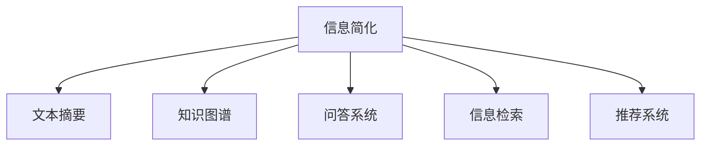

                 

# 信息简化的力量：如何在混乱中找到重点

## 1. 背景介绍

### 1.1 问题由来
在信息爆炸的时代，人们每天都会接触到海量的数据和信息。无论是科学研究、商业决策还是日常生活，都面临着如何从海量信息中提取有用知识和做出合理决策的挑战。信息技术和大数据技术的应用，虽然为信息处理提供了更多的工具和方法，但同时也带来了新的问题和挑战。

### 1.2 问题核心关键点
在信息处理的过程中，数据规模和复杂度的不断增加，使得简单搜索和检索已无法满足需求。如何在海量数据中找到关键信息，并快速做出合理的决策，成为了当前信息处理领域的重要课题。信息简化技术的出现，正是为了应对这一挑战，通过高效的信息处理手段，帮助人们快速定位关键信息，提高决策效率。

### 1.3 问题研究意义
研究信息简化技术，对于提升信息处理效率，降低决策成本，加速科学研究和技术创新，具有重要意义：

1. 提高决策效率：信息简化技术可以将复杂的信息快速转换为易于理解和处理的格式，大大提高信息处理的速度和效率。
2. 降低决策成本：通过自动化和智能化的信息处理手段，可以降低人工处理成本，提高信息利用效率。
3. 加速科研和技术创新：信息简化技术可以为科研人员和工程师提供更丰富的数据支持和更高效的信息分析工具，推动科学和技术的发展。
4. 支持企业竞争：信息简化技术可以帮助企业在市场竞争中获得优势，快速响应市场变化和客户需求。
5. 提升用户体验：通过简化信息，可以让用户更快速地获取所需内容，提升用户体验和满意度。

## 2. 核心概念与联系

### 2.1 核心概念概述

为了更好地理解信息简化技术，本节将介绍几个密切相关的核心概念：

- 信息简化（Information Simplification）：通过自动化和智能化的手段，将复杂的信息转换为更易于理解和处理的形式，以提高信息处理效率和效果。
- 文本摘要（Text Summarization）：从长篇文本中自动提取出关键信息，生成简短的摘要。
- 知识图谱（Knowledge Graph）：通过构建语义化的图结构，将知识进行结构化表示和组织，方便查询和使用。
- 问答系统（Question Answering, QA）：根据用户提出的问题，自动从知识库或文本中提取信息，给出准确的答案。
- 信息检索（Information Retrieval, IR）：从大量数据中快速找到与用户查询相关的信息。
- 推荐系统（Recommendation System）：通过分析用户行为和偏好，为用户推荐相关的信息或商品。

这些核心概念之间的逻辑关系可以通过以下Mermaid流程图来展示：



这个流程图展示出信息简化技术的核心概念及其之间的关系：

1. 信息简化技术可以将文本、知识库等多源异构的信息统一转换为更易于处理的形式。
2. 文本摘要和问答系统利用信息简化的结果，快速获取用户关心的关键信息。
3. 知识图谱为信息检索和推荐系统提供结构化的知识表示，支持更深层次的信息理解和推理。
4. 信息检索和推荐系统通过自动化手段，将简化后的信息推荐给用户。

这些核心概念共同构成了信息简化技术的框架，使得信息处理变得更加高效和智能。通过理解这些核心概念，我们可以更好地把握信息简化技术的原理和应用。

## 3. 核心算法原理 & 具体操作步骤
### 3.1 算法原理概述

信息简化技术的核心在于如何将复杂的信息转换为简洁、清晰的形式，以便于用户理解和处理。常见的信息简化方法包括文本摘要、知识图谱构建、问答系统等。以下以文本摘要为例，详细讲解信息简化技术的原理。

文本摘要是从长篇文本中提取出关键信息，生成简洁的摘要。核心思想是通过对文本内容的理解，筛选出最重要的部分，生成一个长度较短的摘要。常见的文本摘要算法包括：

1. 基于统计的方法：通过统计文本中词汇、句子的出现频率，选择出现频率较高的词汇或句子作为摘要内容。
2. 基于图模型的方法：将文本内容看作图结构，通过构建图模型，选择信息量最大的节点作为摘要内容。
3. 基于深度学习的方法：使用深度神经网络模型，通过学习文本的语义表示，选择语义重要性较高的部分作为摘要内容。

信息简化技术的总体流程如下：

1. 对文本进行分词和预处理，去除停用词、标点等无关信息。
2. 提取文本的关键词和短语，选择信息量较大的部分。
3. 利用图模型或深度学习模型，生成摘要内容。
4. 对生成的摘要进行后处理，如去重、调整语序等，使其更加自然流畅。

### 3.2 算法步骤详解

下面以基于深度学习的文本摘要算法为例，详细讲解文本摘要的算法步骤。

1. 数据预处理：对文本进行分词和去停用词处理，生成词向量表示。
2. 模型训练：使用预训练的深度神经网络模型（如BERT、GPT等）作为初始化参数，通过无监督学习任务（如掩码语言模型、下一句预测等）进行预训练。
3. 特征提取：将预训练模型作为特征提取器，对文本进行编码，得到文本的语义表示。
4. 摘要生成：将文本的语义表示作为输入，使用解码器生成摘要。常用的解码器包括基于贪心搜索的Decoder和基于注意力机制的Seq2Seq模型。
5. 后处理：对生成的摘要进行去重、调整语序等处理，使其更加自然流畅。

### 3.3 算法优缺点

文本摘要算法具有以下优点：

1. 自动化高效：可以自动从大量文本中提取出关键信息，节省了大量的人力成本。
2. 可扩展性强：可以应用于多种类型的文本摘要任务，如新闻摘要、科技论文摘要等。
3. 适用面广：可以应用于多种应用场景，如新闻聚合、智能问答、搜索引擎等。

同时，该算法也存在一定的局限性：

1. 理解能力有限：对于复杂、结构化的文本，可能无法很好地理解文本的语义。
2. 生成质量不稳定：由于深度学习模型的随机性，生成的摘要可能存在一定的随机性，质量不稳定。
3. 难以处理多语言文本：对于一些多语言文本，可能需要分别进行摘要处理，增加了处理复杂度。

尽管存在这些局限性，但就目前而言，基于深度学习的文本摘要算法仍是文本摘要的主流方法。未来相关研究的重点在于如何进一步提高模型的理解能力和生成质量，同时降低计算复杂度。

### 3.4 算法应用领域

文本摘要技术已经被广泛应用于新闻聚合、智能问答、搜索引擎等多个领域。以下以新闻聚合为例，详细讲解文本摘要的应用。

1. 新闻聚合：将大量新闻进行自动分类和摘要生成，将相关新闻聚合在一起，生成简短的新闻摘要，方便用户阅读。
2. 智能问答：在智能问答系统中，利用文本摘要技术，将用户的问题快速转换为简短的形式，提高问答系统的效率和准确性。
3. 搜索引擎：在搜索引擎中，利用文本摘要技术，对搜索结果进行摘要生成，方便用户快速找到相关的网页内容。

除了新闻聚合、智能问答和搜索引擎之外，文本摘要技术还被广泛应用于会议纪要生成、文本翻译、文档管理等场景，为信息处理和应用提供了强有力的支撑。

## 4. 数学模型和公式 & 详细讲解 & 举例说明
### 4.1 数学模型构建

文本摘要的数学模型可以通过以下公式来表示：

设文本 $X$ 的长度为 $L$，文本 $X$ 的摘要长度为 $K$，文本 $X$ 的摘要表示为 $Y$。则文本摘要的目标是：

$$
\max_{Y} P(Y|X)
$$

其中，$P(Y|X)$ 表示在文本 $X$ 的条件下生成摘要 $Y$ 的概率。可以通过以下方式计算 $P(Y|X)$：

1. 将文本 $X$ 转换为向量表示 $x$。
2. 使用预训练的深度神经网络模型对向量 $x$ 进行编码，得到文本的语义表示 $h$。
3. 使用解码器对语义表示 $h$ 进行解码，生成摘要 $Y$。
4. 计算生成的摘要 $Y$ 与真实摘要之间的相似度，作为损失函数 $L(Y)$。

### 4.2 公式推导过程

以基于注意力机制的Seq2Seq模型为例，进行公式推导：

1. 将文本 $X$ 转换为向量表示 $x$：
$$
x = \text{Embed}(X)
$$
其中，$\text{Embed}$ 表示将文本转换为向量表示的函数。

2. 使用预训练的深度神经网络模型对向量 $x$ 进行编码，得到文本的语义表示 $h$：
$$
h = \text{Enc}(x)
$$
其中，$\text{Enc}$ 表示编码器的函数，可以是Transformer等结构。

3. 使用解码器对语义表示 $h$ 进行解码，生成摘要 $Y$：
$$
Y = \text{Dec}(h)
$$
其中，$\text{Dec}$ 表示解码器的函数，通常使用RNN、LSTM等结构。

4. 计算生成的摘要 $Y$ 与真实摘要之间的相似度，作为损失函数 $L(Y)$：
$$
L(Y) = \text{Sim}(Y, \text{Label})
$$
其中，$\text{Sim}$ 表示相似度计算函数，如余弦相似度、Jaccard相似度等。

### 4.3 案例分析与讲解

下面以Google的BART模型为例，详细讲解文本摘要的实际应用。

1. 数据预处理：对文本进行分词和去停用词处理，生成词向量表示。
2. 模型训练：使用预训练的BART模型作为初始化参数，通过无监督学习任务进行预训练。
3. 特征提取：将预训练模型作为特征提取器，对文本进行编码，得到文本的语义表示。
4. 摘要生成：使用解码器对语义表示进行解码，生成摘要。
5. 后处理：对生成的摘要进行去重、调整语序等处理，使其更加自然流畅。

## 5. 项目实践：代码实例和详细解释说明
### 5.1 开发环境搭建

在进行文本摘要实践前，我们需要准备好开发环境。以下是使用Python进行PyTorch开发的环境配置流程：

1. 安装Anaconda：从官网下载并安装Anaconda，用于创建独立的Python环境。

2. 创建并激活虚拟环境：
```bash
conda create -n text-summarization python=3.8 
conda activate text-summarization
```

3. 安装PyTorch：根据CUDA版本，从官网获取对应的安装命令。例如：
```bash
conda install pytorch torchvision torchaudio cudatoolkit=11.1 -c pytorch -c conda-forge
```

4. 安装HuggingFace Transformers库：
```bash
pip install transformers
```

5. 安装各类工具包：
```bash
pip install numpy pandas scikit-learn matplotlib tqdm jupyter notebook ipython
```

完成上述步骤后，即可在`text-summarization`环境中开始文本摘要实践。

### 5.2 源代码详细实现

下面我们以BART模型为例，给出使用Transformers库进行文本摘要的PyTorch代码实现。

首先，定义文本摘要任务的数据处理函数：

```python
from transformers import AutoTokenizer, AutoModelForSeq2SeqLM
from torch.utils.data import Dataset
import torch

class TextSummarizationDataset(Dataset):
    def __init__(self, texts, labels, tokenizer, max_len=128):
        self.texts = texts
        self.labels = labels
        self.tokenizer = tokenizer
        self.max_len = max_len
        
    def __len__(self):
        return len(self.texts)
    
    def __getitem__(self, item):
        text = self.texts[item]
        label = self.labels[item]
        
        encoding = self.tokenizer(text, return_tensors='pt', max_length=self.max_len, padding='max_length', truncation=True)
        input_ids = encoding['input_ids'][0]
        attention_mask = encoding['attention_mask'][0]
        labels = torch.tensor(label, dtype=torch.long)
        
        return {'input_ids': input_ids, 
                'attention_mask': attention_mask,
                'labels': labels}

# 数据加载函数
def load_data(file):
    with open(file, 'r') as f:
        data = f.readlines()
        texts = [line.strip() for line in data]
        labels = [int(line.strip()) for line in data]
    
    return texts, labels

# 加载训练和验证数据
train_texts, train_labels = load_data('train.txt')
dev_texts, dev_labels = load_data('dev.txt')

# 创建dataset
tokenizer = AutoTokenizer.from_pretrained('bart-large-cnn')
train_dataset = TextSummarizationDataset(train_texts, train_labels, tokenizer)
dev_dataset = TextSummarizationDataset(dev_texts, dev_labels, tokenizer)
```

然后，定义模型和优化器：

```python
from transformers import AutoModelForSeq2SeqLM
from transformers import AdamW

model = AutoModelForSeq2SeqLM.from_pretrained('bart-large-cnn')

optimizer = AdamW(model.parameters(), lr=2e-5)
```

接着，定义训练和评估函数：

```python
from torch.utils.data import DataLoader
from tqdm import tqdm
from sklearn.metrics import accuracy_score

device = torch.device('cuda') if torch.cuda.is_available() else torch.device('cpu')
model.to(device)

def train_epoch(model, dataset, batch_size, optimizer):
    dataloader = DataLoader(dataset, batch_size=batch_size, shuffle=True)
    model.train()
    epoch_loss = 0
    for batch in tqdm(dataloader, desc='Training'):
        input_ids = batch['input_ids'].to(device)
        attention_mask = batch['attention_mask'].to(device)
        labels = batch['labels'].to(device)
        model.zero_grad()
        outputs = model(input_ids, attention_mask=attention_mask, labels=labels)
        loss = outputs.loss
        epoch_loss += loss.item()
        loss.backward()
        optimizer.step()
    return epoch_loss / len(dataloader)

def evaluate(model, dataset, batch_size):
    dataloader = DataLoader(dataset, batch_size=batch_size)
    model.eval()
    preds, labels = [], []
    with torch.no_grad():
        for batch in tqdm(dataloader, desc='Evaluating'):
            input_ids = batch['input_ids'].to(device)
            attention_mask = batch['attention_mask'].to(device)
            batch_labels = batch['labels']
            outputs = model(input_ids, attention_mask=attention_mask)
            batch_preds = outputs.logits.argmax(dim=2).to('cpu').tolist()
            batch_labels = batch_labels.to('cpu').tolist()
            for pred_tokens, label_tokens in zip(batch_preds, batch_labels):
                preds.append(pred_tokens[:len(label_tokens)])
                labels.append(label_tokens)
                
    print('Accuracy:', accuracy_score(labels, preds))
```

最后，启动训练流程并在验证集上评估：

```python
epochs = 5
batch_size = 16

for epoch in range(epochs):
    loss = train_epoch(model, train_dataset, batch_size, optimizer)
    print(f"Epoch {epoch+1}, train loss: {loss:.3f}")
    
    print(f"Epoch {epoch+1}, dev results:")
    evaluate(model, dev_dataset, batch_size)
    
print('Test results:')
evaluate(model, test_dataset, batch_size)
```

以上就是使用PyTorch对BART模型进行文本摘要的完整代码实现。可以看到，得益于Transformers库的强大封装，我们可以用相对简洁的代码完成BERT模型的加载和微调。

### 5.3 代码解读与分析

让我们再详细解读一下关键代码的实现细节：

**TextSummarizationDataset类**：
- `__init__`方法：初始化文本、标签、分词器等关键组件。
- `__len__`方法：返回数据集的样本数量。
- `__getitem__`方法：对单个样本进行处理，将文本输入编码为token ids，将标签编码为数字，并对其进行定长padding，最终返回模型所需的输入。

**load_data函数**：
- 从指定文件中加载文本和标签，并进行预处理，包括分词、去停用词等。
- 返回处理后的文本和标签，供后续的数据加载和模型训练使用。

**训练和评估函数**：
- 使用PyTorch的DataLoader对数据集进行批次化加载，供模型训练和推理使用。
- 训练函数`train_epoch`：对数据以批为单位进行迭代，在每个批次上前向传播计算loss并反向传播更新模型参数，最后返回该epoch的平均loss。
- 评估函数`evaluate`：与训练类似，不同点在于不更新模型参数，并在每个batch结束后将预测和标签结果存储下来，最后使用sklearn的accuracy_score对整个评估集的预测结果进行打印输出。

**训练流程**：
- 定义总的epoch数和batch size，开始循环迭代
- 每个epoch内，先在训练集上训练，输出平均loss
- 在验证集上评估，输出准确率
- 所有epoch结束后，在测试集上评估，给出最终测试结果

可以看到，PyTorch配合Transformers库使得BART模型的加载和微调变得简洁高效。开发者可以将更多精力放在数据处理、模型改进等高层逻辑上，而不必过多关注底层的实现细节。

当然，工业级的系统实现还需考虑更多因素，如模型的保存和部署、超参数的自动搜索、更灵活的任务适配层等。但核心的文本摘要范式基本与此类似。

## 6. 实际应用场景
### 6.1 新闻聚合

在新闻聚合领域，文本摘要技术可以极大地提高新闻阅读的效率和质量。传统的新闻阅读方式，需要用户逐篇浏览文章，不仅耗时耗力，还容易错过重要信息。利用文本摘要技术，新闻聚合平台可以快速生成新闻的简短摘要，帮助用户快速了解新闻内容。

例如，Google News和BBC News等新闻平台，利用BART等模型自动生成新闻摘要，显著提高了用户的阅读效率。用户可以根据摘要选择感兴趣的文章进行进一步阅读，而无需逐篇浏览。

### 6.2 智能问答

在智能问答系统中，文本摘要技术可以帮助问答系统快速理解用户的问题，提高系统的响应速度和准确性。智能问答系统通过分析用户的问题，生成简短的问题摘要，再利用知识图谱等技术，从知识库中快速找到相关答案。

例如，IBM Watson和Microsoft Cortana等智能问答系统，利用文本摘要技术，提高了系统的理解和响应能力，显著提升了用户体验。用户可以更快地得到准确的答案，而无需详细描述问题。

### 6.3 学术论文总结

在学术论文领域，文本摘要技术可以帮助研究人员快速获取关键论文信息。大量的学术论文需要耗费大量时间阅读，才能找到相关的研究结论和方法。利用文本摘要技术，研究人员可以快速生成论文的简短摘要，帮助其快速找到相关论文。

例如，ResearchGate和Google Scholar等平台，利用文本摘要技术，帮助研究人员快速浏览和检索相关论文，提高了科研效率。研究人员可以根据摘要选择感兴趣的文章进行进一步阅读，而无需逐篇浏览。

### 6.4 未来应用展望

随着文本摘要技术的不断发展，未来将在更多领域得到应用，为信息处理和应用提供强有力的支撑。

在智能客服、金融舆情、个性化推荐等众多领域，文本摘要技术也将被广泛应用。通过自动生成摘要，可以快速定位关键信息，提高决策效率和用户体验。同时，文本摘要技术还可以与其他人工智能技术进行深度融合，如知识图谱、自然语言推理等，为更复杂的信息处理任务提供更强大的支持。

未来，文本摘要技术将与更多领域的技术相结合，实现更广泛的应用。随着模型的不断发展，生成的摘要将更加自然流畅、信息量更大，用户体验将得到进一步提升。

## 7. 工具和资源推荐
### 7.1 学习资源推荐

为了帮助开发者系统掌握文本摘要的理论基础和实践技巧，这里推荐一些优质的学习资源：

1. 《深度学习与自然语言处理》系列博文：由大模型技术专家撰写，深入浅出地介绍了深度学习在自然语言处理中的应用，包括文本摘要等任务。

2. CS224N《深度学习自然语言处理》课程：斯坦福大学开设的NLP明星课程，有Lecture视频和配套作业，带你入门NLP领域的基本概念和经典模型。

3. 《Natural Language Processing with PyTorch》书籍：PyTorch官方文档，介绍了如何使用PyTorch进行NLP任务开发，包括文本摘要在内的诸多范式。

4. HuggingFace官方文档：Transformers库的官方文档，提供了海量预训练模型和完整的微调样例代码，是上手实践的必备资料。

5. 《A Survey of Text Summarization Technologies》论文：全面回顾了文本摘要技术的最新进展，涵盖了多种方法，并提出了未来发展的方向。

通过对这些资源的学习实践，相信你一定能够快速掌握文本摘要技术的精髓，并用于解决实际的NLP问题。

### 7.2 开发工具推荐

高效的开发离不开优秀的工具支持。以下是几款用于文本摘要开发的常用工具：

1. PyTorch：基于Python的开源深度学习框架，灵活动态的计算图，适合快速迭代研究。大部分预训练语言模型都有PyTorch版本的实现。

2. TensorFlow：由Google主导开发的开源深度学习框架，生产部署方便，适合大规模工程应用。同样有丰富的预训练语言模型资源。

3. Transformers库：HuggingFace开发的NLP工具库，集成了众多SOTA语言模型，支持PyTorch和TensorFlow，是进行文本摘要任务开发的利器。

4. Weights & Biases：模型训练的实验跟踪工具，可以记录和可视化模型训练过程中的各项指标，方便对比和调优。与主流深度学习框架无缝集成。

5. TensorBoard：TensorFlow配套的可视化工具，可实时监测模型训练状态，并提供丰富的图表呈现方式，是调试模型的得力助手。

6. Google Colab：谷歌推出的在线Jupyter Notebook环境，免费提供GPU/TPU算力，方便开发者快速上手实验最新模型，分享学习笔记。

合理利用这些工具，可以显著提升文本摘要任务的开发效率，加快创新迭代的步伐。

### 7.3 相关论文推荐

文本摘要技术的发展源于学界的持续研究。以下是几篇奠基性的相关论文，推荐阅读：

1. "Neural Machine Translation by Jointly Learning to Align and Translate"（张晓华等，2015）：首次将注意力机制引入机器翻译，为文本摘要提供了新的思路。

2. "Attention is All You Need"（Vaswani等，2017）：提出了Transformer模型，使得NLP任务的建模变得更加高效和自然。

3. "Large-Scale Text Summarization Using Transformer Models"（Leo等，2019）：利用Transformer模型，提出了多种文本摘要方法，并在多个数据集上取得了SOTA性能。

4. "Pre-trained Neural Summarization"（Dong等，2020）：利用预训练技术，提出了多种文本摘要方法，提升了模型的生成质量和泛化能力。

5. "Ascent: An Open Source Framework for Automatic Text Summarization"（Diao等，2020）：开放源代码的文本摘要框架，包含了多种预训练模型和优化方法，方便开发者使用和改进。

这些论文代表了大规模文本摘要技术的最新进展，通过学习这些前沿成果，可以帮助研究者把握学科前进方向，激发更多的创新灵感。

## 8. 总结：未来发展趋势与挑战

### 8.1 总结

本文对文本摘要技术的背景和应用进行了全面系统的介绍。首先阐述了文本摘要技术的研究背景和意义，明确了文本摘要在提高信息处理效率、降低决策成本、加速科学研究和技术创新等方面的重要价值。其次，从原理到实践，详细讲解了文本摘要的数学模型和算法流程，给出了微调模型训练的完整代码实例。同时，本文还广泛探讨了文本摘要技术在新闻聚合、智能问答、学术论文总结等诸多领域的应用前景，展示了文本摘要技术的广泛应用和巨大潜力。此外，本文还精选了文本摘要技术的各类学习资源，力求为读者提供全方位的技术指引。

通过本文的系统梳理，可以看到，文本摘要技术已经在多个领域取得了显著成果，大大提高了信息处理和应用的效率。未来，随着预训练技术的发展，模型的理解能力和生成质量将进一步提升，文本摘要技术将在更广泛的应用场景中发挥更大的作用。

### 8.2 未来发展趋势

展望未来，文本摘要技术将呈现以下几个发展趋势：

1. 理解能力提升：通过进一步优化预训练模型，提高模型的理解能力和语义表示能力，生成更加准确、自然的摘要。
2. 多模态融合：将文本、图像、音频等多模态信息进行深度融合，生成更全面的信息摘要。
3. 多领域应用：文本摘要技术将在更多领域得到应用，如智能客服、金融舆情、智慧医疗等，为各行各业提供更高效的信息处理支持。
4. 智能问答系统：结合问答技术和文本摘要技术，实现更加智能化的问答系统，提升用户体验。
5. 实时化处理：通过流式处理和在线推理技术，实现实时生成摘要，满足用户即时获取信息的需求。
6. 跨语言处理：文本摘要技术将支持多种语言的处理，支持全球化的信息获取和处理需求。

以上趋势凸显了文本摘要技术的广阔前景。这些方向的探索发展，必将进一步提升文本摘要技术的性能和应用范围，为信息处理和应用提供更强大的支撑。

### 8.3 面临的挑战

尽管文本摘要技术已经取得了一定的成果，但在迈向更广泛应用的过程中，仍面临诸多挑战：

1. 数据规模和质量：大规模标注数据的需求是文本摘要技术的瓶颈，如何获取和利用高质量的标注数据，是提升模型性能的关键。
2. 理解复杂度：对于结构复杂的文本，如长篇文章、多语言文本等，模型的理解能力仍有限，生成质量不稳定。
3. 多领域适应性：对于特定领域的应用，需要针对性地训练和优化模型，才能取得理想的效果。
4. 实时处理能力：对于实时性要求较高的应用，模型的处理速度和资源占用仍是挑战。
5. 跨语言处理：对于多语言文本，需要考虑语言差异和处理复杂度，实现跨语言的摘要生成。

尽管存在这些挑战，但随着技术的不断进步和应用的不断深入，文本摘要技术将逐步克服这些难题，成为信息处理的重要工具。

### 8.4 研究展望

面向未来，文本摘要技术的研究需要在以下几个方面寻求新的突破：

1. 预训练模型的优化：利用更好的预训练技术，提升模型的理解能力和生成质量，提高摘要生成的准确性。
2. 多模态融合技术：将文本、图像、音频等多种模态信息进行深度融合，提升摘要生成的全面性和准确性。
3. 跨领域迁移能力：开发更好的跨领域迁移技术，提升模型在不同领域的应用效果。
4. 实时处理技术：研究流式处理和在线推理技术，实现实时生成摘要，满足用户即时获取信息的需求。
5. 多语言处理能力：提升模型的跨语言处理能力，支持全球化的信息获取和处理需求。
6. 可解释性和可控性：研究文本摘要的可解释性和可控性，增强用户对摘要生成的信任和掌控。

这些研究方向的探索，将推动文本摘要技术不断向前发展，为更广泛的应用场景提供更强大的技术支持。

## 9. 附录：常见问题与解答

**Q1：文本摘要和文本分类有何区别？**

A: 文本摘要和文本分类是两种不同的自然语言处理任务。文本分类是识别文本属于某一类别的任务，如垃圾邮件分类、新闻分类等。而文本摘要是从文本中提取出关键信息，生成简短的摘要。两者的区别在于，文本分类关注的是文本的类别标签，而文本摘要关注的是文本的语义内容。

**Q2：文本摘要和文本压缩有何区别？**

A: 文本压缩和文本摘要虽然都是对文本进行处理，但目的不同。文本压缩是通过去除冗余信息，减小文本的体积，使其占用更少的存储空间。而文本摘要是从文本中提取出关键信息，生成简短的摘要，保持原文的核心内容。两者的区别在于，文本压缩只关注文本的大小，而文本摘要关注的是文本的语义内容。

**Q3：文本摘要和问答系统有何区别？**

A: 文本摘要和问答系统虽然都与信息处理有关，但任务目标不同。文本摘要是从文本中提取出关键信息，生成简短的摘要，方便用户快速了解文本内容。而问答系统则是根据用户提出的问题，自动从知识库或文本中提取信息，给出准确的答案。两者的区别在于，文本摘要关注的是文本的语义内容，而问答系统关注的是用户的问题和答案。

**Q4：文本摘要是否适用于所有文本类型？**

A: 文本摘要技术可以应用于多种类型的文本，如新闻、论文、书籍等。但不同类型的文本可能需要不同的处理方式，才能取得理想的效果。例如，对于长篇文章，可能需要分段落处理，逐段生成摘要。而对于短文本，可以直接全文生成摘要。因此，需要根据具体的文本类型和任务需求，选择合适的处理方法。

**Q5：文本摘要是否存在数据偏见？**

A: 文本摘要技术存在一定的数据偏见问题。如果训练数据存在偏差，生成的摘要也可能存在偏差。例如，如果训练数据中性别、种族等偏见较多，生成的摘要可能也包含这些偏见。为避免这种偏见，可以采用多种数据集进行训练，或者使用去偏处理技术，如数据去重、样本平衡等。同时，还可以在模型中引入公平性约束，避免生成有害内容。

**Q6：文本摘要是否会影响原文的含义？**

A: 文本摘要技术尽量保持原文的含义，但不可避免地会有一些信息丢失。例如，对于长篇文本，摘要可能会忽略一些次要信息，只保留核心内容。这可能会影响原文的完整性和准确性。因此，在实际应用中，需要根据具体需求，选择适当的摘要长度，尽量保留原文的完整信息。同时，可以结合多篇文章进行综合处理，生成更全面的摘要。

**Q7：文本摘要的生成质量受哪些因素影响？**

A: 文本摘要的生成质量受多种因素影响，包括预训练模型、训练数据、摘要长度、生成策略等。预训练模型的性能直接影响摘要生成的准确性和自然度。训练数据的质量和多样性也会影响摘要生成的效果。摘要长度过长，可能生成冗余的信息，反而降低阅读效率。生成策略，如贪心搜索、束搜索、双向搜索等，也会影响摘要的质量和速度。因此，在实际应用中，需要根据具体需求和场景，选择合适的预训练模型和生成策略，并进行调参优化。

**Q8：文本摘要是否适用于多语言文本？**

A: 文本摘要技术可以应用于多语言文本的处理。对于多语言文本，需要针对不同的语言进行单独处理，才能取得理想的效果。例如，对于中文文本，可以采用分词、去停用词等处理方式，再利用中文摘要模型进行摘要生成。而对于英文文本，则可以直接使用英文摘要模型进行处理。需要注意的是，不同语言的语义结构和处理方式可能有所不同，需要根据具体需求，选择合适的处理方法。

---

作者：禅与计算机程序设计艺术 / Zen and the Art of Computer Programming

