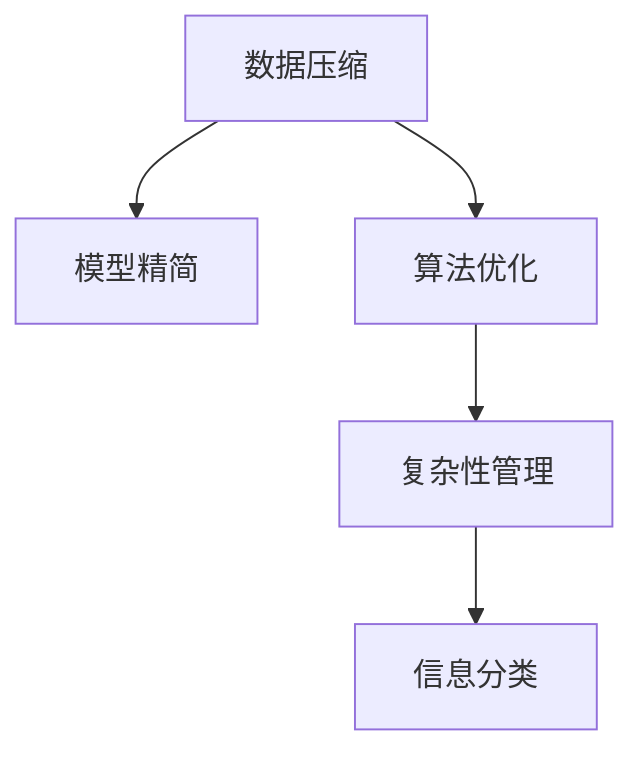

                 

# 信息简化的好处与挑战：简化复杂性的艺术与科学

> 关键词：信息简化,复杂性管理,系统设计,数据压缩,网络安全,人工智能

## 1. 背景介绍

### 1.1 问题由来
在信息技术飞速发展的今天，信息的数量和复杂度已经到达了前所未有的高度。从海量数据到高维模型，从智能算法到分布式系统，信息处理和管理的难度也随之增加。如何在庞杂的信息海洋中提取有价值的内容，提高信息处理的效率和准确性，成为了一个亟待解决的问题。

信息简化，即在保持信息核心价值的前提下，去除冗余、无意义的部分，是提高信息处理效率和质量的直接手段。无论是传统的数据压缩算法，还是现代的人工智能算法，其本质都是对信息进行简化处理。了解信息简化的原理和应用，对提升系统设计、优化网络安全、改善人工智能性能都有着重要的意义。

### 1.2 问题核心关键点
信息简化的核心在于：如何在保持信息完整性和准确性的前提下，尽可能地减少信息的存储和处理复杂度。它涉及到数据压缩、模型精简、算法优化等多个方面。信息简化不仅能够提升系统性能，还能降低计算和存储成本，增强系统的鲁棒性和可靠性。

## 2. 核心概念与联系

### 2.1 核心概念概述

为更好地理解信息简化的原理和应用，本节将介绍几个密切相关的核心概念：

- 数据压缩(Data Compression)：通过编码算法，将数据转换为更紧凑的形式，以减少存储空间和传输带宽。经典的数据压缩算法包括霍夫曼编码、LZW算法等。
- 模型精简(Model Simplification)：在保持模型核心功能不变的前提下，去除冗余参数和层级，以提升模型的训练和推理效率。例如剪枝剪层技术、参数共享等。
- 算法优化(Algorithm Optimization)：通过改进算法结构和参数设置，提升算法的计算效率和准确性。常用的算法优化技术包括循环展开、向量量化、分治等。
- 复杂性管理(Complexity Management)：对系统的复杂性进行管理和优化，以提高系统的可维护性、可扩展性和可靠性。例如模块化设计、微服务架构等。
- 信息分类(Information Categorization)：将信息按照一定的标准进行分类，以便于信息的整理、存储和检索。例如数据挖掘、信息检索等技术。

这些核心概念之间的逻辑关系可以通过以下Mermaid流程图来展示：



这个流程图展示了一组信息简化方法的基本流程：首先通过数据压缩减少数据体积，然后对模型进行精简优化，同时采用算法优化提升性能，最后通过复杂性管理和信息分类提高系统效率。

## 3. 核心算法原理 & 具体操作步骤
### 3.1 算法原理概述

信息简化可以理解为一种“去伪存真”的过程，即在尽可能保留信息核心特征的前提下，去除冗余和无用的部分。其核心算法原理包括但不限于以下几种：

- **霍夫曼编码(Huffman Coding)**：一种基于字符频率统计的编码算法，通过构建霍夫曼树，将字符映射为最短的二进制码，从而实现数据压缩。
- **LZW算法(Lempel-Ziv-Welch Compression)**：一种基于字典的压缩算法，通过建立和维护一个动态字典，将输入序列中的重复部分压缩为字典中的索引，从而实现高效的数据压缩。
- **信息瓶颈理论(Information Bottleneck Theory)**：一种用于选择信息保留和压缩的模型，通过最大化信号的分类性能和最小化冗余信息，实现信息的优化压缩。
- **自适应数据压缩(Adaptive Data Compression)**：根据输入数据的特点动态调整压缩策略，以实现最优的压缩效果。例如基于模型的自适应压缩算法。

### 3.2 算法步骤详解

以下我们以信息瓶颈理论为例，详细讲解其实现步骤：

**Step 1: 定义问题**  
假设我们有一个原始数据集 $X$，需要对其进行信息简化。定义输入空间 $\mathcal{X}$，输出空间 $\mathcal{Y}$，目标函数为 $f(X; \theta)$，其中 $\theta$ 为模型参数。

**Step 2: 设计损失函数**  
设计信息瓶颈损失函数 $\mathcal{L}(\theta)$，包含两部分：
1. **先验概率损失**：衡量模型对未知输入空间的预测能力，即 $\mathbb{E}_{X'}[\ell(f(X'; \theta), Y')]$，其中 $X'$ 为输入空间的未知部分，$Y'$ 为相应输出。
2. **冗余信息损失**：衡量模型在已知输入空间上的冗余信息量，即 $\mathbb{E}_{X}[\ell(f(X; \theta), Y')]$。

**Step 3: 求解优化问题**  
通过优化问题 $\min_{\theta} \mathcal{L}(\theta)$，选择模型参数 $\theta$，使得模型在已知和未知输入空间上的性能均达到最优。

**Step 4: 实施压缩算法**  
根据信息瓶颈模型，设计合适的压缩算法，将原始数据压缩为更紧凑的形式。例如霍夫曼编码、LZW算法等。

### 3.3 算法优缺点

信息简化的主要优点包括：

- **提升效率**：通过去除冗余信息，减少数据的存储和传输成本，提高系统的响应速度和处理效率。
- **降低风险**：减少数据量，降低系统故障和数据损坏的风险。
- **优化性能**：提高算法的计算效率和模型的推理速度，增强系统的稳定性和可靠性。

然而，信息简化也存在一些局限性：

- **精度损失**：压缩后的数据可能会丢失部分原始信息，导致精度下降。
- **复杂度增加**：压缩算法的实现和优化本身也需要计算资源，可能增加系统复杂度。
- **可解释性差**：压缩后的数据结构复杂，难以解释和理解。

在实际应用中，需要根据具体场景和需求，合理平衡信息简化带来的收益和损失。

### 3.4 算法应用领域

信息简化的思想和算法在多个领域中有着广泛的应用：

- **网络通信**：在数据传输过程中，通过压缩算法减少带宽占用，提高通信效率。
- **分布式系统**：在分布式环境中，通过数据压缩和模型精简，减少数据传输量和存储需求，优化系统性能。
- **数据存储**：在大数据存储中，通过压缩算法提高数据存储密度，减少存储空间。
- **人工智能**：在模型训练和推理中，通过参数共享和剪枝剪层技术，提高模型效率和性能。
- **图像处理**：在图像压缩和处理中，通过算法优化和信息分类，实现高效的数据管理和处理。

## 4. 数学模型和公式 & 详细讲解
### 4.1 数学模型构建

信息简化问题的数学模型可以表示为：

$$
\min_{\theta} \mathcal{L}(\theta) = \min_{\theta} \left[\mathbb{E}_{X'}[\ell(f(X'; \theta), Y')] + \lambda \mathbb{E}_{X}[\ell(f(X; \theta), Y')] \right]
$$

其中，$f(X; \theta)$ 为信息瓶颈模型，$\ell$ 为损失函数，$\mathbb{E}$ 为期望算符，$\lambda$ 为正则化参数，用于平衡先验概率损失和冗余信息损失。

### 4.2 公式推导过程

为了求解信息瓶颈优化问题，引入拉格朗日乘子法：

$$
\mathcal{L}(\theta, \lambda) = \mathbb{E}_{X'}[\ell(f(X'; \theta), Y')] + \lambda \mathbb{E}_{X}[\ell(f(X; \theta), Y')] + \eta(\mathbb{E}_{X'}[f(X'; \theta)] - \mathbb{E}_{X}[f(X; \theta)])
$$

其中 $\eta$ 为拉格朗日乘子。通过求解上述拉格朗日优化问题，可以找到最优的 $\theta$ 和 $\lambda$。

### 4.3 案例分析与讲解

假设我们有一个二分类问题，输入数据 $X$ 为二维向量，输出 $Y$ 为二进制值。定义信息瓶颈模型为：

$$
f(X; \theta) = \sigma(\theta^T \cdot X)
$$

其中 $\sigma$ 为 sigmoid 函数，$\theta$ 为模型参数。

我们通过霍夫曼编码对输入数据进行压缩，然后将其输入信息瓶颈模型进行分类。具体步骤如下：

1. 计算先验概率损失：
   $$
   \mathbb{E}_{X'}[\ell(f(X'; \theta), Y')] = \frac{1}{|X'|} \sum_{i=1}^{|X'|} \ell(f(x_i'; \theta), y_i')
   $$

2. 计算冗余信息损失：
   $$
   \mathbb{E}_{X}[\ell(f(X; \theta), Y')] = \frac{1}{|X|} \sum_{i=1}^{|X|} \ell(f(x_i; \theta), y_i')
   $$

3. 求解优化问题：
   $$
   \min_{\theta, \lambda} \mathcal{L}(\theta, \lambda) = \min_{\theta, \lambda} \left[\frac{1}{|X'|} \sum_{i=1}^{|X'|} \ell(f(x_i'; \theta), y_i') + \lambda \frac{1}{|X|} \sum_{i=1}^{|X|} \ell(f(x_i; \theta), y_i') + \eta(\mathbb{E}_{X'}[f(X'; \theta)] - \mathbb{E}_{X}[f(X; \theta)]) \right]
   $$

4. 实施压缩算法：
   $$
   X' = \text{Huffman Coding}(X)
   $$

通过以上步骤，可以实现对二分类问题的信息简化，提升模型的分类性能和计算效率。

## 5. 项目实践：代码实例和详细解释说明
### 5.1 开发环境搭建

在进行信息简化实践前，我们需要准备好开发环境。以下是使用Python进行Huffman编码开发的Python环境配置流程：

1. 安装Anaconda：从官网下载并安装Anaconda，用于创建独立的Python环境。

2. 创建并激活虚拟环境：
```bash
conda create -n huffman-env python=3.8 
conda activate huffman-env
```

3. 安装PyTorch：根据CUDA版本，从官网获取对应的安装命令。例如：
```bash
conda install pytorch torchvision torchaudio cudatoolkit=11.1 -c pytorch -c conda-forge
```

4. 安装NumPy：
```bash
pip install numpy
```

5. 安装Huffman编码库：
```bash
pip install huffman-coding
```

完成上述步骤后，即可在`huffman-env`环境中开始信息简化实践。

### 5.2 源代码详细实现

这里我们以二分类问题为例，给出使用Huffman编码对输入数据进行压缩的Python代码实现。

```python
from huffman_coding import HuffmanEncoder
from sklearn.datasets import make_classification
from sklearn.model_selection import train_test_split
from sklearn.linear_model import LogisticRegression
from sklearn.metrics import accuracy_score
from sklearn.preprocessing import StandardScaler

# 生成二分类数据集
X, y = make_classification(n_samples=1000, n_features=10, random_state=42)
X_train, X_test, y_train, y_test = train_test_split(X, y, test_size=0.2, random_state=42)

# 数据标准化
scaler = StandardScaler()
X_train = scaler.fit_transform(X_train)
X_test = scaler.transform(X_test)

# 编码压缩
encoder = HuffmanEncoder()
X_train_encoded = encoder.encode(X_train)
X_test_encoded = encoder.encode(X_test)

# 训练模型
model = LogisticRegression()
model.fit(X_train_encoded, y_train)

# 评估模型
y_pred = model.predict(X_test_encoded)
accuracy = accuracy_score(y_test, y_pred)
print(f"Accuracy: {accuracy:.2f}")
```

以上就是使用Huffman编码对输入数据进行压缩的完整代码实现。可以看到，Huffman编码的实现非常简单，只需要使用`HuffmanEncoder`类，便可以方便地对数据进行编码压缩。

### 5.3 代码解读与分析

让我们再详细解读一下关键代码的实现细节：

**HuffmanEncoder类**：
- `encode`方法：将输入数据进行编码压缩，返回压缩后的数据。

**make_classification函数**：
- 生成一个包含10个特征的二分类数据集，用于训练和测试。

**train_test_split函数**：
- 将数据集分为训练集和测试集，比例为80:20。

**StandardScaler类**：
- 对输入数据进行标准化处理，将数据均值化，方差为1。

**LogisticRegression类**：
- 使用逻辑回归模型对压缩后的数据进行分类。

**accuracy_score函数**：
- 计算模型在测试集上的准确率。

通过以上步骤，我们可以看到，Huffman编码的实现非常简单，且能够显著减少数据量，提升模型的训练和推理效率。在实际应用中，可以根据具体需求，选择合适的编码算法和模型，进行数据简化处理。

## 6. 实际应用场景
### 6.1 网络通信

在网络通信中，数据传输的效率和带宽占用是关键问题。通过压缩算法，可以显著减少数据量，降低传输带宽，提高通信效率。例如，HTTP协议中使用了Gzip压缩算法，能够有效减少网页文件的大小，提升页面加载速度。

### 6.2 分布式系统

在分布式系统中，数据传输和存储是主要瓶颈。通过数据压缩和模型精简，可以减少数据传输量和存储需求，优化系统性能。例如，Hadoop中使用的Snappy压缩算法，能够显著减少数据传输和存储的带宽和磁盘空间占用，提升系统效率。

### 6.3 数据存储

在大数据存储中，数据量庞大，存储需求高。通过数据压缩算法，可以显著减少存储需求，降低存储成本。例如，Amazon S3使用的LZ4压缩算法，能够大幅减少数据存储量，提升存储效率。

### 6.4 人工智能

在模型训练和推理中，参数量和计算量巨大，模型效率低。通过参数共享和剪枝剪层技术，可以提高模型效率和性能。例如，TensorFlow的TensorFlow Lite采用了剪枝技术，能够有效减少模型大小，提升推理速度。

### 6.5 图像处理

在图像处理中，数据量大，计算复杂。通过算法优化和信息分类，可以实现高效的数据管理和处理。例如，JPEG图像压缩算法，能够显著减少图像文件大小，提升图像处理速度。

## 7. 工具和资源推荐
### 7.1 学习资源推荐

为了帮助开发者系统掌握信息简化的理论基础和实践技巧，这里推荐一些优质的学习资源：

1. 《数据压缩算法》系列博文：由数据压缩专家撰写，深入浅出地介绍了常见数据压缩算法及其应用。

2. 《深度学习：算法与应用》课程：斯坦福大学开设的深度学习课程，涵盖了深度学习的基本概念和前沿技术，包括信息瓶颈理论。

3. 《信息论与编码》书籍：讲解信息论的基本概念和信息压缩的原理，是数据压缩领域的经典教材。

4. CS61B《数据结构与算法》课程：加州伯克利大学开设的数据结构与算法课程，介绍了算法优化和复杂度分析等基础知识。

5. Weights & Biases：模型训练的实验跟踪工具，可以记录和可视化模型训练过程中的各项指标，方便对比和调优。

6. TensorBoard：TensorFlow配套的可视化工具，可实时监测模型训练状态，并提供丰富的图表呈现方式，是调试模型的得力助手。

通过对这些资源的学习实践，相信你一定能够快速掌握信息简化的精髓，并用于解决实际的系统问题。

### 7.2 开发工具推荐

高效的开发离不开优秀的工具支持。以下是几款用于信息简化开发的常用工具：

1. PyTorch：基于Python的开源深度学习框架，灵活动态的计算图，适合快速迭代研究。

2. TensorFlow：由Google主导开发的开源深度学习框架，生产部署方便，适合大规模工程应用。

3. Huffman编码库：Python实现的霍夫曼编码库，用于数据压缩。

4. Scikit-learn：Python的机器学习库，提供了丰富的数据处理和模型优化工具。

5. Jupyter Notebook：Python的交互式开发环境，方便进行算法实验和模型调试。

合理利用这些工具，可以显著提升信息简化的开发效率，加快创新迭代的步伐。

### 7.3 相关论文推荐

信息简化的发展源于学界的持续研究。以下是几篇奠基性的相关论文，推荐阅读：

1. A Fast Universal Algorithm for On-Line Dictionary-Based Compression（LZW算法）：提出了一种高效的基于字典的压缩算法，广泛应用于数据压缩和图像处理中。

2. Compression of Sensory Information：阐述了信息压缩的数学原理，介绍了熵和信息瓶颈等概念，为信息简化提供了理论基础。

3. Information Bottleneck Method（信息瓶颈理论）：提出了一种信息压缩的模型，通过最大化信号的分类性能和最小化冗余信息，实现信息的优化压缩。

4. Huffman Coding（霍夫曼编码）：提出了一种基于字符频率统计的编码算法，广泛应用于数据压缩中。

5. Matrix Factorization for Non-negative Matrix Factorization with Sparseness Constraints：提出了一种矩阵分解算法，用于优化信息瓶颈模型的参数求解。

这些论文代表了大规模信息简化技术的发展脉络。通过学习这些前沿成果，可以帮助研究者把握学科前进方向，激发更多的创新灵感。

## 8. 总结：未来发展趋势与挑战
### 8.1 总结

本文对信息简化的原理和应用进行了全面系统的介绍。首先阐述了信息简化的研究背景和意义，明确了简化在提高系统效率、降低存储成本等方面的价值。其次，从原理到实践，详细讲解了信息简化的数学模型和实现方法，给出了信息简化的完整代码实例。同时，本文还广泛探讨了信息简化在网络通信、分布式系统、数据存储、人工智能、图像处理等多个领域的应用前景，展示了信息简化的巨大潜力。此外，本文精选了信息简化的各类学习资源，力求为读者提供全方位的技术指引。

通过本文的系统梳理，可以看到，信息简化技术正在成为数据管理和系统设计的重要手段，极大地提升了系统的性能和可维护性。随着信息技术的发展和数据量的激增，信息简化技术的应用前景将更加广阔。未来，伴随技术的不断进步，信息简化技术还将与其他人工智能技术进行更深入的融合，共同推动信息处理和系统设计的进步。

### 8.2 未来发展趋势

展望未来，信息简化的发展趋势包括以下几个方面：

1. **自适应压缩**：通过动态调整压缩算法和参数，实现最优的压缩效果。例如基于模型的自适应压缩算法。

2. **多模态压缩**：将信息压缩技术扩展到多模态数据，如图像、视频、语音等，实现高效的数据管理和处理。

3. **智能压缩**：利用深度学习等技术，提升压缩算法的复杂度和适应性，实现更优的压缩效果。

4. **分布式压缩**：在分布式环境中，通过多节点协同压缩，提升数据处理的效率和可扩展性。

5. **跨领域应用**：将信息简化的技术应用到更多领域，如医疗、金融、交通等，提升各行业的效率和性能。

6. **隐私保护**：在信息压缩过程中，采用隐私保护技术，防止敏感数据泄露，保障数据安全。

以上趋势凸显了信息简化技术的广阔前景。这些方向的探索发展，必将进一步提升信息处理和系统设计的效率和质量，为各行业的数字化转型提供新的技术手段。

### 8.3 面临的挑战

尽管信息简化技术已经取得了瞩目成就，但在迈向更加智能化、普适化应用的过程中，它仍面临着诸多挑战：

1. **数据质量问题**：数据压缩和信息分类都需要高质量的数据，数据质量低下会影响简化效果。

2. **算法复杂度**：信息压缩和模型优化算法复杂度较高，计算资源消耗大。

3. **模型鲁棒性**：在数据分布变化时，模型性能可能会下降，需要考虑模型的鲁棒性。

4. **可解释性差**：压缩后的数据结构复杂，难以解释和理解，影响系统的可维护性和可扩展性。

5. **隐私安全**：在信息压缩和处理过程中，需要考虑数据的隐私和安全问题，防止数据泄露。

6. **技术壁垒**：信息简化技术需要较高的技术门槛，对技术团队的要求较高。

7. **标准化问题**：不同系统和平台的数据格式和压缩算法可能不同，需要统一标准。

在实际应用中，需要综合考虑这些挑战，并采取相应的措施进行优化和改进。

### 8.4 研究展望

面对信息简化面临的这些挑战，未来的研究需要在以下几个方面寻求新的突破：

1. **多模态数据压缩**：研究多模态数据的压缩方法，提升数据管理和处理的效率和质量。

2. **智能压缩算法**：开发更加智能和高效的压缩算法，降低计算资源消耗，提升压缩效果。

3. **分布式压缩技术**：研究分布式环境下的数据压缩和处理技术，提升系统的可扩展性和性能。

4. **隐私保护技术**：研究隐私保护技术，保障数据安全，防止数据泄露。

5. **可解释性增强**：研究可解释性增强技术，提升系统的可维护性和可扩展性。

6. **标准化统一**：研究统一的数据格式和压缩算法标准，促进各系统和平台之间的互操作性。

这些研究方向的探索，必将引领信息简化技术迈向更高的台阶，为各行业的数字化转型提供新的技术手段。面向未来，信息简化技术还需要与其他人工智能技术进行更深入的融合，共同推动信息处理和系统设计的进步。

## 9. 附录：常见问题与解答
**Q1：数据压缩与信息简化的区别是什么？**

A: 数据压缩和信息简化虽然有相似之处，但本质上是不同的概念。数据压缩通过算法去除数据中的冗余部分，以达到减小数据体积的目的。而信息简化则是在保持数据核心价值的前提下，去除无关的信息，以达到简化数据的目的。数据压缩注重效率和存储空间，而信息简化注重数据质量和信息完整性。

**Q2：为什么信息简化会带来性能提升？**

A: 信息简化的核心思想是通过去除无关信息，减少数据的存储和处理复杂度，从而达到提升系统性能的目的。具体来说，数据压缩可以减少存储和传输成本，提升系统响应速度；模型精简可以减少计算量和内存占用，提升模型训练和推理效率；算法优化可以提升算法计算效率和准确性。

**Q3：信息简化的方法有哪些？**

A: 常见的信息简化方法包括数据压缩、模型精简、算法优化等。数据压缩算法有霍夫曼编码、LZW算法、Snappy等；模型精简技术有剪枝剪层、参数共享等；算法优化技术有循环展开、分治等。

**Q4：信息简化是否会影响数据精度？**

A: 信息简化的确可能会影响数据精度，尤其是在压缩算法选择不当或参数设置不合理的情况下。因此，选择合适的算法和参数是信息简化的关键，需要在保证数据精度的前提下，尽量减少数据体积。

**Q5：信息简化的应用场景有哪些？**

A: 信息简化的应用场景非常广泛，包括网络通信、分布式系统、数据存储、人工智能、图像处理等。通过信息简化，可以提升系统效率、降低存储成本、优化算法性能等。

通过本文的系统梳理，可以看到，信息简化技术正在成为数据管理和系统设计的重要手段，极大地提升了系统的性能和可维护性。随着信息技术的发展和数据量的激增，信息简化技术的应用前景将更加广阔。未来，伴随技术的不断进步，信息简化技术还将与其他人工智能技术进行更深入的融合，共同推动信息处理和系统设计的进步。

---

作者：禅与计算机程序设计艺术 / Zen and the Art of Computer Programming

