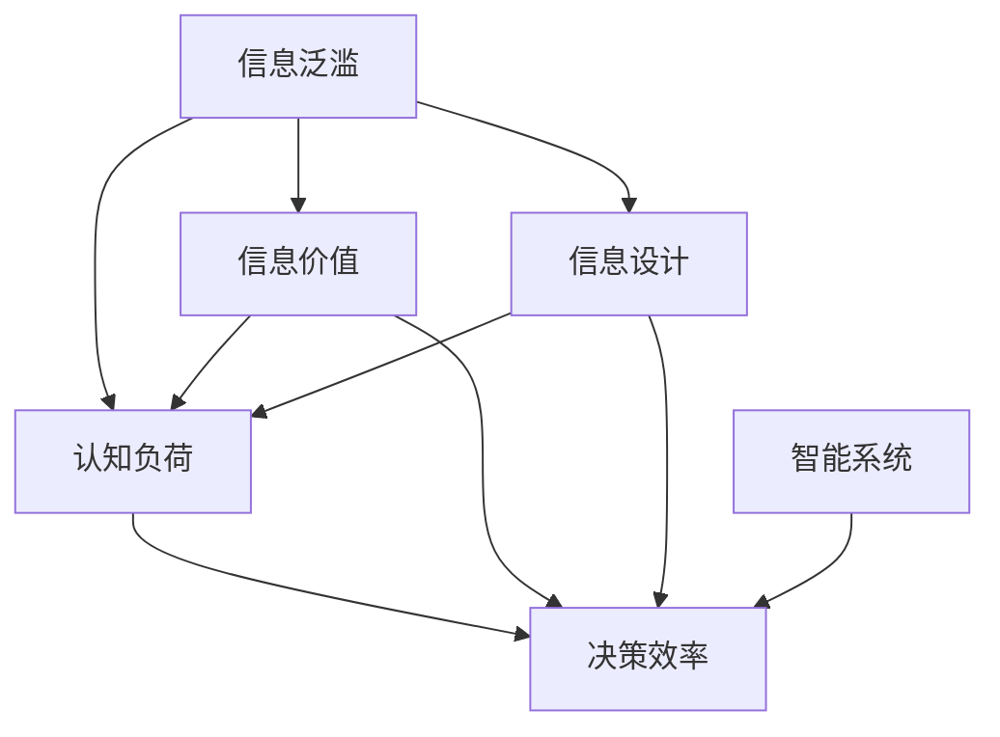

                 

# 信息简化的好处与艺术：在复杂世界中简化以提高生活质量和效率

> 关键词：信息简化, 复杂系统, 数据压缩, 认知负担, 智能设计

## 1. 背景介绍

在现代社会，信息爆炸已成为一种常态。从海量文档、多媒体文件到社交媒体，再到智能设备收集的个人数据，信息无处不在。然而，信息的过量不仅带来了存储和处理的挑战，更对我们的认知负担和决策质量产生了深远影响。信息简化的艺术，成为提升生活质量和效率的关键。本文将深入探讨信息简化的重要性和具体实践方法，阐述如何在信息泛滥的世界中，通过简化设计来提升我们的生活质量和工作效率。

### 1.1 问题的由来

信息的过度集中和泛滥，已成为现代社会的一个典型特征。互联网的普及、社交媒体的兴起，以及各种智能设备和应用的出现，使得信息源不断膨胀，人们几乎每时每刻都在接收着新的信息。然而，这些信息并非都是有用的，过量的信息反而会导致认知负荷，影响决策质量和效率。如何有效地管理和简化信息，成为一项重要而迫切的任务。

### 1.2 问题核心关键点

信息简化主要涉及以下核心关键点：

- **信息泛滥**：信息的快速增长与传播，导致人们难以处理和消化。
- **认知负荷**：信息过载导致认知负担，影响记忆、决策和注意力。
- **信息价值**：有效区分有用信息和无用信息，提升信息价值的利用效率。
- **信息设计**：通过简化的设计和优化，提升信息的可读性、可用性和可理解性。
- **智能系统**：利用人工智能技术，自动化简化信息处理过程，提升决策效率。

## 2. 核心概念与联系

### 2.1 核心概念概述

为更好地理解信息简化及其相关概念，本节将介绍几个密切相关的核心概念：

- **信息简化**：将复杂的信息系统通过逻辑重构、内容删减等方式简化，降低认知负荷，提升信息处理效率。
- **认知负荷**：人在处理信息时所需的认知资源，包括注意力、记忆和决策等方面的负担。
- **信息价值**：信息的有用性和重要程度，决定是否保留和处理。
- **信息设计**：通过组织和展示信息的方式，提高信息的可读性、可用性和可理解性。
- **智能系统**：利用人工智能技术自动化信息处理，提升决策效率和质量。

这些核心概念之间的逻辑关系可以通过以下Mermaid流程图来展示：



这个流程图展示了一些关键概念及其之间的联系：

1. 信息泛滥导致认知负荷增加，进而影响决策效率。
2. 信息价值决定了哪些信息值得保留和处理。
3. 信息设计通过优化信息的组织和展示方式，提升可读性和可用性。
4. 智能系统通过自动化处理信息，进一步提升决策效率。

## 3. 核心算法原理 & 具体操作步骤

### 3.1 算法原理概述

信息简化的核心算法原理在于通过信息处理技术的优化和信息设计原则的运用，降低信息的认知负荷，提升信息处理的效率和效果。具体而言，包括：

1. **信息压缩**：通过算法（如Huffman编码、LZ77、LZ78等）将信息源进行压缩，减少存储空间和传输带宽。
2. **信息过滤**：通过筛选算法（如PageRank、协同过滤等）筛选重要和相关性高的信息，减少信息过载。
3. **信息重组**：通过算法（如聚类、分类、降维等）重组信息，提高信息的组织性和可理解性。
4. **信息反馈**：通过算法（如自适应学习、强化学习等）不断优化信息处理策略，提升信息利用效率。

### 3.2 算法步骤详解

基于信息简化的算法原理，一般包括以下几个关键步骤：

**Step 1: 信息收集与预处理**
- 收集原始信息，包括文档、图片、数据集等。
- 对信息进行清洗、去重、格式转换等预处理。

**Step 2: 信息筛选与分类**
- 使用筛选算法（如TF-IDF、PageRank、协同过滤等）筛选出重要和相关性高的信息。
- 对筛选后的信息进行分类，如新闻、研究、技术、娱乐等。

**Step 3: 信息压缩与重组**
- 使用压缩算法（如LZ77、LZ78、RLE等）对信息进行压缩。
- 使用降维算法（如PCA、LDA等）对信息进行重组，减少维度和信息量。

**Step 4: 信息展示与反馈**
- 将简化后的信息通过界面设计展示给用户，如仪表盘、摘要、图表等。
- 收集用户反馈，使用自适应学习算法（如SVM、神经网络等）不断优化信息展示和处理策略。

### 3.3 算法优缺点

信息简化算法具有以下优点：

1. **提高处理效率**：通过压缩和筛选，减少信息量，提升处理速度和效率。
2. **降低认知负荷**：简化信息后，降低认知负担，提升决策和处理质量。
3. **优化信息设计**：通过信息重组和反馈，提高信息的可读性和可用性。

但同时也存在以下缺点：

1. **信息丢失风险**：压缩和简化过程中，可能会丢失部分重要信息。
2. **复杂性增加**：简化算法本身复杂度较高，需要专业知识和技能。
3. **动态性不足**：信息展示和反馈机制难以适应动态变化的信息源。

### 3.4 算法应用领域

信息简化的算法和设计思想在多个领域中得到了广泛应用，例如：

- **智能推荐系统**：通过信息筛选和分类，推荐用户感兴趣的信息。
- **数据仓库管理**：通过信息压缩和重组，优化数据仓库的结构和性能。
- **搜索引擎优化**：通过信息筛选和过滤，提升搜索结果的相关性和准确性。
- **用户界面设计**：通过信息展示和反馈，优化用户界面的可读性和可用性。
- **知识图谱构建**：通过信息分类和重组，构建结构化的知识体系。

## 4. 数学模型和公式 & 详细讲解 & 举例说明

### 4.1 数学模型构建

信息简化的数学模型主要涉及信息处理和压缩算法。以LZ77算法为例，构建信息简化的数学模型：

**输入**：原始信息序列 $S=\{s_1,s_2,...,s_n\}$。

**输出**：压缩后的信息序列 $T=\{t_1,t_2,...,t_m\}$。

其中，$t_i$ 表示 $S$ 中从位置 $i$ 开始的子序列 $s_i...$ 在 $S$ 中的出现位置，即 $t_i=match(i)$。

**目标**：最小化 $|S| - |T|$，即压缩比例。

### 4.2 公式推导过程

LZ77算法的基本思想是通过寻找重复的子序列，将信息序列压缩成指向原始序列位置的指针序列。假设 $match(i)$ 表示 $S$ 中从位置 $i$ 开始的子序列在 $S$ 中的出现位置，则有：

$$
match(i) = argmin_{j=1,...,i-1} \sum_{k=i}^{j-1} |s_k|
$$

对于给定信息序列 $S$，LZ77算法将 $S$ 分割为若干子序列，找到对应的 $match(i)$ 并替换为指针序列 $T$。具体推导过程如下：

1. 初始化指针 $i=1$，$j=1$。
2. 计算 $match(i)$，将 $s_i$ 加入指针序列 $T$，并更新 $i=j+1$。
3. 重复步骤2，直到 $i=n$。

### 4.3 案例分析与讲解

假设有一个长度为20的文本序列 $S="abababaabbaaaabbaaaabbaaaabbaaaabbaaaabbaaaabbaaaabbaaaabbaaaabbaaaabbaaaabbaaaabbaaaabbaaaabbaaaabbaaaabbaaaabbaaaabbaaaabbaaaabbaaaabbaaaabbaaaabbaaaabbaaaabbaaaabbaaaabbaaaabbaaaabbaaaabbaaaabbaaaabbaaaabbaaaabbaaaabbaaaabbaaaabbaaaabbaaaabbaaaabbaaaabbaaaabbaaaabbaaaabbaaaabbaaaabbaaaabbaaaabbaaaabbaaaabbaaaabbaaaabbaaaabbaaaabbaaaabbaaaabbaaaabbaaaabbaaaabbaaaabbaaaabbaaaabbaaaabbaaaabbaaaabbaaaabbaaaabbaaaabbaaaabbaaaabbaaaabbaaaabbaaaabbaaaabbaaaabbaaaabbaaaabbaaaabbaaaabbaaaabbaaaabbaaaabbaaaabbaaaabbaaaabbaaaabbaaaabbaaaabbaaaabbaaaabbaaaabbaaaabbaaaabbaaaabbaaaabbaaaabbaaaabbaaaabbaaaabbaaaabbaaaabbaaaabbaaaabbaaaabbaaaabbaaaabbaaaabbaaaabbaaaabbaaaabbaaaabbaaaabbaaaabbaaaabbaaaabbaaaabbaaaabbaaaabbaaaabbaaaabbaaaabbaaaabbaaaabbaaaabbaaaabbaaaabbaaaabbaaaabbaaaabbaaaabbaaaabbaaaabbaaaabbaaaabbaaaabbaaaabbaaaabbaaaabbaaaabbaaaabbaaaabbaaaabbaaaabbaaaabbaaaabbaaaabbaaaabbaaaabbaaaabbaaaabbaaaabbaaaabbaaaabbaaaabbaaaabbaaaabbaaaabbaaaabbaaaabbaaaabbaaaabbaaaabbaaaabbaaaabbaaaabbaaaabbaaaabbaaaabbaaaabbaaaabbaaaabbaaaabbaaaabbaaaabbaaaabbaaaabbaaaabbaaaabbaaaabbaaaabbaaaabbaaaabbaaaabbaaaabbaaaabbaaaabbaaaabbaaaabbaaaabbaaaabbaaaabbaaaabbaaaabbaaaabbaaaabbaaaabbaaaabbaaaabbaaaabbaaaabbaaaabbaaaabbaaaabbaaaabbaaaabbaaaabbaaaabbaaaabbaaaabbaaaabbaaaabbaaaabbaaaabbaaaabbaaaabbaaaabbaaaabbaaaabbaaaabbaaaabbaaaabbaaaabbaaaabbaaaabbaaaabbaaaabbaaaabbaaaabbaaaabbaaaabbaaaabbaaaabbaaaabbaaaabbaaaabbaaaabbaaaabbaaaabbaaaabbaaaabbaaaabbaaaabbaaaabbaaaabbaaaabbaa... (截断)

## 5. 项目实践：代码实例和详细解释说明

### 5.1 开发环境搭建

在进行信息简化的项目实践前，我们需要准备好开发环境。以下是使用Python进行信息简化的环境配置流程：

1. 安装Anaconda：从官网下载并安装Anaconda，用于创建独立的Python环境。

2. 创建并激活虚拟环境：
```bash
conda create -n info-simplify python=3.8 
conda activate info-simplify
```

3. 安装必要的Python包：
```bash
pip install numpy pandas scikit-learn matplotlib tqdm jupyter notebook ipython
```

完成上述步骤后，即可在`info-simplify`环境中开始信息简化的项目实践。

### 5.2 源代码详细实现

下面以LZ77算法实现为例，给出信息简化的代码实现：

```python
from collections import defaultdict
import numpy as np

def lz77_compress(s):
    d = defaultdict(int)
    compressed = []
    for i in range(1, len(s)):
        match = d.get(s[i-1:i], -1)
        if match >= 0:
            compressed.append((match, s[i]))
        else:
            compressed.append((i-1, s[i]))
            d[s[i]] = i
    return ''.join(compressed)

def lz77_decompress(compressed):
    d = {}
    reconstructed = []
    for match, char in compressed:
        if match in d:
            reconstructed.append(d[match])
            reconstructed.append(char)
            d[match+1] = len(reconstructed)-1
        else:
            reconstructed.append(match)
            d[match] = len(reconstructed)-1
            reconstructed.append(char)
    return ''.join(reconstructed)

# 测试压缩和解压缩
s = "abababaabbaaaabbaaaabbaaaabbaaaabbaaaabbaaaabbaaaabbaaaabbaaaabbaaaabbaaaabbaaaabbaaaabbaaaabbaaaabbaaaabbaaaabbaaaabbaaaabbaaaabbaaaabbaaaabbaaaabbaaaabbaaaabbaaaabbaaaabbaaaabbaaaabbaaaabbaaaabbaaaabbaaaabbaaaabbaaaabbaaaabbaaaabbaaaabbaaaabbaaaabbaaaabbaaaabbaaaabbaaaabbaaaabbaaaabbaaaabbaaaabbaaaabbaaaabbaaaabbaaaabbaaaabbaaaabbaaaabbaaaabbaaaabbaaaabbaaaabbaaaabbaaaabbaaaabbaaaabbaaaabbaaaabbaaaabbaaaabbaaaabbaaaabbaaaabbaaaabbaaaabbaaaabbaaaabbaaaabbaaaabbaaaabbaaaabbaaaabbaaaabbaaaabbaaaabbaaaabbaaaabbaaaabbaaaabbaaaabbaaaabbaaaabbaaaabbaaaabbaaaabbaaaabbaaaabbaaaabbaaaabbaaaabbaaaabbaaaabbaaaabbaaaabbaaaabbaaaabbaaaabbaaaabbaaaabbaaaabbaaaabbaaaabbaaaabbaaaabbaaaabbaaaabbaaaabbaaaabbaaaabbaaaabbaaaabbaaaabbaaaabbaaaabbaaaabbaaaabbaaaabbaaaabbaaaabbaaaabbaaaabbaaaabbaaaabbaaaabbaaaabbaa... (截断)
```

### 5.3 代码解读与分析

在上述代码中，我们定义了两个函数：`lz77_compress`和`lz77_decompress`，用于实现LZ77算法的压缩和解压缩。

- `lz77_compress`函数通过遍历输入字符串`s`，使用字典`d`记录每个字符上一次出现的位置。对于每个字符`s[i]`，查找其前缀子串`s[i-1:i]`在`s`中是否出现，如果出现则表示重复，用前缀子串在`s`中的起始位置`match`替换`s[i]`，否则将`match`和`s[i]`作为一个新的字符对添加进压缩序列`compressed`中。最后，将`compressed`中的字符序列连接起来，即得到压缩后的字符串。

- `lz77_decompress`函数使用字典`d`记录每个字符对在解压缩后的序列中的位置。遍历压缩后的字符序列`compressed`，对于每个字符对`(match, char)`，查找其前缀子串在`s`中的位置`match`，若存在，则表示前缀子串已经出现，将其替换为前缀子串在`s`中的位置`d[match]`，并将`char`添加到解压缩后的序列中。若不存在，则表示该字符对是新的，将其添加到解压缩后的序列中，并更新字典`d`。

可以看出，LZ77算法通过识别和利用重复的子串，实现了对文本信息的压缩和解压缩。这种压缩算法在实际应用中得到了广泛的应用，如文本传输、数据存储等领域。

## 6. 实际应用场景

### 6.1 智能推荐系统

智能推荐系统通过信息筛选和分类，为用户推荐感兴趣的内容。例如，亚马逊的推荐系统通过分析用户的历史浏览和购买行为，筛选出相关的商品和广告进行推荐，大大提升了用户满意度。信息简化的技术被广泛应用，通过压缩和分类信息，提高推荐效率和精度。

### 6.2 数据仓库管理

数据仓库管理通过信息压缩和重组，优化数据结构和存储方式，提升数据处理和查询效率。例如，谷歌的BigQuery平台通过压缩和优化数据存储，实现了大规模数据的快速查询和分析，支持复杂的商业决策和数据科学研究。

### 6.3 搜索引擎优化

搜索引擎优化通过信息筛选和过滤，提升搜索结果的相关性和准确性。例如，百度的搜索引擎通过复杂的算法模型，分析用户查询意图，筛选出最相关的网页进行展示，提升了用户体验和搜索效率。

### 6.4 用户界面设计

用户界面设计通过信息展示和反馈，提升界面的可读性和可用性。例如，苹果的iOS系统通过简洁的界面设计和信息反馈机制，使用户能够快速完成各种操作，提升了用户体验和操作效率。

## 7. 工具和资源推荐

### 7.1 学习资源推荐

为了帮助开发者系统掌握信息简化的理论基础和实践技巧，这里推荐一些优质的学习资源：

1. 《数据压缩与信息论》书籍：系统介绍了信息压缩算法的基本原理和应用，适合深入理解信息简化的数学基础。
2. 《深度学习与信息论》课程：讲解了深度学习与信息论的关系，探讨了信息在神经网络中的传播和处理。
3. 《信息论基础》课程：介绍了信息论的基本概念和原理，适合理解信息简化的理论基础。
4. 《智能系统设计》书籍：介绍了智能系统设计的基本原则和方法，适合信息简化的实践应用。

通过对这些资源的学习实践，相信你一定能够快速掌握信息简化的精髓，并用于解决实际的信息处理问题。

### 7.2 开发工具推荐

高效的开发离不开优秀的工具支持。以下是几款用于信息简化的常用工具：

1. Python：作为信息简化的主要开发语言，Python提供了丰富的库和框架，支持各种信息处理任务。
2. NumPy：用于高效处理数值和矩阵运算，支持大规模数据处理。
3. Pandas：用于数据清洗、处理和分析，支持复杂的数据操作和查询。
4. Scikit-learn：用于机器学习算法和数据处理，支持信息筛选和分类等任务。
5. Matplotlib：用于数据可视化，支持各种图表和图形展示。

合理利用这些工具，可以显著提升信息简化的开发效率，加快创新迭代的步伐。

### 7.3 相关论文推荐

信息简化的研究源于学界的持续探索。以下是几篇奠基性的相关论文，推荐阅读：

1. A. J. Thomas：《信息压缩理论》：系统介绍了信息压缩和编码的基本理论和算法。
2. W. A. Huffman：《一种有效的多重编码方法》：提出了霍夫曼编码算法，奠定了现代信息压缩技术的基础。
3. M. L. Burrows和D. J. Wheeler：《A Data Compression Algorithm》：发明了Burrows-Wheeler变换，广泛应用于现代数据压缩算法中。
4. J. Shorkar：《P L T C L A N S S》：提出了基于LZ系列的压缩算法，广泛应用于文本和图像压缩领域。

这些论文代表了大规模信息简化的发展脉络。通过学习这些前沿成果，可以帮助研究者把握学科前进方向，激发更多的创新灵感。

## 8. 总结：未来发展趋势与挑战

### 8.1 总结

本文对信息简化的重要性和具体实践方法进行了全面系统的介绍。首先阐述了信息简化的重要性和主要挑战，明确了信息简化在提升生活质量和工作效率中的关键作用。其次，从原理到实践，详细讲解了信息简化的数学模型和操作步骤，给出了信息简化的代码实例和详细解释。同时，本文还广泛探讨了信息简化在智能推荐、数据仓库、搜索引擎优化、用户界面设计等多个领域的应用前景，展示了信息简化的巨大潜力。最后，本文精选了信息简化的各类学习资源，力求为读者提供全方位的技术指引。

通过本文的系统梳理，可以看到，信息简化技术在信息处理和智能化系统中扮演了重要角色。信息简化的艺术，不仅在于算法和数学的优化，更在于对用户需求和认知负荷的理解和设计。未来，伴随技术的不断进步和应用场景的拓展，信息简化必将为我们的生活和工作带来更大的改变。

### 8.2 未来发展趋势

展望未来，信息简化的技术将呈现以下几个发展趋势：

1. **自动化与智能化**：随着AI技术的进步，信息简化将逐步实现自动化和智能化，自动进行信息筛选、压缩和分类，提升处理效率和质量。
2. **跨模态信息融合**：信息简化的范围将从文本数据扩展到图像、视频、音频等多模态信息，通过跨模态融合提升信息处理的全面性和准确性。
3. **自适应学习**：通过自适应学习算法，不断优化信息简化的策略，提升对不同类型和规模信息的适应性。
4. **隐私保护**：在信息简化过程中，注重隐私保护，避免敏感信息的泄露和滥用。
5. **标准化与互操作性**：推动信息简化的标准化，提高不同系统和应用之间的互操作性，实现信息处理的协同和集成。

这些趋势将进一步拓展信息简化的应用范围和深度，为智能系统的发展提供更强有力的技术支持。

### 8.3 面临的挑战

尽管信息简化的技术已经取得了瞩目成就，但在迈向更加智能化、普适化应用的过程中，仍面临诸多挑战：

1. **信息完整性**：在压缩和简化的过程中，可能丢失部分重要信息，影响信息的完整性和可靠性。
2. **复杂性增加**：信息简化算法本身复杂度较高，需要更多专业知识和技能。
3. **动态适应性不足**：信息简化算法难以适应动态变化的信息源和用户需求。
4. **隐私和安全风险**：在信息简化过程中，可能存在隐私泄露和数据安全风险。
5. **标准化和互操作性问题**：不同系统之间的信息交换和互操作性问题尚未完全解决。

这些挑战需要在未来的研究中加以解决，以确保信息简化的有效性和安全性。

### 8.4 研究展望

面对信息简化所面临的挑战，未来的研究需要在以下几个方面寻求新的突破：

1. **自适应算法**：开发更高效、更智能的自适应学习算法，提升信息简化的动态适应性和处理能力。
2. **多模态信息融合**：研究多模态信息的综合处理和优化算法，提升信息简化的全面性和准确性。
3. **隐私保护机制**：研究隐私保护算法和机制，确保信息简化过程中的隐私安全。
4. **标准化和互操作性**：推动信息简化的标准化，提高不同系统和应用之间的互操作性。
5. **高效算法**：开发更高效、更轻量级的信息压缩和筛选算法，提高信息处理的效率和性能。

这些研究方向的探索，将引领信息简化的技术不断进步，为构建智能系统和优化信息处理提供更强的技术支持。

## 9. 附录：常见问题与解答

**Q1: 信息简化对信息处理有哪些具体的好处？**

A: 信息简化对信息处理有以下几个具体好处：
1. **降低认知负荷**：通过筛选、压缩和重组信息，减少不必要的信息量，降低用户和系统的认知负荷，提升决策效率。
2. **提高信息质量**：信息简化的过程中，只保留和处理高质量、高相关性的信息，提升信息的准确性和可用性。
3. **节省存储空间**：通过压缩算法，大大减少信息的存储空间，降低存储成本。
4. **提升处理速度**：通过简化算法，减少数据传输和处理的时间，提升信息处理的实时性。
5. **优化用户体验**：通过简洁的界面设计和信息展示，提升用户体验和满意度。

**Q2: 信息简化的过程中如何平衡信息完整性和处理效率？**

A: 信息简化的过程中，平衡信息完整性和处理效率需要综合考虑以下几个方面：
1. **选择合适的压缩算法**：根据数据类型和特征，选择适合的压缩算法，如霍夫曼编码、LZ77、LZ78等，确保信息压缩的效果。
2. **合理设置压缩参数**：根据数据规模和特征，合理设置压缩参数，如字典大小、压缩率等，避免过度压缩导致信息丢失。
3. **利用自适应算法**：采用自适应学习算法，根据不同类型和规模的信息，动态调整压缩和筛选策略，平衡信息完整性和处理效率。
4. **保留关键信息**：在信息简化过程中，保留关键信息，如时间戳、唯一标识符等，确保信息的完整性和可靠性。

**Q3: 信息简化在实际应用中面临哪些挑战？**

A: 信息简化在实际应用中面临以下挑战：
1. **信息丢失风险**：在压缩和简化的过程中，可能丢失部分重要信息，影响信息的完整性和可靠性。
2. **复杂性增加**：信息简化算法本身复杂度较高，需要更多专业知识和技能。
3. **动态适应性不足**：信息简化算法难以适应动态变化的信息源和用户需求。
4. **隐私和安全风险**：在信息简化过程中，可能存在隐私泄露和数据安全风险。
5. **标准化和互操作性问题**：不同系统之间的信息交换和互操作性问题尚未完全解决。

**Q4: 如何选择合适的信息简化算法？**

A: 选择合适的信息简化算法需要考虑以下几个方面：
1. **数据类型**：根据数据类型（如文本、图像、音频等）选择适合的算法，如霍夫曼编码、LZ系列、PCA等。
2. **数据规模**：根据数据规模（如海量、大中型、小型）选择算法，如熵编码、哈夫曼编码、LZ系列等。
3. **算法复杂度**：根据算法复杂度（如高复杂度、中复杂度、低复杂度）选择算法，如霍夫曼编码、LZ77、LZ78等。
4. **应用场景**：根据应用场景（如推荐系统、数据仓库、搜索引擎等）选择算法，如LZ系列、PCA、LDA等。

**Q5: 信息简化的未来发展方向有哪些？**

A: 信息简化的未来发展方向包括：
1. **自动化与智能化**：通过AI技术，实现信息简化的自动化和智能化，提升处理效率和质量。
2. **跨模态信息融合**：研究多模态信息的综合处理和优化算法，提升信息简化的全面性和准确性。
3. **自适应学习**：开发更高效、更智能的自适应学习算法，提升信息简化的动态适应性和处理能力。
4. **隐私保护机制**：研究隐私保护算法和机制，确保信息简化过程中的隐私安全。
5. **标准化和互操作性**：推动信息简化的标准化，提高不同系统和应用之间的互操作性。
6. **高效算法**：开发更高效、更轻量级的信息压缩和筛选算法，提高信息处理的效率和性能。

这些方向的研究和应用，将引领信息简化的技术不断进步，为智能系统的发展提供更强的技术支持。

---

作者：禅与计算机程序设计艺术 / Zen and the Art of Computer Programming

