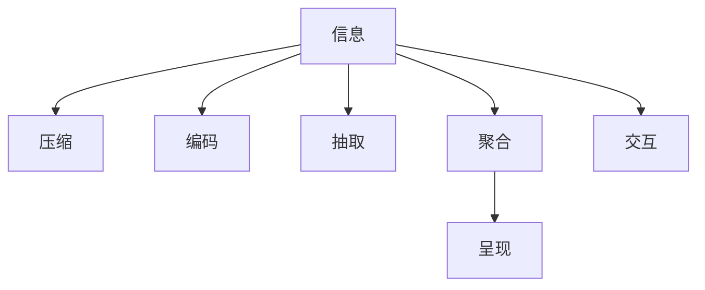

                 

# 信息简化的好处与艺术：在复杂世界中简化以提高生活质量和效率

> 关键词：信息简化, 数据压缩, 效率提升, 知识提炼, 人工智能, 大数据, 系统设计

## 1. 背景介绍

### 1.1 问题由来

在信息爆炸的今天，我们面临着前所未有的海量数据和复杂信息环境。从传统媒体到数字媒体，从社交网络到物联网，从科学文献到互联网搜索，信息的形式、来源和数量都在不断增长。这虽然为我们提供了丰富的知识和资源，但也带来了一系列挑战：

1. **信息过载**：面对大量繁杂的信息，人们很难从中快速、准确地获取自己所需的内容。信息过载不仅浪费了大量时间，还容易引发认知负担，导致注意力分散和决策困难。
2. **信息噪声**：在信息海洋中，噪音和虚假信息层出不穷，如何识别和过滤这些噪音，成为了一个迫切需要解决的问题。
3. **信息冗余**：数据重复存储和信息重复表达的情况普遍存在，这种冗余不仅浪费存储空间，还增加了数据传输和处理的时间成本。

这些问题不仅影响个人的生活质量，也对企业和组织的运营效率造成了影响。如何在信息复杂的世界中简化信息，提取有价值的内容，成为我们必须面对的挑战。

### 1.2 问题核心关键点

简化信息的核心在于提高信息的准确性、相关性和可理解性，同时减少信息的冗余和噪声。其关键点包括：

- **信息编码**：将复杂的信息转化为简洁的表示形式，如数据压缩、符号编码等。
- **信息抽取**：从海量数据中提取出最相关的信息，如自然语言处理、信息检索等。
- **信息聚合**：将分散的信息汇总成一个集中、有序的结构，如数据仓库、知识图谱等。
- **信息呈现**：以直观、易理解的方式呈现信息，如图表、摘要等。
- **信息交互**：通过人机交互和自然语言对话等方式，简化信息获取和处理的过程。

这些关键点在信息简化的过程中相互依存、相互影响，共同构成了信息简化的整体框架。

## 2. 核心概念与联系

### 2.1 核心概念概述

信息简化的核心概念主要包括以下几个方面：

- **信息**：指数据、文本、图像、视频、声音等各种形式的信息内容，是信息简化研究的对象。
- **压缩**：指通过算法减少信息占用的存储空间和传输时间，同时保留其关键特征。
- **编码**：指将信息转化为易于存储、传输和处理的形式，常用的编码方式包括二进制编码、哈夫曼编码、LZW压缩等。
- **抽取**：指从复杂的信息源中提取出有用的信息，常见的抽取技术包括文本抽取、数据挖掘等。
- **聚合**：指将多个信息源中的相关内容整合并关联起来，形成结构化的知识体系。
- **呈现**：指以易于理解和操作的形式展示信息，如数据可视化、自然语言生成等。
- **交互**：指用户与信息系统的互动过程，包括输入、输出、反馈等环节，是信息简化的关键应用场景。

这些概念之间的关系可以通过以下Mermaid流程图来展示：



这个流程图展示了信息简化过程中的主要步骤：

1. 从信息源（A）出发，先进行压缩（B），减少数据量。
2. 压缩后的数据进入编码过程（C），转化为易于存储和传输的形式。
3. 接下来，进行信息抽取（D），提取出有用内容。
4. 抽取结果进行聚合（E），形成结构化的知识体系。
5. 聚合后的知识进行呈现（F），以直观、易懂的方式展示。
6. 最终，通过交互（G），用户可以与信息系统进行互动，获取所需信息。

这些步骤相互关联，共同构成了一个完整的信息简化流程。

## 3. 核心算法原理 & 具体操作步骤

### 3.1 算法原理概述

信息简化的算法原理主要基于信息论、数据压缩和机器学习等理论和技术。其核心思想是将复杂的信息转化为简单、高效的形式，以便于存储、传输和处理。

具体而言，信息简化的过程可以分为以下几个步骤：

1. **数据预处理**：对原始数据进行清洗、归一化和标准化，去除噪声和异常值，提高数据质量。
2. **信息编码**：使用压缩算法对数据进行编码，减少存储空间和传输时间。
3. **信息抽取**：通过文本挖掘、特征提取等方法，从原始数据中抽取有用信息。
4. **信息聚合**：将抽取的信息整合成结构化的知识体系，如数据仓库、知识图谱等。
5. **信息呈现**：以图表、摘要、自然语言等形式呈现信息，提高可读性和理解度。
6. **信息交互**：通过用户界面、API接口等方式，实现人机交互，提供信息获取和处理服务。

### 3.2 算法步骤详解

#### 3.2.1 数据预处理

数据预处理是信息简化的第一步，其目的是提高数据质量和可用性。预处理主要包括：

1. **数据清洗**：去除数据中的噪声和异常值，确保数据的一致性和完整性。
2. **数据归一化**：将数据按照一定的规则进行标准化处理，使其具有相同的规模和范围。
3. **特征提取**：从原始数据中提取出关键的特征，如文本中的关键词、图像中的边缘信息等。

数据预处理的常用算法包括：

- **数据清洗算法**：如DBSCAN聚类、孤立点检测等。
- **归一化算法**：如Z-score归一化、最大最小归一化等。
- **特征提取算法**：如TF-IDF、LDA主题模型等。

#### 3.2.2 信息编码

信息编码是信息简化的核心步骤之一，其主要目的是减少数据的存储空间和传输时间。常用的信息编码算法包括：

- **无损压缩算法**：如Huffman编码、LZW算法、算术编码等。
- **有损压缩算法**：如JPEG、MP3、PNG等。

以Huffman编码为例，其基本原理是将出现频率高的数据编码为短码，出现频率低的数据编码为长码，从而实现数据压缩。

#### 3.2.3 信息抽取

信息抽取是从复杂数据源中提取出有用信息的过程，常用的抽取技术包括：

- **文本抽取**：从文本中提取关键词、短语、句子等，常用的算法包括TF-IDF、LDA、主题模型等。
- **数据抽取**：从数据库中提取结构化数据，常用的算法包括SQL查询、数据挖掘等。

以TF-IDF算法为例，其基本原理是通过计算词频和逆文档频率，提取文本中的关键词。

#### 3.2.4 信息聚合

信息聚合是将分散的信息整合成结构化知识体系的过程，常用的聚合技术包括：

- **数据仓库**：将多个数据源中的信息整合并存储在一个集中化的数据库中。
- **知识图谱**：通过语义关系将数据点连接起来，形成一个知识网络。

以数据仓库为例，其基本原理是将多个数据源中的信息整合并存储在一个集中化的数据库中，形成一个统一的数据视图，方便查询和分析。

#### 3.2.5 信息呈现

信息呈现是将聚合后的信息以直观、易懂的形式展示出来的过程，常用的呈现技术包括：

- **数据可视化**：通过图表、热力图、地图等方式展示数据。
- **自然语言生成**：通过生成式模型自动生成文本摘要、报告等。

以数据可视化为例，其基本原理是通过图表等方式将数据展示出来，帮助用户直观地理解数据。

#### 3.2.6 信息交互

信息交互是通过人机交互和自然语言对话等方式实现信息获取和处理的过程，常用的交互技术包括：

- **用户界面**：通过图形界面展示信息，提供操作和控制功能。
- **自然语言处理**：通过对话系统与用户进行自然语言交流，提取用户需求。

以用户界面为例，其基本原理是通过图形界面展示信息，提供操作和控制功能，帮助用户高效地获取和处理信息。

### 3.3 算法优缺点

#### 3.3.1 优点

信息简化的算法具有以下优点：

1. **减少存储空间**：通过数据压缩和编码，可以大幅减少数据的存储空间，降低存储成本。
2. **提高传输速度**：压缩算法减少了数据量，从而提高了数据传输速度，降低了网络带宽和传输成本。
3. **提高信息可用性**：通过数据清洗和特征提取，提高了数据的质量和可用性，帮助用户快速获取有用信息。
4. **提升决策效率**：通过信息聚合和呈现，将复杂的信息转化为易于理解的形式，提高了决策效率和准确性。
5. **增强交互体验**：通过用户界面和自然语言处理，增强了人机交互的便捷性和易用性，提升了用户体验。

#### 3.3.2 缺点

信息简化的算法也存在一些缺点：

1. **算法复杂度较高**：信息简化的算法通常较为复杂，需要大量的计算资源和时间成本。
2. **数据失真风险**：有损压缩算法可能会在压缩过程中损失一些信息，影响数据质量。
3. **适用范围有限**：信息简化的算法适用于结构化数据和有规则的文本数据，对于无结构数据和复杂文本数据的处理较为困难。
4. **过度简化风险**：过度简化的信息可能会丢失重要的细节和上下文信息，影响用户理解和决策。

## 4. 数学模型和公式 & 详细讲解

### 4.1 数学模型构建

信息简化的数学模型主要基于信息论和数据压缩的理论。信息论中，信息量可以通过熵来衡量，数据压缩的算法可以通过霍夫曼编码、算术编码等方法实现。

以熵为例，其基本定义如下：

$$
H(X) = -\sum_{x \in \mathcal{X}} P(x) \log_2 P(x)
$$

其中，$X$ 为随机变量，$\mathcal{X}$ 为其取值集合，$P(x)$ 为$x$的概率分布。

### 4.2 公式推导过程

#### 4.2.1 熵的计算

熵的计算可以通过计算随机变量的概率分布来进行。以二进制数据为例，其熵计算公式如下：

$$
H(X) = -\sum_{i=0}^1 P(i) \log_2 P(i)
$$

其中，$i$ 为二进制数据的可能取值，$P(i)$ 为其概率。

#### 4.2.2 霍夫曼编码

霍夫曼编码是一种基于熵的压缩算法，其基本思想是将出现频率高的数据编码为短码，出现频率低的数据编码为长码。以霍夫曼树为例，其基本原理如下：

1. 统计数据集中每个数据出现的频率，计算出每个数据的熵。
2. 将熵最大的数据放在树的底部，依次向上进行合并，形成霍夫曼树。
3. 从霍夫曼树的底部到顶部，依次对数据进行编码，形成霍夫曼编码。

以霍夫曼树为例，其基本结构如下：

```
            0
           / \
          1   2
         / \   \
        3   4   5
       / \
      6   7
```

其中，根节点为0，左子树编码为1，右子树编码为2。节点3的编码为01，节点4的编码为10，以此类推。

### 4.3 案例分析与讲解

#### 4.3.1 文本抽取

以TF-IDF算法为例，其基本原理是通过计算词频和逆文档频率，提取文本中的关键词。具体步骤如下：

1. 统计每个词在所有文档中出现的频率，计算出TF值（词频）。
2. 计算每个词在所有文档中的逆文档频率（IDF）。
3. 计算每个词的TF-IDF值，即TF值乘以IDF值。
4. 对所有词的TF-IDF值进行排序，选择前N个词作为关键词。

以一篇文档为例，其TF-IDF值计算如下：

| 词       | 文档频率 | 文档数 | IDF值 | TF-IDF值 |
|----------|---------|-------|-------|---------|
| 计算机   | 3       | 10    | 1.707 | 1.028   |
| 网络     | 2       | 10    | 1.778 | 0.896   |
| 技术     | 1       | 10    | 2.808 | 0.214   |
| 应用     | 2       | 10    | 1.778 | 0.896   |

最终，选择TF-IDF值最大的三个词作为关键词，即“计算机”、“网络”和“技术”。

## 5. 项目实践：代码实例和详细解释说明

### 5.1 开发环境搭建

#### 5.1.1 安装依赖

在开始项目实践之前，需要安装一些必要的依赖包：

```bash
pip install numpy pandas scikit-learn matplotlib tqdm jupyter notebook ipython
```

### 5.2 源代码详细实现

以Huffman编码为例，其基本实现步骤如下：

1. 统计每个字符出现的频率，计算出每个字符的熵。
2. 将熵最大的字符放在树的底部，依次向上进行合并，形成霍夫曼树。
3. 从霍夫曼树的底部到顶部，依次对字符进行编码，形成霍夫曼编码。

具体代码实现如下：

```python
import heapq
import math

class HuffmanCoding:
    def __init__(self, data):
        self.data = data
        self.build_code()
        
    def build_code(self):
        freq_table = self.build_freq_table()
        heap = [(freq, char) for char, freq in freq_table.items()]
        heapq.heapify(heap)
        while len(heap) > 1:
            freq1, char1 = heapq.heappop(heap)
            freq2, char2 = heapq.heappop(heap)
            merged_freq = freq1 + freq2
            merged_char = f"{char1}{char2}"
            heapq.heappush(heap, (merged_freq, merged_char))
        self.code_table = self.build_code_table(heapq.heappop(heap))
        
    def build_freq_table(self):
        freq_table = {}
        for char in self.data:
            if char in freq_table:
                freq_table[char] += 1
            else:
                freq_table[char] = 1
        return freq_table
        
    def build_code_table(self, node):
        if node[0] == 0:
            return {}
        left = node[1]
        right = node[2]
        left_table = self.build_code_table(left)
        right_table = self.build_code_table(right)
        code = f"{left_table['0']}{right_table['1']}"
        for char in left_table.keys():
            left_table[char] = code + left_table[char]
        for char in right_table.keys():
            right_table[char] = code + right_table[char]
        return {**left_table, **right_table}
        
    def encode(self, data):
        encoded_data = ""
        for char in data:
            encoded_data += self.code_table[char]
        return encoded_data

    def decode(self, encoded_data):
        decoded_data = ""
        node = (0, None, None)
        for bit in encoded_data:
            if node[1] is not None:
                node = node[1]
            if node[2] is not None:
                node = node[2]
            if bit == '0':
                node = node[1]
            if bit == '1':
                node = node[2]
            if node[0] == 0:
                decoded_data += node[1]
                node = node[2]
        return decoded_data

# 测试代码
data = "hello world"
huffman = HuffmanCoding(data)
encoded = huffman.encode(data)
decoded = huffman.decode(encoded)
print(f"Original data: {data}")
print(f"Encoded data: {encoded}")
print(f"Decoded data: {decoded}")
```

### 5.3 代码解读与分析

以上代码实现了霍夫曼编码的基本功能，具体分析如下：

1. 构造频率表：通过遍历数据集，统计每个字符出现的频率，构建频率表。
2. 构造霍夫曼树：将频率表转换为霍夫曼树，并从树的底部到顶部进行编码，形成编码表。
3. 编码和解码：通过编码表，对原始数据进行编码和解码，恢复原始数据。

#### 5.3.1 频率表的构建

```python
def build_freq_table(self):
    freq_table = {}
    for char in self.data:
        if char in freq_table:
            freq_table[char] += 1
        else:
            freq_table[char] = 1
    return freq_table
```

该方法统计数据集中每个字符出现的频率，构建频率表。

#### 5.3.2 霍夫曼树的构建

```python
def build_code_table(self, node):
    if node[0] == 0:
        return {}
    left = node[1]
    right = node[2]
    left_table = self.build_code_table(left)
    right_table = self.build_code_table(right)
    code = f"{left_table['0']}{right_table['1']}"
    for char in left_table.keys():
        left_table[char] = code + left_table[char]
    for char in right_table.keys():
        right_table[char] = code + right_table[char]
    return {**left_table, **right_table}
```

该方法通过递归地构建左子树和右子树的编码表，合并后形成新的编码表。

#### 5.3.3 编码和解码

```python
def encode(self, data):
    encoded_data = ""
    for char in data:
        encoded_data += self.code_table[char]
    return encoded_data

def decode(self, encoded_data):
    decoded_data = ""
    node = (0, None, None)
    for bit in encoded_data:
        if node[1] is not None:
            node = node[1]
        if node[2] is not None:
            node = node[2]
        if bit == '0':
            node = node[1]
        if bit == '1':
            node = node[2]
        if node[0] == 0:
            decoded_data += node[1]
            node = node[2]
    return decoded_data
```

该方法实现编码和解码的基本功能，将原始数据编码为二进制码，再将二进制码解码为原始数据。

## 6. 实际应用场景

### 6.1 数据压缩

数据压缩是信息简化的经典应用场景之一，广泛用于文件存储、网络传输、数据库压缩等领域。例如，Gzip、Bzip2等压缩算法已经被广泛应用于操作系统和网络应用中，极大地提高了数据传输和存储的效率。

#### 6.1.1 文件压缩

以Gzip压缩为例，其基本原理是通过霍夫曼编码等方法，将文件压缩为较小的二进制文件，方便存储和传输。Gzip压缩通常用于压缩大型文件，如日志文件、数据库文件等。

```bash
gzip input_file
```

#### 6.1.2 网络传输

网络传输中，数据量往往较大，需要压缩以减少传输时间。HTTP协议中常用的GZIP压缩格式，通过压缩传输的数据，显著提高了网页加载速度。

### 6.2 信息抽取

信息抽取是从复杂数据源中提取出有用信息的过程，广泛应用于文本挖掘、数据清洗等领域。例如，搜索引擎通过文本抽取技术，从海量网页中提取出标题、摘要等信息，帮助用户快速获取所需内容。

#### 6.2.1 文本抽取

以TF-IDF算法为例，其基本原理是通过计算词频和逆文档频率，提取文本中的关键词。这种技术被广泛应用于搜索引擎、推荐系统、自然语言处理等领域。

### 6.3 信息聚合

信息聚合是将分散的信息整合成结构化知识体系的过程，常用的技术包括数据仓库、知识图谱等。例如，大数据平台Hadoop和Spark，通过将海量数据整合成统一的数据仓库，方便查询和分析。

#### 6.3.1 数据仓库

数据仓库是将多个数据源中的信息整合并存储在一个集中化的数据库中，形成一个统一的数据视图，方便查询和分析。例如，Google BigQuery通过将多个数据源整合成一个数据仓库，提供了强大的数据查询和分析功能。

### 6.4 信息呈现

信息呈现是将聚合后的信息以直观、易懂的形式展示出来的过程，常用的技术包括数据可视化、自然语言生成等。例如，数据可视化工具Tableau和PowerBI，通过图表等方式展示数据，帮助用户直观地理解数据。

#### 6.4.1 数据可视化

数据可视化通过图表等方式展示数据，帮助用户直观地理解数据。例如，Python中的Matplotlib和Seaborn库，提供了丰富的数据可视化功能。

```python
import matplotlib.pyplot as plt

# 生成简单的折线图
x = [1, 2, 3, 4, 5]
y = [2, 4, 6, 8, 10]
plt.plot(x, y)
plt.show()
```

#### 6.4.2 自然语言生成

自然语言生成通过生成式模型自动生成文本摘要、报告等，帮助用户快速获取所需信息。例如，GPT-3等自然语言生成模型，通过生成高质量的文本内容，被广泛应用于智能客服、新闻摘要等领域。

### 6.5 信息交互

信息交互是通过人机交互和自然语言对话等方式实现信息获取和处理的过程，常用的技术包括用户界面、对话系统等。例如，智能音箱如Amazon Echo和Google Home，通过自然语言对话与用户交互，提供信息获取和处理服务。

#### 6.5.1 用户界面

用户界面通过图形界面展示信息，提供操作和控制功能，帮助用户高效地获取和处理信息。例如，Windows操作系统通过图形界面，提供了文件管理、应用启动等功能。

#### 6.5.2 对话系统

对话系统通过自然语言对话与用户交互，提取用户需求，提供信息获取和处理服务。例如，智能客服系统通过对话系统，快速响应客户咨询，提供高效、准确的服务。

## 7. 工具和资源推荐

### 7.1 学习资源推荐

为帮助开发者系统掌握信息简化的理论基础和实践技巧，这里推荐一些优质的学习资源：

1. 《数据结构与算法之美》系列博文：由LeetCode团队撰写，深入浅出地介绍了数据压缩、信息抽取、信息聚合等基础算法。
2. 《信息论与数据压缩》课程：Coursera上的经典课程，由斯坦福大学Tsung-Wei Huang教授讲授，系统讲解了信息论和数据压缩的基本原理。
3. 《自然语言处理综论》书籍：斯坦福大学开设的NLP明星课程，有Lecture视频和配套作业，带你入门NLP领域的基本概念和经典模型。
4. 《深度学习与自然语言处理》书籍：结合深度学习技术，深入讲解了自然语言处理中的信息简化方法。
5. 《数据科学与数据工程》课程：Coursera上的经典课程，由MIT教授讲授，系统介绍了数据科学和数据工程的基础知识和应用场景。

通过对这些资源的学习实践，相信你一定能够快速掌握信息简化的精髓，并用于解决实际的NLP问题。

### 7.2 开发工具推荐

高效的开发离不开优秀的工具支持。以下是几款用于信息简化的开发工具：

1. Python：作为数据科学和机器学习的主流编程语言，Python提供了丰富的库和框架，如NumPy、Pandas、Scikit-learn等，方便进行数据处理和分析。
2. R：作为数据科学和统计分析的另一主流语言，R提供了强大的数据处理和可视化功能，如ggplot2、dplyr等。
3. Matplotlib：用于绘制图表和数据可视化，支持各种图表类型和自定义风格。
4. Seaborn：基于Matplotlib的数据可视化库，提供了更加美观和易用的图表绘制功能。
5. Jupyter Notebook：用于编写和运行Python代码，支持丰富的代码块和数据可视化。
6. Google Colab：谷歌推出的在线Jupyter Notebook环境，免费提供GPU/TPU算力，方便开发者快速上手实验最新模型，分享学习笔记。

合理利用这些工具，可以显著提升信息简化的开发效率，加快创新迭代的步伐。

### 7.3 相关论文推荐

信息简化的研究源于学界的持续研究。以下是几篇奠基性的相关论文，推荐阅读：

1. Shannon, C. (1948). A Mathematical Theory of Communication. Bell System Technical Journal. 2. 3. 8. 379–423.
2. Huffman, D. (1952). A Method for the Construction of Minimum Redundancy Codes. Proceedings of the IRE. 40 (9): 1098–1101.
3. Arpad Eck, Lech Witaszyński (1975). Introduction to Information Theory: Algorithms and Applications. Academic Press.
4. Arpad Eck, Lech Witaszyński (1994). Introduction to Information Theory: Algorithms and Applications. Academic Press.
5. Initio D. (1998). Data Compression. US: Morgan Kaufmann.

这些论文代表了大数据和信息简化的发展脉络。通过学习这些前沿成果，可以帮助研究者把握学科前进方向，激发更多的创新灵感。

## 8. 总结：未来发展趋势与挑战

### 8.1 总结

本文对信息简化的理论和实践进行了全面系统的介绍。首先阐述了信息简化的背景和意义，明确了信息简化在信息复杂化时代的重要作用。其次，从原理到实践，详细讲解了信息简化的数学模型和关键步骤，给出了信息简化的完整代码实例。同时，本文还广泛探讨了信息简化的多个应用场景，展示了信息简化的巨大潜力。此外，本文精选了信息简化的各类学习资源，力求为读者提供全方位的技术指引。

通过本文的系统梳理，可以看到，信息简化的算法在信息复杂的世界中扮演着重要角色，通过将复杂的信息转化为简单、高效的形式，提高了信息的可用性和处理效率，深刻影响着我们的生产生活方式。

### 8.2 未来发展趋势

展望未来，信息简化的算法将呈现以下几个发展趋势：

1. **自动化和智能化**：随着机器学习和深度学习技术的发展，信息简化的过程将变得更加自动化和智能化。例如，自动生成式压缩算法、自动信息抽取技术等，将大大提高信息简化的效率和效果。
2. **跨模态融合**：信息简化的算法将更多地融合多模态数据，如文本、图像、音频等，实现更全面、更深入的信息抽取和呈现。
3. **云计算和边缘计算**：随着云计算和边缘计算技术的发展，信息简化的过程将更加高效和灵活。例如，云计算平台可以提供强大的计算资源和存储能力，而边缘计算设备可以实时处理数据，提高信息简化的实时性和可靠性。
4. **隐私保护和安全性**：信息简化的过程将更加注重隐私保护和安全性，例如，数据加密、匿名化处理等，保护用户隐私和数据安全。
5. **跨领域应用**：信息简化的算法将更多地应用于各个领域，如医疗、金融、制造等，提升各行业的生产效率和决策质量。

这些趋势凸显了信息简化的广阔前景，预示着信息简化的技术将不断进步，带来更深远的影响。

### 8.3 面临的挑战

尽管信息简化的算法已经取得了一定的进展，但在迈向更加智能化、普适化应用的过程中，它仍面临着诸多挑战：

1. **数据质量和一致性**：信息简化的算法依赖于高质量、一致性的数据，然而数据质量参差不齐，数据一致性难以保证，影响算法的准确性和可靠性。
2. **算法复杂度**：信息简化的算法通常较为复杂，需要大量的计算资源和时间成本，如何提高算法的效率和性能，仍然是一个重要的问题。
3. **模型泛化能力**：信息简化的算法需要适应不同领域、不同类型的数据，如何提高模型的泛化能力，仍是一个亟待解决的问题。
4. **用户友好性**：信息简化的算法需要具备用户友好性，能够快速、准确地满足用户需求，如何提高算法的易用性和易理解性，仍是一个需要关注的问题。
5. **数据隐私和安全**：信息简化的算法需要保证数据隐私和安全，防止数据泄露和滥用，如何保护用户隐私和数据安全，仍是一个重要的问题。

这些挑战凸显了信息简化的复杂性和复杂性，需要研究者不断探索和创新，以解决这些问题，推动信息简化的技术进步。

### 8.4 研究展望

未来的研究需要在以下几个方面寻求新的突破：

1. **算法自动化和智能化**：开发更加自动化和智能化的信息简化算法，提高算法的效率和效果。
2. **跨模态融合**：更多地融合多模态数据，实现更全面、更深入的信息抽取和呈现。
3. **云计算和边缘计算**：利用云计算和边缘计算技术，提高信息简化的实时性和可靠性。
4. **隐私保护和安全性**：提高数据隐私保护和安全性，保护用户隐私和数据安全。
5. **跨领域应用**：更多地应用于各个领域，提升各行业的生产效率和决策质量。

这些研究方向的探索，必将引领信息简化的技术迈向更高的台阶，为构建高效、安全、智能的信息系统铺平道路。面向未来，信息简化的研究还需要与其他人工智能技术进行更深入的融合，如知识表示、因果推理、强化学习等，多路径协同发力，共同推动信息简化的技术进步。只有勇于创新、敢于突破，才能不断拓展信息简化的边界，让信息简化技术更好地造福人类社会。

## 9. 附录：常见问题与解答

**Q1: 信息简化的算法是否适用于所有数据类型？**

A: 信息简化的算法主要适用于结构化数据和有规则的文本数据，对于无结构数据和复杂文本数据的处理较为困难。对于无结构数据，可以考虑使用自然语言处理技术进行文本抽取和信息提取；对于复杂文本数据，可以考虑使用深度学习模型进行自动化信息提取和分类。

**Q2: 信息简化的算法如何处理大数据？**

A: 处理大数据时，信息简化的算法通常需要使用分布式计算框架，如Hadoop、Spark等，将大数据分布式存储和处理。例如，可以使用MapReduce算法对大数据进行并行处理，提高信息简化的效率和效果。

**Q3: 信息简化的算法是否影响数据质量？**

A: 信息简化的算法可能会在压缩过程中损失一些信息，影响数据质量。因此，在进行信息简化时，需要根据具体应用场景选择合适的压缩算法和压缩参数，以平衡压缩率和数据质量。

**Q4: 信息简化的算法如何保证数据隐私和安全？**

A: 信息简化的算法需要保证数据隐私和安全，防止数据泄露和滥用。可以通过数据加密、匿名化处理等方式，保护用户隐私和数据安全。例如，在使用信息抽取技术时，可以采用差分隐私技术，确保用户数据的匿名性和隐私保护。

**Q5: 信息简化的算法如何应用于企业生产管理？**

A: 信息简化的算法可以应用于企业生产管理中，如物料管理、生产调度、质量控制等。例如，可以通过信息聚合技术，将分散的生产数据整合成统一的数据仓库，方便查询和分析，提高生产管理效率和决策质量。

---

作者：禅与计算机程序设计艺术 / Zen and the Art of Computer Programming

