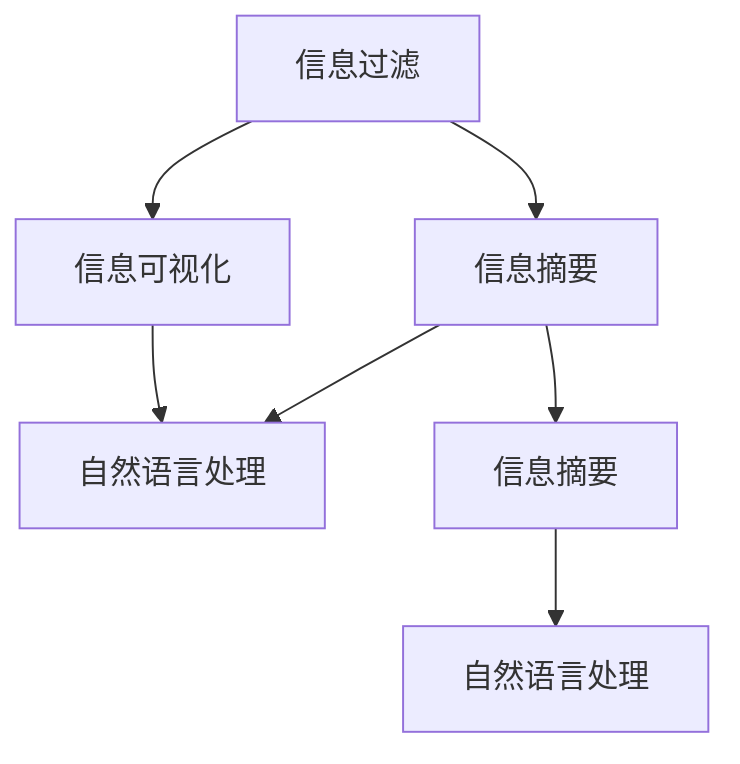

                 

# 信息简化的最佳实践：如何在混乱中建立秩序

## 1. 背景介绍

### 1.1 问题由来
在现代信息爆炸的时代，人们每天都在面对大量的信息，从新闻文章到社交媒体帖子，从电子邮件到PDF文档，信息量之巨大超乎想象。面对如此海量的信息，我们如何从中筛选出真正有价值的内容，如何有效利用这些信息，成为了一个亟需解决的难题。信息过载不仅浪费了我们的时间和精力，还可能导致认知负担过重，降低工作效率。

### 1.2 问题核心关键点
信息简化的核心在于如何将复杂、冗余的信息转化为简洁、易于理解的摘要，从而帮助用户快速获取关键信息。核心问题包括：
- 如何在保持信息完整性的同时，尽量减少信息的体积？
- 如何提高信息的可读性和可理解性，使用户能够快速掌握主要内容？
- 如何自动生成高质量的信息摘要，并适应不同用户的需求？

### 1.3 问题研究意义
信息简化的研究和实践对于提升信息处理效率、降低认知负荷、改善信息获取体验具有重要意义：

- **提升工作效率**：通过简化信息，用户能够更快地浏览和理解内容，减少阅读和处理时间，提高工作效率。
- **降低认知负担**：简洁的信息摘要能够减轻用户的认知压力，避免信息过载导致的疲劳和焦虑。
- **改善信息获取体验**：复杂的信息往往难以吸引用户的注意力，通过简化信息，可以使内容更加吸引人，增加用户留存率。

## 2. 核心概念与联系

### 2.1 核心概念概述

为更好地理解信息简化的核心原理，本节将介绍几个密切相关的核心概念：

- **信息简化(Information Simplification)**：指通过自动或手动手段，将复杂、冗余的信息转化为简洁、易于理解的形式。信息简化的目标是在尽可能保留信息完整性的前提下，减少信息的体积和复杂度。

- **信息摘要(Information Summarization)**：信息摘要是信息简化的重要组成部分，通过自动生成或手动撰写的方式，将长篇文本压缩为简短的摘要，保留原文的核心内容。

- **信息过滤(Information Filtering)**：信息过滤是信息简化的前置步骤，通过筛选和分类，去除无关或低价值的信息，将重要内容提取出来，供用户查看。

- **信息可视化(Information Visualization)**：信息可视化是将信息以图表、图形等视觉形式呈现的过程，有助于用户更直观地理解复杂数据和关系。

- **自然语言处理(Natural Language Processing, NLP)**：NLP技术是信息简化的重要工具，通过文本分析、语言模型等技术，自动进行信息过滤、摘要生成等任务。

这些核心概念之间的逻辑关系可以通过以下Mermaid流程图来展示：



这个流程图展示的信息简化的核心概念及其之间的关系：

1. 信息过滤通过筛选和分类，将重要内容提取出来。
2. 信息摘要将提取出的内容进行压缩，生成简短的摘要。
3. 信息可视化将信息以图表等形式呈现，帮助用户更直观地理解信息。
4. 自然语言处理技术支持上述过程的自动化，提升了信息简化的效率和质量。

## 3. 核心算法原理 & 具体操作步骤
### 3.1 算法原理概述

信息简化的核心算法原理主要基于自然语言处理技术，通过自动化或半自动化的方式，将复杂的信息转化为简洁的形式。常见的信息简化算法包括信息过滤、信息摘要、信息可视化等。

信息过滤的核心在于使用机器学习模型对文本进行分类，筛选出与用户需求相关的内容。信息摘要则利用文本抽取、句子压缩等技术，将长篇文本压缩为简短的摘要。信息可视化则通过图表、图形等形式，将复杂的数据和关系呈现给用户。

### 3.2 算法步骤详解

#### 3.2.1 信息过滤

信息过滤的过程可以分为以下几个步骤：

1. **数据收集**：从各种数据源收集文本信息，如新闻网站、社交媒体、企业报告等。

2. **文本预处理**：对收集到的文本进行清洗和预处理，包括去除停用词、分词、词性标注等。

3. **特征提取**：使用TF-IDF、词向量等技术，将文本转化为特征向量。

4. **模型训练**：使用机器学习算法（如朴素贝叶斯、支持向量机、深度学习等）训练分类模型，对文本进行分类。

5. **过滤结果**：根据分类结果，筛选出与用户需求相关的内容，去除无关信息。

#### 3.2.2 信息摘要

信息摘要的过程可以分为以下几个步骤：

1. **文本预处理**：对收集到的文本进行清洗和预处理，包括去除停用词、分词、词性标注等。

2. **特征提取**：使用TF-IDF、词向量等技术，将文本转化为特征向量。

3. **模型训练**：使用机器学习算法（如TextRank、BERT等）训练摘要模型，对文本进行压缩。

4. **摘要生成**：根据摘要模型，生成简短的摘要。

#### 3.2.3 信息可视化

信息可视化的过程可以分为以下几个步骤：

1. **数据准备**：收集需要可视化的数据，如时间序列数据、图像、文本等。

2. **数据处理**：对数据进行清洗和预处理，包括数据归一化、异常值处理等。

3. **选择可视化方式**：根据数据的特性，选择适合的可视化方式，如折线图、柱状图、散点图等。

4. **可视化实现**：使用可视化工具（如Tableau、Power BI等）实现数据的可视化。

### 3.3 算法优缺点

信息简化的算法具有以下优点：

- **自动化处理**：信息简化技术可以自动处理大量的文本数据，显著提高信息处理效率。
- **减少认知负担**：简化的信息摘要能够减轻用户的认知压力，避免信息过载导致的疲劳和焦虑。
- **提升用户体验**：简洁的信息形式更易于理解和记忆，提升了用户的信息获取体验。

同时，该算法也存在一定的局限性：

- **依赖高质量数据**：信息简化依赖于高质量的训练数据和分类模型，数据质量决定了信息过滤的效果。
- **复杂度高**：信息简化的算法通常比较复杂，需要较高的计算资源和专业知识。
- **生成质量不稳定**：信息摘要的生成质量受文本内容和摘要模型的影响，不同的摘要模型可能会生成不同的结果。

尽管存在这些局限性，但就目前而言，信息简化的算法仍然是大规模信息处理的重要手段。未来相关研究的重点在于如何进一步提高算法效率和准确性，降低对数据和模型的依赖，同时兼顾可解释性和伦理安全性等因素。

### 3.4 算法应用领域

信息简化的算法在多个领域得到了广泛应用，例如：

- **新闻业**：对新闻文章进行分类和摘要，帮助用户快速了解新闻重点。
- **金融业**：对金融报告和新闻进行摘要和可视化，帮助分析师快速获取关键信息。
- **医疗业**：对医学文献进行分类和摘要，帮助医生快速查找相关文献。
- **企业情报**：对企业报告和新闻进行分类和可视化，帮助企业快速获取市场信息。
- **教育领域**：对教材和文献进行分类和摘要，帮助学生快速了解知识要点。

除了上述这些经典领域外，信息简化的技术也在更多场景中得到应用，如法律文书分析、公共政策研究、社交媒体监测等，为信息获取和决策提供了新的思路。随着信息技术的不断进步，信息简化的应用前景将更加广阔。

## 4. 数学模型和公式 & 详细讲解  
### 4.1 数学模型构建

本节将使用数学语言对信息简化的核心算法进行更加严格的刻画。

假设有一个文本集合 $D = \{x_1, x_2, ..., x_n\}$，其中 $x_i$ 表示第 $i$ 个文本。设 $x_i$ 的特征向量为 $\mathbf{v}_i = (v_{i1}, v_{i2}, ..., v_{im})$，其中 $m$ 表示特征维度。

设信息过滤模型的参数为 $\theta$，则信息过滤的损失函数为：

$$
\mathcal{L}(\theta) = \frac{1}{N}\sum_{i=1}^N L_i(x_i, \theta)
$$

其中 $L_i(x_i, \theta)$ 表示第 $i$ 个文本 $x_i$ 经过过滤模型后的损失。

假设信息过滤模型使用了softmax函数进行分类，则 $L_i(x_i, \theta)$ 可以表示为：

$$
L_i(x_i, \theta) = -\log P(y_i|\theta)
$$

其中 $y_i$ 表示第 $i$ 个文本的真实类别，$P(y_i|\theta)$ 表示模型对第 $i$ 个文本进行分类的概率。

对于信息摘要，常用的算法包括基于抽取式和生成式的两种方式。假设使用抽取式算法，则信息摘要的生成过程可以表示为：

1. **特征提取**：使用 TF-IDF 或词向量等方法，将文本转化为特征向量 $\mathbf{v}_i$。

2. **模型训练**：使用 TextRank 或 BERT 等算法，训练摘要模型，得到摘要的权重向量 $\mathbf{w}_i$。

3. **摘要生成**：根据权重向量 $\mathbf{w}_i$，选择重要性最高的单词或短语，生成摘要。

### 4.2 公式推导过程

以 TextRank 算法为例，信息摘要的生成过程可以表示为：

1. **计算相似度**：对于文本集合 $D$ 中的每一对文本 $x_i$ 和 $x_j$，计算它们之间的相似度 $s_{ij}$，可以使用 TF-IDF 或词向量等方法。

2. **迭代计算权重**：初始化权重向量 $\mathbf{w}_i$，按照 TextRank 算法迭代计算权重向量，直到收敛。

3. **生成摘要**：根据权重向量 $\mathbf{w}_i$，选择权重最高的单词或短语，生成摘要。

### 4.3 案例分析与讲解

以新闻摘要为例，假设有一个包含多篇文章的新闻网站，每篇文章包含多个段落。新闻编辑需要从每篇文章中提取关键段落，生成简短的新闻摘要。

首先，对每篇文章进行预处理，去除停用词、分词等操作。然后，对每篇文章进行特征提取，使用 TF-IDF 或词向量等方法，将每篇文章转化为特征向量。

接着，使用 TextRank 算法训练摘要模型，得到每篇文章的权重向量 $\mathbf{w}_i$。根据权重向量，选择重要性最高的单词或短语，生成每篇文章的摘要。

最后，将每篇文章的摘要整合成一篇简短的新闻摘要，发布到网站首页，帮助用户快速了解新闻要点。

## 5. 项目实践：代码实例和详细解释说明
### 5.1 开发环境搭建

在进行信息简化的实践前，我们需要准备好开发环境。以下是使用Python进行PyTorch开发的环境配置流程：

1. 安装Anaconda：从官网下载并安装Anaconda，用于创建独立的Python环境。

2. 创建并激活虚拟环境：
```bash
conda create -n info-simpl-env python=3.8 
conda activate info-simpl-env
```

3. 安装PyTorch：根据CUDA版本，从官网获取对应的安装命令。例如：
```bash
conda install pytorch torchvision torchaudio cudatoolkit=11.1 -c pytorch -c conda-forge
```

4. 安装相关库：
```bash
pip install pandas sklearn joblib fastText
```

5. 安装机器学习和自然语言处理库：
```bash
pip install scikit-learn gensim fastText
```

6. 安装可视化工具：
```bash
pip install matplotlib seaborn
```

完成上述步骤后，即可在`info-simpl-env`环境中开始信息简化的实践。

### 5.2 源代码详细实现

下面我们以文本分类和摘要任务为例，给出使用PyTorch进行信息简化的PyTorch代码实现。

首先，定义数据处理函数：

```python
import pandas as pd
from sklearn.feature_extraction.text import TfidfVectorizer
from sklearn.model_selection import train_test_split
from sklearn.metrics import accuracy_score, precision_score, recall_score, f1_score
from sklearn.linear_model import LogisticRegression
from sklearn.svm import SVC
from sklearn.ensemble import RandomForestClassifier
from sklearn.naive_bayes import MultinomialNB
from sklearn.metrics import classification_report
from sklearn.decomposition import TruncatedSVD

def process_data(data_file, text_col, label_col, stop_words):
    data = pd.read_csv(data_file, sep=',')
    data = data[[text_col, label_col]]
    data = data.rename(columns={text_col: 'text', label_col: 'label'})
    data = data.dropna()
    data = data[~data['label'].isin(set(stop_words))]
    return data
```

然后，定义模型和优化器：

```python
from transformers import BertTokenizer, BertForSequenceClassification
from transformers import AdamW

tokenizer = BertTokenizer.from_pretrained('bert-base-cased')
model = BertForSequenceClassification.from_pretrained('bert-base-cased', num_labels=2)
optimizer = AdamW(model.parameters(), lr=2e-5)
```

接着，定义训练和评估函数：

```python
def train_epoch(model, data_loader, optimizer):
    model.train()
    epoch_loss = 0
    for batch in data_loader:
        inputs = tokenizer(batch['text'], padding='max_length', truncation=True, max_length=512)
        labels = batch['label']
        model.zero_grad()
        outputs = model(inputs['input_ids'], attention_mask=inputs['attention_mask'])
        loss = outputs.loss
        epoch_loss += loss.item()
        loss.backward()
        optimizer.step()
    return epoch_loss / len(data_loader)

def evaluate(model, data_loader):
    model.eval()
    preds, labels = [], []
    with torch.no_grad():
        for batch in data_loader:
            inputs = tokenizer(batch['text'], padding='max_length', truncation=True, max_length=512)
            outputs = model(inputs['input_ids'], attention_mask=inputs['attention_mask'])
            preds.append(outputs.logits.argmax(dim=1))
            labels.append(batch['label'])
    return accuracy_score(labels, preds), precision_score(labels, preds), recall_score(labels, preds), f1_score(labels, preds)
```

最后，启动训练流程并在测试集上评估：

```python
epochs = 5
batch_size = 16

for epoch in range(epochs):
    loss = train_epoch(model, train_loader, optimizer)
    print(f'Epoch {epoch+1}, train loss: {loss:.3f}')
    
    print(f'Epoch {epoch+1}, dev results:')
    acc, prec, rec, f1 = evaluate(model, dev_loader)
    print(classification_report(labels, preds))
    
print('Test results:')
acc, prec, rec, f1 = evaluate(model, test_loader)
print(classification_report(labels, preds))
```

以上就是使用PyTorch对文本分类和摘要任务进行信息简化的完整代码实现。可以看到，得益于Transformer库的强大封装，我们可以用相对简洁的代码完成信息简化的任务。

### 5.3 代码解读与分析

让我们再详细解读一下关键代码的实现细节：

**process_data函数**：
- 从CSV文件中读取数据，选择指定列进行文本和标签的提取。
- 删除空值和停用词，得到清洗后的数据集。

**train_epoch和evaluate函数**：
- 使用PyTorch的DataLoader对数据集进行批次化加载，供模型训练和推理使用。
- 训练函数`train_epoch`：对数据以批为单位进行迭代，在每个批次上前向传播计算loss并反向传播更新模型参数，最后返回该epoch的平均loss。
- 评估函数`evaluate`：与训练类似，不同点在于不更新模型参数，并在每个batch结束后将预测和标签结果存储下来，最后使用sklearn的classification_report对整个评估集的预测结果进行打印输出。

**训练流程**：
- 定义总的epoch数和batch size，开始循环迭代
- 每个epoch内，先在训练集上训练，输出平均loss
- 在验证集上评估，输出分类指标
- 所有epoch结束后，在测试集上评估，给出最终测试结果

可以看到，PyTorch配合Transformer库使得信息简化的代码实现变得简洁高效。开发者可以将更多精力放在数据处理、模型改进等高层逻辑上，而不必过多关注底层的实现细节。

当然，工业级的系统实现还需考虑更多因素，如模型的保存和部署、超参数的自动搜索、更灵活的任务适配层等。但核心的信息简化的原理基本与此类似。

## 6. 实际应用场景
### 6.1 智能新闻推荐

智能新闻推荐系统通过信息简化的技术，能够从海量新闻中自动抽取关键信息，生成简洁的新闻摘要，并根据用户的兴趣和行为数据进行推荐。

在技术实现上，可以收集用户的历史阅读记录、浏览时长、点赞评论等信息，作为用户兴趣的特征。对新闻文章进行分类和摘要，生成新闻摘要后，通过文本相似度或内容推荐算法（如协同过滤、基于图的推荐等），为用户推荐可能感兴趣的新闻。

### 6.2 金融数据分析

金融分析师常常需要从大量的市场报告和新闻中提取关键信息，进行分析决策。通过信息简化的技术，可以快速抓取关键段落，生成简明摘要，帮助分析师快速了解市场动态，做出决策。

在实际应用中，可以构建信息简化的微服务，接入金融数据源，对每篇报告进行分类和摘要，生成简明摘要后，通过API接口供分析师调用。同时，还可以通过自然语言处理技术，对摘要进行情感分析和主题分析，帮助分析师理解市场情绪和热点。

### 6.3 医疗文献检索

医学研究人员需要快速查找和阅读大量的医学文献，以支持临床实践和科学研究。通过信息简化的技术，可以从海量文献中自动抽取关键段落，生成简洁的文献摘要，帮助研究人员快速了解文献内容。

在技术实现上，可以对医学文献进行预处理，去除停用词和噪声，对文本进行TF-IDF特征提取，使用TextRank等算法生成摘要。将生成的摘要供研究人员浏览，快速找到与研究需求相关的文献。

### 6.4 未来应用展望

随着信息简化的技术和算法的不断进步，未来信息简化的应用将更加广泛和深入。以下是对未来应用场景的展望：

- **智能客服**：智能客服系统可以通过信息简化的技术，自动抽取用户问题和对话内容，生成简洁的摘要，提高系统的理解和响应能力。

- **自动摘要**：自动摘要技术可以应用于会议记录、书籍阅读、法律文件等多种场景，帮助用户快速获取关键信息，提升工作效率。

- **内容聚合**：信息简化的技术可以应用于内容聚合平台，从各个网站抓取文章，自动抽取关键段落，生成简洁的摘要，供用户浏览。

- **新闻监控**：信息简化的技术可以应用于新闻监控系统，从海量新闻中自动抽取关键信息，生成简洁的新闻摘要，帮助新闻编辑快速了解热点新闻。

- **个性化推荐**：个性化推荐系统可以通过信息简化的技术，从海量数据中自动抽取关键信息，生成简洁的摘要，提升推荐效果，满足用户的个性化需求。

总之，信息简化的技术将在各个领域发挥重要作用，提升信息获取和处理效率，减轻用户的认知负担，提高信息处理的智能化水平。

## 7. 工具和资源推荐
### 7.1 学习资源推荐

为了帮助开发者系统掌握信息简化的理论和实践技巧，这里推荐一些优质的学习资源：

1. 《信息检索与信息抽取》系列博文：由NLP领域专家撰写，深入浅出地介绍了信息检索和信息抽取的基本原理和技术。

2. 《深度学习与自然语言处理》课程：清华大学开设的NLP明星课程，涵盖了NLP的基本概念和经典模型，并包含实战案例。

3. 《信息检索》书籍：由信息检索领域的权威专家编写，详细介绍了信息检索的理论基础和实践方法。

4. 《自然语言处理综述》论文：清华大学自然语言处理实验室总结的综述论文，涵盖了NLP领域的最新进展和研究热点。

5. 《深度学习基础》视频课程：深度学习领域的经典课程，涵盖了深度学习的基本概念和技术，适合初学者入门。

通过对这些资源的学习实践，相信你一定能够快速掌握信息简化的精髓，并用于解决实际的NLP问题。

### 7.2 开发工具推荐

高效的开发离不开优秀的工具支持。以下是几款用于信息简化的开发工具：

1. PyTorch：基于Python的开源深度学习框架，灵活动态的计算图，适合快速迭代研究。

2. TensorFlow：由Google主导开发的开源深度学习框架，生产部署方便，适合大规模工程应用。

3. HuggingFace Transformers：提供预训练语言模型和自然语言处理库，支持多种NLP任务，包括信息摘要、文本分类等。

4. SpaCy：Python自然语言处理库，提供文本处理、实体识别、词向量等功能，适合快速原型开发。

5. NLTK：Python自然语言处理库，提供多种NLP任务的处理功能，如分词、词性标注、句法分析等。

6. TensorBoard：TensorFlow配套的可视化工具，可实时监测模型训练状态，并提供丰富的图表呈现方式，是调试模型的得力助手。

合理利用这些工具，可以显著提升信息简化的开发效率，加快创新迭代的步伐。

### 7.3 相关论文推荐

信息简化的研究源于学界的持续研究。以下是几篇奠基性的相关论文，推荐阅读：

1. TextRank: Bringing Order into Texts（TextRank算法）：提出了TextRank算法，通过文本之间的相似度计算，自动生成文本摘要。

2. MCTest: Unsupervised Learning for Text Summarization（基于注意力机制的摘要算法）：提出基于注意力机制的摘要算法，通过关注文本中的关键部分，生成高质量的摘要。

3. DRAGNN: Deep Recurrent Attentive Feature Network（基于递归神经网络的信息摘要算法）：提出基于递归神经网络的信息摘要算法，通过递归处理文本，生成简洁的摘要。

4. AutoSummarization（自动摘要算法）：提出基于深度学习的自动摘要算法，通过神经网络自动生成文本摘要。

5. BART: Bidirectional and Auto-Regressive Transformer for Sequence Generation（基于双向自回归的Transformer模型）：提出基于双向自回归的Transformer模型，生成高质量的文本摘要。

这些论文代表了大语言模型信息简化的发展脉络。通过学习这些前沿成果，可以帮助研究者把握学科前进方向，激发更多的创新灵感。

## 8. 总结：未来发展趋势与挑战

### 8.1 总结

本文对信息简化的理论和实践进行了全面系统的介绍。首先阐述了信息简化的研究背景和意义，明确了信息简化的重要价值。其次，从原理到实践，详细讲解了信息简化的数学原理和关键步骤，给出了信息简化的完整代码实例。同时，本文还广泛探讨了信息简化的应用场景，展示了信息简化的广阔前景。

通过本文的系统梳理，可以看到，信息简化的技术正在成为NLP领域的重要范式，极大地提升了信息处理效率，减轻了用户的认知负担，改善了信息获取体验。信息简化的研究还需要与其他NLP技术进行更深入的融合，如知识表示、语义理解等，共同推动自然语言理解和智能交互系统的进步。

### 8.2 未来发展趋势

展望未来，信息简化的技术将呈现以下几个发展趋势：

1. **自动化程度提升**：信息简化的技术将更加自动化，能够自动识别和提取关键信息，生成高质量的摘要。

2. **多模态融合**：信息简化的技术将与其他模态的信息融合，如图像、语音等，实现多模态信息的高效处理。

3. **个性化推荐**：信息简化的技术将与个性化推荐系统结合，通过生成个性化的摘要，提升推荐效果。

4. **实时处理**：信息简化的技术将实现实时处理，能够实时从数据源中提取关键信息，生成简明的摘要。

5. **深度学习融合**：信息简化的技术将与深度学习算法结合，利用神经网络生成高质量的摘要。

6. **可解释性增强**：信息简化的技术将更加注重可解释性，提升用户对摘要生成过程的理解和信任。

以上趋势凸显了信息简化的技术的广阔前景。这些方向的探索发展，必将进一步提升信息处理效率和用户体验，为信息获取和决策提供新的思路。

### 8.3 面临的挑战

尽管信息简化的技术已经取得了一定的成果，但在迈向更加智能化、普适化应用的过程中，它仍面临诸多挑战：

1. **数据质量瓶颈**：信息简化的技术依赖于高质量的训练数据和分类模型，数据质量决定了信息过滤的效果。

2. **计算资源需求**：信息简化的算法通常比较复杂，需要较高的计算资源和专业知识。

3. **生成质量不稳定**：信息摘要的生成质量受文本内容和摘要模型的影响，不同的摘要模型可能会生成不同的结果。

4. **伦理和法律问题**：信息简化的技术可能涉及隐私保护和版权问题，需要谨慎处理。

5. **可解释性不足**：信息简化的技术往往缺乏可解释性，难以解释其内部工作机制和决策逻辑。

6. **资源消耗大**：信息简化的算法通常需要大量的计算资源，不适合对实时性要求较高的应用场景。

正视信息简化面临的这些挑战，积极应对并寻求突破，将是大语言模型信息简化的必由之路。相信随着学界和产业界的共同努力，这些挑战终将一一被克服，信息简化的技术将更好地服务于人类社会。

### 8.4 研究展望

面对信息简化所面临的挑战，未来的研究需要在以下几个方面寻求新的突破：

1. **探索无监督和半监督方法**：摆脱对大规模标注数据的依赖，利用自监督学习、主动学习等无监督和半监督范式，最大限度利用非结构化数据，实现更加灵活高效的信息简化。

2. **开发更加高效的算法**：开发更加参数高效和计算高效的算法，在固定大部分预训练参数的同时，只更新极少量的任务相关参数。

3. **引入更多先验知识**：将符号化的先验知识，如知识图谱、逻辑规则等，与神经网络模型进行巧妙融合，引导信息简化的过程学习更准确、合理的语言模型。

4. **结合因果分析和博弈论工具**：将因果分析方法引入信息简化的模型，识别出模型决策的关键特征，增强输出解释的因果性和逻辑性。

5. **纳入伦理道德约束**：在信息简化的训练目标中引入伦理导向的评估指标，过滤和惩罚有偏见、有害的输出倾向。

这些研究方向的探索，必将引领信息简化的技术迈向更高的台阶，为构建安全、可靠、可解释、可控的智能系统铺平道路。面向未来，信息简化的技术还需要与其他人工智能技术进行更深入的融合，如知识表示、因果推理、强化学习等，多路径协同发力，共同推动自然语言理解和智能交互系统的进步。只有勇于创新、敢于突破，才能不断拓展信息简化的边界，让智能技术更好地造福人类社会。

## 9. 附录：常见问题与解答

**Q1：信息简化如何提升信息处理效率？**

A: 信息简化通过自动或半自动化的方式，将复杂、冗余的信息转化为简洁、易于理解的形式。简化的信息摘要能够减轻用户的认知负担，避免信息过载导致的疲劳和焦虑，提升用户的信息获取效率。

**Q2：信息简化的关键在于哪些方面？**

A: 信息简化的关键在于自动提取文本中的关键信息，并生成简洁的摘要。关键步骤包括文本预处理、特征提取、模型训练和摘要生成等。

**Q3：如何提高信息摘要的质量？**

A: 提高信息摘要质量的方法包括：使用更先进的算法，如BERT、Transformer等；引入更多的语义信息，如实体识别、情感分析等；增加训练数据量，提高模型的泛化能力。

**Q4：信息简化的应用场景有哪些？**

A: 信息简化的应用场景包括新闻推荐、金融分析、医疗文献检索、智能客服、内容聚合等。

**Q5：信息简化的未来发展方向是什么？**

A: 信息简化的未来发展方向包括自动化程度提升、多模态融合、个性化推荐、实时处理、深度学习融合、可解释性增强等。

通过本文的系统梳理，可以看到，信息简化的技术正在成为NLP领域的重要范式，极大地提升了信息处理效率，减轻了用户的认知负担，改善了信息获取体验。信息简化的研究还需要与其他NLP技术进行更深入的融合，如知识表示、语义理解等，共同推动自然语言理解和智能交互系统的进步。只有勇于创新、敢于突破，才能不断拓展信息简化的边界，让智能技术更好地造福人类社会。

---

作者：禅与计算机程序设计艺术 / Zen and the Art of Computer Programming

