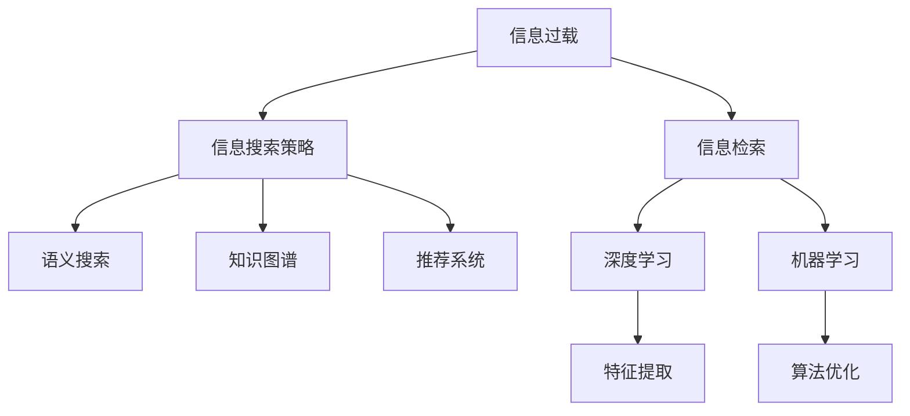

                 

# 信息过载与信息搜索策略与技术：在庞大的信息海洋中找到所需信息

> 关键词：信息过载,信息搜索策略,信息检索技术,知识管理,语义搜索,机器学习,深度学习,大数据,自然语言处理

## 1. 背景介绍

### 1.1 问题由来
在当今数字化时代，信息以指数级速度增长，导致信息过载(Information Overload)成为普遍现象。无论是在工作中还是需要获取最新知识的日常生活中，人们都面临着如何从海量数据中快速、准确地找到所需信息的问题。这一挑战不仅影响着信息检索的效率，还可能引发信息焦虑(Information Anxiety)，进而影响决策和认知功能。

信息过载问题源于以下几个方面：
- **数据量爆炸**：互联网、社交媒体和物联网的发展带来了前所未有的数据生成速度和数据总量。
- **多源数据**：来自不同平台、格式和格式的数据源需要综合利用，增加了信息检索的复杂性。
- **信息维度**：从结构化数据到非结构化数据，如文本、图片、视频等，增加了信息检索的难度。
- **人类认知限制**：人的注意力和认知能力有限，无法处理海量的信息。

因此，构建高效的信息搜索策略与技术，帮助用户在信息海洋中快速找到所需的信息，是现代信息技术的核心挑战之一。

## 2. 核心概念与联系

### 2.1 核心概念概述

为了更好地理解信息搜索策略与技术，本节将介绍几个关键的概念及其相互联系：

- **信息过载**：指个人或系统在短时间内收到的信息超出其处理能力的现象。
- **信息检索**：从大量信息源中检索出与特定查询相关的信息的过程。
- **信息搜索策略**：用于指导信息检索的具体方法和技术手段。
- **语义搜索**：通过理解信息内容（语义）来搜索信息，而不仅仅基于关键词匹配。
- **知识图谱**：用图结构来表示知识，帮助建立实体、属性和关系之间的联系。
- **推荐系统**：根据用户行为和兴趣，推荐可能相关的信息。
- **深度学习**：利用神经网络进行特征提取和模式识别的技术。
- **机器学习**：通过数据驱动的算法优化，提升信息检索的准确性和效率。

这些概念之间存在相互依赖和影响的关系，具体逻辑关系可通过以下Mermaid流程图来展示：



该流程图展示了大规模信息检索过程的基本路径：信息过载引发了信息检索的需求，通过信息搜索策略，结合语义搜索、知识图谱和推荐系统等技术，利用深度学习和机器学习等算法，最终完成信息检索任务。

## 3. 核心算法原理 & 具体操作步骤
### 3.1 算法原理概述

信息搜索策略与技术的基本原理是通过对信息源的深度理解，使用合适的检索方法，从海量数据中快速定位到所需信息。其核心思想是：

1. **理解查询**：首先，将用户查询转化为机器可理解的语义表示，以便于后续处理。
2. **检索与排序**：在理解查询后，使用算法从数据源中检索相关信息，并根据特定排序标准对结果进行排序。
3. **反馈与优化**：根据用户反馈（如点击、评分等）对检索结果和算法进行优化，提升后续检索的准确性和相关性。

### 3.2 算法步骤详解

基于上述原理，信息搜索的详细步骤如下：

1. **预处理阶段**：
   - 将原始数据进行清洗、格式转换和标准化，去除噪声和不相关的信息。
   - 建立索引，提高数据检索的效率。

2. **查询处理阶段**：
   - 使用自然语言处理（NLP）技术对用户查询进行分词、词性标注和命名实体识别等预处理，转换成向量表示。
   - 根据查询向量，建立查询模型，用于后续的检索和排序。

3. **检索阶段**：
   - 利用检索算法（如布尔检索、向量空间模型等）从数据源中筛选出与查询相关的文档或记录。
   - 对检索结果进行排序，提高检索的效率和相关性。

4. **反馈阶段**：
   - 根据用户反馈（如点击率、评分等）对检索结果和算法进行迭代优化。
   - 调整模型参数，改善检索效果。

5. **推荐阶段**：
   - 结合用户的兴趣和行为数据，利用推荐算法（如协同过滤、内容推荐等）为相似用户推荐相关内容。

### 3.3 算法优缺点

信息搜索策略与技术具有以下优点：
- **准确性高**：通过深度学习和自然语言处理技术，能够理解查询的语义，提高检索的准确性。
- **可扩展性强**：技术框架易于扩展，能够处理海量的数据源和信息。
- **个性化推荐**：结合用户行为数据，提供个性化推荐服务，提升用户体验。

同时，也存在以下缺点：
- **复杂度高**：涉及的技术领域广泛，需要综合运用多种算法和技术。
- **数据依赖性强**：需要大量高质量的数据作为支撑，数据质量会直接影响检索效果。
- **计算成本高**：深度学习和机器学习算法通常需要强大的计算资源支持。
- **隐私问题**：在数据收集和分析过程中，需要关注用户隐私和数据安全。

### 3.4 算法应用领域

信息搜索策略与技术广泛应用于各种信息处理和智能决策场景中，例如：

- **图书馆管理**：自动检索和推荐图书，提高图书查找和借阅效率。
- **在线教育**：根据学生学习行为，推荐适合的课程和资源。
- **电商推荐**：分析用户购买历史和浏览行为，推荐相关商品和内容。
- **医疗健康**：结合患者历史数据，推荐合适的治疗方案和健康知识。
- **法律咨询**：自动检索和分析法律文档，辅助律师和法官工作。
- **金融分析**：利用大数据和机器学习技术，辅助投资决策和风险评估。

## 4. 数学模型和公式 & 详细讲解 & 举例说明（备注：数学公式请使用latex格式，latex嵌入文中独立段落使用 $$，段落内使用 $)
### 4.1 数学模型构建

信息检索的数学模型构建主要包括以下几个步骤：

1. **文档表示**：将文档转换为向量表示，以便于计算相似度。常用的向量表示方法包括TF-IDF、word2vec等。
2. **查询表示**：将用户查询转换为向量表示，通常使用NLP技术提取关键词和短语，并转化为向量。
3. **相似度计算**：计算查询向量和文档向量之间的相似度，常用的相似度计算方法包括余弦相似度、Jaccard系数等。
4. **检索排序**：根据相似度排序，选取最相关的文档。

### 4.2 公式推导过程

以余弦相似度为例，假设有查询向量 $q$ 和文档向量 $d$，则它们之间的余弦相似度 $sim(q, d)$ 计算公式为：

$$
sim(q, d) = \frac{q \cdot d}{\|q\| \cdot \|d\|}
$$

其中 $\cdot$ 表示向量的点积，$\|q\|$ 和 $\|d\|$ 分别表示向量的模长。

假设查询向量和文档向量均为$k$维，则点积计算公式为：

$$
q \cdot d = \sum_{i=1}^{k} q_i d_i
$$

其中 $q_i$ 和 $d_i$ 分别表示查询向量和文档向量的第$i$个维度。

在实际应用中，为了提升检索效率，通常使用向量空间模型（Vector Space Model），将文档和查询映射到高维空间中，然后计算它们之间的距离（即相似度）。

### 4.3 案例分析与讲解

假设有一个图书管理系统，需要自动检索书籍信息。图书馆有$N$本图书，每本书的标题、作者和摘要等信息作为特征向量存储。用户查询一个具体的图书名称，系统如何检索到相关信息？

**Step 1: 预处理与索引建立**
- 对图书标题、作者和摘要进行清洗和标准化处理。
- 将每本书的特征向量建立索引，以提高检索效率。

**Step 2: 查询处理**
- 对用户查询进行分词和词性标注，转换成向量表示。
- 建立查询模型，计算查询向量和每个图书特征向量之间的相似度。

**Step 3: 检索与排序**
- 计算每个图书的相似度得分，按照得分从高到低排序，选取最相关的图书。

**Step 4: 反馈与优化**
- 根据用户点击反馈调整模型参数，优化检索效果。
- 利用协同过滤算法为相似用户推荐其他相关图书。

## 5. 项目实践：代码实例和详细解释说明
### 5.1 开发环境搭建

在进行信息搜索项目开发前，需要先搭建好开发环境。以下是使用Python和Elasticsearch进行信息搜索开发的常见环境配置流程：

1. 安装Anaconda：从官网下载并安装Anaconda，用于创建独立的Python环境。

```bash
conda create -n ir-world python=3.8 
conda activate ir-world
```

2. 安装Elasticsearch：下载并安装Elasticsearch，用于构建索引和进行检索。

3. 安装必要的Python包：

```bash
pip install elasticsearch flask gensim sklearn
```

4. 启动Elasticsearch服务：

```bash
./bin/elasticsearch
```

完成上述步骤后，即可在`ir-world`环境中开始信息搜索项目开发。

### 5.2 源代码详细实现

下面以信息检索系统为例，展示使用Python和Elasticsearch进行信息搜索的代码实现。

首先，定义信息检索系统的主要组件：

```python
from elasticsearch import Elasticsearch
from gensim.models import TfidfVectorizer
from sklearn.feature_extraction.text import TfidfVectorizer
from sklearn.metrics.pairwise import cosine_similarity

# 连接Elasticsearch
es = Elasticsearch([{'host': 'localhost', 'port': 9200}])

# 定义查询处理函数
def process_query(query):
    # 分词、词性标注、命名实体识别等预处理
    # 转换为向量表示
    vectorizer = TfidfVectorizer()
    query_vector = vectorizer.fit_transform([query])
    return query_vector

# 定义检索函数
def search_documents(query_vector):
    # 检索文档
    results = []
    for doc_id in es.search(index='books', body={'query': {'match': {'title': query_vector}}})['hits']['hits']:
        doc_vector = vectorizer.transform(doc['_source']['title'])
        similarity = cosine_similarity(doc_vector, query_vector).flat[0]
        results.append((doc['_source']['title'], similarity))
    return sorted(results, key=lambda x: x[1], reverse=True)
```

在上述代码中，`process_query`函数对用户查询进行分词和词性标注，转换为向量表示。`search_documents`函数利用Elasticsearch进行查询，返回与查询最相关的文档。

接下来，定义服务器端接口：

```python
from flask import Flask, request, jsonify

app = Flask(__name__)

@app.route('/search', methods=['POST'])
def search():
    query = request.json['query']
    query_vector = process_query(query)
    results = search_documents(query_vector)
    return jsonify(results)

if __name__ == '__main__':
    app.run(debug=True)
```

最后，启动Flask服务器：

```bash
python app.py
```

完成上述步骤后，即可在本地访问`localhost:5000`，进行图书搜索操作。

### 5.3 代码解读与分析

让我们再详细解读一下关键代码的实现细节：

**Elasticsearch连接**：
- 定义Elasticsearch连接，通过`localhost`和默认端口`9200`连接Elasticsearch服务。

**查询处理函数**：
- 使用`gensim`库的`TfidfVectorizer`进行文本向量化，将查询转换为向量表示。

**检索函数**：
- 使用Elasticsearch进行查询，返回文档的特征向量。
- 使用`cosine_similarity`计算向量之间的余弦相似度，得到每个文档与查询的相似度得分。

**服务器接口**：
- 定义Flask路由，接收POST请求，处理查询并返回检索结果。
- 使用`jsonify`将结果转换为JSON格式，便于前端接收。

**服务器启动**：
- 通过`app.run(debug=True)`启动Flask服务器，并开启调试模式。

可以看到，结合Elasticsearch和Python的Flask框架，可以便捷地实现一个信息检索系统。开发者只需关注具体的检索算法和模型优化，而不必过多关注底层实现细节。

## 6. 实际应用场景
### 6.1 智能客服系统

智能客服系统通过信息搜索技术，能够快速定位用户问题并提供相关解决方案。与传统客服相比，智能客服系统能够处理大量并发请求，且24小时无间断工作。

具体而言，智能客服系统通过维护知识库（如FAQ文档），对用户查询进行自然语言处理，从知识库中检索相关信息，生成回复。同时，根据用户反馈调整知识库内容，持续优化客服系统的效果。

### 6.2 图书馆管理系统

图书馆管理系统通过信息检索技术，帮助读者快速查找所需图书。系统通过索引图书信息，建立全文检索系统，支持基于关键词和语义的搜索。

读者通过输入书名、作者或摘要，系统自动检索相关图书信息，并推荐相似图书。同时，系统可以实时更新索引，保持信息的时效性。

### 6.3 电商推荐系统

电商推荐系统通过信息搜索技术，帮助用户找到相关商品和内容。系统分析用户的历史行为和兴趣，利用推荐算法（如协同过滤、基于内容的推荐）生成个性化推荐列表。

推荐系统可以根据用户点击、评分等反馈，不断优化推荐效果，提升用户体验。同时，系统还可以结合时间、季节等变量，动态调整推荐内容。

## 7. 工具和资源推荐
### 7.1 学习资源推荐

为了帮助开发者掌握信息搜索策略与技术，这里推荐一些优质的学习资源：

1. 《信息检索导论》（Introduction to Information Retrieval）：由Christopher D. Manning等人合著的经典教材，详细介绍了信息检索的基本原理和核心算法。

2. 《Python数据科学手册》（Python Data Science Handbook）：由Jake VanderPlas编写的开源书籍，介绍了如何使用Python进行数据处理、分析和可视化。

3. 《深度学习与NLP》（Deep Learning for NLP）：由Piotr Bojanowski等人编写的在线教程，介绍了深度学习在自然语言处理中的应用。

4. 《自然语言处理入门》（Natural Language Processing with Python）：由Eva Speiser等人编写的在线教程，介绍了使用Python进行自然语言处理的基本技术和工具。

5. 《Python编程：从入门到实践》（Python Crash Course）：由Eric Matthes编写的入门书籍，介绍了Python编程的基本概念和实践技巧。

通过这些资源的学习，相信你一定能够快速掌握信息搜索策略与技术的核心内容，并用于解决实际的信息检索问题。

### 7.2 开发工具推荐

高效的开发离不开优秀的工具支持。以下是几款用于信息搜索开发的常用工具：

1. Elasticsearch：分布式搜索和分析引擎，支持全文本检索、地理空间查询等。
2. Apache Solr：高性能的搜索服务器，支持多种查询语言和插件。
3. Apache Lucene：低级别搜索库，提供了全面的索引和搜索功能。
4. Flask：轻量级Web框架，易于开发API接口。
5. Scrapy：Python爬虫框架，用于快速抓取数据。
6. BeautifulSoup：HTML解析库，用于提取网页信息。

合理利用这些工具，可以显著提升信息搜索项目的开发效率，加快创新迭代的步伐。

### 7.3 相关论文推荐

信息搜索策略与技术的研究源于学界的持续探索。以下是几篇奠基性的相关论文，推荐阅读：

1. "Information Retrieval: Foundations and Practice" by Christopher D. Manning and Prabhakar Raghavan。
2. "A Survey of Information Retrieval Evaluation Measures" by Phuong Ta Anh, Wei Zhu, and Thomas G. Kim。
3. "Learning to Retrieve with Gradient Descent" by Michael N. heartan 和 Sebastian Thrun。
4. "An Introduction to Modern Information Retrieval" by Christopher D. Manning, Prabhakar Raghavan, and Hinrich Schütze。
5. "Deep Learning for Information Retrieval: A Survey" by Abhishek Gupta, Ashutosh Mishra, and Inderjit S. Arora。

这些论文代表了大规模信息检索技术的发展脉络。通过学习这些前沿成果，可以帮助研究者把握学科前进方向，激发更多的创新灵感。

## 8. 总结：未来发展趋势与挑战
### 8.1 总结

本文对信息搜索策略与技术进行了全面系统的介绍。首先阐述了信息过载问题及其影响，明确了信息搜索策略与技术的核心价值。其次，从原理到实践，详细讲解了信息检索的数学模型和关键步骤，给出了信息搜索任务开发的完整代码实例。同时，本文还探讨了信息搜索策略与技术在智能客服、图书馆管理、电商推荐等多个领域的应用前景，展示了信息搜索范式的广泛潜力。此外，本文精选了信息搜索策略与技术的各类学习资源，力求为读者提供全方位的技术指引。

通过本文的系统梳理，可以看到，信息搜索策略与技术正在成为信息处理领域的核心范式，极大地提升了信息检索的效率和准确性。随着信息检索模型的不断进步，相信信息搜索将越来越普及，为各行各业带来全新的解决方案。

### 8.2 未来发展趋势

展望未来，信息搜索策略与技术将呈现以下几个发展趋势：

1. **深度学习的应用加深**：深度学习在信息检索中的应用将更加广泛，通过预训练模型提升检索效果。
2. **语义搜索的普及**：语义搜索将从底层技术逐步推广到应用层面，实现更加智能化的信息检索。
3. **知识图谱的融合**：知识图谱技术将与信息检索深度结合，提升检索结果的相关性和完整性。
4. **多模态检索**：除了文本检索，图片、视频等多模态数据的检索技术也将得到快速发展。
5. **推荐系统的整合**：推荐系统将与信息检索系统紧密结合，提供更加个性化的信息服务。
6. **实时处理能力提升**：实时信息检索系统将成为未来发展的重点，满足用户对实时信息的需求。

以上趋势凸显了信息搜索策略与技术的广阔前景。这些方向的探索发展，必将进一步提升信息检索的效率和效果，为人类信息获取带来新的突破。

### 8.3 面临的挑战

尽管信息搜索策略与技术已经取得了显著进展，但在迈向更加智能化、普适化应用的过程中，它仍面临诸多挑战：

1. **数据质量问题**：信息检索依赖高质量的数据源，数据质量直接影响检索效果。如何获取和维护高质量的数据，是一个长期而复杂的问题。
2. **计算资源限制**：深度学习和大规模数据处理需要强大的计算资源，如何在有限的计算资源下提升检索效果，是未来需要解决的重要课题。
3. **隐私保护**：信息检索涉及大量敏感数据的处理，如何保护用户隐私，避免数据滥用，是一个亟待解决的问题。
4. **模型的可解释性**：信息检索模型往往是“黑盒”系统，难以解释其内部工作机制和决策逻辑。如何提升模型的可解释性，是未来需要关注的方向。
5. **跨领域适应性**：信息检索模型需要适应不同领域的数据特点，如何在多个领域中保持一致性和稳定性，是未来需要解决的问题。

### 8.4 研究展望

面对信息搜索策略与技术所面临的种种挑战，未来的研究需要在以下几个方面寻求新的突破：

1. **提高数据质量和完整性**：通过数据清洗、标注、融合等手段，提升数据质量，确保信息检索的准确性。
2. **优化计算资源利用**：通过模型压缩、并行处理等技术，提升信息检索的计算效率，降低计算成本。
3. **增强模型的可解释性**：引入可解释性模型，提升信息检索模型的透明度，增强用户信任。
4. **提升跨领域适应性**：结合领域知识，优化信息检索模型，提升其在不同领域中的适应性和鲁棒性。
5. **融合多模态信息**：结合文本、图像、视频等多模态数据，提升信息检索的效果和准确性。
6. **集成推荐系统**：将推荐系统与信息检索系统深度结合，提供更加个性化和智能化的信息服务。

这些研究方向将引领信息搜索策略与技术迈向更高的台阶，为构建高效、智能、可靠的信息检索系统铺平道路。

## 9. 附录：常见问题与解答

**Q1：信息搜索技术如何处理无结构数据？**

A: 信息搜索技术可以通过文本预处理和自然语言处理技术，将无结构数据转换为结构化数据。具体方法包括：
- 文本清洗：去除噪声和不相关的内容，提取有用的信息。
- 分词和词性标注：将文本分割成词语，并进行词性标注，以理解句子的含义。
- 命名实体识别：识别出文本中的实体（如人名、地名、机构名等），提取关键信息。
- 实体关系抽取：通过抽取实体之间的语义关系，构建知识图谱。
- 主题建模：使用LDA等主题模型，提取文本的主题信息。

**Q2：信息检索技术如何应对大规模数据？**

A: 信息检索技术在大规模数据下可以通过以下方式应对：
- 分布式存储和检索：使用分布式数据库和分布式检索引擎，处理大规模数据存储和检索。
- 索引和倒排索引：建立索引，加速数据检索速度。
- 分片技术：将数据分片，提高并行检索效率。
- 压缩和稀疏化：对数据进行压缩和稀疏化处理，减少存储空间和计算量。
- 增量更新：实时更新索引，保持数据的时效性。

**Q3：信息搜索技术如何提升用户体验？**

A: 提升用户体验是信息搜索技术的重要目标，可以通过以下方式实现：
- 自然语言理解：通过NLP技术，理解用户的查询意图，提供更加智能化的检索结果。
- 个性化推荐：根据用户的历史行为和兴趣，提供个性化的信息推荐。
- 交互式搜索：通过交互式界面，提升用户的操作体验和满意度。
- 可视化展示：利用可视化技术，展示检索结果，增强用户对结果的理解和接受。

**Q4：信息搜索技术如何保护用户隐私？**

A: 保护用户隐私是信息搜索技术的重要考量，可以通过以下方式实现：
- 数据匿名化：对用户数据进行匿名化处理，保护用户隐私。
- 访问控制：设置严格的访问控制，防止未授权访问。
- 数据加密：对敏感数据进行加密处理，保护数据安全。
- 差分隐私：在数据分析过程中，使用差分隐私技术，保护用户隐私。
- 合规性审查：遵循相关法律法规，进行隐私合规性审查。

通过这些常见问题的解答，相信你对信息搜索策略与技术的理解会更加深入，更好地应对实际应用中的各种挑战。

