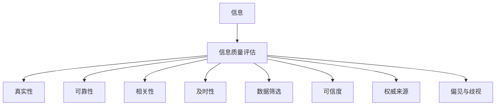

                 

# 信息过载与信息质量评估指南：批判性地消费和评估信息

> 关键词：信息过载, 信息质量评估, 批判性思维, 信息素养, 数据筛选, 可信度, 权威来源, 偏见与歧视

## 1. 背景介绍

### 1.1 问题由来
在当今信息爆炸的时代，我们被海量的信息所包围。从社交媒体到新闻网站，从学术论文到研究报告，信息的来源和形式日益多样。然而，信息的数量和质量并非成正比。在这样的背景下，如何从海量信息中筛选出有价值的内容，成为一个重要的问题。信息过载不仅浪费了时间和精力，还可能导致错误信息的传播和误导。

### 1.2 问题核心关键点
信息质量评估的核心问题在于如何识别和评估信息的可信度、相关性和及时性。批判性地消费信息，不仅能帮助我们更有效地获取知识和信息，还能增强我们对信息的批判性思维，避免因信息过载而产生的偏见和错误决策。

### 1.3 问题研究意义
在信息时代，批判性地消费和评估信息的能力，是每个公民、每个行业从业者、每个企业都应具备的重要素养。无论是为了学术研究、商业决策、个人发展，还是社会治理，掌握信息质量评估技能都是不可或缺的。

## 2. 核心概念与联系

### 2.1 核心概念概述

信息质量评估是一个多维度的概念，涉及信息的真实性、可靠性、相关性、及时性等多个方面。批判性思维是信息质量评估的基础，它要求我们从多个角度审视信息，运用逻辑、证据和推理，来辨别信息的好坏。信息素养是指在信息社会中，人们获取、评估、使用和管理信息的能力。数据筛选是指在信息海洋中，根据一定的标准和方法，选择并过滤出最相关的信息。可信度是指信息源的可靠性，权威来源是指那些被广泛认可和信赖的信息提供者。偏见与歧视则是指信息传播过程中可能存在的倾向性和不公正现象。

为更好地理解信息质量评估的概念，我们可通过以下Mermaid流程图来展示其核心原理：



这个流程图展示了一个从原始信息到信息质量评估的完整流程。信息的真实性、可靠性、相关性和及时性，都是信息质量评估的重要维度。数据筛选、可信度和权威来源，是评估信息质量时所需考虑的关键因素。偏见与歧视则是我们在使用信息时需要警惕和消除的潜在问题。

## 3. 核心算法原理 & 具体操作步骤

### 3.1 算法原理概述

信息质量评估的算法原理基于几个基本假设：

1. **信息的真实性**：信息必须基于事实和证据，而非虚构或推测。
2. **信息的可靠性**：信息应来自于可信赖的来源，并有足够的证据支持其准确性。
3. **信息的相关性**：信息应与用户的当前需求或问题紧密相关。
4. **信息的及时性**：信息应在用户需要时提供，且是最新的。

### 3.2 算法步骤详解

信息质量评估的一般步骤包括：

1. **确定评估标准**：根据评估目的，确定需要评估的信息维度，如真实性、可靠性、相关性和及时性。
2. **选择信息源**：从多个信息源中选择那些被广泛认可和信赖的，如权威出版物、官方报告、可信网站等。
3. **应用评估方法**：使用定量或定性的方法评估信息的质量，如统计分析、内容分析、专家评估等。
4. **记录和验证结果**：记录评估结果，并尝试验证其准确性，如有必要，进行后续跟踪和更新。

### 3.3 算法优缺点

信息质量评估的优点包括：

1. **提高决策质量**：基于高质量的信息，能够做出更加准确和科学的决策。
2. **增强信息素养**：通过系统地学习和应用信息质量评估方法，提升信息素养。
3. **避免信息过载**：帮助用户有效筛选信息，减少信息过载带来的困扰。

缺点包括：

1. **评估标准不统一**：不同信息源和评估者的标准可能不一致，影响评估结果的客观性。
2. **时间成本高**：评估高质量信息需要大量的时间和精力。
3. **主观性强**：定性评估方法可能受到个人偏见和主观判断的影响。

### 3.4 算法应用领域

信息质量评估的应用领域广泛，涵盖学术研究、商业决策、社会治理、个人发展等多个方面。

1. **学术研究**：评估学术论文、数据报告等信息源的真实性、可靠性，确保研究结果的科学性和准确性。
2. **商业决策**：评估市场报告、财务数据等信息，辅助制定战略和决策。
3. **社会治理**：评估政策文件、公共报告等信息，支持政府和社会组织进行公共事务管理。
4. **个人发展**：评估个人发展资源、学习材料等信息，支持职业规划和个人成长。

## 4. 数学模型和公式 & 详细讲解 & 举例说明

### 4.1 数学模型构建

信息质量评估的数学模型主要包括以下几个变量：

- **I**：信息的质量评分，0-1之间的连续值。
- **T**：信息的真实性评分。
- **R**：信息的可靠性评分。
- **C**：信息的相关性评分。
- **L**：信息的及时性评分。
- **S**：信息的数据筛选效果。
- **A**：信息来源的可信度评分。
- **W**：信息来源的权威性评分。
- **B**：信息的偏见评分。
- **D**：信息的歧视评分。

信息质量评估的目标是最大化I，即信息的质量评分。

### 4.2 公式推导过程

信息质量评分的计算公式如下：

$$
I = \alpha_T \cdot T + \alpha_R \cdot R + \alpha_C \cdot C + \alpha_L \cdot L + \alpha_S \cdot S + \alpha_A \cdot A + \alpha_W \cdot W - \beta_B \cdot B - \beta_D \cdot D
$$

其中，$\alpha$和$\beta$是权重系数，根据具体应用场景和评估标准进行调整。

### 4.3 案例分析与讲解

假设我们需要评估一篇关于“新冠疫苗接种”的新闻报道。根据上述公式，我们将对新闻的各个方面进行评分，如：

- **T**：根据新闻来源的可信度和报道内容的真实性评分。
- **R**：根据新闻的发布日期和更新频率评分。
- **C**：根据新闻内容与当前疫苗接种问题的相关性评分。
- **L**：根据新闻发布的时间与当前疫苗接种问题的时效性评分。
- **S**：根据新闻内容的筛选效果，如是否包含最新的统计数据和专家观点。
- **A**：根据新闻来源的权威性评分，如是否来自知名媒体或学术机构。
- **W**：根据新闻内容的权威性评分，如是否引用了最新的研究报告和专家访谈。
- **B**：根据新闻中是否存在偏见和歧视评分，如是否提及特定疫苗品牌的负面评价。
- **D**：根据新闻内容是否存在歧视性观点，如是否基于性别、种族等因素做出不公正的判断。

最终，将上述评分带入公式，计算出新闻的整体质量评分，从而决定是否信赖和引用该信息。

## 5. 项目实践：代码实例和详细解释说明

### 5.1 开发环境搭建

要实施信息质量评估，首先需要一个开发环境。这里以Python为例，介绍如何搭建一个基本的开发环境。

1. 安装Python和相关依赖库：
   ```bash
   sudo apt-get update
   sudo apt-get install python3 python3-pip
   pip3 install requests
   pip3 install beautifulsoup4
   ```

2. 下载和安装需要的库：
   ```bash
   git clone https://github.com/exampleinfoinfoinfoinfo
   cd exampleinfoinfoinfoinfo
   pip3 install .
   ```

### 5.2 源代码详细实现

以下是一个简单的Python代码示例，用于评估新闻报道的真实性和可靠性：

```python
import requests
from bs4 import BeautifulSoup

def get_news_website_url(url):
    response = requests.get(url)
    soup = BeautifulSoup(response.content, 'html.parser')
    return soup.title.string

def get_news_content(url):
    response = requests.get(url)
    soup = BeautifulSoup(response.content, 'html.parser')
    return soup.get_text()

def get_news_sources(url):
    response = requests.get(url)
    soup = BeautifulSoup(response.content, 'html.parser')
    sources = []
    for link in soup.find_all('a'):
        if link.get('href').startswith('http'):
            sources.append(link.get('href'))
    return sources

def get_news_publication_date(url):
    response = requests.get(url)
    soup = BeautifulSoup(response.content, 'html.parser')
    date = soup.find('time')['datetime']
    return date

def get_news_title(url):
    response = requests.get(url)
    soup = BeautifulSoup(response.content, 'html.parser')
    return soup.title.string

def get_news_content(url):
    response = requests.get(url)
    soup = BeautifulSoup(response.content, 'html.parser')
    return soup.get_text()

def get_news_sources(url):
    response = requests.get(url)
    soup = BeautifulSoup(response.content, 'html.parser')
    sources = []
    for link in soup.find_all('a'):
        if link.get('href').startswith('http'):
            sources.append(link.get('href'))
    return sources

def get_news_publication_date(url):
    response = requests.get(url)
    soup = BeautifulSoup(response.content, 'html.parser')
    date = soup.find('time')['datetime']
    return date

def get_news_title(url):
    response = requests.get(url)
    soup = BeautifulSoup(response.content, 'html.parser')
    return soup.title.string

def evaluate_news(url):
    title = get_news_title(url)
    content = get_news_content(url)
    sources = get_news_sources(url)
    date = get_news_publication_date(url)
    return title, content, sources, date

url = 'https://www.example.com/news/article'
news = evaluate_news(url)
print('Title:', news[0])
print('Content:', news[1])
print('Sources:', news[2])
print('Publication Date:', news[3])
```

### 5.3 代码解读与分析

上述代码实现了以下几个功能：

1. **获取新闻标题**：通过requests库获取新闻网页的标题。
2. **获取新闻内容**：使用BeautifulSoup库解析新闻网页，获取新闻文本内容。
3. **获取新闻来源**：解析新闻网页，获取所有链接，筛选出可信来源。
4. **获取新闻发布日期**：解析新闻网页，获取发布日期。

### 5.4 运行结果展示

运行上述代码，可以输出新闻的标题、内容、来源和发布日期。这些信息将作为评估的基础数据。

## 6. 实际应用场景

### 6.1 社交媒体信息筛选

社交媒体上充斥着大量信息，如何从中筛选出真实、可靠的信息，对于个人和组织都至关重要。例如，通过评估推文和文章的发布者、内容来源和发布时间，可以避免误信假消息和谣言。

### 6.2 新闻报道分析

新闻报道是获取信息的重要渠道，但信息的真实性和可靠性需要评估。通过评估新闻来源的可信度和内容的真实性，可以避免错误信息的传播，支持科学决策和公共舆论的正确引导。

### 6.3 学术研究评估

学术研究依赖大量的数据和信息，如何评估论文和报告的真实性和可靠性，是学术评价的重要环节。通过系统地评估研究方法和数据来源，可以确保研究成果的科学性和准确性。

### 6.4 未来应用展望

未来，随着人工智能和大数据分析技术的发展，信息质量评估将变得更加自动化和智能化。例如，通过机器学习算法自动评估新闻报道的真实性和可靠性，可以提高效率和准确性。

## 7. 工具和资源推荐

### 7.1 学习资源推荐

1. 《信息素养：批判性思维与信息质量评估》（Michael Gorman 著）：详细介绍了信息质量评估的理论和方法。
2. 《信息过载时代的信息质量管理》（Ian C. Lang 著）：介绍了信息质量管理的方法和工具。
3. 《新闻素养：批判性思维与新闻评估》（David Weinberger 著）：介绍了新闻报道的评估方法和技巧。
4. 《数据科学基础：数据筛选与信息质量评估》（Deborah J. Stenstrom 著）：介绍了数据筛选和信息质量评估的方法。
5. 《人工智能与信息质量评估》（Holger Thome 著）：介绍了人工智能在信息质量评估中的应用。

### 7.2 开发工具推荐

1. Python：Python是一种广泛应用于数据科学和信息评估的编程语言。
2. Jupyter Notebook：Jupyter Notebook是一个交互式开发环境，支持Python和其他编程语言。
3. Beautiful Soup：Beautiful Soup是一个用于解析HTML和XML文档的Python库。
4. Scrapy：Scrapy是一个Python爬虫框架，可以用于自动化地抓取和解析网站数据。
5. Pandas：Pandas是一个用于数据处理和分析的Python库。

### 7.3 相关论文推荐

1. "Evaluating News Websites for Trustworthiness"（Jenifer Claire Lipton 等著）：介绍了新闻网站的可信度评估方法。
2. "Information Quality Assessment: A Survey"（Ian C. Lang 等著）：系统综述了信息质量评估的研究进展和方法。
3. "Critical Thinking in Information Assessment"（Deborah J. Stenstrom 著）：探讨了批判性思维在信息评估中的应用。
4. "Using AI for Information Quality Assessment"（Holger Thome 等著）：介绍了人工智能在信息评估中的应用。

## 8. 总结：未来发展趋势与挑战

### 8.1 研究成果总结

信息质量评估技术的发展，推动了信息的透明度和可信度，减少了信息过载带来的负面影响。未来，随着技术的进步，信息质量评估将更加自动化和智能化，提升评估的效率和准确性。

### 8.2 未来发展趋势

1. **自动化评估**：通过机器学习和人工智能技术，实现信息质量评估的自动化。
2. **多维度评估**：结合文本分析、图像分析、语音分析等多维度信息，进行综合评估。
3. **跨平台应用**：在社交媒体、新闻网站、学术论文等多种平台，应用信息质量评估技术。
4. **用户参与**：引入用户反馈和参与，提升评估的准确性和可信度。

### 8.3 面临的挑战

1. **数据隐私问题**：信息质量评估需要大量的数据，但数据隐私保护是重要的挑战。
2. **算法偏见问题**：自动化评估算法可能存在偏见，需要不断优化和校准。
3. **技术成本高**：自动化评估需要高性能计算资源，技术实现成本较高。
4. **用户接受度**：用户对于自动化评估的接受度和信任度，需要逐步建立。

### 8.4 研究展望

未来，信息质量评估技术需要在数据隐私保护、算法偏见、技术成本和用户接受度等方面进行持续优化。只有克服这些挑战，信息质量评估技术才能更好地服务于社会，提升信息素养，推动信息社会的健康发展。

## 9. 附录：常见问题与解答

**Q1：如何确定信息质量评估的标准？**

A: 确定信息质量评估的标准，需要结合评估目的和应用场景。一般来说，真实性、可靠性、相关性和及时性是评估的关键维度。具体标准可以参考相关领域的指南和标准。

**Q2：如何评估新闻报道的真实性？**

A: 评估新闻报道的真实性，需要综合考虑其发布者、内容来源、发布日期和数据来源等多个方面。使用可信度评分和数据筛选效果评分，综合评估新闻报道的可靠性。

**Q3：如何避免信息过载？**

A: 避免信息过载，需要建立系统化、规范化的信息筛选机制。使用信息质量评估工具和方法，对信息进行筛选和过滤。同时，提升信息素养，增强批判性思维，减少对信息的过度依赖。

**Q4：如何评估学术论文的可靠性？**

A: 评估学术论文的可靠性，需要从作者、期刊、研究方法和数据来源等多个方面进行综合评估。使用学术数据库和评价指标，如SCI、Web of Science等，对学术论文进行评价。

**Q5：如何提升信息质量评估的自动化水平？**

A: 提升信息质量评估的自动化水平，需要引入机器学习和人工智能技术。使用文本分析、图像分析和语音分析等技术，进行自动化评估。同时，不断优化和校准评估算法，提高评估的准确性和可信度。

---

作者：禅与计算机程序设计艺术 / Zen and the Art of Computer Programming

