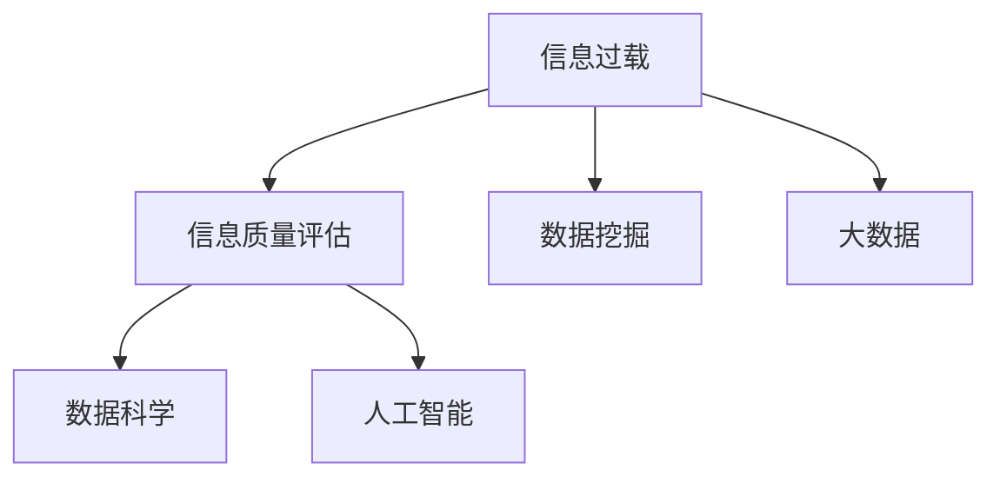

                 

# 信息过载与信息质量评估策略：批判性地评估和消费信息

> 关键词：信息过载,信息质量评估,信息质量度量,数据挖掘,大数据,数据科学,人工智能

## 1. 背景介绍

### 1.1 问题由来
在数字时代，信息的爆炸性增长带来了前所未有的挑战。我们每天被海量信息所包围，从社交媒体的更新到新闻网站的报道，从电子邮件的提醒到各种应用程序的通知，无处不在的信息流让人们应接不暇。然而，并非所有的信息都是高质量或有价值的。信息过载（Information Overload）已经成为我们面临的一个重大问题。

### 1.2 问题核心关键点
信息过载不仅浪费了大量的时间，还可能导致决策失误、认知负担增加和心理压力增大。如何在这海量信息中辨别出有价值和可靠的信息，成为信息时代的关键问题。解决这一问题的关键在于建立一种能够评估和筛选信息质量的策略和方法，帮助用户批判性地消费信息。

### 1.3 问题研究意义
对信息质量进行评估和筛选，不仅有助于提高信息消费的效率和质量，还能降低信息过载带来的负面影响，提升个人和组织的信息处理能力。在数据驱动的决策过程中，高品质的信息是确保决策准确性的基础。同时，高质量的信息还能够提升品牌形象，增强用户信任，对于商业和学术研究都有重要意义。

## 2. 核心概念与联系

### 2.1 核心概念概述

为更好地理解信息质量评估的策略，本节将介绍几个关键概念及其相互关系：

- 信息过载（Information Overload）：指个体或组织面对的信息量远超其处理能力，导致信息消费效率低下、决策错误等一系列问题。
- 信息质量评估（Information Quality Assessment）：通过一系列指标和方法，对信息的准确性、完整性、相关性、时效性、一致性等方面进行评估，帮助用户判断信息的价值。
- 数据挖掘（Data Mining）：从大量数据中挖掘出有价值的信息和知识，是信息质量评估的重要工具。
- 大数据（Big Data）：指规模巨大、结构复杂、速度快速的数据集合，是信息质量评估的对象。
- 数据科学（Data Science）：综合运用统计学、机器学习、数据挖掘等方法，从数据中提取知识、发现规律，提升信息质量评估的科学性和准确性。
- 人工智能（AI）：通过机器学习、深度学习等技术，实现对信息的自动化处理和智能筛选。

这些核心概念之间的关系可以通过以下Mermaid流程图来展示：



这个流程图展示了信息过载与信息质量评估之间的关系，以及两者如何通过数据挖掘、大数据、数据科学和人工智能等工具和方法进行有效的评估和筛选。

## 3. 核心算法原理 & 具体操作步骤
### 3.1 算法原理概述

信息质量评估的核心目标是识别和区分出高质量和可靠的信息。这一过程通常包括信息源的评估、信息内容的分析以及信息价值的判断。通过设定一系列评估指标和标准，结合先进的计算技术，可以自动地对信息进行评估和筛选。

### 3.2 算法步骤详解

信息质量评估的基本步骤可以分为以下几个方面：

**Step 1: 确定评估指标和标准**
- 信息源评估：评估信息源的可信度、权威性和可靠性。常见的评估指标包括信息源的历史表现、专家评价、第三方认证等。
- 内容分析：对信息内容进行结构化分析和特征提取，包括文本分析、语义分析、情感分析等。
- 价值判断：综合考虑信息的时效性、相关性和一致性等指标，判断信息对用户或组织的实际价值。

**Step 2: 数据采集与预处理**
- 信息源采集：从新闻网站、社交媒体、政府报告等多种渠道收集信息。
- 数据清洗：去除噪音数据、填补缺失值、标准化格式等，确保数据的质量和一致性。

**Step 3: 特征提取与建模**
- 特征提取：提取文本长度、关键词频率、信息源权威度等特征。
- 模型训练：使用机器学习算法对提取的特征进行建模，建立预测模型。

**Step 4: 评估与筛选**
- 模型评估：使用测试数据集对模型进行评估，计算准确率、召回率、F1分数等指标。
- 信息筛选：基于评估结果，对信息进行筛选和排序，推荐高质量信息。

### 3.3 算法优缺点

信息质量评估具有以下优点：
1. 自动化：通过算法实现自动化评估，提高效率。
2. 客观性：基于数据和模型进行评估，减少主观偏见。
3. 可扩展性：可以处理大规模的数据集，适用于各种信息源。

同时，该方法也存在一些局限性：
1. 依赖数据质量：评估结果的质量取决于所采集数据的质量和完整性。
2. 模型偏差：模型可能存在预测偏差，导致误判。
3. 动态更新困难：信息质量和标准可能会随时间变化，模型需要定期更新。

尽管有这些局限性，但信息质量评估在大数据时代仍然是一个不可或缺的工具，通过持续优化和改进，其准确性和实用性将不断提高。

### 3.4 算法应用领域

信息质量评估的应用领域非常广泛，包括但不限于以下几个方面：

- 新闻业：筛选和推荐高质量的新闻报道，提升新闻业的信息质量。
- 社交媒体：识别和过滤有害内容，提升社交媒体平台的健康度。
- 企业决策：帮助企业从大量数据中提取有价值的信息，支持决策制定。
- 医疗健康：评估和筛选医学文献，提升医疗信息的质量和可靠性。
- 金融市场：筛选和分析金融新闻，支持投资决策和风险控制。

## 4. 数学模型和公式 & 详细讲解 & 举例说明
### 4.1 数学模型构建

信息质量评估的数学模型通常包括两个部分：特征提取模型和评估模型。

**特征提取模型**：
假设信息源为 $X=\{x_1, x_2, ..., x_n\}$，信息源的特征向量为 $F=\{f_1, f_2, ..., f_m\}$，其中 $f_i$ 表示信息源的第 $i$ 个特征。信息源的特征提取模型为 $M_X$，将 $X$ 映射到 $F$。

**评估模型**：
假设信息内容的特征向量为 $G=\{g_1, g_2, ..., g_k\}$，其中 $g_j$ 表示信息内容的第 $j$ 个特征。信息内容的评估模型为 $M_G$，将 $G$ 映射到评估分数 $S$。

数学模型构建的一般框架如下：

$$
S = M_G(G) = M_G(M_X(X))
$$

### 4.2 公式推导过程

信息质量评估的具体公式推导涉及多个方面，这里以新闻业为例，推导信息质量的综合评估公式。

假设新闻的评估指标包括可信度 $C$、相关性 $R$、时效性 $T$、一致性 $U$，信息质量评分 $Q$ 可以表示为：

$$
Q = \alpha_C \cdot C + \alpha_R \cdot R + \alpha_T \cdot T + \alpha_U \cdot U
$$

其中 $\alpha_C, \alpha_R, \alpha_T, \alpha_U$ 为各指标的权重系数，可以根据实际情况进行调整。

### 4.3 案例分析与讲解

以某新闻网站为例，分析信息质量评估的实际应用。

- **信息源评估**：通过网络爬虫从网站收集新闻数据，使用机器学习模型对新闻源的历史表现、权威度和可信度进行评估。
- **内容分析**：对每篇新闻的标题、摘要和正文进行自然语言处理，提取关键词、情感极性和信息源可信度等特征。
- **价值判断**：综合考虑新闻的时效性、相关性和一致性，对新闻进行综合评分，筛选出高质量新闻进行推荐。

## 5. 项目实践：代码实例和详细解释说明
### 5.1 开发环境搭建

在进行信息质量评估项目实践前，我们需要准备好开发环境。以下是使用Python进行Scikit-learn和NLP库开发的Python环境配置流程：

1. 安装Anaconda：从官网下载并安装Anaconda，用于创建独立的Python环境。

2. 创建并激活虚拟环境：
```bash
conda create -n infoquality-env python=3.8 
conda activate infoquality-env
```

3. 安装Scikit-learn：
```bash
pip install scikit-learn
```

4. 安装NLP库：
```bash
pip install nltk spacy gensim
```

5. 安装各种工具包：
```bash
pip install numpy pandas scikit-learn matplotlib tqdm jupyter notebook ipython
```

完成上述步骤后，即可在`infoquality-env`环境中开始信息质量评估实践。

### 5.2 源代码详细实现

以下是一个基于Scikit-learn的示例代码，用于评估新闻网站的信息质量。

```python
import pandas as pd
from sklearn.feature_extraction.text import TfidfVectorizer
from sklearn.linear_model import LogisticRegression
from sklearn.metrics import accuracy_score, precision_score, recall_score, f1_score

# 加载数据集
df = pd.read_csv('news_data.csv')

# 特征提取
vectorizer = TfidfVectorizer(stop_words='english')
X = vectorizer.fit_transform(df['text'])
y = df['label']

# 模型训练
clf = LogisticRegression(C=1.0)
clf.fit(X, y)

# 评估模型
X_test = vectorizer.transform(df_test['text'])
y_pred = clf.predict(X_test)
print('Accuracy:', accuracy_score(y_test, y_pred))
print('Precision:', precision_score(y_test, y_pred, average='weighted'))
print('Recall:', recall_score(y_test, y_pred, average='weighted'))
print('F1-score:', f1_score(y_test, y_pred, average='weighted'))
```

### 5.3 代码解读与分析

让我们再详细解读一下关键代码的实现细节：

**新闻数据集**：
- 加载新闻数据集，包含新闻的标题、摘要和标签。

**特征提取**：
- 使用TF-IDF向量器提取文本特征，去除停用词。

**模型训练**：
- 使用逻辑回归模型对新闻进行分类，设定正则化系数 $C=1.0$。

**模型评估**：
- 对测试集进行预测，计算模型的准确率、精确度、召回率和F1分数。

## 6. 实际应用场景
### 6.1 智能新闻推荐

智能新闻推荐系统可以基于信息质量评估模型，推荐用户感兴趣的新闻。通过评估新闻的综合评分，系统可以自动筛选高质量的新闻，推荐给用户。

在技术实现上，可以将用户的历史浏览记录和新闻的评估分数进行匹配，找到最相关的推荐新闻。同时，系统还可以动态调整推荐算法，根据用户反馈不断优化推荐结果。

### 6.2 企业情报分析

在企业情报分析中，信息质量评估可以帮助企业从海量数据中筛选出有价值的信息，支持战略制定和决策分析。

具体而言，企业可以收集和评估公司新闻、行业报告、市场分析等各类信息，使用信息质量评估模型筛选出最具价值的信息。同时，模型还可以预测信息的未来趋势，辅助企业进行前瞻性决策。

### 6.3 社交媒体内容管理

社交媒体平台常常面临信息过载和有害内容传播的问题。通过信息质量评估，平台可以有效识别和过滤有害内容，提升社交媒体的健康度。

在技术实现上，可以建立社交媒体内容的评估模型，自动筛选和标记有害信息，如虚假新闻、网络暴力等。同时，平台还可以根据用户反馈不断优化模型，提升识别效果。

## 7. 工具和资源推荐
### 7.1 学习资源推荐

为了帮助开发者系统掌握信息质量评估的理论基础和实践技巧，这里推荐一些优质的学习资源：

1. 《信息质量评估：理论与实践》系列博文：由信息质量评估专家撰写，深入浅出地介绍了信息质量评估的理论基础和实践方法。

2. CS228《机器学习基础》课程：斯坦福大学开设的机器学习明星课程，有Lecture视频和配套作业，带你入门机器学习的基本概念和算法。

3. 《数据挖掘与统计学习》书籍：涵盖了数据挖掘的多个方面，包括数据预处理、特征提取、分类与聚类等，是数据科学学习的经典教材。

4. Coursera《信息质量评估与数据清洗》课程：由数据科学专家开设的在线课程，系统讲解了信息质量评估的关键技术和方法。

5. Kaggle数据竞赛：参加Kaggle等数据竞赛，通过实战提升信息质量评估的技能和经验。

通过对这些资源的学习实践，相信你一定能够快速掌握信息质量评估的精髓，并用于解决实际的业务问题。

### 7.2 开发工具推荐

高效的信息质量评估开发离不开优秀的工具支持。以下是几款用于信息质量评估开发的常用工具：

1. Scikit-learn：基于Python的开源机器学习库，提供了丰富的分类、回归和聚类算法，支持特征提取和模型评估。

2. NLTK和SpaCy：自然语言处理库，用于文本处理和特征提取，支持多种语言。

3. TensorFlow和PyTorch：深度学习框架，用于构建复杂的信息质量评估模型，支持分布式训练和推理。

4. Weights & Biases：模型训练的实验跟踪工具，可以记录和可视化模型训练过程中的各项指标，方便对比和调优。

5. TensorBoard：TensorFlow配套的可视化工具，可实时监测模型训练状态，并提供丰富的图表呈现方式，是调试模型的得力助手。

6. Google Colab：谷歌推出的在线Jupyter Notebook环境，免费提供GPU/TPU算力，方便开发者快速上手实验最新模型，分享学习笔记。

合理利用这些工具，可以显著提升信息质量评估任务的开发效率，加快创新迭代的步伐。

### 7.3 相关论文推荐

信息质量评估的发展源于学界的持续研究。以下是几篇奠基性的相关论文，推荐阅读：

1. Measuring Quality in Information: An Empirical and Theoretical Foundation：概述了信息质量评估的理论框架和方法，为后续研究奠定了基础。

2. Information Quality Metrics: Characteristics, Assessment and Measures：详细介绍了信息质量评估的多个指标和方法，提供了实际应用的参考。

3. Data Mining for Information Quality：讨论了信息质量评估在数据挖掘中的应用，包括数据清洗、特征提取和模型训练等方面。

4. Mining Information Quality from Web Content：介绍了一种基于文本挖掘的方法，从Web内容中提取和评估信息质量。

5. Assessing Web Information Quality：基于用户反馈和评分数据，提出了一种综合评估Web信息质量的方法。

这些论文代表了大数据时代信息质量评估的研究脉络。通过学习这些前沿成果，可以帮助研究者把握学科前进方向，激发更多的创新灵感。

## 8. 总结：未来发展趋势与挑战
### 8.1 总结

本文对信息质量评估的方法进行了全面系统的介绍。首先阐述了信息过载的问题和信息质量评估的重要性，明确了评估在信息消费中的关键作用。其次，从原理到实践，详细讲解了信息质量评估的数学模型和具体操作步骤，给出了信息质量评估任务开发的完整代码实例。同时，本文还广泛探讨了信息质量评估在新闻推荐、企业情报分析、社交媒体内容管理等多个行业领域的应用前景，展示了信息质量评估的广泛应用。此外，本文精选了信息质量评估的相关学习资源，力求为读者提供全方位的技术指引。

通过本文的系统梳理，可以看到，信息质量评估在大数据时代具有重要的应用价值，极大地提高了信息消费的效率和质量，减少了信息过载带来的负面影响。未来，伴随技术的发展和应用的深入，信息质量评估必将在更多领域发挥更大的作用。

### 8.2 未来发展趋势

展望未来，信息质量评估技术将呈现以下几个发展趋势：

1. 自动化程度提升：随着机器学习和深度学习技术的发展，信息质量评估将逐步实现自动化，减少人工干预，提升评估效率。

2. 多模态融合：未来的信息质量评估不仅限于文本数据，还将扩展到图像、视频、语音等多模态数据。多模态融合将带来更加全面的信息质量评估能力。

3. 实时性增强：信息质量评估将更加注重实时性，及时识别和筛选出高质量的信息，支持实时决策。

4. 跨领域应用扩展：信息质量评估将逐渐应用于更多领域，如金融、医疗、物流等，提升各行业的决策质量和效率。

5. 智能化决策支持：通过引入人工智能技术，信息质量评估将提供更加智能化的决策支持，提升信息消费的体验和效果。

6. 数据驱动的持续优化：信息质量评估将持续收集用户反馈和应用效果，利用大数据分析优化评估模型，提高准确性和鲁棒性。

以上趋势凸显了信息质量评估技术的广阔前景。这些方向的探索发展，将进一步提升信息消费的质量和效率，为各行各业提供更加智能、可靠的信息服务。

### 8.3 面临的挑战

尽管信息质量评估技术已经取得了显著进展，但在迈向更加智能化、普适化应用的过程中，仍然面临一些挑战：

1. 数据隐私和安全：在数据收集和处理过程中，如何保护用户隐私，防止数据泄露和滥用，是一个重要的挑战。

2. 模型公平性：评估模型的公平性问题，避免对某些信息源或内容的偏见，确保评估结果的公正性。

3. 多语言支持：目前信息质量评估主要针对英文数据，如何扩展到多语言，提升不同语言信息质量的评估能力，是未来的一个重要方向。

4. 跨领域应用难度：不同领域的评估指标和标准可能存在差异，如何设计通用的评估框架，适应多种领域的应用需求，是一个需要解决的问题。

5. 资源消耗问题：大规模的信息质量评估任务需要大量的计算资源，如何在保证评估质量的同时，优化资源消耗，是一个需要考虑的问题。

6. 评估模型的可解释性：信息质量评估模型的内部工作机制和决策逻辑通常比较复杂，如何提高模型的可解释性，帮助用户理解和信任评估结果，是一个重要的研究方向。

这些挑战需要学界和产业界的共同努力，不断突破技术瓶颈，提升信息质量评估的科学性和实用性。

### 8.4 研究展望

面对信息质量评估所面临的种种挑战，未来的研究需要在以下几个方面寻求新的突破：

1. 探索半监督和无监督评估方法。利用少样本学习和无监督学习，提高信息质量评估的泛化能力和鲁棒性。

2. 研究多模态融合和跨领域评估模型。通过引入图像、视频等非文本数据，提升信息质量评估的综合能力。

3. 融合因果推理和可解释性技术。引入因果推理和可解释性技术，提高评估模型的透明度和可信度。

4. 引入数据隐私保护机制。利用差分隐私、联邦学习等技术，保护用户隐私，确保数据安全。

5. 开发多语言信息质量评估模型。通过跨语言迁移学习和多语言数据预训练，提升多语言信息质量的评估能力。

6. 引入跨领域信息质量标准。建立跨领域的信息质量评估标准，促进不同领域的信息质量评估和对比。

这些研究方向的探索，必将引领信息质量评估技术迈向更高的台阶，为构建智能、可靠的信息服务体系铺平道路。面向未来，信息质量评估技术还需要与其他人工智能技术进行更深入的融合，如知识表示、因果推理、强化学习等，多路径协同发力，共同推动信息质量评估和智能信息消费的发展。只有勇于创新、敢于突破，才能不断拓展信息质量评估的边界，让智能技术更好地服务于人类社会。

## 9. 附录：常见问题与解答

**Q1：如何评估一篇新闻文章的质量？**

A: 评估一篇新闻文章的质量通常需要考虑以下几个方面：

1. 信息源可信度：评估信息源的权威性和可信度，如新闻机构、记者信誉等。

2. 内容相关性：评估新闻内容与读者兴趣和需求的匹配度。

3. 时效性：评估新闻的时效性，是否为最新的信息。

4. 一致性：评估新闻内容的一致性，是否与事实相符。

5. 价值判断：根据用户反馈和专家评价，综合判断新闻的价值。

**Q2：信息质量评估模型的训练和优化有哪些常见方法？**

A: 信息质量评估模型的训练和优化方法包括以下几个方面：

1. 特征工程：设计有效的特征提取方法，提升模型性能。

2. 模型选择：选择适当的模型，如逻辑回归、支持向量机、随机森林等。

3. 参数调优：通过网格搜索、贝叶斯优化等方法，优化模型参数。

4. 交叉验证：使用交叉验证方法，评估模型在不同数据集上的性能。

5. 集成学习：通过模型集成，提升评估结果的鲁棒性和准确性。

6. 在线学习：动态更新模型，适应数据分布的变化。

**Q3：在信息质量评估中，如何选择适当的评估指标？**

A: 选择合适的评估指标需要考虑以下几个因素：

1. 任务特点：根据具体的评估任务，选择最相关的指标。

2. 数据特点：根据数据类型和分布，选择适合的评估指标。

3. 用户需求：根据用户需求和反馈，选择符合用户预期的评估指标。

4. 业务目标：根据业务目标，选择能够支持业务决策的评估指标。

5. 评估成本：考虑评估成本，选择最优的评估指标。

**Q4：在实际应用中，信息质量评估模型面临的主要问题有哪些？**

A: 信息质量评估模型在实际应用中面临的主要问题包括：

1. 数据隐私：如何保护用户隐私，防止数据泄露和滥用。

2. 模型偏见：评估模型可能存在预测偏差，导致误判。

3. 模型泛化：模型在不同数据集上的泛化能力不足，可能导致评估结果不稳定。

4. 资源消耗：大规模的信息质量评估任务需要大量的计算资源，如何优化资源消耗是一个挑战。

5. 模型可解释性：信息质量评估模型的内部工作机制和决策逻辑通常比较复杂，如何提高模型的可解释性，是一个重要的研究方向。

6. 多语言支持：如何扩展到多语言，提升不同语言信息质量的评估能力。

这些问题的解决需要结合技术创新和实际应用场景，不断优化模型和算法，提升信息质量评估的科学性和实用性。

---

作者：禅与计算机程序设计艺术 / Zen and the Art of Computer Programming

