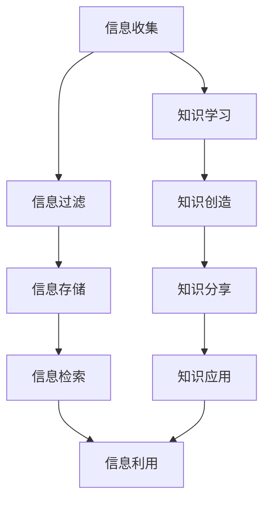

                 

# 信息过载与知识管理系统实施指南：管理和组织信息

## 1. 背景介绍

在信息技术的迅猛发展下，我们面临的信息量呈指数级增长，无论是个人还是组织，都面临着严重的“信息过载”（Information Overload）问题。信息过载不仅影响了人们的工作效率和生活质量，还可能引起决策失误和认知负担过重。因此，如何管理和组织信息，构建高效的知识管理系统，成为了信息时代的重要课题。

### 1.1 问题由来

随着互联网和数字化技术的普及，大量的信息源不断涌现，从传统的书籍、报纸、期刊到社交媒体、在线视频、电子文档等，信息的多样性和数量都在飞速增长。在这样的背景下，个人和组织必须采取有效措施，对信息进行筛选、整合、存储和利用，以避免信息过载对工作和生活带来的负面影响。

### 1.2 问题核心关键点

信息过载问题的核心在于如何高效管理和组织信息，使其能够被快速检索、应用和分享。有效的知识管理系统的构建，能够帮助个人和组织提高信息利用率，减轻信息负担，提升决策和创造能力。具体而言，关键点包括：

- **信息收集与过滤**：自动化的信息收集和智能的过滤机制，减少无用的信息干扰。
- **信息存储与组织**：使用合适的数据结构和技术手段，对信息进行逻辑化和结构化存储。
- **信息检索与利用**：高效的检索技术和知识图谱，促进信息的高效利用。
- **知识共享与协同**：建立知识共享平台，促进团队协作和知识传播。

## 2. 核心概念与联系

### 2.1 核心概念概述

在信息管理和知识组织的过程中，涉及多个核心概念：

- **信息管理（Information Management）**：对信息的收集、整理、存储、检索和利用等各个环节进行系统的规划和执行，以提高信息效率和价值。
- **知识管理（Knowledge Management）**：专注于知识的学习、创造、分享和应用，目的是通过知识转化提升组织和个人的能力。
- **信息过载（Information Overload）**：在信息技术高度发达的时代，信息量爆炸式增长，个人和组织面临难以处理的庞大数据量。
- **知识图谱（Knowledge Graph）**：以图形化方式描述实体及其关系，用于知识表示和推理，帮助快速获取所需知识。
- **信息检索（Information Retrieval）**：通过特定的算法和模型，将查询请求与数据库中的信息进行匹配，获取相关结果。
- **元数据（Metadata）**：对数据的基本信息进行描述，如数据来源、格式、大小等，方便数据的组织和检索。

这些概念之间相互关联，共同构成了信息管理和知识组织的基础框架。

### 2.2 核心概念原理和架构的 Mermaid 流程图



这个流程图展示了信息管理和知识组织的基本流程，从信息的收集开始，经过过滤、存储、检索和利用，最终实现知识的创造、共享和应用。

## 3. 核心算法原理 & 具体操作步骤

### 3.1 算法原理概述

知识管理系统的核心算法主要围绕信息收集、过滤、存储、检索和利用等方面展开，其核心思想是通过算法和技术手段，提升信息的价值和利用效率。

### 3.2 算法步骤详解

1. **信息收集**：使用Web爬虫、API接口、数据库导入等方式，自动收集信息。
   
2. **信息过滤**：使用机器学习算法（如TF-IDF、LDA等）对信息进行自动分类和筛选，去除垃圾信息和噪音。
   
3. **信息存储**：采用合适的数据库或数据仓库技术（如SQL数据库、NoSQL数据库、数据湖等），对信息进行结构化和逻辑化存储。
   
4. **信息检索**：使用信息检索算法（如布尔检索、向量空间模型、语义检索等），快速从存储库中检索出相关信息。
   
5. **信息利用**：通过数据挖掘、自然语言处理（NLP）等技术，将信息转化为知识，实现知识的应用和共享。

### 3.3 算法优缺点

**优点**：

- **自动化**：通过算法实现信息的自动收集、过滤、存储和检索，减少了人工干预，提高了效率。
- **灵活性**：可以动态调整算法参数，适应不同场景和需求。
- **可扩展性**：随着数据量的增长，系统可以动态扩展，支持更大规模的信息处理。

**缺点**：

- **复杂度**：算法设计和实现较为复杂，需要较高的技术水平。
- **成本**：建设初期投资较大，需要专门的硬件设备和专业人才。
- **误差**：算法在处理数据时可能存在误差，影响信息准确性。

### 3.4 算法应用领域

知识管理系统在不同领域的应用非常广泛，包括但不限于：

- **企业知识管理**：提升企业知识创造、共享和应用能力，促进业务创新和决策优化。
- **科研知识管理**：帮助科研人员快速获取文献、数据和研究成果，推动学术交流和技术进步。
- **教育知识管理**：为学生提供丰富的学习资源，促进个性化学习和知识传播。
- **政府信息管理**：构建透明、高效的政府信息公开和数据共享平台，提升公共服务水平。

## 4. 数学模型和公式 & 详细讲解 & 举例说明

### 4.1 数学模型构建

以文本信息为例，构建一个简单的信息管理系统。

设信息集合为 $I=\{x_1, x_2, \ldots, x_n\}$，其中每个 $x_i$ 表示一条信息。信息系统的目标是构建一个 $n \times k$ 的矩阵 $M$，其中 $k$ 表示信息的维度（如关键词、主题等）。

### 4.2 公式推导过程

使用余弦相似度计算两个信息之间的相似度 $s(x_i, x_j)$：

$$
s(x_i, x_j) = \frac{x_i^T x_j}{\|x_i\|\|x_j\|}
$$

其中 $x_i^T x_j$ 表示向量 $x_i$ 和 $x_j$ 的点积，$\|x_i\|$ 和 $\|x_j\|$ 分别表示 $x_i$ 和 $x_j$ 的模长。

### 4.3 案例分析与讲解

假设有一个包含两个文档 $d_1$ 和 $d_2$ 的信息系统，它们表示为词袋模型下的向量：

$$
d_1 = (w_1, w_2, w_3, w_4, w_5)
$$
$$
d_2 = (w_1, w_3, w_4, w_5, w_6)
$$

其中 $w_1, w_2, \ldots, w_6$ 分别表示不同词语的词频。计算它们的余弦相似度：

$$
s(d_1, d_2) = \frac{w_1w_1 + w_3w_3 + w_4w_4 + w_5w_5}{\sqrt{w_1^2 + w_2^2 + w_3^2 + w_4^2 + w_5^2}\sqrt{w_1^2 + w_3^2 + w_4^2 + w_5^2 + w_6^2}}
$$

这个例子展示了如何通过数学模型来计算信息的相似度，从而进行信息检索和排序。

## 5. 项目实践：代码实例和详细解释说明

### 5.1 开发环境搭建

构建一个基于Python的文本信息管理系统，需要安装以下依赖：

1. **Python**：确保版本为3.6及以上。
2. **Flask**：用于搭建Web服务。
3. **NLTK**：自然语言处理库，用于文本处理。
4. **Elasticsearch**：分布式搜索和分析引擎，用于信息存储和检索。
5. **TensorFlow**：机器学习库，用于信息过滤和分类。

### 5.2 源代码详细实现

以下是一个简单的文本信息管理系统的Python代码实现：

```python
from flask import Flask, request, jsonify
from elasticsearch import Elasticsearch
from nltk.tokenize import word_tokenize
from sklearn.feature_extraction.text import TfidfVectorizer

app = Flask(__name__)

es = Elasticsearch([{'host': 'localhost', 'port': 9200}])
tfidf = TfidfVectorizer()

@app.route('/search', methods=['POST'])
def search():
    data = request.json
    query = data['query']
    docs = es.search(index='myindex', body={
        "query": {
            "match": {
                "content": query
            }
        }
    })
    results = []
    for doc in docs['hits']['hits']:
        results.append(doc['_source'])
    return jsonify(results)

@app.route('/filter', methods=['POST'])
def filter():
    data = request.json
    query = data['query']
    tfidf_matrix = tfidf.fit_transform([query] + data['docs'])
    similarities = tfidf_matrix[0].T.dot(tfidf_matrix[1:])
    results = es.search(index='myindex', body={
        "query": {
            "filter": {
                "range": {
                    "created_at": {"gte": query}
                }
            }
        }
    })
    return jsonify(results)

if __name__ == '__main__':
    app.run(debug=True)
```

### 5.3 代码解读与分析

**Flask**：用于搭建Web服务，接收前端请求并返回处理结果。

**Elasticsearch**：用于存储和检索文本信息，支持大规模数据处理。

**NLTK**：用于分词和词频统计，将文本转换为向量化形式。

**TF-IDF**：用于计算文本的关键词权重，通过TF-IDF模型进行信息过滤和分类。

### 5.4 运行结果展示

运行上述代码后，可以访问Web服务：

- `POST /search`：根据查询返回相关信息。
- `POST /filter`：根据查询过滤相关信息。

这些API接口能够帮助用户快速检索和利用信息，提高了信息系统的效率和可用性。

## 6. 实际应用场景

### 6.1 企业知识管理

在企业内部，构建一个基于知识管理的平台，可以显著提高知识共享和利用效率。例如，某大型制造企业使用基于Elasticsearch的知识管理系统，将技术文档、专利、项目报告等信息进行集中存储和检索，帮助员工快速获取所需信息，提升了企业创新和决策速度。

### 6.2 科研知识管理

科研知识管理平台能够帮助科研人员快速获取最新的科研成果和研究数据，推动学科发展和学术交流。例如，某大学图书馆构建了基于Solr的学术资源管理系统，支持论文、书籍、会议录等信息检索和共享，极大提高了科研效率。

### 6.3 教育知识管理

在教育领域，知识管理系统能够为学生提供丰富的学习资源，促进个性化学习和知识传播。例如，某在线教育平台使用基于Python和Elasticsearch的知识管理系统，整合了视频课程、习题库、教学资源等信息，帮助学生高效学习。

### 6.4 政府信息管理

政府信息管理系统能够提升政府透明度和公众参与度，促进社会治理。例如，某市政府构建了基于Elasticsearch的政务信息公开平台，将政策法规、政府报告、统计数据等信息公开，促进了公民的知情权和参与权。

## 7. 工具和资源推荐

### 7.1 学习资源推荐

1. **《信息检索》（Information Retrieval）**：Christopher Manning等著，系统介绍了信息检索的基本原理和技术。
2. **《知识管理基础》（Foundations of Knowledge Management）**：C.J. Thomas等著，介绍了知识管理的理论和方法。
3. **《Elasticsearch官方文档》**：详细介绍了Elasticsearch的安装、配置和使用。
4. **《TensorFlow官方文档》**：提供了TensorFlow的全面教程和案例。
5. **《Python自然语言处理》（Natural Language Processing with Python）**：Steven Bird等著，介绍了Python在NLP中的应用。

### 7.2 开发工具推荐

1. **Flask**：轻量级Web框架，支持RESTful API开发。
2. **Elasticsearch**：分布式搜索和分析引擎，支持海量数据存储和检索。
3. **TensorFlow**：机器学习库，提供了强大的深度学习工具。
4. **NLTK**：自然语言处理库，支持分词、词频统计等常见任务。

### 7.3 相关论文推荐

1. **《信息检索技术综述》**：总结了信息检索领域的经典算法和技术。
2. **《知识图谱与语义网》**：介绍了知识图谱的基本原理和应用。
3. **《元数据标准规范》**：探讨了元数据的标准化和应用。

## 8. 总结：未来发展趋势与挑战

### 8.1 研究成果总结

信息过载和知识管理系统的研究和实践已经取得了显著进展，系统提升了信息效率和利用率。但随着信息量的持续增长，系统的复杂性和规模也在不断扩大，需要更多创新和优化。

### 8.2 未来发展趋势

1. **自动化和智能化**：未来的信息管理系统将更多依赖自动化和智能化技术，提高信息处理的效率和准确性。
2. **数据融合与集成**：将不同来源的信息进行统一管理和融合，形成更加完整和准确的知识图谱。
3. **个性化与协同**：根据用户的行为和偏好，提供个性化的信息推荐和知识共享。
4. **多模态信息管理**：整合文本、图像、音频等多模态数据，实现更全面和深入的信息理解。
5. **实时与动态更新**：支持实时数据接入和动态更新，保持信息的实时性和时效性。

### 8.3 面临的挑战

1. **数据隐私和安全**：大量敏感数据存储在信息系统中，需要采取严格的隐私保护和安全措施。
2. **系统可扩展性**：随着信息量的增长，系统需要具备良好的可扩展性和弹性设计。
3. **算法准确性**：信息检索和过滤算法需要不断优化，提高准确性和效果。
4. **用户接受度**：用户需要习惯新的信息管理和知识获取方式，可能需要一定的时间适应。

### 8.4 研究展望

1. **知识图谱的应用深化**：知识图谱将在更多领域得到应用，促进知识的深度理解和应用。
2. **自然语言处理技术进步**：NLP技术的提升将推动信息管理系统向更加智能和高效的方向发展。
3. **AI与知识管理融合**：通过AI技术优化知识管理流程，提高信息处理和知识挖掘的效率。

## 9. 附录：常见问题与解答

**Q1：如何构建一个高效的信息管理系统？**

A: 构建高效的信息管理系统需要以下步骤：

1. **明确需求**：确定系统的目标和功能，明确信息的来源和用途。
2. **选择合适的技术栈**：根据需求选择合适的数据库、搜索引擎、自然语言处理工具等技术。
3. **设计数据模型**：设计合理的数据模型，保证数据的逻辑化和结构化。
4. **实现信息过滤和检索**：通过算法和技术手段实现信息的过滤和检索，提高信息效率。
5. **用户体验优化**：优化用户界面和交互设计，提高系统的易用性和可操作性。

**Q2：信息管理系统如何应对数据隐私和安全问题？**

A: 信息管理系统需要采取以下措施应对数据隐私和安全问题：

1. **数据加密**：对敏感数据进行加密存储和传输，确保数据安全。
2. **权限控制**：通过角色和权限管理，限制用户对敏感数据的访问权限。
3. **审计和监控**：建立审计和监控机制，记录和监控数据访问和使用情况。
4. **合规性要求**：确保系统符合相关法律法规和标准规范，如GDPR等。

**Q3：信息管理系统在实际应用中需要注意哪些问题？**

A: 信息管理系统在实际应用中需要注意以下问题：

1. **数据质量**：确保数据的准确性和完整性，避免数据噪音和偏差。
2. **系统稳定性**：建立容错和冗余机制，保证系统的稳定性和可靠性。
3. **性能优化**：优化系统性能，支持大规模数据处理和实时查询。
4. **用户培训**：对用户进行培训和指导，帮助他们熟悉系统的使用方法。

---

作者：禅与计算机程序设计艺术 / Zen and the Art of Computer Programming

