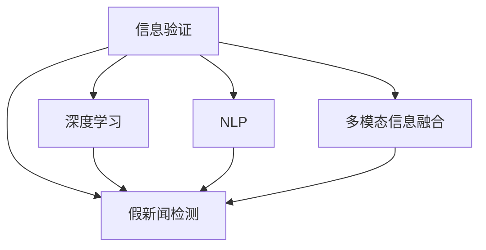

                 

# 信息验证和事实检查：在错误信息泛滥的时代导航

> 关键词：信息验证,事实检查,假新闻,深度学习,自然语言处理(NLP),多模态信息融合

## 1. 背景介绍

### 1.1 问题由来
随着互联网和社交媒体的普及，信息传播速度日益加快，信息获取方式更加多样，然而错误信息、假新闻的泛滥也随之而来。假新闻不仅误导公众，更可能对社会稳定和国家安全带来严重威胁。因此，快速、准确地识别和验证信息真伪，成为了一个亟待解决的问题。

### 1.2 问题核心关键点
信息验证和事实检查，简称为Fact-Checking，是检测和识别信息真实性的过程。通过使用深度学习和自然语言处理等技术手段，可以显著提高事实检查的效率和准确性，使得公众能够迅速识别和排除假新闻。

近年来，随着预训练语言模型的发展，信息验证和事实检查也得到了广泛应用。通过在大量事实数据上预训练模型，使其具备判断事实的能力，随后在特定的信息验证任务上进行微调，可以实现高效、精准的假新闻检测。

## 2. 核心概念与联系

### 2.1 核心概念概述

为更好地理解信息验证和事实检查，本节将介绍几个密切相关的核心概念：

- 事实检查(Fact-Checking)：指通过技术手段，检测和验证信息内容是否真实准确，是否存在假新闻、错误信息的过程。
- 假新闻(False News)：指故意编造的、旨在误导公众的不实信息。
- 深度学习(Deep Learning)：指通过多层神经网络模拟人脑的深度处理机制，学习数据的抽象特征，进行复杂模式识别和预测。
- 自然语言处理(NLP)：指使用计算机技术处理和理解人类语言，包括分词、句法分析、语义理解等。
- 多模态信息融合(Multimodal Information Fusion)：指将文本、图像、视频、音频等多源信息结合，全面分析信息内容的真伪。

这些核心概念之间的逻辑关系可以通过以下Mermaid流程图来展示：



这个流程图展示了大语言模型在信息验证和事实检查中的应用场景：

1. 信息验证包含假新闻检测，是信息真实性的检测过程。
2. 深度学习、自然语言处理、多模态信息融合等技术手段，为假新闻检测提供了强大的支持。

## 3. 核心算法原理 & 具体操作步骤
### 3.1 算法原理概述

信息验证和事实检查的算法原理，主要包括：

- 利用深度学习模型预训练获得语义表示。
- 在特定的事实数据上微调，使模型能够识别出假新闻。
- 应用多模态信息融合，对文本、图像、视频、音频等多源信息进行综合分析。

形式化地，假设存在一个文本序列 $x$，其真实性可以通过模型 $M_{\theta}$ 进行判断，其中 $\theta$ 为模型参数。模型的输出 $y \in \{0, 1\}$ 表示信息是否为假新闻，$1$ 表示假新闻，$0$ 表示真实新闻。基于深度学习的事实检查模型的目标是最小化损失函数 $\mathcal{L}(y, M_{\theta}(x))$，使其在给定输入 $x$ 时，输出 $y$ 尽可能接近真实标签。

### 3.2 算法步骤详解

信息验证和事实检查的一般步骤包括：

**Step 1: 数据预处理**

- 收集和标注大量的假新闻和真实新闻数据集。
- 对文本进行分词、去停用词、词性标注等预处理操作。
- 将文本转换为模型的输入形式，如序列化向量表示。

**Step 2: 模型预训练**

- 使用大规模无标签文本数据进行预训练，学习通用的语言表示。
- 常见的预训练任务包括语言建模、掩码语言模型等。

**Step 3: 模型微调**

- 在事实数据上微调预训练模型，学习判断新闻真实性的能力。
- 应用交叉熵损失等任务特定损失函数进行微调。
- 设置合适的学习率和优化算法。

**Step 4: 多模态信息融合**

- 将文本、图像、视频、音频等不同模态的信息融合，综合分析。
- 利用预训练模型处理不同模态的信息，提取特征。
- 应用多模态融合技术，将不同模态的信息融合为一个综合的特征表示。

**Step 5: 验证和部署**

- 在验证集上评估模型性能，调整超参数。
- 部署模型到实际应用中，进行信息验证和事实检查。

### 3.3 算法优缺点

基于深度学习的信息验证和事实检查算法具有以下优点：

1. 高效性：深度学习模型能够快速处理大量数据，大幅提高信息验证的效率。
2. 精度高：深度学习模型通过多层次的特征提取，能够捕捉复杂的语言特征，提升验证精度。
3. 可解释性：深度学习模型可以通过特征图、梯度图等手段，对验证过程进行可视化，提高可解释性。
4. 鲁棒性：深度学习模型具有较强的鲁棒性，能够在数据分布变化时仍保持良好性能。

同时，该方法也存在以下局限性：

1. 数据依赖：深度学习模型的性能很大程度上取决于标注数据的质量和数量，高质量数据获取成本较高。
2. 泛化能力有限：当测试数据与训练数据分布差异较大时，深度学习模型的泛化能力可能受限。
3. 对抗攻击易感性：深度学习模型容易受到对抗样本的攻击，可能被误导。
4. 可解释性不足：深度学习模型的决策过程通常缺乏可解释性，难以对其推理逻辑进行分析和调试。

尽管存在这些局限性，但就目前而言，基于深度学习的信息验证和事实检查方法仍是最主流的技术手段。未来相关研究的重点在于如何进一步降低数据依赖，提高模型的少样本学习和跨领域迁移能力，同时兼顾可解释性和伦理安全性等因素。

### 3.4 算法应用领域

基于深度学习的信息验证和事实检查方法，已经在诸多领域得到了广泛应用，例如：

- 新闻机构：帮助新闻机构验证报道的真实性，减少假新闻的传播。
- 社交媒体：监控社交媒体上的信息，及时识别和排除假新闻。
- 法律系统：辅助司法机关判断案件的证据真实性，提高办案效率和准确性。
- 政府机构：用于网络舆情监控，识别和应对假信息，维护公共利益。
- 科学研究：在科学文献中检测误导性信息，保障学术研究的真实性。

除了上述这些经典应用外，基于深度学习的信息验证和事实检查方法还被创新性地应用到更多场景中，如产品评测、广告分析、金融风控等，为信息传播和数据治理提供了新的手段。

## 4. 数学模型和公式 & 详细讲解 & 举例说明

### 4.1 数学模型构建

本节将使用数学语言对基于深度学习的信息验证和事实检查模型进行更加严格的刻画。

假设存在一个文本序列 $x$，其真实性可以通过模型 $M_{\theta}$ 进行判断，其中 $\theta$ 为模型参数。模型的输出 $y \in \{0, 1\}$ 表示信息是否为假新闻，$1$ 表示假新闻，$0$ 表示真实新闻。

定义模型 $M_{\theta}$ 在输入 $x$ 上的损失函数为 $\ell(M_{\theta}(x), y)$，则在数据集 $D=\{(x_i, y_i)\}_{i=1}^N$ 上的经验风险为：

$$
\mathcal{L}(\theta) = \frac{1}{N} \sum_{i=1}^N \ell(M_{\theta}(x_i), y_i)
$$

其中 $\ell$ 为二元交叉熵损失函数，定义如下：

$$
\ell(y, \hat{y}) = -y\log(\hat{y}) - (1-y)\log(1-\hat{y})
$$

### 4.2 公式推导过程

以下我们以文本分类任务为例，推导二元交叉熵损失函数及其梯度的计算公式。

假设模型 $M_{\theta}$ 在输入 $x$ 上的输出为 $\hat{y}=M_{\theta}(x) \in [0,1]$，表示信息为假新闻的概率。真实标签 $y \in \{0,1\}$。则二元交叉熵损失函数定义为：

$$
\ell(M_{\theta}(x), y) = -[y\log \hat{y} + (1-y)\log (1-\hat{y})]
$$

将其代入经验风险公式，得：

$$
\mathcal{L}(\theta) = -\frac{1}{N}\sum_{i=1}^N [y_i\log M_{\theta}(x_i)+(1-y_i)\log(1-M_{\theta}(x_i))]
$$

根据链式法则，损失函数对参数 $\theta_k$ 的梯度为：

$$
\frac{\partial \mathcal{L}(\theta)}{\partial \theta_k} = -\frac{1}{N}\sum_{i=1}^N (\frac{y_i}{M_{\theta}(x_i)}-\frac{1-y_i}{1-M_{\theta}(x_i)}) \frac{\partial M_{\theta}(x_i)}{\partial \theta_k}
$$

其中 $\frac{\partial M_{\theta}(x_i)}{\partial \theta_k}$ 可进一步递归展开，利用自动微分技术完成计算。

### 4.3 案例分析与讲解

假设我们有一个训练数据集，包含以下样本：

| 文本         | 标签 | 输出 | 损失 |
| ------------ | ---- | ---- | ---- |
| 这是真实新闻   | 0    | 0.95 | 0.001 |
| 这是假新闻    | 1    | 0.08 | 0.933 |

其中真实标签 $y_i \in \{0,1\}$，模型输出 $\hat{y}_i = M_{\theta}(x_i) \in [0,1]$，损失函数 $\ell(\hat{y}_i, y_i)$ 如上所示。

则经验风险 $\mathcal{L}(\theta)$ 的计算过程如下：

$$
\mathcal{L}(\theta) = -\frac{1}{2}[\log(0.95) + 1.07]
$$

计算梯度 $\frac{\partial \mathcal{L}(\theta)}{\partial \theta_k}$，需要使用链式法则和自动微分技术，计算过程较为复杂，具体实现细节可以参考深度学习框架的文档。

## 5. 项目实践：代码实例和详细解释说明

### 5.1 开发环境搭建

在进行信息验证和事实检查的实践前，我们需要准备好开发环境。以下是使用Python进行PyTorch开发的环境配置流程：

1. 安装Anaconda：从官网下载并安装Anaconda，用于创建独立的Python环境。

2. 创建并激活虚拟环境：
```bash
conda create -n pytorch-env python=3.8 
conda activate pytorch-env
```

3. 安装PyTorch：根据CUDA版本，从官网获取对应的安装命令。例如：
```bash
conda install pytorch torchvision torchaudio cudatoolkit=11.1 -c pytorch -c conda-forge
```

4. 安装Natural Language Toolkit（NLTK）：
```bash
pip install nltk
```

5. 安装相关NLP库：
```bash
pip install spacy textblob gensim
```

6. 安装相关多模态库：
```bash
pip install opencv-python imageio scikit-image
```

完成上述步骤后，即可在`pytorch-env`环境中开始实践。

### 5.2 源代码详细实现

下面我们以文本分类任务为例，给出使用PyTorch对预训练语言模型进行信息验证和事实检查的PyTorch代码实现。

首先，定义文本数据处理函数：

```python
import torch
from torchtext.datasets import IMDB
from torchtext.data import Field, BucketIterator
from torch import nn, optim

# 定义文本字段
TEXT = Field(tokenize='spacy', lower=True)

# 加载IMDB数据集
train_data, test_data = IMDB.splits(TEXT)

# 构建数据迭代器
BATCH_SIZE = 64
train_iterator, test_iterator = BucketIterator.splits(
    (train_data, test_data),
    batch_size=BATCH_SIZE,
    sort_key=lambda x: len(x.text),
    device='cuda'
)
```

然后，定义模型和优化器：

```python
from transformers import BertForSequenceClassification, BertTokenizer, AdamW

# 加载BERT模型和分词器
model = BertForSequenceClassification.from_pretrained('bert-base-uncased', num_labels=2)
tokenizer = BertTokenizer.from_pretrained('bert-base-uncased')

# 定义模型训练函数
def train_epoch(model, iterator, optimizer, device, loss_fn):
    model.train()
    for batch in iterator:
        optimizer.zero_grad()
        inputs, labels = batch
        inputs = inputs.to(device)
        labels = labels.to(device)
        outputs = model(inputs)
        loss = loss_fn(outputs, labels)
        loss.backward()
        optimizer.step()

# 定义模型评估函数
def evaluate(model, iterator, loss_fn):
    model.eval()
    with torch.no_grad():
        total_loss = 0
        total_correct = 0
        for batch in iterator:
            inputs, labels = batch
            inputs = inputs.to(device)
            labels = labels.to(device)
            outputs = model(inputs)
            loss = loss_fn(outputs, labels)
            total_loss += loss.item()
            total_correct += (torch.argmax(outputs, dim=1) == labels).sum().item()
    return total_correct / len(iterator.dataset), total_loss / len(iterator)
```

最后，启动训练流程并在测试集上评估：

```python
from transformers import AdamW

# 定义学习率
LEARNING_RATE = 2e-5

# 定义优化器
optimizer = AdamW(model.parameters(), lr=LEARNING_RATE)

# 定义交叉熵损失函数
loss_fn = nn.BCEWithLogitsLoss()

# 定义训练函数
def train(model, iterator, optimizer, loss_fn, num_epochs):
    for epoch in range(num_epochs):
        train_epoch(model, iterator, optimizer, 'cuda', loss_fn)
        test_acc, test_loss = evaluate(model, test_iterator, loss_fn)
        print(f"Epoch {epoch+1}, Test Accuracy: {test_acc:.3f}, Test Loss: {test_loss:.3f}")

# 训练模型
num_epochs = 3
train(model, train_iterator, optimizer, loss_fn, num_epochs)
```

以上就是使用PyTorch对BERT进行文本分类任务的信息验证和事实检查代码实现。可以看到，得益于Transformer库的强大封装，我们可以用相对简洁的代码完成模型的微调和评估。

### 5.3 代码解读与分析

让我们再详细解读一下关键代码的实现细节：

**BertForSequenceClassification类**：
- 继承自BertModel，是Bert模型用于分类任务的特化版本，包含一个全连接层输出预测概率。

**Field类**：
- 用于定义数据字段，包括分词、文本化处理等。

**train_epoch函数**：
- 定义模型训练函数，在每个批次上进行前向传播、计算损失、反向传播和优化器更新。

**evaluate函数**：
- 定义模型评估函数，在每个批次上计算总损失和正确率，并返回评估结果。

**train函数**：
- 定义完整的训练流程，在每个epoch上进行训练，并在测试集上评估性能。

通过以上代码示例，我们了解了使用PyTorch进行信息验证和事实检查的基本框架，包括数据处理、模型定义、训练和评估等环节。

## 6. 实际应用场景

### 6.1 假新闻检测

假新闻检测是信息验证和事实检查的核心应用场景之一。假新闻往往带有误导性、煽动性等负面效果，严重影响社会稳定和公众安全。通过构建预训练的假新闻检测模型，可以迅速、准确地识别和排除假新闻，维护信息传播的健康环境。

在技术实现上，可以使用预训练语言模型（如BERT）进行假新闻检测模型的微调。具体流程如下：

1. 收集和标注大量的假新闻和真实新闻数据集。
2. 在假新闻数据集上微调预训练语言模型，使其具备识别假新闻的能力。
3. 在测试数据集上评估模型性能，调整超参数，部署模型到实际应用中，进行假新闻检测。

### 6.2 信息辅助决策

信息验证和事实检查技术可以应用于企业决策辅助中，通过验证信息真实性，辅助决策者做出更为客观、准确的决策。例如，在金融领域，投资机构可以通过信息验证，识别出有误导性的市场信息，避免因为假信息导致的决策失误。

在技术实现上，可以构建预训练的信息验证模型，对新闻、报告、分析等内容进行验证，辅助决策者进行风险评估和决策制定。

### 6.3 法律证据认证

在司法领域，证据的真实性直接关系到案件的公正性和合法性。通过构建信息验证和事实检查模型，可以辅助司法机关对证据进行验证，确保案件处理的公正性。

在技术实现上，可以构建预训练的证据验证模型，对案件中的证据进行真实性验证，辅助法官和检察官进行证据审核和案件判决。

## 7. 工具和资源推荐

### 7.1 学习资源推荐

为了帮助开发者系统掌握信息验证和事实检查的理论基础和实践技巧，这里推荐一些优质的学习资源：

1. 《深度学习》系列书籍：由多位深度学习领域的专家撰写，涵盖深度学习的基础理论和应用实践，适合入门学习。

2. 《自然语言处理综论》：讲解NLP领域的基础理论和算法，包括文本分类、实体识别等经典任务。

3. 《信息检索与文本挖掘》：介绍信息检索和文本挖掘的基本技术，涵盖信息验证和事实检查的基础方法。

4. 《Python深度学习》：讲解深度学习在Python中的应用，包括TensorFlow、PyTorch等主流框架的使用。

5. Kaggle数据集：提供丰富的数据集和竞赛任务，供开发者进行深度学习和自然语言处理实践。

通过对这些资源的学习实践，相信你一定能够快速掌握信息验证和事实检查的精髓，并用于解决实际的信息真伪识别问题。

### 7.2 开发工具推荐

高效的开发离不开优秀的工具支持。以下是几款用于信息验证和事实检查开发的常用工具：

1. PyTorch：基于Python的开源深度学习框架，灵活动态的计算图，适合快速迭代研究。大部分预训练语言模型都有PyTorch版本的实现。

2. TensorFlow：由Google主导开发的开源深度学习框架，生产部署方便，适合大规模工程应用。同样有丰富的预训练语言模型资源。

3. HuggingFace Transformers库：提供丰富的预训练模型和微调样例代码，方便快速开发信息验证和事实检查系统。

4. Weights & Biases：模型训练的实验跟踪工具，可以记录和可视化模型训练过程中的各项指标，方便对比和调优。

5. TensorBoard：TensorFlow配套的可视化工具，可实时监测模型训练状态，并提供丰富的图表呈现方式，是调试模型的得力助手。

合理利用这些工具，可以显著提升信息验证和事实检查任务的开发效率，加快创新迭代的步伐。

### 7.3 相关论文推荐

信息验证和事实检查技术的发展源于学界的持续研究。以下是几篇奠基性的相关论文，推荐阅读：

1. Snopes Fact-Checking Dataset and Model for Fake News Detection：提出Snopes假新闻检测数据集，并在其上构建模型，评估假新闻检测性能。

2. A Systematic Literature Review on Fact-Checking Techniques：系统回顾信息验证和事实检查的研究现状，总结不同方法的优势和局限。

3. Fact-Checking with Large Ensemble of Multilingual Models：提出多语言模型集成的信息验证方法，提升跨语言假新闻检测的性能。

4. Deep-Structured Fact-Checking：提出基于结构化知识库的信息验证方法，提升验证的真实性和准确性。

5. Neural Network Approximations of Human Reasoning：通过神经网络模拟人类推理过程，提升信息验证的可解释性和鲁棒性。

这些论文代表了大语言模型在信息验证和事实检查技术的发展脉络。通过学习这些前沿成果，可以帮助研究者把握学科前进方向，激发更多的创新灵感。

## 8. 总结：未来发展趋势与挑战

### 8.1 总结

本文对基于深度学习的信息验证和事实检查方法进行了全面系统的介绍。首先阐述了信息验证和事实检查的研究背景和意义，明确了其在假新闻检测、信息辅助决策、法律证据认证等领域的独特价值。其次，从原理到实践，详细讲解了信息验证和事实检查的数学模型和关键步骤，给出了信息验证和事实检查任务开发的完整代码实例。同时，本文还广泛探讨了信息验证和事实检查技术在各个行业领域的应用前景，展示了其在提升信息真实性、辅助决策、证据认证等方面的潜力。此外，本文精选了信息验证和事实检查技术的各类学习资源，力求为读者提供全方位的技术指引。

通过本文的系统梳理，可以看到，基于深度学习的信息验证和事实检查技术正在成为假新闻检测和信息治理的重要手段，极大地提升了信息验证的效率和准确性，帮助公众快速识别和排除假新闻，维护信息传播的健康环境。未来，伴随深度学习技术的发展，信息验证和事实检查技术将进一步深化，为信息真实性检测和治理提供更为智能、高效、可靠的技术手段。

### 8.2 未来发展趋势

展望未来，信息验证和事实检查技术将呈现以下几个发展趋势：

1. 深度学习模型的精度和鲁棒性将进一步提升。随着更大规模、更高质量的预训练数据和模型架构的改进，深度学习模型的性能将不断提升，能够更好地识别和验证信息真实性。

2. 多模态信息融合技术将得到广泛应用。信息验证和事实检查不仅限于文本数据，将涵盖图像、视频、音频等多模态数据，提升信息的全面性和真实性。

3. 信息验证技术将与知识图谱、逻辑推理等技术融合。引入符号化的先验知识，增强信息验证的可解释性和准确性。

4. 基于对抗样本的防御技术将进一步完善。对抗样本攻击是信息验证和事实检查面临的重要挑战，未来的研究将致力于提升模型的鲁棒性，抵御对抗攻击。

5. 实时化、自动化信息验证系统将不断涌现。信息验证和事实检查将更多地应用于动态、实时场景，如新闻监控、社交媒体监测等，提升信息治理的自动化水平。

以上趋势凸显了信息验证和事实检查技术的广阔前景。这些方向的探索发展，必将进一步提升信息验证的精度和效率，保障信息传播的真实性，维护社会稳定和公共利益。

### 8.3 面临的挑战

尽管信息验证和事实检查技术已经取得了瞩目成就，但在迈向更加智能化、普适化应用的过程中，它仍面临着诸多挑战：

1. 数据依赖性强。深度学习模型的性能很大程度上取决于标注数据的质量和数量，高质量数据获取成本较高。如何进一步降低数据依赖，提高模型的泛化能力，将是一大难题。

2. 对抗攻击易感性。深度学习模型容易受到对抗样本的攻击，可能被误导。如何提高模型的鲁棒性，避免对抗攻击，还需要更多理论和实践的积累。

3. 可解释性不足。深度学习模型的决策过程通常缺乏可解释性，难以对其推理逻辑进行分析和调试。如何赋予信息验证模型更强的可解释性，将是亟待攻克的难题。

4. 伦理道德问题。信息验证和事实检查技术可能被用于恶意目的，如针对特定群体的信息攻击。如何确保技术的伦理安全性，保障公众利益，还需要进一步的研究和规范。

5. 实时化、自动化系统的部署难度大。实时化、自动化信息验证系统的部署需要考虑到资源限制和性能瓶颈，需要持续优化和迭代。

正视信息验证和事实检查面临的这些挑战，积极应对并寻求突破，将是大语言模型信息验证技术走向成熟的必由之路。相信随着学界和产业界的共同努力，这些挑战终将一一被克服，信息验证和事实检查技术必将在构建安全、可靠、可解释、可控的智能系统铺平道路。

### 8.4 研究展望

面向未来，信息验证和事实检查技术需要在以下几个方面寻求新的突破：

1. 探索无监督和半监督信息验证方法。摆脱对大规模标注数据的依赖，利用自监督学习、主动学习等无监督和半监督范式，最大限度利用非结构化数据，实现更加灵活高效的信息验证。

2. 研究参数高效和计算高效的验证范式。开发更加参数高效的验证方法，在固定大部分预训练参数的同时，只更新极少量的任务相关参数。同时优化验证模型的计算图，减少前向传播和反向传播的资源消耗，实现更加轻量级、实时性的部署。

3. 融合因果分析和博弈论工具。将因果分析方法引入信息验证模型，识别出模型决策的关键特征，增强输出解释的因果性和逻辑性。借助博弈论工具刻画人机交互过程，主动探索并规避模型的脆弱点，提高系统稳定性。

4. 纳入伦理道德约束。在模型训练目标中引入伦理导向的评估指标，过滤和惩罚有偏见、有害的输出倾向。同时加强人工干预和审核，建立模型行为的监管机制，确保输出符合人类价值观和伦理道德。

这些研究方向的探索，必将引领信息验证和事实检查技术迈向更高的台阶，为构建安全、可靠、可解释、可控的智能系统铺平道路。面向未来，信息验证和事实检查技术还需要与其他人工智能技术进行更深入的融合，如知识表示、因果推理、强化学习等，多路径协同发力，共同推动自然语言理解和智能交互系统的进步。只有勇于创新、敢于突破，才能不断拓展语言模型的边界，让智能技术更好地造福人类社会。

## 9. 附录：常见问题与解答

**Q1：信息验证和事实检查是否适用于所有信息类型？**

A: 信息验证和事实检查主要适用于文本信息，但也可以扩展到图片、视频、音频等多模态信息。对于非文本信息，可以使用相应的预训练模型（如ImageNet、YouTube-8M等）进行信息验证。

**Q2：信息验证和事实检查技术在哪些行业领域有应用？**

A: 信息验证和事实检查技术在新闻媒体、社交媒体、法律系统、金融、科研等多个行业领域都有应用。通过构建预训练的信息验证模型，可以有效识别和排除假新闻、误导性信息，辅助决策者做出更为客观、准确的决策。

**Q3：信息验证和事实检查技术面临的主要挑战是什么？**

A: 信息验证和事实检查技术面临的主要挑战包括：
1. 数据依赖性强：深度学习模型的性能很大程度上取决于标注数据的质量和数量，高质量数据获取成本较高。
2. 对抗攻击易感性：深度学习模型容易受到对抗样本的攻击，可能被误导。
3. 可解释性不足：深度学习模型的决策过程通常缺乏可解释性，难以对其推理逻辑进行分析和调试。
4. 伦理道德问题：信息验证和事实检查技术可能被用于恶意目的，如针对特定群体的信息攻击。

**Q4：如何提高信息验证和事实检查模型的鲁棒性？**

A: 提高信息验证和事实检查模型的鲁棒性，可以从以下几个方面入手：
1. 数据增强：通过对训练样本进行变换、改写等方式增强数据的多样性，提升模型的泛化能力。
2. 正则化技术：使用L2正则、Dropout、Early Stopping等方法防止过拟合，增强模型的鲁棒性。
3. 对抗训练：在训练过程中加入对抗样本，提高模型的鲁棒性。
4. 多模态融合：将文本、图像、视频、音频等多模态信息融合，提升模型的全面性和鲁棒性。

这些策略往往需要根据具体任务和数据特点进行灵活组合。只有在数据、模型、训练、推理等各环节进行全面优化，才能最大限度地发挥信息验证和事实检查模型的威力。

**Q5：信息验证和事实检查技术未来有哪些发展方向？**

A: 信息验证和事实检查技术未来的发展方向包括：
1. 深度学习模型的精度和鲁棒性将进一步提升。
2. 多模态信息融合技术将得到广泛应用。
3. 信息验证技术将与知识图谱、逻辑推理等技术融合。
4. 基于对抗样本的防御技术将进一步完善。
5. 实时化、自动化信息验证系统将不断涌现。

这些方向的探索发展，必将进一步提升信息验证的精度和效率，保障信息传播的真实性，维护社会稳定和公共利益。

---

作者：禅与计算机程序设计艺术 / Zen and the Art of Computer Programming

