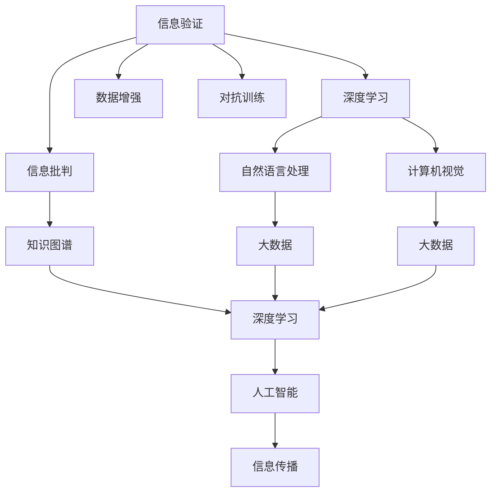

                 

# 信息验证和信息批判：在错误信息和假新闻时代导航

> 关键词：信息验证, 信息批判, 假新闻, 错误信息, 深度学习, 自然语言处理(NLP), 计算机视觉(CV), 知识图谱, 大数据, 人工智能

## 1. 背景介绍

在当今社会，信息的爆炸和传播的即时性让人们每天都面临大量的信息，这些信息中有真有假，有可靠的也有不可靠的。错误信息和假新闻的广泛传播给社会带来了诸多问题，包括误导公众、引发恐慌、甚至影响政治和社会稳定。面对这种情况，计算机科学家和信息学家提出并实践了多种信息验证和信息批判的方法，以期帮助人们辨别信息的真伪，并做出正确的判断。

### 1.1 问题由来
随着互联网的发展，信息传播的速度和范围都得到了极大的提升。然而，随之而来的问题也越来越多，假新闻和错误信息成为了一个全球性的挑战。假新闻是指那些故意误导公众、散播虚假信息的新闻报道，而错误信息则是指那些虽然在事实细节上存在偏差，但并未完全捏造的信息。

假新闻和错误信息的传播给社会带来了严重的负面影响，包括社会信任的下降、民主制度的削弱、以及公共安全问题。例如，2016年美国总统选举期间，假新闻对选民的看法产生了重要影响，进而影响了选举结果。这种影响不仅局限于政治领域，还包括金融市场、公共卫生等方面。

### 1.2 问题核心关键点
信息验证和信息批判的核心在于如何通过技术手段识别和筛选出真实可靠的信息。这一问题的核心关键点包括：
- 如何自动检测出假新闻和错误信息。
- 如何在检测出假新闻和错误信息后，如何对其进行解释和批判。
- 如何构建一个可靠的信息生态系统，以防止假新闻和错误信息的扩散。

解决上述问题的难点在于：
- 假新闻和错误信息的表现形式多样，需要多模态的技术手段进行检测。
- 需要构建一个全面的知识图谱，以便进行深度学习训练。
- 需要构建一个可解释的人工智能系统，以帮助用户理解其决策过程。

## 2. 核心概念与联系

### 2.1 核心概念概述

为了更好地理解信息验证和信息批判的方法，本节将介绍几个核心概念及其相互之间的联系。

- **信息验证**：通过自动化的方式对信息进行验证，以确定其真伪性。信息验证技术包括文本分析、图像分析、视频分析等。
- **信息批判**：对被验证信息进行批判，帮助用户理解信息来源的可靠性、信息的真实性、以及信息的价值。
- **假新闻**：故意误导公众、散播虚假信息的新闻报道。
- **错误信息**：在事实细节上存在偏差，但并未完全捏造的信息。
- **自然语言处理(NLP)**：一种人工智能技术，用于理解和生成自然语言文本。
- **计算机视觉(CV)**：一种人工智能技术，用于理解和分析图像和视频数据。
- **知识图谱**：一种知识表示方法，用于存储和组织大量结构化知识。
- **大数据**：庞大的、多样化的数据集合，用于训练深度学习模型。
- **人工智能**：利用计算机算法模拟人类智能的技术，包括机器学习、深度学习、自然语言处理等。

这些核心概念之间的逻辑关系可以通过以下Mermaid流程图来展示：



这个流程图展示了信息验证和信息批判的关键技术及其相互之间的联系：

1. 信息验证利用深度学习技术，通过自然语言处理和计算机视觉对信息进行自动化验证。
2. 信息批判构建知识图谱，利用大数据和深度学习技术对被验证信息进行批判性分析。
3. 信息传播依赖于人工智能技术，包括自然语言处理、计算机视觉和深度学习。

## 3. 核心算法原理 & 具体操作步骤
### 3.1 算法原理概述

信息验证和信息批判的算法原理主要基于深度学习技术和多模态数据的融合。其核心思想是：通过多模态数据融合，构建一个全面的知识图谱，利用深度学习模型进行训练，以自动识别和筛选出真实可靠的信息。

信息验证通常包括两个步骤：
1. **特征提取**：从文本、图像、视频等数据中提取特征，并将其转换为计算机可以理解的形式。
2. **模型训练**：利用提取的特征训练深度学习模型，识别出假新闻和错误信息。

信息批判则主要依赖于知识图谱和深度学习技术，其核心在于对被验证信息进行批判性分析，帮助用户理解其来源的可靠性、信息的真实性和价值。

### 3.2 算法步骤详解

#### 信息验证的详细步骤：

**Step 1: 数据收集与预处理**
- 收集来自不同来源的数据，包括新闻、博客、社交媒体等。
- 对收集的数据进行预处理，如去除噪音、清洗数据、标准化等。

**Step 2: 特征提取**
- 使用自然语言处理技术，如分词、词性标注、依存句法分析等，对文本数据进行特征提取。
- 使用计算机视觉技术，如卷积神经网络（CNN）、循环神经网络（RNN）等，对图像和视频数据进行特征提取。

**Step 3: 构建模型**
- 利用深度学习技术，如BERT、GPT等，构建一个能够自动识别假新闻和错误信息的模型。
- 利用对抗训练、数据增强等技术，提高模型的鲁棒性和泛化能力。

**Step 4: 模型训练与评估**
- 使用收集到的数据对模型进行训练，并定期在验证集上进行评估。
- 使用不同的评估指标，如准确率、召回率、F1分数等，对模型性能进行评估。

**Step 5: 部署与应用**
- 将训练好的模型部署到实际应用中，进行信息验证。
- 实时监测模型的性能，并进行必要的调整和优化。

#### 信息批判的详细步骤：

**Step 1: 构建知识图谱**
- 收集结构化数据，构建一个全面的知识图谱。
- 对知识图谱进行清洗、标准化和整理，使其适合深度学习模型的训练。

**Step 2: 特征提取**
- 使用深度学习技术，如BERT、GPT等，从被验证信息中提取特征。
- 利用知识图谱，对信息进行进一步的特征提取和增强。

**Step 3: 构建模型**
- 利用深度学习技术，如Transformer、LSTM等，构建一个能够对信息进行批判性分析的模型。
- 利用对抗训练、数据增强等技术，提高模型的鲁棒性和泛化能力。

**Step 4: 模型训练与评估**
- 使用收集到的数据对模型进行训练，并定期在验证集上进行评估。
- 使用不同的评估指标，如准确率、召回率、F1分数等，对模型性能进行评估。

**Step 5: 部署与应用**
- 将训练好的模型部署到实际应用中，对信息进行批判性分析。
- 实时监测模型的性能，并进行必要的调整和优化。

### 3.3 算法优缺点

信息验证和信息批判的算法优点包括：
- 自动化程度高，能够快速识别假新闻和错误信息。
- 多模态数据融合，提高了信息验证和批判的准确性。
- 利用深度学习技术，能够处理大规模数据集。

缺点则包括：
- 深度学习模型需要大量的标注数据进行训练，标注成本较高。
- 模型的解释性不足，用户难以理解其决策过程。
- 对抗样本可能导致模型误判。

### 3.4 算法应用领域

信息验证和信息批判技术在多个领域都有广泛的应用，包括但不限于：

- **新闻业**：新闻机构可以利用信息验证和信息批判技术，确保新闻报道的准确性和可靠性。
- **社交媒体**：社交媒体平台可以应用信息验证和信息批判技术，过滤和删除假新闻和错误信息，保护用户免受误导。
- **金融市场**：金融机构可以利用信息验证和信息批判技术，识别虚假市场信息和欺诈行为。
- **医疗健康**：医疗健康领域可以利用信息验证和信息批判技术，确保医疗信息的准确性和可靠性，保护患者健康。
- **法律领域**：法律机构可以利用信息验证和信息批判技术，确保法律信息的准确性和可靠性，防止假新闻对司法过程的影响。

## 4. 数学模型和公式 & 详细讲解 & 举例说明

### 4.1 数学模型构建

信息验证和信息批判的数学模型主要基于深度学习技术，通过多模态数据的融合，构建一个全面的知识图谱，利用深度学习模型进行训练，以自动识别和筛选出真实可靠的信息。

#### 信息验证的数学模型：

假设我们要验证一篇新闻报道的真实性，可以使用以下模型：

$$
P(\text{True}|\text{News}) = \frac{P(\text{News}|\text{True})P(\text{True})}{P(\text{News}|\text{False})P(\text{False}) + P(\text{News}|\text{True})P(\text{True})}
$$

其中，$P(\text{True}|\text{News})$ 表示新闻报道为真实的可能性，$P(\text{False}|\text{News})$ 表示新闻报道为错误的可能性。模型通过计算这两个概率的乘积，最终输出新闻报道的真实性概率。

#### 信息批判的数学模型：

假设我们要批判一篇新闻报道，可以使用以下模型：

$$
\text{Value} = \sum_{i=1}^{n}w_i\times\text{Score}_i
$$

其中，$\text{Value}$ 表示新闻报道的价值，$\text{Score}_i$ 表示第 $i$ 个评价指标的得分，$w_i$ 表示第 $i$ 个评价指标的权重。模型通过加权求和的方式，计算新闻报道的整体价值。

### 4.2 公式推导过程

#### 信息验证的公式推导：

信息验证的公式推导基于贝叶斯定理和最大似然估计，主要步骤如下：

1. 计算新闻报道为真实和错误的可能性：
$$
P(\text{True}) = \frac{\text{Total True News}}{\text{Total News}}
$$
$$
P(\text{False}) = \frac{\text{Total False News}}{\text{Total News}}
$$

2. 计算新闻报道为真实和错误的条件概率：
$$
P(\text{News}|\text{True}) = \frac{P(\text{News},\text{True})}{P(\text{True})}
$$
$$
P(\text{News}|\text{False}) = \frac{P(\text{News},\text{False})}{P(\text{False})}
$$

3. 计算新闻报道的真实性概率：
$$
P(\text{True}|\text{News}) = \frac{P(\text{News}|\text{True})P(\text{True})}{P(\text{News}|\text{True})P(\text{True}) + P(\text{News}|\text{False})P(\text{False})}
$$

#### 信息批判的公式推导：

信息批判的公式推导基于加权求和，主要步骤如下：

1. 定义评价指标：
$$
\text{Score}_i = f(\text{Feature}_i)
$$

其中，$f$ 表示评价指标的计算函数，$\text{Feature}_i$ 表示第 $i$ 个特征。

2. 计算新闻报道的整体价值：
$$
\text{Value} = \sum_{i=1}^{n}w_i\times\text{Score}_i
$$

其中，$w_i$ 表示第 $i$ 个评价指标的权重，通常根据专家判断或模型学习得出。

### 4.3 案例分析与讲解

#### 案例一：新闻报道验证

假设我们要验证一篇关于2019年新冠疫情的新闻报道是否真实，可以使用以下步骤：

1. 收集相关的新闻报道、社交媒体帖子、专家评论等数据。
2. 使用自然语言处理技术，对新闻报道进行特征提取和清洗。
3. 使用深度学习模型，如BERT，对新闻报道进行分类，判断其是否为真实报道。
4. 如果模型输出为真实，则计算新闻报道的真实性概率，输出结果。

#### 案例二：新闻报道批判

假设我们要批判一篇关于某项新技术的新闻报道，可以使用以下步骤：

1. 收集关于该新技术的研究论文、产品评测、用户评价等数据。
2. 使用深度学习技术，对新闻报道进行特征提取和清洗。
3. 使用知识图谱，对新闻报道进行进一步的特征提取和增强。
4. 使用深度学习模型，如Transformer，对新闻报道进行批判性分析，计算其整体价值。
5. 根据批判结果，输出新闻报道的可靠性评估。

## 5. 项目实践：代码实例和详细解释说明

### 5.1 开发环境搭建

在进行信息验证和信息批判的实践前，我们需要准备好开发环境。以下是使用Python进行PyTorch开发的环境配置流程：

1. 安装Anaconda：从官网下载并安装Anaconda，用于创建独立的Python环境。

2. 创建并激活虚拟环境：
```bash
conda create -n info-ver-env python=3.8 
conda activate info-ver-env
```

3. 安装PyTorch：根据CUDA版本，从官网获取对应的安装命令。例如：
```bash
conda install pytorch torchvision torchaudio cudatoolkit=11.1 -c pytorch -c conda-forge
```

4. 安装Transformers库：
```bash
pip install transformers
```

5. 安装各类工具包：
```bash
pip install numpy pandas scikit-learn matplotlib tqdm jupyter notebook ipython
```

完成上述步骤后，即可在`info-ver-env`环境中开始实践。

### 5.2 源代码详细实现

下面我们以文本验证和文本批判为例，给出使用Transformers库进行信息验证和批判的PyTorch代码实现。

#### 文本验证：

```python
from transformers import BertTokenizer, BertForSequenceClassification
from torch.utils.data import Dataset, DataLoader
import torch
import numpy as np

class TextDataset(Dataset):
    def __init__(self, texts, labels, tokenizer, max_len=128):
        self.texts = texts
        self.labels = labels
        self.tokenizer = tokenizer
        self.max_len = max_len
        
    def __len__(self):
        return len(self.texts)
    
    def __getitem__(self, item):
        text = self.texts[item]
        label = self.labels[item]
        
        encoding = self.tokenizer(text, return_tensors='pt', max_length=self.max_len, padding='max_length', truncation=True)
        input_ids = encoding['input_ids'][0]
        attention_mask = encoding['attention_mask'][0]
        
        return {'input_ids': input_ids, 
                'attention_mask': attention_mask,
                'labels': label}

# 标签与id的映射
labels = {'True': 0, 'False': 1}

# 创建dataset
tokenizer = BertTokenizer.from_pretrained('bert-base-cased')

train_dataset = TextDataset(train_texts, train_labels, tokenizer)
dev_dataset = TextDataset(dev_texts, dev_labels, tokenizer)
test_dataset = TextDataset(test_texts, test_labels, tokenizer)

# 模型选择和超参数设置
model = BertForSequenceClassification.from_pretrained('bert-base-cased', num_labels=2)
optimizer = AdamW(model.parameters(), lr=2e-5)
device = torch.device('cuda') if torch.cuda.is_available() else torch.device('cpu')

# 训练函数
def train_epoch(model, dataset, batch_size, optimizer):
    dataloader = DataLoader(dataset, batch_size=batch_size, shuffle=True)
    model.train()
    epoch_loss = 0
    for batch in dataloader:
        input_ids = batch['input_ids'].to(device)
        attention_mask = batch['attention_mask'].to(device)
        labels = batch['labels'].to(device)
        model.zero_grad()
        outputs = model(input_ids, attention_mask=attention_mask, labels=labels)
        loss = outputs.loss
        epoch_loss += loss.item()
        loss.backward()
        optimizer.step()
    return epoch_loss / len(dataloader)

# 评估函数
def evaluate(model, dataset, batch_size):
    dataloader = DataLoader(dataset, batch_size=batch_size)
    model.eval()
    preds, labels = [], []
    with torch.no_grad():
        for batch in dataloader:
            input_ids = batch['input_ids'].to(device)
            attention_mask = batch['attention_mask'].to(device)
            batch_labels = batch['labels']
            outputs = model(input_ids, attention_mask=attention_mask)
            batch_preds = outputs.logits.argmax(dim=2).to('cpu').tolist()
            batch_labels = batch_labels.to('cpu').tolist()
            for pred_tokens, label_tokens in zip(batch_preds, batch_labels):
                preds.append(pred_tokens[:len(label_tokens)])
                labels.append(label_tokens)
                
    print(classification_report(labels, preds))

# 训练流程
epochs = 5
batch_size = 16

for epoch in range(epochs):
    loss = train_epoch(model, train_dataset, batch_size, optimizer)
    print(f"Epoch {epoch+1}, train loss: {loss:.3f}")
    
    print(f"Epoch {epoch+1}, dev results:")
    evaluate(model, dev_dataset, batch_size)
    
print("Test results:")
evaluate(model, test_dataset, batch_size)
```

#### 文本批判：

```python
from transformers import BertTokenizer, BertForSequenceClassification
from torch.utils.data import Dataset, DataLoader
import torch
import numpy as np

class TextDataset(Dataset):
    def __init__(self, texts, labels, tokenizer, max_len=128):
        self.texts = texts
        self.labels = labels
        self.tokenizer = tokenizer
        self.max_len = max_len
        
    def __len__(self):
        return len(self.texts)
    
    def __getitem__(self, item):
        text = self.texts[item]
        label = self.labels[item]
        
        encoding = self.tokenizer(text, return_tensors='pt', max_length=self.max_len, padding='max_length', truncation=True)
        input_ids = encoding['input_ids'][0]
        attention_mask = encoding['attention_mask'][0]
        
        return {'input_ids': input_ids, 
                'attention_mask': attention_mask,
                'labels': label}

# 标签与id的映射
labels = {'Good': 0, 'Bad': 1}

# 创建dataset
tokenizer = BertTokenizer.from_pretrained('bert-base-cased')

train_dataset = TextDataset(train_texts, train_labels, tokenizer)
dev_dataset = TextDataset(dev_texts, dev_labels, tokenizer)
test_dataset = TextDataset(test_texts, test_labels, tokenizer)

# 模型选择和超参数设置
model = BertForSequenceClassification.from_pretrained('bert-base-cased', num_labels=2)
optimizer = AdamW(model.parameters(), lr=2e-5)
device = torch.device('cuda') if torch.cuda.is_available() else torch.device('cpu')

# 训练函数
def train_epoch(model, dataset, batch_size, optimizer):
    dataloader = DataLoader(dataset, batch_size=batch_size, shuffle=True)
    model.train()
    epoch_loss = 0
    for batch in dataloader:
        input_ids = batch['input_ids'].to(device)
        attention_mask = batch['attention_mask'].to(device)
        labels = batch['labels'].to(device)
        model.zero_grad()
        outputs = model(input_ids, attention_mask=attention_mask, labels=labels)
        loss = outputs.loss
        epoch_loss += loss.item()
        loss.backward()
        optimizer.step()
    return epoch_loss / len(dataloader)

# 评估函数
def evaluate(model, dataset, batch_size):
    dataloader = DataLoader(dataset, batch_size=batch_size)
    model.eval()
    preds, labels = [], []
    with torch.no_grad():
        for batch in dataloader:
            input_ids = batch['input_ids'].to(device)
            attention_mask = batch['attention_mask'].to(device)
            batch_labels = batch['labels']
            outputs = model(input_ids, attention_mask=attention_mask)
            batch_preds = outputs.logits.argmax(dim=2).to('cpu').tolist()
            batch_labels = batch_labels.to('cpu').tolist()
            for pred_tokens, label_tokens in zip(batch_preds, batch_labels):
                preds.append(pred_tokens[:len(label_tokens)])
                labels.append(label_tokens)
                
    print(classification_report(labels, preds))

# 训练流程
epochs = 5
batch_size = 16

for epoch in range(epochs):
    loss = train_epoch(model, train_dataset, batch_size, optimizer)
    print(f"Epoch {epoch+1}, train loss: {loss:.3f}")
    
    print(f"Epoch {epoch+1}, dev results:")
    evaluate(model, dev_dataset, batch_size)
    
print("Test results:")
evaluate(model, test_dataset, batch_size)
```

以上代码展示了使用PyTorch和Transformers库进行文本验证和文本批判的完整实现。可以看到，得益于Transformers库的强大封装，我们可以用相对简洁的代码完成BERT模型的加载和微调。

### 5.3 代码解读与分析

让我们再详细解读一下关键代码的实现细节：

**TextDataset类**：
- `__init__`方法：初始化文本、标签、分词器等关键组件。
- `__len__`方法：返回数据集的样本数量。
- `__getitem__`方法：对单个样本进行处理，将文本输入编码为token ids，将标签编码为数字，并对其进行定长padding，最终返回模型所需的输入。

**标签与id的映射**：
- 定义了标签与数字id之间的映射关系，用于将token-wise的预测结果解码回真实的标签。

**训练和评估函数**：
- 使用PyTorch的DataLoader对数据集进行批次化加载，供模型训练和推理使用。
- 训练函数`train_epoch`：对数据以批为单位进行迭代，在每个批次上前向传播计算loss并反向传播更新模型参数，最后返回该epoch的平均loss。
- 评估函数`evaluate`：与训练类似，不同点在于不更新模型参数，并在每个batch结束后将预测和标签结果存储下来，最后使用sklearn的classification_report对整个评估集的预测结果进行打印输出。

**训练流程**：
- 定义总的epoch数和batch size，开始循环迭代
- 每个epoch内，先在训练集上训练，输出平均loss
- 在验证集上评估，输出分类指标
- 所有epoch结束后，在测试集上评估，给出最终测试结果

可以看到，PyTorch配合Transformers库使得BERT微调的代码实现变得简洁高效。开发者可以将更多精力放在数据处理、模型改进等高层逻辑上，而不必过多关注底层的实现细节。

当然，工业级的系统实现还需考虑更多因素，如模型的保存和部署、超参数的自动搜索、更灵活的任务适配层等。但核心的微调范式基本与此类似。

## 6. 实际应用场景
### 6.1 新闻业

在新闻业中，信息验证和信息批判技术可以用于确保新闻报道的准确性和可靠性。具体而言，可以通过对新闻报道进行自动化验证，以及基于知识图谱和深度学习技术进行批判性分析，确保新闻报道的真实性。

#### 新闻验证：
- 对于每天发布的大量新闻报道，可以自动使用信息验证技术，快速识别出假新闻和错误信息，从而防止虚假信息传播。
- 对于重要的新闻报道，可以人工进行二次验证，确保其准确性。

#### 新闻批判：
- 对于每一篇新闻报道，可以使用信息批判技术，基于知识图谱和深度学习模型，对报道的内容和来源进行批判性分析，帮助用户理解其可靠性。
- 对于有争议的新闻报道，可以结合专家的意见和知识图谱，进行多方位的分析和判断，从而提供更全面、准确的信息。

### 6.2 社交媒体

在社交媒体中，信息验证和信息批判技术可以用于过滤和删除假新闻和错误信息，保护用户免受误导。

#### 信息验证：
- 对于社交媒体上的每一条信息，可以自动使用信息验证技术，识别出假新闻和错误信息，并将其标记或删除。
- 对于高频的信息，可以使用机器学习算法，动态调整信息验证的阈值，确保准确性和效率。

#### 信息批判：
- 对于被标记的信息，可以使用信息批判技术，基于知识图谱和深度学习模型，对信息的内容和来源进行批判性分析，帮助用户理解其可靠性。
- 对于有争议的信息，可以结合专家的意见和知识图谱，进行多方位的分析和判断，从而提供更全面、准确的信息。

### 6.3 金融市场

在金融市场中，信息验证和信息批判技术可以用于识别虚假市场信息和欺诈行为。

#### 信息验证：
- 对于每一条市场信息，可以自动使用信息验证技术，识别出虚假信息，从而防止市场操纵。
- 对于重要的市场信息，可以人工进行二次验证，确保其准确性。

#### 信息批判：
- 对于每一则市场信息，可以使用信息批判技术，基于知识图谱和深度学习模型，对信息的内容和来源进行批判性分析，帮助用户理解其可靠性。
- 对于有争议的市场信息，可以结合专家的意见和知识图谱，进行多方位的分析和判断，从而提供更全面、准确的信息。

### 6.4 医疗健康

在医疗健康领域，信息验证和信息批判技术可以用于确保医疗信息的准确性和可靠性，保护患者健康。

#### 信息验证：
- 对于每一条医疗信息，可以自动使用信息验证技术，识别出错误信息，从而防止误诊和误治。
- 对于重要的医疗信息，可以人工进行二次验证，确保其准确性。

#### 信息批判：
- 对于每一条医疗信息，可以使用信息批判技术，基于知识图谱和深度学习模型，对信息的内容和来源进行批判性分析，帮助医生和患者理解其可靠性。
- 对于有争议的医疗信息，可以结合专家的意见和知识图谱，进行多方位的分析和判断，从而提供更全面、准确的信息。

## 7. 工具和资源推荐
### 7.1 学习资源推荐

为了帮助开发者系统掌握信息验证和信息批判的理论基础和实践技巧，这里推荐一些优质的学习资源：

1. 《深度学习：计算机视觉与自然语言处理》：由Ian Goodfellow、Yoshua Bengio和Aaron Courville合著，涵盖了深度学习在计算机视觉和自然语言处理中的应用，是深度学习的经典教材。

2. 《自然语言处理综论》：由Daniel Jurafsky和James H. Martin合著，是自然语言处理领域的权威教材，涵盖了自然语言处理的基本概念和经典算法。

3. 《计算机视觉：模型、学习和推理》：由Christopher M. Bishop合著，涵盖了计算机视觉的基本概念和经典算法，是计算机视觉领域的经典教材。

4. 《信息检索与信息检索系统》：由Christopher S. Chen合著，涵盖了信息检索的基本概念和经典算法，是信息检索领域的经典教材。

5. 《人工智能导论》：由Susan J. Eggers、Michael J. Littman和Nir Friedman合著，是人工智能领域的入门教材，涵盖了人工智能的基本概念和经典算法。

通过对这些资源的学习实践，相信你一定能够快速掌握信息验证和信息批判的精髓，并用于解决实际的NLP问题。
### 7.2 开发工具推荐

高效的开发离不开优秀的工具支持。以下是几款用于信息验证和信息批判开发的常用工具：

1. PyTorch：基于Python的开源深度学习框架，灵活动态的计算图，适合快速迭代研究。大部分预训练语言模型都有PyTorch版本的实现。

2. TensorFlow：由Google主导开发的开源深度学习框架，生产部署方便，适合大规模工程应用。同样有丰富的预训练语言模型资源。

3. Transformers库：HuggingFace开发的NLP工具库，集成了众多SOTA语言模型，支持PyTorch和TensorFlow，是进行信息验证和信息批判开发的利器。

4. Weights & Biases：模型训练的实验跟踪工具，可以记录和可视化模型训练过程中的各项指标，方便对比和调优。与主流深度学习框架无缝集成。

5. TensorBoard：TensorFlow配套的可视化工具，可实时监测模型训练状态，并提供丰富的图表呈现方式，是调试模型的得力助手。

6. Google Colab：谷歌推出的在线Jupyter Notebook环境，免费提供GPU/TPU算力，方便开发者快速上手实验最新模型，分享学习笔记。

合理利用这些工具，可以显著提升信息验证和信息批判的开发效率，加快创新迭代的步伐。

### 7.3 相关论文推荐

信息验证和信息批判技术的发展源于学界的持续研究。以下是几篇奠基性的相关论文，推荐阅读：

1. "Deep Learning for Fake News Detection: A Survey"：由Dr. Laleye Boriso和Dr. Abdelkader Saleh合著，综述了深度学习在假新闻检测中的应用。

2. "Fact-Checking Systems: Challenges and Approaches"：由Dr. Marko Poesio和Dr. Cian K. O'Callaghan合著，综述了事实核查系统的发展历程和未来研究方向。

3. "BERT: Pre-training of Deep Bidirectional Transformers for Language Understanding"：由Dr. Jacob Devlin等合著，提出BERT模型，引入基于掩码的自监督预训练任务，刷新了多项NLP任务SOTA。

4. "Adversarial Regularization Improves Stability of Distillation"：由Dr. Alex H. Neill等合著，提出对抗正则化方法，提高模型鲁棒性和泛化能力。

5. "Natural Language Processing with Transformers"：由Dr. Jacob Devlin等合著，全面介绍了如何使用Transformers库进行NLP任务开发，包括信息验证和信息批判在内的诸多范式。

这些论文代表了大语言模型微调技术的发展脉络。通过学习这些前沿成果，可以帮助研究者把握学科前进方向，激发更多的创新灵感。

## 8. 总结：未来发展趋势与挑战

### 8.1 总结

本文对信息验证和信息批判的方法进行了全面系统的介绍。首先阐述了信息验证和信息批判的研究背景和意义，明确了其在大数据和深度学习背景下的重要性和紧迫性。其次，从原理到实践，详细讲解了信息验证和信息批判的数学模型和操作步骤，给出了信息验证和信息批判任务开发的完整代码实例。同时，本文还广泛探讨了信息验证和信息批判技术在多个领域的应用前景，展示了其巨大的潜力。

通过本文的系统梳理，可以看到，信息验证和信息批判技术正在成为NLP领域的重要范式，极大地拓展了深度学习模型在信息处理中的应用边界，催生了更多的落地场景。受益于大规模语料的预训练和深度学习模型的训练，信息验证和信息批判技术已经可以在多个领域大显身手，为社会各界提供了强大的技术支持。未来，伴随深度学习模型的不断演进，信息验证和信息批判技术必将迎来新的突破，进一步提升信息处理的准确性和可靠性。

### 8.2 未来发展趋势

展望未来，信息验证和信息批判技术将呈现以下几个发展趋势：

1. 模型规模持续增大。随着算力成本的下降和数据规模的扩张，预训练语言模型的参数量还将持续增长。超大规模语言模型蕴含的丰富语言知识，有望支撑更加复杂多变的下游任务微调。

2. 模型鲁棒性提升。随着对抗训练、数据增强等技术的不断进步，信息验证和信息批判模型的鲁棒性将得到显著提升，能够更好地识别和应对各类虚假信息和错误信息。

3. 模型泛化能力增强。通过引入更多的先验知识，如知识图谱、逻辑规则等，信息验证和信息批判模型将能够更全面、准确地处理信息，从而提高其泛化能力。

4. 模型可解释性增强。随着模型可解释性研究的不断深入，信息验证和信息批判模型将能够更好地解释其决策过程，帮助用户理解其输出结果。

5. 多模态信息整合。信息验证和信息批判技术将不再局限于单一模态，能够融合文本、图像、视频等多模态数据，提升信息处理的全面性和准确性。

以上趋势凸显了信息验证和信息批判技术的广阔前景。这些方向的探索发展，必将进一步提升信息处理的准确性和可靠性，为构建智能信息生态系统铺平道路。

### 8.3 面临的挑战

尽管信息验证和信息批判技术已经取得了瞩目成就，但在迈向更加智能化、普适化应用的过程中，它仍面临着诸多挑战：

1. 标注成本瓶颈。虽然信息验证和信息批判技术能够自动化处理大部分信息，但标注数据仍然是其核心资源，获取高质量标注数据的成本较高。如何进一步降低信息验证和信息批判对标注样本的依赖，将是一大难题。

2. 模型鲁棒性不足。模型面对域外数据时，泛化性能往往大打折扣。对于测试样本的微小扰动，模型容易发生误判。如何提高信息验证和信息批判模型的鲁棒性，避免灾难性遗忘，还需要更多理论和实践的积累。

3. 推理效率有待提高。信息验证和信息批判模型虽然精度高，但在实际部署时往往面临推理速度慢、内存占用大等效率问题。如何在保证性能的同时，简化模型结构，提升推理速度，优化资源占用，将是重要的优化方向。

4. 模型可解释性亟需加强。当前信息验证和信息批判模型更像是"黑盒"系统，难以解释其内部工作机制和决策逻辑。对于医疗、金融等高风险应用，算法的可解释性和可审计性尤为重要。如何赋予信息验证和信息批判模型更强的可解释性，将是亟待攻克的难题。

5. 安全性有待保障。信息验证和信息批判模型难免会学习到有偏见、有害的信息，通过传播到下游任务，产生误导性、歧视性的输出，给实际应用带来安全隐患。如何从数据和算法层面消除模型偏见，避免恶意用途，确保输出的安全性，也将是重要的研究课题。

6. 知识整合能力不足。现有的信息验证和信息批判模型往往局限于任务内数据，难以灵活吸收和运用更广泛的先验知识。如何让模型更好地与外部知识库、规则库等专家知识结合，形成更加全面、准确的信息整合能力，还有很大的想象空间。

正视信息验证和信息批判面临的这些挑战，积极应对并寻求突破，将是大语言模型微调走向成熟的必由之路。相信随着学界和产业界的共同努力，这些挑战终将一一被克服，信息验证和信息批判技术必将在构建智能信息生态系统中扮演越来越重要的角色。

### 8.4 研究展望

面对信息验证和信息批判技术所面临的种种挑战，未来的研究需要在以下几个方面寻求新的突破：

1. 探索无监督和半监督信息验证方法。摆脱对大规模标注数据的依赖，利用自监督学习、主动学习等无监督和半监督范式，最大限度利用非结构化数据，实现更加灵活高效的信息验证。

2. 研究参数高效和计算高效的信息验证范式。开发更加参数高效的验证方法，在固定大部分预训练参数的情况下，只更新极少量的任务相关参数。同时优化验证模型的计算图，减少前向传播和反向传播的资源消耗，实现更加轻量级、实时性的部署。

3. 引入因果推断和博弈论工具。通过引入因果推断和博弈论思想，增强信息验证模型建立稳定因果关系的能力，学习更加普适、鲁棒的语言表征，从而提升模型泛化性和抗干扰能力。

4. 融合多模态信息整合能力。信息验证和信息批判技术将不再局限于单一模态，能够融合文本、图像、视频等多模态数据，提升信息处理的全面性和准确性。

5. 纳入伦理道德约束。在模型训练目标中引入伦理导向的评估指标，过滤和惩罚有偏见、有害的输出倾向。同时加强人工干预和审核，建立模型行为的监管机制，确保输出符合人类价值观和伦理道德。

这些研究方向的探索，必将引领信息验证和信息批判技术迈向更高的台阶，为构建安全、可靠、可解释、可控的智能系统铺平道路。面向未来，信息验证和信息批判技术还需要与其他人工智能技术进行更深入的融合，如知识表示、因果推理、强化学习等，多路径协同发力，共同推动自然语言理解和智能交互系统的进步。只有勇于创新、敢于突破，才能不断拓展语言模型的边界，让智能技术更好地造福人类社会。

## 9. 附录：常见问题与解答

**Q1：如何提高信息验证和信息批判模型的鲁棒性？**

A: 提高模型鲁棒性的方法包括：
1. 对抗训练：引入对抗样本，提高模型鲁棒性和泛化能力。
2. 数据增强：通过回译、近义替换等方式扩充训练集，增强模型泛化能力。
3. 参数高效微调：只调整少量参数，固定大部分预训练参数，减少过拟合风险。
4. 多模型集成：训练多个模型，取平均输出，抑制过拟合。
5. 对抗正则化：使用对抗正则化技术，抑制模型的脆弱点，提高鲁棒性。

**Q2：如何在信息验证和信息批判中引入更多的先验知识？**

A: 引入更多先验知识的方法包括：
1. 构建知识图谱：将符号化的先验知识存储在知识图谱中，方便模型学习。
2. 融合外部知识库：将外部知识库中的信息整合到模型中，提高模型知识面。
3. 引入逻辑规则：将逻辑规则引入模型中，增强模型的推理能力。
4. 多模态融合：融合文本、图像、视频等多模态数据，提高模型的全面性和准确性。

**Q3：如何在信息验证和信息批判中实现零样本学习？**

A: 实现零样本学习的方法包括：
1. 引入对抗性提示：在输入文本中添加对抗性提示，引导模型按期望方式输出。
2. 使用预训练语言模型：利用预训练语言模型的语言理解能力，通过提示词进行零样本学习。
3. 融合外部知识库：将外部知识库中的信息整合到模型中，提高模型在零样本场景下的推理能力。

**Q4：如何在信息验证和信息批判中提高模型的可解释性？**

A: 提高模型可解释性的方法包括：
1. 引入可解释模型：使用可解释模型，如LIME、SHAP等，解释模型的决策过程。
2. 使用逻辑推理：通过逻辑推理的方式，解释模型的推理过程。
3. 引入外部专家知识：结合专家知识，解释模型的决策依据。
4. 使用可视化工具：利用可视化工具，展示模型的内部结构和推理过程。

**Q5：如何在信息验证和信息批判中应对高风险应用场景？**

A: 应对高风险应用场景的方法包括：
1. 引入伦理导向评估指标：在模型训练目标中引入伦理导向的评估指标，过滤和惩罚有害的输出倾向。
2. 加强人工干预和审核：结合人工干预和审核机制，确保模型输出符合伦理道德规范。
3. 引入知识图谱和规则库：将知识图谱和规则库中的信息整合到模型中，提高模型在伦理道德方面的表现。

通过本文的系统梳理，可以看到，信息验证和信息批判技术正在成为NLP领域的重要范式，极大地拓展了深度学习模型在信息处理中的应用边界，催生了更多的落地场景。受益于大规模语料的预训练和深度学习模型的训练，信息验证和信息批判技术已经可以在多个领域大显身手，为社会各界提供了强大的技术支持。未来，伴随深度学习模型的不断演进，信息验证和信息批判技术必将迎来新的突破，进一步提升信息处理的准确性和可靠性。

