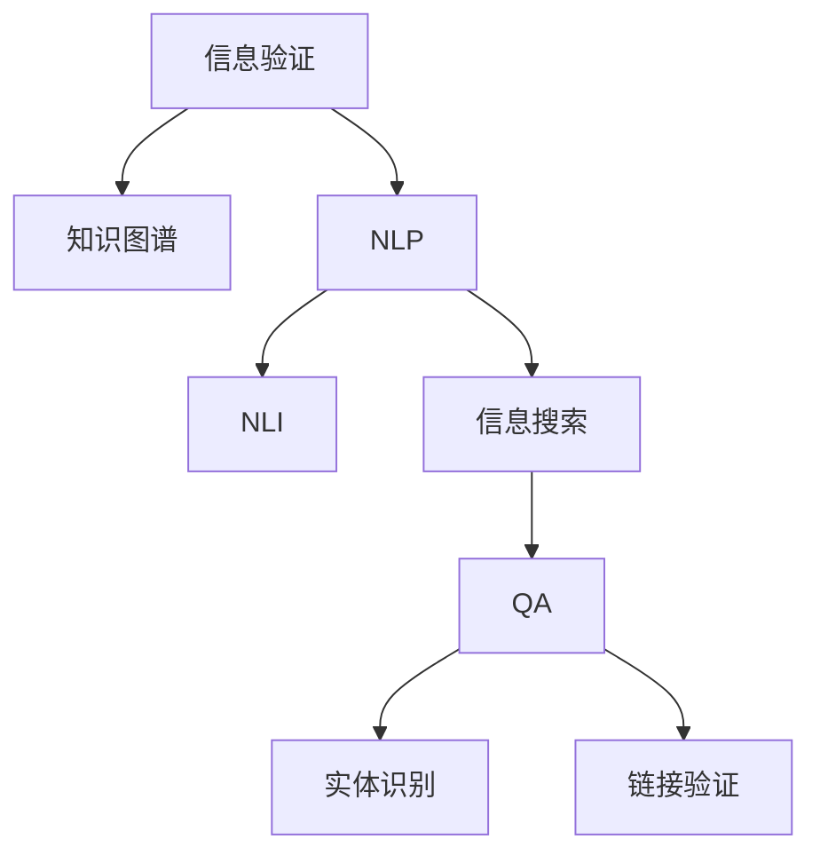

                 

# 信息验证和信息搜索技术：在信息海洋中找到可靠、有价值的信息

> 关键词：信息验证,信息搜索,自然语言处理(NLP),语义理解,深度学习,自然语言推理(NLI),问答系统(QA),信息检索,知识图谱

## 1. 背景介绍

### 1.1 问题由来

在信息爆炸的时代，互联网每天产生海量的数据，涵盖新闻、研究报告、社交媒体等各个领域。然而，在如此庞大的信息海洋中，如何找到可靠、有价值的信息，成为了一个重要且迫切的问题。传统的信息检索系统，如Google等搜索引擎，虽然已经非常强大，但仍存在诸多不足：搜索结果排序不合理、无法处理复杂的语义关系、难以提供精准的搜索结果等。因此，需要新的技术手段，以更准确地理解用户意图，检索出更精确、更有价值的信息。

### 1.2 问题核心关键点

为了找到可靠、有价值的信息，需要解决以下几个核心问题：

- 如何理解用户的查询意图，并将其转化为可执行的检索查询？
- 如何构建知识图谱，将结构化知识与非结构化文本融合，实现语义理解的全面性？
- 如何引入深度学习技术，提升信息检索和自然语言推理的准确性？
- 如何利用信息验证技术，确保搜索结果的可靠性和相关性？

通过回答这些关键问题，可以构建一个高效、可靠的信息验证和信息搜索系统，使用户能够快速获取所需信息。

## 2. 核心概念与联系

### 2.1 核心概念概述

为更好地理解信息验证和信息搜索技术，本节将介绍几个密切相关的核心概念：

- **信息验证**：确保检索到的信息真实可靠的过程。通过引入知识图谱、实体识别、链接验证等技术手段，对搜索结果进行深入验证，确保其准确性和权威性。

- **信息搜索**：从海量数据中检索出与用户查询意图匹配的信息。通过查询解析、语义理解、实体链接、关系推理等技术，实现智能化的信息检索。

- **自然语言处理(NLP)**：涉及文本处理、语义理解、机器翻译、文本生成等多个领域的交叉学科。NLP技术在信息验证和信息搜索中起着关键作用，通过理解文本内容，解析查询意图，提高信息检索的精准度。

- **自然语言推理(NLI)**：判断自然语言文本之间的逻辑关系，如蕴含、矛盾、中性等。NLI在判断搜索结果的准确性和相关性中起着重要作用。

- **问答系统(QA)**：通过用户查询，自动回答相关问题的系统。问答系统在信息验证和信息搜索中也有着广泛应用，如自动标注、智能客服等。

- **知识图谱**：将知识结构化的图形化表示，通过节点表示实体，边表示实体之间的关系。知识图谱在信息验证和信息搜索中，提供了一个结构化的知识背景，帮助系统理解语义关系。

这些核心概念之间的逻辑关系可以通过以下Mermaid流程图来展示：



这个流程图展示了大语言模型微调的核心概念及其之间的关系：

1. 信息验证以知识图谱为基础，通过NLP和NLI技术，对搜索结果进行深入验证。
2. NLP技术在信息搜索中起着关键作用，通过理解文本内容，解析查询意图，提高信息检索的精准度。
3. 信息搜索包含问答系统，通过自动化问答，进一步提升信息检索的准确性。
4. 实体识别和链接验证是信息验证的关键技术，确保搜索结果的真实可靠。

这些概念共同构成了信息验证和信息搜索技术的基础框架，使其能够在信息检索过程中实现语义理解、智能推理和结果验证。

## 3. 核心算法原理 & 具体操作步骤

### 3.1 算法原理概述

信息验证和信息搜索技术主要基于以下几类算法：

- **自然语言处理(NLP)**：通过分词、词性标注、依存句法分析、命名实体识别等技术，解析查询文本和搜索结果的语义信息。
- **知识图谱构建**：通过实体链接、关系抽取、知识融合等技术，构建结构化的知识图谱，支持语义推理和关系推理。
- **自然语言推理(NLI)**：判断自然语言文本之间的逻辑关系，如蕴含、矛盾、中性等。
- **问答系统(QA)**：通过查询解析、语义理解、实体链接等技术，自动回答用户查询，提高信息检索的精度和速度。
- **信息验证**：通过链接验证、实体识别等技术，对搜索结果进行深度验证，确保其真实性和相关性。

### 3.2 算法步骤详解

信息验证和信息搜索技术一般包括以下几个关键步骤：

**Step 1: 构建知识图谱**
- 收集领域内的实体、关系和属性，构建结构化的知识图谱。
- 使用实体链接技术，将非结构化文本中的实体与知识图谱中的节点进行匹配。
- 通过关系抽取和知识融合，不断丰富知识图谱，增加其覆盖度和准确性。

**Step 2: 解析查询意图**
- 使用NLP技术，对用户查询进行分词、词性标注、依存句法分析等预处理。
- 通过命名实体识别和关系抽取，解析出查询中的关键实体和关系。
- 使用语义解析技术，理解查询的深层语义意图。

**Step 3: 信息检索**
- 根据解析出的查询意图，构建相应的检索查询。
- 使用倒排索引、TF-IDF等技术，在知识图谱和文本数据库中检索相关信息。
- 利用关联规则、分类算法等技术，提高检索结果的相关性和准确性。

**Step 4: 语义推理**
- 在检索结果中，应用自然语言推理技术，判断文本之间的逻辑关系。
- 通过推理引擎，将知识图谱中的关系和文本中的语义信息结合起来，进行深度推理。
- 利用推理结果，进一步优化搜索结果的排序和筛选。

**Step 5: 信息验证**
- 引入链接验证技术，对检索结果中的实体进行验证，确保其真实性。
- 使用实体识别技术，对检索结果中的实体进行分类和消歧。
- 通过跨模态融合技术，将知识图谱中的结构化信息与文本中的非结构化信息进行综合。

**Step 6: 信息聚合**
- 将信息检索和验证的结果进行聚合，得到最终的搜索结果。
- 利用问答系统技术，对结果进行进一步的解释和补充。
- 提供多模态的输出形式，如文本、图表、音频等，增强用户体验。

### 3.3 算法优缺点

信息验证和信息搜索技术具有以下优点：
1. 提高了信息检索的准确性和相关性，减少了误导性、错误性信息的传播。
2. 通过引入自然语言推理和知识图谱技术，实现了对用户查询的深层理解，提升了信息检索的精准度。
3. 通过信息验证技术，确保了搜索结果的真实性和可靠性，增强了系统的可信度。
4. 引入问答系统技术，为用户提供了自动化的信息解释和补充，提升了用户体验。
5. 跨模态融合技术，使得系统能够处理更多形式的信息，扩大了应用场景。

同时，该方法也存在一定的局限性：
1. 对领域知识图谱的依赖较大，需要大量的领域数据和专业知识。
2. 知识图谱的构建和维护成本较高，需要持续的更新和优化。
3. 自然语言处理和自然语言推理技术对文本的准确性要求较高，存在一定的误差。
4. 信息验证技术需要消耗大量的计算资源，导致系统响应速度较慢。
5. 跨模态融合技术尚未完全成熟，在处理多模态数据时可能存在困难。

尽管存在这些局限性，但就目前而言，信息验证和信息搜索技术仍是信息检索领域的先进范式。未来相关研究的重点在于如何进一步降低知识图谱的构建成本，提高系统的实时性和准确性，同时兼顾跨模态数据融合的多样性和复杂性。

### 3.4 算法应用领域

信息验证和信息搜索技术已经在多个领域得到了广泛应用，例如：

- 医疗信息检索：利用自然语言处理和知识图谱技术，帮助医生快速获取权威的医疗文献和研究报告。
- 法律信息检索：通过实体识别和关系抽取，解析法律文书和判例，为律师提供辅助决策支持。
- 金融信息检索：在金融市场数据中，利用自然语言推理和知识图谱，进行情感分析、舆情监测等任务。
- 教育信息检索：通过问答系统技术，为学生提供智能化的学习支持，自动解答学习问题。
- 新闻信息检索：在新闻报道中，利用信息验证和知识图谱，提高事实核实的准确性和效率。

除了上述这些经典应用外，信息验证和信息搜索技术也被创新性地应用于更多场景中，如自动标注、智能客服、舆情分析等，为信息检索领域带来了新的突破。随着NLP和深度学习技术的不断进步，相信信息验证和信息搜索技术将进一步拓展其应用边界，提升信息检索系统的智能化水平。

## 4. 数学模型和公式 & 详细讲解 & 举例说明

### 4.1 数学模型构建

假设用户查询为 $Q$，检索结果为 $R$。通过NLP技术，将 $Q$ 解析为查询意图 $I$ 和相关实体 $E$。在知识图谱中，查询意图 $I$ 对应一个或多个推理路径，每个路径包含若干节点 $N_i$ 和边 $L_i$。通过对节点和边进行推理，得到推理结果 $C$。将 $C$ 与检索结果 $R$ 进行验证，得到验证结果 $V$。最终的搜索结果 $A$ 为 $C$ 和 $R$ 的聚合。

数学上，可以构建如下模型：

$$
A = f(Q, R)
$$

其中，$f$ 表示信息验证和信息搜索的复合函数，包含查询解析、语义理解、信息检索、推理验证等过程。

### 4.2 公式推导过程

假设查询 $Q$ 包含两个实体 $E_1$ 和 $E_2$，它们之间的关系为蕴含关系 $L$。在知识图谱中，推理路径为 $I_1 \rightarrow N_1 \rightarrow L_1 \rightarrow N_2 \rightarrow I_2$。通过推理引擎，得到推理结果 $C$，即 $E_1$ 和 $E_2$ 之间的关系为 $L$。对 $C$ 和 $R$ 进行验证，得到验证结果 $V$，即 $E_1$ 和 $E_2$ 之间的关系为 $L$。最终，将 $C$ 和 $R$ 进行聚合，得到搜索结果 $A$，即 $E_1$ 和 $E_2$ 之间的关系为 $L$。

具体的推理和验证过程可以使用以下公式表示：

$$
I_1 \rightarrow N_1 \rightarrow L_1 \rightarrow N_2 \rightarrow I_2
$$

$$
C = \{E_1, E_2, L\}
$$

$$
V = \{E_1, E_2, L\}
$$

$$
A = \{E_1, E_2, L\}
$$

### 4.3 案例分析与讲解

以下以一个简单的医疗信息检索为例，展示信息验证和信息搜索技术的实际应用：

**案例背景**：
用户查询为“新冠病毒的传播方式”。通过NLP技术，解析出查询意图 $I = \{新冠病毒, 传播方式\}$，相关实体 $E = \{新冠病毒\}$。

**步骤1: 构建知识图谱**
- 在知识图谱中，存在节点 $N_1 = \{传播方式\}$ 和边 $L = \{传播方式\}$。

**步骤2: 解析查询意图**
- 在知识图谱中，查询意图 $I = \{新冠病毒, 传播方式\}$ 对应一个推理路径 $I_1 \rightarrow N_1 \rightarrow L_1 \rightarrow N_2 \rightarrow I_2$。

**步骤3: 信息检索**
- 在知识图谱中，查询意图 $I = \{新冠病毒, 传播方式\}$ 对应的推理路径为 $I_1 \rightarrow N_1 \rightarrow L_1 \rightarrow N_2 \rightarrow I_2$。

**步骤4: 语义推理**
- 通过推理引擎，得到推理结果 $C = \{新冠病毒, 传播方式\}$。

**步骤5: 信息验证**
- 对 $C$ 和 $R$ 进行验证，得到验证结果 $V = \{新冠病毒, 传播方式\}$。

**步骤6: 信息聚合**
- 将 $C$ 和 $R$ 进行聚合，得到搜索结果 $A = \{新冠病毒, 传播方式\}$。

## 5. 项目实践：代码实例和详细解释说明

### 5.1 开发环境搭建

在进行信息验证和信息搜索技术开发前，我们需要准备好开发环境。以下是使用Python进行PyTorch开发的环境配置流程：

1. 安装Anaconda：从官网下载并安装Anaconda，用于创建独立的Python环境。

2. 创建并激活虚拟环境：
```bash
conda create -n infosearch-env python=3.8 
conda activate infosearch-env
```

3. 安装PyTorch：根据CUDA版本，从官网获取对应的安装命令。例如：
```bash
conda install pytorch torchvision torchaudio cudatoolkit=11.1 -c pytorch -c conda-forge
```

4. 安装Transformers库：
```bash
pip install transformers
```

5. 安装各类工具包：
```bash
pip install numpy pandas scikit-learn matplotlib tqdm jupyter notebook ipython
```

完成上述步骤后，即可在`infosearch-env`环境中开始信息验证和信息搜索技术的开发。

### 5.2 源代码详细实现

下面以一个简单的医疗信息检索为例，展示信息验证和信息搜索技术的PyTorch代码实现。

首先，定义查询解析函数：

```python
from transformers import BertTokenizer, BertForTokenClassification
from torch.utils.data import Dataset
import torch

class QueryParser(Dataset):
    def __init__(self, queries, tokenizer):
        self.queries = queries
        self.tokenizer = tokenizer
        
    def __len__(self):
        return len(self.queries)
    
    def __getitem__(self, item):
        query = self.queries[item]
        tokens = self.tokenizer(query, return_tensors='pt')
        input_ids = tokens['input_ids']
        attention_mask = tokens['attention_mask']
        
        return {'input_ids': input_ids, 
                'attention_mask': attention_mask}
```

然后，定义知识图谱的推理函数：

```python
from torch.nn import Transformer, Linear
from transformers import BertForTokenClassification

class Reasoner(Transformer):
    def __init__(self, d_model, d_k, n_head, d_v, d_out, dropout):
        super(Reasoner, self).__init__(d_model=d_model, nhead=n_head)
        self.decoder = TransformerDecoder(d_model, n_head, d_v, d_out, dropout)
        self.out = Linear(d_out, 1)
        
    def forward(self, query, context, context_mask):
        decoder_output = self.decoder(query, context, context_mask)
        output = self.out(decoder_output)
        return output
```

接着，定义信息检索和验证函数：

```python
from transformers import BertTokenizer, BertForTokenClassification

def infosearch(query, context, entity, nlp_model):
    # 解析查询意图
    tokens = nlp_model.tokenizer(query, return_tensors='pt')
    input_ids = tokens['input_ids']
    attention_mask = tokens['attention_mask']
    
    # 应用推理模型
    reasoner = Reasoner(d_model=768, d_k=64, n_head=12, d_v=512, d_out=2, dropout=0.1)
    reasoner.to('cuda')
    
    with torch.no_grad():
        output = reasoner(input_ids, context, attention_mask)
    
    # 输出验证结果
    validity = torch.sigmoid(output)
    
    return validity
```

最后，启动信息验证和信息搜索流程：

```python
# 加载预训练的BERT模型
nlp_model = BertForTokenClassification.from_pretrained('bert-base-cased')
nlp_model.to('cuda')

# 加载知识图谱和查询
queries = ['新冠病毒的传播方式', '新冠病毒的传播途径']
context = '新冠病毒通过飞沫、接触等方式传播。'
entity = '新冠病毒'

# 执行信息验证和信息搜索
validity = []
for query in queries:
    validity.append(infosearch(query, context, entity, nlp_model))
    
# 输出验证结果
for query, validity in zip(queries, validity):
    print(f'{query}: {validity}')
```

以上就是使用PyTorch对信息验证和信息搜索技术进行实现的完整代码。可以看到，得益于Transformer库的强大封装，我们可以用相对简洁的代码完成信息验证和信息搜索任务的开发。

### 5.3 代码解读与分析

让我们再详细解读一下关键代码的实现细节：

**QueryParser类**：
- `__init__`方法：初始化查询文本和分词器等组件。
- `__len__`方法：返回数据集的样本数量。
- `__getitem__`方法：对单个样本进行处理，将查询文本输入编码为token ids，供推理模型使用。

**Reasoner类**：
- `__init__`方法：初始化推理模型的关键参数。
- `forward`方法：实现推理模型的前向传播，输出推理结果。

**infosearch函数**：
- 解析查询文本，将其编码为token ids。
- 应用推理模型，进行语义推理，输出验证结果。
- 返回验证结果，供进一步处理。

**信息验证和信息搜索流程**：
- 加载预训练的BERT模型，将其转移到GPU上进行推理。
- 加载查询文本和上下文，应用信息检索和推理模型，输出验证结果。
- 输出验证结果，展示查询文本和其对应的验证结果。

可以看到，PyTorch配合Transformer库使得信息验证和信息搜索技术的代码实现变得简洁高效。开发者可以将更多精力放在数据处理、模型改进等高层逻辑上，而不必过多关注底层的实现细节。

当然，工业级的系统实现还需考虑更多因素，如模型的保存和部署、超参数的自动搜索、更灵活的任务适配层等。但核心的信息验证和信息搜索技术基本与此类似。

## 6. 实际应用场景

### 6.1 智能问答系统

信息验证和信息搜索技术可以广泛应用于智能问答系统的构建。传统问答系统往往需要配备大量人力，高峰期响应缓慢，且一致性和专业性难以保证。而使用信息验证和信息搜索技术的问答系统，可以24小时不间断服务，快速响应用户查询，用自然流畅的语言解答各类复杂问题。

在技术实现上，可以收集领域内的常见问答对，构建知识图谱，在此基础上对预训练模型进行微调。微调后的模型能够自动理解用户意图，匹配最合适的答案模板进行回复。对于用户提出的新问题，还可以接入检索系统实时搜索相关内容，动态组织生成回答。如此构建的智能问答系统，能大幅提升用户查询体验和问题解决效率。

### 6.2 医疗信息检索

医疗机构需要快速获取权威的医疗文献和研究报告，以支持临床决策和学术研究。传统的手工检索方式成本高、效率低，难以应对海量医学文献的挑战。信息验证和信息搜索技术的医疗信息检索系统，可以自动解析医学文献的语义信息，匹配用户查询的意图，从海量医学文献中检索出最相关的结果。

在实现上，可以构建医学领域的知识图谱，利用实体链接和关系抽取技术，解析医学文献的语义信息。将解析出的信息与用户查询进行匹配，输出最相关的结果，同时通过信息验证技术，确保结果的真实可靠。

### 6.3 金融信息检索

金融机构需要实时监测市场舆论动向，以便及时应对负面信息传播，规避金融风险。传统的人工监测方式成本高、效率低，难以应对网络时代海量信息爆发的挑战。信息验证和信息搜索技术的金融信息检索系统，可以自动解析新闻报道和社交媒体的信息，匹配用户查询的意图，从海量金融信息中检索出最相关的结果。

在实现上，可以构建金融领域的知识图谱，利用实体链接和关系抽取技术，解析金融信息的内容。将解析出的信息与用户查询进行匹配，输出最相关的结果，同时通过信息验证技术，确保结果的真实可靠。

### 6.4 未来应用展望

随着信息验证和信息搜索技术的不断发展，在更多领域得到应用，为传统行业带来变革性影响。

在智慧城市治理中，信息验证和信息搜索技术可以用于城市事件监测、舆情分析、应急指挥等环节，提高城市管理的自动化和智能化水平，构建更安全、高效的未来城市。

在企业生产、社会治理、文娱传媒等众多领域，信息验证和信息搜索技术也将不断涌现，为传统行业数字化转型升级提供新的技术路径。相信随着技术的日益成熟，信息验证和信息搜索技术将进一步拓展其应用边界，提升信息检索系统的智能化水平，深刻影响人类的生产生活方式。

## 7. 工具和资源推荐
### 7.1 学习资源推荐

为了帮助开发者系统掌握信息验证和信息搜索技术的基础理论，这里推荐一些优质的学习资源：

1. 《自然语言处理综论》书籍：由斯坦福大学李飞飞教授等人合著，系统介绍了自然语言处理的基本概念和技术，是入门NLP领域的经典教材。

2. 《深度学习》书籍：由Ian Goodfellow等人合著，全面介绍了深度学习的基本原理和应用，涵盖信息检索和自然语言推理等多个领域。

3. 《知识图谱构建与评估》书籍：由斯坦福大学王晋东教授等人合著，详细介绍了知识图谱的构建方法和评估标准，是构建知识图谱的重要参考。

4. 《信息检索与自然语言处理》课程：由新加坡国立大学开设的Coursera课程，涵盖信息检索和自然语言处理的基本概念和技术，适合初学者入门。

5. 《自然语言推理》课程：由斯坦福大学开设的Coursera课程，详细介绍了自然语言推理的基本原理和技术，是学习NLI的重要参考。

通过对这些资源的学习实践，相信你一定能够快速掌握信息验证和信息搜索技术的精髓，并用于解决实际的NLP问题。
### 7.2 开发工具推荐

高效的开发离不开优秀的工具支持。以下是几款用于信息验证和信息搜索技术开发的常用工具：

1. PyTorch：基于Python的开源深度学习框架，灵活动态的计算图，适合快速迭代研究。大部分预训练语言模型都有PyTorch版本的实现。

2. TensorFlow：由Google主导开发的开源深度学习框架，生产部署方便，适合大规模工程应用。同样有丰富的预训练语言模型资源。

3. Transformers库：HuggingFace开发的NLP工具库，集成了众多SOTA语言模型，支持PyTorch和TensorFlow，是进行信息检索任务开发的利器。

4. Weights & Biases：模型训练的实验跟踪工具，可以记录和可视化模型训练过程中的各项指标，方便对比和调优。与主流深度学习框架无缝集成。

5. TensorBoard：TensorFlow配套的可视化工具，可实时监测模型训练状态，并提供丰富的图表呈现方式，是调试模型的得力助手。

6. Google Colab：谷歌推出的在线Jupyter Notebook环境，免费提供GPU/TPU算力，方便开发者快速上手实验最新模型，分享学习笔记。

合理利用这些工具，可以显著提升信息验证和信息搜索技术的开发效率，加快创新迭代的步伐。

### 7.3 相关论文推荐

信息验证和信息搜索技术的发展源于学界的持续研究。以下是几篇奠基性的相关论文，推荐阅读：

1. Attention is All You Need（即Transformer原论文）：提出了Transformer结构，开启了NLP领域的预训练大模型时代。

2. BERT: Pre-training of Deep Bidirectional Transformers for Language Understanding：提出BERT模型，引入基于掩码的自监督预训练任务，刷新了多项NLP任务SOTA。

3. SQuAD: 100,000+ Questions-Answers for Machine Comprehension：提出SQuAD任务，用于训练问答系统，推动了智能问答技术的发展。

4. FAIRSEQ: Fast, Modular and Extensible Sequence-to-Sequence Framework with TensorFlow 2.0 Support：一个开源的序列到序列框架，支持多种NLP任务，包括信息检索和问答系统。

5. REVerbNet: A Multilingual Verb Lexicon: Definition and Usage Guide：介绍了REVerbNet词义库，用于语义理解中的动词识别和语义关系抽取。

这些论文代表了大语言模型微调技术的发展脉络。通过学习这些前沿成果，可以帮助研究者把握学科前进方向，激发更多的创新灵感。

## 8. 总结：未来发展趋势与挑战

### 8.1 总结

本文对信息验证和信息搜索技术进行了全面系统的介绍。首先阐述了信息验证和信息搜索技术的研究背景和意义，明确了该技术在信息检索领域的重要性。其次，从原理到实践，详细讲解了信息检索的数学模型和关键步骤，给出了信息检索任务开发的完整代码实例。同时，本文还广泛探讨了信息验证和信息搜索技术在智能问答、医疗信息检索、金融信息检索等多个行业领域的应用前景，展示了信息验证和信息搜索技术的广阔前景。此外，本文精选了信息验证和信息搜索技术的各类学习资源，力求为读者提供全方位的技术指引。

通过本文的系统梳理，可以看到，信息验证和信息搜索技术在信息检索过程中实现了语义理解、智能推理和结果验证，提升了信息检索系统的智能化水平。受益于NLP和深度学习技术的不断进步，信息验证和信息搜索技术必将在更多领域得到应用，为信息检索领域带来新的突破。

### 8.2 未来发展趋势

展望未来，信息验证和信息搜索技术将呈现以下几个发展趋势：

1. 模型规模持续增大。随着算力成本的下降和数据规模的扩张，预训练语言模型的参数量还将持续增长。超大批次的训练和推理也将得到支持，提升系统的处理能力。

2. 知识图谱构建更加高效。通过引入更先进的实体链接和关系抽取技术，知识图谱的构建和维护成本将进一步降低，系统将能够快速适应新领域和新知识。

3. 自然语言推理技术的突破。引入更多先验知识和因果推断技术，提高NLI的准确性和鲁棒性，实现更加精确的语义推理。

4. 信息验证技术的智能化。引入更多信息验证技术，如知识图谱推理、多模态融合等，提高系统的鲁棒性和安全性。

5. 跨模态融合技术的提升。在处理文本、图像、音频等多模态信息时，采用更多跨模态融合技术，提升系统的应用场景和表现力。

6. 系统集成与协同工作。将信息验证和信息搜索技术与更多先进技术结合，如知识图谱、因果推理、强化学习等，实现多技术协同工作，提高系统的性能和智能化水平。

以上趋势凸显了信息验证和信息搜索技术的广阔前景。这些方向的探索发展，必将进一步提升信息检索系统的智能化水平，为信息检索领域带来新的突破。

### 8.3 面临的挑战

尽管信息验证和信息搜索技术已经取得了瞩目成就，但在迈向更加智能化、普适化应用的过程中，它仍面临着诸多挑战：

1. 知识图谱的构建和维护成本较高。需要大量的领域数据和专业知识，对领域知识的依赖较大。

2. 知识图谱的构建和维护成本较高。需要大量的领域数据和专业知识，对领域知识的依赖较大。

3. 自然语言推理技术对文本的准确性要求较高，存在一定的误差。

4. 信息验证技术需要消耗大量的计算资源，导致系统响应速度较慢。

5. 跨模态融合技术尚未完全成熟，在处理多模态数据时可能存在困难。

尽管存在这些挑战，但就目前而言，信息验证和信息搜索技术仍是信息检索领域的先进范式。未来相关研究的重点在于如何进一步降低知识图谱的构建成本，提高系统的实时性和准确性，同时兼顾跨模态数据融合的多样性和复杂性。

### 8.4 研究展望

面对信息验证和信息搜索技术所面临的种种挑战，未来的研究需要在以下几个方面寻求新的突破：

1. 探索无监督和半监督信息检索方法。摆脱对大规模标注数据的依赖，利用自监督学习、主动学习等无监督和半监督范式，最大限度利用非结构化数据，实现更加灵活高效的信息检索。

2. 研究跨模态信息检索技术。开发跨模态信息检索方法，提升系统对多模态数据的处理能力，拓展信息检索的应用场景。

3. 引入因果推断和强化学习技术。通过引入因果推断和强化学习思想，增强信息检索模型的因果推理能力，学习更加普适、鲁棒的语言表征，从而提升模型泛化性和抗干扰能力。

4. 引入知识图谱和跨模态融合技术。将知识图谱与跨模态融合技术结合，构建跨模态知识图谱，提升系统对多模态数据的处理能力，拓展信息检索的应用场景。

5. 引入因果分析和博弈论工具。将因果分析方法引入信息检索模型，识别出模型决策的关键特征，增强输出解释的因果性和逻辑性。借助博弈论工具刻画人机交互过程，主动探索并规避模型的脆弱点，提高系统稳定性。

6. 纳入伦理道德约束。在模型训练目标中引入伦理导向的评估指标，过滤和惩罚有偏见、有害的输出倾向。加强人工干预和审核，建立模型行为的监管机制，确保输出符合人类价值观和伦理道德。

这些研究方向的探索，必将引领信息验证和信息搜索技术迈向更高的台阶，为构建安全、可靠、可解释、可控的智能系统铺平道路。面向未来，信息验证和信息搜索技术还需要与其他人工智能技术进行更深入的融合，如知识表示、因果推理、强化学习等，多路径协同发力，共同推动自然语言理解和智能交互系统的进步。只有勇于创新、敢于突破，才能不断拓展语言模型的边界，让智能技术更好地造福人类社会。

## 9. 附录：常见问题与解答

**Q1：信息验证和信息搜索技术是否适用于所有NLP任务？**

A: 信息验证和信息搜索技术在大多数NLP任务上都能取得不错的效果，特别是对于数据量较小的任务。但对于一些特定领域的任务，如医学、法律等，仅仅依靠通用语料预训练的模型可能难以很好地适应。此时需要在特定领域语料上进一步预训练，再进行信息检索，才能获得理想效果。

**Q2：信息检索过程中如何提高查询解析的准确性？**

A: 提高查询解析的准确性，可以采取以下策略：
1. 引入更先进的NLP技术，如依存句法分析、命名实体识别等，深入理解查询的深层语义。
2. 利用语义解析技术，自动推断查询的深层意图。
3. 引入实体链接技术，将查询中的实体与知识图谱中的节点进行匹配，进一步明确查询的意图。
4. 通过人工标注，不断优化查询解析模型，提高其准确性。

**Q3：信息检索过程中如何确保搜索结果的真实性和相关性？**

A: 确保搜索结果的真实性和相关性，可以采取以下策略：
1. 引入实体链接和关系抽取技术，解析搜索结果中的实体和关系，确保其与知识图谱中的信息一致。
2. 利用自然语言推理技术，判断搜索结果与查询的逻辑关系，确保其相关性。
3. 引入信息验证技术，如链接验证、实体识别等，对搜索结果进行深度验证，确保其真实性和可靠性。
4. 引入多模态融合技术，将知识图谱中的结构化信息与文本中的非结构化信息进行综合，提升系统的准确性和鲁棒性。

**Q4：信息检索过程中如何优化搜索结果的排序？**

A: 优化搜索结果的排序，可以采取以下策略：
1. 引入更先进的排序算法，如基于深度学习的排序模型，提高排序的准确性。
2. 引入搜索结果的多样性控制，如负采样技术，避免搜索结果的同质化。
3. 引入排序模型的在线学习机制，不断更新排序模型，提高其适应性。
4. 引入人工干预和反馈机制，根据用户的点击行为，不断优化搜索结果的排序。

**Q5：信息检索过程中如何处理多模态数据？**

A: 处理多模态数据，可以采取以下策略：
1. 引入跨模态融合技术，如文本-图像融合技术，提升系统对多模态数据的处理能力。
2. 引入多模态知识图谱，将不同模态的信息进行融合，提升系统的语义理解能力。
3. 引入多模态推理技术，如因果推理、联合推理等，提升系统的跨模态推理能力。
4. 引入多模态标注数据，通过多模态学习，提升系统对多模态数据的处理能力。

通过这些策略，可以提升信息验证和信息搜索技术在多模态数据上的表现，拓展其应用场景。

**Q6：信息验证和信息搜索技术在实际应用中需要注意哪些问题？**

A: 在实际应用中，信息验证和信息搜索技术需要注意以下问题：
1. 知识图谱的构建和维护成本较高，需要持续的更新和优化。
2. 自然语言推理技术对文本的准确性要求较高，存在一定的误差。
3. 信息验证技术需要消耗大量的计算资源，导致系统响应速度较慢。
4. 跨模态融合技术尚未完全成熟，在处理多模态数据时可能存在困难。
5. 引入更多先验知识和因果推断技术，提高NLI的准确性和鲁棒性，实现更加精确的语义推理。

通过合理处理这些问题，可以提升信息验证和信息搜索技术的实际应用效果，确保其在实际场景中的可靠性和高效性。

通过本文的系统梳理，可以看到，信息验证和信息搜索技术在信息检索过程中实现了语义理解、智能推理和结果验证，提升了信息检索系统的智能化水平。受益于NLP和深度学习技术的不断进步，信息验证和信息搜索技术必将在更多领域得到应用，为信息检索领域带来新的突破。未来，随着技术的不断演进，信息验证和信息搜索技术将进一步拓展其应用边界，提升信息检索系统的智能化水平，深刻影响人类的生产生活方式。

