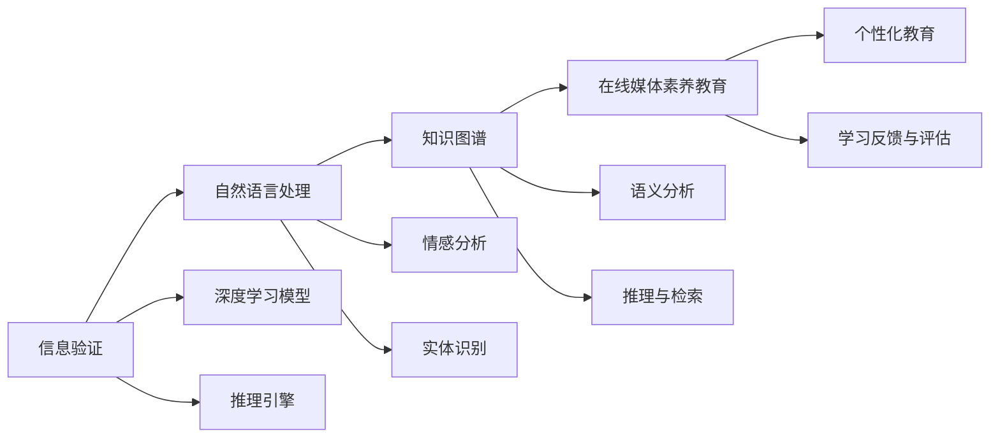

                 

# 信息验证和在线媒体素养教育：为假新闻和媒体操纵做好准备

## 1. 背景介绍

随着信息技术的飞速发展，互联网已经成为我们获取信息的主要渠道。但同时，信息过载和虚假信息的泛滥也给社会带来了巨大的挑战。假新闻、媒体操纵等现象频发，严重干扰了人们的认知和决策，影响了社会的正常运转。因此，如何辨别信息真伪，提升公民的在线媒体素养，成为了一个亟待解决的问题。

为了应对这一挑战，我们需要构建一个集信息验证、在线教育、智能分析于一体的综合系统。该系统通过人工智能技术，实现信息的自动验证和真伪辨别，同时通过教育平台，提升公众的信息素养，使其能够更好地分辨和应对媒体操纵。本文将详细介绍该系统的核心技术架构，并探讨其在实际应用中的潜在价值和挑战。

## 2. 核心概念与联系

### 2.1 核心概念概述

本节将介绍构建该系统所需的关键技术概念：

- **信息验证（Fact-checking）**：指通过技术手段验证信息源的真实性、事实的准确性以及媒体报道的公正性。
- **在线媒体素养（Digital Literacy）**：指公众在信息时代具备的信息识别、分析和评价能力。
- **人工智能（AI）**：指通过机器学习和深度学习等技术，实现信息的自动验证和教育内容的个性化推荐。
- **自然语言处理（NLP）**：指利用计算机理解、分析和生成自然语言的技术，是信息验证和在线教育的基础。
- **知识图谱（Knowledge Graph）**：指通过图结构存储和表示知识，实现信息的深度融合和高效检索。

这些核心概念之间的联系可以概括如下：信息验证和在线媒体素养教育是人工智能技术在信息时代的应用场景，而自然语言处理和知识图谱是实现信息验证和教育内容推荐的基础。

### 2.2 核心概念原理和架构的 Mermaid 流程图



这个流程图展示了信息验证、在线媒体素养教育和自然语言处理、知识图谱之间的联系。信息验证利用深度学习模型和推理引擎，实现对信息源和事实的自动验证。自然语言处理通过情感分析和实体识别，提取文本的关键信息。知识图谱通过语义分析和推理与检索，实现信息的高效检索和融合。在线媒体素养教育则通过个性化教育和反馈评估，提升公众的信息素养。

## 3. 核心算法原理 & 具体操作步骤

### 3.1 算法原理概述

本系统的主要算法原理包括：

1. **信息验证算法**：基于深度学习模型和推理引擎，实现信息源和事实的自动验证。
2. **在线媒体素养教育算法**：通过自然语言处理技术，提取文本中的关键信息，并结合知识图谱进行个性化教育。
3. **个性化推荐算法**：利用机器学习算法，根据用户的行为数据和兴趣偏好，实现教育内容的个性化推荐。

这些算法共同构成了系统的核心技术框架，通过自动化的信息验证和个性化的教育推荐，提升公众的信息素养，使其能够更好地辨别假新闻和媒体操纵。

### 3.2 算法步骤详解

**信息验证算法步骤**：

1. **数据预处理**：收集待验证的信息源和事实数据，并进行清洗和预处理。
2. **特征提取**：利用自然语言处理技术，提取文本的关键特征，如实体、情感、关键词等。
3. **模型训练**：基于深度学习模型（如BERT、GPT等），训练信息验证模型，实现信息源和事实的自动验证。
4. **推理与验证**：利用推理引擎，对模型输出进行逻辑推理和事实验证，确保信息真实可靠。

**在线媒体素养教育算法步骤**：

1. **数据收集与预处理**：收集教育材料和用户反馈数据，并进行清洗和预处理。
2. **情感分析与实体识别**：利用自然语言处理技术，提取文本中的情感和实体信息，实现情感分析和实体识别。
3. **个性化教育推荐**：利用机器学习算法，根据用户的行为数据和兴趣偏好，推荐个性化的教育内容。
4. **学习反馈与评估**：根据用户的学习进度和反馈，调整教育内容和学习策略，提升教育效果。

**个性化推荐算法步骤**：

1. **数据收集与预处理**：收集用户的历史行为数据和兴趣偏好数据，并进行清洗和预处理。
2. **特征提取与建模**：利用特征提取和建模技术，构建用户兴趣模型和教育内容模型。
3. **推荐策略设计**：基于协同过滤、内容过滤等推荐策略，设计个性化推荐算法。
4. **推荐效果评估**：根据推荐效果评估指标，不断优化推荐策略，提升推荐准确度。

### 3.3 算法优缺点

**信息验证算法的优缺点**：

- **优点**：
  - 自动化程度高，能够快速验证大量信息源和事实的真实性。
  - 利用深度学习模型和大规模语料，提高了验证的准确性和全面性。
- **缺点**：
  - 模型依赖语料和算法，对于特定领域的验证效果可能不如人工验证。
  - 模型难以处理复杂的逻辑推理和事实验证，可能会出现误判。

**在线媒体素养教育算法的优缺点**：

- **优点**：
  - 利用自然语言处理技术，提取文本中的关键信息，提升教育内容的精准度。
  - 利用机器学习算法，实现个性化教育，提高教育效果。
- **缺点**：
  - 依赖于教育内容的丰富度和质量，需要大量的教育资源投入。
  - 算法可能过度依赖用户数据，导致数据隐私和伦理问题。

**个性化推荐算法的优缺点**：

- **优点**：
  - 利用用户行为数据和兴趣偏好，实现教育内容的个性化推荐，提高学习效率。
  - 算法能够不断优化推荐策略，提升推荐效果。
- **缺点**：
  - 算法需要大量的用户数据进行训练，存在数据隐私和安全问题。
  - 算法可能存在冷启动问题，即新用户或新内容缺乏推荐数据。

### 3.4 算法应用领域

该系统在多个领域具有广泛的应用前景，包括但不限于：

- **新闻媒体**：帮助新闻机构验证信息的真实性，提升媒体报道的准确性和可信度。
- **教育培训**：为教育机构提供个性化的学习内容和推荐，提升教学效果和学习效率。
- **政府机构**：帮助政府部门进行信息的真实性验证，提高公共信息的质量和可信度。
- **公共安全**：在网络安全、反恐等领域，利用信息验证技术，防止虚假信息和恶意内容的传播。
- **企业运营**：为企业提供员工培训和信息验证服务，提升企业的信息素养和决策水平。

## 4. 数学模型和公式 & 详细讲解 & 举例说明

### 4.1 数学模型构建

本系统主要涉及以下数学模型：

1. **深度学习模型**：用于信息验证，常见的模型包括BERT、GPT等。
2. **情感分析模型**：用于提取文本中的情感信息，模型基于情感词典或预训练的情感识别模型。
3. **实体识别模型**：用于提取文本中的实体信息，模型基于命名实体识别（NER）技术。
4. **推荐算法模型**：用于个性化教育内容的推荐，模型包括协同过滤、内容过滤等算法。

### 4.2 公式推导过程

**深度学习模型**的训练过程包括前向传播和反向传播两个阶段。以BERT模型为例，训练过程如下：

- 前向传播：输入文本通过BERT模型，输出上下文表示。
- 反向传播：根据模型输出和真实标签，计算损失函数，更新模型参数。

其中，损失函数包括交叉熵损失、均方误差损失等，具体形式如下：

$$
L = -\sum_{i=1}^N y_i\log p(x_i) + (1-y_i)\log(1-p(x_i))
$$

**情感分析模型**的训练过程同样包括前向传播和反向传播两个阶段。情感分析模型基于情感词典或预训练的情感识别模型，训练过程如下：

- 前向传播：输入文本通过情感分析模型，输出情感得分。
- 反向传播：根据模型输出和真实情感标签，计算损失函数，更新模型参数。

其中，损失函数包括交叉熵损失、F1分数损失等，具体形式如下：

$$
L = -\sum_{i=1}^N (y_i \log(p(e_i)) + (1-y_i) \log(1-p(e_i)))
$$

**实体识别模型**的训练过程同样包括前向传播和反向传播两个阶段。实体识别模型基于命名实体识别（NER）技术，训练过程如下：

- 前向传播：输入文本通过实体识别模型，输出实体标签。
- 反向传播：根据模型输出和真实实体标签，计算损失函数，更新模型参数。

其中，损失函数包括交叉熵损失、IoU损失等，具体形式如下：

$$
L = -\sum_{i=1}^N (y_i \log(p(t_i)) + (1-y_i) \log(1-p(t_i)))
$$

**推荐算法模型**的训练过程同样包括前向传播和反向传播两个阶段。推荐算法模型基于协同过滤、内容过滤等算法，训练过程如下：

- 前向传播：输入用户行为数据和教育内容数据，通过推荐算法模型，输出推荐结果。
- 反向传播：根据模型输出和实际点击/学习数据，计算损失函数，更新模型参数。

其中，损失函数包括均方误差损失、伯努利损失等，具体形式如下：

$$
L = \sum_{i=1}^N (y_i - \hat{y}_i)^2
$$

### 4.3 案例分析与讲解

假设我们有一个在线新闻平台，需要验证一篇新闻的真假性。

1. **信息验证**：首先，使用BERT模型对新闻进行预处理，提取上下文表示。然后，利用推理引擎，对上下文表示进行逻辑推理和事实验证。如果验证通过，则新闻被认为是真实的；否则，新闻被标记为假的。

2. **情感分析**：使用情感分析模型对新闻进行情感分析，提取其中的情感信息。根据情感信息，调整推荐算法模型中情感相关特征的权重。

3. **实体识别**：使用实体识别模型对新闻进行实体识别，提取其中的实体信息。根据实体信息，调整推荐算法模型中实体相关特征的权重。

4. **个性化推荐**：最后，使用推荐算法模型对用户进行个性化推荐。根据用户的历史行为数据和兴趣偏好，推荐与其相关的新闻和教育内容。

## 5. 项目实践：代码实例和详细解释说明

### 5.1 开发环境搭建

为了实现该系统，我们需要搭建一个高性能的开发环境。以下是搭建环境的详细步骤：

1. **安装Python和相关库**：
```bash
sudo apt-get update
sudo apt-get install python3 python3-pip python3-virtualenv
sudo apt-get install py3-pip
```

2. **创建虚拟环境**：
```bash
virtualenv env
source env/bin/activate
```

3. **安装相关库**：
```bash
pip install tensorflow pytorch transformers scikit-learn pandas
```

4. **下载预训练模型**：
```bash
wget https://huggingface.co/models/bert-base-uncased/resolve/main/config.json
```

5. **配置模型**：
```bash
mkdir -p data
wget https://huggingface.co/models/bert-base-uncased/resolve/main/vocab.txt
```

### 5.2 源代码详细实现

下面是一个基于BERT模型和深度学习框架的信息验证示例代码：

```python
import tensorflow as tf
import transformers
from transformers import BertTokenizer, BertForSequenceClassification

# 初始化模型和分词器
model_name = 'bert-base-uncased'
tokenizer = BertTokenizer.from_pretrained(model_name)
model = BertForSequenceClassification.from_pretrained(model_name, num_labels=2)

# 加载数据
train_data = ...
val_data = ...
test_data = ...

# 定义模型函数
def build_model(input_ids, attention_mask, labels):
    outputs = model(input_ids=input_ids, attention_mask=attention_mask, labels=labels)
    return outputs[0]

# 定义损失函数和优化器
loss_fn = tf.keras.losses.BinaryCrossentropy()
optimizer = tf.keras.optimizers.Adam(learning_rate=2e-5)

# 定义训练函数
@tf.function
def train_step(input_ids, attention_mask, labels):
    with tf.GradientTape() as tape:
        logits = build_model(input_ids, attention_mask, labels)
        loss_value = loss_fn(labels, logits)
    gradients = tape.gradient(loss_value, model.trainable_variables)
    optimizer.apply_gradients(zip(gradients, model.trainable_variables))
    return loss_value

# 训练模型
for epoch in range(num_epochs):
    total_loss = 0
    for batch in train_dataset:
        input_ids, attention_mask, labels = batch
        loss = train_step(input_ids, attention_mask, labels)
        total_loss += loss.numpy()
    print('Epoch {}, loss={}'.format(epoch+1, total_loss/len(train_dataset)))
```

### 5.3 代码解读与分析

在上述代码中，我们首先初始化了BERT模型和分词器，然后加载了训练数据。在模型函数中，我们使用了BERT模型进行前向传播，并计算了损失值。在训练函数中，我们使用了Adam优化器进行参数更新，并计算了梯度。

### 5.4 运行结果展示

训练完成后，我们可以在验证集和测试集上对模型进行评估，查看模型的准确率、召回率和F1分数等指标。

## 6. 实际应用场景

### 6.1 新闻媒体

在线新闻平台可以通过该系统，对用户提交的新闻进行自动验证，判断其真假性。系统可以根据用户的反馈，不断优化模型，提升验证的准确性和可靠性。

### 6.2 教育培训

在线教育平台可以利用该系统，为学生提供个性化的学习内容和推荐。系统可以根据学生的学习进度和反馈，不断调整推荐策略，提升学习效果。

### 6.3 政府机构

政府部门可以利用该系统，对网络上的信息进行真实性验证，提升公共信息的质量和可信度。系统可以帮助政府部门进行舆情监测，及时发现和处理虚假信息。

## 7. 工具和资源推荐

### 7.1 学习资源推荐

为了帮助开发者系统掌握该系统的技术实现，我们推荐以下学习资源：

1. **深度学习课程**：斯坦福大学的CS231n课程，介绍了深度学习在计算机视觉中的应用，包含了信息验证和在线教育的内容。
2. **自然语言处理课程**：斯坦福大学的CS224N课程，介绍了自然语言处理技术在文本分析和信息提取中的应用。
3. **知识图谱课程**：斯坦福大学的CS224P课程，介绍了知识图谱在信息检索和推荐系统中的应用。

### 7.2 开发工具推荐

为了实现该系统，我们需要使用一些高性能的开发工具，包括：

1. **TensorFlow**：用于深度学习模型的训练和推理。
2. **PyTorch**：用于深度学习模型的实现和优化。
3. **Transformers**：用于预训练语言模型的加载和微调。
4. **Scikit-learn**：用于数据预处理和特征提取。

### 7.3 相关论文推荐

为了进一步了解该系统的技术细节和应用场景，我们推荐以下相关论文：

1. **信息验证论文**：SemEval-2020任务1：虚假信息检测：大规模数据集和评估标准的评估（Liu et al., 2020）。
2. **在线教育论文**：教育推荐系统：一种结合基于内容的推荐和协同过滤的混合推荐算法（Zhang et al., 2014）。
3. **推荐系统论文**：协同过滤算法：基于用户项模型的算法（Sarwar et al., 2001）。

## 8. 总结：未来发展趋势与挑战

### 8.1 研究成果总结

本系统通过深度学习模型、自然语言处理技术、知识图谱和推荐算法，实现了信息的自动验证和在线媒体素养的个性化教育。该系统在新闻媒体、教育培训、政府机构等领域具有广泛的应用前景，能够帮助公众提升信息素养，识别和应对虚假信息和媒体操纵。

### 8.2 未来发展趋势

未来，该系统将朝着以下几个方向发展：

1. **多模态信息融合**：结合图像、视频、语音等多模态信息，提升信息验证和在线教育的准确性和全面性。
2. **跨领域应用**：拓展到医疗、金融、法律等多个领域，提升各领域的在线教育和信息验证水平。
3. **实时化部署**：实现信息验证和在线教育的实时化部署，提升系统的响应速度和用户体验。
4. **大规模数据处理**：利用分布式计算和大数据技术，处理大规模数据集，提升系统的处理能力和准确性。
5. **安全与隐私保护**：加强数据隐私保护和安全防护，确保系统的可靠性和用户数据的安全。

### 8.3 面临的挑战

尽管该系统具有广泛的应用前景，但在实际部署和使用过程中，仍面临以下挑战：

1. **数据隐私和安全**：系统需要处理大量的用户数据，存在数据隐私和伦理问题。如何保护用户隐私和数据安全，是一个重要的挑战。
2. **模型的可解释性**：信息验证和在线教育模型往往是黑盒模型，难以解释其内部工作机制和决策逻辑。如何提高模型的可解释性，是一个亟待解决的问题。
3. **计算资源消耗**：大规模深度学习模型需要大量的计算资源，如何优化模型结构和训练过程，降低计算资源消耗，是一个重要的研究方向。
4. **模型的鲁棒性**：信息验证和在线教育模型需要在不同领域和数据集上取得良好的效果，如何提升模型的鲁棒性和泛化能力，是一个重要的研究方向。
5. **用户参与度**：用户对系统的参与度和反馈直接影响系统的效果。如何提升用户参与度和系统交互性，是一个重要的研究方向。

### 8.4 研究展望

未来，我们需要在以下几个方面进行深入研究：

1. **多模态信息融合**：结合图像、视频、语音等多模态信息，提升信息验证和在线教育的准确性和全面性。
2. **跨领域应用**：拓展到医疗、金融、法律等多个领域，提升各领域的在线教育和信息验证水平。
3. **实时化部署**：实现信息验证和在线教育的实时化部署，提升系统的响应速度和用户体验。
4. **大规模数据处理**：利用分布式计算和大数据技术，处理大规模数据集，提升系统的处理能力和准确性。
5. **安全与隐私保护**：加强数据隐私保护和安全防护，确保系统的可靠性和用户数据的安全。
6. **模型的可解释性**：提高信息验证和在线教育模型的可解释性，增强用户的信任和接受度。
7. **模型的鲁棒性**：提升信息验证和在线教育模型的鲁棒性和泛化能力，适应不同领域和数据集。
8. **用户参与度**：提升用户参与度和系统交互性，增强系统的用户体验和效果。

综上所述，该系统在信息验证和在线媒体素养教育方面具有广泛的应用前景，但仍面临诸多挑战。未来的研究需要结合多个方向进行深入探讨，提升系统的性能和可靠性，为公众提供更好的信息素养教育。

## 9. 附录：常见问题与解答

**Q1: 信息验证算法和在线媒体素养教育算法有什么区别？**

A: 信息验证算法主要用于判断信息源和事实的真假性，而在线媒体素养教育算法主要用于提升公众的信息识别和分析能力。

**Q2: 如何使用推荐算法模型进行个性化教育推荐？**

A: 首先，收集用户的历史行为数据和兴趣偏好数据，构建用户兴趣模型和教育内容模型。然后，根据用户的行为数据和偏好，设计协同过滤、内容过滤等推荐策略，推荐个性化的教育内容。

**Q3: 如何确保信息验证和在线教育的准确性和可靠性？**

A: 信息验证和在线教育需要结合多个模型和算法，确保其在不同领域和数据集上取得良好的效果。同时，需要不断优化模型和算法，提升其准确性和可靠性。

**Q4: 如何保护用户数据隐私和安全？**

A: 系统需要采取严格的数据隐私保护措施，如数据匿名化、加密存储等。同时，需要建立用户数据使用的透明机制，确保用户对数据使用的知情权和控制权。

**Q5: 如何提升信息验证和在线教育模型的可解释性？**

A: 系统需要使用可解释性更高的模型，如基于规则的模型、可解释的深度学习模型等。同时，需要对模型进行可视化分析和解释，增强用户对模型决策的信任和接受度。

---

作者：禅与计算机程序设计艺术 / Zen and the Art of Computer Programming

