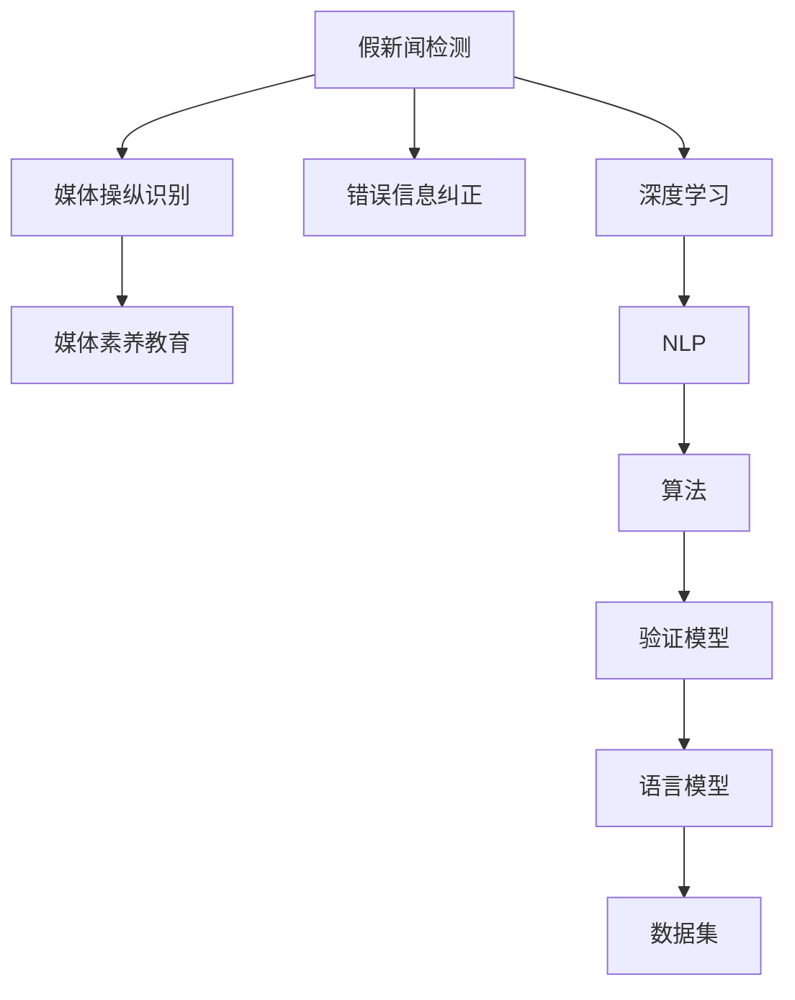

                 

# 信息验证和媒体素养教育：为假新闻、媒体操纵和错误信息时代做好准备

> 关键词：信息验证, 媒体素养教育, 假新闻, 媒体操纵, 错误信息, 深度学习, 自然语言处理, 算法, 验证模型, 语言模型, 数据集, 深度分析

## 1. 背景介绍

### 1.1 问题由来

在信息爆炸的时代，假新闻、媒体操纵和错误信息如病毒般迅速传播，对社会造成了极大的负面影响。从2020年新冠疫情的不实信息，到美国大选期间的政治抹黑，再到全球气候变化议题上的误导性报道，信息验证和媒体素养教育已经成为确保公众获取真实信息的重要手段。

### 1.2 问题核心关键点

信息验证和媒体素养教育的核心在于提升公众对假新闻、媒体操纵和错误信息的识别能力，保护社会免受虚假信息的侵害。其关键点包括：
- 假新闻检测：自动识别和标记出新闻中的虚假信息和误导性报道。
- 媒体操纵识别：区分媒体的正常报道和带有偏见或误导性的报道。
- 错误信息纠正：提供真实、准确的信息，矫正公众认知偏差。
- 教育普及：通过教育提高公众的信息素养，使其能够独立分析和评估信息源的真实性。

### 1.3 问题研究意义

信息验证和媒体素养教育的意义在于：
- 保障公众获取真实信息：在信息泛滥的时代，有效识别假新闻和错误信息，保护公众不被误导。
- 提升社会认知水平：通过媒体素养教育，提高公众的逻辑思维和信息判断能力。
- 促进信息透明：推动媒体机构加强新闻伦理建设，提升报道的准确性和可信度。
- 维护社会稳定：防止假新闻和错误信息引发社会恐慌和混乱，保护社会稳定。

## 2. 核心概念与联系

### 2.1 核心概念概述

为更好地理解信息验证和媒体素养教育，本节将介绍几个关键概念：

- **假新闻检测**：利用计算机算法自动识别并标记出新闻中的虚假信息和误导性报道。
- **媒体操纵识别**：分析媒体报道中的偏见和误导性内容，揭示其背后的操纵意图。
- **错误信息纠正**：提供经过验证的真实信息，以矫正公众认知偏差。
- **媒体素养教育**：通过教育和培训，提升公众的信息识别和分析能力。

- **深度学习**：一种基于神经网络的学习范式，能够处理大规模复杂数据。
- **自然语言处理**：利用计算机处理和理解自然语言的技术，是信息验证的基础。
- **算法**：在信息验证中，常用的算法包括分类、回归、序列预测等。
- **验证模型**：用于评估新闻报道真实性的模型，通常基于自然语言处理技术。
- **语言模型**：能够理解和生成自然语言的模型，是信息验证的关键。
- **数据集**：信息验证和媒体素养教育中常用的数据集，包括假新闻、真新闻、媒体报道等。

这些核心概念之间的逻辑关系可以通过以下Mermaid流程图来展示：



这个流程图展示了大规模信息验证和媒体素养教育的关键组件及其之间的关系：

1. 假新闻检测是媒体素养教育的起点，帮助公众理解假新闻的特征。
2. 媒体操纵识别揭示了媒体报道的偏见和误导性，进一步提升公众的媒体素养。
3. 错误信息纠正提供了真实可靠的信息，矫正公众认知偏差。
4. 深度学习、自然语言处理、算法和语言模型是信息验证和媒体素养教育的基础技术。
5. 数据集是训练和验证这些模型的基础，确保模型的准确性和可靠性。

## 3. 核心算法原理 & 具体操作步骤
### 3.1 算法原理概述

信息验证和媒体素养教育的核心算法主要基于深度学习和自然语言处理技术，其核心思想是利用计算机算法自动识别和标记出新闻中的虚假信息和误导性报道。

假新闻检测通常分为两个阶段：首先，使用预训练的自然语言处理模型（如BERT、GPT等）对新闻文本进行预处理，提取文本特征；其次，使用分类算法（如支持向量机、随机森林、神经网络等）对文本特征进行分类，判断新闻的真实性。

媒体操纵识别主要通过分析新闻文本中的情感倾向、事实准确性、引用来源和修辞手法等特征，识别出带有偏见或误导性的报道。

错误信息纠正则通过提供经过验证的真实信息，矫正公众的认知偏差。这通常需要构建知识图谱或专家系统，以提供权威可靠的信息来源。

媒体素养教育则是通过教育手段，提升公众的信息识别和分析能力。这包括教授信息评估技巧、批判性思维和媒体伦理等内容。

### 3.2 算法步骤详解

信息验证和媒体素养教育的实施步骤主要包括：

**Step 1: 数据收集与预处理**
- 收集假新闻、真新闻和媒体报道等数据，构建数据集。
- 对文本数据进行清洗和预处理，如去除停用词、标点符号等。
- 使用预训练的自然语言处理模型对文本进行分词、词向量表示等预处理。

**Step 2: 特征提取**
- 利用预训练的语言模型（如BERT、GPT等）对文本进行特征提取，生成文本向量。
- 使用TF-IDF、词袋模型等传统方法对文本特征进行提取。

**Step 3: 模型训练**
- 选择适合的分类算法（如支持向量机、随机森林、神经网络等），使用数据集进行模型训练。
- 使用交叉验证等技术评估模型的性能。

**Step 4: 验证与部署**
- 使用测试集验证模型的准确性和可靠性。
- 将训练好的模型部署到实际应用场景中，进行信息验证和媒体素养教育。

**Step 5: 效果评估**
- 定期评估模型的效果，收集用户反馈，进行模型优化。
- 对教育效果进行评估，调整教育策略。

### 3.3 算法优缺点

信息验证和媒体素养教育的核心算法具有以下优点：
- 自动化高效：利用深度学习等技术，能够高效自动化地进行信息验证。
- 可扩展性强：算法适用于大规模数据集和复杂任务。
- 实时性：通过模型预测和自动标记，能够实时进行信息验证。

同时，该方法也存在一些局限性：
- 数据依赖：模型的性能高度依赖于数据的质量和多样性。
- 模型复杂：深度学习模型的训练和推理计算量大，需要高性能硬件支持。
- 可解释性差：深度学习模型通常被视为"黑盒"，难以解释其决策过程。
- 偏差风险：模型可能学习到数据中的偏见，影响其公平性和可靠性。

尽管存在这些局限性，但信息验证和媒体素养教育的算法仍是大规模信息筛选和媒体素养提升的有效手段。未来相关研究将继续优化算法，提升模型的准确性和可靠性。

### 3.4 算法应用领域

信息验证和媒体素养教育技术已经在多个领域得到应用，包括但不限于：

- **新闻业**：帮助媒体机构识别和纠正假新闻和错误信息，提升报道的准确性和可信度。
- **教育系统**：通过媒体素养教育，提升学生的信息评估和批判性思维能力。
- **政府和公共机构**：用于信息透明和政策宣传，确保公众获取准确可靠的信息。
- **企业和社会组织**：提升品牌形象和公众信任度，增强信息传播的可靠性。

## 4. 数学模型和公式 & 详细讲解 & 举例说明
### 4.1 数学模型构建

信息验证和媒体素养教育的核心算法主要涉及自然语言处理和深度学习技术。这里我们使用BERT模型作为示例，构建假新闻检测的数学模型。

假新闻检测的数学模型可以表示为：

$$
\hat{y} = \text{sigmoid}(\mathbf{W} [\mathbf{V}(\text{BERT}(\text{input}))] + \mathbf{b})
$$

其中：
- $\hat{y}$ 为新闻真实性的预测值，取值范围为 $[0,1]$。
- $\text{sigmoid}$ 为sigmoid函数，将预测值映射到 $[0,1]$ 区间。
- $\mathbf{W}$ 和 $\mathbf{b}$ 为可训练的权重和偏置。
- $\mathbf{V}(\text{BERT}(\text{input}))$ 为BERT模型输出的文本向量表示。
- $\text{input}$ 为新闻文本的输入。

### 4.2 公式推导过程

假新闻检测的详细推导过程如下：

**Step 1: 文本编码**
- 使用BERT模型对新闻文本进行编码，生成文本向量 $\mathbf{V}(\text{BERT}(\text{input}))$。
- 假设BERT模型输出为 $\mathbf{V} \in \mathbb{R}^d$，其中 $d$ 为向量维度。

**Step 2: 特征映射**
- 使用线性变换 $\mathbf{W} \in \mathbb{R}^{d \times 1}$ 和偏置 $\mathbf{b} \in \mathbb{R}^1$，将文本向量映射为标量值。
- 假设线性映射的输出为 $\mathbf{Z} = \mathbf{V}^\top \mathbf{W} + \mathbf{b}$，其中 $\mathbf{Z} \in \mathbb{R}$。

**Step 3: 分类预测**
- 使用sigmoid函数将映射结果 $\mathbf{Z}$ 映射到 $[0,1]$ 区间。
- 假设sigmoid函数的输出为 $\hat{y} = \sigma(\mathbf{Z})$，其中 $\sigma$ 为sigmoid函数。

### 4.3 案例分析与讲解

假新闻检测的案例分析如下：

**Case 1: 新冠疫情假新闻检测**
- 使用预训练的BERT模型对新闻文本进行编码。
- 将编码结果输入上述模型，得到预测值 $\hat{y}$。
- 如果 $\hat{y} \geq 0.5$，则标记为真新闻；否则标记为假新闻。

**Case 2: 美国大选假新闻检测**
- 收集真实报道和假新闻文本。
- 使用BERT模型对新闻文本进行编码。
- 将编码结果输入上述模型，得到预测值 $\hat{y}$。
- 如果 $\hat{y} \geq 0.5$，则标记为真新闻；否则标记为假新闻。

## 5. 项目实践：代码实例和详细解释说明
### 5.1 开发环境搭建

在进行信息验证和媒体素养教育实践前，我们需要准备好开发环境。以下是使用Python进行PyTorch开发的环境配置流程：

1. 安装Anaconda：从官网下载并安装Anaconda，用于创建独立的Python环境。

2. 创建并激活虚拟环境：
```bash
conda create -n info-verification python=3.8 
conda activate info-verification
```

3. 安装PyTorch：根据CUDA版本，从官网获取对应的安装命令。例如：
```bash
conda install pytorch torchvision torchaudio cudatoolkit=11.1 -c pytorch -c conda-forge
```

4. 安装Transformers库：
```bash
pip install transformers
```

5. 安装各类工具包：
```bash
pip install numpy pandas scikit-learn matplotlib tqdm jupyter notebook ipython
```

完成上述步骤后，即可在`info-verification`环境中开始实践。

### 5.2 源代码详细实现

这里我们以假新闻检测为例，给出使用Transformers库对BERT模型进行训练的PyTorch代码实现。

首先，定义假新闻检测的数据处理函数：

```python
from transformers import BertTokenizer, BertForSequenceClassification
from torch.utils.data import Dataset, DataLoader
import torch
import torch.nn.functional as F

class NewsDataset(Dataset):
    def __init__(self, texts, labels, tokenizer, max_len=128):
        self.texts = texts
        self.labels = labels
        self.tokenizer = tokenizer
        self.max_len = max_len
        
    def __len__(self):
        return len(self.texts)
    
    def __getitem__(self, item):
        text = self.texts[item]
        label = self.labels[item]
        
        encoding = self.tokenizer(text, return_tensors='pt', max_length=self.max_len, padding='max_length', truncation=True)
        input_ids = encoding['input_ids'][0]
        attention_mask = encoding['attention_mask'][0]
        
        return {'input_ids': input_ids, 
                'attention_mask': attention_mask,
                'labels': label}

# 定义标签与id的映射
label2id = {'fake': 0, 'real': 1}
id2label = {v: k for k, v in label2id.items()}

# 创建dataset
tokenizer = BertTokenizer.from_pretrained('bert-base-cased')

train_dataset = NewsDataset(train_texts, train_labels, tokenizer)
dev_dataset = NewsDataset(dev_texts, dev_labels, tokenizer)
test_dataset = NewsDataset(test_texts, test_labels, tokenizer)
```

然后，定义模型和优化器：

```python
from transformers import AdamW

model = BertForSequenceClassification.from_pretrained('bert-base-cased', num_labels=2)

optimizer = AdamW(model.parameters(), lr=2e-5)
```

接着，定义训练和评估函数：

```python
from tqdm import tqdm

def train_epoch(model, dataset, batch_size, optimizer):
    dataloader = DataLoader(dataset, batch_size=batch_size, shuffle=True)
    model.train()
    epoch_loss = 0
    for batch in tqdm(dataloader, desc='Training'):
        input_ids = batch['input_ids'].to(device)
        attention_mask = batch['attention_mask'].to(device)
        labels = batch['labels'].to(device)
        model.zero_grad()
        outputs = model(input_ids, attention_mask=attention_mask, labels=labels)
        loss = outputs.loss
        epoch_loss += loss.item()
        loss.backward()
        optimizer.step()
    return epoch_loss / len(dataloader)

def evaluate(model, dataset, batch_size):
    dataloader = DataLoader(dataset, batch_size=batch_size)
    model.eval()
    preds, labels = [], []
    with torch.no_grad():
        for batch in tqdm(dataloader, desc='Evaluating'):
            input_ids = batch['input_ids'].to(device)
            attention_mask = batch['attention_mask'].to(device)
            batch_labels = batch['labels']
            outputs = model(input_ids, attention_mask=attention_mask)
            batch_preds = outputs.logits.argmax(dim=2).to('cpu').tolist()
            batch_labels = batch_labels.to('cpu').tolist()
            for pred, label in zip(batch_preds, batch_labels):
                preds.append(pred[0])
                labels.append(label[0])
                
    print('Accuracy: %.2f%%' % (sum(preds == labels) / len(labels) * 100))
```

最后，启动训练流程并在测试集上评估：

```python
epochs = 5
batch_size = 16

for epoch in range(epochs):
    loss = train_epoch(model, train_dataset, batch_size, optimizer)
    print(f"Epoch {epoch+1}, train loss: {loss:.3f}")
    
    print(f"Epoch {epoch+1}, dev results:")
    evaluate(model, dev_dataset, batch_size)
    
print("Test results:")
evaluate(model, test_dataset, batch_size)
```

以上就是使用PyTorch对BERT进行假新闻检测的完整代码实现。可以看到，得益于Transformers库的强大封装，我们可以用相对简洁的代码完成BERT模型的加载和微调。

### 5.3 代码解读与分析

让我们再详细解读一下关键代码的实现细节：

**NewsDataset类**：
- `__init__`方法：初始化文本、标签、分词器等关键组件。
- `__len__`方法：返回数据集的样本数量。
- `__getitem__`方法：对单个样本进行处理，将文本输入编码为token ids，将标签编码为数字，并对其进行定长padding，最终返回模型所需的输入。

**label2id和id2label字典**：
- 定义了标签与数字id之间的映射关系，用于将预测结果解码回真实标签。

**训练和评估函数**：
- 使用PyTorch的DataLoader对数据集进行批次化加载，供模型训练和推理使用。
- 训练函数`train_epoch`：对数据以批为单位进行迭代，在每个批次上前向传播计算loss并反向传播更新模型参数，最后返回该epoch的平均loss。
- 评估函数`evaluate`：与训练类似，不同点在于不更新模型参数，并在每个batch结束后将预测和标签结果存储下来，最后使用Accuracy计算模型的准确率。

**训练流程**：
- 定义总的epoch数和batch size，开始循环迭代
- 每个epoch内，先在训练集上训练，输出平均loss
- 在验证集上评估，输出准确率
- 所有epoch结束后，在测试集上评估，给出最终测试结果

可以看到，PyTorch配合Transformers库使得BERT微调的代码实现变得简洁高效。开发者可以将更多精力放在数据处理、模型改进等高层逻辑上，而不必过多关注底层的实现细节。

当然，工业级的系统实现还需考虑更多因素，如模型的保存和部署、超参数的自动搜索、更灵活的任务适配层等。但核心的微调范式基本与此类似。

## 6. 实际应用场景
### 6.1 新闻业

假新闻检测在新闻业中的应用非常广泛。传统新闻机构往往需要耗费大量人力进行信息验证，效率低下且容易出错。通过使用假新闻检测技术，新闻机构可以自动标记和过滤假新闻，提升报道的准确性和可信度。

在技术实现上，可以收集真实报道和假新闻文本，构建数据集。使用BERT等预训练语言模型进行特征提取，并通过分类算法进行模型训练和验证。训练好的模型可以部署在新闻网站或新闻APP中，实时进行新闻文本的验证和标注。

### 6.2 教育系统

信息验证和媒体素养教育在教育系统中的应用主要通过媒体素养课程实现。通过教授学生假新闻识别、媒体伦理等知识，提高学生的媒体素养和信息评估能力。

在具体实践中，学校可以邀请专家讲授信息验证和媒体素养课程，或使用在线教育平台提供相关课程。学生通过在线课程学习，掌握信息验证的基本技能和方法。此外，学校还可以通过作业、测验等形式检验学生的学习效果。

### 6.3 政府和公共机构

政府和公共机构在信息透明和政策宣传方面面临巨大挑战。假新闻和错误信息的传播，会引发公众恐慌和社会动荡。通过信息验证和媒体素养教育，政府和公共机构可以提升信息传播的可靠性和可信度，避免误导性报道。

具体应用包括：
- 构建权威的新闻发布平台，确保信息来源的真实性。
- 培训信息传播人员，提升其信息验证和媒体素养。
- 开展公众媒体素养教育，提高公众的信息识别和评估能力。

### 6.4 企业和社会组织

企业和社会组织在品牌形象和公众信任方面非常重视。假新闻和错误信息的传播，会对企业品牌和公众信任造成严重损害。通过信息验证和媒体素养教育，企业和社会组织可以提升信息传播的准确性和可信度，增强品牌形象和公众信任度。

具体应用包括：
- 构建企业新闻发布平台，确保新闻的真实性和准确性。
- 培训公关人员，提升其信息验证和媒体素养。
- 开展公众媒体素养教育，提升公众对企业信息的信任度。

## 7. 工具和资源推荐
### 7.1 学习资源推荐

为了帮助开发者系统掌握信息验证和媒体素养教育的技术基础和实践技巧，这里推荐一些优质的学习资源：

1. 《深度学习》课程：斯坦福大学开设的深度学习课程，涵盖深度学习的基本概念和算法。
2. 《自然语言处理基础》课程：清华大学开设的自然语言处理课程，介绍自然语言处理的基本原理和技术。
3. 《信息验证和媒体素养教育》书籍：详细介绍了信息验证和媒体素养教育的基本理论和实践方法。
4. 《Transformers库官方文档》：Transformers库的官方文档，提供了预训练语言模型的完整使用方法。
5. 《媒体素养教育资源库》：提供丰富的媒体素养教育资源，包括课程、讲座、教学工具等。

通过对这些资源的学习实践，相信你一定能够快速掌握信息验证和媒体素养教育的技术基础，并用于解决实际的信息筛选和媒体素养提升问题。
###  7.2 开发工具推荐

高效的开发离不开优秀的工具支持。以下是几款用于信息验证和媒体素养教育开发的常用工具：

1. PyTorch：基于Python的开源深度学习框架，灵活动态的计算图，适合快速迭代研究。大部分预训练语言模型都有PyTorch版本的实现。

2. TensorFlow：由Google主导开发的开源深度学习框架，生产部署方便，适合大规模工程应用。同样有丰富的预训练语言模型资源。

3. Transformers库：HuggingFace开发的NLP工具库，集成了众多SOTA语言模型，支持PyTorch和TensorFlow，是进行信息验证和媒体素养教育开发的利器。

4. Weights & Biases：模型训练的实验跟踪工具，可以记录和可视化模型训练过程中的各项指标，方便对比和调优。与主流深度学习框架无缝集成。

5. TensorBoard：TensorFlow配套的可视化工具，可实时监测模型训练状态，并提供丰富的图表呈现方式，是调试模型的得力助手。

6. Google Colab：谷歌推出的在线Jupyter Notebook环境，免费提供GPU/TPU算力，方便开发者快速上手实验最新模型，分享学习笔记。

合理利用这些工具，可以显著提升信息验证和媒体素养教育任务的开发效率，加快创新迭代的步伐。

### 7.3 相关论文推荐

信息验证和媒体素养教育的发展源于学界的持续研究。以下是几篇奠基性的相关论文，推荐阅读：

1. Fake News Detection in Social Media: An Interdisciplinary Approach：综合考虑社会心理学和机器学习的视角，提出多维度信息验证方法。
2. Media Literacy in the Age of Social Media：分析社交媒体时代媒体素养教育的挑战和机遇，提出教育策略。
3. Combating Fake News Using Deep Learning：介绍基于深度学习的信息验证技术，并进行实验验证。
4. Multimodal Fake News Detection with BERT and XLNet：利用多模态信息提升假新闻检测的准确性和鲁棒性。
5. Media Literacy Education: A Critical Perspective：探讨媒体素养教育的关键问题，如信息伦理、批判性思维等。

这些论文代表了大规模信息验证和媒体素养教育的发展脉络。通过学习这些前沿成果，可以帮助研究者把握学科前进方向，激发更多的创新灵感。

## 8. 总结：未来发展趋势与挑战

### 8.1 总结

本文对信息验证和媒体素养教育进行了全面系统的介绍。首先阐述了假新闻检测、媒体操纵识别、错误信息纠正和媒体素养教育的核心概念及其之间的联系。其次，从原理到实践，详细讲解了信息验证和媒体素养教育的数学模型和核心算法，给出了完整的代码实例。最后，探讨了信息验证和媒体素养教育在新闻业、教育系统、政府和公共机构、企业和社会组织等多个领域的应用场景。

通过本文的系统梳理，可以看到，信息验证和媒体素养教育技术已经在多个领域得到应用，提升了公众的信息素养和媒体机构的报道可信度。未来，伴随深度学习等技术的不断发展，信息验证和媒体素养教育将具备更加强大的能力，成为保障公众获取真实信息的重要手段。

### 8.2 未来发展趋势

信息验证和媒体素养教育的发展趋势如下：

1. 模型规模不断增大：随着算力成本的下降和数据规模的扩张，深度学习模型的参数量将持续增长，提升模型的泛化能力和鲁棒性。

2. 多模态融合：信息验证和媒体素养教育将更多地融合视觉、听觉等非文本信息，提升模型对多模态数据的理解和验证能力。

3. 动态验证：随着数据分布的变化，信息验证模型需要具备动态学习和适应新数据的能力，防止模型过时。

4. 伦理道德考量：信息验证和媒体素养教育需要更加注重模型的伦理导向，确保其公平性和可信度。

5. 自动化和智能化：借助自动化技术，提升信息验证和媒体素养教育的效率和效果，减少人工干预。

### 8.3 面临的挑战

尽管信息验证和媒体素养教育技术已经取得了显著进展，但在迈向更加智能化、普适化应用的过程中，仍面临诸多挑战：

1. 数据质量：模型的性能高度依赖于数据的质量和多样性，如何获取和处理高质量的训练数据，是信息验证和媒体素养教育的关键挑战之一。

2. 模型鲁棒性：信息验证模型需要具备强大的鲁棒性，能够应对不同场景和形式的信息验证任务。

3. 资源消耗：深度学习模型的训练和推理计算量大，需要高性能硬件支持，如何优化资源消耗，提升模型效率，是信息验证和媒体素养教育面临的重要挑战。

4. 公平性问题：信息验证和媒体素养教育模型需要保证公平性，避免对特定群体或信息源的偏见。

5. 用户接受度：如何提升用户对信息验证和媒体素养教育技术的接受度和使用率，也是当前亟待解决的问题。

### 8.4 研究展望

面对信息验证和媒体素养教育所面临的诸多挑战，未来的研究需要在以下几个方面寻求新的突破：

1. 数据增强和迁移学习：通过数据增强和迁移学习，提升模型的泛化能力和鲁棒性。

2. 多模态融合和跨领域迁移：利用多模态融合技术，提升模型对多模态数据的理解和验证能力。

3. 模型压缩和优化：通过模型压缩和优化技术，减小模型规模，提升模型效率。

4. 公平性和伦理道德：研究如何构建公平、可信的信息验证和媒体素养教育模型，确保其伦理导向。

5. 自动化和智能化：借助自动化技术，提升信息验证和媒体素养教育的效率和效果，减少人工干预。

6. 用户教育和技术普及：通过教育和技术普及，提升公众对信息验证和媒体素养教育技术的接受度和使用率。

这些研究方向的探索，必将引领信息验证和媒体素养教育技术迈向更高的台阶，为构建信息透明和媒体素养的社会奠定基础。面向未来，信息验证和媒体素养教育技术还需要与其他人工智能技术进行更深入的融合，如知识表示、因果推理、强化学习等，多路径协同发力，共同推动自然语言理解和智能交互系统的进步。只有勇于创新、敢于突破，才能不断拓展信息验证和媒体素养教育技术的边界，让信息验证和媒体素养教育更好地造福人类社会。

## 9. 附录：常见问题与解答

**Q1：信息验证和媒体素养教育技术是否适用于所有领域？**

A: 信息验证和媒体素养教育技术适用于大多数领域，特别是在信息传播、新闻报道、公众教育等方面。然而，对于一些特定领域的任务，如医学、法律等，仅仅依靠通用语料预训练的模型可能难以很好地适应。此时需要在特定领域语料上进一步预训练，再进行微调，才能获得理想效果。

**Q2：如何缓解信息验证和媒体素养教育中的过拟合问题？**

A: 过拟合是信息验证和媒体素养教育中的常见问题，尤其是在标注数据不足的情况下。常见的缓解策略包括：
1. 数据增强：通过回译、近义替换等方式扩充训练集。
2. 正则化：使用L2正则、Dropout、Early Stopping等避免过拟合。
3. 对抗训练：引入对抗样本，提高模型鲁棒性。
4. 参数高效微调：只调整少量参数(如Adapter、Prefix等)，减小过拟合风险。
5. 多模型集成：训练多个信息验证模型，取平均输出，抑制过拟合。

这些策略往往需要根据具体任务和数据特点进行灵活组合。只有在数据、模型、训练、推理等各环节进行全面优化，才能最大限度地发挥信息验证和媒体素养教育技术的威力。

**Q3：信息验证和媒体素养教育中的数据集应该如何构建？**

A: 信息验证和媒体素养教育中的数据集构建需要考虑以下几个方面：
1. 数据多样性：收集不同来源、不同形式的信息，涵盖真实新闻、假新闻、误导性报道等。
2. 数据质量：确保数据来源可靠，避免低质量、误导性的数据。
3. 数据标注：对数据进行准确的标注，确保标注的准确性和一致性。
4. 数据平衡：确保数据集中各类信息的分布平衡，避免数据失衡导致模型偏见。
5. 数据更新：定期更新数据集，确保其时效性和适应性。

通过构建高质量、多样化的数据集，可以提升信息验证和媒体素养教育模型的性能和鲁棒性，增强其信息识别和评估能力。

**Q4：如何提高信息验证和媒体素养教育模型的公平性？**

A: 信息验证和媒体素养教育模型的公平性问题，可以通过以下几个方面进行提升：
1. 数据公平：确保数据集中的各类信息分布平衡，避免数据失衡导致模型偏见。
2. 模型设计：采用公平性约束的模型设计，如对抗训练、公平性修正等。
3. 算法透明：提升模型的可解释性，确保其决策过程透明和公平。
4. 定期评估：定期评估模型的公平性，发现并纠正模型的偏见。
5. 伦理约束：在模型设计和评估过程中引入伦理导向，确保模型符合社会价值观。

通过以上措施，可以有效提升信息验证和媒体素养教育模型的公平性和可信度，确保其公平对待不同来源和形式的信息。

**Q5：信息验证和媒体素养教育技术在实际应用中应注意哪些问题？**

A: 信息验证和媒体素养教育技术在实际应用中，应注意以下几个问题：
1. 数据来源：确保数据来源可靠，避免低质量、误导性的数据。
2. 数据标注：对数据进行准确的标注，确保标注的准确性和一致性。
3. 模型公平：确保模型的公平性，避免对特定群体或信息源的偏见。
4. 模型效率：优化模型结构和训练策略，提升模型的推理效率和准确性。
5. 用户接受度：通过教育和宣传，提升用户对信息验证和媒体素养教育技术的接受度和使用率。

信息验证和媒体素养教育技术在实际应用中，需要综合考虑数据、模型、用户等多个因素，确保其有效性和实用性。只有通过持续优化和创新，才能真正实现信息验证和媒体素养教育技术的落地应用。

---

作者：禅与计算机程序设计艺术 / Zen and the Art of Computer Programming

