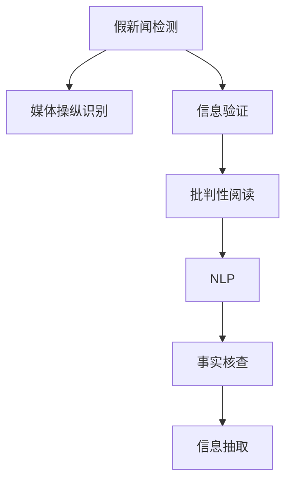

                 

# 信息验证和批判性阅读指南：在假新闻和媒体操纵的时代导航

> 关键词：假新闻检测, 媒体操纵, 信息验证, 批判性阅读, 自然语言处理(NLP), 事实核查, 自动化工具

## 1. 背景介绍

### 1.1 问题由来

在信息爆炸的时代，社交媒体、新闻网站、博客等数字化平台上充斥着海量信息。然而，其中不乏大量假新闻、错误信息、误导性内容以及媒体操纵。这些信息不仅误导公众，还可能对个人和社会产生严重负面影响。据统计，假新闻在2016年美国总统选举中的影响力达到了75%，而这种状况在2020年总统选举中更加严峻。

面对信息泛滥和假新闻泛滥的现状，如何识别和验证信息的真伪，成为社会各界普遍关注的焦点。人们对于假新闻和媒体操纵的担忧日益加剧，对信息验证和批判性阅读的需求愈发迫切。特别是在新闻、政治、医疗、金融等关键领域，信息验证和批判性阅读成为决策制定的重要工具。

### 1.2 问题核心关键点

要有效识别和验证信息，需要掌握一系列的科学方法和工具。这一过程涉及多个层次的技术应用，包括自然语言处理(NLP)、机器学习、事实核查、信息抽取等。核心关键点包括：

1. **自然语言处理**：通过语言模型理解和分析文本，提取关键信息。
2. **机器学习**：利用数据训练分类模型，自动识别和标注信息。
3. **事实核查**：验证信息的真实性，区分事实与虚构。
4. **信息抽取**：从文本中提取结构化数据，支持自动化验证。

本文旨在通过深入剖析这些关键技术，提供全面的信息验证和批判性阅读指南，帮助用户在假新闻和媒体操纵的海洋中准确导航。

## 2. 核心概念与联系

### 2.1 核心概念概述

在假新闻和信息验证领域，涉及多个核心概念，它们之间的关系紧密，共同构成了一个完整的验证体系。

- **假新闻检测**：使用NLP和机器学习技术，自动识别和标记假新闻，区分事实与虚构。
- **媒体操纵识别**：通过数据分析和可视化，揭示媒体操纵的策略和手段，包括偏见、选择性报道、误导性信息等。
- **信息验证**：结合自动化工具和人工核查，确保信息的真实性和可靠性，增强信任。
- **批判性阅读**：训练批判性思维，评估信息的来源、背景和准确性，形成独立判断。
- **自然语言处理(NLP)**：利用语言模型和深度学习，解析和理解文本内容。
- **事实核查**：通过手动核查和自动验证，验证信息的准确性，区分可靠信息与不可靠信息。
- **信息抽取**：从文本中提取出结构化数据，辅助信息验证和自动化工具。

这些核心概念之间的逻辑关系可以通过以下Mermaid流程图来展示：



这个流程图展示了各个核心概念之间的逻辑关系：

1. 假新闻检测通过语言模型和分类器自动识别假新闻。
2. 媒体操纵识别揭示媒体中的偏见和误导性内容。
3. 信息验证结合自动化工具和人工核查确保信息真实性。
4. 批判性阅读训练用户独立判断和分析信息。
5. NLP解析和理解文本内容，辅助信息验证。
6. 事实核查手动核查信息准确性，区分事实与虚构。
7. 信息抽取从文本中提取结构化数据，支持自动化验证。

这些概念共同构成了一个系统的信息验证和批判性阅读框架，帮助用户有效导航信息海洋。

## 3. 核心算法原理 & 具体操作步骤
### 3.1 算法原理概述

基于监督学习的假新闻检测和媒体操纵识别，是通过大量标注数据训练分类器，自动识别假新闻和媒体操纵内容的过程。核心算法包括：

1. **特征提取**：通过NLP技术，从文本中提取关键词、词频、情感极性等特征。
2. **分类模型**：使用逻辑回归、支持向量机、神经网络等模型，对特征进行分类，标记为假新闻或媒体操纵。
3. **交叉验证**：使用交叉验证技术，评估模型的性能，避免过拟合。

信息验证则通过事实核查和自动化工具，结合专家知识，对信息进行真实性验证。关键算法包括：

1. **事实核查算法**：使用自然语言处理技术，自动搜索和验证事实信息。
2. **自动化工具**：使用数据挖掘和机器学习技术，自动识别和标记错误信息。
3. **专家知识库**：结合人类专家的知识和经验，进行人工验证。

批判性阅读训练用户识别信息来源、背景和准确性，其算法包括：

1. **信息素养教育**：通过课程和培训，提升用户的信息素养和批判性思维能力。
2. **媒体素养教育**：教育用户识别媒体偏见和误导性内容，培养独立判断能力。

### 3.2 算法步骤详解

#### 假新闻检测的算法步骤：

1. **数据收集**：收集假新闻和真实新闻的文本数据，进行标注。
2. **特征提取**：使用NLP技术，提取文本中的关键词、词频、情感极性等特征。
3. **模型训练**：选择适当的分类模型（如逻辑回归、SVM、神经网络），使用标注数据进行训练。
4. **交叉验证**：使用交叉验证评估模型性能，选择最优模型。
5. **模型评估**：使用测试集评估模型准确性，记录误差率、精确率和召回率等指标。

#### 信息验证的算法步骤：

1. **数据收集**：收集待验证的信息，包括新闻、文章、言论等。
2. **事实核查**：使用NLP技术，自动搜索和验证事实信息。
3. **自动化工具**：使用数据挖掘和机器学习技术，自动识别和标记错误信息。
4. **专家验证**：结合专家知识和经验，进行人工验证。
5. **结果整合**：将自动化工具和人工验证结果整合，形成最终验证结果。

#### 批判性阅读的算法步骤：

1. **课程培训**：提供信息素养和媒体素养教育，提升用户批判性思维能力。
2. **工具支持**：开发批判性阅读工具，辅助用户识别和分析信息。
3. **实践练习**：通过实际案例练习，提升用户的信息验证和批判性阅读能力。
4. **反馈改进**：收集用户反馈，不断改进培训课程和工具。

### 3.3 算法优缺点

假新闻检测和媒体操纵识别的优点包括：

1. **自动化高效率**：通过自动化工具，快速识别和标记大量信息。
2. **覆盖范围广**：能够处理大规模文本数据，适用于各种信息源。
3. **降低成本**：减少人工核查和验证的复杂度和成本。

缺点包括：

1. **准确率有限**：自动化工具可能存在误判，需结合人工验证。
2. **依赖标注数据**：假新闻检测和媒体操纵识别依赖大量标注数据，标注成本高。
3. **领域局限**：通用模型可能对特定领域的假新闻识别效果有限。

信息验证的优点包括：

1. **高准确率**：结合自动化工具和人工验证，提高验证准确性。
2. **多样化方法**：使用多种技术手段，增强验证效果。
3. **灵活性**：适用于各种信息类型，如新闻、文章、言论等。

缺点包括：

1. **成本高**：人工验证和专家核查成本较高。
2. **时间延迟**：自动化工具和人工验证可能存在时间延迟，影响实时性。
3. **技术难度**：需要较高的技术水平和专业知识。

批判性阅读的优点包括：

1. **培养独立判断**：通过教育提升用户的信息素养和批判性思维能力。
2. **提升分析能力**：训练用户识别信息来源、背景和准确性。
3. **增强用户信心**：培养用户对信息的独立判断和分析能力，增强信任。

缺点包括：

1. **时间和资源成本**：需要大量时间和资源进行课程培训和实践练习。
2. **依赖用户自主性**：用户需具备一定的信息素养和批判性思维能力。
3. **教育效果有限**：部分用户可能无法完全理解和应用培训内容。

### 3.4 算法应用领域

假新闻检测和媒体操纵识别在多个领域都有广泛应用：

1. **新闻媒体**：用于新闻机构的假新闻检测和媒体操纵识别，确保新闻报道的真实性。
2. **社交媒体**：用于社交平台上的内容审查，防止假新闻和恶意信息的传播。
3. **政治领域**：用于政治竞选中的信息验证，防止误导性信息的传播。
4. **医疗健康**：用于医疗信息的真实性验证，确保健康信息的安全性和可靠性。
5. **金融市场**：用于金融信息的真实性验证，防止虚假信息的误导。

信息验证在多个领域也有重要应用：

1. **法律司法**：用于法庭上的信息验证，确保证据的真实性和可靠性。
2. **科学研究**：用于科学论文的真实性验证，防止学术不端行为。
3. **公共政策**：用于政策信息的真实性验证，防止虚假信息的误导。
4. **商业市场**：用于市场信息的真实性验证，防止欺诈行为。

批判性阅读在教育、媒体、社交等领域也有广泛应用：

1. **教育培训**：用于学校和企业的信息素养和媒体素养教育。
2. **新闻媒体**：用于媒体机构的新闻事实核查和信息验证。
3. **社交平台**：用于社交平台上的信息筛选和内容审核。

这些领域的应用展示了假新闻检测、媒体操纵识别、信息验证和批判性阅读的重要性，其在信息时代中的作用愈发凸显。

## 4. 数学模型和公式 & 详细讲解 & 举例说明

### 4.1 数学模型构建

假新闻检测和媒体操纵识别的数学模型构建，主要基于文本分类任务。假设输入文本为 $x$，输出标签为 $y$（假新闻或真实新闻），模型为 $M_{\theta}$，其中 $\theta$ 为模型参数。则文本分类的损失函数为：

$$
\mathcal{L}(\theta) = -\sum_{i=1}^N y_i \log M_{\theta}(x_i)
$$

其中 $N$ 为样本数，$y_i \in \{0,1\}$ 为标注标签，$M_{\theta}(x_i)$ 为模型在输入 $x_i$ 上的输出概率。

### 4.2 公式推导过程

以逻辑回归模型为例，假设输入文本 $x$ 经过特征提取后得到特征向量 $f(x)$，则逻辑回归模型的输出概率为：

$$
M_{\theta}(x) = \sigma(\theta^T f(x))
$$

其中 $\sigma$ 为sigmoid函数，$\theta^T$ 为模型参数矩阵。则逻辑回归模型的损失函数为：

$$
\mathcal{L}(\theta) = -\frac{1}{N} \sum_{i=1}^N y_i \log \sigma(\theta^T f(x_i)) + (1-y_i) \log (1-\sigma(\theta^T f(x_i)))
$$

通过梯度下降等优化算法，不断更新模型参数 $\theta$，最小化损失函数 $\mathcal{L}$，使得模型输出逼近真实标签。

### 4.3 案例分析与讲解

以假新闻检测为例，使用逻辑回归模型对假新闻进行分类。假设训练数据集为 $D=\{(x_i, y_i)\}_{i=1}^N$，其中 $x_i$ 为新闻文本，$y_i \in \{0,1\}$ 为标注标签。训练过程如下：

1. **数据准备**：收集假新闻和真实新闻的文本数据，进行标注。
2. **特征提取**：使用NLP技术，提取文本中的关键词、词频、情感极性等特征。
3. **模型训练**：选择逻辑回归模型，使用标注数据进行训练。
4. **模型评估**：使用测试集评估模型准确性，记录误差率、精确率和召回率等指标。

假新闻检测的关键在于特征提取和模型选择。常用的特征提取方法包括：

- **词袋模型**：将文本转换为词频向量，提取关键词和词频。
- **TF-IDF**：基于词频和逆文档频率，提取文本特征。
- **情感分析**：使用情感词典或情感分类器，提取文本的情感极性。
- **主题模型**：使用LDA或LSA等主题模型，提取文本主题。

模型选择方面，常用的分类器包括：

- **逻辑回归**：简单易用，适用于二分类任务。
- **支持向量机**：适用于高维特征空间，准确性高。
- **神经网络**：适用于复杂非线性分类任务，效果较好。
- **随机森林**：适用于大规模数据集，鲁棒性好。

## 5. 项目实践：代码实例和详细解释说明

### 5.1 开发环境搭建

在进行项目实践前，需要先准备好开发环境。以下是使用Python进行PyTorch开发的环境配置流程：

1. 安装Anaconda：从官网下载并安装Anaconda，用于创建独立的Python环境。

2. 创建并激活虚拟环境：
```bash
conda create -n pytorch-env python=3.8 
conda activate pytorch-env
```

3. 安装PyTorch：根据CUDA版本，从官网获取对应的安装命令。例如：
```bash
conda install pytorch torchvision torchaudio cudatoolkit=11.1 -c pytorch -c conda-forge
```

4. 安装Transformers库：
```bash
pip install transformers
```

5. 安装各类工具包：
```bash
pip install numpy pandas scikit-learn matplotlib tqdm jupyter notebook ipython
```

完成上述步骤后，即可在`pytorch-env`环境中开始项目实践。

### 5.2 源代码详细实现

下面我们以假新闻检测为例，给出使用Transformers库对BERT模型进行假新闻检测的PyTorch代码实现。

首先，定义假新闻检测任务的数据处理函数：

```python
from transformers import BertTokenizer
from torch.utils.data import Dataset
import torch

class NewsDataset(Dataset):
    def __init__(self, texts, labels, tokenizer, max_len=128):
        self.texts = texts
        self.labels = labels
        self.tokenizer = tokenizer
        self.max_len = max_len
        
    def __len__(self):
        return len(self.texts)
    
    def __getitem__(self, item):
        text = self.texts[item]
        label = self.labels[item]
        
        encoding = self.tokenizer(text, return_tensors='pt', max_length=self.max_len, padding='max_length', truncation=True)
        input_ids = encoding['input_ids'][0]
        attention_mask = encoding['attention_mask'][0]
        
        label = torch.tensor(label, dtype=torch.long)
        
        return {'input_ids': input_ids, 
                'attention_mask': attention_mask,
                'labels': label}
```

然后，定义模型和优化器：

```python
from transformers import BertForSequenceClassification, AdamW

model = BertForSequenceClassification.from_pretrained('bert-base-uncased', num_labels=2)

optimizer = AdamW(model.parameters(), lr=2e-5)
```

接着，定义训练和评估函数：

```python
from torch.utils.data import DataLoader
from tqdm import tqdm
from sklearn.metrics import classification_report

device = torch.device('cuda') if torch.cuda.is_available() else torch.device('cpu')
model.to(device)

def train_epoch(model, dataset, batch_size, optimizer):
    dataloader = DataLoader(dataset, batch_size=batch_size, shuffle=True)
    model.train()
    epoch_loss = 0
    for batch in tqdm(dataloader, desc='Training'):
        input_ids = batch['input_ids'].to(device)
        attention_mask = batch['attention_mask'].to(device)
        labels = batch['labels'].to(device)
        model.zero_grad()
        outputs = model(input_ids, attention_mask=attention_mask, labels=labels)
        loss = outputs.loss
        epoch_loss += loss.item()
        loss.backward()
        optimizer.step()
    return epoch_loss / len(dataloader)

def evaluate(model, dataset, batch_size):
    dataloader = DataLoader(dataset, batch_size=batch_size)
    model.eval()
    preds, labels = [], []
    with torch.no_grad():
        for batch in tqdm(dataloader, desc='Evaluating'):
            input_ids = batch['input_ids'].to(device)
            attention_mask = batch['attention_mask'].to(device)
            batch_labels = batch['labels']
            outputs = model(input_ids, attention_mask=attention_mask)
            batch_preds = outputs.logits.argmax(dim=2).to('cpu').tolist()
            batch_labels = batch_labels.to('cpu').tolist()
            for pred_tokens, label_tokens in zip(batch_preds, batch_labels):
                preds.append(pred_tokens)
                labels.append(label_tokens)
                
    print(classification_report(labels, preds))
```

最后，启动训练流程并在测试集上评估：

```python
epochs = 5
batch_size = 16

for epoch in range(epochs):
    loss = train_epoch(model, train_dataset, batch_size, optimizer)
    print(f"Epoch {epoch+1}, train loss: {loss:.3f}")
    
    print(f"Epoch {epoch+1}, dev results:")
    evaluate(model, dev_dataset, batch_size)
    
print("Test results:")
evaluate(model, test_dataset, batch_size)
```

以上就是使用PyTorch对BERT进行假新闻检测的完整代码实现。可以看到，得益于Transformers库的强大封装，我们可以用相对简洁的代码完成BERT模型的加载和微调。

### 5.3 代码解读与分析

让我们再详细解读一下关键代码的实现细节：

**NewsDataset类**：
- `__init__`方法：初始化文本、标签、分词器等关键组件。
- `__len__`方法：返回数据集的样本数量。
- `__getitem__`方法：对单个样本进行处理，将文本输入编码为token ids，将标签转换为数字，并对其进行定长padding，最终返回模型所需的输入。

**训练和评估函数**：
- 使用PyTorch的DataLoader对数据集进行批次化加载，供模型训练和推理使用。
- 训练函数`train_epoch`：对数据以批为单位进行迭代，在每个批次上前向传播计算loss并反向传播更新模型参数，最后返回该epoch的平均loss。
- 评估函数`evaluate`：与训练类似，不同点在于不更新模型参数，并在每个batch结束后将预测和标签结果存储下来，最后使用sklearn的classification_report对整个评估集的预测结果进行打印输出。

**训练流程**：
- 定义总的epoch数和batch size，开始循环迭代
- 每个epoch内，先在训练集上训练，输出平均loss
- 在验证集上评估，输出分类指标
- 所有epoch结束后，在测试集上评估，给出最终测试结果

可以看到，PyTorch配合Transformers库使得BERT假新闻检测的代码实现变得简洁高效。开发者可以将更多精力放在数据处理、模型改进等高层逻辑上，而不必过多关注底层的实现细节。

当然，工业级的系统实现还需考虑更多因素，如模型的保存和部署、超参数的自动搜索、更灵活的任务适配层等。但核心的假新闻检测范式基本与此类似。

## 6. 实际应用场景

### 6.1 新闻媒体

假新闻检测在新闻媒体领域具有重要应用。传统的新闻媒体机构往往面临大量信息的筛选和核查任务，难以全面覆盖，容易出现误报和漏报。使用假新闻检测模型，可以快速识别和标记假新闻，提升新闻报道的准确性和可靠性。

在技术实现上，可以收集新闻机构的报道数据，将真实新闻和假新闻分别标注，在此基础上对预训练模型进行微调。微调后的模型能够自动识别假新闻，并打上标记，由人工进行审核确认。对于被标记的假新闻，可以进一步进行深度分析，查找误导性信息来源和传播途径，防范假新闻的扩散。

### 6.2 社交平台

社交平台上的信息量巨大，用户生成内容(UGC)真假难辨。使用假新闻检测模型，可以有效筛查和标记假新闻，提升平台的信任度和用户体验。

在技术实现上，可以收集平台上的热门帖子和热门评论，将真实帖子和假帖子分别标注。训练假新闻检测模型，用于实时监控帖子和评论，自动标记假新闻。对于被标记的假新闻，可以手动审核并进行删除，避免误判。

### 6.3 政府和公共机构

政府和公共机构需要处理大量信息，确保信息准确可靠。使用假新闻检测模型，可以有效筛查和标记假新闻，防止信息被误导和滥用。

在技术实现上，可以收集政府和公共机构发布的信息，将真实信息和假信息分别标注。训练假新闻检测模型，用于政府和公共机构的日常信息审查。对于被标记的假信息，进行人工审核并采取相应措施，避免误导公众和决策失误。

### 6.4 未来应用展望

未来，假新闻检测和媒体操纵识别的应用将进一步扩展，带来更广泛的行业应用和更深刻的行业影响：

1. **金融市场**：用于金融信息验证，防止虚假信息和市场操纵。
2. **医疗健康**：用于医疗信息的真实性验证，确保健康信息的准确性。
3. **科研领域**：用于学术论文和实验结果的真实性验证，防止学术不端行为。
4. **商业应用**：用于广告和营销信息的真实性验证，防止欺诈和误导。
5. **社会治理**：用于公共政策和社会事件的真实性验证，防止谣言和假消息的传播。

这些应用展示了假新闻检测和媒体操纵识别的广泛价值，将在多个领域带来深刻的变革。随着技术的不断进步，假新闻检测和媒体操纵识别将变得更加智能和高效，进一步提升社会信任度和信息安全性。

## 7. 工具和资源推荐
### 7.1 学习资源推荐

为了帮助开发者系统掌握假新闻检测和媒体操纵识别的理论基础和实践技巧，这里推荐一些优质的学习资源：

1. **《深度学习实战：用Python进行NLP项目开发》**：详细介绍了NLP技术的基本原理和实践技巧，包括假新闻检测和媒体操纵识别。

2. **Coursera《自然语言处理》课程**：斯坦福大学开设的NLP经典课程，讲解NLP的基础知识和前沿技术，包括假新闻检测和媒体操纵识别。

3. **Kaggle《假新闻检测》比赛**：参与假新闻检测竞赛，通过实战提升假新闻检测技能。

4. **NewsGuard平台**：全球领先的假新闻检测平台，提供开源假新闻检测工具和算法。

5. **Snopes网站**：权威的假新闻检测网站，提供大量假新闻案例和分析。

通过对这些资源的学习实践，相信你一定能够快速掌握假新闻检测和媒体操纵识别的精髓，并用于解决实际的NLP问题。

### 7.2 开发工具推荐

高效的开发离不开优秀的工具支持。以下是几款用于假新闻检测和媒体操纵识别开发的常用工具：

1. **PyTorch**：基于Python的开源深度学习框架，灵活动态的计算图，适合快速迭代研究。大部分预训练语言模型都有PyTorch版本的实现。

2. **TensorFlow**：由Google主导开发的开源深度学习框架，生产部署方便，适合大规模工程应用。同样有丰富的预训练语言模型资源。

3. **Transformers库**：HuggingFace开发的NLP工具库，集成了众多SOTA语言模型，支持PyTorch和TensorFlow，是进行假新闻检测任务开发的利器。

4. **Weights & Biases**：模型训练的实验跟踪工具，可以记录和可视化模型训练过程中的各项指标，方便对比和调优。与主流深度学习框架无缝集成。

5. **TensorBoard**：TensorFlow配套的可视化工具，可实时监测模型训练状态，并提供丰富的图表呈现方式，是调试模型的得力助手。

6. **Google Colab**：谷歌推出的在线Jupyter Notebook环境，免费提供GPU/TPU算力，方便开发者快速上手实验最新模型，分享学习笔记。

合理利用这些工具，可以显著提升假新闻检测和媒体操纵识别的开发效率，加快创新迭代的步伐。

### 7.3 相关论文推荐

假新闻检测和媒体操纵识别的发展源于学界的持续研究。以下是几篇奠基性的相关论文，推荐阅读：

1. **Snopes事实核查技术**：Snopes网站提供的事实核查技术，用于验证信息的真实性。

2. **Fact-Checking in the Age of Artificial Intelligence**：关于人工智能在事实核查中的应用的综述论文。

3. **News Verification through Fact Checking and Machine Learning**：使用机器学习技术进行假新闻检测的论文。

4. **A Survey on Fact Checking in the Internet Era**：对互联网时代事实核查的综述论文。

5. **Machine Learning Approaches for Fake News Detection**：综述机器学习在假新闻检测中的应用。

这些论文代表了大语言模型微调技术的发展脉络。通过学习这些前沿成果，可以帮助研究者把握学科前进方向，激发更多的创新灵感。

## 8. 总结：未来发展趋势与挑战

### 8.1 总结

本文对假新闻检测和媒体操纵识别进行了全面系统的介绍。首先阐述了假新闻和媒体操纵问题的背景和重要性，明确了假新闻检测和媒体操纵识别在信息时代中的关键作用。其次，从原理到实践，详细讲解了假新闻检测和媒体操纵识别的数学模型和算法步骤，给出了假新闻检测任务开发的完整代码实例。同时，本文还广泛探讨了假新闻检测和媒体操纵识别的应用场景，展示了其在新闻媒体、社交平台、政府机构等领域的广泛价值。此外，本文精选了假新闻检测和媒体操纵识别的学习资源，力求为读者提供全方位的技术指引。

通过本文的系统梳理，可以看到，假新闻检测和媒体操纵识别在多个领域都具有重要应用，能有效提升信息验证和批判性阅读能力，防止假新闻的传播。受益于NLP技术和机器学习技术的不断发展，假新闻检测和媒体操纵识别的方法将变得更加智能和高效，为信息时代的用户提供更可靠的信息来源。

### 8.2 未来发展趋势

展望未来，假新闻检测和媒体操纵识别的技术将呈现以下几个发展趋势：

1. **模型规模持续增大**：随着算力成本的下降和数据规模的扩张，假新闻检测和媒体操纵识别的预训练模型参数量将进一步增长，模型学习能力和泛化能力将进一步提升。

2. **数据来源多样化**：假新闻检测和媒体操纵识别的数据来源将更加多样化，包括社交媒体、新闻网站、论坛、博客等，覆盖更广泛的信息源。

3. **模型性能提升**：假新闻检测和媒体操纵识别将采用更先进的算法和模型结构，提升模型的准确性和鲁棒性，减少误判和漏判。

4. **跨领域应用拓展**：假新闻检测和媒体操纵识别将拓展到更多领域，如金融、医疗、科研等，提供更全面的信息验证服务。

5. **自动化和智能化**：假新闻检测和媒体操纵识别将更加自动化和智能化，结合自然语言处理和机器学习技术，提升信息验证的效率和准确性。

6. **跨模态信息融合**：假新闻检测和媒体操纵识别将融合多种信息模态，如文本、图像、视频等，提升对多模态信息的理解和验证能力。

以上趋势凸显了假新闻检测和媒体操纵识别的广阔前景。这些方向的探索发展，必将进一步提升信息验证和批判性阅读的能力，为构建安全、可靠、可控的智能系统铺平道路。

### 8.3 面临的挑战

尽管假新闻检测和媒体操纵识别已经取得了显著进展，但在迈向更加智能化、普适化应用的过程中，它仍面临着诸多挑战：

1. **标注数据不足**：假新闻检测和媒体操纵识别依赖大量标注数据，标注成本高且难以覆盖所有信息源。如何降低标注成本，提升标注质量，是未来研究的重要方向。

2. **模型鲁棒性不足**：现有模型面对新类型和形态的假新闻时，泛化性能有限，容易误判。如何提高模型的鲁棒性，避免灾难性遗忘，还需要更多理论和实践的积累。

3. **隐私保护问题**：假新闻检测和媒体操纵识别需要大量用户生成内容，存在隐私保护问题。如何保护用户隐私，平衡信息验证和隐私保护，将是重要的研究课题。

4. **法律和伦理问题**：假新闻检测和媒体操纵识别可能涉及法律和伦理问题，如版权、隐私权等。如何在合法合规的前提下进行信息验证，确保技术应用的安全性，也将是重要的研究课题。

5. **技术普及问题**：假新闻检测和媒体操纵识别的技术复杂度高，如何简化技术，降低技术门槛，推广普及，还需要更多教育和培训工作。

6. **技术边界问题**：假新闻检测和媒体操纵识别是否能够完全区分假新闻和真实新闻，存在技术边界问题。如何设定合理的技术边界，避免误判，将是重要的研究方向。

这些挑战需要学界和产业界共同努力，从技术、法律、伦理等多个层面协同推进，才能实现假新闻检测和媒体操纵识别的广泛应用和长期发展。

### 8.4 研究展望

面对假新闻检测和媒体操纵识别所面临的挑战，未来的研究需要在以下几个方面寻求新的突破：

1. **无监督学习和半监督学习**：探索无需大量标注数据的假新闻检测和媒体操纵识别方法，利用自监督学习和半监督学习技术，最大程度利用非结构化数据。

2. **多模态信息融合**：融合视觉、音频等多种信息模态，提升对假新闻的识别能力，实现跨模态信息验证。

3. **跨领域迁移学习**：将假新闻检测和媒体操纵识别的模型应用到更多领域，提升模型的泛化能力。

4. **自动化和智能化**：开发更加自动化和智能化的假新闻检测和媒体操纵识别工具，提升用户的使用体验和验证效率。

5. **隐私保护技术**：结合隐私保护技术，保护用户隐私，平衡信息验证和隐私保护。

6. **跨模态事实核查**：融合多种信息模态，实现跨模态的事实核查和验证。

7. **法律和伦理规范**：制定相关的法律和伦理规范，确保技术应用的安全性和合法性。

这些研究方向将进一步推动假新闻检测和媒体操纵识别的技术进步，为构建安全、可靠、可控的智能系统提供有力支持。

## 9. 附录：常见问题与解答

**Q1：假新闻检测是否适用于所有信息源？**

A: 假新闻检测在大多数信息源上都能取得不错的效果，特别是对于文本信息。但对于图像、视频、音频等非文本信息，需要结合其他技术手段，如计算机视觉、音频处理等。

**Q2：假新闻检测的准确率是否受数据质量影响？**

A: 假新闻检测的准确率很大程度上依赖于训练数据的质量。标注数据越丰富、标注质量越高，模型效果越好。因此，在数据采集和标注过程中，需要确保数据的多样性和标注的准确性。

**Q3：假新闻检测是否需要大量计算资源？**

A: 假新闻检测需要一定的计算资源，特别是在大规模模型训练和优化过程中。但随着模型压缩和优化技术的发展，计算资源的需求也在逐渐降低。

**Q4：假新闻检测如何应对新兴的假新闻类型？**

A: 假新闻检测需要不断更新模型和算法，以应对新兴的假新闻类型。可以通过增量学习、迁移学习等方法，更新模型参数和特征，提升模型的泛化能力。

**Q5：假新闻检测能否完全避免误判？**

A: 假新闻检测并不能完全避免误判，但可以通过模型优化和多样化验证手段，显著减少误判率。结合人工审核和用户反馈，进一步提升检测效果。

通过本文的系统梳理，可以看到，假新闻检测和媒体操纵识别在信息时代中的重要性，其技术的发展和应用将带来广泛的社会影响。未来，随着技术不断进步，假新闻检测和媒体操纵识别将变得更加智能和高效，为构建安全、可靠、可控的智能系统提供有力支持。

