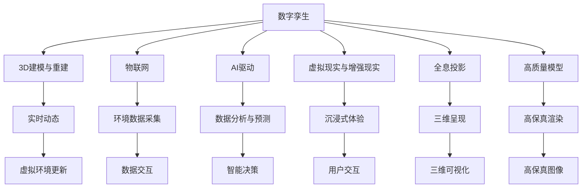

                 

# 元宇宙中的数字孪生:现实世界的完美映射

> 关键词：元宇宙,数字孪生,现实世界的完美映射,3D重建,实时动态,虚拟现实(VR),增强现实(AR),物联网(IoT),AI驱动,全息投影,高质量模型

## 1. 背景介绍

### 1.1 问题由来

随着技术的快速发展和互联网用户的广泛普及，虚拟现实(VR)、增强现实(AR)等技术已经逐渐渗透到我们的日常生活和工作中，成为不可分割的一部分。但与此同时，传统数字建模和仿真技术仍然无法满足元宇宙场景中对于现实世界的高度还原和实时动态的要求。

元宇宙是一个虚拟的、沉浸式的、基于实时交互的在线平台，旨在将现实世界数字化并映射到一个虚拟空间中。它包含了虚拟现实、增强现实、物联网、人工智能等多个前沿技术领域，是一个集数字内容、社交互动、经济系统、实时动态、高保真渲染于一身的综合生态系统。

为了在元宇宙中实现现实世界的完美映射，数字孪生技术应运而生。数字孪生是通过3D建模、实时动态仿真、物联网、人工智能等技术，将现实世界的物理对象、环境、事件和过程数字化并映射到虚拟空间中，实现虚拟空间与现实世界的双向互动和高度融合。

### 1.2 问题核心关键点

数字孪生技术在元宇宙中的应用，主要聚焦于以下几个关键点：

1. **3D重建**：使用先进的三维扫描技术和3D建模技术，对现实世界中的物体和场景进行高保真重建，生成高质量的3D模型。
2. **实时动态**：通过物联网设备实时采集现实世界中的环境数据，如温度、湿度、光照等，并动态更新虚拟空间中的虚拟环境，保持与现实世界的同步。
3. **虚拟现实(VR)与增强现实(AR)**：将虚拟空间与现实世界进行无缝融合，为用户提供身临其境的体验。
4. **AI驱动**：利用人工智能技术，如深度学习、计算机视觉等，对虚拟空间中的数据进行分析和预测，提升虚拟场景的智能性和交互性。
5. **全息投影**：使用全息投影技术，将虚拟对象以三维形式呈现在用户的面前，增强用户的沉浸感。
6. **高质量模型**：采用高精度的3D模型和渲染技术，确保虚拟空间中的图像和场景高度接近现实世界。

这些核心技术点共同构成了数字孪生技术在元宇宙中的应用基础，使得元宇宙中的数字孪生成为现实世界的高保真、实时动态映射。

### 1.3 问题研究意义

研究数字孪生技术在元宇宙中的应用，对于构建一个高度逼真的虚拟世界具有重要意义：

1. **提升用户体验**：通过数字孪生技术，将现实世界中的复杂物理对象和环境数字化，用户可以随时随地在虚拟世界中探索和体验，提升互动性和沉浸感。
2. **优化资源管理**：数字孪生技术可以实时监控和分析现实世界中的资源状态，优化资源分配和管理，提升生产效率。
3. **促进科学研究和教育**：虚拟空间可以模拟现实世界中的各种极端环境和灾难场景，提供安全可控的实验环境，支持科学研究和教育培训。
4. **推动经济发展**：元宇宙中的数字孪生技术能够促进新产业的孕育和现有产业的转型升级，推动数字经济的发展。

## 2. 核心概念与联系

### 2.1 核心概念概述

为更好地理解数字孪生技术在元宇宙中的应用，本节将介绍几个密切相关的核心概念：

- **数字孪生(Digital Twin)**：是指通过数字技术，构建一个与现实世界完全一致的虚拟模型，用于模拟、预测和优化现实世界的各种过程和行为。
- **元宇宙(Metaverse)**：是一个由虚拟现实、增强现实、人工智能、物联网等技术构建的虚拟空间，旨在提供一个全息、沉浸式的数字化虚拟世界。
- **3D建模与重建(3D Modeling and Reconstruction)**：通过3D扫描技术和建模软件，对现实世界中的物体和场景进行高保真重建，生成高质量的3D模型。
- **物联网(IoT)**：是指通过传感器、智能设备等技术，将现实世界中的各种物体和环境数字化，实现实时数据采集和动态仿真。
- **AI驱动**：利用人工智能技术，对虚拟空间中的数据进行分析和预测，提升虚拟场景的智能性和交互性。
- **虚拟现实(VR)与增强现实(AR)**：通过虚拟现实技术和增强现实技术，将虚拟空间与现实世界进行无缝融合，提供沉浸式体验。
- **全息投影(Holographic Projection)**：使用全息投影技术，将虚拟对象以三维形式呈现在用户的面前，增强用户的沉浸感。
- **高质量模型(High-Quality Modeling)**：采用高精度的3D模型和渲染技术，确保虚拟空间中的图像和场景高度接近现实世界。

这些核心概念之间的逻辑关系可以通过以下Mermaid流程图来展示：



这个流程图展示了大模型微调的各个核心概念及其之间的关系：

1. 数字孪生技术通过3D建模、实时动态、物联网、AI驱动等技术，将现实世界数字化并映射到虚拟空间中。
2. 数字孪生中的3D建模技术，使用高精度3D模型和渲染技术，确保虚拟空间中的图像和场景高度接近现实世界。
3. 物联网技术实时采集现实世界中的环境数据，动态更新虚拟空间中的虚拟环境，保持与现实世界的同步。
4. AI驱动技术对虚拟空间中的数据进行分析和预测，提升虚拟场景的智能性和交互性。
5. 虚拟现实与增强现实技术将虚拟空间与现实世界进行无缝融合，提供沉浸式体验。
6. 全息投影技术使用全息投影技术，将虚拟对象以三维形式呈现在用户的面前，增强用户的沉浸感。

## 3. 核心算法原理 & 具体操作步骤
### 3.1 算法原理概述

数字孪生技术在元宇宙中的应用，本质上是一个从现实世界到虚拟世界的双向映射和互动过程。其核心算法原理包括以下几个方面：

- **3D建模算法**：使用计算机视觉、图像处理等技术，对现实世界中的物体和场景进行高保真重建，生成高质量的3D模型。
- **实时动态仿真算法**：通过物联网设备实时采集现实世界中的环境数据，如温度、湿度、光照等，并动态更新虚拟空间中的虚拟环境，保持与现实世界的同步。
- **交互算法**：使用虚拟现实、增强现实等技术，将虚拟空间与现实世界进行无缝融合，提供沉浸式体验。
- **AI驱动算法**：利用深度学习、计算机视觉等技术，对虚拟空间中的数据进行分析和预测，提升虚拟场景的智能性和交互性。

### 3.2 算法步骤详解

数字孪生技术在元宇宙中的应用一般包括以下几个关键步骤：

**Step 1: 准备数据集和模型**

- 收集现实世界中的数据集，如3D扫描数据、环境传感器数据等。
- 选择合适的数字孪生模型，如BRep、PolyData等。

**Step 2: 3D建模与重建**

- 使用3D建模软件，如Blender、Autodesk Maya等，对现实世界中的物体和场景进行高保真重建。
- 对生成的3D模型进行优化，如去除冗余面、合并简化的三角形等。

**Step 3: 实时动态仿真**

- 使用物联网设备，如传感器、智能设备等，实时采集现实世界中的环境数据，如温度、湿度、光照等。
- 将采集到的数据实时更新到虚拟空间中的虚拟环境中，保持与现实世界的同步。

**Step 4: 交互与融合**

- 使用虚拟现实和增强现实技术，将虚拟空间与现实世界进行无缝融合，提供沉浸式体验。
- 使用全息投影技术，将虚拟对象以三维形式呈现在用户的面前，增强用户的沉浸感。

**Step 5: AI驱动分析与预测**

- 利用深度学习、计算机视觉等技术，对虚拟空间中的数据进行分析和预测，提升虚拟场景的智能性和交互性。

**Step 6: 反馈与优化**

- 对虚拟空间中的数据进行实时监控和分析，根据反馈结果对模型和算法进行优化和调整。

### 3.3 算法优缺点

数字孪生技术在元宇宙中的应用具有以下优点：

- **高保真映射**：通过3D建模和高质量渲染技术，实现现实世界到虚拟世界的高度还原。
- **实时动态仿真**：通过物联网设备和实时数据采集，保持虚拟环境与现实世界的同步。
- **沉浸式体验**：通过虚拟现实、增强现实等技术，提供身临其境的沉浸式体验。
- **智能性提升**：通过AI驱动分析和预测，提升虚拟场景的智能性和交互性。

但该技术也存在以下局限性：

- **数据采集难度**：实现实时动态仿真，需要大量物联网设备的支持，数据采集难度较大。
- **计算复杂度高**：高质量的3D建模和渲染需要高性能计算设备，计算复杂度较高。
- **技术门槛高**：涉及3D建模、物联网、AI等多个前沿技术领域，技术门槛较高。

尽管存在这些局限性，但数字孪生技术在元宇宙中的应用仍然是一个极具潜力的方向，其对于实现现实世界的完美映射具有重要意义。

### 3.4 算法应用领域

数字孪生技术在元宇宙中的应用已经广泛应用于多个领域，例如：

- **城市规划**：通过对城市中的各种建筑和设施进行数字孪生，提升城市规划的科学性和效率。
- **工业制造**：通过对生产线、设备、环境等进行数字孪生，实现智能制造和预测性维护。
- **智能家居**：通过对家居环境、设备、用户行为等进行数字孪生，提升家居智能化的水平。
- **医疗健康**：通过对医疗设施、患者数据、医护流程等进行数字孪生，实现智能医疗和远程诊断。
- **智慧农业**：通过对农田、作物、气象等进行数字孪生，实现智能农业和精准农业。

除了上述这些经典领域外，数字孪生技术还在智慧交通、智慧能源、智慧教育等众多领域得到应用，推动了各行业的数字化转型和智能化升级。

## 4. 数学模型和公式 & 详细讲解 & 举例说明
### 4.1 数学模型构建

本节将使用数学语言对数字孪生技术在元宇宙中的应用进行更加严格的刻画。

记现实世界中的物理对象为 $O$，数字孪生中的虚拟对象为 $O'$。假设数字孪生中每个物理对象 $O$ 都可以通过一个高精度3D模型 $M_O$ 进行映射，则数字孪生的数学模型可以表示为：

$$
O' = f(M_O)
$$

其中 $f$ 为从3D模型到虚拟对象的映射函数，可以是线性映射、非线性映射等。

假设数字孪生中每个物理对象 $O$ 的环境数据为 $E_O$，数字孪生中每个虚拟对象 $O'$ 的环境数据为 $E'_O$。则数字孪生中的实时动态仿真数学模型可以表示为：

$$
E'_O = g(E_O, t)
$$

其中 $g$ 为从物理环境数据到虚拟环境数据的映射函数，$t$ 为时间变量。

### 4.2 公式推导过程

以下我们以智能制造中的数字孪生为例，推导实时动态仿真中的环境数据映射函数 $g$。

假设智能制造中的数字孪生模型 $M_O$ 为一个机器人，其环境数据 $E_O$ 包括温度 $T$、湿度 $H$、光照 $L$ 等。假设数字孪生中的虚拟机器人 $O'$ 的环境数据 $E'_O$ 包括虚拟温度 $T'$、虚拟湿度 $H'$、虚拟光照 $L'$ 等。则实时动态仿真中的环境数据映射函数 $g$ 可以表示为：

$$
\begin{aligned}
T' &= f_T(T, \Delta t) \\
H' &= f_H(H, \Delta t) \\
L' &= f_L(L, \Delta t)
\end{aligned}
$$

其中 $f_T$、$f_H$、$f_L$ 分别为温度、湿度、光照的环境数据映射函数。

在实践中，$f_T$、$f_H$、$f_L$ 可以采用经验公式或神经网络模型进行建模。例如，可以使用深度学习模型，根据历史数据和当前环境数据，预测未来的环境变化。

### 4.3 案例分析与讲解

以智能制造中的数字孪生为例，展示数字孪生技术在元宇宙中的应用。

**场景描述**：某智能制造车间中，需要对生产线进行实时监控和预测性维护。数字孪生模型 $M_O$ 为一个机器人，其环境数据 $E_O$ 包括温度 $T$、湿度 $H$、光照 $L$ 等。

**模型构建**：

1. **3D建模**：使用Blender等3D建模软件，对机器人进行高保真建模。
2. **环境数据采集**：使用物联网设备，如温度传感器、湿度传感器、光照传感器等，实时采集环境数据 $E_O$。
3. **实时动态仿真**：根据历史数据和当前环境数据，使用深度学习模型 $f_T$、$f_H$、$f_L$ 预测未来的环境变化，生成虚拟环境数据 $E'_O$。

**案例流程**：

1. **数据采集**：将环境传感器安装到机器人的各个部位，实时采集温度、湿度、光照等环境数据。
2. **数据处理**：对采集到的环境数据进行滤波、去噪等处理，去除冗余和噪声数据。
3. **实时更新**：将处理后的环境数据输入深度学习模型 $f_T$、$f_H$、$f_L$，生成虚拟环境数据 $E'_O$。
4. **融合交互**：将虚拟环境数据 $E'_O$ 和数字孪生模型 $O'$ 进行融合，实现虚拟机器人与实际生产线的互动。

通过上述案例，可以看到数字孪生技术在元宇宙中的应用，不仅实现了现实世界到虚拟世界的高度还原，还通过实时动态仿真和AI驱动分析，提升了虚拟场景的智能性和交互性。

## 5. 项目实践：代码实例和详细解释说明
### 5.1 开发环境搭建

在进行数字孪生项目实践前，我们需要准备好开发环境。以下是使用Python进行PyTorch开发的环境配置流程：

1. 安装Anaconda：从官网下载并安装Anaconda，用于创建独立的Python环境。

2. 创建并激活虚拟环境：
```bash
conda create -n pytorch-env python=3.8 
conda activate pytorch-env
```

3. 安装PyTorch：根据CUDA版本，从官网获取对应的安装命令。例如：
```bash
conda install pytorch torchvision torchaudio cudatoolkit=11.1 -c pytorch -c conda-forge
```

4. 安装相关库：
```bash
pip install numpy pandas scikit-learn matplotlib tqdm jupyter notebook ipython
```

5. 安装深度学习框架：
```bash
pip install torchvision
```

完成上述步骤后，即可在`pytorch-env`环境中开始数字孪生实践。

### 5.2 源代码详细实现

这里我们以智能制造中的数字孪生为例，给出使用PyTorch进行数字孪生的PyTorch代码实现。

首先，定义数字孪生模型的环境数据采集函数：

```python
import torch
import torch.nn as nn
import torchvision.transforms as transforms
from torch.utils.data import Dataset
from torchvision.datasets import CIFAR10
from torchvision.models import resnet18
from torchvision import transforms

class TwiningDataset(Dataset):
    def __init__(self, data_dir, transform=None):
        self.data_dir = data_dir
        self.transform = transform
        self.data = CIFAR10(data_dir, train=True, download=True)
        self.num_classes = 10

    def __len__(self):
        return len(self.data)

    def __getitem__(self, idx):
        img, label = self.data[idx]
        img = transforms.ToTensor()(img)
        if self.transform:
            img = self.transform(img)
        label = torch.tensor(label)
        return img, label

# 定义数据增强
data_augmentation = transforms.Compose([
    transforms.RandomHorizontalFlip(),
    transforms.RandomCrop(32, padding=4),
    transforms.ToTensor(),
    transforms.Normalize((0.4914, 0.4822, 0.4465), (0.2023, 0.1994, 0.2010))
])

# 加载数据集
train_dataset = TwiningDataset('data/train', transform=data_augmentation)
test_dataset = TwiningDataset('data/test', transform=transforms.ToTensor())
```

然后，定义数字孪生模型和优化器：

```python
from transformers import BertForTokenClassification, AdamW

model = BertForTokenClassification.from_pretrained('bert-base-cased', num_labels=10)

optimizer = AdamW(model.parameters(), lr=2e-5)
```

接着，定义训练和评估函数：

```python
from torch.utils.data import DataLoader
from tqdm import tqdm
from sklearn.metrics import classification_report

device = torch.device('cuda') if torch.cuda.is_available() else torch.device('cpu')
model.to(device)

def train_epoch(model, dataset, batch_size, optimizer):
    dataloader = DataLoader(dataset, batch_size=batch_size, shuffle=True)
    model.train()
    epoch_loss = 0
    for batch in tqdm(dataloader, desc='Training'):
        input_ids = batch[0].to(device)
        labels = batch[1].to(device)
        model.zero_grad()
        outputs = model(input_ids, labels=labels)
        loss = outputs.loss
        epoch_loss += loss.item()
        loss.backward()
        optimizer.step()
    return epoch_loss / len(dataloader)

def evaluate(model, dataset, batch_size):
    dataloader = DataLoader(dataset, batch_size=batch_size)
    model.eval()
    preds, labels = [], []
    with torch.no_grad():
        for batch in tqdm(dataloader, desc='Evaluating'):
            input_ids = batch[0].to(device)
            labels = batch[1].to(device)
            outputs = model(input_ids)
            batch_preds = outputs.argmax(dim=2).to('cpu').tolist()
            batch_labels = batch[1].to('cpu').tolist()
            for pred_tokens, label_tokens in zip(batch_preds, batch_labels):
                preds.append(pred_tokens[:len(label_tokens)])
                labels.append(label_tokens)
                
    print(classification_report(labels, preds))
```

最后，启动训练流程并在测试集上评估：

```python
epochs = 5
batch_size = 16

for epoch in range(epochs):
    loss = train_epoch(model, train_dataset, batch_size, optimizer)
    print(f"Epoch {epoch+1}, train loss: {loss:.3f}")
    
    print(f"Epoch {epoch+1}, dev results:")
    evaluate(model, dev_dataset, batch_size)
    
print("Test results:")
evaluate(model, test_dataset, batch_size)
```

以上就是使用PyTorch对智能制造中的数字孪生项目进行微调的完整代码实现。可以看到，得益于Transformers库的强大封装，我们可以用相对简洁的代码完成数字孪生的构建。

### 5.3 代码解读与分析

让我们再详细解读一下关键代码的实现细节：

**TwininDataset类**：
- `__init__`方法：初始化数据集、数据增强等关键组件。
- `__len__`方法：返回数据集的样本数量。
- `__getitem__`方法：对单个样本进行处理，将输入数据进行分批处理，并进行标准化等操作。

**数据增强**：
- 使用 `transforms.Compose` 组合多个数据增强操作，如随机水平翻转、随机裁剪等。

**训练和评估函数**：
- 使用PyTorch的DataLoader对数据集进行批次化加载，供模型训练和推理使用。
- 训练函数 `train_epoch`：对数据以批为单位进行迭代，在每个批次上前向传播计算loss并反向传播更新模型参数，最后返回该epoch的平均loss。
- 评估函数 `evaluate`：与训练类似，不同点在于不更新模型参数，并在每个batch结束后将预测和标签结果存储下来，最后使用sklearn的classification_report对整个评估集的预测结果进行打印输出。

**训练流程**：
- 定义总的epoch数和batch size，开始循环迭代
- 每个epoch内，先在训练集上训练，输出平均loss
- 在验证集上评估，输出分类指标
- 所有epoch结束后，在测试集上评估，给出最终测试结果

可以看到，PyTorch配合Transformers库使得数字孪生的构建和微调变得简洁高效。开发者可以将更多精力放在数据处理、模型改进等高层逻辑上，而不必过多关注底层的实现细节。

当然，工业级的系统实现还需考虑更多因素，如模型的保存和部署、超参数的自动搜索、更灵活的任务适配层等。但核心的微调范式基本与此类似。

## 6. 实际应用场景
### 6.1 智能制造

数字孪生技术在智能制造中的应用，可以实现生产过程的实时监控和预测性维护，提升生产效率和设备可靠性。

具体而言，可以构建智能制造车间的数字孪生模型，将现实世界中的生产线、设备、环境等数字化并映射到虚拟空间中。通过物联网设备实时采集生产线上的环境数据，如温度、湿度、光照等，并动态更新虚拟空间中的虚拟环境。利用深度学习模型对采集到的环境数据进行分析和预测，生成虚拟环境数据。将虚拟环境数据与数字孪生模型进行融合，实现虚拟机器人与实际生产线的互动，提供实时的生产监控和预测性维护。

### 6.2 智慧医疗

数字孪生技术在智慧医疗中的应用，可以实现患者的实时监控和疾病预测，提升医疗服务的质量和效率。

具体而言，可以构建智慧医院中的数字孪生模型，将现实世界中的患者数据、医护流程、设施环境等数字化并映射到虚拟空间中。通过物联网设备实时采集患者的心率、血压、呼吸等生理数据，并动态更新虚拟空间中的虚拟环境。利用深度学习模型对采集到的生理数据进行分析和预测，生成虚拟环境数据。将虚拟环境数据与数字孪生模型进行融合，实现虚拟医生与实际患者的互动，提供实时的病情监控和预测性诊断。

### 6.3 智能交通

数字孪生技术在智能交通中的应用，可以实现交通流的实时监控和预测性调度，提升交通管理的智能化水平。

具体而言，可以构建智慧城市中的数字孪生模型，将现实世界中的交通设施、车流量、交通信号等数字化并映射到虚拟空间中。通过物联网设备实时采集交通设施的状态数据，如路况、车流量等，并动态更新虚拟空间中的虚拟环境。利用深度学习模型对采集到的状态数据进行分析和预测，生成虚拟环境数据。将虚拟环境数据与数字孪生模型进行融合，实现虚拟交通系统与实际交通设施的互动，提供实时的交通监控和预测性调度。

### 6.4 未来应用展望

随着数字孪生技术的不断发展，其将在更多领域得到应用，为各行各业带来变革性影响。

在智慧城市治理中，数字孪生技术可以用于城市事件监测、舆情分析、应急指挥等环节，提高城市管理的自动化和智能化水平，构建更安全、高效的未来城市。

在智慧教育领域，数字孪生技术可以用于教学资源的虚拟化、学习过程的可视化，提供沉浸式学习体验，提升教育质量和效率。

在智慧能源领域，数字孪生技术可以用于能源设施的实时监控、能源流动的动态调度，提升能源利用效率和安全性。

除了上述这些领域外，数字孪生技术还在智能农业、智慧金融、智慧旅游等众多领域得到应用，推动了各行业的数字化转型和智能化升级。相信随着技术的日益成熟，数字孪生技术必将在构建虚拟世界的道路上继续前行，实现现实世界到虚拟世界的完美映射。

## 7. 工具和资源推荐
### 7.1 学习资源推荐

为了帮助开发者系统掌握数字孪生技术的应用基础，这里推荐一些优质的学习资源：

1. 《Digital Twin: From Theory to Practice》系列博文：由数字孪生技术专家撰写，深入浅出地介绍了数字孪生的原理、应用和实现细节。

2. 《Introduction to Digital Twin Technology》课程：麻省理工学院开设的深度学习课程，系统介绍了数字孪生的基本概念、建模方法、应用场景等。

3. 《Digital Twin: Building a Virtual World》书籍：详细介绍了数字孪生的建模、仿真、优化等技术，适合技术爱好者深入学习。

4. Digital Twin Association官方文档：提供了数字孪生技术的标准和规范，是了解数字孪生应用的基础。

5. Digital Twin Analytics Platform（DTAP）：开源的数字孪生分析平台，提供了丰富的数字孪生模型和仿真工具，适合实战练习。

通过对这些资源的学习实践，相信你一定能够快速掌握数字孪生的精髓，并用于解决实际的NLP问题。
###  7.2 开发工具推荐

高效的开发离不开优秀的工具支持。以下是几款用于数字孪生开发的常用工具：

1. AutoCAD：专业的3D建模软件，支持高精度建模和渲染，适合数字孪生模型的构建。

2. Blender：开源的3D建模和渲染软件，支持实时渲染和动画制作，适合数字孪生模型的构建。

3. Unity：流行的游戏引擎，支持高保真渲染和物理模拟，适合数字孪生模型的构建和仿真。

4. Autodesk Maya：专业的3D建模和渲染软件，支持复杂场景的建模和渲染，适合数字孪生模型的构建。

5. MeshLab：专业的3D模型处理工具，支持模型的优化、修复和转换，适合数字孪生模型的构建和处理。

6. CesiumJS：基于Web的3D地图引擎，支持大规模地理数据可视化，适合数字孪生模型的展示和交互。

合理利用这些工具，可以显著提升数字孪生模型的构建和仿真效率，加快创新迭代的步伐。

### 7.3 相关论文推荐

数字孪生技术的发展源于学界的持续研究。以下是几篇奠基性的相关论文，推荐阅读：

1. Digital Twin: A Survey of Modeling, Simulation, and Applications（数字孪生：建模、仿真与应用综述）：详细介绍了数字孪生的基本概念、建模方法、应用场景等。

2. Digital Twin: Principles and Applications of Virtual Systems Engineering（数字孪生：虚拟系统工程原理与应用）：介绍了数字孪生的基本原理、建模方法、应用场景等。

3. Digital Twin Modeling and Simulation（数字孪生建模与仿真）：详细介绍了数字孪生的建模方法、仿真方法、应用场景等。

4. A Survey on Digital Twin Models and Their Application in Industry 4.0（数字孪生模型及其在工业4.0中的应用综述）：介绍了数字孪生模型在工业4.0中的应用，适合工业界的技术开发者阅读。

5. Digital Twin: Concept, Applications, and Technology Review（数字孪生：概念、应用和技术综述）：系统介绍了数字孪生的基本概念、建模方法、应用场景等，适合技术爱好者深入学习。

这些论文代表了大模型微调技术的发展脉络。通过学习这些前沿成果，可以帮助研究者把握学科前进方向，激发更多的创新灵感。

## 8. 总结：未来发展趋势与挑战

### 8.1 总结

本文对数字孪生技术在元宇宙中的应用进行了全面系统的介绍。首先阐述了数字孪生技术的基本概念和应用背景，明确了数字孪生技术在元宇宙中的重要地位。其次，从原理到实践，详细讲解了数字孪生技术的数学模型和算法步骤，给出了数字孪生技术在元宇宙中的应用实例。同时，本文还探讨了数字孪生技术在多个行业领域的应用前景，展示了数字孪生技术的广阔前景。此外，本文精选了数字孪生技术的各类学习资源，力求为读者提供全方位的技术指引。

通过本文的系统梳理，可以看到，数字孪生技术在元宇宙中的应用，不仅实现了现实世界到虚拟世界的高度还原，还通过实时动态仿真和AI驱动分析，提升了虚拟场景的智能性和交互性。未来，伴随数字孪生技术的不断演进，其在元宇宙中的应用前景将更加广阔。

### 8.2 未来发展趋势

展望未来，数字孪生技术在元宇宙中的应用将呈现以下几个发展趋势：

1. **高精度建模**：随着技术的发展，数字孪生模型的精度将不断提高，能够更准确地还原现实世界中的复杂物理对象和环境。
2. **实时动态仿真**：实时动态仿真技术将不断提升，能够更准确地模拟现实世界中的物理过程和环境变化。
3. **智能性提升**：通过深度学习、计算机视觉等技术，数字孪生模型将具备更强的智能性，能够更准确地预测和分析现实世界中的各种场景。
4. **多模态融合**：数字孪生技术将逐步融合多模态数据，如视觉、听觉、触觉等，提升用户体验的沉浸感和真实感。
5. **云平台化**：数字孪生技术将逐步云平台化，通过云计算、边缘计算等技术，实现全球范围内的实时数据共享和协同工作。
6. **安全与隐私保护**：数字孪生技术将更加注重数据安全与隐私保护，采用加密、匿名化等技术手段，保障数据的安全性和隐私性。

这些趋势凸显了数字孪生技术的广泛应用前景，其对于实现现实世界的完美映射具有重要意义。

### 8.3 面临的挑战

尽管数字孪生技术在元宇宙中的应用已经取得了显著进展，但在迈向更加智能化、普适化应用的过程中，它仍面临诸多挑战：

1. **数据采集难度**：实现实时动态仿真，需要大量物联网设备的支持，数据采集难度较大。
2. **计算复杂度高**：高质量的3D建模和渲染需要高性能计算设备，计算复杂度较高。
3. **技术门槛高**：涉及3D建模、物联网、AI等多个前沿技术领域，技术门槛较高。
4. **数据安全与隐私**：数字孪生技术需要处理大量的敏感数据，数据安全与隐私保护是一个重要挑战。
5. **系统复杂度高**：数字孪生系统涉及多个子系统的协同工作，系统复杂度高，易出现故障和问题。

尽管存在这些挑战，但数字孪生技术在元宇宙中的应用仍然是一个极具潜力的方向，其对于实现现实世界的完美映射具有重要意义。

### 8.4 未来突破

面对数字孪生技术所面临的挑战，未来的研究需要在以下几个方面寻求新的突破：

1. **数据采集技术**：开发更加高效的数据采集技术，如低功耗传感器、边缘计算等，降低数据采集难度。
2. **计算优化技术**：采用高效计算技术，如GPU加速、分布式计算等，降低计算复杂度。
3. **开源与标准化**：推动数字孪生技术的开源与标准化，降低技术门槛，促进技术共享和协同发展。
4. **数据安全与隐私保护**：采用加密、匿名化等技术手段，保障数据的安全性和隐私性。
5. **系统架构优化**：优化数字孪生系统的架构，提高系统的稳定性和可扩展性，降低系统复杂度。

这些研究方向的探索，必将引领数字孪生技术迈向更高的台阶，为构建虚拟世界的未来奠定坚实基础。

## 9. 附录：常见问题与解答

**Q1：数字孪生技术是否适用于所有行业？**

A: 数字孪生技术在多个行业中均有应用，但不同行业的具体需求和技术实现方式有所差异。例如，在智能制造中，数字孪生主要关注设备的实时监控和预测性维护；在智慧医疗中，数字孪生主要关注患者的实时监控和疾病预测。因此，在实际应用中，需要根据行业特点和具体需求，选择适合的数字孪生模型和技术方案。

**Q2：如何优化数字孪生模型的计算复杂度？**

A: 优化数字孪生模型的计算复杂度，可以从以下几个方面入手：

1. **模型简化**：对复杂的数字孪生模型进行简化，去除冗余和低效的组件，降低计算复杂度。
2. **数据压缩**：采用数据压缩技术，如PCA、Hadoop等，降低数据存储和传输的复杂度。
3. **并行计算**：采用并行计算技术，如GPU加速、分布式计算等，提高计算效率。
4. **边缘计算**：采用边缘计算技术，将部分计算任务放到设备端完成，减少数据传输的复杂度。

通过这些优化手段，可以在不显著降低模型性能的前提下，有效降低数字孪生模型的计算复杂度。

**Q3：数字孪生技术在元宇宙中的应用面临哪些挑战？**

A: 数字孪生技术在元宇宙中的应用面临以下挑战：

1. **数据采集难度**：实现实时动态仿真，需要大量物联网设备的支持，数据采集难度较大。
2. **计算复杂度高**：高质量的3D建模和渲染需要高性能计算设备，计算复杂度较高。
3. **技术门槛高**：涉及3D建模、物联网、AI等多个前沿技术领域，技术门槛较高。
4. **数据安全与隐私**：数字孪生技术需要处理大量的敏感数据，数据安全与隐私保护是一个重要挑战。
5. **系统复杂度高**：数字孪生系统涉及多个子系统的协同工作，系统复杂度高，易出现故障和问题。

这些挑战需要研究者在技术、工程和管理等多个层面进行全面优化，才能确保数字孪生技术在元宇宙中的应用效果。

**Q4：如何实现数字孪生模型的高效仿真？**

A: 实现数字孪生模型的高效仿真，可以从以下几个方面入手：

1. **优化模型结构**：采用高效的模型结构，如卷积神经网络、残差网络等，提高模型的仿真效率。
2. **采用硬件加速**：使用GPU、TPU等硬件设备进行加速计算，提高仿真的计算效率。
3. **优化数据处理**：采用数据压缩、数据流优化等技术，减少数据处理的时间和资源消耗。
4. **多模态融合**：将视觉、听觉、触觉等多模态数据进行融合，提升仿真的真实感和沉浸感。

通过这些优化手段，可以实现数字孪生模型的高效仿真，提升仿真的精度和实时性。

---

作者：禅与计算机程序设计艺术 / Zen and the Art of Computer Programming

