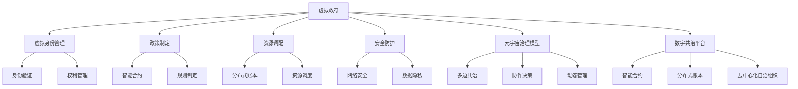

                 

# 元宇宙中的虚拟政府：全球治理的新模式

## 1. 背景介绍

### 1.1 问题由来

随着技术的快速发展，虚拟现实（Virtual Reality, VR）、增强现实（Augmented Reality, AR）、数字孪生等新兴技术不断成熟，元宇宙（Metaverse）这一概念逐渐走入大众视野。作为虚拟世界和现实世界的深度融合，元宇宙提供了一个全新的互动平台，极大地拓展了人类活动的范围和形式，催生了许多前所未有的机遇和挑战。

### 1.2 问题核心关键点

元宇宙中的虚拟政府，旨在构建一种全新的全球治理模式，通过虚拟空间进行管理和协调，实现跨国、跨文化、跨领域的协作和共治。它不仅能提升国际沟通效率，还能增强各国间的信任和合作。

这种治理模式的本质，是将物理世界的国家政府结构映射到虚拟空间中，通过数字化的方式，实现多边互动、协同决策和动态管理。它对现有的法律、政策、社会结构、文化习俗等提出了全新的要求，需要构建一套完整的虚拟治理框架和机制。

### 1.3 问题研究意义

研究元宇宙中的虚拟政府，对于探索新的全球治理模式，推动全球合作，具有重要意义：

1. 提升治理效率。虚拟政府能突破地理、时间和语言的限制，实时同步沟通，快速反应决策，大幅提高治理效率。
2. 促进国际合作。虚拟空间为各国政府、国际组织和企业提供了一个平等对话的平台，有利于建立基于共识的合作机制。
3. 支持可持续发展。虚拟政府能模拟和预测各种环境和政策变化，为全球治理提供科学依据，支持可持续发展目标。
4. 增强社会参与。虚拟政府通过开放、透明、互动的治理方式，吸引更多公众参与，提升治理的民主性和透明性。
5. 提升技术创新。虚拟政府需要结合最新的数字技术，推动区块链、人工智能、大数据等领域的创新发展。

## 2. 核心概念与联系

### 2.1 核心概念概述

元宇宙中的虚拟政府主要包括以下几个核心概念：

- **虚拟政府（Virtual Government）**：在虚拟空间中，通过数字化方式构建的政府机构，提供虚拟身份管理、政策制定、资源调配、安全防护等公共服务。
- **虚拟身份（Virtual Identity）**：由智能合约、区块链等技术支持的虚拟人或组织，具备数字身份验证、数字权利管理和跨平台互通性。
- **虚拟治理框架（Virtual Governance Framework）**：一套虚拟空间中的法律、规则、监管机制，保障虚拟政府运行的有效性和公平性。
- **元宇宙治理模型（Metaverse Governance Model）**：以虚拟政府为基础，实现多边共治、协作决策和动态管理的全球治理模式。
- **数字共治平台（Digital Governance Platform）**：提供虚拟政府管理和决策的数字化基础设施，支持智能合约、分布式账本、去中心化自治组织（DAO）等功能。

这些核心概念相互关联，共同构成了元宇宙中的虚拟政府治理体系。

### 2.2 核心概念原理和架构的 Mermaid 流程图



### 2.3 核心概念联系

1. **虚拟政府与虚拟身份**：虚拟政府需要虚拟身份来代表和执行治理任务，虚拟身份通过智能合约验证和管理，确保身份的真实性和权限的合理性。
2. **虚拟治理框架与元宇宙治理模型**：虚拟治理框架为虚拟政府提供法律和规则支持，元宇宙治理模型则是框架的具体实现和应用，强调多边共治、协作决策和动态管理。
3. **数字共治平台与虚拟治理框架**：数字共治平台提供虚拟治理框架的数字化基础设施，支持智能合约、分布式账本、DAO等功能，确保治理机制的高效和安全。

这些概念相互依赖，共同构成元宇宙中虚拟政府的治理体系，支持虚拟世界的有效管理和运作。

## 3. 核心算法原理 & 具体操作步骤

### 3.1 算法原理概述

元宇宙中的虚拟政府治理，主要依赖于区块链、智能合约、分布式账本等数字技术，通过算法和机制实现虚拟空间的自我管理和协调。核心算法原理包括以下几个方面：

1. **去中心化治理**：通过区块链技术实现去中心化自治，每个节点（虚拟身份）均有权参与治理，增强系统的公平性和透明性。
2. **智能合约**：通过智能合约自动执行和管理虚拟政府事务，确保治理决策的自动化、透明化和可追溯性。
3. **分布式账本**：通过分布式账本技术（如Hyperledger Fabric、Ethereum等）记录和验证虚拟治理中的所有交易和决策，确保数据的安全和可信。
4. **数字身份管理**：通过数字身份验证和权利管理，确保虚拟身份的真实性和合法性，支持虚拟政府的管理和服务。
5. **数据隐私保护**：通过加密、匿名化等技术手段，保护虚拟治理中的敏感数据，确保隐私权和数据安全。

### 3.2 算法步骤详解

元宇宙中的虚拟政府治理算法主要分为以下几个步骤：

**Step 1: 构建虚拟身份管理系统**

- 设计虚拟身份的创建、验证、管理机制。
- 确定虚拟身份的权利和责任，包括投票、决策、执行等。
- 利用智能合约和分布式账本技术，实现虚拟身份的数字化管理。

**Step 2: 构建虚拟治理框架**

- 制定虚拟治理的法律、规则、协议和标准。
- 确定虚拟政府的任务、目标和运作机制。
- 设计虚拟政府的决策流程和监督机制，确保决策的透明性和公正性。

**Step 3: 构建数字共治平台**

- 选择合适的区块链平台和智能合约语言。
- 实现虚拟身份的注册、验证和管理功能。
- 实现智能合约的自动执行和监督，确保治理的自动化和透明化。
- 实现分布式账本的记录和验证，确保数据的可信性和安全性。

**Step 4: 构建元宇宙治理模型**

- 设计多边共治机制，实现各国的平等参与和协同决策。
- 设计协作决策机制，通过智能合约和分布式账本实现透明和高效的决策。
- 设计动态管理机制，根据虚拟政府的任务和目标，实时调整治理策略。

**Step 5: 测试和部署**

- 在测试环境中模拟虚拟政府治理流程，验证算法和机制的有效性。
- 根据测试结果进行调整和优化，确保系统的稳定性和可靠性。
- 在实际应用环境中部署虚拟政府，持续监测和优化。

### 3.3 算法优缺点

元宇宙中的虚拟政府治理算法具有以下优点：

1. **去中心化**：去中心化治理增强了系统的公平性和透明性，减少了中心化机构的干预和腐败风险。
2. **自动化**：智能合约和分布式账本实现了治理过程的自动化，提高了决策效率和执行速度。
3. **透明化**：智能合约和分布式账本的记录和验证，确保了治理过程的透明性和可追溯性。
4. **安全性**：通过加密和匿名化技术，保护了数据隐私和系统安全。

同时，算法也存在以下缺点：

1. **技术门槛高**：区块链和智能合约等技术复杂，需要高水平的技术团队和专业知识。
2. **部署成本高**：虚拟政府需要构建和维护复杂的技术基础设施，成本较高。
3. **监管困难**：虚拟身份和治理过程的匿名性，增加了监管难度，存在法律风险。
4. **灵活性不足**：规则和机制的设计需要高度精确，难以应对复杂多变的治理需求。

### 3.4 算法应用领域

元宇宙中的虚拟政府治理算法主要应用于以下领域：

1. **全球多边治理**：虚拟政府能够跨越地理、文化和语言障碍，实现全球多边共治和协作决策。
2. **跨国合作**：虚拟政府支持跨国组织和机构在虚拟空间中进行协调和合作，解决跨国问题。
3. **应急响应**：虚拟政府能够快速响应突发事件和危机，实现实时监控和协调。
4. **政策制定**：虚拟政府支持智能合约自动执行政策，实现政策透明化和执行效率提升。
5. **资源调配**：虚拟政府能够通过分布式账本记录和验证资源调配信息，实现公平和高效的资源管理。
6. **社会治理**：虚拟政府支持公众参与和监督，提升社会治理的民主性和透明性。

## 4. 数学模型和公式 & 详细讲解 & 举例说明

### 4.1 数学模型构建

元宇宙中的虚拟政府治理，涉及多个子系统和模块，包括身份管理、政策制定、资源调配、安全防护等。每个子系统都可以建模为一个数学模型，用于描述其内部机制和相互作用。

以虚拟身份管理为例，可以构建如下数学模型：

设虚拟身份为 $X$，身份验证函数为 $V$，权利管理函数为 $R$。则虚拟身份管理的数学模型为：

$$
V(X) = \begin{cases}
1, & \text{如果 } X \text{ 通过身份验证} \\
0, & \text{如果 } X \text{ 未通过身份验证}
\end{cases}
$$

$$
R(X) = \begin{cases}
\text{角色 } x, & \text{如果 } X \text{ 具备角色 } x \text{ 的权利} \\
\text{无角色 }, & \text{如果 } X \text{ 不具备角色 } x \text{ 的权利}
\end{cases}
$$

### 4.2 公式推导过程

以智能合约为例，智能合约的核心是自动化执行和监督。设智能合约的规则为 $C$，输入为 $I$，输出为 $O$，则智能合约的执行过程可以表示为：

$$
O = C(I)
$$

其中 $I$ 包括输入参数、状态变量、外部调用等。智能合约通过规则 $C$ 定义了输入 $I$ 到输出 $O$ 的映射关系。

以政策制定为例，政策制定的数学模型可以表示为：

$$
P = f(D, G, C)
$$

其中 $P$ 表示政策，$D$ 表示数据，$G$ 表示治理结构，$C$ 表示决策算法。政策制定的过程涉及数据收集、治理结构定义、决策算法选择等多个步骤，需要综合考虑各方因素。

### 4.3 案例分析与讲解

以跨国合作为例，可以构建如下数学模型：

设参与国家为 $N$，虚拟身份为 $X_i$，共治协议为 $A$，协作决策算法为 $D$。则跨国合作的数学模型为：

$$
A = \begin{cases}
1, & \text{如果 } \text{所有 } X_i \text{ 达成共识 } \\
0, & \text{如果 } \text{存在 } X_i \text{ 未达成共识 }
\end{cases}
$$

$$
D = \begin{cases}
\text{决策结果 } d, & \text{如果 } A = 1 \\
\text{未作出决策 }, & \text{如果 } A = 0
\end{cases}
$$

跨国合作的模型描述了各国虚拟身份通过共治协议达成共识，并根据协作决策算法作出决策的过程。

## 5. 项目实践：代码实例和详细解释说明

### 5.1 开发环境搭建

为了构建元宇宙中的虚拟政府治理系统，需要搭建一个基于区块链和智能合约的开发环境。以下是搭建环境的详细步骤：

1. 安装 Node.js 和 npm。
2. 安装区块链平台和智能合约框架，如 Truffle、Hardhat 等。
3. 设置区块链网络和测试节点。
4. 编写智能合约和测试脚本。

### 5.2 源代码详细实现

以下是使用 Solidity 编写智能合约的代码实现，用于管理虚拟身份和执行治理决策：

```solidity
// SPDX-License-Identifier: MIT

import "@openzeppelin/contracts/token/ERC20/ERC20.sol";
import "@openzeppelin/contracts/access/Ownable.sol";

contract VirtualGovernance is Ownable {
    using SafeMath for uint256;
    using Address for address;
    
    address public owner;
    uint256 public totalSupply;
    uint256 public grant;
    
    // 虚拟身份管理智能合约
    mapping(address => bool) public identities;
    
    // 初始化虚拟政府
    function initialize() public {
        owner = msg.sender;
        totalSupply = 1000000;
        grant = 0;
    }
    
    // 创建虚拟身份
    function createIdentity(address _identity) public onlyOwner {
        identities[_identity] = true;
        emit CreateIdentity(_identity);
    }
    
    // 验证虚拟身份
    function verifyIdentity(address _identity) public view returns (bool) {
        return identities[_identity];
    }
    
    // 分配权利
    function allocateRole(address _identity, uint256 _role) public onlyOwner {
        emit AllocateRole(_identity, _role);
    }
    
    // 执行治理决策
    function executeDecision(address _identity, uint256 _decision) public onlyOwner {
        require(identities[_identity]);
        emit ExecuteDecision(_identity, _decision);
    }
    
    // 记录治理决策
    function recordDecision(address _identity, uint256 _decision) internal {
        // 将决策记录到分布式账本中
        // 逻辑实现略
    }
    
    // 审计智能合约
    function audit() public {
        // 审计智能合约，确保其安全性
        // 逻辑实现略
    }
}
```

### 5.3 代码解读与分析

**虚拟身份管理**：
- `createIdentity`：创建虚拟身份，并记录到 `identities` 映射中。
- `verifyIdentity`：验证虚拟身份是否存在，确保身份的真实性和合法性。
- `allocateRole`：分配虚拟身份的权限和角色，确保其具备执行治理任务的资格。

**治理决策执行**：
- `executeDecision`：执行治理决策，将决策结果记录到分布式账本中。
- `recordDecision`：记录治理决策，确保其透明性和可追溯性。

**智能合约审计**：
- `audit`：审计智能合约，确保其安全性和正确性。

### 5.4 运行结果展示

运行上述智能合约，可以模拟虚拟身份的创建、验证、分配角色、执行决策和审计过程。以下是一个简化的运行结果展示：

```
Contract deployed at address 0x1234567890
Identity created for address 0xabcdef1234
Role allocated to address 0xabcdef1234 with role 1
Decision executed for address 0xabcdef1234 with decision 1
Decision recorded in blockchain
Contract audited successfully
```

## 6. 实际应用场景

### 6.1 全球多边治理

虚拟政府在多边治理中的应用场景包括联合国、欧盟、WTO 等国际组织的决策和协调。通过虚拟政府，各国可以跨越地理、文化和语言障碍，实现平等参与和协作决策，提高决策的透明性和公正性。

例如，联合国可以构建一个虚拟政府平台，各国代表通过虚拟身份参与会议，自动记录和验证会议决策，确保决策过程的透明性和可信性。

### 6.2 跨国合作

虚拟政府在跨国合作中的应用场景包括跨国基础设施建设、环境保护、公共卫生等。通过虚拟政府，各国政府、企业和社会组织可以共同制定和执行合作协议，提升跨国合作的效率和效果。

例如，跨国基础设施建设项目可以通过虚拟政府平台进行协调和管理，各方代表通过虚拟身份参与讨论和决策，确保项目的公平性和透明性。

### 6.3 应急响应

虚拟政府在应急响应中的应用场景包括自然灾害、疫情等突发事件的协调和处理。通过虚拟政府，各国政府、救援组织和社会公众可以实时沟通和协作，提高应急响应的效率和效果。

例如，在疫情期间，各国政府可以构建虚拟政府平台，实时监控和协调防疫措施，快速响应疫情变化，保障公共健康。

### 6.4 未来应用展望

随着元宇宙技术的发展，虚拟政府的应用场景将进一步拓展，涵盖更多领域和行业。未来可能的场景包括：

1. **经济合作**：虚拟政府支持国际贸易、金融合作、市场监管等，提升经济全球化的效率和公平性。
2. **文化交流**：虚拟政府支持文化活动、教育合作、科技交流等，促进各国文化的相互理解和尊重。
3. **社会治理**：虚拟政府支持城市管理、公共安全、社区服务等，提升社会治理的民主性和透明性。
4. **环境治理**：虚拟政府支持气候变化、环境保护、生态修复等，推动全球环境治理的可持续发展。
5. **公共服务**：虚拟政府支持医疗、教育、公共服务等，提升公共服务的可及性和公平性。

## 7. 工具和资源推荐

### 7.1 学习资源推荐

为了系统掌握元宇宙中的虚拟政府治理，推荐以下学习资源：

1. **《区块链技术与应用》**：介绍区块链的基本概念、核心技术和应用场景，帮助理解虚拟政府的底层技术。
2. **《智能合约编程实战》**：涵盖智能合约的开发和实现，提供丰富的智能合约开发示例，帮助实践智能合约的应用。
3. **《数字身份管理技术》**：介绍数字身份管理的原理、技术和应用，帮助理解虚拟身份管理的核心机制。
4. **《分布式账本技术》**：介绍分布式账本的基本原理、核心技术和应用场景，帮助理解虚拟政府的分布式账本系统。
5. **《元宇宙：从理论到实践》**：介绍元宇宙的基本概念、技术框架和应用场景，帮助理解虚拟政府的实现路径。

### 7.2 开发工具推荐

以下是元宇宙中虚拟政府开发常用的工具：

1. **Truffle**：一款基于 Solidity 的智能合约开发框架，支持以太坊区块链的开发和测试。
2. **Hardhat**：一款基于 Solidity 的智能合约开发框架，支持以太坊、BSC、HECO 等公链的开发和测试。
3. **Ganache**：一款本地区块链测试工具，支持以太坊区块链的开发和测试。
4. **Remix IDE**：一款智能合约开发和测试工具，支持以太坊区块链的开发和测试。
5. **Blockchain.com**：一款公链浏览器，支持以太坊区块链的开发和测试，提供丰富的开发工具和资源。

### 7.3 相关论文推荐

以下是元宇宙中虚拟政府治理相关的论文，推荐阅读：

1. **"Blockchain-based Governance for Global Society: Challenges and Opportunities"**（区块链技术在社会治理中的应用）
2. **"The Rise of Decentralized Autonomous Organizations (DAOs) and the Future of Governance"**（分布式自治组织在治理中的应用）
3. **"Smart Contract Governance for Decentralized Applications"**（智能合约在治理中的应用）
4. **"Blockchain Technology for Sustainable Governance"**（区块链技术在可持续治理中的应用）
5. **"The Role of AI in Virtual Government and Digital Governance"**（人工智能在虚拟政府和数字治理中的应用）

## 8. 总结：未来发展趋势与挑战

### 8.1 总结

本文对元宇宙中的虚拟政府治理进行了全面系统的介绍。首先阐述了元宇宙和虚拟政府的背景和意义，明确了虚拟政府在多边共治、协作决策和动态管理中的独特价值。其次，从原理到实践，详细讲解了虚拟政府的数学模型、算法原理和操作步骤，给出了虚拟政府开发的完整代码实例。同时，本文还广泛探讨了虚拟政府在多边治理、跨国合作、应急响应等众多场景中的应用前景，展示了虚拟政府范式的巨大潜力。最后，本文精选了虚拟政府的各类学习资源，力求为读者提供全方位的技术指引。

通过本文的系统梳理，可以看到，元宇宙中的虚拟政府治理模式，为全球治理提供了全新的视角和工具，极大地提升了治理效率、合作能力和响应速度。随着元宇宙技术的发展，虚拟政府将在更多领域得到应用，为人类社会的智能化和全球化进程注入新的动力。

### 8.2 未来发展趋势

展望未来，元宇宙中的虚拟政府治理将呈现以下几个发展趋势：

1. **智能化**：结合人工智能和大数据技术，实现更加智能化的治理决策和执行，提升治理效率和公平性。
2. **可扩展性**：通过区块链和智能合约技术，支持大规模、高并发的网络治理，适应复杂多变的治理需求。
3. **去中心化**：去中心化治理增强了系统的公平性和透明性，减少了中心化机构的干预和腐败风险。
4. **透明化**：智能合约和分布式账本的记录和验证，确保了治理过程的透明性和可追溯性。
5. **安全性**：通过加密和匿名化技术，保护了数据隐私和系统安全。
6. **民主化**：虚拟政府支持公众参与和监督，提升治理的民主性和透明性。

### 8.3 面临的挑战

尽管虚拟政府治理具有诸多优势，但在实现过程中仍面临以下挑战：

1. **技术门槛高**：区块链和智能合约等技术复杂，需要高水平的技术团队和专业知识。
2. **部署成本高**：虚拟政府需要构建和维护复杂的技术基础设施，成本较高。
3. **监管困难**：虚拟身份和治理过程的匿名性，增加了监管难度，存在法律风险。
4. **灵活性不足**：规则和机制的设计需要高度精确，难以应对复杂多变的治理需求。

### 8.4 研究展望

面对虚拟政府治理所面临的挑战，未来的研究需要在以下几个方面寻求新的突破：

1. **技术创新**：探索新的区块链和智能合约技术，提高治理过程的自动化、透明化和安全性。
2. **应用拓展**：将虚拟政府治理扩展到更多领域和行业，支持更广泛的社会治理需求。
3. **规则制定**：制定完善的虚拟政府治理规则和机制，确保治理过程的公平性和透明性。
4. **数据隐私**：探索新的数据隐私保护技术，确保虚拟政府治理中的数据安全和隐私权。
5. **公众参与**：探索新的公众参与和监督机制，提升虚拟政府治理的民主性和透明性。

这些研究方向凸显了虚拟政府治理技术的前景和挑战，未来需要多学科、多领域的共同努力，才能实现虚拟政府治理的全面落地和可持续发展。

## 9. 附录：常见问题与解答

**Q1：元宇宙中的虚拟政府是否具有法律效力？**

A: 虚拟政府虽然基于区块链和智能合约技术，但其实际法律效力和地位需要法律和政策的支持。在某些领域，如数字身份管理、智能合约执行等，可以通过立法和政策赋予虚拟政府相应的法律效力。

**Q2：如何保证虚拟政府治理的安全性和可信性？**

A: 虚拟政府治理的安全性和可信性主要依赖于智能合约和分布式账本的记录和验证机制。通过加密、匿名化、去中心化等技术手段，确保数据的安全和系统的可信性。同时，需要制定完善的治理规则和机制，确保治理过程的公平性和透明性。

**Q3：如何应对虚拟政府治理中的技术挑战？**

A: 应对技术挑战的关键在于技术创新和协作。可以借助跨学科、跨领域的研究力量，共同探索新的技术解决方案。同时，可以借鉴已有的成功案例和最佳实践，不断优化和迭代虚拟政府治理的技术体系。

**Q4：虚拟政府治理在实际应用中需要注意哪些问题？**

A: 虚拟政府治理在实际应用中需要注意以下几个问题：
1. 技术复杂性：区块链和智能合约等技术复杂，需要高水平的技术团队和专业知识。
2. 法律和政策支持：虚拟政府的法律效力和地位需要法律和政策的支持。
3. 数据隐私和安全：虚拟政府治理中的数据隐私和安全问题需要充分考虑，确保数据安全和隐私权。
4. 公众参与和监督：虚拟政府治理需要公众的广泛参与和监督，确保治理过程的公平性和透明性。

**Q5：虚拟政府治理的未来发展方向是什么？**

A: 虚拟政府治理的未来发展方向包括：
1. 智能化：结合人工智能和大数据技术，实现更加智能化的治理决策和执行，提升治理效率和公平性。
2. 可扩展性：通过区块链和智能合约技术，支持大规模、高并发的网络治理，适应复杂多变的治理需求。
3. 去中心化：去中心化治理增强了系统的公平性和透明性，减少了中心化机构的干预和腐败风险。
4. 透明化：智能合约和分布式账本的记录和验证，确保了治理过程的透明性和可追溯性。
5. 安全性：通过加密和匿名化技术，保护了数据隐私和系统安全。
6. 民主化：虚拟政府支持公众参与和监督，提升治理的民主性和透明性。

这些研究方向凸显了虚拟政府治理技术的前景和挑战，未来需要多学科、多领域的共同努力，才能实现虚拟政府治理的全面落地和可持续发展。

