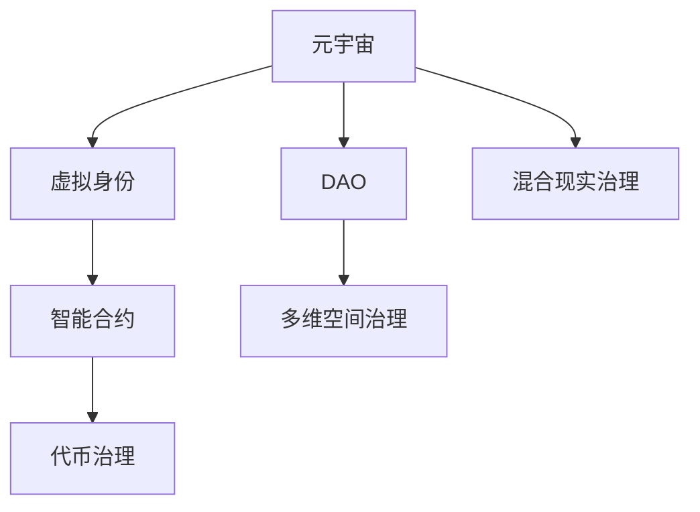

                 

# 元宇宙政党:虚拟世界的政治组织新形式

## 1. 背景介绍

在人类社会的演进历程中，政治组织始终是推动社会变革的关键力量。从古希腊的城邦制度，到中世纪的封建领地，再到近现代的政党制度，人类历史上的每一次社会转型，背后都离不开政治组织的推动。而随着数字技术的迅猛发展，一个全新的政治组织形态正在悄然兴起——元宇宙政党。

元宇宙是近年来最热门的科技话题之一，指的是一个虚拟的、持续性的、沉浸式的网络空间，用户可以在其中进行社交、工作、娱乐等活动，仿佛置身于一个完全不同的世界。随着虚拟现实(VR)、增强现实(AR)、区块链等技术的不断成熟，元宇宙正在逐步从概念走向现实。

元宇宙政党的概念最早由学者提出，旨在探索虚拟世界中如何组织、管理和运作政治活动。元宇宙政党是一个由用户（即公民）、代表、政党机构等组成的新型政治组织形式，用户通过虚拟身份参与政治，代表通过虚拟平台表达立场，政党机构则通过智能合约和代码实现对虚拟社会的治理。

元宇宙政党的兴起，标志着人类政治组织的范式正在发生深刻变革。这不仅是一场技术革命，更是一场观念更新。通过深入研究元宇宙政党的基本原理和运作机制，有望推动人类政治生活进入一个全新的阶段。

## 2. 核心概念与联系

### 2.1 核心概念概述

为了更好地理解元宇宙政党的基本原理和运作机制，本节将介绍几个关键概念：

- **元宇宙**：虚拟现实、增强现实、区块链、Web3.0等技术的融合，构建的沉浸式、持续性、交互式的网络空间。
- **虚拟身份**：用户在元宇宙中的数字身份，通常由虚拟头像、昵称、权限等信息组成。
- **智能合约**：一种基于区块链技术的自动执行合同，用于处理元宇宙中各类事务，如投票、管理等。
- **代币治理**：通过代币激励机制，驱动用户在元宇宙中参与政治活动，实现治理和管理的自动化。
- **分布式自治组织(DAO)**：一种基于区块链技术的新型组织形式，由去中心化的用户共同管理，具有高度自治和民主化特性。
- **多维空间治理**：元宇宙中存在多维空间，不同空间可能有不同的治理规则和政策，治理需要跨越不同空间进行协调。
- **混合现实治理**：元宇宙与现实世界的融合，需要在虚拟与现实之间找到平衡，制定跨界治理规则。

这些概念之间的逻辑关系可以通过以下Mermaid流程图来展示：



这个流程图展示了几大核心概念及其之间的关系：

1. 元宇宙作为一个基础平台，提供了虚拟身份、智能合约、DAO、多维空间治理等功能。
2. 虚拟身份是用户参与元宇宙政治活动的基本单位。
3. 智能合约是元宇宙中各类事务处理的基础。
4. 代币治理用于激励用户参与政治活动，并实现自治。
5. DAO是元宇宙中用户自治的一种形式。
6. 多维空间治理和混合现实治理涉及元宇宙与现实世界的交互和协调。

## 3. 核心算法原理 & 具体操作步骤

### 3.1 算法原理概述

元宇宙政党的核心算法原理，主要包括智能合约、代币治理、DAO等关键技术。这些技术共同构成了元宇宙政党的基本运作框架，使得用户能够在一个去中心化、自治化的环境中，参与政治活动，实现民主治理。

- **智能合约**：通过区块链技术实现的自动执行合同，可以用于处理元宇宙中的各类事务，如投票、管理、资源分配等。智能合约具有去中心化、透明、不可篡改等特性，保障了元宇宙政治活动的公正性和可信度。
- **代币治理**：利用加密货币的激励机制，驱动用户在元宇宙中参与政治活动，如投票、提案、贡献等。代币激励机制可以增强用户的积极性和参与度，推动元宇宙政治活动的健康发展。
- **DAO**：一种基于区块链技术的新型组织形式，由用户共同管理，具有高度自治和民主化特性。DAO使得元宇宙中的用户能够通过代码和智能合约，实现自我治理和自我管理。

### 3.2 算法步骤详解

元宇宙政党的基本操作步骤如下：

1. **构建虚拟身份**：用户在元宇宙中创建虚拟身份，通常包括头像、昵称、权限等。
2. **参与智能合约**：用户通过智能合约，参与元宇宙中的各类政治活动，如投票、提案、捐助等。
3. **代币激励机制**：通过代币激励机制，激励用户积极参与政治活动，增强用户黏性和积极性。
4. **DAO治理**：用户通过DAO，实现元宇宙中的自我管理和自我治理，确保政治活动的透明和公正。
5. **多维空间治理**：在多维空间中，用户需要遵守不同的治理规则，需要进行跨空间的协调和合作。
6. **混合现实治理**：在虚拟与现实的混合环境中，需要制定跨界治理规则，确保虚拟与现实之间的平衡和协调。

### 3.3 算法优缺点

元宇宙政党的核心算法具有以下优点：

- **去中心化与自治化**：通过智能合约和DAO，实现了去中心化管理，保障了政治活动的公正性和透明性。
- **高效与透明**：智能合约的自动执行特性，确保了政治活动的效率和透明性，避免了人为操作的失误和腐败。
- **用户参与度高**：代币激励机制增强了用户参与度，推动了元宇宙政治活动的健康发展。

同时，元宇宙政党也存在以下局限性：

- **技术依赖性强**：元宇宙政党依赖于区块链、Web3.0等技术，技术门槛较高。
- **治理复杂度高**：多维空间和混合现实中的治理规则制定和执行较为复杂。
- **安全风险高**：虚拟世界的安全和隐私问题，可能面临比现实世界更大的挑战。
- **用户行为难以预测**：虚拟身份的匿名性和虚拟空间的自由性，可能导致用户行为难以预测和管理。

### 3.4 算法应用领域

元宇宙政党的核心算法在多个领域具有广泛应用，例如：

- **虚拟社区治理**：通过智能合约和DAO，实现虚拟社区的自我管理和服务，提升社区自治能力。
- **虚拟政府管理**：构建虚拟政府，通过智能合约和DAO，实现政府事务的自动化和透明化，提升治理效率。
- **虚拟组织运营**：构建虚拟组织，通过智能合约和DAO，实现组织的自我管理和资源分配，保障组织运行的高效和透明。
- **虚拟商业运营**：构建虚拟商业平台，通过智能合约和DAO，实现商品的自动交易和管理，提升商业运营的效率和公平性。
- **虚拟文化交流**：构建虚拟文化交流平台，通过智能合约和DAO，实现文化的自我传播和管理，推动文化交流的繁荣和发展。

## 4. 数学模型和公式 & 详细讲解 & 举例说明

### 4.1 数学模型构建

为了更好地理解元宇宙政党的运作机制，本节将从数学模型的角度，详细讲解其构建过程。

设元宇宙中用户数量为 $N$，代币数量为 $C$，智能合约数量为 $M$，用户与智能合约之间的关系为 $R_{ij}$，其中 $i$ 为用户，$j$ 为智能合约。

定义用户 $i$ 参与智能合约 $j$ 的权值为 $w_{ij}$，其计算公式为：

$$
w_{ij} = \frac{v_i}{N} \cdot r_j
$$

其中 $v_i$ 为用户 $i$ 持有的代币数量，$r_j$ 为智能合约 $j$ 的权值系数。

用户 $i$ 在智能合约 $j$ 中的投票权为 $p_{ij}$，其计算公式为：

$$
p_{ij} = w_{ij} \cdot \frac{1}{C}
$$

智能合约 $j$ 在用户 $i$ 中的投票权为 $q_{ij}$，其计算公式为：

$$
q_{ij} = w_{ij} \cdot \frac{1}{C}
$$

用户 $i$ 在智能合约 $j$ 中的投票结果为 $v_{ij}$，其计算公式为：

$$
v_{ij} = \sum_{k=1}^{N} p_{ik} \cdot r_{kj}
$$

其中 $r_{kj}$ 为用户 $k$ 在智能合约 $j$ 中的投票权。

### 4.2 公式推导过程

以下我们以元宇宙社区投票为例，推导智能合约和代币治理的数学模型。

假设元宇宙社区中有 $N=1000$ 名用户，智能合约 $j=10$ 个，每个用户持有的代币数量为 $v_i=100$。设每个智能合约的权值系数为 $r_j=0.1$。

用户 $i$ 在智能合约 $j$ 中的权值为：

$$
w_{ij} = \frac{v_i}{N} \cdot r_j = \frac{100}{1000} \cdot 0.1 = 0.01
$$

用户 $i$ 在智能合约 $j$ 中的投票权为：

$$
p_{ij} = w_{ij} \cdot \frac{1}{C} = 0.01 \cdot \frac{1}{100} = 0.001
$$

假设用户 $i$ 投票给智能合约 $j=1$，则用户 $i$ 在智能合约 $j=1$ 中的投票结果为：

$$
v_{i1} = \sum_{k=1}^{N} p_{ik} \cdot r_{k1} = 0.001 \cdot \sum_{k=1}^{1000} \frac{1}{1000} \cdot 0.1 = 0.001
$$

代入所有用户的投票结果，可以得到智能合约 $j=1$ 的最终投票结果：

$$
v_{1} = \sum_{i=1}^{1000} v_{i1} = 0.001 \cdot 1000 = 1
$$

通过上述推导，我们可以看到，元宇宙政党的智能合约和代币治理机制，能够有效实现用户的投票权分配和投票结果计算，确保了政治活动的公正性和透明性。

### 4.3 案例分析与讲解

接下来，我们以元宇宙虚拟政府为例，进一步讲解元宇宙政党的运作机制。

假设元宇宙虚拟政府中有 $N=10000$ 名用户，智能合约 $j=50$ 个，每个用户持有的代币数量为 $v_i=10$。设每个智能合约的权值系数为 $r_j=0.1$。

用户 $i$ 在智能合约 $j$ 中的权值为：

$$
w_{ij} = \frac{v_i}{N} \cdot r_j = \frac{10}{10000} \cdot 0.1 = 0.001
$$

用户 $i$ 在智能合约 $j$ 中的投票权为：

$$
p_{ij} = w_{ij} \cdot \frac{1}{C} = 0.001 \cdot \frac{1}{10} = 0.0001
$$

假设用户 $i$ 投票给智能合约 $j=1$，则用户 $i$ 在智能合约 $j=1$ 中的投票结果为：

$$
v_{i1} = \sum_{k=1}^{N} p_{ik} \cdot r_{k1} = 0.0001 \cdot \sum_{k=1}^{10000} \frac{1}{10000} \cdot 0.1 = 0.0001
$$

代入所有用户的投票结果，可以得到智能合约 $j=1$ 的最终投票结果：

$$
v_{1} = \sum_{i=1}^{10000} v_{i1} = 0.0001 \cdot 10000 = 1
$$

通过上述分析，我们可以看到，元宇宙政党的智能合约和代币治理机制，能够有效实现用户的投票权分配和投票结果计算，确保了政治活动的公正性和透明性。

## 5. 项目实践：代码实例和详细解释说明

### 5.1 开发环境搭建

在进行元宇宙政党项目实践前，我们需要准备好开发环境。以下是使用Python进行元宇宙政党开发的简单环境配置流程：

1. 安装Anaconda：从官网下载并安装Anaconda，用于创建独立的Python环境。

2. 创建并激活虚拟环境：
```bash
conda create -n元宇宙政党 python=3.8 
conda activate 元宇宙政党
```

3. 安装相关的Python库：
```bash
pip install Flask web3
```

4. 安装相应的Web3.0钱包：
```bash
pip install MetaMask
```

完成上述步骤后，即可在`元宇宙政党`环境中开始项目开发。

### 5.2 源代码详细实现

这里我们以元宇宙虚拟政府投票为例，展示元宇宙政党项目的开发过程。

首先，我们需要定义元宇宙虚拟政府的智能合约，实现投票功能：

```python
from web3 import Web3, HTTPProvider
from flask import Flask, request

app = Flask(__name__)

# 连接Web3.0钱包
web3 = Web3(HTTPProvider('https://mainnet.infura.io/v3/YOUR_INFURA_API_KEY'))
web3.eth.default_gas_price = web3.utils.toWei('50', 'gwei')

# 创建智能合约
class VoteContract:
    def __init__(self):
        self.contract = web3.eth.contract(VoteContract.abi, VoteContract.bytecode)

    def vote(self, voter, candidate):
        tx = self.contract.functions.vote(voter, candidate).send({
            'from': self.voter,
            'value': web3.toWei(0, 'ether'),
            'gas': 200000,
            'gasPrice': web3.eth.gasPrice
        })
        return tx

# 定义投票智能合约的ABI和字节码
VoteContract.abi = [
    {
        'constant': False,
        'inputs': [
            {'name': 'voter', 'type': 'address'},
            {'name': 'candidate', 'type': 'uint256'}
        ],
        'outputs': [],
        'name': 'vote',
        'type': 'function'
    }
]

VoteContract.bytecode = '0x60fe47b100000000000000000000000000000000000000000000000000000000000000000000000000000000000000000000000000000000000000000000000000000000000000000000000000000000000000000000000000000000000000000000000000000000000000000000000000000000000000000000000000000000000000000000000000000000000000000000000000000000000000000000000000000000000000000000000000000000000000000000000000000000000000000000000000000000000000000000000000000000000000000000000000000000000000000000000000000000000000000000000000000000000000000000000000000000000000000000000000000000000000000000000000000000000000000000000000000000000000000000000000000000000000000000000000000000000000000000000000000000000000000000000000000000000000000000000000000000000000000000000000000000000000000000000000000000000000000000000000000000000000000000000000000000000000000000000000000000000000000000000000000000000000000000000000000000000000000000000000000000000000000000000000000000000000000000000000000000000000000000000000000000000000000000000000000000000000000000000000000000000000000000000000000000000000000000000000000000000000000000000000000000000000000000000000000000000000000000000000000000000000000000000000000000000000000000000000000000000000000000000000000000000000000000000000000000000000000000000000000000000000000000000000000000000000000000000000000000000000000000000000000000000000000000000000000000000000000000000000000000000000000000000000000000000000000000000000000000000000000000000000000000000000000000000000000000000000000000000000000000000000000000000000000000000000000000000000000000000000000000000000000000000000000000000000000000000000000000000000000000000000000000000000000000000000000000000000000000000000000000000000000000000000000000000000000000000000000000000000000000000000000000000000000000000000000000000000000000000000000000000000000000000000000000000000000000000000000000000000000000000000000000000000000000000000000000000000000000000000000000000000000000000000000000000000000000000000000000000000000000000000000000000000000000000000000000000000000000000000000000000000000000000000000000000000000000000000000000000000000000000000000000000000000000000000000000000000000000000000000000000000000000000000000000000000000000000000000000000000000000000000000000000000000000000000000000000000000000000000000000000000000000000000000000000000000000000000000000000000000000000000000000000000000000000000000000000000000000000000000000000000000000000000000000000000000000000000000000000000000000000000000000000000000000000000000000000000000000000000000000000000000000000000000000000000000000000000000000000000000000000000000000000000000000000000000000000000000000000000000000000000000000000000000000000000000000000000000000000000000000000000000000000000000000000000000000000000000000000000000000000000000000000000000000000000000000000000000000000000000000000000000000000000000000000000000000000000000000000000000000000000000000000000000000000000000000000000000000000000000000000000000000000000000000000000000000000000000000000000000000000000000000000000000000000000000000000000000000000000000000000000000000000000000000000000000000000000000000000000000000000000000000000000000000000000000000000000000000000000000000000000000000000000000000000000000000000000000000000000000000000000000000000000000000000000000000000000000000000000000000000000000000000000000000000000000000000000000000000000000000000000000000000000000000000000000000000000000000000000000000000000000000000000000000000000000000000000000000000000000000000000000000000000000000000000000000000000000000000000000000000000000000000000000000000000000000000000000000000000000000000000000000000000000000000000000000000000000000000000000000000000000000000000000000000000000000000000000000000000000000000000000000000000000000000000000000000000000000000000000000000000000000000000000000000000000000000000000000000000000000000000000000000000000000000000000000000000000000000000000000000000000000000000000000000000000000000000000000000000000000000000000000000000000000000000000000000000000000000000000000000000000000000000000000000000000000000000000000000000000000000000000000000000000000000000000000000000000000000000000000000000000000000000000000000000000000000000000000000000000000000000000000000000000000000000000000000000000000000000000000000000000000000000000000000000000000000000000000000000000000000000000000000000000000000000000000000000000000000000000000000000000000000000000000000000000000000000000000000000000000000000000000000000000000000000000000000000000000000000000000000000000000000000000000000000000000000000000000000000000000000000000000000000000000000000000000000000000000000000000000000000000000000000000000000000000000000000000000000000000000000000000000000000000000000000000000000000000000000000000000000000000000000000000000000000000000000000000000000000000000000000000000000000000000000000000000000000000000000000000000000000000000000000000000000000000000000000000000000000000000000000000000000000000000000000000000000000000000000000000000000000000000000000000000000000000000000000000000000000000000000000000000000000000000000000000000000000000000000000000000000000000000000000000000000000000000000000000000000000000000000000000000000000000000000000000000000000000000000000000000000000000000000000000000000000000000000000000000000000000000000000000000000000000000000000000000000000000000000000000000000000000000000000000000000000000000000000000000000000000000000000000000000000000000000000000000000000000000000000000000000000000000000000000000000000000000000000000000000000000000000000000000000000000000000000000000000000000000000000000000000000000000000000000000000000000000000000000000000000000000000000000000000000000000000000000000000000000000000000000000000000000000000000000000000000000000000000000000000000000000000000000000000000000000000000000000000000000000000000000000000000000000000000000000000000000000000000000000000000000000000000000000000000000000000000000000000000000000000000000000000000000000000000000000000000000000000000000000000000000000000000000000000000000000000000000000000000000000000000000000000000000000000000000000000000000000000000000000000000000000000000000000000000000000000000000000000000000000000000000000000000000000000000000000000000000000000000000000000000000000000000000000000000000000000000000000000000000000000000000000000000000000000000000000000000000000000000000000000000000000000000000000000000000000000000000000000000000000000000000000000000000000000000000000000000000000000000000000000000000000000000000000000000000000000000000000000000000000000000000000000000000000000000000000000000000000000000000000000000000000000000000000000000000000000000000000000000000000000000000000000000000000000000000000000000000000000000000000000000000000000000000000000000000000000000000000000000000000000000000000000000000000000000000000000000000000000000000000000000000000000000000000000000000000000000000000000000000000000000000000000000000000000000000000000000000000000000000000000000000000000000000000000000000000000000000000000000000000000000000000000000000000000000000000000000000000000000000000000000000000000000000000000000000000000000000000000000000000000000000000000000000000000000000000000000000000000000000000000000000000000000000000000000000000000000000000000000000000000000000000000000000000000000000000000000000000000000000000000000000000000000000000000000000000000000000000000000000000000000000000000000000000000000000000000000000000000000000000000000000000000000000000000000000000000000000000000000000000000000000000000000000000000000000000000000000000000000000000000000000000000000000000000000000000000000000000000000000000000000000000000000000000000000000000000000000000000000000000000000000000000000000000000000000000000000000000000000000000000000000000000000000000000000000000000000000000000000000000000000000000000000000000000000000000000000000000000000000000000000000000000000000000000000000000000000000000000000000000000000000000000000000000000000000000000000000000000000000000000000000000000000000000000000000000000000000000000000000000000000000000000000000000000000000000000000000000000000000000000000000000000000000000000000000000000000000000000000000000000000000000000000000000000000000000000000000000000000000000000000000000000000000000000000000000000000000000000000000000000000000000000000000000000000000000000000000000000000000000000000000000000000000000000000000000000000000000000000000000000000000000000000000000000000000000000000000000000000000000000000000000000000000000000000000000000000000000000000000000000000000000000000000000000000000000000000000000000000000000000000000000000000000000000000000000000000000000000000000000000000000000000000000000000000000000000000000000000000000000000000000000000000000000000000000000000000000000000000000000000000000000000000000000000000000000000000000000000000000000000000000000000000000000000000000000000000000000000000000000000000000000000000000000000000000000000000000000000000000000000000000000000000000000000000000000000000000000000000000000000000000000000000000000000000000000000000000000000000000000000000000000000000000000000000000000000000000000000000000000000000000000000000000000000000000000000000000000000000000000000000000000000000000000000000000000000000000000000000000000000000000000000000000000000000000000000000000000000000000000000000000000000000000000000000000000000000000000000000000000000000000000000000000000000000000000000000000000000000000000000000000000000000000000000000000000000000000000000000000000000000000000000000000000000000000000000000000000000000000000000000000000000000000000000000000000000000000000000000000000000000000000000000000000000000000000000000000000000000000000000000000000000000000000000000000000000000000000000000000000000000000000000000000000000000000000000000000000000000000000000000000000000000000000000000000000000000000000000000000000000000000000000000000000000000000000000000000000000000000000000000000000000000000000000000000000000000000000000000000000000000000000000000000000000000000000000000000000000000000000000000000000000000000000000000000000000000000000000000000000000000000000000000000000000000000000000000000000000000000000000000000000000000000000000000000000000000000000000000000000000000000000000000000000000000000000000000000000000000000000000000000000000000000000000000000000000000000000000000000000000000000000000000000000000000000000000000000000000000000000000000000000000000000000000000000000000000000000000000000000000000000000000000000000000000000000000000000000000000000000000000000000000000000000000000000000000000000000000000000000000000000000000000000000000000000000000000000000000000000000000000000000000000000000000000000000000000000000000000000000000000000000000000000000000000000000000000000000000000000000000000000000000000000000000000000000000000000000000000000000000000000000000000000000000000000000000000000000000000000000000000000000000000000000000000000000000000000000000000000000000000000000000000000000000000000000000000000000000000000000000000000000000000000000000000000000000000000000000000000000000000000000000000000000000000000000000000000000000000000000000000000000000000000000000000000000000000000000000000000000000000000000000000000000000000000000000000000000000000000000000000000000000000000000000000000000000000000000000000000000000000000000000000000000000000000000000000000000000000000000000000000000000000000000000000000000000000000000000000000000000000000000000000000000000000000000000000000000000000000000000000000000000000000000000000000000000000000000000000000000000000000000000000000000000000000000000000000000000000000000000000000000000000000000000000000000000000000000000000000000000000000000000000000000000000000000000000000000000000000000000000000000000000000000000000000000000000000000000000000000000000000000000000000000000000000000000000000000000000000000000000000000000000000000000000000000000000000000000000000000000000000000000000000000000000000000000000000000000000000000000000000000000000000000000000000000000000000000000000000000000000000000000000000000000000

