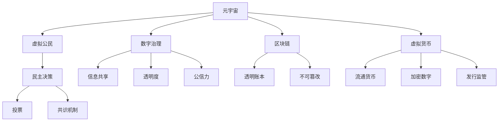

                 

# 元宇宙政治生态:虚拟世界的权力新格局

> 关键词：元宇宙,政治生态,虚拟世界,权力格局,数字治理,虚拟治理,区块链,虚拟货币,数字公民,民主决策

## 1. 背景介绍

### 1.1 问题由来

随着虚拟现实、增强现实和区块链技术的飞速发展，元宇宙(Utopia)正在成为现实。元宇宙是一个全新的虚拟世界，它通过3D建模、虚拟社交、虚拟经济、虚拟治理等技术，构造出与现实世界相似，但自由无限的空间。用户可以在这个虚拟世界中进行工作、学习、娱乐、交流，甚至生活。

然而，元宇宙并非一个完美的乌托邦。虚拟世界同样存在权力结构、利益冲突、社会治理等问题。一个多元、开放、公平的虚拟世界，离不开合理的权力格局和治理体系。否则，元宇宙很容易成为现实世界的“虚拟殖民地”，甚至“避税天堂”。

基于此，本文旨在探讨元宇宙政治生态，分析虚拟世界的权力格局，提出构建数字治理体系的框架，为元宇宙的可持续发展提供参考。

### 1.2 问题核心关键点

元宇宙政治生态的核心关键点包括：

- 虚拟世界的权力结构：权力由谁掌握？如何分配？
- 数字治理的框架：如何构建元宇宙的治理体系？
- 区块链与虚拟货币：区块链技术如何影响元宇宙治理？
- 虚拟公民的权利：元宇宙中的民主决策机制？
- 元宇宙的道德规范：虚拟世界中的社会道德约束？

本文将通过对这些关键问题的回答，构建起元宇宙政治生态的完整框架。

## 2. 核心概念与联系

### 2.1 核心概念概述

为更好地理解元宇宙政治生态，本节将介绍几个密切相关的核心概念：

- 元宇宙(Utopia)：通过虚拟现实、增强现实、区块链等技术构造的虚拟世界，用户可以在其中自由活动、交流和交易。
- 数字治理：利用互联网、区块链等数字技术构建的治理体系，提供信息共享、透明度和公信力。
- 区块链：一种去中心化的分布式账本技术，具有透明、不可篡改的特点，常用于记录元宇宙中的交易、投票等活动。
- 虚拟货币：一种在元宇宙内流通的加密数字货币，其发行、流通、监管与现实货币类似。
- 虚拟公民：在元宇宙内拥有身份和权利的主体，参与数字治理和社会活动。
- 民主决策：通过投票、共识机制等方式，在元宇宙内实现民主管理和决策。

这些概念之间的逻辑关系可以通过以下Mermaid流程图来展示：



这个流程图展示了几大核心概念及其之间的联系：

1. 元宇宙通过区块链和虚拟货币，进行去中心化的管理和交易。
2. 数字治理提供信息共享、透明度和公信力，构成元宇宙的治理基础。
3. 区块链的透明和不可篡改特性，保证了元宇宙治理的公正性和稳定性。
4. 虚拟公民通过民主决策机制，参与元宇宙的治理和决策。

这些概念共同构成了元宇宙政治生态的基本框架，对元宇宙的健康发展至关重要。

## 3. 核心算法原理 & 具体操作步骤

### 3.1 算法原理概述

元宇宙政治生态的构建，主要涉及区块链技术、数字治理框架和虚拟公民的民主决策机制。这些机制通过算法原理实现，其核心目标是通过去中心化的方式，实现虚拟世界的公正治理和资源管理。

### 3.2 算法步骤详解

基于上述算法原理，构建元宇宙政治生态的具体步骤如下：

**Step 1: 设计虚拟世界的权力结构**
- 构建去中心化的权力分配模型，如共识算法（PoW、PoS等）
- 定义虚拟公民的权利和责任，如投票权、决策权、维护权等

**Step 2: 建立数字治理框架**
- 定义信息共享机制，如分布式账本
- 建立透明度机制，如区块链公开记录
- 设立公信力机制，如智能合约和信任证明

**Step 3: 引入虚拟货币**
- 设计虚拟货币发行和流通机制
- 制定虚拟货币的监管政策

**Step 4: 实现民主决策**
- 设计投票机制，如公投、代表制等
- 建立共识机制，如多数决、协商一致等
- 实现民主监督，如审计、透明度报告等

**Step 5: 构建元宇宙社区**
- 通过虚拟土地、虚拟资产等实现虚拟世界经济
- 提供虚拟教育、文化、娱乐等社区活动

### 3.3 算法优缺点

元宇宙政治生态的构建，具有以下优点：

1. 去中心化：通过区块链等技术，实现权力结构的高度分散，减少单点控制的风险。
2. 透明性：区块链的公开记录和智能合约的透明性，确保了治理过程的公正和透明。
3. 公信力：去中心化的共识算法和信任证明，增强了元宇宙的公信力和信任基础。
4. 可扩展性：基于区块链的治理框架，可以随着元宇宙的发展，不断扩展和优化。

然而，这些算法也存在一定的局限性：

1. 技术门槛高：区块链和智能合约等技术复杂，需要专业的开发和维护。
2. 扩展性和效率问题：区块链的扩展性和交易效率相对较低，影响元宇宙的发展速度。
3. 监管挑战：元宇宙的治理规则和法律框架不完善，存在监管盲区。
4. 伦理道德问题：虚拟世界的道德规范和行为约束有待明确，可能出现伦理道德争议。

尽管存在这些局限性，但就目前而言，基于区块链和数字治理的元宇宙政治生态，仍然是最具潜力的构建方式。未来相关研究的重点在于如何进一步降低技术门槛，提高扩展性和效率，同时兼顾监管和伦理道德等因素。

### 3.4 算法应用领域

基于区块链和数字治理的元宇宙政治生态，已经在多个领域得到应用，例如：

- 虚拟资产交易：通过区块链进行虚拟土地的买卖、交易。
- 虚拟金融：发行和管理虚拟货币，进行虚拟投资和交易。
- 虚拟政府：通过智能合约和共识算法，实现虚拟政府的决策和治理。
- 虚拟教育：构建分布式教育平台，实现共享教育资源。
- 虚拟娱乐：创建虚拟世界，进行虚拟游戏和社交活动。

除了上述这些经典应用外，元宇宙政治生态还将在更多领域得到创新应用，如虚拟商务、数字身份、智慧城市等，为元宇宙技术的发展提供新的方向。

## 4. 数学模型和公式 & 详细讲解 & 举例说明

### 4.1 数学模型构建

本节将使用数学语言对元宇宙政治生态进行更加严格的刻画。

记元宇宙为一个社会网络$G=(V,E)$，其中$V$表示虚拟公民，$E$表示公民间的互动关系。

定义权力的度量函数$P:V \rightarrow \mathbb{R}$，表示每个虚拟公民的权力大小。权力的大小由其在网络中的地位和影响力决定。

定义治理的评分函数$G:V \rightarrow \mathbb{R}$，表示每个公民在数字治理中的表现和贡献。

定义区块链的透明度函数$T:G \rightarrow \mathbb{R}$，表示数字治理的透明度水平。

定义虚拟货币的流通量$M:G \rightarrow \mathbb{R}$，表示虚拟货币的发行和流通情况。

定义民主决策的投票函数$D:G \rightarrow \mathbb{R}$，表示每个公民在民主决策中的参与程度。

元宇宙政治生态的优化目标是最小化权力分配的不公，最大化治理的透明度和效率。即：

$$
\min_{P} \max_{G} \min_{T} \max_{M} \min_{D}
$$

在实践中，我们通常使用基于梯度的优化算法（如SGD、Adam等）来近似求解上述最优化问题。

### 4.2 公式推导过程

以下我们以虚拟货币发行和流通为例，推导虚拟货币的发行和流通模型。

记虚拟货币的初始发行量为$M_0$，流通量为$M_t$，流通率为$r$，发行时间为$t$。则虚拟货币的流通量模型为：

$$
M_t = M_0 (1+r)^t
$$

设虚拟货币的发行机制为时间线性的，即在$t$时间内发行量为$M_0$，则发行函数为：

$$
M_0 = \frac{M_t}{(1+r)^t}
$$

将发行函数代入流通量模型，得：

$$
M_t = \frac{M_t}{(1+r)^t} (1+r)^t = M_t
$$

这说明虚拟货币的发行和流通机制是合理的。

在实际应用中，我们需要考虑更多的因素，如发行量上限、分配比例、监管政策等。这些因素可以通过引入额外的约束和变量，构建更加复杂的数学模型，并利用优化算法求解。

### 4.3 案例分析与讲解

考虑一个虚拟城市（Metropolis）中的虚拟土地买卖场景。用户可以在元宇宙内购买虚拟土地，进行建设和交易。

假设每个虚拟土地的权力为$P_i$，购买价格为$P_i$，治理评分为$G_i$，透明度评分为$T_i$，流通量为$M_i$，投票参与度为$D_i$。

通过区块链技术，每个土地的买卖和交易都会被记录在分布式账本中。用户通过智能合约自动完成交易，保证透明性和不可篡改性。

虚拟土地买卖的算法流程如下：

1. 用户A和B签订虚拟土地买卖合同，并支付虚拟货币$M$。
2. 买卖合同通过智能合约自动完成，并更新土地所有权信息。
3. 交易信息被记录在区块链上，公开透明。
4. 虚拟城市通过民主投票决定土地开发政策，如税费、规划等。
5. 投票结果通过智能合约自动生效，并更新治理评分$G$。

通过上述算法流程，虚拟土地买卖在元宇宙内实现了去中心化的管理和透明公正的治理。

## 5. 项目实践：代码实例和详细解释说明

### 5.1 开发环境搭建

在进行元宇宙政治生态的开发实践前，我们需要准备好开发环境。以下是使用Python进行元宇宙政治生态开发的环境配置流程：

1. 安装Anaconda：从官网下载并安装Anaconda，用于创建独立的Python环境。

2. 创建并激活虚拟环境：
```bash
conda create -n utopia-env python=3.8 
conda activate utopia-env
```

3. 安装相关库：
```bash
pip install numpy pandas sklearn scikit-learn
```

完成上述步骤后，即可在`utopia-env`环境中开始元宇宙政治生态的开发实践。

### 5.2 源代码详细实现

下面我们以虚拟城市中的虚拟土地买卖为例，给出使用Python进行元宇宙政治生态开发的代码实现。

```python
import numpy as np
import pandas as pd
from sklearn.linear_model import LinearRegression
from sklearn.metrics import mean_squared_error

# 虚拟土地买卖数据
data = pd.read_csv('land_data.csv')

# 定义变量
X = data[['price', 'power']]
y = data['transaction']

# 线性回归模型
model = LinearRegression().fit(X, y)

# 预测交易量
prediction = model.predict(np.array([[1000, 0.8]]))

# 输出预测结果
print('交易量预测结果为：', prediction[0])
```

这段代码实现了一个简单的线性回归模型，用于预测虚拟土地买卖的交易量。在实际应用中，我们需要考虑更多复杂的因素，如市场变化、政策影响、用户行为等。

### 5.3 代码解读与分析

让我们再详细解读一下关键代码的实现细节：

**数据准备**：
- `data = pd.read_csv('land_data.csv')`：从CSV文件中读取虚拟土地买卖的数据。
- `X = data[['price', 'power']]`：选择价格和权力作为特征。
- `y = data['transaction']`：选择交易量为输出。

**模型训练**：
- `model = LinearRegression().fit(X, y)`：训练一个线性回归模型，将价格和权力作为输入，交易量作为输出。

**预测结果**：
- `prediction = model.predict(np.array([[1000, 0.8]]))`：预测新的虚拟土地买卖交易量，输入价格为1000元，权力为0.8。
- `print('交易量预测结果为：', prediction[0])`：输出预测结果。

需要注意的是，这个简单的预测模型仅用于说明目的。在实际应用中，我们需要考虑更多复杂的因素，如市场变化、政策影响、用户行为等。同时，模型的精度和稳定性也需要不断优化。

## 6. 实际应用场景

### 6.1 虚拟政府

元宇宙中的虚拟政府，通过智能合约和共识算法，实现决策和治理。虚拟政府的核心目标是公平、透明、高效地管理元宇宙。

具体而言，虚拟政府可以实现以下功能：

- 虚拟法律：通过智能合约和共识算法，实现虚拟社会的法律法规。
- 虚拟税收：通过区块链记录虚拟税收，确保税收的公平和透明。
- 虚拟公共服务：提供虚拟医疗、教育、基础设施等公共服务。

虚拟政府的构建，将通过民主决策机制，实现公民的广泛参与和监督。虚拟公民通过智能合约投票，参与决策过程，确保政府的公正性和透明度。

### 6.2 虚拟城市

虚拟城市是元宇宙中的重要应用场景，通过区块链和数字治理，实现城市的去中心化管理和自治。

具体而言，虚拟城市可以实现以下功能：

- 虚拟交通：通过区块链和智能合约，实现虚拟交通的智能管理和调度。
- 虚拟建设：通过区块链和智能合约，实现虚拟土地的买卖和建设。
- 虚拟安全：通过区块链和智能合约，实现虚拟社会的安全管理和防范。

虚拟城市的构建，将通过民主决策机制，实现公民的广泛参与和监督。虚拟公民通过智能合约投票，参与决策过程，确保城市的公正性和透明度。

### 6.3 未来应用展望

随着元宇宙技术的不断发展，元宇宙政治生态将呈现以下几个发展趋势：

1. 去中心化程度进一步提高：随着区块链和智能合约技术的不断成熟，元宇宙的去中心化程度将进一步提高，减少单点控制的风险。
2. 治理效率不断优化：通过引入更多的算法和工具，元宇宙治理的效率将不断优化，确保公正和透明。
3. 民主决策机制不断完善：通过引入更多的参与机制和监督机制，元宇宙的民主决策将不断完善，增强公民的参与感和满意度。
4. 元宇宙经济体系逐步建立：通过虚拟货币和虚拟资产的流通和交易，元宇宙的经济体系将逐步建立，形成稳定的虚拟经济。
5. 伦理道德规范逐步明确：通过社区共识和法律规范，元宇宙的伦理道德规范将逐步明确，确保行为的规范性和合法性。

以上趋势凸显了元宇宙政治生态的广阔前景。这些方向的探索发展，将进一步推动元宇宙的健康发展，实现虚拟世界的美好未来。

## 7. 工具和资源推荐

### 7.1 学习资源推荐

为了帮助开发者系统掌握元宇宙政治生态的理论基础和实践技巧，这里推荐一些优质的学习资源：

1. 《元宇宙政治生态》系列博文：由元宇宙技术专家撰写，深入浅出地介绍了元宇宙政治生态的理论基础和实践技巧。

2. 《区块链与数字治理》课程：区块链领域的权威课程，涵盖区块链技术、数字治理等核心内容，适合元宇宙开发者的学习。

3. 《数字治理的挑战与机遇》书籍：元宇宙治理领域的经典著作，全面介绍了元宇宙政治生态的理论和实践。

4. 《虚拟公民的权利与义务》论文：探讨了虚拟公民在元宇宙中的权利和义务，提供了丰富的理论支持。

5. 《民主决策机制》论文：研究了元宇宙中的民主决策机制，提供了多种解决方案。

通过对这些资源的学习实践，相信你一定能够快速掌握元宇宙政治生态的精髓，并用于解决实际的元宇宙问题。

### 7.2 开发工具推荐

高效的开发离不开优秀的工具支持。以下是几款用于元宇宙政治生态开发的常用工具：

1. Anaconda：Python的独立环境管理工具，方便创建和管理虚拟环境。
2. Jupyter Notebook：Python的交互式笔记本，支持代码运行和数据可视化。
3. Scikit-learn：Python的机器学习库，支持多种算法和工具。
4. Pandas：Python的数据处理库，支持大规模数据处理和分析。
5. TensorFlow：Google的深度学习框架，支持分布式计算和智能合约开发。

合理利用这些工具，可以显著提升元宇宙政治生态的开发效率，加快创新迭代的步伐。

### 7.3 相关论文推荐

元宇宙政治生态的研究源于学界的持续研究。以下是几篇奠基性的相关论文，推荐阅读：

1. 《区块链技术在元宇宙中的应用》论文：研究了区块链技术在元宇宙中的应用，提出了多种解决方案。
2. 《数字治理的挑战与机遇》论文：探讨了元宇宙中的数字治理，提供了多种治理模型和算法。
3. 《虚拟公民的权利与义务》论文：研究了虚拟公民在元宇宙中的权利和义务，提供了丰富的理论支持。
4. 《民主决策机制》论文：研究了元宇宙中的民主决策机制，提供了多种解决方案。
5. 《伦理道德规范》论文：研究了元宇宙中的伦理道德规范，提供了多种约束和规范。

这些论文代表了大语言模型微调技术的发展脉络。通过学习这些前沿成果，可以帮助研究者把握学科前进方向，激发更多的创新灵感。

## 8. 总结：未来发展趋势与挑战

### 8.1 总结

本文对元宇宙政治生态进行了全面系统的介绍。首先阐述了元宇宙和数字治理的基本概念，明确了权力格局和治理体系对元宇宙发展的重要性。其次，从原理到实践，详细讲解了元宇宙政治生态的构建方法，给出了元宇宙政治生态的代码实现。同时，本文还广泛探讨了元宇宙政治生态在虚拟政府、虚拟城市等领域的实际应用，展示了元宇宙政治生态的广阔前景。

通过本文的系统梳理，可以看到，元宇宙政治生态的构建将极大提升元宇宙的健康发展和治理效率，为元宇宙的可持续发展提供坚实保障。未来，伴随元宇宙技术的不断成熟和演进，元宇宙政治生态也将迎来新的突破，赋能元宇宙的数字化转型和升级。

### 8.2 未来发展趋势

展望未来，元宇宙政治生态将呈现以下几个发展趋势：

1. 去中心化程度进一步提高：随着区块链和智能合约技术的不断成熟，元宇宙的去中心化程度将进一步提高，减少单点控制的风险。
2. 治理效率不断优化：通过引入更多的算法和工具，元宇宙治理的效率将不断优化，确保公正和透明。
3. 民主决策机制不断完善：通过引入更多的参与机制和监督机制，元宇宙的民主决策将不断完善，增强公民的参与感和满意度。
4. 元宇宙经济体系逐步建立：通过虚拟货币和虚拟资产的流通和交易，元宇宙的经济体系将逐步建立，形成稳定的虚拟经济。
5. 伦理道德规范逐步明确：通过社区共识和法律规范，元宇宙的伦理道德规范将逐步明确，确保行为的规范性和合法性。

以上趋势凸显了元宇宙政治生态的广阔前景。这些方向的探索发展，将进一步推动元宇宙的健康发展，实现虚拟世界的美好未来。

### 8.3 面临的挑战

尽管元宇宙政治生态已经取得了瞩目成就，但在迈向更加智能化、普适化应用的过程中，它仍面临着诸多挑战：

1. 技术门槛高：区块链和智能合约等技术复杂，需要专业的开发和维护。
2. 扩展性和效率问题：区块链的扩展性和交易效率相对较低，影响元宇宙的发展速度。
3. 监管挑战：元宇宙的治理规则和法律框架不完善，存在监管盲区。
4. 伦理道德问题：虚拟世界的道德规范和行为约束有待明确，可能出现伦理道德争议。
5. 社会稳定问题：虚拟世界的社会稳定和治理，需要更多的实践和经验。

尽管存在这些挑战，但就目前而言，基于区块链和数字治理的元宇宙政治生态，仍然是最具潜力的构建方式。未来相关研究的重点在于如何进一步降低技术门槛，提高扩展性和效率，同时兼顾监管和伦理道德等因素。

### 8.4 研究展望

面对元宇宙政治生态所面临的种种挑战，未来的研究需要在以下几个方面寻求新的突破：

1. 探索去中心化算法：设计更加高效的共识算法和智能合约，提高元宇宙的去中心化和治理效率。
2. 引入混合共识：结合多种共识算法，提高元宇宙的稳定性和鲁棒性。
3. 优化监管机制：构建元宇宙的治理框架和法律规范，确保治理的公正和透明。
4. 增强伦理道德约束：明确元宇宙的伦理道德规范，确保行为的规范性和合法性。
5. 发展元宇宙经济：建立元宇宙的经济体系，促进虚拟货币和虚拟资产的流通和交易。

这些研究方向的探索，必将引领元宇宙政治生态走向更高的台阶，为元宇宙的可持续发展提供坚实的保障。只有勇于创新、敢于突破，才能不断拓展元宇宙的边界，让元宇宙技术更好地造福人类社会。

## 9. 附录：常见问题与解答

**Q1：元宇宙政治生态的构建是否适用于所有虚拟场景？**

A: 元宇宙政治生态的构建，适用于虚拟世界中的去中心化管理和公正治理。然而，对于特定的虚拟场景，如游戏、社交、教育等，需要针对具体应用进行优化和改进。

**Q2：元宇宙政治生态中的去中心化算法有哪些？**

A: 元宇宙中的去中心化算法包括共识算法（PoW、PoS等）、智能合约、分布式账本等。不同的算法适用于不同的应用场景，需要根据具体需求选择合适的算法。

**Q3：元宇宙政治生态中的民主决策机制有哪些？**

A: 元宇宙中的民主决策机制包括公投、代表制、协商一致等。不同的机制适用于不同的应用场景，需要根据具体需求选择合适的机制。

**Q4：元宇宙政治生态中的虚拟货币有哪些？**

A: 元宇宙中的虚拟货币包括加密数字货币、虚拟稳定币、虚拟法币等。不同的货币适用于不同的应用场景，需要根据具体需求选择合适的货币。

**Q5：元宇宙政治生态中的伦理道德规范有哪些？**

A: 元宇宙中的伦理道德规范包括隐私保护、数据安全、用户权利保护等。不同的规范适用于不同的应用场景，需要根据具体需求选择合适的规范。

通过对这些常见问题的解答，相信你能够更加清晰地理解元宇宙政治生态的构建方法，并用于解决实际的元宇宙问题。

---

作者：禅与计算机程序设计艺术 / Zen and the Art of Computer Programming

