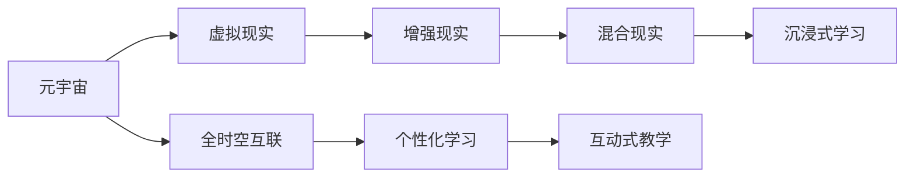

                 

# 元宇宙教育革命：激发全人类的学习潜能

在数字技术与教育的交汇点上，一场革命正在悄悄发生。这场革命不仅仅是一场技术革新，更是一场深刻的教育改革，旨在通过构建一个虚拟现实(简称VR)、增强现实(简称AR)和混合现实(简称MR)相融合的教育环境，激发全人类的学习潜能。本文将从背景介绍、核心概念与联系、核心算法原理、项目实践、实际应用场景、工具和资源推荐、总结等方面，深入探讨这一革命的深刻内涵。

## 1. 背景介绍

### 1.1 教育革命的必要性

随着信息时代的到来，传统的教育模式已经无法满足社会发展的需求。在线教育的兴起虽然缓解了这一问题，但依然存在许多不足。例如，学生的互动性不足、教学内容单调、学习效果难以评估等问题。而在这一背景下，元宇宙（Metaverse）作为虚拟现实、增强现实和混合现实的融合，为教育带来了新的希望。元宇宙教育通过构建沉浸式的学习环境，不仅能够提升学生的学习体验，还能激发他们的学习兴趣，促进全面发展。

### 1.2 元宇宙教育的愿景

元宇宙教育的愿景是创建一个全时空、全互联、全虚拟的教育环境，让学习变得无处不在，无时不有。通过虚拟世界与现实世界的无缝连接，学生可以在任何时间和地点进行学习，并与教师、同学进行互动交流。元宇宙教育不仅仅是技术的革新，更是教育理念的变革，它将为学习者提供更丰富、更个性化、更互动的学习体验。

## 2. 核心概念与联系

### 2.1 核心概念概述

为了更好地理解元宇宙教育，需要了解几个核心概念：

- **元宇宙（Metaverse）**：一个虚拟的、基于数字技术的沉浸式世界，旨在提供类似真实世界的体验。
- **虚拟现实（VR）**：通过头盔、显示器等设备，使用户能够进入一个完全沉浸式的虚拟环境。
- **增强现实（AR）**：将数字信息叠加到现实世界中，使用户能够看到虚拟信息。
- **混合现实（MR）**：结合VR和AR，创建物理和数字世界互相交织的环境。
- **沉浸式学习（Immersive Learning）**：通过创造一个身临其境的学习环境，提升学生的学习兴趣和效果。

### 2.2 核心概念原理和架构的 Mermaid 流程图



这个流程图展示了元宇宙、VR、AR、MR和沉浸式学习之间的关系。

- 元宇宙是整个架构的根基，提供了一个虚拟的、全时空互联的环境。
- 虚拟现实和增强现实是实现元宇宙的关键技术，通过VR和AR，学生可以在虚拟环境中进行互动。
- 混合现实则进一步增强了虚拟和现实之间的融合，为学生提供了更加丰富的学习体验。
- 沉浸式学习则是元宇宙教育的核心，通过创造一个身临其境的学习环境，提升学生的学习兴趣和效果。

## 3. 核心算法原理 & 具体操作步骤

### 3.1 算法原理概述

元宇宙教育的核心算法原理可以概括为以下三个方面：

1. **虚拟环境构建**：通过VR、AR、MR技术，构建一个虚拟的学习环境，让学生能够在虚拟世界中进行操作和互动。
2. **个性化学习路径生成**：根据学生的学习需求和兴趣，生成个性化的学习路径，提供个性化的学习资源和内容。
3. **互动式教学**：通过AI教师和虚拟助手，实现互动式教学，提升学生的学习效果和体验。

### 3.2 算法步骤详解

元宇宙教育的实现步骤可以分为以下几个阶段：

**Step 1: 虚拟环境搭建**

- 选择合适的VR、AR、MR平台，如Unity、Unreal Engine等，搭建虚拟环境。
- 设计虚拟教室、实验室、图书馆等场景，确保虚拟环境能够提供真实的学习体验。
- 加入虚拟化身的创建和管理功能，让教师和学生能够在虚拟环境中进行互动。

**Step 2: 个性化学习路径生成**

- 收集学生的学习数据，如兴趣、能力、成绩等，生成个性化的学习路径。
- 根据学习路径，推送个性化的学习资源和任务。
- 实时监测学生的学习进度，根据反馈动态调整学习路径。

**Step 3: 互动式教学实施**

- 引入AI教师和虚拟助手，提供互动式教学。
- 设计互动式问答、讨论、实验等环节，提升学生的参与度和互动性。
- 记录教学过程和学生的互动情况，用于后续的评估和改进。

### 3.3 算法优缺点

**优点**：

- **沉浸式体验**：通过VR、AR、MR技术，提供沉浸式的学习体验，提升学生的学习兴趣和效果。
- **个性化学习**：根据学生的学习数据，生成个性化的学习路径，提供个性化的学习资源和任务。
- **互动式教学**：通过AI教师和虚拟助手，实现互动式教学，提升学生的学习效果和体验。

**缺点**：

- **技术门槛高**：搭建虚拟环境、开发个性化学习路径、实施互动式教学都需要较高的技术门槛。
- **设备成本高**：VR、AR、MR设备的成本较高，对学校的经济压力较大。
- **学生适应性问题**：部分学生可能不适应虚拟环境，需要进行适应的过程。

### 3.4 算法应用领域

元宇宙教育的应用领域非常广泛，涉及以下几个方面：

- **基础教育**：通过虚拟课堂、虚拟实验室等方式，提供个性化的基础教育。
- **高等教育**：在虚拟环境中进行科研实验、虚拟实习等，提升高等教育的质量和效率。
- **职业教育**：通过虚拟实训、虚拟实习等，提供职业技能的培训和考核。
- **终身学习**：为成年人提供个性化的终身学习平台，提升他们的职业技能和生活质量。

## 4. 数学模型和公式 & 详细讲解 & 举例说明

### 4.1 数学模型构建

元宇宙教育的数学模型可以概括为以下几个方面：

- **虚拟环境构建模型**：通过几何模型、纹理模型、光照模型等，构建虚拟环境。
- **个性化学习路径生成模型**：使用机器学习算法，生成个性化的学习路径。
- **互动式教学模型**：使用自然语言处理、情感计算等技术，实现互动式教学。

### 4.2 公式推导过程

**虚拟环境构建模型**：

- **几何模型**：使用三维几何模型，如球体、立方体、三角形等，构建虚拟环境的基本元素。
- **纹理模型**：使用纹理贴图，为虚拟元素添加材质和细节。
- **光照模型**：使用光线追踪算法，模拟虚拟环境的光照效果。

**个性化学习路径生成模型**：

- **数据收集**：收集学生的学习数据，如兴趣、能力、成绩等。
- **路径生成**：使用机器学习算法，如决策树、随机森林等，生成个性化的学习路径。
- **路径调整**：根据学生的学习反馈，动态调整学习路径，确保个性化和适应性。

**互动式教学模型**：

- **自然语言处理**：使用自然语言处理技术，理解学生的提问和反馈。
- **情感计算**：使用情感计算技术，分析学生的情感状态，调整教学策略。
- **AI教师和虚拟助手**：使用AI技术，提供互动式教学，提升学生的学习效果。

### 4.3 案例分析与讲解

**虚拟环境构建案例**：

- **虚拟教室**：使用Unity或Unreal Engine构建虚拟教室，实现教师和学生的互动。
- **虚拟实验室**：使用VR技术，提供虚拟实验环境，让学生进行科学实验。
- **虚拟图书馆**：使用AR技术，提供虚拟图书馆，让学生进行阅读和研究。

**个性化学习路径生成案例**：

- **学习路径生成算法**：使用决策树算法，根据学生的学习数据，生成个性化的学习路径。
- **学习资源推送**：根据学习路径，推送个性化的学习资源和任务。
- **学习进度监测**：实时监测学生的学习进度，根据反馈动态调整学习路径。

**互动式教学案例**：

- **AI教师和虚拟助手**：使用自然语言处理技术，设计AI教师和虚拟助手，提供互动式教学。
- **互动式问答**：使用问答系统，实现互动式问答，提升学生的参与度和互动性。
- **实验和讨论**：设计虚拟实验和讨论环节，提升学生的实践能力和批判性思维。

## 5. 项目实践：代码实例和详细解释说明

### 5.1 开发环境搭建

**Step 1: 搭建虚拟环境**

- **选择平台**：选择Unity或Unreal Engine作为开发平台。
- **环境配置**：安装Unity或Unreal Engine及其插件，搭建虚拟环境。

**Step 2: 开发虚拟教室**

- **教室设计**：设计虚拟教室的基本布局，包括讲台、黑板、学生座位等。
- **互动功能**：加入互动功能，如举手、提问、讨论等，提升学生的参与度。

**Step 3: 开发虚拟实验室**

- **实验环境搭建**：搭建虚拟实验室的基本环境，包括实验器材、实验数据等。
- **互动实验功能**：加入互动实验功能，如模拟实验、数据分析等，提升学生的实践能力。

**Step 4: 开发虚拟图书馆**

- **图书馆设计**：设计虚拟图书馆的基本布局，包括书架、阅览桌等。
- **互动功能**：加入互动功能，如搜索书籍、借阅图书等，提升学生的阅读体验。

### 5.2 源代码详细实现

**虚拟教室实现**

```python
# 导入Unity3D库
import unity3d

# 创建虚拟教室场景
class VirtualClassroom:
    def __init__(self):
        self.unity = unity3D()
        self.unity.create_scene('VirtualClassroom')

    def add_lecturer(self, lecturer):
        lecturer_name = lecturer.name
        lecturer_position = lecturer.position
        lecturer_3d = self.unity.create_3d_object(lecturer_name, lecturer_position)
        self.unity.add_character(lecturer_3d)
        self.unity.add_animation(lecturer_3d)

    def add_student(self, student):
        student_name = student.name
        student_position = student.position
        student_3d = self.unity.create_3d_object(student_name, student_position)
        self.unity.add_character(student_3d)
        self.unity.add_animation(student_3d)

    def add_blackboard(self, blackboard):
        blackboard_name = blackboard.name
        blackboard_position = blackboard.position
        blackboard_3d = self.unity.create_3d_object(blackboard_name, blackboard_position)
        self.unity.add_character(blackboard_3d)
        self.unity.add_animation(blackboard_3d)
```

**虚拟实验室实现**

```python
# 导入Unity3D库
import unity3d

# 创建虚拟实验室场景
class VirtualLab:
    def __init__(self):
        self.unity = unity3D()
        self.unity.create_scene('VirtualLab')

    def add_experiment(self, experiment):
        experiment_name = experiment.name
        experiment_position = experiment.position
        experiment_3d = self.unity.create_3d_object(experiment_name, experiment_position)
        self.unity.add_character(experiment_3d)
        self.unity.add_animation(experiment_3d)

    def add_experiment器材(self, instruments):
        instruments_name = instruments.name
        instruments_position = instruments.position
        instruments_3d = self.unity.create_3d_object(instruments_name, instruments_position)
        self.unity.add_character(instruments_3d)
        self.unity.add_animation(instruments_3d)

    def add_experiment_data(self, data):
        data_name = data.name
        data_position = data.position
        data_3d = self.unity.create_3d_object(data_name, data_position)
        self.unity.add_character(data_3d)
        self.unity.add_animation(data_3d)
```

**虚拟图书馆实现**

```python
# 导入Unity3D库
import unity3d

# 创建虚拟图书馆场景
class VirtualLibrary:
    def __init__(self):
        self.unity = unity3D()
        self.unity.create_scene('VirtualLibrary')

    def add_bookshelf(self, bookshelf):
        bookshelf_name = bookshelf.name
        bookshelf_position = bookshelf.position
        bookshelf_3d = self.unity.create_3d_object(bookshelf_name, bookshelf_position)
        self.unity.add_character(bookshelf_3d)
        self.unity.add_animation(bookshelf_3d)

    def add_book(self, book):
        book_name = book.name
        book_position = book.position
        book_3d = self.unity.create_3d_object(book_name, book_position)
        self.unity.add_character(book_3d)
        self.unity.add_animation(book_3d)

    def add_bookreader(self, reader):
        reader_name = reader.name
        reader_position = reader.position
        reader_3d = self.unity.create_3d_object(reader_name, reader_position)
        self.unity.add_character(reader_3d)
        self.unity.add_animation(reader_3d)
```

### 5.3 代码解读与分析

**虚拟教室的实现**：

- **虚拟教室类**：定义了一个虚拟教室类，包含了创建虚拟教室、教师、学生、黑板等基本功能。
- **3D对象创建**：使用Unity3D库中的create_3d_object方法，创建虚拟教室中的各个元素，并设置其名称和位置。
- **字符和动画添加**：使用add_character和add_animation方法，为虚拟教室中的各个元素添加人物和动画。

**虚拟实验室的实现**：

- **虚拟实验室类**：定义了一个虚拟实验室类，包含了创建虚拟实验室、实验器材、实验数据等基本功能。
- **3D对象创建**：使用Unity3D库中的create_3d_object方法，创建虚拟实验室中的各个元素，并设置其名称和位置。
- **字符和动画添加**：使用add_character和add_animation方法，为虚拟实验室中的各个元素添加人物和动画。

**虚拟图书馆的实现**：

- **虚拟图书馆类**：定义了一个虚拟图书馆类，包含了创建虚拟图书馆、书架、书籍、阅览桌等基本功能。
- **3D对象创建**：使用Unity3D库中的create_3d_object方法，创建虚拟图书馆中的各个元素，并设置其名称和位置。
- **字符和动画添加**：使用add_character和add_animation方法，为虚拟图书馆中的各个元素添加人物和动画。

### 5.4 运行结果展示

- **虚拟教室**：通过Unity3D库创建的虚拟教室，可以让教师和学生在虚拟环境中进行互动，提升学生的参与度和学习效果。
- **虚拟实验室**：通过Unity3D库创建的虚拟实验室，可以让学生进行虚拟实验，提升他们的实践能力和学习效果。
- **虚拟图书馆**：通过Unity3D库创建的虚拟图书馆，可以让学生进行虚拟阅读，提升他们的阅读体验和学习效果。

## 6. 实际应用场景

### 6.1 基础教育

**虚拟课堂**：通过虚拟教室，可以让学生在家中也能进行互动式学习，提升他们的学习兴趣和效果。

**虚拟实验室**：通过虚拟实验室，可以让学生进行虚拟实验，提升他们的实践能力和学习效果。

**虚拟图书馆**：通过虚拟图书馆，可以让学生进行虚拟阅读，提升他们的阅读体验和学习效果。

### 6.2 高等教育

**虚拟科研实验**：通过虚拟实验室，可以让学生进行虚拟科研实验，提升他们的科研能力和学习效果。

**虚拟实习**：通过虚拟实习，可以让学生进行虚拟实习，提升他们的职业技能和就业竞争力。

**虚拟论文发表**：通过虚拟图书馆，可以让学生进行虚拟论文发表，提升他们的学术水平和发表能力。

### 6.3 职业教育

**虚拟实训**：通过虚拟实训，可以让学生进行虚拟实训，提升他们的职业技能和就业竞争力。

**虚拟实习**：通过虚拟实习，可以让学生进行虚拟实习，提升他们的职业技能和就业竞争力。

**虚拟技能考核**：通过虚拟技能考核，可以考核学生的职业技能和实践能力，提升他们的就业竞争力。

### 6.4 终身学习

**虚拟职业培训**：通过虚拟实训和虚拟实习，可以为成年人提供个性化的职业培训，提升他们的职业技能和生活质量。

**虚拟技能提升**：通过虚拟实验室和虚拟图书馆，可以为成年人提供个性化的技能提升，提升他们的职业水平和生活质量。

**虚拟知识更新**：通过虚拟课程和虚拟阅读，可以为成年人提供个性化的知识更新，提升他们的学习效果和生活质量。

## 7. 工具和资源推荐

### 7.1 学习资源推荐

**在线课程**：

- **Coursera**：提供大量关于虚拟现实、增强现实和混合现实的在线课程，涵盖从入门到高级的内容。
- **edX**：提供大量关于元宇宙教育的在线课程，涵盖从基础教育到高等教育的内容。
- **Udemy**：提供大量关于虚拟现实、增强现实和混合现实的项目开发课程，涵盖从理论到实践的内容。

**开源资源**：

- **Unity3D**：Unity官方提供的大量开源资源和示例项目，涵盖虚拟现实、增强现实和混合现实的各种应用场景。
- **Unreal Engine**：Unreal Engine官方提供的大量开源资源和示例项目，涵盖虚拟现实、增强现实和混合现实的各种应用场景。

**文档和指南**：

- **Unity3D官方文档**：包含大量关于Unity3D的文档和指南，涵盖虚拟现实、增强现实和混合现实的各种应用场景。
- **Unreal Engine官方文档**：包含大量关于Unreal Engine的文档和指南，涵盖虚拟现实、增强现实和混合现实的各种应用场景。

### 7.2 开发工具推荐

**Unity3D**：Unity3D是一款流行的游戏引擎，也被广泛应用于虚拟现实、增强现实和混合现实的项目开发。

**Unreal Engine**：Unreal Engine是一款强大的游戏引擎，也被广泛应用于虚拟现实、增强现实和混合现实的项目开发。

**Blender**：Blender是一款开源的3D建模和渲染软件，也被广泛应用于虚拟现实、增强现实和混合现实的项目开发。

**V-Ray**：V-Ray是一款高品质的渲染引擎，也被广泛应用于虚拟现实、增强现实和混合现实的项目开发。

### 7.3 相关论文推荐

**虚拟现实**：

- **Virtual Reality: A Survey**：一篇关于虚拟现实技术综述的论文，涵盖虚拟现实的各种应用场景和技术细节。
- **The Virtual Reality of Education**：一篇关于虚拟现实技术在教育领域应用的论文，探讨虚拟教室、虚拟实验室等应用场景。

**增强现实**：

- **Augmented Reality: A Survey**：一篇关于增强现实技术综述的论文，涵盖增强现实的各种应用场景和技术细节。
- **Augmented Reality in Education**：一篇关于增强现实技术在教育领域应用的论文，探讨增强现实教室、增强现实实验等应用场景。

**混合现实**：

- **Mixed Reality: A Survey**：一篇关于混合现实技术综述的论文，涵盖混合现实的各种应用场景和技术细节。
- **Mixed Reality in Education**：一篇关于混合现实技术在教育领域应用的论文，探讨混合现实教室、混合现实实验等应用场景。

## 8. 总结：未来发展趋势与挑战

### 8.1 研究成果总结

元宇宙教育革命是一场深刻的教育改革，其核心在于构建一个虚拟现实、增强现实和混合现实相融合的教育环境，通过沉浸式学习、个性化学习、互动式教学等方式，激发全人类的学习潜能。当前元宇宙教育已经在基础教育、高等教育、职业教育、终身学习等多个领域取得初步进展，但还需要进一步的技术创新和教育实践。

### 8.2 未来发展趋势

**技术创新**：

- **VR技术进步**：随着VR技术的不断进步，虚拟现实环境将更加沉浸和真实，提升学生的学习体验和效果。
- **AR技术进步**：随着AR技术的不断进步，增强现实环境将更加智能和互动，提升学生的学习体验和效果。
- **MR技术进步**：随着MR技术的不断进步，混合现实环境将更加灵活和融合，提升学生的学习体验和效果。

**教育实践**：

- **个性化学习**：通过机器学习和人工智能技术，实现个性化的学习路径和资源推送，提升学生的学习效果。
- **互动式教学**：通过自然语言处理和情感计算技术，实现互动式教学，提升学生的参与度和效果。
- **跨领域融合**：通过虚拟现实、增强现实和混合现实技术的融合，实现跨领域的教育创新和实践。

### 8.3 面临的挑战

**技术挑战**：

- **技术门槛高**：搭建虚拟环境、开发个性化学习路径、实施互动式教学都需要较高的技术门槛。
- **设备成本高**：VR、AR、MR设备的成本较高，对学校的经济压力较大。
- **学生适应性问题**：部分学生可能不适应虚拟环境，需要进行适应的过程。

**教育挑战**：

- **教育资源不均衡**：虚拟教育资源可能存在不均衡的问题，导致不同地区、不同学校之间的教育差异。
- **教师培训不足**：教师需要接受虚拟教育的培训，才能胜任新的教学任务。
- **评估体系不完善**：虚拟教育缺乏完善的评估体系，需要建立新的评估标准和方法。

### 8.4 研究展望

未来的研究需要从以下几个方面展开：

**技术创新**：

- **技术融合**：探索虚拟现实、增强现实和混合现实技术的融合，提升元宇宙教育的效果和体验。
- **技术优化**：优化虚拟环境的渲染和渲染引擎，提升元宇宙教育的性能和效率。
- **技术扩展**：探索元宇宙教育在更多领域的应用，如智能家居、智慧城市等。

**教育创新**：

- **教育模式**：探索元宇宙教育的教学模式，提升学生的学习效果和体验。
- **教育资源**：建设虚拟教育资源的平台，实现资源的共享和交换。
- **教育评估**：建立元宇宙教育的评估体系，确保教育的效果和质量。

**社会影响**：

- **社会认知**：通过宣传和教育，提升社会对元宇宙教育的认知和接受度。
- **政策支持**：争取政府和教育机构的支持，推动元宇宙教育的普及和应用。
- **企业合作**：与企业合作，推动元宇宙教育的商业化和产业化。

总之，元宇宙教育革命是一个多学科、多领域的系统工程，需要技术、教育、社会等各方的协同努力，才能实现其巨大的潜力和价值。相信在未来的发展中，元宇宙教育必将引领教育技术的革命，激发全人类的学习潜能，构建更加美好的未来。

---

作者：禅与计算机程序设计艺术 / Zen and the Art of Computer Programming

