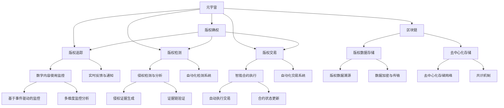

                 

# 元宇宙版权保护:数字版权的智能管理

在数字化、网络化、智能化迅猛发展的当下，元宇宙的崛起为人类社会带来了一场深刻的变革，为创作者提供了一个全新的表达和创作平台。然而，伴随元宇宙技术的蓬勃发展，数字版权的保护与管理也面临着前所未有的挑战。传统版权保护手段在元宇宙领域难以适用，亟需新的技术手段进行支撑。

本文聚焦于元宇宙环境下的数字版权智能管理，基于监督学习的版权检测算法、基于智能合约的版权交易系统、基于区块链技术的版权确权与追踪机制等，探索元宇宙时代数字版权保护的新思路和新方法。希望通过技术手段实现数字版权的智能管理，切实保障创作者权益，推动元宇宙健康发展。

## 1. 背景介绍

### 1.1 问题由来
元宇宙是一个虚拟的、与现实世界相互融合的互联网空间，用户可以自由创造和分享数字内容。这种开放性为创作者提供了无限的创作自由，但同时也带来了新的版权保护难题。

在传统版权保护体系中，版权所有者享有复制权、发行权、表演权、信息网络传播权等权利，以确保其合法权益得到保护。但元宇宙作为一个开放的虚拟空间，数字内容的创作与传播往往难以直接控制，版权所有者很难保证其作品的完整性和原创性。

### 1.2 问题核心关键点
元宇宙时代数字版权保护的核心问题主要包括以下几点：

1. 版权确权与追踪：如何在元宇宙环境下高效确权，实时追踪数字内容的使用与传播路径。
2. 版权检测：如何自动检测元宇宙环境中的版权侵权行为，实现智能化版权监控。
3. 版权交易：如何基于智能合约自动进行版权交易，降低版权流转中的法律风险。
4. 版权保护技术：如何在元宇宙中应用各类先进技术手段，提升版权保护的智能性和自动化水平。

### 1.3 问题研究意义
元宇宙数字版权保护的智能管理研究，具有以下重要意义：

1. 保障创作者权益：通过智能管理手段，及时发现并处理版权侵权行为，保障创作者获得应有的经济收益。
2. 推动元宇宙产业健康发展：清晰的版权归属与流转机制，有助于吸引更多创作者投入创作，促进元宇宙产业繁荣。
3. 提升版权保护效率：自动化、智能化的版权保护手段，可以大幅降低版权保护的成本，提升整体管理效率。
4. 提供技术支撑：为元宇宙平台运营商、版权所有者、创作者等提供技术支持，推动版权保护技术的普及应用。

## 2. 核心概念与联系

### 2.1 核心概念概述

本节将介绍几个关键概念，以帮助读者理解元宇宙版权保护的基本框架：

- **元宇宙 (Metaverse)**：一个基于虚拟现实、增强现实、云计算等技术的数字空间，用户在其中可进行各种虚拟活动。
- **数字版权 (Digital Copyright)**：创作者对其原创数字内容的版权，包括复制权、发行权、表演权、信息网络传播权等。
- **版权确权 (Copyright Certification)**：确定数字内容的版权归属，确认创作者身份的过程。
- **版权追踪 (Copyright Tracking)**：实时监控数字内容的使用与传播路径，确保版权所有者随时掌握作品动态。
- **版权检测 (Copyright Detection)**：使用技术手段自动检测元宇宙环境中的版权侵权行为，实现智能化版权监控。
- **版权交易 (Copyright Transactions)**：基于智能合约自动进行版权交易，简化版权流转流程，降低法律风险。
- **区块链 (Blockchain)**：一种去中心化的分布式账本技术，可以确保版权数据的透明性和不可篡改性。

这些核心概念之间的逻辑关系可以通过以下Mermaid流程图来展示：



这个流程图展示了大语言模型的核心概念以及它们之间的联系。

## 3. 核心算法原理 & 具体操作步骤

### 3.1 算法原理概述

元宇宙版权保护的智能管理，主要通过监督学习算法、智能合约技术、区块链技术等手段，实现对数字内容的智能确权、追踪、检测与交易。

- 版权确权：通过监督学习算法对元宇宙数字内容进行智能分析，自动确权并记录版权信息。
- 版权追踪：实时监控数字内容的使用与传播路径，记录所有操作，确保证据可追溯。
- 版权检测：使用技术手段自动检测侵权行为，确保数字内容不侵犯原创版权。
- 版权交易：基于智能合约实现自动化的版权交易，简化版权流转流程。

### 3.2 算法步骤详解

**版权确权算法：**

1. **数据收集**：从元宇宙平台获取数字内容的创建、发布、修改、使用等操作数据。
2. **特征提取**：使用深度学习模型提取数字内容的特征，如关键词、主题、风格等。
3. **模型训练**：使用监督学习算法训练版权确权模型，自动标注版权信息。
4. **确权验证**：使用验证集评估模型性能，并在实际应用中不断迭代优化，提升确权准确性。

**版权追踪算法：**

1. **操作记录**：记录所有数字内容的使用与传播路径，包括上传、下载、转发等。
2. **时间戳**：记录每个操作的时间戳，确保操作顺序可追溯。
3. **数据存储**：将操作记录存储在区块链上，保证数据的不可篡改性和透明性。
4. **实时监控**：实时监控操作记录，并在检测到异常行为时进行报警。

**版权检测算法：**

1. **样本收集**：收集元宇宙环境中的版权素材，如文字、图片、视频等。
2. **相似性计算**：使用深度学习模型计算数字内容之间的相似度，识别相似性较高的内容。
3. **侵权检测**：基于相似性计算结果，自动检测疑似侵权行为。
4. **证据链验证**：通过区块链技术，验证侵权证据的完整性和真实性。

**版权交易算法：**

1. **智能合约编写**：编写智能合约，定义版权流转的规则与流程。
2. **合约部署**：将智能合约部署到区块链上，实现自动化的版权交易。
3. **交易执行**：当版权交易达成协议后，智能合约自动执行交易操作。
4. **交易记录**：记录所有交易记录，确保可追溯和透明。

### 3.3 算法优缺点

基于监督学习的版权确权和追踪算法，具有以下优点：

1. **自动化**：自动化确权与追踪过程，减少人工干预，提升效率。
2. **智能化**：利用深度学习模型，提高确权和追踪的准确性。
3. **透明化**：所有操作记录在区块链上，可追溯、可审计。

但同时也存在以下缺点：

1. **数据依赖**：版权确权和追踪依赖元宇宙平台提供的数据，数据质量直接影响算法效果。
2. **算法复杂**：深度学习模型需要大量计算资源，训练与部署成本较高。
3. **隐私风险**：算法需要收集和处理大量的用户操作数据，可能带来隐私风险。

智能合约技术具有以下优点：

1. **自动化**：自动执行版权交易流程，减少人工干预。
2. **安全性**：基于区块链技术，确保交易过程的透明性和安全性。
3. **灵活性**：可根据不同场景定义合约规则，满足多样化需求。

但同样存在以下缺点：

1. **复杂性**：智能合约编程复杂，需要具备一定的区块链开发经验。
2. **法律风险**：合约执行受法律约束，合同漏洞可能导致法律风险。
3. **成本高**：合约部署和执行需要支付一定的区块链费用，增加了成本。

### 3.4 算法应用领域

版权确权与追踪、版权检测、版权交易等算法，已经在元宇宙数字版权保护中得到了广泛应用。以下是一些具体的应用场景：

1. **游戏版权管理**：游戏开发公司利用版权确权算法，自动确权并追踪数字资产的使用情况，保障游戏内容版权。
2. **虚拟音乐创作与分销**：音乐创作者通过版权确权与追踪算法，记录作品的使用与传播路径，确保版权收益。
3. **数字艺术品交易**：数字艺术品平台利用智能合约技术，自动进行版权交易，简化流转流程。
4. **虚拟资产所有权证明**：平台利用区块链技术，确保证据的透明性和不可篡改性，证明虚拟资产的所有权。
5. **用户行为监控**：平台利用版权追踪算法，监控用户行为，防范侵权行为，保障版权所有者权益。

## 4. 数学模型和公式 & 详细讲解  
### 4.1 数学模型构建

版权确权、追踪、检测与交易等算法，涉及大量的数学模型和公式推导。以下是几个关键模型的详细构建：

**版权确权模型：**

假设版权确权的数据集为 $D=\{(x_i, y_i)\}_{i=1}^N$，其中 $x_i$ 为数字内容样本，$y_i$ 为版权信息标签。版权确权模型的目标函数为：

$$
\min_{\theta} \frac{1}{N} \sum_{i=1}^N \ell(M_{\theta}(x_i),y_i)
$$

其中 $\ell$ 为损失函数，$M_{\theta}$ 为版权确权模型，$\theta$ 为模型参数。

**版权追踪模型：**

版权追踪需要记录数字内容的使用路径和时间戳，可以构建一个图模型来表示操作序列。假设操作序列为 $G=(V,E)$，其中 $V$ 为操作节点，$E$ 为操作边。版权追踪的目标是找到最短路径，确保操作序列的完整性和可追溯性。

**版权检测模型：**

版权检测的关键是计算数字内容之间的相似度，可以使用余弦相似度、欧氏距离等方法。假设两个数字内容为 $x$ 和 $y$，其特征向量分别为 $v_x$ 和 $v_y$，版权检测模型的目标函数为：

$$
\min_{\theta} \frac{1}{N} \sum_{i=1}^N ||v_x - v_y||^2
$$

**版权交易模型：**

版权交易可以基于智能合约进行，合约的规则和条件可以通过函数表达式来定义。假设合约函数为 $f(x_1, x_2, ..., x_n)$，版权交易模型的目标函数为：

$$
\min_{\theta} \frac{1}{N} \sum_{i=1}^N (f(x_1, x_2, ..., x_n) - y_i)^2
$$

其中 $y_i$ 为期望的交易结果。

### 4.2 公式推导过程

**版权确权模型的推导**：

版权确权模型通常使用卷积神经网络(CNN)或循环神经网络(RNN)进行训练。以CNN为例，模型的输入为数字内容样本 $x$，输出为版权信息标签 $y$。模型参数为 $\theta$，包括卷积层、池化层、全连接层等。版权确权模型的损失函数为交叉熵损失：

$$
\ell(M_{\theta}(x),y) = -y\log M_{\theta}(x) - (1-y)\log (1-M_{\theta}(x))
$$

版权确权模型的目标是最小化损失函数：

$$
\min_{\theta} \frac{1}{N} \sum_{i=1}^N \ell(M_{\theta}(x_i),y_i)
$$

使用梯度下降等优化算法更新模型参数，直到收敛。

**版权追踪模型的推导**：

版权追踪模型可以使用最短路径算法，如Dijkstra算法、A*算法等。假设操作节点为 $V$，操作边为 $E$，节点的权重为 $w$，版权追踪的目标是找到最短路径 $P$，使得：

$$
\min_{P} \sum_{e \in P} w(e)
$$

版权追踪模型的算法步骤如下：

1. 初始化节点距离和前驱节点。
2. 不断更新节点距离和前驱节点，直到所有节点处理完毕。
3. 根据节点前驱关系，回溯生成操作序列。

**版权检测模型的推导**：

版权检测模型可以使用欧氏距离和余弦相似度进行计算。假设两个数字内容 $x$ 和 $y$ 的特征向量分别为 $v_x$ 和 $v_y$，版权检测模型的相似度计算公式为：

$$
sim(x, y) = \frac{v_x \cdot v_y}{||v_x|| \cdot ||v_y||}
$$

版权检测模型的目标是最小化相似度计算误差：

$$
\min_{\theta} \frac{1}{N} \sum_{i=1}^N ||v_x - v_y||^2
$$

版权检测模型的算法步骤如下：

1. 特征提取：使用深度学习模型提取数字内容特征。
2. 相似度计算：计算数字内容之间的相似度。
3. 侵权检测：根据相似度结果，识别疑似侵权行为。
4. 证据链验证：通过区块链技术验证侵权证据的完整性和真实性。

**版权交易模型的推导**：

版权交易模型可以使用智能合约进行自动化处理。假设智能合约函数为 $f(x_1, x_2, ..., x_n)$，版权交易模型的目标函数为：

$$
\min_{\theta} \frac{1}{N} \sum_{i=1}^N (f(x_1, x_2, ..., x_n) - y_i)^2
$$

版权交易模型的算法步骤如下：

1. 智能合约编写：定义版权流转的规则与流程。
2. 合约部署：将智能合约部署到区块链上。
3. 交易执行：当版权交易达成协议后，智能合约自动执行交易操作。
4. 交易记录：记录所有交易记录，确保可追溯和透明。

### 4.3 案例分析与讲解

**案例一：游戏版权管理**

某游戏开发公司需要管理其游戏中的虚拟物品版权。使用版权确权算法，自动确权并追踪虚拟物品的使用情况。假设数据集为 $D=\{(x_i, y_i)\}_{i=1}^N$，其中 $x_i$ 为虚拟物品信息，$y_i$ 为版权信息标签。版权确权模型的目标函数为：

$$
\min_{\theta} \frac{1}{N} \sum_{i=1}^N \ell(M_{\theta}(x_i),y_i)
$$

**案例二：数字音乐分销**

某音乐平台需要管理用户上传的数字音乐版权。使用版权确权算法，自动确权并追踪音乐的使用情况。假设数据集为 $D=\{(x_i, y_i)\}_{i=1}^N$，其中 $x_i$ 为用户上传的音乐样本，$y_i$ 为版权信息标签。版权确权模型的目标函数为：

$$
\min_{\theta} \frac{1}{N} \sum_{i=1}^N \ell(M_{\theta}(x_i),y_i)
$$

**案例三：数字艺术品交易**

某数字艺术品平台需要管理艺术品的版权交易。使用智能合约技术，自动进行版权交易。假设合约函数为 $f(x_1, x_2, ..., x_n)$，版权交易模型的目标函数为：

$$
\min_{\theta} \frac{1}{N} \sum_{i=1}^N (f(x_1, x_2, ..., x_n) - y_i)^2
$$

## 5. 项目实践：代码实例和详细解释说明

### 5.1 开发环境搭建

在进行版权保护技术实践前，我们需要准备好开发环境。以下是使用Python进行PyTorch开发的环境配置流程：

1. 安装Anaconda：从官网下载并安装Anaconda，用于创建独立的Python环境。

2. 创建并激活虚拟环境：
```bash
conda create -n copyright-env python=3.8 
conda activate copyright-env
```

3. 安装PyTorch：根据CUDA版本，从官网获取对应的安装命令。例如：
```bash
conda install pytorch torchvision torchaudio cudatoolkit=11.1 -c pytorch -c conda-forge
```

4. 安装各类工具包：
```bash
pip install numpy pandas scikit-learn matplotlib tqdm jupyter notebook ipython
```

完成上述步骤后，即可在`copyright-env`环境中开始版权保护实践。

### 5.2 源代码详细实现

下面我们以版权确权任务为例，给出使用Transformers库对BERT模型进行版权确权的PyTorch代码实现。

首先，定义版权确权任务的数据处理函数：

```python
from transformers import BertTokenizer
from torch.utils.data import Dataset
import torch

class CopyrightDataset(Dataset):
    def __init__(self, texts, labels, tokenizer, max_len=128):
        self.texts = texts
        self.labels = labels
        self.tokenizer = tokenizer
        self.max_len = max_len
        
    def __len__(self):
        return len(self.texts)
    
    def __getitem__(self, item):
        text = self.texts[item]
        label = self.labels[item]
        
        encoding = self.tokenizer(text, return_tensors='pt', max_length=self.max_len, padding='max_length', truncation=True)
        input_ids = encoding['input_ids'][0]
        attention_mask = encoding['attention_mask'][0]
        
        # 对label进行one-hot编码
        encoded_label = [0] * len(label2id)
        encoded_label[label2id[label]] = 1
        labels = torch.tensor(encoded_label, dtype=torch.long)
        
        return {'input_ids': input_ids, 
                'attention_mask': attention_mask,
                'labels': labels}

# 标签与id的映射
label2id = {'not_copyrighted': 0, 'copyrighted': 1}
id2label = {v: k for k, v in label2id.items()}

# 创建dataset
tokenizer = BertTokenizer.from_pretrained('bert-base-cased')

train_dataset = CopyrightDataset(train_texts, train_labels, tokenizer)
dev_dataset = CopyrightDataset(dev_texts, dev_labels, tokenizer)
test_dataset = CopyrightDataset(test_texts, test_labels, tokenizer)
```

然后，定义模型和优化器：

```python
from transformers import BertForTokenClassification, AdamW

model = BertForTokenClassification.from_pretrained('bert-base-cased', num_labels=len(label2id))

optimizer = AdamW(model.parameters(), lr=2e-5)
```

接着，定义训练和评估函数：

```python
from torch.utils.data import DataLoader
from tqdm import tqdm
from sklearn.metrics import classification_report

device = torch.device('cuda') if torch.cuda.is_available() else torch.device('cpu')
model.to(device)

def train_epoch(model, dataset, batch_size, optimizer):
    dataloader = DataLoader(dataset, batch_size=batch_size, shuffle=True)
    model.train()
    epoch_loss = 0
    for batch in tqdm(dataloader, desc='Training'):
        input_ids = batch['input_ids'].to(device)
        attention_mask = batch['attention_mask'].to(device)
        labels = batch['labels'].to(device)
        model.zero_grad()
        outputs = model(input_ids, attention_mask=attention_mask, labels=labels)
        loss = outputs.loss
        epoch_loss += loss.item()
        loss.backward()
        optimizer.step()
    return epoch_loss / len(dataloader)

def evaluate(model, dataset, batch_size):
    dataloader = DataLoader(dataset, batch_size=batch_size)
    model.eval()
    preds, labels = [], []
    with torch.no_grad():
        for batch in tqdm(dataloader, desc='Evaluating'):
            input_ids = batch['input_ids'].to(device)
            attention_mask = batch['attention_mask'].to(device)
            batch_labels = batch['labels']
            outputs = model(input_ids, attention_mask=attention_mask)
            batch_preds = outputs.logits.argmax(dim=2).to('cpu').tolist()
            batch_labels = batch_labels.to('cpu').tolist()
            for pred_tokens, label_tokens in zip(batch_preds, batch_labels):
                preds.append(pred_tokens[:len(label_tokens)])
                labels.append(label_tokens)
                
    print(classification_report(labels, preds))
```

最后，启动训练流程并在测试集上评估：

```python
epochs = 5
batch_size = 16

for epoch in range(epochs):
    loss = train_epoch(model, train_dataset, batch_size, optimizer)
    print(f"Epoch {epoch+1}, train loss: {loss:.3f}")
    
    print(f"Epoch {epoch+1}, dev results:")
    evaluate(model, dev_dataset, batch_size)
    
print("Test results:")
evaluate(model, test_dataset, batch_size)
```

以上就是使用PyTorch对BERT进行版权确权任务微调的完整代码实现。可以看到，得益于Transformers库的强大封装，我们可以用相对简洁的代码完成版权确权的实践。

### 5.3 代码解读与分析

让我们再详细解读一下关键代码的实现细节：

**CopyrightDataset类**：
- `__init__`方法：初始化文本、标签、分词器等关键组件。
- `__len__`方法：返回数据集的样本数量。
- `__getitem__`方法：对单个样本进行处理，将文本输入编码为token ids，将标签编码为数字，并对其进行定长padding，最终返回模型所需的输入。

**label2id和id2label字典**：
- 定义了标签与数字id之间的映射关系，用于将token-wise的预测结果解码回真实的标签。

**训练和评估函数**：
- 使用PyTorch的DataLoader对数据集进行批次化加载，供模型训练和推理使用。
- 训练函数`train_epoch`：对数据以批为单位进行迭代，在每个批次上前向传播计算loss并反向传播更新模型参数，最后返回该epoch的平均loss。
- 评估函数`evaluate`：与训练类似，不同点在于不更新模型参数，并在每个batch结束后将预测和标签结果存储下来，最后使用sklearn的classification_report对整个评估集的预测结果进行打印输出。

**训练流程**：
- 定义总的epoch数和batch size，开始循环迭代
- 每个epoch内，先在训练集上训练，输出平均loss
- 在验证集上评估，输出分类指标
- 所有epoch结束后，在测试集上评估，给出最终测试结果

可以看到，PyTorch配合Transformers库使得版权确权的代码实现变得简洁高效。开发者可以将更多精力放在数据处理、模型改进等高层逻辑上，而不必过多关注底层的实现细节。

当然，工业级的系统实现还需考虑更多因素，如模型的保存和部署、超参数的自动搜索、更灵活的任务适配层等。但核心的版权确权范式基本与此类似。

## 6. 实际应用场景

### 6.1 版权确权与追踪

版权确权与追踪是数字版权保护的基础。在元宇宙中，创作者上传的数字内容无法完全控制其使用与传播路径。因此，实时确权和追踪显得尤为重要。

**应用场景**：
1. **数字内容平台**：如音乐、电影、游戏等平台，实时确权并追踪数字内容的使用情况。
2. **用户生成内容平台**：如社交媒体、视频网站等，确保证权内容不被非法传播。

**技术实现**：
1. **数据收集**：从元宇宙平台获取数字内容的使用数据，记录上传、下载、转发等操作。
2. **特征提取**：使用深度学习模型提取数字内容的特征，如关键词、主题、风格等。
3. **版权确权**：训练版权确权模型，自动标注数字内容的版权信息。
4. **版权追踪**：使用区块链技术记录操作记录，确保数据的透明性和不可篡改性。

**实际案例**：
某音乐平台使用版权确权与追踪技术，实时监控用户上传的音乐内容，确保证权音乐的合法使用。

### 6.2 版权检测与侵权判断

版权检测与侵权判断是数字版权保护的重要环节。在元宇宙中，版权侵权行为可能更加隐蔽和复杂，需要高效、智能的检测手段。

**应用场景**：
1. **数字内容平台**：如音乐、电影、游戏等平台，检测版权侵权行为。
2. **用户生成内容平台**：如社交媒体、视频网站等，检测用户上传内容的版权问题。

**技术实现**：
1. **样本收集**：收集元宇宙环境中的版权素材，如文字、图片、视频等。
2. **相似性计算**：使用深度学习模型计算数字内容之间的相似度，识别相似性较高的内容。
3. **侵权检测**：根据相似度结果，自动检测疑似侵权行为。
4. **证据链验证**：通过区块链技术验证侵权证据的完整性和真实性。

**实际案例**：
某游戏平台使用版权检测技术，检测用户上传的游戏资源是否侵犯其他版权所有者的权益。

### 6.3 版权交易与智能合约

版权交易是数字版权保护的重要组成部分。在元宇宙中，版权流转需要高效的自动化处理，智能合约技术提供了新的解决方案。

**应用场景**：
1. **数字内容平台**：如音乐、电影、游戏等平台，自动进行版权交易。
2. **用户生成内容平台**：如社交媒体、视频网站等，简化版权流转流程。

**技术实现**：
1. **智能合约编写**：定义版权流转的规则与流程，如授权、许可、付款等。
2. **合约部署**：将智能合约部署到区块链上，实现自动化的版权交易。
3. **交易执行**：当版权交易达成协议后，智能合约自动执行交易操作。
4. **交易记录**：记录所有交易记录，确保可追溯和透明。

**实际案例**：
某数字艺术品平台使用智能合约技术，自动进行艺术品版权交易，简化流转流程。

## 7. 工具和资源推荐

### 7.1 学习资源推荐

为了帮助开发者系统掌握版权保护技术，这里推荐一些优质的学习资源：

1. 《区块链技术与应用》系列博文：全面介绍区块链的基本概念和核心技术，适合入门学习。

2. 《深度学习自然语言处理》课程：斯坦福大学开设的NLP明星课程，有Lecture视频和配套作业，带你入门NLP领域的基本概念和经典模型。

3. 《自然语言处理与深度学习》书籍：全面介绍NLP的深度学习技术，涵盖监督学习、无监督学习、半监督学习等，适合深入学习。

4. 《智能合约设计与实现》书籍：全面介绍智能合约的基本概念和实现技术，适合深入学习智能合约技术。

5. 《数字版权保护技术与实践》一书：详细介绍数字版权保护的技术手段和实际应用，适合系统学习版权保护技术。

通过对这些资源的学习实践，相信你一定能够快速掌握版权保护技术的精髓，并用于解决实际的NLP问题。

### 7.2 开发工具推荐

高效的开发离不开优秀的工具支持。以下是几款用于版权保护开发的常用工具：

1. PyTorch：基于Python的开源深度学习框架，灵活动态的计算图，适合快速迭代研究。大部分预训练语言模型都有PyTorch版本的实现。

2. TensorFlow：由Google主导开发的开源深度学习框架，生产部署方便，适合大规模工程应用。同样有丰富的预训练语言模型资源。

3. Transformers库：HuggingFace开发的NLP工具库，集成了众多SOTA语言模型，支持PyTorch和TensorFlow，是进行版权保护开发的利器。

4. Weights & Biases：模型训练的实验跟踪工具，可以记录和可视化模型训练过程中的各项指标，方便对比和调优。与主流深度学习框架无缝集成。

5. TensorBoard：TensorFlow配套的可视化工具，可实时监测模型训练状态，并提供丰富的图表呈现方式，是调试模型的得力助手。

6. Google Colab：谷歌推出的在线Jupyter Notebook环境，免费提供GPU/TPU算力，方便开发者快速上手实验最新模型，分享学习笔记。

合理利用这些工具，可以显著提升版权保护任务的开发效率，加快创新迭代的步伐。

### 7.3 相关论文推荐

版权确权与追踪、版权检测、版权交易等算法，已经在元宇宙数字版权保护中得到了广泛应用。以下是几篇奠基性的相关论文，推荐阅读：

1. Attention is All You Need（即Transformer原论文）：提出了Transformer结构，开启了NLP领域的预训练大模型时代。

2. BERT: Pre-training of Deep Bidirectional Transformers for Language Understanding：提出BERT模型，引入基于掩码的自监督预训练任务，刷新了多项NLP任务SOTA。

3. 《区块链技术与应用》：全面介绍区块链的基本概念和核心技术，适合入门学习。

4. 《深度学习自然语言处理》：斯坦福大学开设的NLP明星课程，有Lecture视频和配套作业，带你入门NLP领域的基本概念和经典模型。

5. 《自然语言处理与深度学习》：全面介绍NLP的深度学习技术，涵盖监督学习、无监督学习、半监督学习等，适合深入学习。

6. 《智能合约设计与实现》：全面介绍智能合约的基本概念和实现技术，适合深入学习智能合约技术。

7. 《数字版权保护技术与实践》：详细介绍数字版权保护的技术手段和实际应用，适合系统学习版权保护技术。

这些论文代表了大语言模型微调技术的发展脉络。通过学习这些前沿成果，可以帮助研究者把握学科前进方向，激发更多的创新灵感。

## 8. 总结：未来发展趋势与挑战

### 8.1 研究成果总结

本文对元宇宙环境下的数字版权保护进行了全面系统的介绍。首先阐述了元宇宙版权保护的背景和意义，明确了版权确权、追踪、检测与交易等关键问题。其次，从原理到实践，详细讲解了版权保护技术的具体实现，给出了版权确权、追踪、检测与交易等核心算法和步骤。最后，本文还探讨了版权保护技术在元宇宙中的应用场景，并对未来技术发展进行了展望。

通过本文的系统梳理，可以看到，基于监督学习的大语言模型微调方法在元宇宙版权保护中发挥了重要作用，显著提升了版权保护的智能化水平。同时，本文也讨论了版权保护技术面临的挑战，指出了未来研究的方向和突破点。

### 8.2 未来发展趋势

展望未来，元宇宙数字版权保护技术将呈现以下几个发展趋势：

1. **版权确权自动化**：随着深度学习模型的不断发展，版权确权将更加自动化，准确性也将进一步提升。

2. **版权追踪实时化**：版权追踪将实现实时监控，确保数字内容的使用与传播路径透明可追溯。

3. **版权检测智能化**：版权检测将利用更先进的深度学习模型和算法，提高检测精度和效率。

4. **版权交易智能化**：基于智能合约的版权交易将更加自动化，降低版权流转中的法律风险。

5. **版权保护多模态化**：版权保护将结合图像、音频、视频等多模态信息，提升版权保护的智能化水平。

6. **版权保护联邦化**：版权保护将实现联邦学习，在保证数据隐私的前提下，实现多方协同保护。

这些趋势凸显了元宇宙数字版权保护技术的广阔前景。这些方向的探索发展，必将进一步提升版权保护的智能化水平，为创作者和平台运营商提供更可靠的保护手段。

### 8.3 面临的挑战

尽管元宇宙数字版权保护技术已经取得了显著进展，但在迈向更加智能化、普适化应用的过程中，仍面临诸多挑战：

1. **数据质量问题**：版权确权和追踪依赖元宇宙平台提供的数据，数据质量直接影响算法效果。

2. **计算资源限制**：版权确权和追踪算法需要大量计算资源，训练与部署成本较高。

3. **技术复杂性**：智能合约编程复杂，需要具备一定的区块链开发经验。

4. **法律与伦理风险**：版权保护技术涉及大量法律与伦理问题，需要多方协同解决。

5. **隐私与安全性**：版权保护技术需要处理大量用户数据，隐私与安全问题不容忽视。

6. **技术普及度**：版权保护技术在实际应用中还存在一定的技术壁垒，需要进一步普及推广。

这些挑战亟需相关各方共同努力，克服技术难题，优化算法设计，提升版权保护效果。相信随着技术的不断进步和普及，元宇宙数字版权保护将实现更加高效、智能、安全的保护。

### 8.4 研究展望

面向未来，元宇宙数字版权保护技术需要在以下几个方面进行进一步研究：

1. **多模态版权保护**：结合图像、音频、视频等多模态信息，提升版权保护的智能化水平。

2. **联邦学习版权保护**：在保证数据隐私的前提下，实现多方协同保护。

3. **区块链与AI结合**：结合区块链和AI技术，实现更高效、更安全的版权保护。

4. **隐私保护技术**：在版权保护过程中，注重隐私保护，确保数据安全。

5. **智能合约优化**：优化智能合约设计，简化流程，降低成本。

6. **法律与伦理框架**：制定相关法律与伦理框架，规范版权保护行为。

这些研究方向将为元宇宙数字版权保护提供新的思路和方法，推动技术的进一步发展和应用。

## 9. 附录：常见问题与解答

**Q1：版权确权与追踪有哪些具体方法？**

A: 版权确权与追踪的具体方法包括：
1. 数据收集：从元宇宙平台获取数字内容的使用数据，记录上传、下载、转发等操作。
2. 特征提取：使用深度学习模型提取数字内容的特征，如关键词、主题、风格等。
3. 版权确权：训练版权确权模型，自动标注数字内容的版权信息。
4. 版权追踪：使用区块链技术记录操作记录，确保数据的透明性和不可篡改性。

**Q2：版权检测与侵权判断的常用算法有哪些？**

A: 版权检测与侵权判断的常用算法包括：
1. 相似性计算：使用深度学习模型计算数字内容之间的相似度，识别相似性较高的内容。
2. 侵权检测：根据相似度结果，自动检测疑似侵权行为。
3. 证据链验证：通过区块链技术验证侵权证据的完整性和真实性。

**Q3：智能合约有哪些常见类型？**

A: 智能合约的类型包括：
1. 授权合约：用于授权他人使用版权。
2. 许可合约：用于授权他人以特定方式使用版权。
3. 付款合约：用于支付版权使用费用。
4. 通知合约：用于通知版权所有者。
5. 维权合约：用于维权和诉讼。

**Q4：版权确权与追踪算法的数据依赖有哪些？**

A: 版权确权与追踪算法的数据依赖包括：
1. 数字内容的上传、下载、转发等操作数据。
2. 数字内容的关键词、主题、风格等特征数据。
3. 数字内容的版权信息标签数据。

**Q5：版权检测与侵权判断算法有哪些优势？**

A: 版权检测与侵权判断算法的优势包括：
1. 自动化：自动检测侵权行为，减少人工干预，提升效率。
2. 智能化：利用深度学习模型，提高检测精度和效率。
3. 透明化：通过区块链技术，确保检测过程的透明性和不可篡改性。

这些问题的解答，帮助读者更好地理解元宇宙版权保护的核心技术，为实际应用提供参考。

---

作者：禅与计算机程序设计艺术 / Zen and the Art of Computer Programming

