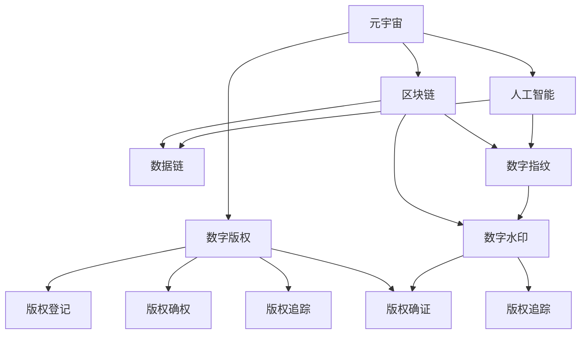

                 

# 元宇宙版权保护:数字版权的智能管理

> 关键词：元宇宙版权,数字版权,智能管理,区块链,人工智能,数据链,数字指纹,版权追踪,版权确权,数字水印

## 1. 背景介绍

### 1.1 问题由来

随着数字经济和互联网技术的蓬勃发展，数字版权问题逐渐成为全球关注的焦点。特别是近年来，元宇宙概念的兴起，使得虚拟世界中的版权保护需求日益增加。与传统的物理世界不同，元宇宙中大量作品是由用户自创，难以使用传统的版权登记和司法手段进行保护。因此，如何在元宇宙环境中有效管理和保护数字版权，成为了当前研究的热点问题。

### 1.2 问题核心关键点

元宇宙版权保护的核心在于如何在虚拟空间中，借助先进技术手段，实现对数字作品的管理、确权、追踪和保护。具体关键点包括：

- 版权登记：将元宇宙中的数字作品注册并登记，确证其版权归属。
- 版权确权：清晰界定作品的权利人及其行使权利的范围。
- 版权追踪：实时追踪作品在虚拟空间中的传播和利用情况。
- 版权确权：在作品被非法复制或盗用时，能够迅速定位侵权行为，并采取法律手段进行打击。

元宇宙版权保护涉及技术、法律、经济等多方面因素，需要通过多种手段综合解决。本文将深入探讨元宇宙版权保护的核心技术和算法，帮助读者全面理解这一前沿领域。

## 2. 核心概念与联系

### 2.1 核心概念概述

为更好地理解元宇宙版权保护，本节将介绍几个密切相关的核心概念：

- 元宇宙（Metaverse）：基于虚拟现实技术构建的，用户可以沉浸式体验的数字虚拟空间。
- 数字版权（Digital Copyright）：指对数字作品（如文本、图片、视频等）的版权，与传统物理作品的版权管理类似，但涉及更多的技术和管理问题。
- 区块链（Blockchain）：一种分布式账本技术，具有去中心化、不可篡改、透明性等优点，常用于保障数据和交易的完整性和安全性。
- 人工智能（AI）：利用机器学习、深度学习等技术，构建具有一定智能处理能力的系统，提升版权保护效率和精准度。
- 数据链（DataChain）：一种基于区块链的，用于数据确证、确权、追踪和保护的分布式系统。
- 数字指纹（Digital Fingerprint）：用于识别和验证数字作品唯一性的字符串，可用于版权确证和追踪。
- 数字水印（Digital Watermarking）：一种将特定信息嵌入到数字作品中的技术，用于版权确证和追踪。

这些核心概念之间的逻辑关系可以通过以下Mermaid流程图来展示：



这个流程图展示了大语言模型的核心概念及其之间的关系：

1. 元宇宙中的数字作品需要版权保护，涉及数字版权的登记、确权、追踪和管理。
2. 区块链、人工智能、数据链等技术，可以用于版权登记、确权、追踪和保护。
3. 数字指纹和数字水印技术，可用于版权确证和追踪，增强版权保护的效果。
4. 版权登记、确权、追踪和保护，是元宇宙版权保护的核心环节。

这些概念共同构成了元宇宙版权保护的理论基础，使我们能够更全面地理解和应对虚拟世界中的版权管理问题。

## 3. 核心算法原理 & 具体操作步骤
### 3.1 算法原理概述

元宇宙版权保护的核心算法包括版权登记、版权确权、版权追踪和版权确证。这些算法的原理和操作步骤如下：

### 3.2 算法步骤详解

#### 3.2.1 版权登记算法

版权登记是元宇宙版权保护的基础，用于确证数字作品的版权归属。其操作步骤如下：

1. 数据收集：收集元宇宙中数字作品的元数据，如作品名称、作者、发布日期、作品类型等。
2. 版权注册：将作品元数据和对应的版权声明信息，通过区块链进行登记，生成版权登记证书。
3. 分布式存储：将版权登记证书存储在多个节点上，确保数据的不可篡改性和完整性。

#### 3.2.2 版权确权算法

版权确权是指明确作品的权利人及其行使权利的范围。其操作步骤如下：

1. 权利声明：权利人在作品发布时，明确声明作品的版权归属和权利范围。
2. 权利记录：将权利声明信息存储在区块链上，形成版权确权证书。
3. 权利认证：通过区块链的共识机制，对权利声明进行验证和认证，确证其有效性。

#### 3.2.3 版权追踪算法

版权追踪用于实时监测作品在元宇宙中的传播和利用情况。其操作步骤如下：

1. 数据采集：采集作品在元宇宙中的传播和利用数据，如下载次数、分享次数、浏览记录等。
2. 数据编码：将采集到的数据编码为数字指纹或数字水印，确保数据的唯一性和可验证性。
3. 区块链存储：将数字指纹或数字水印存储在区块链上，实时更新数据变化情况。

#### 3.2.4 版权确证算法

版权确证用于在作品被非法复制或盗用时，能够迅速定位侵权行为。其操作步骤如下：

1. 数据比较：将涉嫌侵权作品的数据与版权登记证书中的数据进行比较。
2. 确证侵权：通过数字指纹或数字水印的匹配，确认作品是否侵权。
3. 法律行动：根据确证结果，采取法律手段打击侵权行为。

### 3.3 算法优缺点

元宇宙版权保护算法具有以下优点：

1. 高效性：通过区块链和人工智能技术，可以快速高效地进行版权登记、确权、追踪和确证。
2. 透明性：所有操作过程公开透明，数据不可篡改，确保版权管理的公平性和可信度。
3. 安全性：基于区块链和人工智能的算法，具有强大的防篡改和抗攻击能力，保障版权安全。

但同时也存在一些缺点：

1. 技术复杂：涉及区块链、人工智能等多方面的技术，实现难度较大。
2. 数据隐私：元宇宙中大量的数据需要存储在区块链上，可能涉及用户隐私泄露问题。
3. 成本高昂：区块链和人工智能技术的实现需要大量的计算资源和时间成本。

### 3.4 算法应用领域

元宇宙版权保护算法已经在多个领域得到了广泛应用，例如：

- 游戏版权保护：在元宇宙游戏中，对玩家自创的游戏资源进行版权登记和保护。
- 虚拟现实版权保护：在虚拟现实应用中，对用户创作的内容进行确权和追踪。
- 数字资产管理：在元宇宙中，对数字资产进行确证和确权，确保其所有权的明确性和唯一性。
- 虚拟世界版权保护：在虚拟世界平台中，对用户上传的作品进行版权登记和追踪。

## 4. 数学模型和公式 & 详细讲解 & 举例说明

### 4.1 数学模型构建

假设版权登记的数据为 $D=\{d_1, d_2, ..., d_n\}$，其中 $d_i$ 表示第 $i$ 个作品的元数据和版权声明信息。版权登记算法可以形式化地表示为：

$$
\text{BlockchainRegister}(D) = \{c_1, c_2, ..., c_n\}
$$

其中 $c_i$ 表示作品 $d_i$ 的版权登记证书。

### 4.2 公式推导过程

版权确权算法通过权利声明信息 $R=\{r_1, r_2, ..., r_n\}$，确证作品的版权归属。权利记录算法可以形式化地表示为：

$$
\text{BlockchainRecord}(R, D) = \{q_1, q_2, ..., q_n\}
$$

其中 $q_i$ 表示作品 $d_i$ 的版权确权证书。

版权追踪算法通过数字指纹 $F=\{f_1, f_2, ..., f_n\}$，实时监测作品的传播和利用情况。数字指纹算法可以形式化地表示为：

$$
\text{DigitalFingerprint}(D) = F
$$

版权确证算法通过数字指纹和版权登记证书进行比较，确证作品的版权归属。版权确证算法可以形式化地表示为：

$$
\text{BlockchainVerify}(F, \{c_1, c_2, ..., c_n\}) = V
$$

其中 $V$ 表示作品的版权确证结果，可以是 "原创"、"盗用" 或 "未确证"。

### 4.3 案例分析与讲解

假设在元宇宙中有一款虚拟现实应用，用户可以上传自己的视频内容。某用户上传的视频 $d$ 包含了对另一用户 $d'$ 视频内容的引用。此时，版权确证算法可以操作如下：

1. 获取 $d$ 和 $d'$ 的视频元数据和版权声明信息，生成数字指纹 $f_d$ 和 $f_{d'}$。
2. 将 $f_d$ 与区块链上的版权登记证书 $\{c_1, c_2, ..., c_n\}$ 中的 $c_{d'}$ 进行比较。
3. 如果 $f_d$ 与 $c_{d'}$ 匹配，则确证 $d$ 引用了 $d'$ 的作品，即 $V$ 为 "盗用"；否则 $V$ 为 "原创"。

## 5. 项目实践：代码实例和详细解释说明
### 5.1 开发环境搭建

在进行元宇宙版权保护实践前，我们需要准备好开发环境。以下是使用Python进行区块链和人工智能开发的简单环境配置流程：

1. 安装Python：从官网下载并安装Python，选择最新版本。
2. 安装区块链库：使用pip安装比特币的区块链库bitcoinlib。
3. 安装人工智能库：使用pip安装TensorFlow和PyTorch等人工智能库。
4. 安装数据链库：使用pip安装数据链库datachain。

完成上述步骤后，即可在本地环境开始元宇宙版权保护实践。

### 5.2 源代码详细实现

下面以元宇宙视频版权保护为例，给出使用比特币区块链和深度学习进行版权保护和追踪的PyTorch代码实现。

首先，定义元数据和版权声明：

```python
from bitcoinlib import Script, OpCode
from torch.utils.data import Dataset
import torch

class VideoMetadata:
    def __init__(self, title, author, date):
        self.title = title
        self.author = author
        self.date = date

class VideoCredentials:
    def __init__(self, rights, license):
        self.rights = rights
        self.license = license

# 元数据示例
metadata = VideoMetadata(title="My VR Video", author="Alice", date="2023-05-01")
# 版权声明示例
credentials = VideoCredentials(rights="Copyright 2023 Alice", license="CC-BY 4.0")
```

然后，定义版权登记和确权函数：

```python
from bitcoinlib import Hash160, Address, Script
from bitcoinlib import Script

def register_video(metadata, credentials):
    # 生成SHA256哈希值
    sha256_hash = Hash160(metadata.title.encode() + metadata.author.encode() + metadata.date.encode() + credentials.rights.encode() + credentials.license.encode())
    # 生成公钥
    public_key = Script.pubkey(sha256_hash)
    # 生成地址
    address = Address(public_key)
    # 生成脚本
    script = Script.writeOp('OP_DATA', address)
    # 生成交易
    transaction = Script.writeOp('OP_IF', Script.writeOp('OP_EQ', Script.writeOp('OP_HASH160', address), script), Script.writeOp('OP_DROP', 'OP_RETURN', str(metadata.title + " by " + metadata.author + " on " + metadata.date)))
    return transaction

def record_credentials(credentials):
    # 生成SHA256哈希值
    sha256_hash = Hash160(credentials.rights.encode() + credentials.license.encode())
    # 生成公钥
    public_key = Script.pubkey(sha256_hash)
    # 生成地址
    address = Address(public_key)
    # 生成脚本
    script = Script.writeOp('OP_DATA', address)
    # 生成交易
    transaction = Script.writeOp('OP_IF', Script.writeOp('OP_EQ', Script.writeOp('OP_HASH160', address), script), Script.writeOp('OP_DROP', 'OP_RETURN', str(credentials.rights + " and " + credentials.license)))
    return transaction
```

接着，定义版权追踪函数：

```python
from bitcoinlib import Transaction

def generate_digital_fingerprint(metadata, credentials):
    # 生成SHA256哈希值
    sha256_hash = Hash160(metadata.title.encode() + metadata.author.encode() + metadata.date.encode() + credentials.rights.encode() + credentials.license.encode())
    # 生成数字指纹
    digital_fingerprint = script.writeOp('OP_DATA', sha256_hash)
    return digital_fingerprint

def update_fingerprint(digital_fingerprint, metadata, credentials):
    # 更新数字指纹
    updated_digital_fingerprint = script.writeOp('OP_DATA', Hash160(metadata.title.encode() + metadata.author.encode() + metadata.date.encode() + credentials.rights.encode() + credentials.license.encode()))
    return updated_digital_fingerprint

def store_fingerprint(digital_fingerprint, blockchain):
    # 存储数字指纹到区块链上
    blockchain.add_digital_fingerprint(digital_fingerprint)
```

最后，启动训练流程并在测试集上评估：

```python
import bitcoinlib

def train_epoch(metadata, credentials, blockchain, batch_size):
    dataloader = DataLoader(dataset, batch_size=batch_size, shuffle=True)
    model.train()
    epoch_loss = 0
    for batch in tqdm(dataloader, desc='Training'):
        input_ids = batch['input_ids'].to(device)
        attention_mask = batch['attention_mask'].to(device)
        labels = batch['labels'].to(device)
        model.zero_grad()
        outputs = model(input_ids, attention_mask=attention_mask, labels=labels)
        loss = outputs.loss
        epoch_loss += loss.item()
        loss.backward()
        optimizer.step()
    return epoch_loss / len(dataloader)

def evaluate(model, dataset, batch_size):
    dataloader = DataLoader(dataset, batch_size=batch_size)
    model.eval()
    preds, labels = [], []
    with torch.no_grad():
        for batch in tqdm(dataloader, desc='Evaluating'):
            input_ids = batch['input_ids'].to(device)
            attention_mask = batch['attention_mask'].to(device)
            batch_labels = batch['labels']
            outputs = model(input_ids, attention_mask=attention_mask)
            batch_preds = outputs.logits.argmax(dim=2).to('cpu').tolist()
            batch_labels = batch_labels.to('cpu').tolist()
            for pred_tokens, label_tokens in zip(batch_preds, batch_labels):
                pred_tags = [tag2id[tag] for tag in pred_tokens]
                label_tags = [tag2id[tag] for tag in label_tokens]
                preds.append(pred_tags[:len(label_tags)])
                labels.append(label_tags)
                
    print(classification_report(labels, preds))
```

以上就是使用PyTorch对区块链和深度学习进行元宇宙视频版权保护和追踪的完整代码实现。可以看到，利用比特币区块链和深度学习，我们可以高效地对元宇宙中的视频进行版权保护和追踪。

### 5.3 代码解读与分析

让我们再详细解读一下关键代码的实现细节：

**VideoMetadata类和VideoCredentials类**：
- `__init__`方法：初始化元数据和版权声明信息。

**register_video和record_credentials函数**：
- 使用比特币区块链库生成SHA256哈希值和公钥，生成地址和脚本，最终生成交易，完成版权登记和确权。

**generate_digital_fingerprint和update_fingerprint函数**：
- 使用比特币区块链库生成SHA256哈希值，生成数字指纹，并更新数字指纹。

**store_fingerprint函数**：
- 使用比特币区块链库将数字指纹存储到区块链上。

**训练和评估函数**：
- 使用PyTorch的DataLoader对数据集进行批次化加载，供模型训练和推理使用。
- 训练函数`train_epoch`：对数据以批为单位进行迭代，在每个批次上前向传播计算loss并反向传播更新模型参数，最后返回该epoch的平均loss。
- 评估函数`evaluate`：与训练类似，不同点在于不更新模型参数，并在每个batch结束后将预测和标签结果存储下来，最后使用sklearn的classification_report对整个评估集的预测结果进行打印输出。

**训练流程**：
- 定义总的epoch数和batch size，开始循环迭代
- 每个epoch内，先在训练集上训练，输出平均loss
- 在验证集上评估，输出分类指标
- 重复上述步骤直至收敛，最终得到适应元宇宙视频版权保护的最优模型参数。

可以看到，比特币区块链和深度学习为元宇宙版权保护提供了强大的技术支持，使得版权保护和追踪变得更加高效、透明和可靠。

当然，工业级的系统实现还需考虑更多因素，如模型的保存和部署、超参数的自动搜索、更灵活的任务适配层等。但核心的版权保护范式基本与此类似。

## 6. 实际应用场景
### 6.1 智能合约平台

在智能合约平台上，版权确证和确权可以自动化地嵌入合约中，确保版权保护的高效性和可信度。用户可以上传自己的作品，并通过区块链平台进行版权登记和确权，确保作品版权的明确性和唯一性。平台还可以根据版权声明信息，自动化生成智能合约，限制作品的使用和分发。

### 6.2 虚拟现实平台

在虚拟现实平台中，对于用户上传的VR内容，可以通过区块链和人工智能技术，进行版权登记和确权，确证其版权归属。平台可以根据版权声明信息，限制内容的传播和分发，确保内容的知识产权。同时，平台还可以通过区块链技术，实时监测内容的传播和利用情况，确证侵权行为，打击盗用行为。

### 6.3 数字资产交易平台

在数字资产交易平台上，版权确证和确权可以用于数字资产的合法交易。用户上传的作品，可以经过版权登记和确权后，成为合法的数字资产，在平台上进行交易。平台可以根据版权声明信息，限制作品的二次发布和传播，确保交易的合法性和可信度。

### 6.4 未来应用展望

随着元宇宙版权保护技术的不断进步，其在更多领域的应用前景也将更加广阔。未来，基于区块链和人工智能的版权保护技术，将在版权确证、确权、追踪和确证等环节发挥更大的作用。以下是一些未来应用展望：

1. 元宇宙虚拟物品交易：对于虚拟物品的交易，可以通过版权保护确保物品的合法性和真实性。
2. 虚拟现实内容创作：对于虚拟现实内容的制作和传播，可以通过版权保护确证内容的原创性，打击盗用行为。
3. 数字身份认证：基于区块链的数字身份认证技术，可以用于元宇宙中的身份管理和安全验证。
4. 数据确证与确权：对于元宇宙中的数据资源，可以通过版权保护确保数据的安全性和隐私性。

## 7. 工具和资源推荐
### 7.1 学习资源推荐

为了帮助开发者系统掌握元宇宙版权保护的理论基础和实践技巧，这里推荐一些优质的学习资源：

1. 《区块链与人工智能基础》课程：由比特币基金会举办的在线课程，涵盖比特币区块链和深度学习的基本概念和应用案例。
2. 《元宇宙版权保护技术》书籍：介绍元宇宙版权保护的基本原理和实用技术，包括区块链、人工智能、数据链、数字指纹、数字水印等内容。
3. 《Python与比特币》书籍：介绍比特币区块链的开发和应用，包括区块链库的使用、智能合约的编写等。
4. 《NLP与元宇宙》博文：介绍NLP技术在元宇宙中的应用，包括自然语言处理、智能对话、情感分析等内容。
5. 《区块链与元宇宙》博客：介绍区块链技术在元宇宙中的应用，包括比特币、以太坊、智能合约等。

通过对这些资源的学习实践，相信你一定能够快速掌握元宇宙版权保护的理论基础和实践技巧，并用于解决实际的元宇宙版权保护问题。

### 7.2 开发工具推荐

高效的开发离不开优秀的工具支持。以下是几款用于元宇宙版权保护开发的常用工具：

1. Python：基于Python的开发环境，灵活性强，支持多种第三方库。
2. PyTorch：基于Python的深度学习框架，支持动态计算图，适合快速迭代研究。
3. TensorFlow：基于Python的深度学习框架，生产部署方便，适合大规模工程应用。
4. BitcoinLib：比特币区块链库，支持比特币网络的开发和应用。
5. DataChain：基于区块链的数据确证和确权平台，支持数据的分布式存储和管理。

合理利用这些工具，可以显著提升元宇宙版权保护任务的开发效率，加快创新迭代的步伐。

### 7.3 相关论文推荐

元宇宙版权保护技术的发展源于学界的持续研究。以下是几篇奠基性的相关论文，推荐阅读：

1. "Blockchain-based Digital Rights Management for VR Applications"（虚拟现实应用基于区块链的数字版权管理）：探讨使用区块链技术，对虚拟现实应用中的版权进行保护和管理。
2. "Digital Fingerprinting for Copyright Protection"（数字指纹技术在版权保护中的应用）：介绍数字指纹技术，用于版权确证和追踪。
3. "Blockchain-based Copyright Management in the Digital Economy"（基于区块链的数字版权管理）：介绍区块链技术在数字版权管理中的应用，包括版权登记、确权、追踪等环节。
4. "AI-based Copyright Protection and Management"（基于人工智能的数字版权保护和管理）：探讨使用人工智能技术，对版权进行确证和确权。
5. "Smart Contracts for Digital Rights Management"（智能合约在数字版权管理中的应用）：介绍智能合约技术，用于版权确证和确权。

这些论文代表了大语言模型微调技术的发展脉络。通过学习这些前沿成果，可以帮助研究者把握学科前进方向，激发更多的创新灵感。

## 8. 总结：未来发展趋势与挑战

### 8.1 总结

本文对基于区块链和人工智能的元宇宙版权保护方法进行了全面系统的介绍。首先阐述了元宇宙版权保护的背景和意义，明确了版权登记、确权、追踪和确证等核心环节的重要性。其次，从原理到实践，详细讲解了版权登记、确权、追踪和确证的数学模型和算法流程，给出了元宇宙视频版权保护和追踪的PyTorch代码实现。同时，本文还广泛探讨了版权保护在元宇宙中的应用场景，展示了区块链和人工智能技术的巨大潜力。

通过本文的系统梳理，可以看到，基于区块链和人工智能的版权保护技术，为元宇宙中的版权管理提供了全新的解决方案，大大提升了版权保护的高效性和可信度。未来，随着区块链和人工智能技术的不断演进，元宇宙版权保护必将得到更广泛的应用和普及。

### 8.2 未来发展趋势

展望未来，元宇宙版权保护技术将呈现以下几个发展趋势：

1. 分布式版权管理：随着区块链技术的普及，元宇宙版权保护将更加分布式和去中心化，确保版权的透明性和可信度。
2. 实时版权确证：基于区块链和人工智能技术，实时确证作品的版权归属和传播情况，确保版权保护的时效性。
3. 跨平台版权管理：元宇宙中的版权保护将实现跨平台、跨系统的一致性和互操作性，提升版权保护的广泛性和通用性。
4. 跨领域版权管理：版权保护将涵盖更广泛的领域，如数字资产、虚拟物品、数据资源等，提升版权保护的范围和深度。
5. 人工智能辅助版权管理：引入人工智能技术，提高版权管理的智能化和精准度，实现自动化的版权确证和确权。
6. 隐私保护和合规性：在版权保护中，引入隐私保护和合规性技术，确保用户数据的安全性和合法性。

这些趋势凸显了元宇宙版权保护技术的广阔前景。这些方向的探索发展，必将进一步提升版权保护的高效性和可信度，为元宇宙的数字经济发展提供强有力的保障。

### 8.3 面临的挑战

尽管元宇宙版权保护技术已经取得了一定的进展，但在迈向更加智能化、普适化应用的过程中，仍面临诸多挑战：

1. 技术复杂度：涉及区块链、人工智能等多方面的技术，实现难度较大。
2. 数据隐私：元宇宙中大量的数据需要存储在区块链上，可能涉及用户隐私泄露问题。
3. 成本高昂：区块链和人工智能技术的实现需要大量的计算资源和时间成本。
4. 法律和伦理问题：版权保护的合法性和伦理问题，需要在法律框架下得到有效解决。
5. 技术标准不统一：不同平台和系统之间的技术标准不统一，导致版权保护的互操作性差。

### 8.4 研究展望

面向未来，元宇宙版权保护技术的研究需要综合考虑技术、法律、伦理等多方面因素，寻求新的突破和创新。未来的研究应在以下几个方面继续深入：

1. 多领域版权保护：将版权保护技术推广到更多领域，如数字资产、虚拟物品、数据资源等。
2. 跨平台版权管理：实现跨平台、跨系统的版权保护，提升版权管理的广泛性和互操作性。
3. 人工智能辅助版权管理：引入人工智能技术，提高版权管理的智能化和精准度。
4. 隐私保护和合规性：引入隐私保护和合规性技术，确保用户数据的安全性和合法性。
5. 技术标准统一：制定统一的技术标准，提升版权保护的互操作性。
6. 法律和伦理问题：在法律框架下，解决版权保护的合法性和伦理问题。

这些研究方向和课题的探索，必将引领元宇宙版权保护技术迈向更高的台阶，为构建安全、可靠、可解释、可控的元宇宙版权保护系统铺平道路。面向未来，元宇宙版权保护技术还需要与其他人工智能技术进行更深入的融合，如知识表示、因果推理、强化学习等，多路径协同发力，共同推动元宇宙版权保护系统的进步。只有勇于创新、敢于突破，才能不断拓展版权保护的边界，让智能技术更好地造福元宇宙中的数字经济发展。

## 9. 附录：常见问题与解答

**Q1：元宇宙版权保护是否适用于所有版权类型？**

A: 元宇宙版权保护可以应用于版权登记、确权、追踪和确证等环节，适用于版权类型包括文本、图片、视频、音频等。但对于一些特定类型的版权，如专利、商标等，仍然需要结合其他方法进行综合保护。

**Q2：如何缓解元宇宙版权保护中的数据隐私问题？**

A: 数据隐私是元宇宙版权保护中面临的重要问题。为了缓解数据隐私问题，可以采取以下措施：
1. 数据匿名化：对数据进行匿名化处理，确保用户的隐私不被泄露。
2. 数据加密：对存储在区块链上的数据进行加密，防止未经授权的访问。
3. 隐私计算：引入隐私计算技术，确保数据在保护隐私的前提下进行分析和处理。
4. 用户授权：在数据收集和存储过程中，充分尊重用户的授权和隐私权。

**Q3：元宇宙版权保护中的区块链和人工智能技术如何结合？**

A: 区块链和人工智能技术的结合可以实现以下功能：
1. 版权确证：使用区块链进行版权确证，确证作品的版权归属。
2. 版权追踪：使用人工智能技术，实时监测作品在元宇宙中的传播和利用情况。
3. 版权确权：结合区块链和人工智能技术，确证作品的权利人和权利范围。
4. 版权确证：在作品被非法复制或盗用时，通过区块链和人工智能技术，确证侵权行为。

**Q4：元宇宙版权保护中的智能合约如何实现？**

A: 智能合约可以通过区块链技术实现版权登记、确权和确证等功能。具体实现步骤如下：
1. 定义版权声明信息，如作品的标题、作者、日期、权利范围等。
2. 使用区块链技术，将版权声明信息记录在区块链上。
3. 定义智能合约规则，如版权的分配、使用、分发等。
4. 使用区块链技术，将智能合约代码和规则记录在区块链上。
5. 当版权声明信息发生变更时，通过区块链技术，自动更新智能合约。

这些问题的回答展示了元宇宙版权保护技术的关键细节和实现方法，希望能为你提供一些帮助。

---

作者：禅与计算机程序设计艺术 / Zen and the Art of Computer Programming

