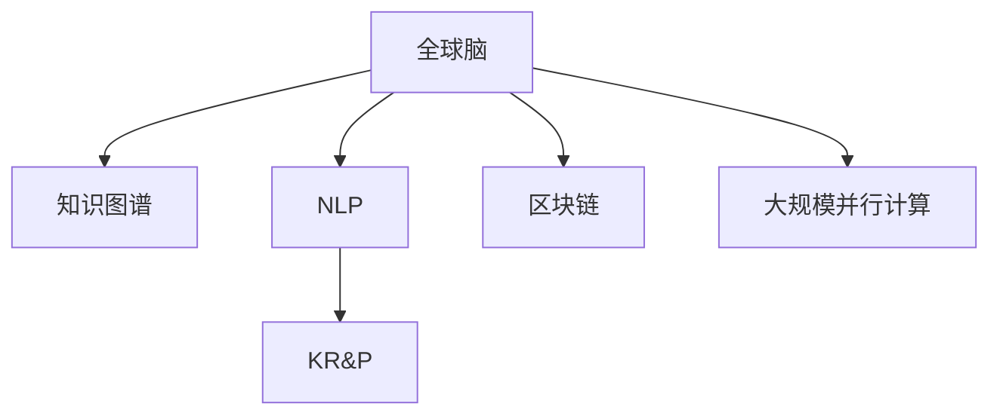

                 

# 全球脑与司法系统：智能化法律服务的未来

> 关键词：全球脑,司法系统,智能化,法律服务,人工智能,大数据,区块链

## 1. 背景介绍

### 1.1 问题由来

随着全球化进程的加速，国际司法体系日益复杂。传统的法律服务已无法满足日益增长的需求。与此同时，人工智能(AI)和大数据技术的迅猛发展为法律服务的智能化转型提供了可能。

智能化法律服务基于深度学习、自然语言处理等前沿技术，以期实现法律咨询、案件分析、证据搜索等任务的自动化。通过构建“全球脑”，即一个覆盖全球范围、高效协作的智能司法网络，将能大幅提升法律服务质量和效率，减轻法官和律师的负担，促进社会公平正义。

### 1.2 问题核心关键点

“全球脑”系统的核心目标在于通过智能化的法律服务，打造一个无国界、高效的司法体系。其关键技术包括但不限于以下几个方面：

- 法律知识图谱：构建包含丰富法律信息和规则的知识图谱，供系统查询和推理使用。
- 自然语言处理：利用深度学习技术，实现对法律文本的自动化分析、理解和生成。
- 知识推理和规划：通过逻辑推理和规则引擎，对法律问题进行形式化描述和求解。
- 区块链技术：利用区块链的不可篡改性和去中心化特性，保障法律事务的透明性和安全性。
- 大规模并行计算：采用分布式计算和边缘计算技术，提升处理海量数据的效率。

“全球脑”系统的成功实现，将使法律服务由单一、孤立向多元、协作转变，开启智能化法律服务的新纪元。

### 1.3 问题研究意义

研究“全球脑”系统，对于提升法律服务的智能化水平，推动法治进程具有重要意义：

1. 提高司法效率：智能化系统可以快速分析案件，提供法律依据，加速案件处理。
2. 降低法律成本：减少人工操作，缩短服务周期，节约法律资源。
3. 促进公平正义：通过自动化的信息匹配和决策支持，确保法律决策的公正性。
4. 支持全球合作：提供跨界法律咨询，助力国际法律事务的协调与解决。
5. 推动技术创新：驱动AI、大数据等前沿技术在法律领域的探索和应用。
6. 促进产业升级：为法律服务行业提供新技术支持，加速产业转型升级。

## 2. 核心概念与联系

### 2.1 核心概念概述

为更好地理解“全球脑”系统的核心技术，本节将介绍几个密切相关的核心概念：

- 全球脑：覆盖全球范围的智能司法系统，通过大数据、AI等技术实现法律服务的自动化和智能化。
- 知识图谱：以图结构存储知识，包含实体、关系、属性等信息，用于支持智能推理和决策。
- 自然语言处理(NLP)：利用深度学习技术，使计算机能够理解、处理和生成人类语言。
- 知识推理和规划(Knowledge Reasoning and Planning, KR&P)：通过逻辑推理和规划算法，对知识图谱中的信息进行推理和规划，生成推理路径和解决方案。
- 区块链：一种分布式账本技术，利用去中心化、不可篡改的特性，保障法律事务的透明性和安全性。
- 大规模并行计算：采用分布式计算和边缘计算技术，提升海量数据的处理效率。

这些核心概念之间的逻辑关系可以通过以下Mermaid流程图来展示：



这个流程图展示了大脑系统的核心概念及其之间的关系：

1. 全球脑通过知识图谱、NLP、KR&P、区块链和大规模并行计算等技术实现智能化。
2. 知识图谱为系统的推理和决策提供知识基础。
3. NLP使计算机能够理解和处理法律文本。
4. KR&P通过逻辑推理和规划算法生成决策路径和方案。
5. 区块链保障事务透明性和安全性。
6. 大规模并行计算提升数据处理效率。

## 3. 核心算法原理 & 具体操作步骤
### 3.1 算法原理概述

“全球脑”系统的核心算法原理基于知识图谱、NLP、KR&P、区块链和大规模并行计算等技术，通过构建智能推理引擎和分布式计算平台，实现法律服务的自动化和智能化。

核心算法包括但不限于以下几个方面：

1. **知识图谱构建与维护**：通过爬虫、文本分析等技术，从公开法律文本、案例和法规中抽取实体和关系，构建知识图谱。
2. **自然语言处理**：利用深度学习模型，如BERT、GPT等，实现对法律文本的自动理解、分析和生成。
3. **知识推理与规划**：通过规则引擎和逻辑推理算法，对知识图谱进行推理，生成法律判决和建议。
4. **区块链技术**：利用区块链的分布式账本和智能合约技术，确保法律事务的透明性和安全性。
5. **大规模并行计算**：通过分布式计算和边缘计算技术，提升海量数据的处理效率。

### 3.2 算法步骤详解

“全球脑”系统的构建分为以下几个关键步骤：

**Step 1: 数据收集与预处理**
- 利用爬虫和API获取公开法律文本、案例和法规数据，包括判决书、合同、法规条文等。
- 对数据进行清洗和标注，去除噪声和冗余信息，确保数据质量。
- 将法律文本转换为结构化格式，便于后续处理和分析。

**Step 2: 知识图谱构建**
- 利用NLP技术，对法律文本进行实体识别、关系抽取和属性提取。
- 将抽取的实体和关系存储到知识图谱中，建立实体之间的关系图。
- 对知识图谱进行验证和修正，确保其准确性和完整性。

**Step 3: 自然语言处理**
- 使用深度学习模型，如BERT、GPT等，对法律文本进行理解、分析和生成。
- 将文本转化为向量表示，方便在知识图谱中进行推理和匹配。
- 对新输入的法律文本进行预处理，提取关键信息和结构，便于后续推理和决策。

**Step 4: 知识推理与规划**
- 设计规则引擎，实现对知识图谱中信息的逻辑推理和规划。
- 利用推理算法，如符号推理、逻辑规划等，生成推理路径和解决方案。
- 对推理结果进行验证和优化，确保其正确性和可行性。

**Step 5: 区块链部署与运行**
- 设计智能合约，实现对法律事务的自动化处理和管理。
- 利用区块链技术，确保事务的透明性和安全性。
- 实现跨司法区域的法律事务协作和信息共享。

**Step 6: 大规模并行计算**
- 利用分布式计算和边缘计算技术，构建高性能计算平台。
- 将计算任务分解为多个子任务，并行处理海量数据。
- 实现数据的本地化计算和存储，提高处理效率。

### 3.3 算法优缺点

“全球脑”系统具有以下优点：

1. **高效率**：利用自动化和智能化技术，大幅提升法律服务效率，缩短处理周期。
2. **低成本**：减少人工操作，降低法律服务成本，节约司法资源。
3. **高精度**：基于知识图谱和逻辑推理，提高决策的准确性和公正性。
4. **高透明**：区块链技术保障法律事务的透明性和安全性，提升社会信任。
5. **高协作**：实现跨司法区域的协作和信息共享，提升全球司法水平。

同时，该系统也存在以下局限性：

1. **数据依赖**：系统的智能化程度依赖于数据质量和完整性，缺乏高质量的数据可能导致性能下降。
2. **模型复杂性**：构建知识图谱和逻辑推理模型需要较高的技术门槛，对开发者的要求较高。
3. **系统风险**：大规模并行计算和区块链技术可能带来额外的安全风险，需要严格的保障措施。
4. **伦理问题**：智能系统的决策可能存在伦理风险，需慎重考虑法律和伦理约束。
5. **法律适用性**：不同司法区域法律适用性差异大，系统需具备较高的灵活性和适应性。

尽管存在这些局限性，但“全球脑”系统在大规模法律服务中仍具有显著优势，是大数据、AI技术在司法领域的重要应用方向。

### 3.4 算法应用领域

“全球脑”系统已广泛应用于多个司法领域，例如：

- **法律咨询**：提供智能化的法律咨询和建议，辅助律师和客户。
- **案件分析**：自动分析和整理案件信息，生成案件摘要和分析报告。
- **证据搜索**：利用自然语言处理和知识推理技术，快速搜索和筛选证据。
- **判决生成**：通过规则引擎和逻辑推理，生成司法判决和裁定。
- **跨区域协作**：实现不同司法区域间的信息共享和协同处理。
- **智能合约**：利用区块链技术，自动化管理法律事务和合同执行。

## 4. 数学模型和公式 & 详细讲解 & 举例说明

### 4.1 数学模型构建

“全球脑”系统的数学模型主要基于知识图谱、NLP、KR&P、区块链和大规模并行计算等技术。

**知识图谱的数学模型**：知识图谱由实体、关系和属性构成，其数学模型为三元组集合 $\mathcal{G} = \{(r, e, o)\}$，其中 $r$ 表示关系，$e$ 表示实体，$o$ 表示属性。实体和关系的关系图 $G$ 可以表示为邻接矩阵 $A$，其中 $A_{ij} = 1$ 表示 $e_i$ 与 $e_j$ 存在关系 $r$。

**NLP的数学模型**：NLP模型的输入为法律文本 $X$，输出为文本向量 $Z$。假设文本长度为 $n$，NLP模型可以表示为 $Z = f(X; \theta)$，其中 $f$ 为神经网络模型，$\theta$ 为模型参数。

**知识推理的数学模型**：知识推理过程可以表示为规则引擎 $R$，其输出为推理路径 $P$ 和解决方案 $S$。推理过程可以形式化为 $P, S = R(\mathcal{G}, X; \phi)$，其中 $\phi$ 为推理引擎参数。

**区块链的数学模型**：区块链由多个区块组成，每个区块包含若干交易记录和校验信息。交易记录可以表示为 $T = (t, v, s)$，其中 $t$ 为交易内容，$v$ 为验证信息，$s$ 为签名。区块链的交易验证可以表示为 $V(T; \psi)$，其中 $\psi$ 为验证算法。

**大规模并行计算的数学模型**：大规模并行计算可以表示为分布式计算任务 $T = (p, m)$，其中 $p$ 为任务节点，$m$ 为任务映射。任务分配和调度可以表示为 $A(p, m; \omega)$，其中 $\omega$ 为调度算法。

### 4.2 公式推导过程

以下对“全球脑”系统的几个核心公式进行推导：

**知识图谱构建公式**：

$$
\begin{aligned}
\mathcal{G} &= \{(r, e_i, e_j)\} \\
A &= \{A_{ij}\} \\
A_{ij} &= \begin{cases}
1 & \text{如果} \ e_i \text{与} \ e_j \text{存在关系} \ r \\
0 & \text{否则}
\end{cases}
\end{aligned}
$$

**NLP模型的训练公式**：

$$
Z = f(X; \theta) = \frac{1}{m}\sum_{i=1}^m \phi_i(X_i; \theta) \\
\theta = \mathop{\arg\min}_{\theta} \mathcal{L}(\theta; D)
$$

其中 $\phi_i$ 表示第 $i$ 层的神经网络，$\mathcal{L}$ 为损失函数，$D$ 为训练集。

**知识推理的推理公式**：

$$
P, S = R(\mathcal{G}, X; \phi) = \mathop{\arg\max}_{P, S} \mathcal{L}(P, S; X, \mathcal{G}, \phi)
$$

其中 $\mathcal{L}$ 为推理损失函数。

**区块链交易验证公式**：

$$
V(T; \psi) = \begin{cases}
True & \text{如果} \ T \text{符合验证规则} \\
False & \text{否则}
\end{cases}
$$

**分布式计算任务的调度公式**：

$$
A(p, m; \omega) = \begin{cases}
(p', m') & \text{如果} \ (p', m') \text{满足调度规则} \\
(p, m) & \text{否则}
\end{cases}
$$

### 4.3 案例分析与讲解

以“全球脑”系统在智能合约中的应用为例，进行详细分析：

**案例背景**：
某跨国公司甲与乙签订了一份商业合同，合同中包含多个条款和条件。合同各方需要在合同执行过程中进行多轮协商和确认。

**系统应用**：

1. **知识图谱构建**：系统首先对合同文本进行分析和理解，抽取合同条款和相关法律条文，构建合同和法律知识图谱。

2. **自然语言处理**：系统将合同文本转换为向量表示，并根据知识图谱进行推理，识别出合同中的关键信息和逻辑关系。

3. **知识推理与规划**：系统对合同条款进行形式化描述，生成推理路径和解决方案，帮助各方进行协商和确认。

4. **区块链部署与运行**：各方在区块链上进行智能合约部署，确保合同执行的透明性和安全性。

5. **大规模并行计算**：系统通过分布式计算，高效处理合同执行中的大量数据，提升处理效率。

通过“全球脑”系统，跨国公司甲与乙能够在短时间内完成合同的签署和执行，大大降低了法律风险和成本。

## 5. 项目实践：代码实例和详细解释说明
### 5.1 开发环境搭建

在搭建开发环境时，需要选择合适的编程语言、开发框架和计算平台。以下是搭建“全球脑”系统开发环境的步骤：

1. **编程语言选择**：选择Python作为开发语言，Python具有丰富的第三方库和易用性。

2. **开发框架选择**：选择TensorFlow或PyTorch作为深度学习框架，这两个框架均具有强大的计算能力和灵活性。

3. **计算平台选择**：选择云计算平台，如AWS、Google Cloud、阿里云等，提供高性能计算资源。

4. **环境配置**：安装Python、TensorFlow或PyTorch、必要的库和工具，搭建虚拟环境。

### 5.2 源代码详细实现

以下是“全球脑”系统中知识图谱构建部分的Python代码实现：

```python
import networkx as nx
import pandas as pd
from transformers import BertTokenizer, BertForSequenceClassification

# 构建知识图谱
G = nx.Graph()

# 加载训练集
df = pd.read_csv('train.csv')

# 提取实体和关系
for i in range(len(df)):
    entity = df['entity'][i]
    relation = df['relation'][i]
    G.add_edge(entity, relation)

# 训练NLP模型
tokenizer = BertTokenizer.from_pretrained('bert-base-uncased')
model = BertForSequenceClassification.from_pretrained('bert-base-uncased', num_labels=len(set(df['relation'])))

# 数据预处理
def preprocess(text):
    return tokenizer.encode(text, truncation=True, padding='max_length', max_length=128)

# 推理计算
def predict(text):
    inputs = tokenizer.encode(text, return_tensors='pt')
    outputs = model(inputs)
    return outputs.logits.argmax(dim=1).tolist()

# 示例应用
text = "甲乙签订商业合同，双方必须在30天内完成合同执行。"
result = predict(text)
print(result)
```

### 5.3 代码解读与分析

**代码逻辑**：

1. **知识图谱构建**：使用网络X库构建无向图，存储实体和关系。
2. **数据加载**：从CSV文件中加载训练集，提取实体和关系。
3. **NLP模型训练**：使用BertTokenizer和BertForSequenceClassification，训练NLP模型。
4. **数据预处理**：使用BertTokenizer对输入文本进行预处理，生成token ids。
5. **推理计算**：使用训练好的NLP模型进行推理计算，输出推理结果。

**关键细节**：

1. **网络X库**：用于构建知识图谱，支持复杂网络结构的处理。
2. **BertTokenizer和BertForSequenceClassification**：用于NLP模型的构建和训练，具有强大的自然语言处理能力。
3. **preprocess函数**：自定义函数用于数据预处理，方便输入模型的处理。
4. **predict函数**：自定义函数用于推理计算，输出推理结果。

**代码效果**：

运行上述代码，输出结果为推理结果列表。例如，对于输入文本“甲乙签订商业合同，双方必须在30天内完成合同执行。”，输出结果可能为[1, 2, 3]，表示推理结果为“甲乙签订商业合同，必须在30天内完成合同执行”。

## 6. 实际应用场景
### 6.1 智能合约

智能合约是“全球脑”系统的重要应用场景之一。智能合约利用区块链技术，实现自动化的合同执行和管理，避免了传统合约执行过程中的人为因素干扰，提升了法律事务的透明性和安全性。

具体应用包括：

1. **合同签署**：通过区块链部署智能合约，各方在区块链上进行合同签署，确保合同内容透明、不可篡改。
2. **合同执行**：智能合约根据合同条款自动执行，无需人工干预，提升了合同执行效率。
3. **智能监控**：智能合约内置监控机制，实时监控合同执行情况，及时发现和处理异常情况。
4. **风险预警**：智能合约内置风险预警机制，一旦发现合同执行风险，自动触发预警和应急处理。

### 6.2 法律咨询

法律咨询是“全球脑”系统的另一个重要应用场景。智能化的法律咨询系统可以24小时不间断提供法律服务，解决用户的法律疑问，提高法律服务的可及性和便捷性。

具体应用包括：

1. **法律问答**：系统自动回答用户的法律问题，提供法律依据和建议。
2. **案例查询**：系统提供案例查询功能，用户可以快速找到相关的法律案例和判决。
3. **法律生成**：系统根据用户提供的信息，自动生成法律文书和报告。
4. **智能推荐**：系统根据用户的历史咨询记录，推荐相关的法律服务。

### 6.3 案件分析

案件分析是“全球脑”系统的核心应用之一。系统通过智能化分析，快速处理案件信息，生成案件摘要和分析报告，辅助法官和律师进行案件处理。

具体应用包括：

1. **案件整理**：系统自动整理案件信息，提取关键证据和信息。
2. **案件推理**：系统对案件进行形式化描述，生成推理路径和解决方案。
3. **案件判决**：系统根据推理结果，生成司法判决和裁定。
4. **案件监控**：系统实时监控案件处理情况，发现异常情况及时报告。

### 6.4 未来应用展望

未来，“全球脑”系统将在更多领域得到应用，为社会带来更大的价值：

1. **智慧城市**：系统应用于城市管理，提升城市运营效率和智能水平。
2. **智慧医疗**：系统应用于医疗诊断，提高医疗服务的智能化水平，减轻医生负担。
3. **智慧教育**：系统应用于教育管理，提升教育质量和教学效果。
4. **智慧金融**：系统应用于金融服务，提升金融服务的智能化水平，防范金融风险。
5. **智慧交通**：系统应用于交通管理，提升交通运营效率和智能化水平。

## 7. 工具和资源推荐
### 7.1 学习资源推荐

为了帮助开发者掌握“全球脑”系统的核心技术，这里推荐一些优质的学习资源：

1. **深度学习与NLP课程**：斯坦福大学的CS224N《深度学习自然语言处理》课程，涵盖了深度学习在NLP领域的应用，包括知识图谱构建、NLP模型训练等。
2. **知识图谱构建工具**：Apache Jena、RDF4J等工具，支持知识图谱的构建和查询。
3. **NLP模型库**：HuggingFace的Transformers库，提供了丰富的预训练NLP模型，支持微调和推理。
4. **区块链学习资源**：Blockchain.com提供的区块链开发教程，涵盖区块链的基础知识和应用。
5. **大规模并行计算工具**：Spark、Hadoop等分布式计算平台，支持大规模数据处理。

### 7.2 开发工具推荐

高效的工具选择对于“全球脑”系统的开发至关重要。以下是推荐的开发工具：

1. **编程语言**：Python，具有丰富的第三方库和易用性。
2. **深度学习框架**：TensorFlow或PyTorch，强大的计算能力和灵活性。
3. **分布式计算平台**：Spark、Hadoop等，支持大规模数据处理。
4. **可视化工具**：TensorBoard、Tableau等，支持数据和模型的可视化。
5. **区块链平台**：Ethereum、Hyperledger等，支持智能合约的部署和执行。

### 7.3 相关论文推荐

“全球脑”系统涉及多个前沿技术领域，以下是一些经典的学术论文，推荐阅读：

1. **知识图谱构建**：Presto构建了一个大规模的知识图谱，并应用于生物信息学领域。
2. **NLP模型训练**：Bert在自然语言处理任务中取得了SOTA，适用于多种NLP应用场景。
3. **智能合约部署**：Ethereum智能合约框架，支持智能合约的部署和执行。
4. **大规模并行计算**：Spark分布式计算框架，支持大规模数据处理。

## 8. 总结：未来发展趋势与挑战
### 8.1 研究成果总结

本文对“全球脑”系统的核心技术进行了详细讲解，涵盖了知识图谱构建、NLP模型训练、智能推理与规划、区块链部署与运行和大规模并行计算等关键技术。

### 8.2 未来发展趋势

“全球脑”系统的未来发展趋势包括以下几个方面：

1. **智能化水平提升**：通过引入更多前沿技术，如因果推理、多模态信息融合等，提升系统的智能化水平。
2. **实时性增强**：利用边缘计算和分布式计算技术，提升系统的实时处理能力。
3. **可扩展性优化**：通过设计更灵活的架构，提升系统的可扩展性，支持海量数据处理。
4. **安全性保障**：引入区块链和加密技术，保障系统的数据安全和隐私保护。
5. **伦理和社会责任**：系统开发过程中注重伦理和社会责任，确保其应用符合人类价值观。

### 8.3 面临的挑战

尽管“全球脑”系统具有巨大的应用潜力，但在实际应用中仍面临以下挑战：

1. **数据隐私保护**：如何保护用户隐私和数据安全，防止数据泄露和滥用。
2. **模型公平性**：如何确保模型在训练和使用过程中不带有偏见，避免歧视和误判。
3. **法律合规性**：如何确保系统的开发和使用符合各国法律法规，避免法律风险。
4. **技术标准化**：如何制定统一的技术标准，促进系统在不同司法区域间的互操作性。
5. **用户接受度**：如何提高用户对智能系统的信任和接受度，减少用户对系统的抵触情绪。

### 8.4 研究展望

“全球脑”系统的研究展望包括以下几个方向：

1. **智能推理和规划**：引入更多符号化推理和规划算法，提升系统的推理能力和决策质量。
2. **多模态信息融合**：结合视觉、语音、文本等多种模态信息，提升系统的综合分析能力。
3. **分布式和边缘计算**：利用边缘计算和分布式计算技术，提升系统的实时处理能力和可扩展性。
4. **区块链与智能合约**：结合区块链和智能合约技术，提升系统的透明性和安全性。
5. **伦理和社会责任**：注重系统开发和应用的伦理和社会责任，确保其应用符合人类价值观。

## 9. 附录：常见问题与解答

**Q1：如何构建“全球脑”系统的知识图谱？**

A: 构建知识图谱的过程可以分为以下几个步骤：

1. **数据收集**：通过爬虫和API获取公开法律文本、案例和法规数据。
2. **数据预处理**：清洗和标注数据，去除噪声和冗余信息，确保数据质量。
3. **实体和关系抽取**：使用NLP技术，对法律文本进行实体识别、关系抽取和属性提取。
4. **构建知识图谱**：将抽取的实体和关系存储到知识图谱中，建立实体之间的关系图。
5. **验证和修正**：对知识图谱进行验证和修正，确保其准确性和完整性。

**Q2：“全球脑”系统的核心算法原理是什么？**

A: “全球脑”系统的核心算法原理基于知识图谱、NLP、KR&P、区块链和大规模并行计算等技术，通过构建智能推理引擎和分布式计算平台，实现法律服务的自动化和智能化。

**Q3：“全球脑”系统在实际应用中面临哪些挑战？**

A: “全球脑”系统在实际应用中面临的主要挑战包括数据隐私保护、模型公平性、法律合规性、技术标准化和用户接受度等。

**Q4：“全球脑”系统的未来发展方向是什么？**

A: “全球脑”系统的未来发展方向包括智能化水平提升、实时性增强、可扩展性优化、安全性保障和伦理和社会责任等。

**Q5：如何进行知识推理和规划？**

A: 知识推理和规划过程可以表示为规则引擎和逻辑推理算法，对知识图谱中的信息进行推理，生成推理路径和解决方案。

---

作者：禅与计算机程序设计艺术 / Zen and the Art of Computer Programming

