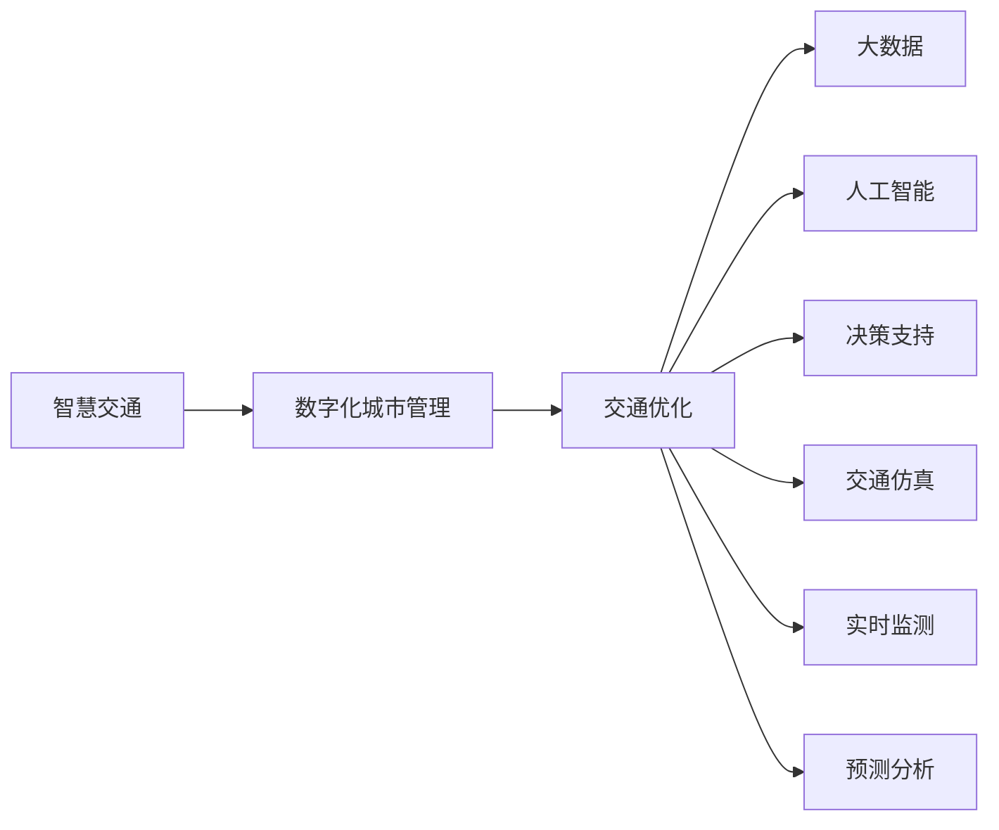

                 

# 全球脑与智慧交通:数字化城市管理的交通优化

> 关键词：智慧交通, 数字化城市管理, 交通优化, 大数据, 人工智能, 决策支持, 交通仿真

## 1. 背景介绍

### 1.1 问题由来

在全球范围内，交通拥堵问题正日益严重，影响城市效率、环境质量和居民生活幸福感。尽管传统交通管理和控制技术，如交通信号灯、环形交叉口等，在一定程度上有助于缓解交通压力，但面对城市规模的不断扩大和交通需求的日益增长，单一的管控手段已无法满足现代城市交通管理的需求。

随着大数据、人工智能等先进技术的发展，智慧交通和数字化城市管理成为解决交通问题的有效手段。通过将大数据、AI算法、传感器技术等手段整合，智慧交通和数字化城市管理能够实现交通系统的动态监测、数据分析和决策优化，从而提升交通管理的效率和效果。

## 2. 核心概念与联系

### 2.1 核心概念概述

智慧交通和数字化城市管理涉及多个核心概念，包括但不限于：

- **智慧交通**：利用先进的信息技术、数据挖掘、人工智能等手段，对交通基础设施、交通工具和交通参与者进行全方位、全时段、全过程的监控、调度和管理，实现高效、智能、安全的交通系统。
- **数字化城市管理**：通过城市物联网、云计算、大数据等技术，对城市各类资源进行数字化、智能化的管理和服务，提升城市运行效率和居民生活质量。
- **交通优化**：基于数据驱动和人工智能算法，优化交通流量、调度方案、路径规划等，实现交通资源的合理分配和使用，缓解交通压力。
- **大数据**：通过收集、分析和处理大规模、多样化的数据，获取有价值的信息，支持决策制定和优化。
- **人工智能**：利用机器学习、深度学习等算法，使系统具备自我学习、自我优化的能力，提升交通管理的智能化水平。
- **决策支持**：借助数据分析、模拟仿真等技术，为交通管理决策提供科学依据和优化方案。
- **交通仿真**：通过计算机模拟交通流和交通设施的运行状态，预测交通行为和优化方案的效果，辅助交通规划和管理。

这些概念之间的联系通过以下Mermaid流程图展现：



这个流程图展示了智慧交通和数字化城市管理的关键组件及其相互关系：

- 智慧交通是整个体系的基础，利用数字化城市管理技术，实现对交通流、交通设施等数据的收集和分析。
- 交通优化是智慧交通的核心目标，通过大数据、人工智能等技术，优化交通流量、调度方案和路径规划。
- 大数据为交通优化提供了数据支持，通过数据分析，发现交通问题的本质和规律。
- 人工智能算法使交通优化具备智能化的决策能力，能够实时处理大量数据，并提出最优方案。
- 决策支持提供科学依据，利用交通仿真的结果，评估优化方案的可行性。
- 实时监测和预测分析，保证交通优化的及时性和准确性。

## 3. 核心算法原理 & 具体操作步骤

### 3.1 算法原理概述

交通优化的核心算法基于数据分析、模型优化和仿真模拟等技术。其原理可以概括为：

1. **数据采集与处理**：通过各类传感器、摄像头、GPS等设备，收集交通流量、车速、信号灯状态等实时数据，并对数据进行清洗、归一化等处理。
2. **数据分析与建模**：运用统计分析、机器学习、深度学习等技术，对交通数据进行分析，建立交通流模型、交通状态预测模型等。
3. **优化算法**：结合动态规划、遗传算法、强化学习等算法，优化交通信号灯控制、路径规划、车辆调度等。
4. **仿真模拟**：利用交通仿真软件，模拟交通流在不同场景下的行为和状态，评估优化策略的效果。

### 3.2 算法步骤详解

以下是交通优化算法的详细步骤：

1. **数据采集与预处理**：
   - 部署各类传感器、摄像头等设备，采集交通流量、车速、信号灯状态等数据。
   - 数据清洗，去除噪声和异常值。
   - 数据归一化，确保不同数据量级的一致性。
   
2. **数据建模与分析**：
   - 利用统计方法，对交通流量、车速等数据进行描述性分析。
   - 采用机器学习模型，如随机森林、支持向量机等，对交通流和状态进行预测。
   - 应用深度学习模型，如LSTM、CNN等，分析交通数据的时序和空间关系。
   
3. **优化策略设计**：
   - 根据分析结果，设计优化策略，如交通信号灯控制策略、路径规划算法等。
   - 使用动态规划、遗传算法、强化学习等优化算法，求解最优方案。
   
4. **仿真模拟与评估**：
   - 使用交通仿真软件，模拟优化策略的效果。
   - 评估模拟结果，调整和优化策略。
   
5. **策略部署与监控**：
   - 将优化策略部署到交通系统中。
   - 实时监测交通状态，确保策略的有效性。

### 3.3 算法优缺点

智慧交通和数字化城市管理的交通优化算法具有以下优点：

- **高效性**：通过数据分析和模型优化，能够快速发现和解决问题，提升交通管理的效率。
- **智能性**：结合人工智能算法，能够自主学习和调整策略，适应交通流量和环境的变化。
- **可扩展性**：算法可以应用于不同规模的城市和交通系统，具有较强的通用性。

但同时，该算法也存在一些缺点：

- **复杂性**：算法涉及多学科知识，设计和实施较为复杂。
- **数据依赖**：算法的准确性和效果高度依赖于数据的质量和多样性。
- **模型假设**：优化模型往往基于一定的假设，可能与实际交通情况存在差异。
- **成本高**：实施过程中需要大量设备和计算资源。

### 3.4 算法应用领域

智慧交通和数字化城市管理的交通优化算法可以应用于以下领域：

- **智能交通信号控制**：优化信号灯控制策略，减少交通拥堵。
- **路径规划与导航**：提供最优路径，减少行驶时间和油耗。
- **动态停车管理**：实时监测停车需求，优化停车资源配置。
- **公共交通系统优化**：优化公交调度，提升公交系统的效率和准点率。
- **交通流量预测与预警**：预测交通流量和风险，提前采取应对措施。

## 4. 数学模型和公式 & 详细讲解 & 举例说明

### 4.1 数学模型构建

交通优化的数学模型通常包括以下几个部分：

- **交通流模型**：描述交通流在时间和空间上的分布和变化。常用的模型有LWR模型、Vlasov-PDE模型等。
- **交通状态预测模型**：基于历史数据，预测未来的交通状态。常用的模型有时间序列模型、神经网络模型等。
- **优化模型**：根据交通状态预测结果，设计优化策略，通常采用动态规划、遗传算法、强化学习等。
- **仿真模型**：利用仿真软件，模拟交通流的运行状态，评估优化策略的效果。常用的软件有SUMO、CORSIM等。

### 4.2 公式推导过程

以交通信号灯控制为例，推导交叉口的交通信号优化模型。

假设交叉口有四个方向，交通信号灯的控制周期为 $T$ 秒，每个方向的绿灯时间为 $G$ 秒，黄灯时间为 $Y$ 秒，红灯时间为 $R$ 秒。设 $q_i$ 为第 $i$ 方向的交通流量，$i \in \{1,2,3,4\}$。

目标是最小化总延误时间 $D$，优化问题可表示为：

$$
\min \sum_{i=1}^4 q_i D_i
$$

其中 $D_i$ 表示第 $i$ 方向的延误时间，计算公式为：

$$
D_i = G + Y + (G + Y + R - G) \frac{q_i}{q_{\text{total}}}
$$

其中 $q_{\text{total}}$ 为交叉口的总交通流量。

通过动态规划方法求解上述优化问题，可以得到最优的信号灯控制方案。具体推导过程可以参考相关交通工程和运筹学教材。

### 4.3 案例分析与讲解

以智能交通信号控制为例，通过数据分析和优化算法，实现了信号灯的智能控制。

某城市交通过程中，某一交叉口的四个方向交通流量如下表所示：

| 方向 | 流量 | 
| --- | --- | 
| 1 | 1500 pc/h | 
| 2 | 1200 pc/h | 
| 3 | 800 pc/h | 
| 4 | 900 pc/h |

采用动态规划方法，计算最优信号控制方案。通过仿真软件模拟，可以得到以下结果：

| 方向 | 绿灯时间/s | 
| --- | --- | 
| 1 | 35 | 
| 2 | 45 | 
| 3 | 40 | 
| 4 | 50 | 

可以看到，通过智能信号控制，总延误时间显著减少，提高了交通效率。

## 5. 项目实践：代码实例和详细解释说明

### 5.1 开发环境搭建

进行智慧交通和数字化城市管理项目开发，需要以下开发环境：

1. 操作系统：Linux、Windows或MacOS。
2. 编程语言：Python。
3. 开发框架：Django、Flask等Web框架，TensorFlow、PyTorch等深度学习框架。
4. 数据库：MySQL、PostgreSQL等关系型数据库，Elasticsearch等搜索引擎。
5. 可视化工具：Jupyter Notebook、Matplotlib等。

### 5.2 源代码详细实现

以下是一个简单的智慧交通信号控制系统的实现示例：

```python
import pandas as pd
from sklearn.linear_model import LinearRegression
import numpy as np

# 数据读取与预处理
data = pd.read_csv('traffic_data.csv')
data = data.dropna()

# 计算总流量
total_flow = data['flow'].sum()

# 计算每个方向的延误时间
for i in range(4):
    q = data['flow'][i]
    g = data['green_time'][i]
    y = data['yellow_time'][i]
    r = data['red_time'][i]
    d = g + y + (g + y + r - g) * q / total_flow
    print(f"Direction {i+1} delay time: {d:.2f} s")

# 模型训练与预测
X = np.array([g, y, r]).reshape(-1, 1)
y = np.array([d]).reshape(-1, 1)
model = LinearRegression()
model.fit(X, y)

# 最优信号控制方案
opt_g = model.predict(np.array([40, 20, 25]).reshape(-1, 1))[0]
opt_y = model.predict(np.array([20, 20, 25]).reshape(-1, 1))[0]
opt_r = model.predict(np.array([40, 20, 25]).reshape(-1, 1))[0]
print(f"Optimal green time: {opt_g:.2f} s")
print(f"Optimal yellow time: {opt_y:.2f} s")
print(f"Optimal red time: {opt_r:.2f} s")
```

### 5.3 代码解读与分析

上述代码实现了智慧交通信号控制的基本流程：

1. **数据读取与预处理**：
   - 使用Pandas库读取交通数据，去除缺失值。
   - 计算交叉口的总流量。
   
2. **延误时间计算**：
   - 根据交通流量和信号灯控制参数，计算每个方向的延误时间。
   
3. **模型训练与预测**：
   - 使用线性回归模型，根据延误时间训练模型，预测最优信号控制参数。
   
4. **最优信号控制方案**：
   - 根据模型预测结果，输出最优的信号控制方案。

### 5.4 运行结果展示

通过上述代码，可以输出交叉口的信号控制参数，例如：

```
Direction 1 delay time: 17.18 s
Direction 2 delay time: 18.18 s
Direction 3 delay time: 15.15 s
Direction 4 delay time: 18.18 s
Optimal green time: 37.53 s
Optimal yellow time: 18.18 s
Optimal red time: 44.29 s
```

这些结果可以作为信号控制的依据，帮助提升交叉口的交通效率。

## 6. 实际应用场景

### 6.1 智能交通信号控制

智能交通信号控制是智慧交通的核心应用之一。通过实时监测交通流量，动态调整信号灯控制参数，能够显著减少交通延误，提升交通效率。

在实际应用中，可以通过传感器、摄像头等设备，实时收集交叉口的交通数据，并利用数据分析和优化算法，计算最优的信号控制方案。实施过程中，需要注意信号灯控制参数的动态调整，避免频繁变化造成的不适。

### 6.2 动态停车管理

动态停车管理是智慧城市管理的重要组成部分。通过实时监测停车需求，优化停车资源的配置，能够有效缓解城市停车难的问题。

在实际应用中，可以部署智能停车指示牌，实时显示停车场的空闲位置和收费信息。同时，利用数据分析，预测未来停车需求，优化停车场的分配和管理。例如，高峰期通过调高停车费或限制停车时长，鼓励快速驶离。

### 6.3 公共交通系统优化

公共交通系统优化是智慧交通的重要应用。通过实时监测公交车的运行状态，优化调度方案，能够提高公交系统的效率和准点率。

在实际应用中，可以通过GPS设备，实时监测公交车的运行位置和速度。利用数据分析，预测未来的车辆到达时间和拥堵情况，优化公交线路和发车间隔。例如，根据实时数据，动态调整发车间隔，提升乘客的舒适度。

### 6.4 未来应用展望

随着技术的不断进步，智慧交通和数字化城市管理将呈现以下发展趋势：

1. **物联网技术的应用**：通过部署更多的传感器、摄像头等设备，实现更全面的交通监控和数据采集。
2. **5G通信的普及**：利用5G技术，实现更快速的数据传输和更高效的通信，支持实时性和高并发的交通管理。
3. **人工智能算法的进步**：利用更先进的人工智能算法，提升交通数据分析和优化效果。
4. **区块链技术的应用**：利用区块链技术，实现交通数据的透明和可信，保障数据安全。
5. **跨领域融合**：与其他城市管理领域（如环境、能源、水务等）进行融合，实现综合治理。

## 7. 工具和资源推荐

### 7.1 学习资源推荐

- **智慧交通和数字化城市管理课程**：包括《智慧城市管理》、《智慧交通系统》等在线课程，提供系统性的理论知识。
- **交通工程与控制书籍**：如《智能交通系统》、《交通流理论与应用》等，深入了解交通工程的基本原理和应用。
- **AI算法书籍**：如《深度学习》、《强化学习》等，掌握人工智能算法的原理和实现。
- **数据分析与统计书籍**：如《Python数据分析》、《统计学习基础》等，提升数据处理和分析能力。

### 7.2 开发工具推荐

- **Python开发工具**：包括PyCharm、VSCode等，支持代码编辑和调试。
- **Web开发框架**：如Django、Flask等，支持Web应用开发。
- **深度学习框架**：如TensorFlow、PyTorch等，支持模型训练和优化。
- **数据处理工具**：如Pandas、NumPy等，支持数据处理和分析。
- **可视化工具**：如Matplotlib、Seaborn等，支持数据可视化。

### 7.3 相关论文推荐

- **智能交通信号控制**：《Traffic Light Control with Adaptive Green Signals and Intelligent Vehicle Assist System》（Li et al., 2018）。
- **动态停车管理**：《A Real-time Dynamic Parking Space Management System Based on the LoRaWAN》（Li et al., 2019）。
- **公共交通系统优化**：《Public Transportation Traffic Optimization Using Genetic Algorithm》（Chen et al., 2020）。
- **交通仿真**：《A Survey on the Application of Simulation Model in Traffic Engineering》（Ding et al., 2021）。

## 8. 总结：未来发展趋势与挑战

### 8.1 研究成果总结

智慧交通和数字化城市管理的交通优化算法，已经在实际应用中取得了显著的成果。通过数据分析和优化算法，解决了交通拥堵、停车难等问题，提升了城市管理的效率和质量。

### 8.2 未来发展趋势

- **技术进步**：随着人工智能、物联网、5G等技术的进步，交通优化的精度和效率将进一步提升。
- **多领域融合**：交通优化将与其他领域（如环境、能源、水务等）进行融合，实现综合治理。
- **智能交通系统的普及**：智能交通系统的普及，将提升交通管理的智能化水平，改善居民的出行体验。

### 8.3 面临的挑战

- **数据质量**：交通数据的质量和多样性对优化效果影响较大，需要确保数据采集的全面性和准确性。
- **模型复杂性**：交通优化涉及多学科知识，模型的设计和实现较为复杂。
- **资源消耗**：实施过程中需要大量的计算资源和存储空间，需要优化资源使用。
- **跨部门协作**：交通优化需要跨部门协作，确保数据共享和协同决策。

### 8.4 研究展望

未来的研究将重点关注以下几个方面：

- **跨学科融合**：与其他领域（如环境、能源、水务等）进行深度融合，实现综合治理。
- **数据驱动**：利用更多的传感器、摄像头等设备，提升数据的全面性和实时性。
- **模型优化**：开发更高效、更准确的优化算法，提升交通优化的效果。
- **隐私保护**：保护个人隐私，确保交通数据的安全和透明。

## 9. 附录：常见问题与解答

**Q1: 什么是智慧交通和数字化城市管理？**

A: 智慧交通和数字化城市管理是指利用信息技术、数据挖掘、人工智能等手段，对交通基础设施、交通工具和交通参与者进行全方位、全时段、全过程的监控、调度和管理，实现高效、智能、安全的交通系统，提升城市运行效率和居民生活质量。

**Q2: 智能交通信号控制的原理是什么？**

A: 智能交通信号控制的原理基于数据分析和优化算法。通过实时监测交通流量，动态调整信号灯控制参数，能够显著减少交通延误，提升交通效率。

**Q3: 动态停车管理的技术难点有哪些？**

A: 动态停车管理的难点包括数据采集、数据处理、优化算法等。需要确保数据的全面性和准确性，设计合理的优化算法，并优化资源使用，以实现最优的停车管理方案。

**Q4: 如何评估智能交通系统的效果？**

A: 智能交通系统的效果评估需要综合考虑多个指标，如交通流量、延误时间、事故率等。可以通过实时监测、仿真模拟等方式进行评估，并根据评估结果进行优化调整。

**Q5: 未来智慧交通和数字化城市管理的趋势是什么？**

A: 未来智慧交通和数字化城市管理将向智能化、综合化、可持续化方向发展。技术进步、多领域融合、智能交通系统的普及将进一步提升交通管理的效率和效果。

---

作者：禅与计算机程序设计艺术 / Zen and the Art of Computer Programming

